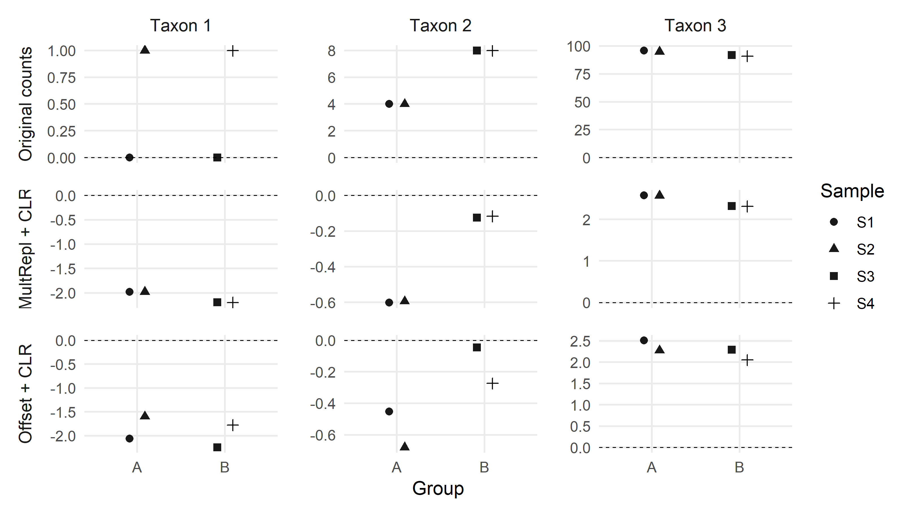
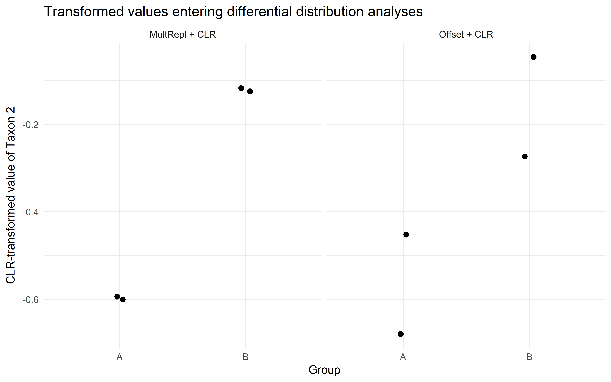

Mini example: zero replacement before CLR transformation
================
Compiled at 2026-06-02 09:46:26 UTC

# Aim

This file reproduces the small toy example used to compare
multiplicative replacement and additive offset replacement before
applying the centered log-ratio (CLR) transformation.

The example is not intended as a simulation study. Its purpose is to
show that the two replacement strategies can lead to different
transformed values and therefore affect downstream quantities such as
Aitchison distances, marginal transformed values, group contrasts, and
pairwise log-ratios used in association or proportionality analyses.

# Packages

# Helper functions

# Original toy data

| sample | group | Taxon 1 | Taxon 2 | Taxon 3 | sum |
|:-------|:------|--------:|--------:|--------:|----:|
| S1     | A     |       0 |       4 |      96 | 100 |
| S2     | A     |       1 |       4 |      95 | 100 |
| S3     | B     |       0 |       8 |      92 | 100 |
| S4     | B     |       1 |       8 |      91 | 100 |

Original toy count data.

# Replacement strategies

The multiplicative replacement uses a small value $\delta$ for zeros and
rescales the positive components so that the sample sum is preserved.
The additive offset replacement adds $\delta$ to all components.

| sample | group | Taxon 1 | Taxon 2 | Taxon 3 | sum |
|:-------|:------|--------:|--------:|--------:|----:|
| S1     | A     |       1 |    3.96 |   95.04 | 100 |
| S2     | A     |       1 |    4.00 |   95.00 | 100 |
| S3     | B     |       1 |    7.92 |   91.08 | 100 |
| S4     | B     |       1 |    8.00 |   91.00 | 100 |

Toy data after multiplicative replacement with delta = 1.

| sample | group | Taxon 1 | Taxon 2 | Taxon 3 | sum |
|:-------|:------|--------:|--------:|--------:|----:|
| S1     | A     |       1 |       5 |      97 | 103 |
| S2     | A     |       2 |       5 |      96 | 103 |
| S3     | B     |       1 |       9 |      93 | 103 |
| S4     | B     |       2 |       9 |      92 | 103 |

Toy data after additive offset replacement with delta = 1.

# CLR-transformed values

| sample | group | Taxon 1 | Taxon 2 | Taxon 3 | sum |
|:-------|:------|--------:|--------:|--------:|----:|
| S1     | A     |  -1.977 |  -0.601 |   2.577 |   0 |
| S2     | A     |  -1.980 |  -0.594 |   2.574 |   0 |
| S3     | B     |  -2.194 |  -0.124 |   2.318 |   0 |
| S4     | B     |  -2.197 |  -0.117 |   2.314 |   0 |

CLR values after multiplicative replacement.

| sample | group | Taxon 1 | Taxon 2 | Taxon 3 | sum |
|:-------|:------|--------:|--------:|--------:|----:|
| S1     | A     |  -2.061 |  -0.452 |   2.513 |   0 |
| S2     | A     |  -1.596 |  -0.680 |   2.275 |   0 |
| S3     | B     |  -2.243 |  -0.046 |   2.289 |   0 |
| S4     | B     |  -1.778 |  -0.273 |   2.051 |   0 |

CLR values after additive offset replacement.

# Visualization of all transformed values

<!-- -->

# Distance-based analysis

We compare samples S1 and S2. These samples are nearly identical after
multiplicative replacement but differ more clearly after additive offset
replacement.

| comparison | Multiplicative replacement + CLR | Additive offset + CLR |
|:-----------|---------------------------------:|----------------------:|
| S1 vs S2   |                            0.008 |                  0.57 |

Euclidean distances between CLR-transformed samples S1 and S2.

# Differential distribution example

For differential distribution analyses of transformed taxa, the
transformed values themselves are the object of comparison. Here we
inspect the CLR-transformed values of Taxon 2.

| sample | group | original_count | clr_mult | clr_add |
|:-------|:------|---------------:|---------:|--------:|
| S1     | A     |              4 |   -0.601 |  -0.452 |
| S2     | A     |              4 |   -0.594 |  -0.680 |
| S3     | B     |              8 |   -0.124 |  -0.046 |
| S4     | B     |              8 |   -0.117 |  -0.273 |

CLR-transformed values of Taxon 2 under the two replacement strategies.

<!-- -->

# Differential abundance-style group contrast

A simple feature-level group comparison on the CLR scale can be
represented by the difference between the mean transformed values in
group B and group A. This is not a realistic differential abundance
test, because the toy data contain only two samples per group. It
illustrates only that the transformed group difference depends on the
zero-handling strategy.

| method         | group_difference_B_minus_A |
|:---------------|---------------------------:|
| MultRepl + CLR |                      0.476 |
| Offset + CLR   |                      0.406 |

Difference in mean CLR-transformed values of Taxon 2 between groups B
and A.

# Association and proportionality example

For association and proportionality analyses, pairwise log-ratios and
their variation across samples are central. We compare Taxon 2 and Taxon
3, which are positive in all four samples. Multiplicative replacement
preserves their ratios, whereas additive offset replacement changes
them.

| sample | group | original_logratio_T2_T3 | mult_logratio_T2_T3 | add_logratio_T2_T3 | mult_clr_difference_T2_T3 | add_clr_difference_T2_T3 |
|:---|:---|---:|---:|---:|---:|---:|
| S1 | A | -3.178 | -3.178 | -2.965 | -3.178 | -2.965 |
| S2 | A | -3.168 | -3.168 | -2.955 | -3.168 | -2.955 |
| S3 | B | -2.442 | -2.442 | -2.335 | -2.442 | -2.335 |
| S4 | B | -2.431 | -2.431 | -2.325 | -2.431 | -2.325 |

Sample-wise log-ratios between Taxon 2 and Taxon 3.

| method         | variance_logratio_T2_T3 |
|:---------------|------------------------:|
| Original       |                  0.1806 |
| MultRepl + CLR |                  0.1806 |
| Offset + CLR   |                  0.1324 |

Variance of the log-ratio between Taxon 2 and Taxon 3.

## Files written

These files have been written to the target directory,
`data/CLR_mini_example`:

    ## # A tibble: 0 × 4
    ## # ℹ 4 variables: path <fs::path>, type <fct>, size <fs::bytes>, modification_time <dttm>
