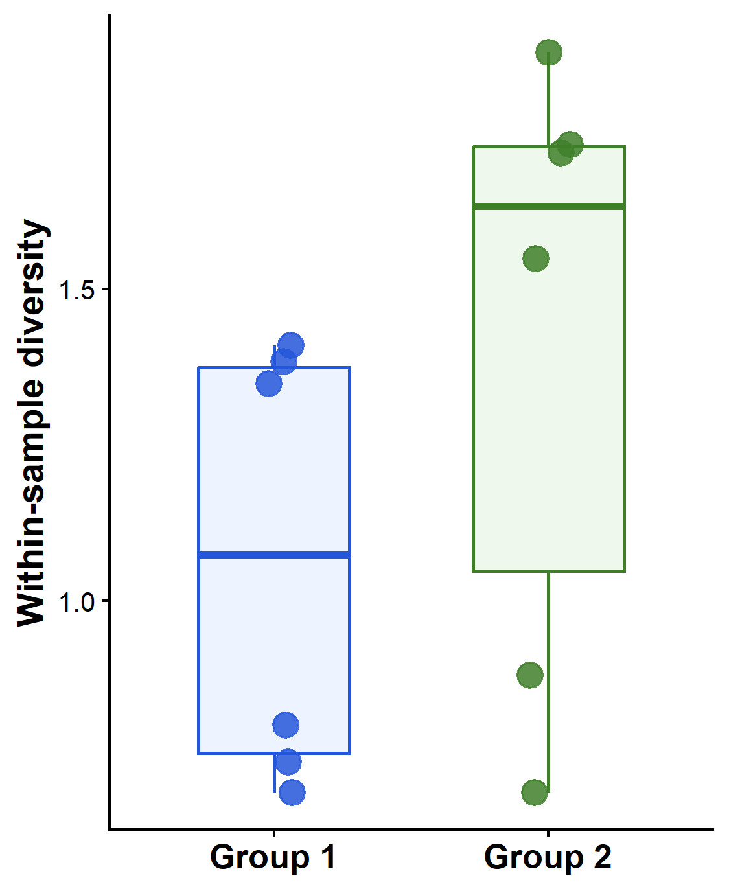
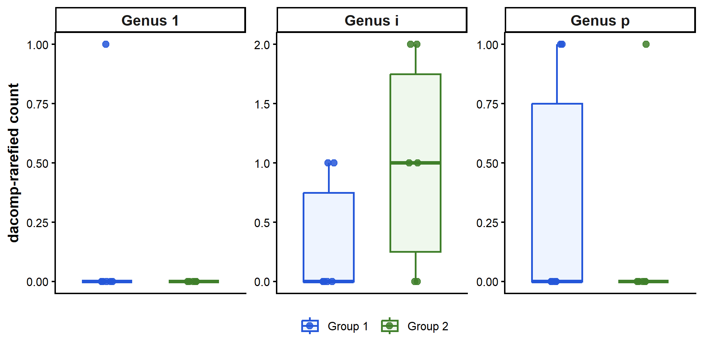
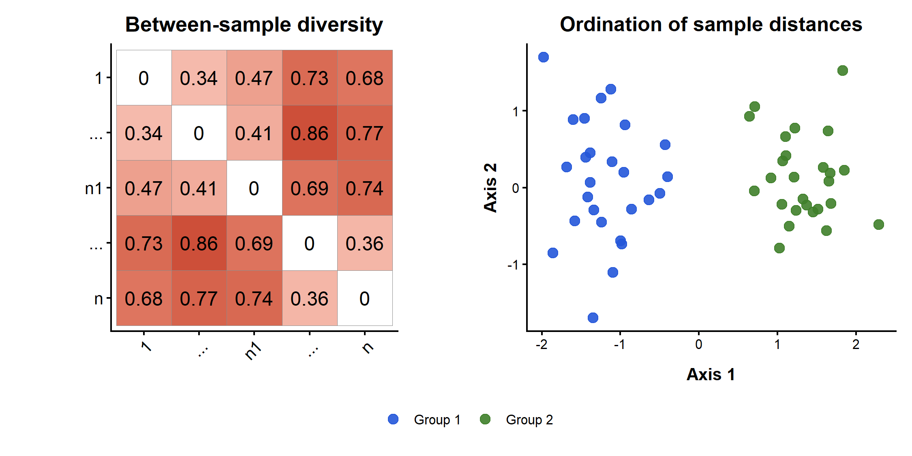
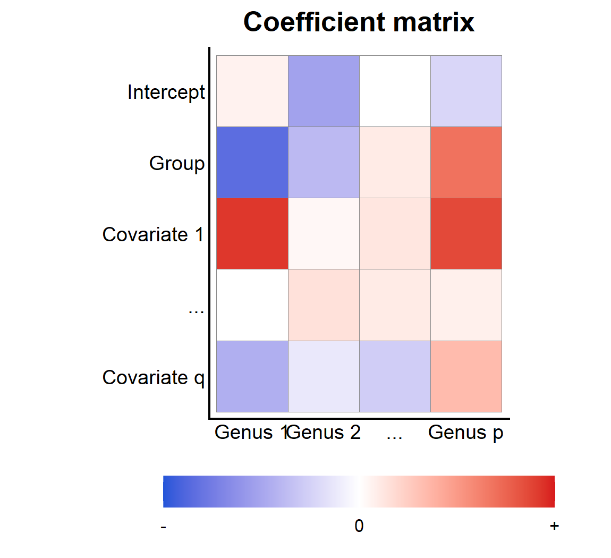
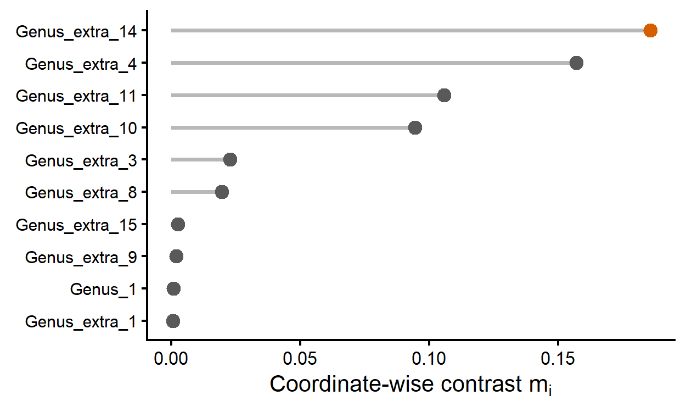

Example used for the overview figures
================
Compiled at 2026-07-05 15:35:06 UTC

``` r
here::i_am(paste0(params$name, ".Rmd"), uuid = "5b90232d-7e46-48b6-b05c-dbaebffebb89")
```

This script generates some example data used for the overview figures.

    ## Warning: package 'zCompositions' was built under R version 4.5.3

    ## Loading required package: MASS

    ## 
    ## Attaching package: 'MASS'

    ## The following object is masked from 'package:patchwork':
    ## 
    ##     area

    ## Loading required package: truncnorm

    ## Warning: package 'truncnorm' was built under R version 4.5.3

    ## Loading required package: survival

## Original data set

    ##      Genus_1 Genus_i Genus_p Genus_extra_1 Genus_extra_2 Genus_extra_3
    ## 1        127       3       8             1             0             0
    ## ...        0       0      10             0            79            37
    ## k          0      15       4             0             3             2
    ## m          0       0       1             1             0             0
    ## ...        2      18       0             0             0            40
    ## n1       242       1       0             0             0            10
    ## n1+1       5      24       0             0             0             4
    ## n1+2       0       1       0             1             0             0
    ## ...        8      20       0             0             0             2
    ## l          0      37      14             0             0             0
    ## ...       19      11       0             0             0           102
    ## n         14       2       3             2             0            34
    ##      Genus_extra_4 Genus_extra_5 Genus_extra_6 Genus_extra_7 Genus_extra_8
    ## 1                0             0             3             0             2
    ## ...              0             0             0             0             0
    ## k                0             0             0             0             0
    ## m                0             0             0             0             0
    ## ...              0             0             0             0             9
    ## n1               0             0             5             0             0
    ## n1+1             0             0             0             0            18
    ## n1+2             0             0             0             0             0
    ## ...              0             0             0             3             3
    ## l                2             0             1             0             0
    ## ...              0             0             8             0             0
    ## n                0             0            10             3             0
    ##      Genus_extra_9 Genus_extra_10 Genus_extra_11 Genus_extra_12 Genus_extra_13
    ## 1                0              9              0              0              0
    ## ...              0             41              0              0              0
    ## k                0              6              0              0              0
    ## m                0              0              0              0              0
    ## ...              0              0              0              0              0
    ## n1               3              0              8              0              0
    ## n1+1             1              2              0              0              0
    ## n1+2             0              0              0              0              0
    ## ...              0              8              3              0              0
    ## l                0              0              1              0              0
    ## ...              2             62              0              0              0
    ## n                0              0              0              0              0
    ##      Genus_extra_14 Genus_extra_15 Genus_extra_16 Genus_extra_17
    ## 1                 0              3              0              0
    ## ...               0              8              0              4
    ## k                 0              0              0              0
    ## m                 0              0              0              0
    ## ...               7              4              0              0
    ## n1                0             14              2              4
    ## n1+1              4             22              0              1
    ## n1+2              0              0              0              0
    ## ...               0              0              0              2
    ## l                 0              0              0              0
    ## ...               0             14              2              7
    ## n                 0             15              3              7

**Genera shown in the thesis:**

    ##      Genus_1 Genus_i Genus_p
    ## 1        127       3       8
    ## ...        0       0      10
    ## k          0      15       4
    ## m          0       0       1
    ## ...        2      18       0
    ## n1       242       1       0
    ## n1+1       5      24       0
    ## n1+2       0       1       0
    ## ...        8      20       0
    ## l          0      37      14
    ## ...       19      11       0
    ## n         14       2       3

## Alpha diversity

    ##    sample   group shannon
    ## 1       1 Group 1    0.80
    ## 2     ... Group 1    1.41
    ## 3       k Group 1    1.35
    ## 4       m Group 1    0.69
    ## 5     ... Group 1    1.38
    ## 6      n1 Group 1    0.74
    ## 7    n1+1 Group 2    1.72
    ## 8    n1+2 Group 2    0.69
    ## 9     ... Group 2    1.73
    ## 10      l Group 2    0.88
    ## 11    ... Group 2    1.55
    ## 12      n Group 2    1.88

<!-- -->

## Total sum scaling

    ##      Genus_1 Genus_i Genus_p Genus_extra_1 Genus_extra_2 Genus_extra_3
    ## 1      0.814   0.019   0.051         0.006         0.000         0.000
    ## ...    0.000   0.000   0.056         0.000         0.441         0.207
    ## k      0.000   0.500   0.133         0.000         0.100         0.067
    ## m      0.000   0.000   0.500         0.500         0.000         0.000
    ## ...    0.025   0.225   0.000         0.000         0.000         0.500
    ## n1     0.837   0.003   0.000         0.000         0.000         0.035
    ## n1+1   0.062   0.296   0.000         0.000         0.000         0.049
    ## n1+2   0.000   0.500   0.000         0.500         0.000         0.000
    ## ...    0.163   0.408   0.000         0.000         0.000         0.041
    ## l      0.000   0.673   0.255         0.000         0.000         0.000
    ## ...    0.084   0.048   0.000         0.000         0.000         0.449
    ## n      0.151   0.022   0.032         0.022         0.000         0.366
    ##      Genus_extra_4 Genus_extra_5 Genus_extra_6 Genus_extra_7 Genus_extra_8
    ## 1            0.000             0         0.019         0.000         0.013
    ## ...          0.000             0         0.000         0.000         0.000
    ## k            0.000             0         0.000         0.000         0.000
    ## m            0.000             0         0.000         0.000         0.000
    ## ...          0.000             0         0.000         0.000         0.112
    ## n1           0.000             0         0.017         0.000         0.000
    ## n1+1         0.000             0         0.000         0.000         0.222
    ## n1+2         0.000             0         0.000         0.000         0.000
    ## ...          0.000             0         0.000         0.061         0.061
    ## l            0.036             0         0.018         0.000         0.000
    ## ...          0.000             0         0.035         0.000         0.000
    ## n            0.000             0         0.108         0.032         0.000
    ##      Genus_extra_9 Genus_extra_10 Genus_extra_11 Genus_extra_12 Genus_extra_13
    ## 1            0.000          0.058          0.000              0              0
    ## ...          0.000          0.229          0.000              0              0
    ## k            0.000          0.200          0.000              0              0
    ## m            0.000          0.000          0.000              0              0
    ## ...          0.000          0.000          0.000              0              0
    ## n1           0.010          0.000          0.028              0              0
    ## n1+1         0.012          0.025          0.000              0              0
    ## n1+2         0.000          0.000          0.000              0              0
    ## ...          0.000          0.163          0.061              0              0
    ## l            0.000          0.000          0.018              0              0
    ## ...          0.009          0.273          0.000              0              0
    ## n            0.000          0.000          0.000              0              0
    ##      Genus_extra_14 Genus_extra_15 Genus_extra_16 Genus_extra_17
    ## 1             0.000          0.019          0.000          0.000
    ## ...           0.000          0.045          0.000          0.022
    ## k             0.000          0.000          0.000          0.000
    ## m             0.000          0.000          0.000          0.000
    ## ...           0.088          0.050          0.000          0.000
    ## n1            0.000          0.048          0.007          0.014
    ## n1+1          0.049          0.272          0.000          0.012
    ## n1+2          0.000          0.000          0.000          0.000
    ## ...           0.000          0.000          0.000          0.041
    ## l             0.000          0.000          0.000          0.000
    ## ...           0.000          0.062          0.009          0.031
    ## n             0.000          0.161          0.032          0.075

**Genera shown in the thesis:**

    ##      Genus_1 Genus_i Genus_p
    ## 1      0.814   0.019   0.051
    ## ...    0.000   0.000   0.056
    ## k      0.000   0.500   0.133
    ## m      0.000   0.000   0.500
    ## ...    0.025   0.225   0.000
    ## n1     0.837   0.003   0.000
    ## n1+1   0.062   0.296   0.000
    ## n1+2   0.000   0.500   0.000
    ## ...    0.163   0.408   0.000
    ## l      0.000   0.673   0.255
    ## ...    0.084   0.048   0.000
    ## n      0.151   0.022   0.032

## Multiplicative replacement

    ## [1] "Row sums: "

    ##    1  ...    k    m  ...   n1 n1+1 n1+2  ...    l  ...    n 
    ##    1    1    1    1    1    1    1    1    1    1    1    1

    ##      Genus_1 Genus_i Genus_p Genus_extra_1 Genus_extra_2 Genus_extra_3
    ## 1      0.792   0.019   0.050         0.006         0.002         0.002
    ## ...    0.002   0.002   0.054         0.002         0.427         0.200
    ## k      0.002   0.483   0.129         0.002         0.097         0.064
    ## m      0.002   0.002   0.480         0.480         0.002         0.002
    ## ...    0.024   0.218   0.002         0.002         0.002         0.484
    ## n1     0.817   0.003   0.002         0.002         0.002         0.034
    ## n1+1   0.060   0.289   0.002         0.002         0.002         0.048
    ## n1+2   0.002   0.480   0.002         0.480         0.002         0.002
    ## ...    0.159   0.397   0.002         0.002         0.002         0.040
    ## l      0.002   0.650   0.246         0.002         0.002         0.002
    ## ...    0.082   0.047   0.002         0.002         0.002         0.438
    ## n      0.147   0.021   0.032         0.021         0.002         0.357
    ##      Genus_extra_4 Genus_extra_5 Genus_extra_6 Genus_extra_7 Genus_extra_8
    ## 1            0.002         0.002         0.019         0.002         0.012
    ## ...          0.002         0.002         0.002         0.002         0.002
    ## k            0.002         0.002         0.002         0.002         0.002
    ## m            0.002         0.002         0.002         0.002         0.002
    ## ...          0.002         0.002         0.002         0.002         0.109
    ## n1           0.002         0.002         0.017         0.002         0.002
    ## n1+1         0.002         0.002         0.002         0.002         0.217
    ## n1+2         0.002         0.002         0.002         0.002         0.002
    ## ...          0.002         0.002         0.002         0.060         0.060
    ## l            0.035         0.002         0.018         0.002         0.002
    ## ...          0.002         0.002         0.034         0.002         0.002
    ## n            0.002         0.002         0.105         0.032         0.002
    ##      Genus_extra_9 Genus_extra_10 Genus_extra_11 Genus_extra_12 Genus_extra_13
    ## 1            0.002          0.056          0.002          0.002          0.002
    ## ...          0.002          0.222          0.002          0.002          0.002
    ## k            0.002          0.193          0.002          0.002          0.002
    ## m            0.002          0.002          0.002          0.002          0.002
    ## ...          0.002          0.002          0.002          0.002          0.002
    ## n1           0.010          0.002          0.027          0.002          0.002
    ## n1+1         0.012          0.024          0.002          0.002          0.002
    ## n1+2         0.002          0.002          0.002          0.002          0.002
    ## ...          0.002          0.159          0.060          0.002          0.002
    ## l            0.002          0.002          0.018          0.002          0.002
    ## ...          0.009          0.266          0.002          0.002          0.002
    ## n            0.002          0.002          0.002          0.002          0.002
    ##      Genus_extra_14 Genus_extra_15 Genus_extra_16 Genus_extra_17
    ## 1             0.002          0.019          0.002          0.002
    ## ...           0.002          0.043          0.002          0.022
    ## k             0.002          0.002          0.002          0.002
    ## m             0.002          0.002          0.002          0.002
    ## ...           0.085          0.048          0.002          0.002
    ## n1            0.002          0.047          0.007          0.013
    ## n1+1          0.048          0.265          0.002          0.012
    ## n1+2          0.002          0.002          0.002          0.002
    ## ...           0.002          0.002          0.002          0.040
    ## l             0.002          0.002          0.002          0.002
    ## ...           0.002          0.060          0.009          0.030
    ## n             0.002          0.158          0.032          0.074

**Genera shown in the thesis:**

    ##      Genus_1 Genus_i Genus_p
    ## 1      0.792   0.019   0.050
    ## ...    0.002   0.002   0.054
    ## k      0.002   0.483   0.129
    ## m      0.002   0.002   0.480
    ## ...    0.024   0.218   0.002
    ## n1     0.817   0.003   0.002
    ## n1+1   0.060   0.289   0.002
    ## n1+2   0.002   0.480   0.002
    ## ...    0.159   0.397   0.002
    ## l      0.002   0.650   0.246
    ## ...    0.082   0.047   0.002
    ## n      0.147   0.021   0.032

## CLR transformation

    ##      Genus_1 Genus_i Genus_p Genus_extra_1 Genus_extra_2 Genus_extra_3
    ## 1      4.801   1.055   2.036        -0.043        -1.063        -1.063
    ## ...   -1.136  -1.136   2.044        -1.136         4.111         3.352
    ## k     -1.049   4.320   2.999        -1.049         2.711         2.306
    ## m     -0.536  -0.536   4.826         4.826        -0.536        -0.536
    ## ...    1.231   3.429  -1.145        -1.145        -1.145         4.227
    ## n1     4.847  -0.642  -1.047        -1.047        -1.047         1.661
    ## n1+1   1.820   3.389  -1.467        -1.467        -1.467         1.597
    ## n1+2  -0.536   4.826  -0.536         4.826        -0.536        -0.536
    ## ...    2.794   3.711  -1.463        -1.463        -1.463         1.408
    ## l     -0.861   4.805   3.834        -0.861        -0.861        -0.861
    ## ...    2.193   1.647  -1.399        -1.399        -1.399         3.874
    ## n      2.520   0.574   0.979         0.574        -1.661         3.407
    ##      Genus_extra_4 Genus_extra_5 Genus_extra_6 Genus_extra_7 Genus_extra_8
    ## 1           -1.063        -1.063         1.055        -1.063         0.650
    ## ...         -1.136        -1.136        -1.136        -1.136        -1.136
    ## k           -1.049        -1.049        -1.049        -1.049        -1.049
    ## m           -0.536        -0.536        -0.536        -0.536        -0.536
    ## ...         -1.145        -1.145        -1.145        -1.145         2.735
    ## n1          -1.047        -1.047         0.968        -1.047        -1.047
    ## n1+1        -1.467        -1.467        -1.467        -1.467         3.101
    ## n1+2        -0.536        -0.536        -0.536        -0.536        -0.536
    ## ...         -1.463        -1.463        -1.463         1.814         1.814
    ## l            1.888        -0.861         1.195        -0.861        -0.861
    ## ...         -1.399        -1.399         1.328        -1.399        -1.399
    ## n           -1.661        -1.661         2.183         0.979        -1.661
    ##      Genus_extra_9 Genus_extra_10 Genus_extra_11 Genus_extra_12 Genus_extra_13
    ## 1           -1.063          2.154         -1.063         -1.063         -1.063
    ## ...         -1.136          3.455         -1.136         -1.136         -1.136
    ## k           -1.049          3.404         -1.049         -1.049         -1.049
    ## m           -0.536         -0.536         -0.536         -0.536         -0.536
    ## ...         -1.145         -1.145         -1.145         -1.145         -1.145
    ## n1           0.457         -1.047          1.438         -1.047         -1.047
    ## n1+1         0.211          0.904         -1.467         -1.467         -1.467
    ## n1+2        -0.536         -0.536         -0.536         -0.536         -0.536
    ## ...         -1.463          2.794          1.814         -1.463         -1.463
    ## l           -0.861         -0.861          1.195         -0.861         -0.861
    ## ...         -0.058          3.376         -1.399         -1.399         -1.399
    ## n           -1.661         -1.661         -1.661         -1.661         -1.661
    ##      Genus_extra_14 Genus_extra_15 Genus_extra_16 Genus_extra_17
    ## 1            -1.063          1.055         -1.063         -1.063
    ## ...          -1.136          1.821         -1.136          1.128
    ## k            -1.049         -1.049         -1.049         -1.049
    ## m            -0.536         -0.536         -0.536         -0.536
    ## ...           2.484          1.924         -1.145         -1.145
    ## n1           -1.047          1.997          0.051          0.745
    ## n1+1          1.597          3.302         -1.467          0.211
    ## n1+2         -0.536         -0.536         -0.536         -0.536
    ## ...          -1.463         -1.463         -1.463          1.408
    ## l            -0.861         -0.861         -0.861         -0.861
    ## ...          -1.399          1.888         -0.058          1.195
    ## n            -1.661          2.589          0.979          1.827

**Genera shown in the thesis:**

    ##      Genus_1 Genus_i Genus_p
    ## 1      4.801   1.055   2.036
    ## ...   -1.136  -1.136   2.044
    ## k     -1.049   4.320   2.999
    ## m     -0.536  -0.536   4.826
    ## ...    1.231   3.429  -1.145
    ## n1     4.847  -0.642  -1.047
    ## n1+1   1.820   3.389  -1.467
    ## n1+2  -0.536   4.826  -0.536
    ## ...    2.794   3.711  -1.463
    ## l     -0.861   4.805   3.834
    ## ...    2.193   1.647  -1.399
    ## n      2.520   0.574   0.979

## Differential abundance with dacomp

    ##      Genus_1 Genus_i Genus_p Genus_extra_1 Genus_extra_2 Genus_extra_3
    ## 1          1       0       0             0             0             0
    ## ...        0       0       0             0             1             1
    ## k          0       1       1             0             1             0
    ## m          0       0       1             0             0             0
    ## ...        0       1       0             0             0             1
    ## n1         0       0       0             0             0             0
    ## n1+1       0       2       0             0             0             0
    ## n1+2       0       1       0             1             0             0
    ## ...        0       2       0             0             0             1
    ## l          0       1       1             0             0             0
    ## ...        0       0       0             0             0             1
    ## n          0       0       0             0             0             1
    ##      Genus_extra_4 Genus_extra_5 Genus_extra_6 Genus_extra_7 Genus_extra_8
    ## 1                0             0             1             0             0
    ## ...              0             0             0             0             0
    ## k                0             0             0             0             0
    ## m                0             0             0             0             0
    ## ...              0             0             0             0             1
    ## n1               0             0             0             0             0
    ## n1+1             0             0             0             0             1
    ## n1+2             0             0             0             0             0
    ## ...              0             0             0             0             0
    ## l                0             0             0             0             0
    ## ...              0             0             0             0             0
    ## n                0             0             0             1             0
    ##      Genus_extra_9 Genus_extra_10 Genus_extra_11 Genus_extra_12 Genus_extra_13
    ## 1                0              0              0              0              0
    ## ...              0              0              0              0              0
    ## k                0              0              0              0              0
    ## m                0              0              0              0              0
    ## ...              0              0              0              0              0
    ## n1               1              0              0              0              0
    ## n1+1             0              0              0              0              0
    ## n1+2             0              0              0              0              0
    ## ...              0              1              1              0              0
    ## l                0              0              0              0              0
    ## ...              0              1              0              0              0
    ## n                0              0              0              0              0
    ##      Genus_extra_14 Genus_extra_15 Genus_extra_16 Genus_extra_17
    ## 1                 0              0              0              0
    ## ...               0              0              0              1
    ## k                 0              0              0              0
    ## m                 0              0              0              0
    ## ...               1              0              0              0
    ## n1                0              0              0              0
    ## n1+1              0              0              0              0
    ## n1+2              0              0              0              0
    ## ...               0              0              0              0
    ## l                 0              0              0              0
    ## ...               0              1              0              0
    ## n                 0              0              0              0

**Genera shown in the thesis:**

    ##      Genus_1 Genus_i Genus_p
    ## 1          1       0       0
    ## ...        0       0       0
    ## k          0       1       1
    ## m          0       0       1
    ## ...        0       1       0
    ## n1         0       0       0
    ## n1+1       0       2       0
    ## n1+2       0       1       0
    ## ...        0       2       0
    ## l          0       1       1
    ## ...        0       0       0
    ## n          0       0       0

<!-- -->

## Beta diversity

    ##          1   ...     k     m   ...    n1  n1+1  n1+2   ...     l   ...     n
    ## 1     0.00 10.13  9.26  8.92  9.55  6.92  8.14  9.49  8.36  8.91  7.72  8.37
    ## ...  10.13  0.00  6.84 10.44 10.93 10.52 10.65 11.96 11.16 11.47  8.39 10.15
    ## k     9.26  6.84  0.00  9.96  9.91 11.68 10.06  9.23  9.27  7.81  8.87 11.08
    ## m     8.92 10.44  9.96  0.00 11.97 10.99 12.17  7.58 12.33  8.67 12.00  9.95
    ## ...   9.55 10.93  9.91 11.97  0.00  9.04  4.37  9.70  8.88 10.48  8.45  9.27
    ## n1    6.92 10.52 11.68 10.99  9.04  0.00  8.58 10.79  8.95 10.71  6.83  6.46
    ## n1+1  8.14 10.65 10.06 12.17  4.37  8.58  0.00  9.81  8.01 10.76  7.52  9.69
    ## n1+2  9.49 11.96  9.23  7.58  9.70 10.79  9.81  0.00  9.83  8.05 10.55 10.17
    ## ...   8.36 11.16  9.27 12.33  8.88  8.95  8.01  9.83  0.00 10.13  8.06 10.24
    ## l     8.91 11.47  7.81  8.67 10.48 10.71 10.76  8.05 10.13  0.00 10.95 10.51
    ## ...   7.72  8.39  8.87 12.00  8.45  6.83  7.52 10.55  8.06 10.95  0.00  6.92
    ## n     8.37 10.15 11.08  9.95  9.27  6.46  9.69 10.17 10.24 10.51  6.92  0.00

<!-- -->

## Regression

    ##             Genus 1 Genus 2   ... Genus p
    ## Intercept      0.05   -0.42  0.00   -0.18
    ## Group         -0.68   -0.31  0.08    0.55
    ## Covariate 1    0.74    0.03  0.10    0.69
    ## ...            0.00    0.12  0.08    0.06
    ## Covariate q   -0.36   -0.10 -0.22    0.27

<!-- -->

## Compositional equivalence

    ##         Genus_1 Genus_i Genus_p Genus_extra_1 Genus_extra_2 Genus_extra_3
    ## Group 1   1.360   1.082   1.619         0.067         0.505         1.658
    ## Group 2   1.322   3.159  -0.009         0.035        -1.231         1.481
    ##         Genus_extra_4 Genus_extra_5 Genus_extra_6 Genus_extra_7 Genus_extra_8
    ## Group 1        -0.996        -0.996        -0.307        -0.996        -0.064
    ## Group 2        -0.773        -1.231         0.207        -0.245         0.076
    ##         Genus_extra_9 Genus_extra_10 Genus_extra_11 Genus_extra_12
    ## Group 1        -0.746          1.047         -0.582         -0.996
    ## Group 2        -0.728          0.669         -0.342         -1.231
    ##         Genus_extra_13 Genus_extra_14 Genus_extra_15 Genus_extra_16
    ## Group 1         -0.996         -0.391          0.869         -0.813
    ## Group 2         -1.231         -0.720          0.820         -0.568
    ##         Genus_extra_17
    ## Group 1         -0.320
    ## Group 2          0.541

**Genera shown in the thesis:**

    ##         Genus_1 Genus_i Genus_p
    ## Group 1   1.360   1.082   1.619
    ## Group 2   1.322   3.159  -0.009

    ## [1] 3.289322

    ##             genus mean_group1 mean_group2 mean_diff_clr standardized_diff
    ## 5   Genus_extra_2  0.50492317 -1.23111756    1.73604074        1.04711070
    ## 2         Genus_i  1.08159944  3.15869023   -2.07709079       -1.02176585
    ## 20 Genus_extra_17 -0.32031568  0.54051159   -0.86082727       -0.81675498
    ## 10  Genus_extra_7 -0.99634060 -0.24493168   -0.75140892       -0.77969413
    ## 3         Genus_p  1.61875478 -0.00860277    1.62735755        0.73154846
    ## 8   Genus_extra_5 -0.99634060 -1.23111756    0.23477697        0.67624438
    ## 15 Genus_extra_12 -0.99634060 -1.23111756    0.23477697        0.67624438
    ## 16 Genus_extra_13 -0.99634060 -1.23111756    0.23477697        0.67624438
    ## 9   Genus_extra_6 -0.30737818  0.20665805   -0.51403623       -0.38577502
    ## 19 Genus_extra_16 -0.81319419 -0.56764600   -0.24554819       -0.33088227
    ## 17 Genus_extra_14 -0.39149079 -0.72045037    0.32895958        0.24880484
    ## 7   Genus_extra_4 -0.99634060 -0.77300017   -0.22334042       -0.22871061
    ## 14 Genus_extra_11 -0.58214513 -0.34241786   -0.23972727       -0.18763959
    ## 13 Genus_extra_10  1.04733801  0.66932720    0.37801081        0.17740801
    ## 6   Genus_extra_3  1.65765474  1.48147949    0.17617525        0.08688052
    ## 11  Genus_extra_8 -0.06408168  0.07633604   -0.14041772       -0.08070268
    ## 18 Genus_extra_15  0.86868407  0.81970388    0.04898020        0.02861973
    ## 12  Genus_extra_9 -0.74561667 -0.72810692   -0.01750976       -0.02529592
    ## 1         Genus_1  1.35952357  1.32174630    0.03777726        0.01649089
    ## 4   Genus_extra_1  0.06744753  0.03517324    0.03227429        0.01332377
    ##             m_i valid_genus
    ## 5  3.2893224320        TRUE
    ## 2  3.1320163727        TRUE
    ## 20 2.0012660679        TRUE
    ## 10 1.8237688186        TRUE
    ## 3  1.6054894590        TRUE
    ## 8  1.3719193805        TRUE
    ## 15 1.3719193805        TRUE
    ## 16 1.3719193805        TRUE
    ## 9  0.4464671042        TRUE
    ## 19 0.3284492248        TRUE
    ## 17 0.1857115434        TRUE
    ## 7  0.1569256332        TRUE
    ## 14 0.1056258515        TRUE
    ## 13 0.0944208074        TRUE
    ## 6  0.0226446726        TRUE
    ## 11 0.0195387684        TRUE
    ## 18 0.0024572674        TRUE
    ## 12 0.0019196506        TRUE
    ## 1  0.0008158479        TRUE
    ## 4  0.0005325684        TRUE

<!-- -->

## Files written

These files have been written to the target directory,
`data/overview_figure_example`:

    ## # A tibble: 0 × 4
    ## # ℹ 4 variables: path <fs::path>, type <fct>, size <fs::bytes>,
    ## #   modification_time <dttm>
