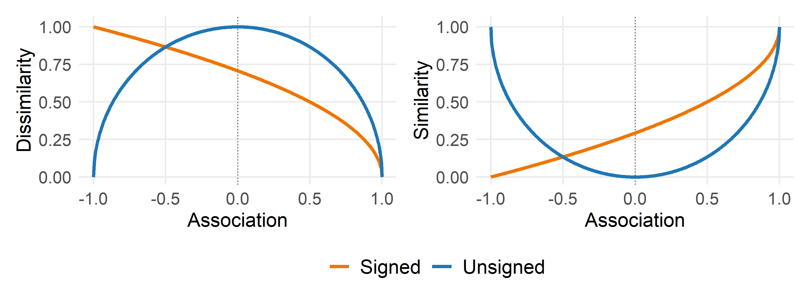
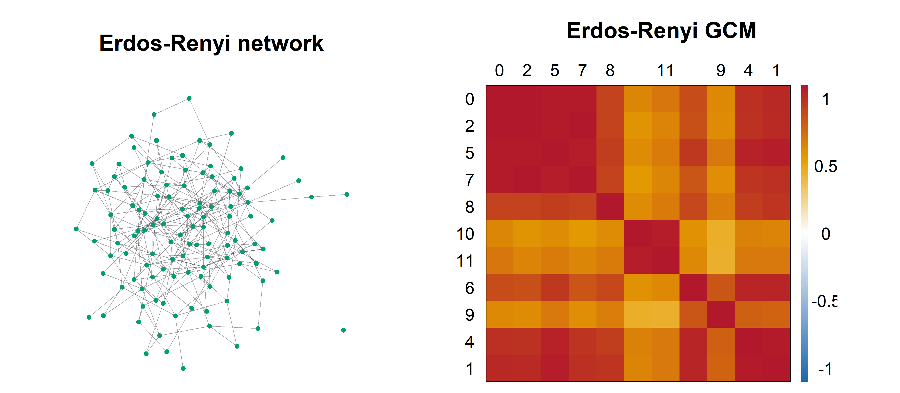
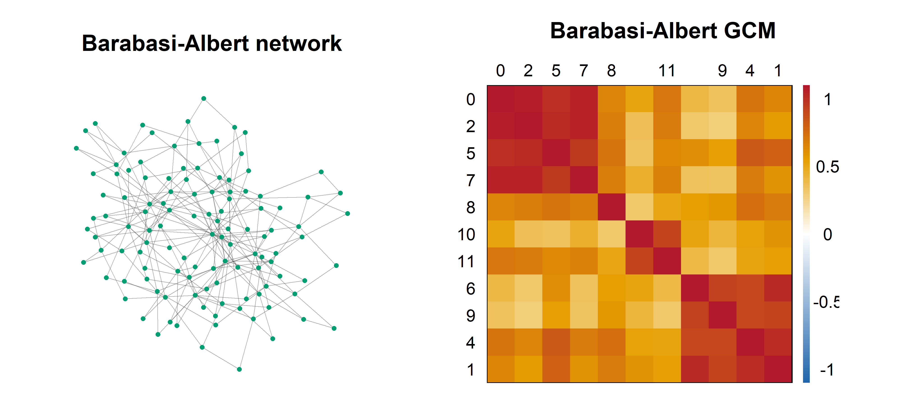
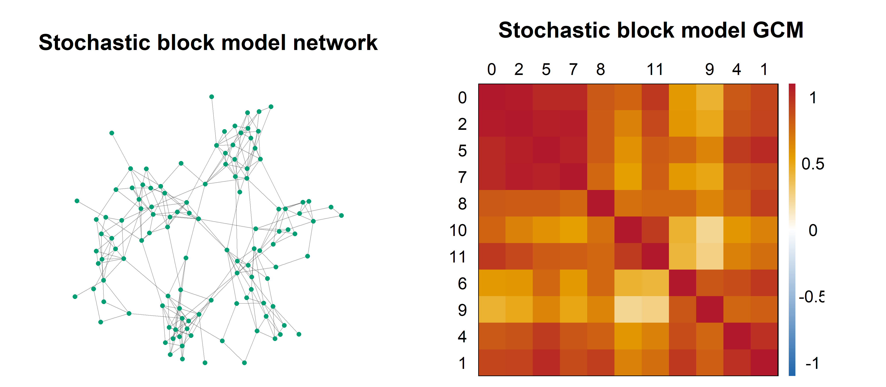
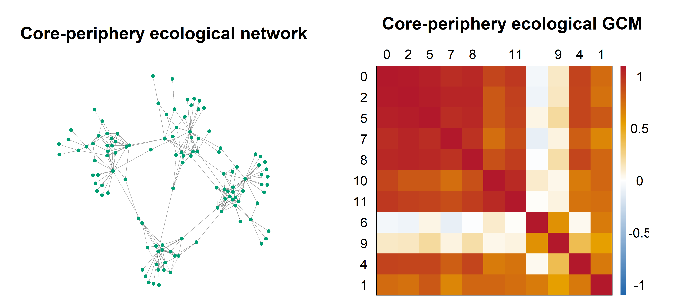
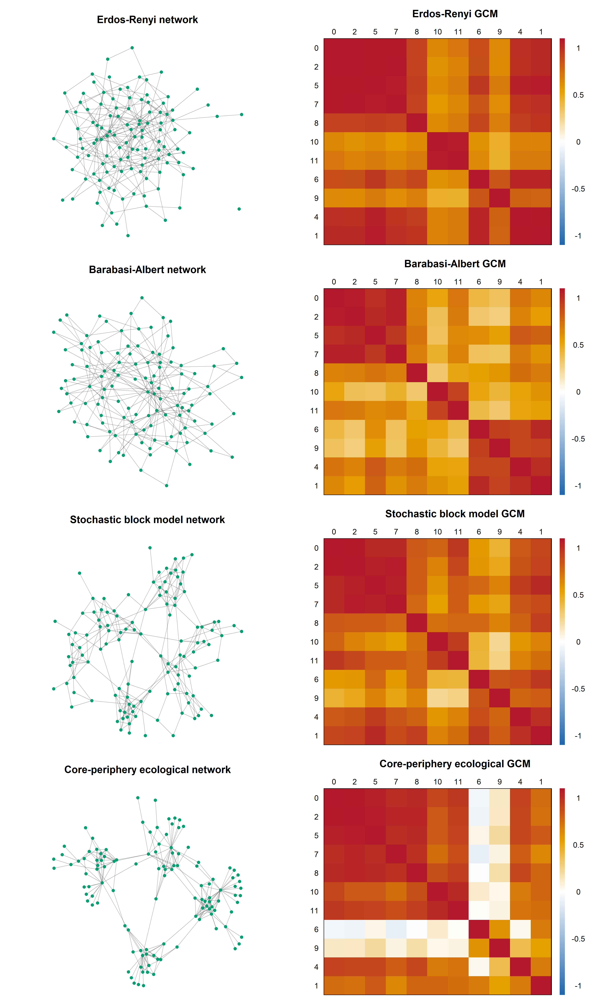
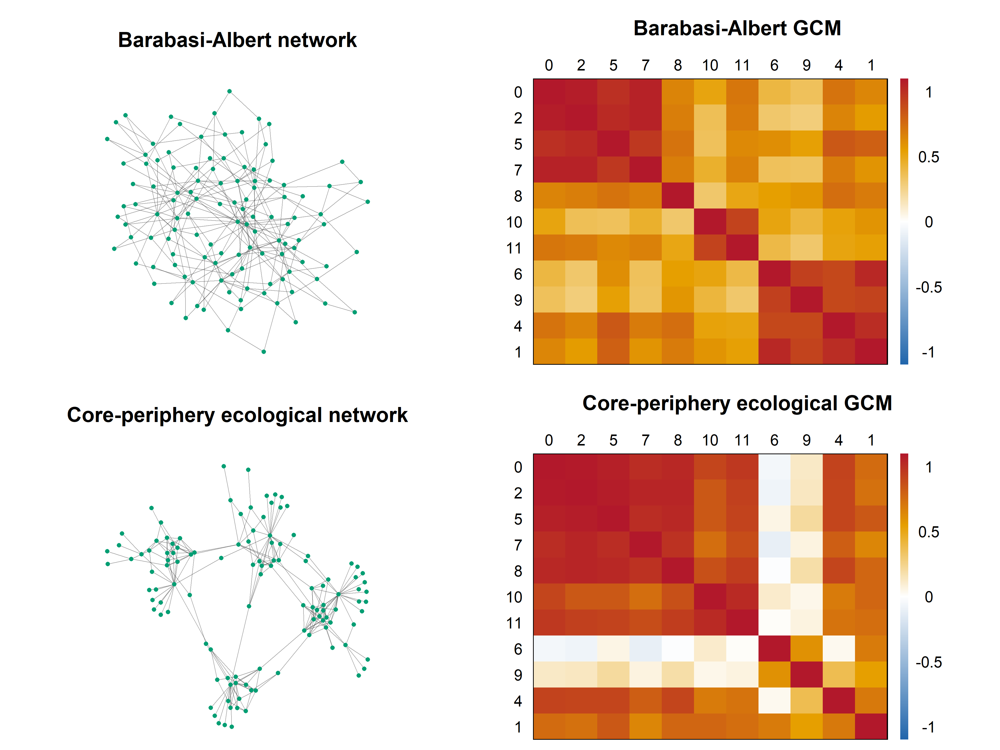

Example figures for the methods chapter
================
Compiled at 2026-06-19 19:50:42 UTC

    ## [conflicted] Removing existing preference.
    ## [conflicted] Will prefer dplyr::filter over any other package.
    ## [conflicted] Removing existing preference.
    ## [conflicted] Will prefer dplyr::mutate over any other package.
    ## [conflicted] Removing existing preference.
    ## [conflicted] Will prefer dplyr::select over any other package.

## Introduction

This script collects small, self-contained figures used to illustrate
concepts in the NetCoMi chapter. The examples are meant to be visually
simple rather than data-driven: each figure isolates one methodological
step so that it can be used as explanatory material in the thesis text
or during a presentation.

## Association transformations

The following plot compares signed and unsigned transformations from
sparse associations to dissimilarities and the corresponding
similarities. The signed transformation treats negative associations as
large dissimilarities and small similarities, whereas the unsigned
transformation uses only association strength.

<!-- -->

## Standard networks and graphlet correlation matrices

The following examples show four standard networks with the same number
of nodes as the filtered genus-level data set used in the application
chapter. An Erdos-Renyi graph is compared with a scale-free
Barabasi-Albert graph and a stochastic block model, which represents a
modular ecological network with denser within-module than between-module
connectivity. The last network adds connector and peripheral taxa to
this modular structure to create a stronger contrast between core/module
and leaf-like graphlet roles. The Erdos-Renyi graph is generated with
the same edge count as the stochastic block model. For each graph, the
corresponding graphlet correlation matrix is computed from the binary
adjacency matrix.

### Erdos-Renyi network

The Erdos-Renyi network is used as a random baseline. Edges are placed
without an explicit preference for hubs or modules, so any local
structure arises from chance rather than from an imposed ecological
organization.

<!-- -->

The GCM shows broadly positive correlations among most graphlet orbits.
This is expected for a random graph of this size and density: nodes with
higher degree also tend to participate more often in many other small
graphlet positions, whereas clear opposing orbit roles are largely
absent.

### Barabasi-Albert network

The Barabasi-Albert network represents a scale-free hub structure. New
nodes preferentially attach to already well-connected nodes, producing a
few hubs and many nodes with low to moderate degree.

<!-- -->

The GCM has more visible block structure than the random baseline.
Orbits associated with hub participation are highly correlated with each
other, while orbits describing peripheral or degree-one roles form a
second group. This matches the interpretation of scale-free networks as
being dominated by hub-related graphlet dependencies.

### Stochastic block model

The stochastic block model represents a modular ecological network.
Edges are more likely within modules than between modules, mimicking
groups of taxa that share similar niches or co-occurrence patterns.

<!-- -->

The GCM reflects the modular structure through correlated groups of
orbits. Dense within-module neighborhoods increase the dependence among
graphlet roles that occur in locally clustered regions, while
between-module links contribute less strongly. The result is more
structured than the Erdos-Renyi baseline but less hub-dominated than the
Barabasi-Albert network.

### Core-periphery ecological network

The core-periphery ecological network combines dense module cores with
connector taxa and many peripheral taxa. This creates a contrast between
taxa embedded in locally dense communities and taxa attached as leaves
or sparse connectors.

<!-- -->

The GCM shows the clearest contrast between graphlet roles. Orbits 0, 2,
5, and 7 describe degree and internal or branching positions in open
structures, while orbits 8, 10, and 11 describe participation in cycle-
or triangle-related structures. In this example, these roles are
concentrated in the module cores and connector taxa. Their negative
correlations with orbits 6 and 9 indicate that nodes frequently
participating in core, branching, or cyclic graphlets are not usually
the same nodes that occupy terminal graphlet positions. Conversely,
nodes with high counts for terminal roles tend to be peripheral taxa
attached to the network boundary and therefore have low counts for the
denser core-related orbits.

### Combined overview

The combined figure places the four network types and their GCMs next to
each other to make the structural differences easier to compare.

<!-- -->

Across the four examples, the GCMs become more structured as the
networks move away from a homogeneous random baseline. The random
network mainly shows degree-driven positive orbit correlations, the
Barabasi-Albert network highlights hub-related dependencies, the
stochastic block model emphasizes module-related dependencies, and the
core-periphery network introduces the strongest separation between
dense-core and peripheral graphlet roles.

The following plot is used for the thesis:

<!-- -->

## Files written

These files have been written to the target directory,
`data/example_figures`:

    ## # A tibble: 0 × 4
    ## # ℹ 4 variables: path <fs::path>, type <fct>, size <fs::bytes>, modification_time <dttm>
