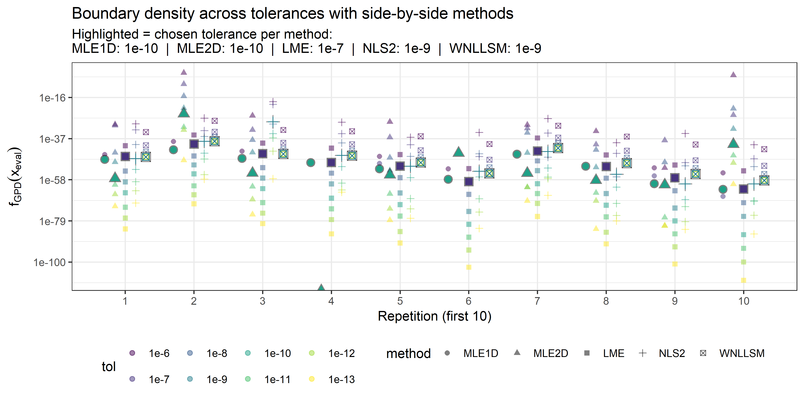
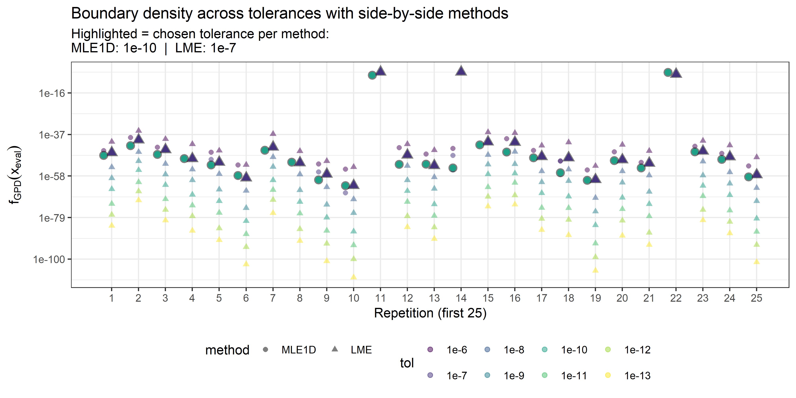
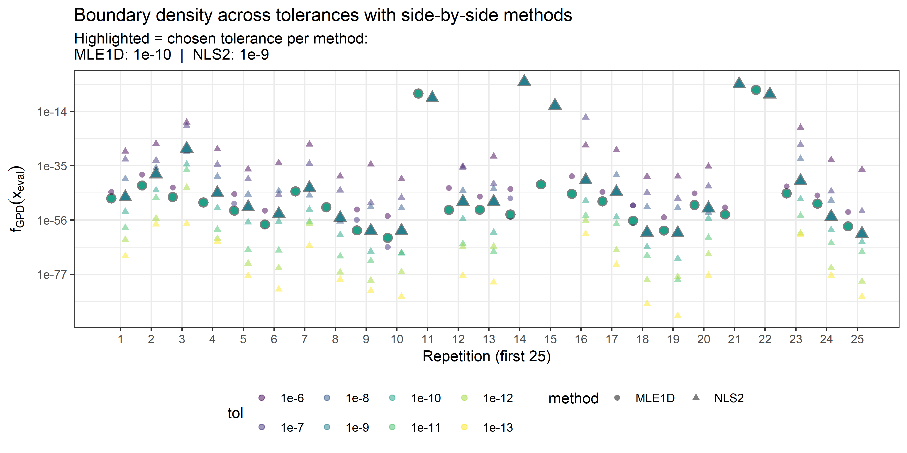
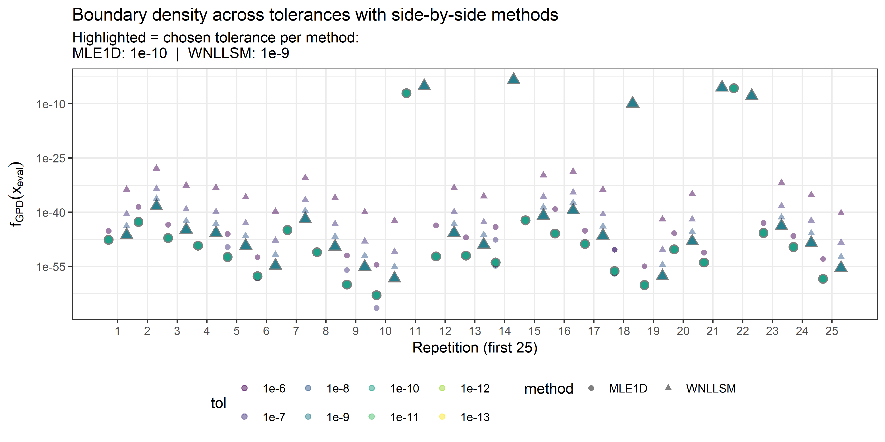

Tolerance calibration for boundary behaviour across GPD fits
================
Compiled at 2026-02-02 18:59:31 UTC

``` r
here::i_am(paste0(params$name, ".Rmd"), uuid = "9a024ec6-54e3-4a84-9d54-b965923c1282")
```

Goal: find per-method tolerance so that boundary density matches a
consensus.

``` r
library(conflicted)
library(eva)
library(dplyr)
library(tidyr)
library(purrr)
library(ggplot2)
library(tibble)

conflicts_prefer(dplyr::filter, dplyr::select)
```

    ## [conflicted] Will prefer dplyr::filter over any other package.
    ## [conflicted] Will prefer dplyr::select over any other package.

``` r
# create or *empty* the target directory, used to write this file's data: 
#projthis::proj_create_dir_target(params$name, clean = TRUE)

# function to get path to target directory: path_target("sample.csv")
path_target <- projthis::proj_path_target(params$name)

# function to get path to previous data: path_source("00-import", "sample.csv")
path_source <- projthis::proj_path_source(params$name)
```

## Load permApprox functions

## User setting

Fixed setting: shape = -0.25, scale = 1, boundary = 5

## Method registry

## Run simulation

## Evaluate results

### Identify ground truth method

Ground truth per repetition = robust center across tolerances (median of
log densities)

    ## 
    ## Within-repetition variability (smaller is better):

| method | mean_sd_log | median_sd_log | mean_mad_log | n_rep |
|:-------|------------:|--------------:|-------------:|------:|
| MLE1D  |    6.514333 |      6.724459 |    0.0015649 |   100 |
| WNLLSM |   12.262849 |     15.052448 |    0.0000001 |   100 |
| NLS2   |   35.788465 |     44.691570 |   29.6924108 |   100 |
| LME    |   43.137585 |     48.042522 |   37.7428737 |   100 |
| MLE2D  |   43.628956 |     48.780808 |   36.4400545 |   100 |

    ## Ground truth method (lowest mean SD on log scale): MLE1D

### Choose best tolerance per method to match ground truth

For each method and tol, we compute MAE to ground truth across
repetitions.

    ## 
    ## Best tol per method vs ground truth (by MAE on log scale):

| method | tol_f |    MAE_log |
|:-------|:------|-----------:|
| MLE1D  | 1e-10 |  0.0015649 |
| MLE2D  | 1e-10 | 21.5565945 |
| LME    | 1e-7  | 11.7140762 |
| NLS2   | 1e-9  | 31.9224881 |
| WNLLSM | 1e-9  | 22.9023810 |

## Plot

We plot repetition vs dgpd (log y), colored by tolerance, shaped by
method

### All methods

<!-- -->

### MLE1D and LME

<!-- -->

### MLE1D and NLS2

<!-- -->

### MLE1D and WNLLSM

<!-- -->

## Files written

These files have been written to the target directory,
`data/01_tol_calibration`:

    ## # A tibble: 2 × 4
    ##   path                           type         size modification_time  
    ##   <fs::path>                     <fct> <fs::bytes> <dttm>             
    ## 1 tol_calibration_res_bound5.rds file        35.5K 2025-10-26 09:45:29
    ## 2 tol_calibration_res_bound7.rds file        33.2K 2025-10-27 16:24:08
