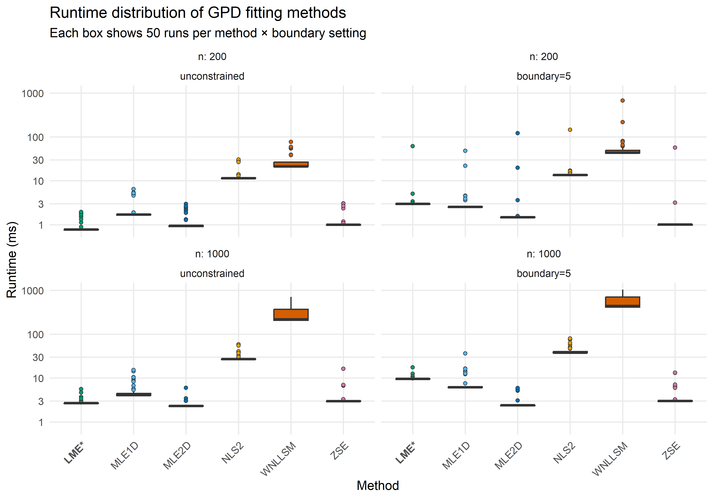

Runtime comparison of GPD fitting methods
================
Compiled at 2026-02-02 19:00:13 UTC

``` r
here::i_am(paste0(params$name, ".Rmd"), uuid = "83a2adbb-43b0-41b0-98cc-eeddbe1cedd9")
```

In this script we compare the runtime of the different methods for GPD
parameter fitting.

``` r
library(conflicted)
library(microbenchmark)
library(dplyr)
library(tidyr)
library(purrr)
library(tibble)
library(eva)
library(ggplot2)
library(forcats)
library(kableExtra)
```

``` r
# create or *empty* the target directory, used to write this file's data: 
#projthis::proj_create_dir_target(params$name, clean = TRUE)

# function to get path to target directory: path_target("sample.csv")
path_target <- projthis::proj_path_target(params$name)

# function to get path to previous data: path_source("00-import", "sample.csv")
path_source <- projthis::proj_path_source(params$name)
```

## Load permApprox functions

## Set controls

``` r
set.seed(123456)

# Data-generating params (fixed across scenarios)
n_vec         <- c(200, 1000)
shape_true    <- -0.25
scale_true    <- 1

# Boundary settings to *evaluate*:
#   NA  -> unconstrained (boundary = NULL in the fit calls)
#   5   -> constrained (boundary = 5 in the fit calls)
boundary_vec  <- c(NA_real_, 5)

times_per_scn <- 50
unit_choice   <- "ms"
```

## Helpers

## Run benchmark

## Summarize results

| n | boundary_label | boundary | method | min | lq | median | uq | max | mean |
|---:|:---|---:|:---|---:|---:|---:|---:|---:|---:|
| 200 | boundary=5 | 5 | ZSE | 0.9626 | 0.9800 | 1.00165 | 1.0179 | 57.1657 | 2.165124 |
| 200 | boundary=5 | 5 | MLE2D | 1.4201 | 1.4580 | 1.47950 | 1.5033 | 121.4269 | 4.291494 |
| 200 | boundary=5 | 5 | MLE1D | 2.4986 | 2.5244 | 2.54875 | 2.5962 | 48.3398 | 3.986120 |
| 200 | boundary=5 | 5 | LME | 2.9157 | 2.9414 | 2.96755 | 2.9920 | 61.5297 | 4.189346 |
| 200 | boundary=5 | 5 | NLS2 | 13.2374 | 13.4046 | 13.58120 | 13.7686 | 145.6023 | 16.416398 |
| 200 | boundary=5 | 5 | WNLLSM | 42.9852 | 43.3745 | 43.78945 | 49.8614 | 674.9231 | 64.641978 |
| 200 | unconstrained | NA | LME | 0.7442 | 0.7633 | 0.77130 | 0.7850 | 1.9469 | 0.922072 |
| 200 | unconstrained | NA | MLE2D | 0.8830 | 0.9043 | 0.94000 | 0.9715 | 2.9696 | 1.147154 |
| 200 | unconstrained | NA | ZSE | 0.9626 | 0.9826 | 0.99545 | 1.0092 | 3.0578 | 1.141344 |
| 200 | unconstrained | NA | MLE1D | 1.6604 | 1.6891 | 1.70390 | 1.7318 | 6.4838 | 2.202136 |
| 200 | unconstrained | NA | NLS2 | 11.2530 | 11.3508 | 11.46510 | 11.8201 | 30.6847 | 13.743044 |
| 200 | unconstrained | NA | WNLLSM | 20.9179 | 21.1954 | 21.30200 | 27.2489 | 77.0634 | 28.663038 |
| 1000 | boundary=5 | 5 | MLE2D | 2.3038 | 2.3532 | 2.39335 | 2.4192 | 5.9255 | 2.650524 |
| 1000 | boundary=5 | 5 | ZSE | 2.9025 | 2.9630 | 2.98940 | 3.0519 | 13.2375 | 3.998700 |
| 1000 | boundary=5 | 5 | MLE1D | 6.0503 | 6.1405 | 6.17855 | 6.3538 | 36.4052 | 8.061474 |
| 1000 | boundary=5 | 5 | LME | 9.5189 | 9.5643 | 9.60115 | 9.6532 | 17.5767 | 9.853380 |
| 1000 | boundary=5 | 5 | NLS2 | 37.2979 | 37.7451 | 37.94925 | 40.8106 | 80.0407 | 44.008348 |
| 1000 | boundary=5 | 5 | WNLLSM | 412.9594 | 416.8027 | 438.22810 | 707.9387 | 1039.2712 | 561.057906 |
| 1000 | unconstrained | NA | MLE2D | 2.2528 | 2.2912 | 2.31700 | 2.3597 | 6.0013 | 2.443022 |
| 1000 | unconstrained | NA | LME | 2.6414 | 2.6567 | 2.67260 | 2.7071 | 5.6032 | 2.823612 |
| 1000 | unconstrained | NA | ZSE | 2.8981 | 2.9512 | 2.97860 | 3.0190 | 16.3411 | 3.490198 |
| 1000 | unconstrained | NA | MLE1D | 4.0032 | 4.0504 | 4.08560 | 4.6191 | 15.3542 | 5.209608 |
| 1000 | unconstrained | NA | NLS2 | 26.5239 | 26.7281 | 26.98310 | 27.5019 | 59.0444 | 29.706522 |
| 1000 | unconstrained | NA | WNLLSM | 200.1963 | 208.2523 | 216.98555 | 374.6218 | 707.0153 | 295.543458 |

    ## 
    ## Median runtimes (ms) by scenario (fastest first):

<table class="table" style="color: black; width: auto !important; margin-left: auto; margin-right: auto;">

<thead>

<tr>

<th style="text-align:right;">

n
</th>

<th style="text-align:left;">

Boundary
</th>

<th style="text-align:right;">

Rank
</th>

<th style="text-align:left;">

Method
</th>

<th style="text-align:right;">

Median (ms)
</th>

</tr>

</thead>

<tbody>

<tr grouplength="6">

<td colspan="5" style="border-bottom: 1px solid;">

<strong>n = 1000, boundary=5</strong>
</td>

</tr>

<tr>

<td style="text-align:right;padding-left: 2em;" indentlevel="1">

200
</td>

<td style="text-align:left;">

boundary=5
</td>

<td style="text-align:right;">

1
</td>

<td style="text-align:left;">

ZSE
</td>

<td style="text-align:right;">

1.00165
</td>

</tr>

<tr>

<td style="text-align:right;padding-left: 2em;" indentlevel="1">

200
</td>

<td style="text-align:left;">

boundary=5
</td>

<td style="text-align:right;">

2
</td>

<td style="text-align:left;">

MLE2D
</td>

<td style="text-align:right;">

1.47950
</td>

</tr>

<tr>

<td style="text-align:right;padding-left: 2em;" indentlevel="1">

200
</td>

<td style="text-align:left;">

boundary=5
</td>

<td style="text-align:right;">

3
</td>

<td style="text-align:left;">

MLE1D
</td>

<td style="text-align:right;">

2.54875
</td>

</tr>

<tr>

<td style="text-align:right;padding-left: 2em;" indentlevel="1">

200
</td>

<td style="text-align:left;">

boundary=5
</td>

<td style="text-align:right;">

4
</td>

<td style="text-align:left;">

LME
</td>

<td style="text-align:right;">

2.96755
</td>

</tr>

<tr>

<td style="text-align:right;padding-left: 2em;" indentlevel="1">

200
</td>

<td style="text-align:left;">

boundary=5
</td>

<td style="text-align:right;">

5
</td>

<td style="text-align:left;">

NLS2
</td>

<td style="text-align:right;">

13.58120
</td>

</tr>

<tr>

<td style="text-align:right;padding-left: 2em;" indentlevel="1">

200
</td>

<td style="text-align:left;">

boundary=5
</td>

<td style="text-align:right;">

6
</td>

<td style="text-align:left;">

WNLLSM
</td>

<td style="text-align:right;">

43.78945
</td>

</tr>

<tr grouplength="6">

<td colspan="5" style="border-bottom: 1px solid;">

<strong>n = 1000, unconstrained</strong>
</td>

</tr>

<tr>

<td style="text-align:right;padding-left: 2em;" indentlevel="1">

200
</td>

<td style="text-align:left;">

unconstrained
</td>

<td style="text-align:right;">

1
</td>

<td style="text-align:left;">

LME
</td>

<td style="text-align:right;">

0.77130
</td>

</tr>

<tr>

<td style="text-align:right;padding-left: 2em;" indentlevel="1">

200
</td>

<td style="text-align:left;">

unconstrained
</td>

<td style="text-align:right;">

2
</td>

<td style="text-align:left;">

MLE2D
</td>

<td style="text-align:right;">

0.94000
</td>

</tr>

<tr>

<td style="text-align:right;padding-left: 2em;" indentlevel="1">

200
</td>

<td style="text-align:left;">

unconstrained
</td>

<td style="text-align:right;">

3
</td>

<td style="text-align:left;">

ZSE
</td>

<td style="text-align:right;">

0.99545
</td>

</tr>

<tr>

<td style="text-align:right;padding-left: 2em;" indentlevel="1">

200
</td>

<td style="text-align:left;">

unconstrained
</td>

<td style="text-align:right;">

4
</td>

<td style="text-align:left;">

MLE1D
</td>

<td style="text-align:right;">

1.70390
</td>

</tr>

<tr>

<td style="text-align:right;padding-left: 2em;" indentlevel="1">

200
</td>

<td style="text-align:left;">

unconstrained
</td>

<td style="text-align:right;">

5
</td>

<td style="text-align:left;">

NLS2
</td>

<td style="text-align:right;">

11.46510
</td>

</tr>

<tr>

<td style="text-align:right;padding-left: 2em;" indentlevel="1">

200
</td>

<td style="text-align:left;">

unconstrained
</td>

<td style="text-align:right;">

6
</td>

<td style="text-align:left;">

WNLLSM
</td>

<td style="text-align:right;">

21.30200
</td>

</tr>

<tr grouplength="6">

<td colspan="5" style="border-bottom: 1px solid;">

<strong>n = 200, boundary=5</strong>
</td>

</tr>

<tr>

<td style="text-align:right;padding-left: 2em;" indentlevel="1">

1000
</td>

<td style="text-align:left;">

boundary=5
</td>

<td style="text-align:right;">

1
</td>

<td style="text-align:left;">

MLE2D
</td>

<td style="text-align:right;">

2.39335
</td>

</tr>

<tr>

<td style="text-align:right;padding-left: 2em;" indentlevel="1">

1000
</td>

<td style="text-align:left;">

boundary=5
</td>

<td style="text-align:right;">

2
</td>

<td style="text-align:left;">

ZSE
</td>

<td style="text-align:right;">

2.98940
</td>

</tr>

<tr>

<td style="text-align:right;padding-left: 2em;" indentlevel="1">

1000
</td>

<td style="text-align:left;">

boundary=5
</td>

<td style="text-align:right;">

3
</td>

<td style="text-align:left;">

MLE1D
</td>

<td style="text-align:right;">

6.17855
</td>

</tr>

<tr>

<td style="text-align:right;padding-left: 2em;" indentlevel="1">

1000
</td>

<td style="text-align:left;">

boundary=5
</td>

<td style="text-align:right;">

4
</td>

<td style="text-align:left;">

LME
</td>

<td style="text-align:right;">

9.60115
</td>

</tr>

<tr>

<td style="text-align:right;padding-left: 2em;" indentlevel="1">

1000
</td>

<td style="text-align:left;">

boundary=5
</td>

<td style="text-align:right;">

5
</td>

<td style="text-align:left;">

NLS2
</td>

<td style="text-align:right;">

37.94925
</td>

</tr>

<tr>

<td style="text-align:right;padding-left: 2em;" indentlevel="1">

1000
</td>

<td style="text-align:left;">

boundary=5
</td>

<td style="text-align:right;">

6
</td>

<td style="text-align:left;">

WNLLSM
</td>

<td style="text-align:right;">

438.22810
</td>

</tr>

<tr grouplength="6">

<td colspan="5" style="border-bottom: 1px solid;">

<strong>n = 200, unconstrained</strong>
</td>

</tr>

<tr>

<td style="text-align:right;padding-left: 2em;" indentlevel="1">

1000
</td>

<td style="text-align:left;">

unconstrained
</td>

<td style="text-align:right;">

1
</td>

<td style="text-align:left;">

MLE2D
</td>

<td style="text-align:right;">

2.31700
</td>

</tr>

<tr>

<td style="text-align:right;padding-left: 2em;" indentlevel="1">

1000
</td>

<td style="text-align:left;">

unconstrained
</td>

<td style="text-align:right;">

2
</td>

<td style="text-align:left;">

LME
</td>

<td style="text-align:right;">

2.67260
</td>

</tr>

<tr>

<td style="text-align:right;padding-left: 2em;" indentlevel="1">

1000
</td>

<td style="text-align:left;">

unconstrained
</td>

<td style="text-align:right;">

3
</td>

<td style="text-align:left;">

ZSE
</td>

<td style="text-align:right;">

2.97860
</td>

</tr>

<tr>

<td style="text-align:right;padding-left: 2em;" indentlevel="1">

1000
</td>

<td style="text-align:left;">

unconstrained
</td>

<td style="text-align:right;">

4
</td>

<td style="text-align:left;">

MLE1D
</td>

<td style="text-align:right;">

4.08560
</td>

</tr>

<tr>

<td style="text-align:right;padding-left: 2em;" indentlevel="1">

1000
</td>

<td style="text-align:left;">

unconstrained
</td>

<td style="text-align:right;">

5
</td>

<td style="text-align:left;">

NLS2
</td>

<td style="text-align:right;">

26.98310
</td>

</tr>

<tr>

<td style="text-align:right;padding-left: 2em;" indentlevel="1">

1000
</td>

<td style="text-align:left;">

unconstrained
</td>

<td style="text-align:right;">

6
</td>

<td style="text-align:left;">

WNLLSM
</td>

<td style="text-align:right;">

216.98555
</td>

</tr>

</tbody>

</table>

<!-- -->

- NLS2 and WNLLSM are the slowest methods across all settings.
- The runtime of ZSE is highly dependent on the setting (fastest for
  small n with constraint)
- MLE2D is the fastest for large n but does also perform well for small
  n
- The performance of MLE1D and LME depends on the constraint:
  - In the unconstrained cases LME is faster
  - In the constrained case MLE1D is faster

## Files written

These files have been written to the target directory,
`data/02_runtime`:

    ## # A tibble: 1 × 4
    ##   path              type         size modification_time  
    ##   <fs::path>        <fct> <fs::bytes> <dttm>             
    ## 1 bench_results.rds file        6.12K 2025-10-26 11:11:22
