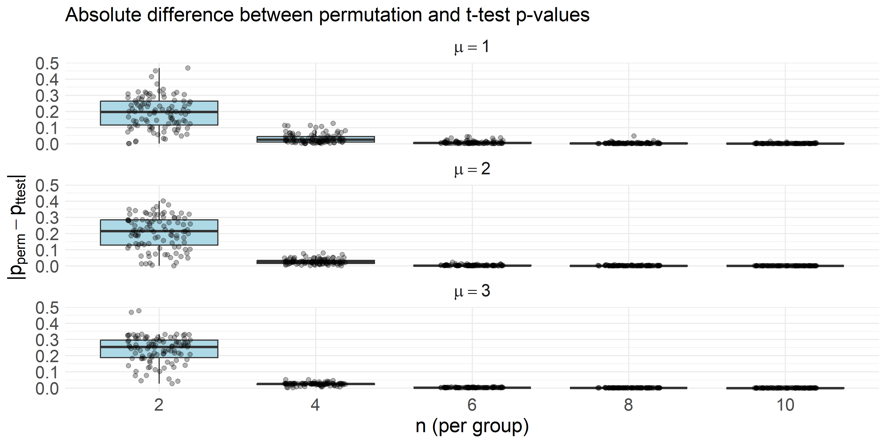
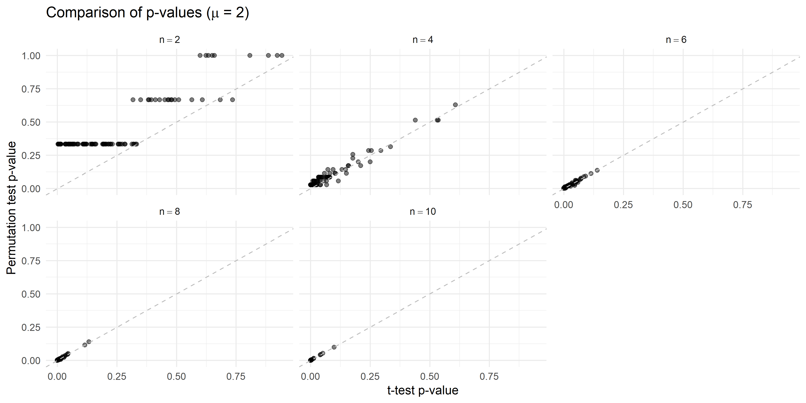

Validation: Student’s t-test vs. exact permutation test
================
Compiled at 2026-02-02 19:00:40 UTC

``` r
here::i_am(paste0(params$name, ".Rmd"), uuid = "88a30f86-0df6-4db8-8217-c59705f33b34")
```

## Objective

We evaluate whether the two-sample Student’s t-test yields results
sufficiently close to the exact permutation test under ideal conditions
(normality, equal variance), to justify its use as a ground truth in
simulation studies.

## Design

- Data: Independent, normally distributed with equal variances
- Sample sizes per group: n ∈ {2, 4, 6, 8, 10, 12}
- Effect sizes: mu ∈ {0, 1, 3} (difference in means)
- Repetitions: 100

We compute and compare p-values from: - Student’s t-test - Exact
permutation test (all group label permutations)

## Functions

## Setting

## Parallel Simulation

## Combine results

## Type I Error and Power

|   n | H0    |   type1_t | type1_perm |
|----:|:------|----------:|-----------:|
|   2 | FALSE | 0.1866667 |  0.0000000 |
|   2 | TRUE  | 0.0400000 |  0.0000000 |
|   4 | FALSE | 0.5800000 |  0.4800000 |
|   4 | TRUE  | 0.0800000 |  0.0300000 |
|   6 | FALSE | 0.7500000 |  0.7566667 |
|   6 | TRUE  | 0.0600000 |  0.0600000 |
|   8 | FALSE | 0.8366667 |  0.8300000 |
|   8 | TRUE  | 0.0100000 |  0.0100000 |
|  10 | FALSE | 0.8533333 |  0.8533333 |
|  10 | TRUE  | 0.0300000 |  0.0300000 |

Type I error (H0=TRUE) and power (H0=FALSE)

## p-value Comparison Plots

### Boxplot: Difference in p-values

<!-- -->

### Scatterplot

<!-- -->

## Conclusion

The p-values from the t-test closely match those from the exact
permutation test under the tested settings. Thus, for simulations under
normality and equal variance, the t-test can reliably be used as a
surrogate for the exact permutation test.
