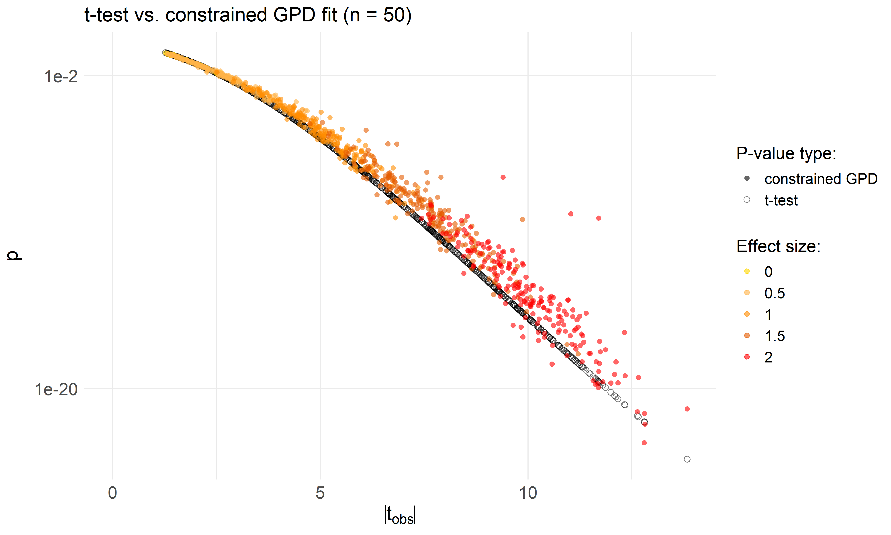
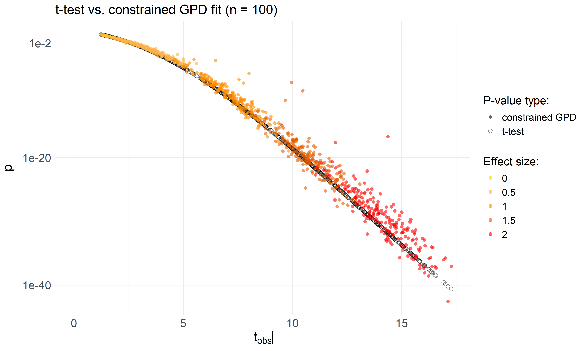
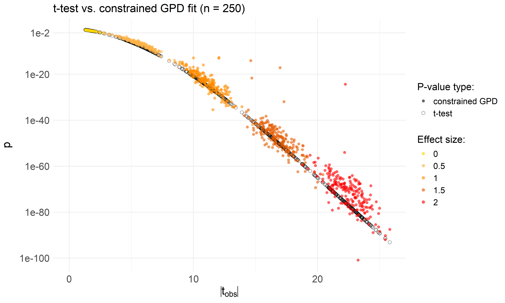
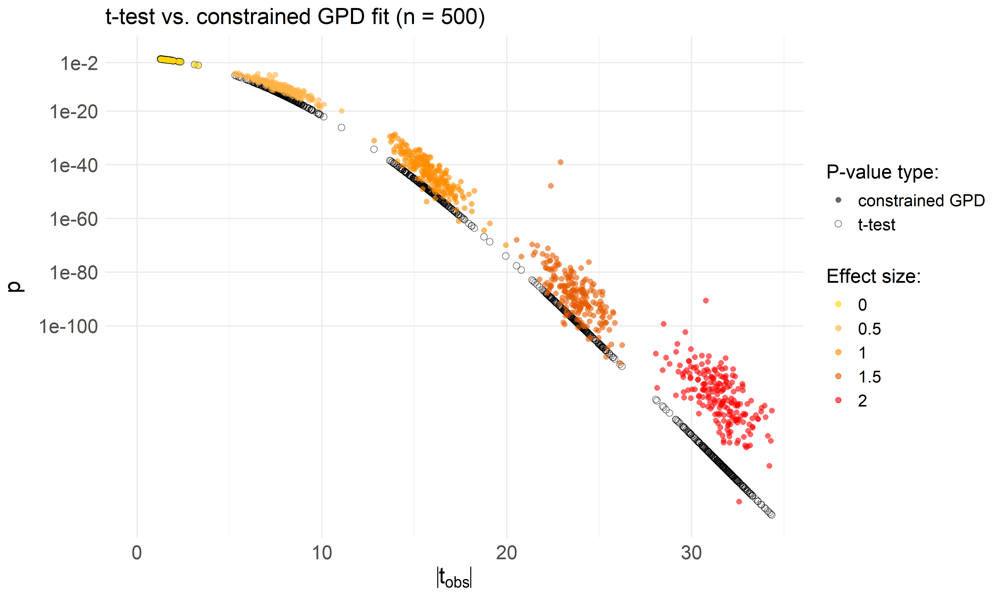
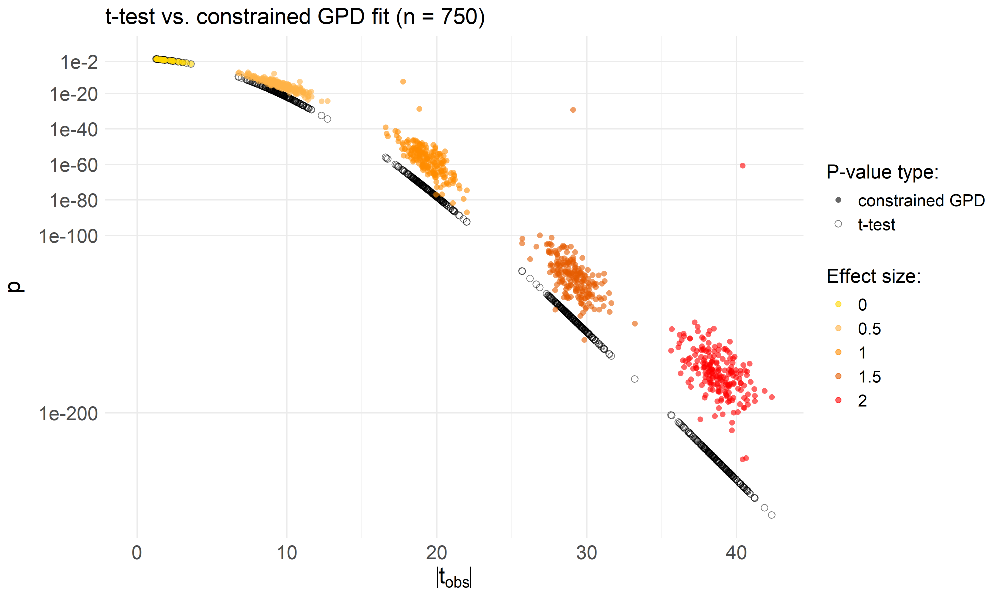
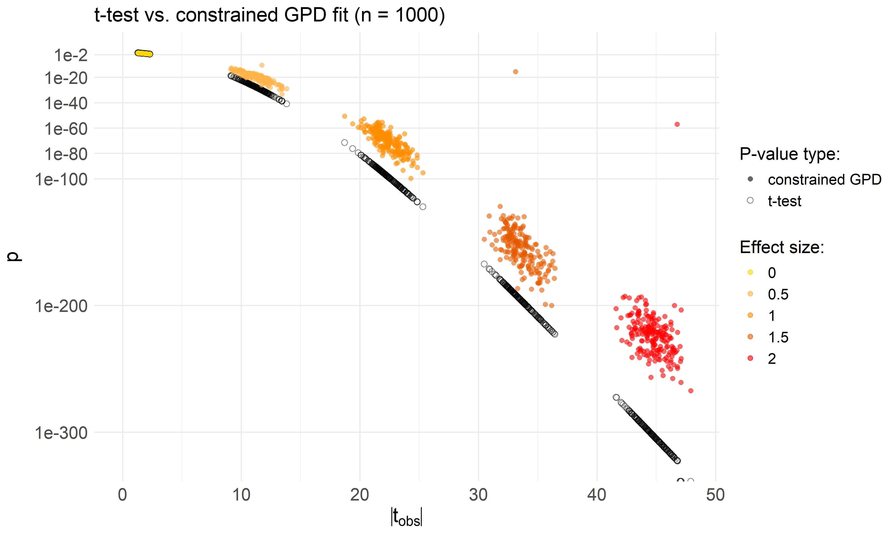

Two-sample t-test - Test epsilon rule for single tests
================
Compiled at 2026-02-06 16:46:39 UTC

In this script we evaluate the performance of the **Standardized Lifted
Log-Saturation (SLLS) rule** in the **single-test setting**. Here, each
test is treated independently: the $p$-value approximation is computed
per test, and the choice of $\varepsilon$ depends only on the test’s own
permutation distribution rather than on the maximum statistic across
multiple tests. This setup isolates the behavior of the rule in a clean,
controlled scenario and allows us to study its properties without the
additional complexity introduced by multiple testing.

## Data Simulation

We reuse the data from the former simulation study, where we simulated
two groups from normal distributions with increasing effect sizes
(difference in means).

The parameters are set as follows:

- Sample sizes per group: 50, 100, 250, 500, 750, 1000  
- Number of tests: 1000  
- Effect sizes (difference in mean): 0 0.5 1 1.5 2  
- Standard deviation: 1  
- Tests per effect size: d=0: 200, d=0.5: 200, d=1: 200, d=1.5: 200,
  d=2: 200

The observed $t$-statistic is calculated as

$$
t_{\text{obs}} = \frac{\bar{x}_1 - \bar{x}_2}
{\sqrt{\frac{s_1^2 + s_2^2}{n}}}
$$

where  
- $\bar{x}_1$ and $\bar{x}_2$ are the sample means,  
- $s_1^2$ and $s_2^2$ are the sample variances, and  
- $n$ is the sample size in each group.

## Plot function

## Function to run permApprox

This function will be used for all p-values approximations with
constrained GPD fit.

## Run permApprox with the SLLS rule for $\varepsilon$

We use the SLLS (Standardized Lifted Log-Saturation) rule to define
epsilon and run permApprox with this rule.

``` r
# Build T_cap from choice: "perm" or "tmax"
# - cap_base = "tmax": uses observed maximum across tests
# - cap_base = "perm": uses high quantile of |perm_stats| inflated by g(n)
.build_Tcap <- function(cap_base, t_obs, perm_stats, n, 
                        q_ref = 0.99, alpha = 0.5) {
  if (identical(cap_base, "tmax")) {
    # Observed cap (same for all tests)
    T_cap <- rep(max(abs(t_obs), na.rm = TRUE), length(t_obs))

  } else if (identical(cap_base, "perm")) {
    # Permutation cap: high quantile of |perm|, inflated by g(n)
    if (is.null(dim(perm_stats))) perm_stats <- matrix(perm_stats, ncol = 1)
    Tabs <- abs(perm_stats)
    Tq <- apply(Tabs, 2, stats::quantile, probs = q_ref, na.rm = TRUE, names = FALSE)
    
    # Inflation g(n) = max(1, alpha * sqrt(n))
    infl <- pmax(1, alpha * sqrt(n))
    T_cap <- Tq * infl

    # Broadcast if needed
    if (length(T_cap) == 1L) T_cap <- rep(T_cap, length(t_obs))
    if (length(T_cap) != length(t_obs)) T_cap <- rep(T_cap[1L], length(t_obs))

  } else {
    stop("cap_base must be 'perm' or 'tmax'.")
  }

  # Guardrails: enforce positive finite caps
  bad <- !is.finite(T_cap) | T_cap <= 0
  if (any(bad)) {
    fallback <- max(T_cap[!bad], 1)
    T_cap[bad] <- fallback
  }
  T_cap
}

# Standardized Lifted Log-Saturation (SLLS) using unified Z-cap
# - Standardize to Z using permutation mean/sd per test
# - Build the cap on the Z-scale via .build_Tcap (cap_base = "perm" or "tmax")
# - Apply simplified LLS on Z
# - Map epsilon back to T-scale via sigma_j
eps_log_saturation_lift_std <- function(obs_stats,
                                        perm_stats,
                                        sampsize,
                                        cap_base      = "perm",  # Z-cap choice
                                        alpha         = 0.5, # g(n) = max(1, alpha*sqrt(n))
                                        q_ref         = 0.99, # quantile of |Z_perm|
                                        rho_lift      = 3,
                                        k_factor      = 1000,
                                        target_factor = 0.25,
                                        floor_epsZ    = 1e-6,
                                        ...) {
  cap_base <- if (is.character(cap_base)) match.arg(cap_base) else cap_base
  n <- sampsize
  stopifnot(n > 0)

  # Shape inputs --------------------------------------------------------------
  # Allow vector perm_stats for single test
  if (is.null(dim(perm_stats))) perm_stats <- matrix(perm_stats, ncol = 1)
  Tobs <- as.numeric(obs_stats)

  # Z-standardization per test -----------------------------------------------
  mu  <- colMeans(perm_stats, na.rm = TRUE)
  sig <- apply(perm_stats, 2, sd, na.rm = TRUE)

  # Guard against non-finite or zero SDs: replace with a small positive fallback
  valid_sig <- sig[is.finite(sig) & sig > 0]
  sig_fallback <- if (length(valid_sig)) max(min(valid_sig), 1e-12) else 1e-12
  sig_ok <- sig
  sig_ok[!is.finite(sig_ok) | sig_ok <= 0] <- sig_fallback

  Zobs  <- abs((Tobs - mu) / sig_ok)
  Zperm <- sweep(sweep(perm_stats, 2, mu, "-"), 2, sig_ok, "/")  # same shape as perm_stats

  # Build Z-cap (unified) -----------------------------------------------------
  # Uses: "tmax" => max(Zobs); "perm" => Q_q(|Zperm|) * g(n) with g(n)=max(1, alpha*sqrt(n))
  T_cap_Z <- .build_Tcap(cap_base = cap_base,
                         t_obs    = Zobs,
                         perm_stats = Zperm,
                         n        = n,
                         q_ref    = q_ref,
                         alpha    = alpha)

  # LLS core on Z -------------------------------------------------------------
  k        <- k_factor      * (500 / n)
  E_target <- target_factor * (500 / n)

  if (!any(is.finite(T_cap_Z)) || all(T_cap_Z <= 0)) {
    # Conservative constant if the cap failed
    epsZ <- rep(max(E_target + rho_lift, floor_epsZ), length(Zobs))
  } else {
    s   <- pmin(Zobs / T_cap_Z, 1)        # scale-free index in [0,1]
    psi <- (1 - s)^4 * (1 + 4*s)          # Wendland C^2 lift
    epsZ_core <- E_target * log1p(k * s) / log1p(k) + rho_lift * psi
    epsZ <- pmax(epsZ_core, floor_epsZ)
  }

  # Map back to T-scale -------------------------------------------------------
  epsT <- epsZ * sig_ok
  epsT
}
```

<!-- --><!-- --><!-- --><!-- --><!-- --><!-- -->

## Files written

These files have been written to the target directory,
`data/04_single_tests`:

    ## # A tibble: 6 × 4
    ##   path                                                type         size modification_time  
    ##   <fs::path>                                          <fct> <fs::bytes> <dttm>             
    ## 1 single_test_constr_log_sat_lift_std_n1000_B1000.rds file         845K 2025-11-03 10:33:00
    ## 2 single_test_constr_log_sat_lift_std_n100_B1000.rds  file         851K 2025-11-03 10:36:11
    ## 3 single_test_constr_log_sat_lift_std_n250_B1000.rds  file         850K 2025-11-03 10:37:21
    ## 4 single_test_constr_log_sat_lift_std_n500_B1000.rds  file         853K 2025-11-03 10:38:30
    ## 5 single_test_constr_log_sat_lift_std_n50_B1000.rds   file         828K 2025-11-03 10:35:02
    ## 6 single_test_constr_log_sat_lift_std_n750_B1000.rds  file         850K 2025-11-03 10:39:35
