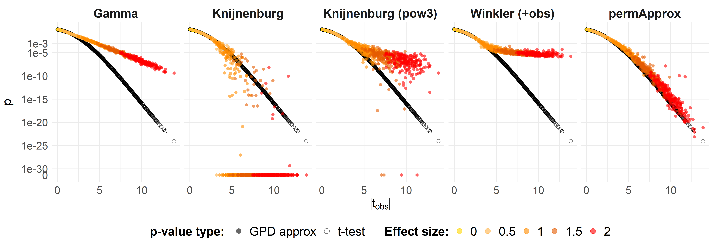
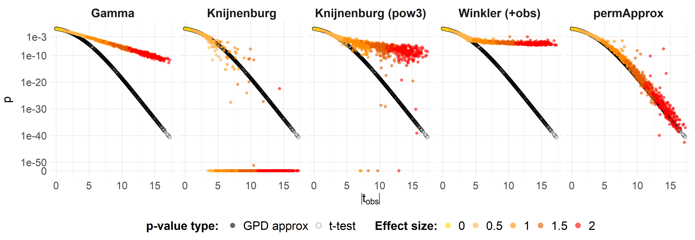
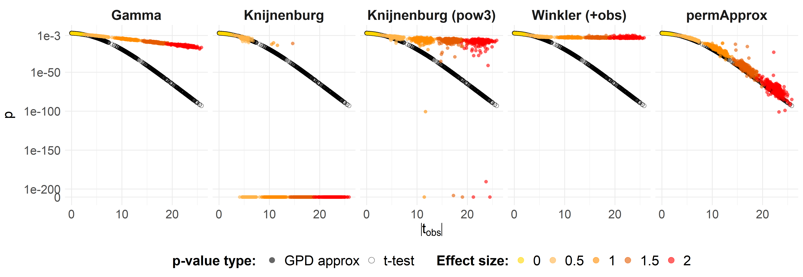
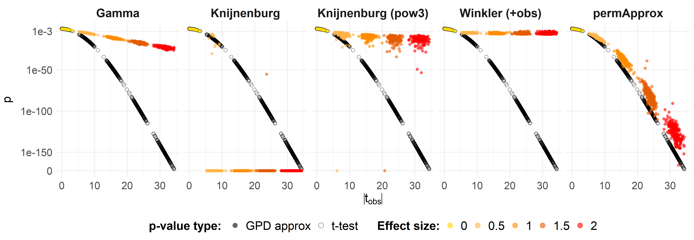

Student’s t-test on Gaussian data — Compare p-value approximation
methods
================
Compiled at 2026-06-10 10:27:22 UTC

``` r
here::i_am(paste0(params$name, ".Rmd"), uuid = "600930db-b62c-4670-bb31-ade6ab85af4b")
```

## Packages & paths

## Load permApprox functions (+ SLLS)

## Global design

## Methods to compare

## Engines (compact)

## Compute and combine

## Rename methods

## Plot helper (log breaks) and plotter

## Plots

### n = 50

<!-- -->

### n = 100

<!-- -->

### n = 250

<!-- -->

### n = 500

<!-- -->
