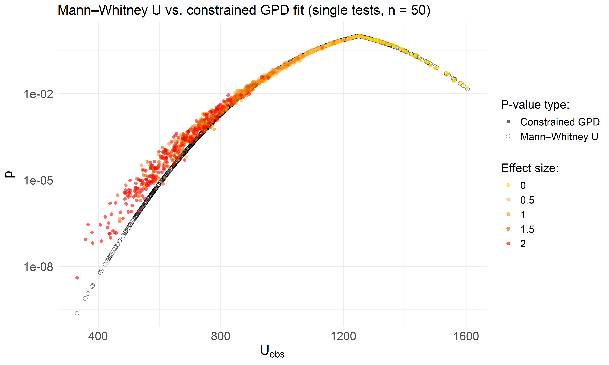
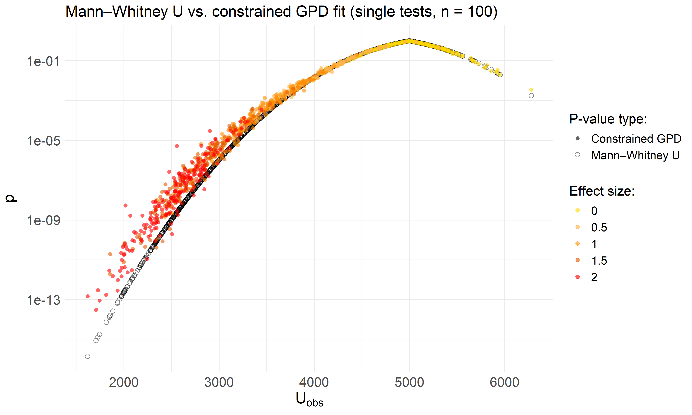
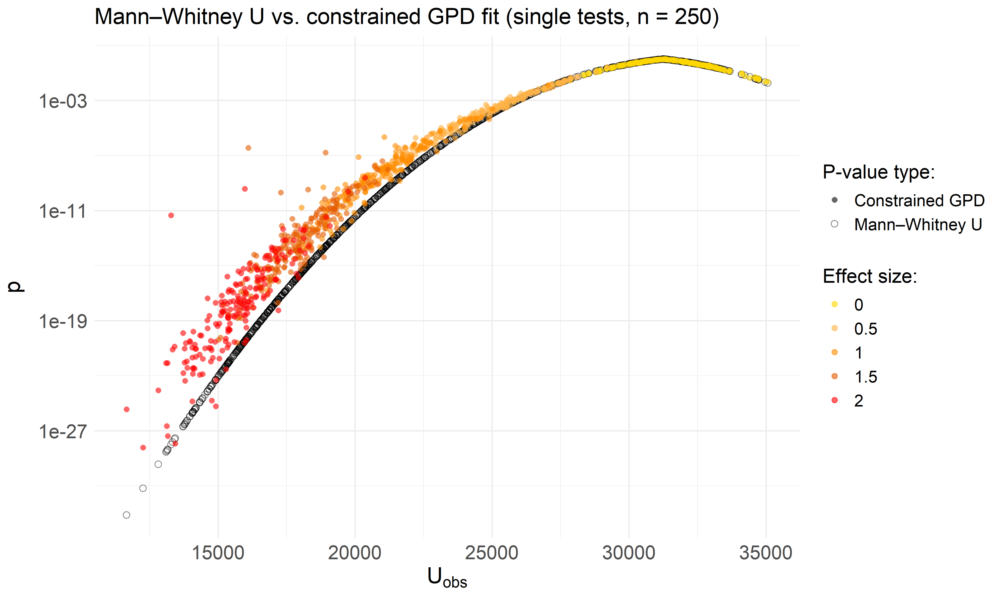
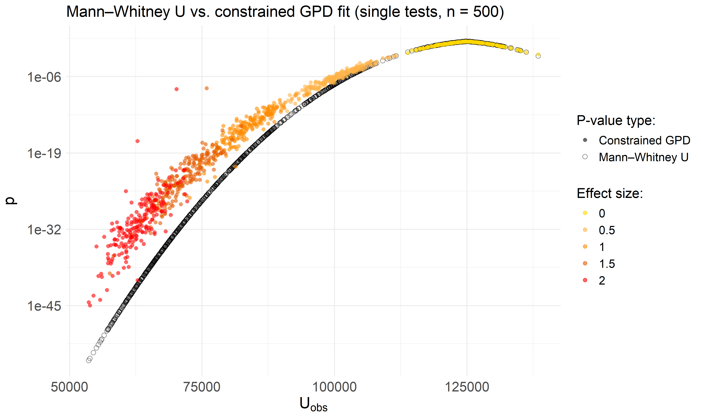
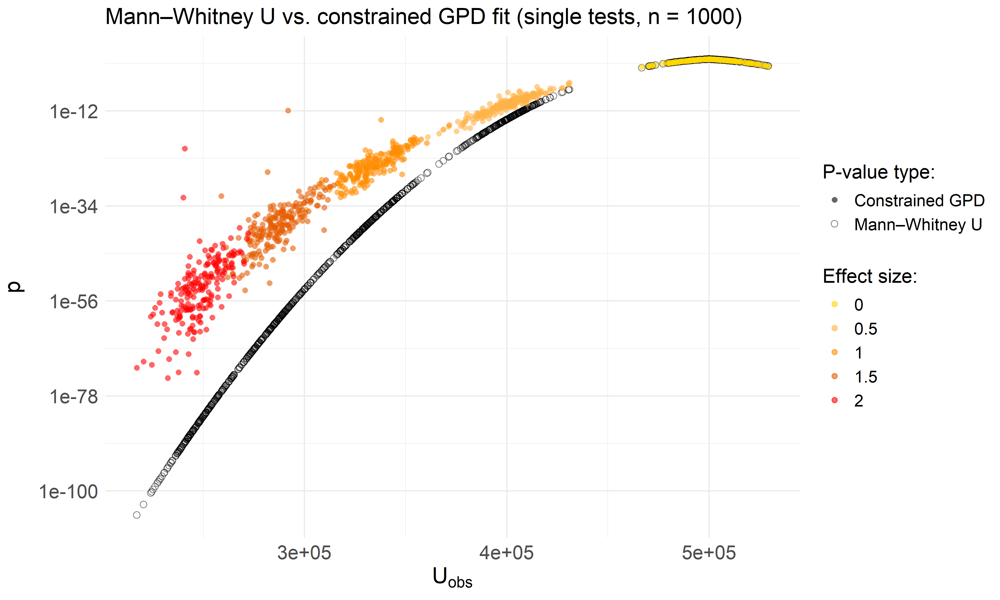

Wilcoxon rank-sum on exponential data - Test epsilon rule for single
tests
================
Compiled at 2026-02-02 19:11:31 UTC

``` r
here::i_am(paste0(params$name, ".Rmd"), uuid = "f6f7de73-abcc-4ebe-b039-ea102462293e")
```

In this script we investigate the performance of our **final
$\varepsilon$-rule (the SLLS rule)** when applied to data generated from
exponential distributions and analyzed with the **Wilcoxon rank-sum
test**.

In contrast to the previous script, which depicted a multiple-testing
setting, we are examining a single-test setting here. That means, each
test is treated independently: the $p$-value approximation is computed
per test, and the choice of $\varepsilon$ depends only on the test’s own
permutation distribution rather than on the maximum statistic across
multiple tests.

## Data Simulation

We reuse the data from the former simulation study, where we simulated
two groups from **exponential distributions** with increasing effect
sizes:

- Group 1: mean (=1) (rate (=1))
- Group 2: mean (=1+) (rate (=1/(1+)))
- Sample sizes per group: 50, 100, 250, 500, 750, 1000
- Number of tests: 1000
- Effect sizes: 0 0.5 1 1.5 2
- Tests per effect size: d=0: 200, d=0.5: 200, d=1: 200, d=1.5: 200,
  d=2: 200

We apply the **Wilcoxon rank-sum test** (Mann–Whitney $U$ test) to
compare the two exponential samples.

- Statistic: **Mann–Whitney (U)** (converted from rank-sum (W))
- P-values: classical Wilcoxon (`exact = FALSE, correct = FALSE`) for
  reference; permutation/GPD for tail modeling

## Plot function

## Function to run permApprox

## Run permApprox

## Constrained GPD vs Mann-Whitney U p-values

<!-- --><!-- --><!-- --><!-- --><!-- --><!-- -->

## Files written

These files have been written to the target directory,
`data/02_single_tests`:

    ## # A tibble: 6 × 4
    ##   path                                    type         size modification_time  
    ##   <fs::path>                              <fct> <fs::bytes> <dttm>             
    ## 1 single_test_constr_SLLS_n1000_B1000.rds file         406K 2025-10-02 04:59:06
    ## 2 single_test_constr_SLLS_n100_B1000.rds  file         334K 2025-11-04 15:55:45
    ## 3 single_test_constr_SLLS_n250_B1000.rds  file         360K 2025-11-04 15:56:15
    ## 4 single_test_constr_SLLS_n500_B1000.rds  file         370K 2025-11-04 15:56:45
    ## 5 single_test_constr_SLLS_n50_B1000.rds   file         282K 2025-11-04 15:55:15
    ## 6 single_test_constr_SLLS_n750_B1000.rds  file         386K 2025-11-04 15:57:14
