Simulation study: Robustness of GPD estimation under boundary
misspecification
================
Compiled at 2026-02-02 19:19:28 UTC

``` r
here::i_am(paste0(params$name, ".Rmd"), uuid = "1e46eb1d-6a01-485d-aa23-9c71660a8549")
```

We evaluate how GPD parameter estimation methods behave under varying
degrees of misspecification with respect to a boundary constraint. We
simulate data where the true upper boundary $s_0$ of the GPD is below a
fixed constraint point $s_c$ and compare constrained and unconstrained
fits.

## Example cases

We firstly look at three example cases:

- Well specified model: true boundary \> constraint (constraint
  inactive)
- Edge case: true boundary = constraint
- Misspecified model: true boundary \< constraint (constraint always
  active)

### Well specified case (boundary \> cutoff)

    ## Shape:  -0.1666667
    ## Constraint:  5
    ## True boundary:  6
    ## Data maximumum:  4.211408
    ## Unconstrained boundary: 7.234609
    ## Constrained boundary: 7.234609

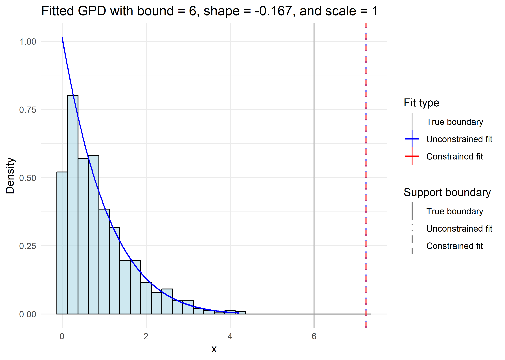<!-- -->

### Edge case (boundary = cutoff)

    ## Shape:  -0.2
    ## Constraint:  5
    ## True boundary:  5
    ## Data maximumum:  3.920178
    ## Unconstrained boundary: 4.990544
    ## Constrained boundary: 5

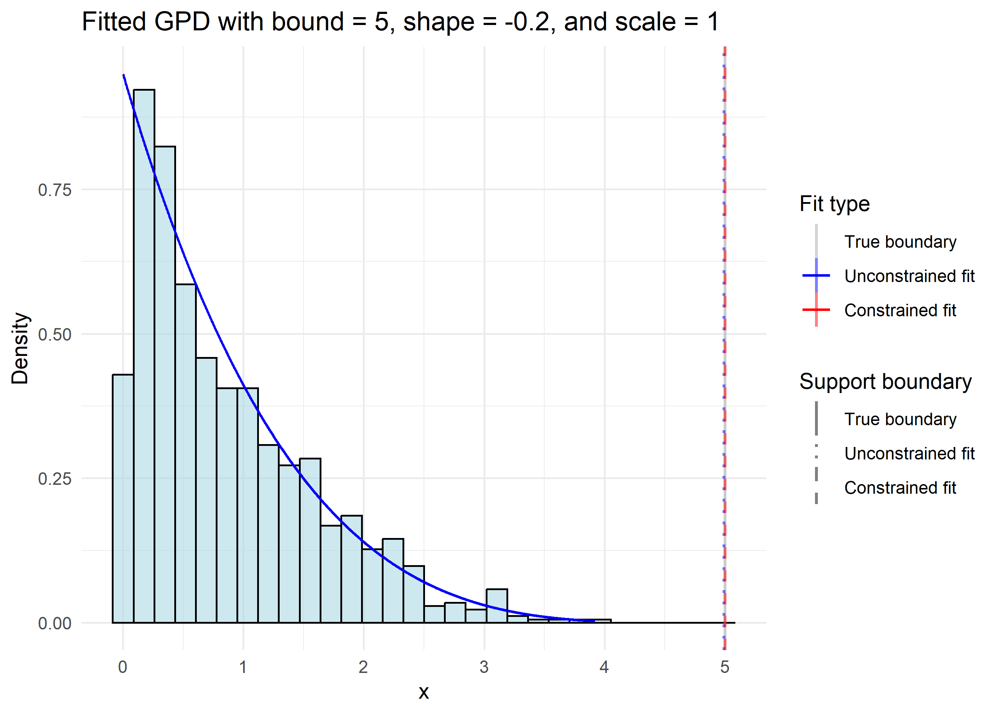<!-- -->

### Misspecification (boundary \< cutoff)

    ## Shape:  -0.25
    ## Constraint:  5
    ## True boundary:  4
    ## Data maximumum:  3.348971
    ## Unconstrained boundary: 4.368068
    ## Constrained boundary: 5

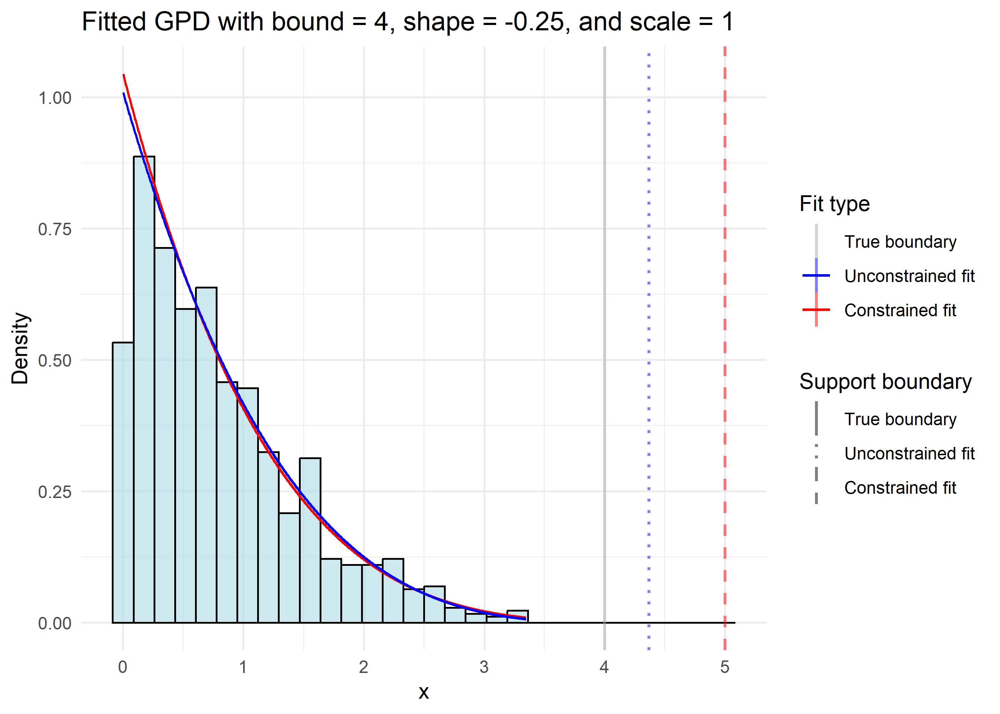<!-- -->

## Define parameters

    ## True boundaries: 6 5.5 5 4.5 4 3.5 3 2.5 2 
    ## Shape values: -0.1666667 -0.1818182 -0.2 -0.2222222 -0.25 -0.2857143 -0.3333333 -0.4 -0.5 
    ## Scale:  1 
    ## Constraint:  5 
    ## Sample sizes:  1000 
    ## Repetitions:  500

The GPD parameters are estimated for all considered parameter
combinations using the following estimation methods:

- LME (Likelihood moment estimator) by Zhang (2007)
- WNLLSM (Weighted Nonlinear Least Squares Likelihood Moments
  Estimation) by Zhao et al. (2019)
- MLE-1D (one-dimensional MLE) by Castillo & Serra (2015)
- MLE-2D (Maximum Likelihood Estimation)
- NLS2 (Quantile Estimation) by Song & Song (2012)
- ZSE (Zhang Stephens Estimator; Bayesian methods) by Zhang & Stephens
  (2009)

## Settings

    ## # A tibble: 6 × 3
    ##   bound     n method
    ##   <dbl> <dbl> <fct> 
    ## 1     2  1000 MOM   
    ## 2     2  1000 PWM   
    ## 3     2  1000 LME   
    ## 4     2  1000 MLE1D 
    ## 5     2  1000 MLE2D 
    ## 6     2  1000 NLS2

    ## Number of settings:  72

## Perform estimations

Constrained and unconstrained fitting for all settings …

## Results table

| data_bound | data_shape | data_scale | n | method | data_max | constr_active | shape_uc | scale_uc | bound_uc | dgpd_uc | shape_c | scale_c | bound_c | dgpd_c | repetition |
|---:|---:|---:|---:|:---|---:|:---|---:|---:|---:|---:|---:|---:|---:|---:|---:|
| 2.5 | -0.4 | 1 | 1000 | LME | 2.363100 | TRUE | -0.3690196 | 0.9809899 | 2.658368 | 0 | -0.1636820 | 0.8184101 | 5 | 0 | 1 |
| 2.5 | -0.4 | 1 | 1000 | LME | 2.383399 | TRUE | -0.4053181 | 1.0365076 | 2.557269 | 0 | -0.1688737 | 0.8443688 | 5 | 0 | 2 |
| 2.5 | -0.4 | 1 | 1000 | LME | 2.298701 | TRUE | -0.4171602 | 1.0294855 | 2.467842 | 0 | -0.1657816 | 0.8289082 | 5 | 0 | 3 |
| 2.5 | -0.4 | 1 | 1000 | LME | 2.388055 | TRUE | -0.4242431 | 1.0213128 | 2.407377 | 0 | -0.1624751 | 0.8123757 | 5 | 0 | 4 |
| 2.5 | -0.4 | 1 | 1000 | LME | 2.326829 | TRUE | -0.4153695 | 0.9901992 | 2.383900 | 0 | -0.1582915 | 0.7914577 | 5 | 0 | 5 |
| 2.5 | -0.4 | 1 | 1000 | LME | 2.414937 | TRUE | -0.3770029 | 0.9606200 | 2.548044 | 0 | -0.1583798 | 0.7918992 | 5 | 0 | 6 |
| 2.5 | -0.4 | 1 | 1000 | LME | 2.348744 | TRUE | -0.3859691 | 0.9810048 | 2.541666 | 0 | -0.1610012 | 0.8050061 | 5 | 0 | 7 |
| 2.5 | -0.4 | 1 | 1000 | LME | 2.437846 | TRUE | -0.4139598 | 1.0305709 | 2.489544 | 0 | -0.1662067 | 0.8310337 | 5 | 0 | 8 |
| 2.5 | -0.4 | 1 | 1000 | LME | 2.367861 | TRUE | -0.3990651 | 1.0235274 | 2.564813 | 0 | -0.1671577 | 0.8357883 | 5 | 0 | 9 |
| 2.5 | -0.4 | 1 | 1000 | LME | 2.435547 | TRUE | -0.4111496 | 1.0033354 | 2.440317 | 0 | -0.1612933 | 0.8064665 | 5 | 0 | 10 |
| 2.5 | -0.4 | 1 | 1000 | LME | 2.361998 | TRUE | -0.4156689 | 1.0500282 | 2.526117 | 0 | -0.1695544 | 0.8477719 | 5 | 0 | 11 |
| 2.5 | -0.4 | 1 | 1000 | LME | 2.432341 | TRUE | -0.3826278 | 0.9721674 | 2.540765 | 0 | -0.1595316 | 0.7976581 | 5 | 0 | 12 |
| 2.5 | -0.4 | 1 | 1000 | LME | 2.319579 | TRUE | -0.3600372 | 0.9651424 | 2.680674 | 0 | -0.1620521 | 0.8102604 | 5 | 0 | 13 |
| 2.5 | -0.4 | 1 | 1000 | LME | 2.434870 | TRUE | -0.3989267 | 1.0286692 | 2.578592 | 0 | -0.1680338 | 0.8401689 | 5 | 0 | 14 |
| 2.5 | -0.4 | 1 | 1000 | LME | 2.310581 | TRUE | -0.4127536 | 0.9902320 | 2.399088 | 0 | -0.1589270 | 0.7946349 | 5 | 0 | 15 |
| 2.5 | -0.4 | 1 | 1000 | LME | 2.280817 | TRUE | -0.4264466 | 1.0295974 | 2.414364 | 0 | -0.1642252 | 0.8211259 | 5 | 0 | 16 |
| 2.5 | -0.4 | 1 | 1000 | LME | 2.374646 | TRUE | -0.4476271 | 1.0778059 | 2.407821 | 0 | -0.1698042 | 0.8490208 | 5 | 0 | 17 |
| 2.5 | -0.4 | 1 | 1000 | LME | 2.349188 | TRUE | -0.3810682 | 0.9800634 | 2.571884 | 0 | -0.1615674 | 0.8078368 | 5 | 0 | 18 |
| 2.5 | -0.4 | 1 | 1000 | LME | 2.374396 | TRUE | -0.4136948 | 1.0336830 | 2.498661 | 0 | -0.1669688 | 0.8348439 | 5 | 0 | 19 |
| 2.5 | -0.4 | 1 | 1000 | LME | 2.369265 | TRUE | -0.3646036 | 0.9334988 | 2.560312 | 0 | -0.1550844 | 0.7754222 | 5 | 0 | 20 |

## Plots

We plot the error in shape, scale, boundary, and the difference between
the estimated boundary and the constraint value. The true boundary $b_0$
is always on the x axis.

We expect the error to decrease as the boundary approaches the
constraint value (5 in this case).

### Shape error

Difference between the estimated shape $\hat{\xi}$ and the true shape
used for data generation $\xi_0$.

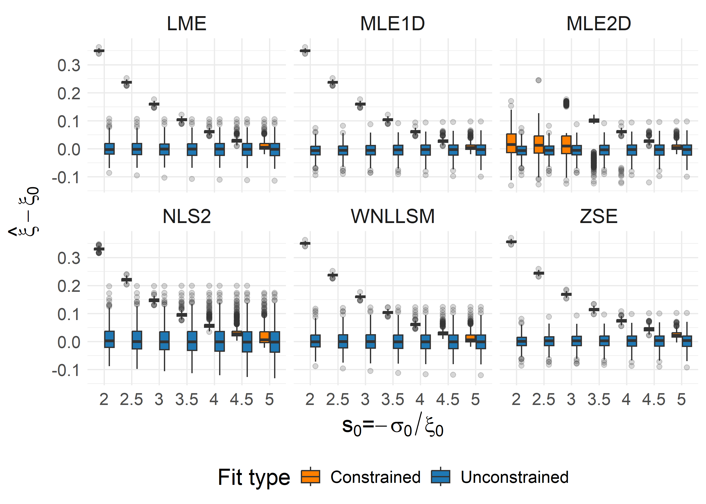<!-- -->

### Scale error

Difference between the estimated scale $\hat{\sigma}$ and the true scale
used for data generation $\sigma_0$.

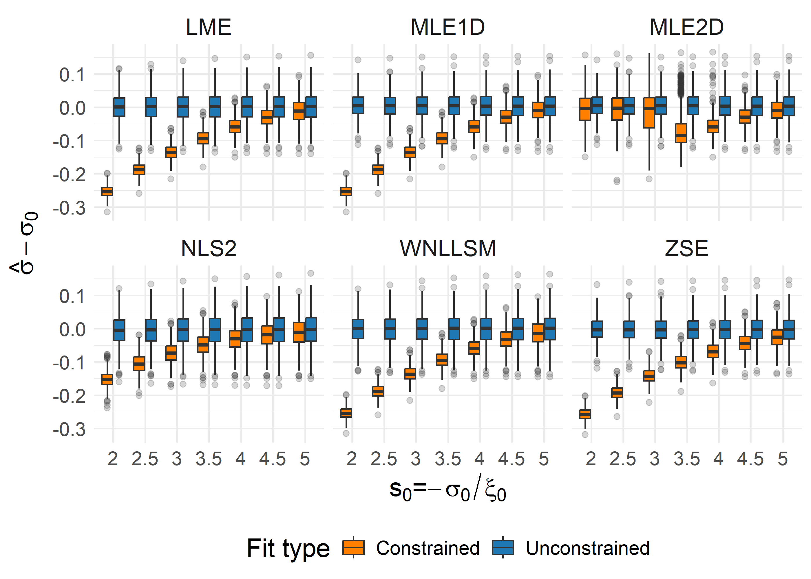<!-- -->

### Boundary error

Difference between the estimated boundary
$\frac{-\hat{\sigma}}{\hat{\xi}}$ and the boundary that results from the
true parameters used for data generation $\frac{-\sigma_0}{\xi_0}$.

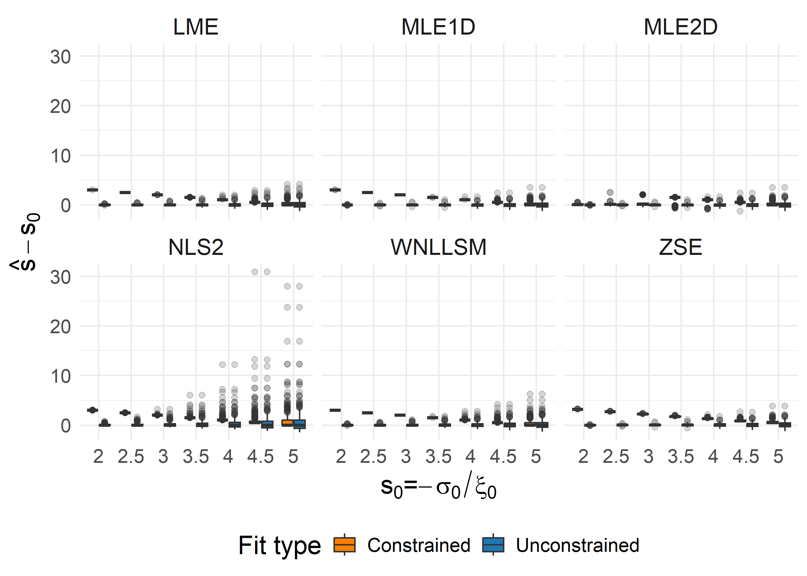<!-- -->

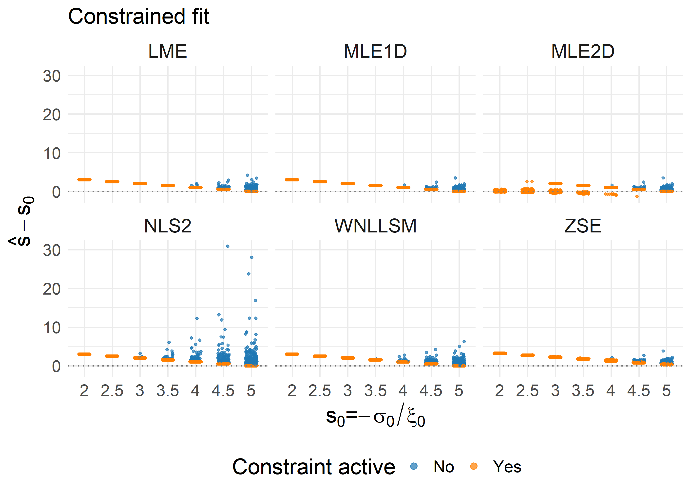<!-- -->

### Boundary error (set y-axis limits)

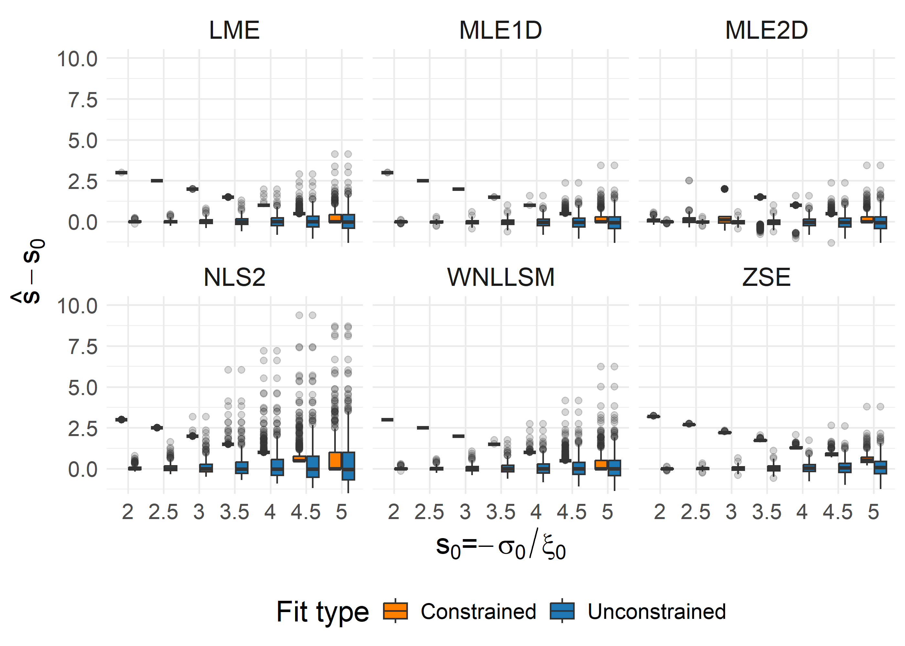<!-- -->

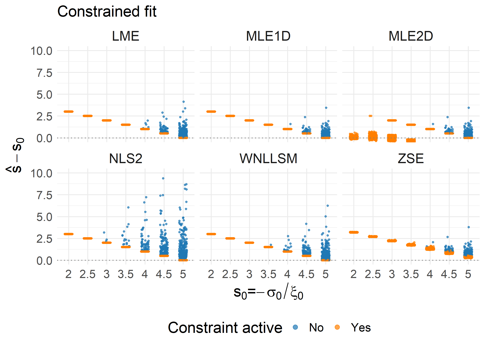<!-- -->

### Difference between boundary and constraint

Difference between the estimated boundary
$\frac{-\hat{\sigma}}{\hat{\xi}}$ and the constraint (here **5**).

<!-- -->

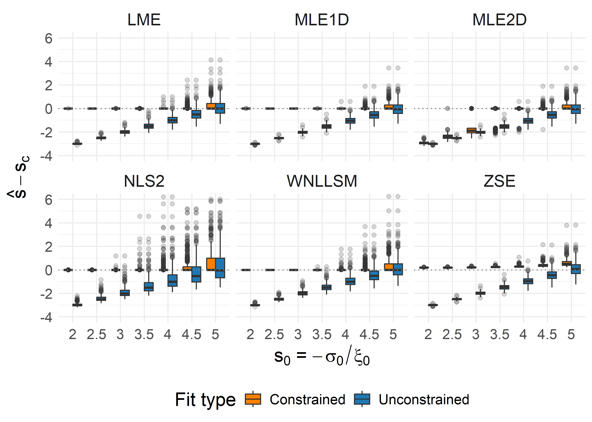<!-- -->

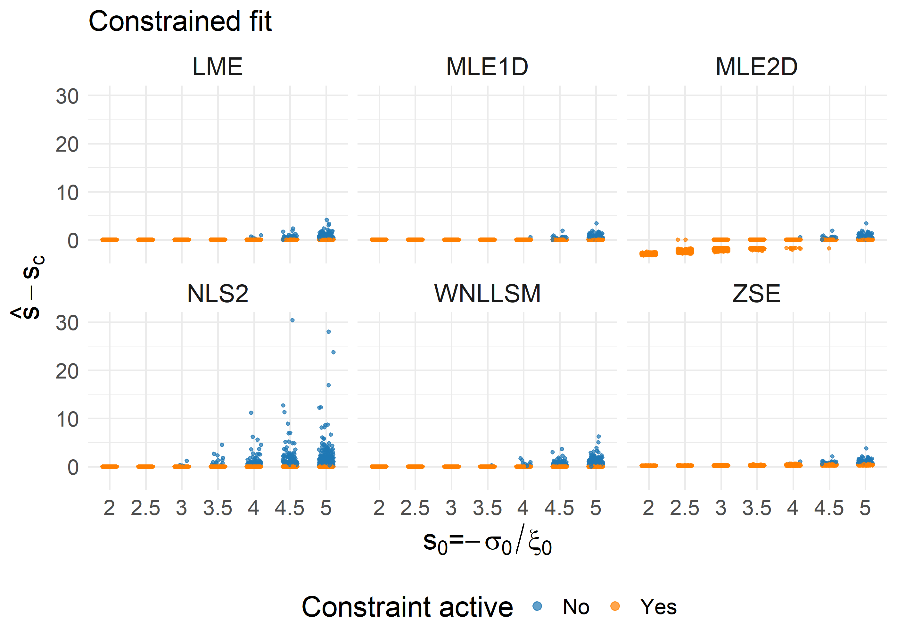<!-- -->
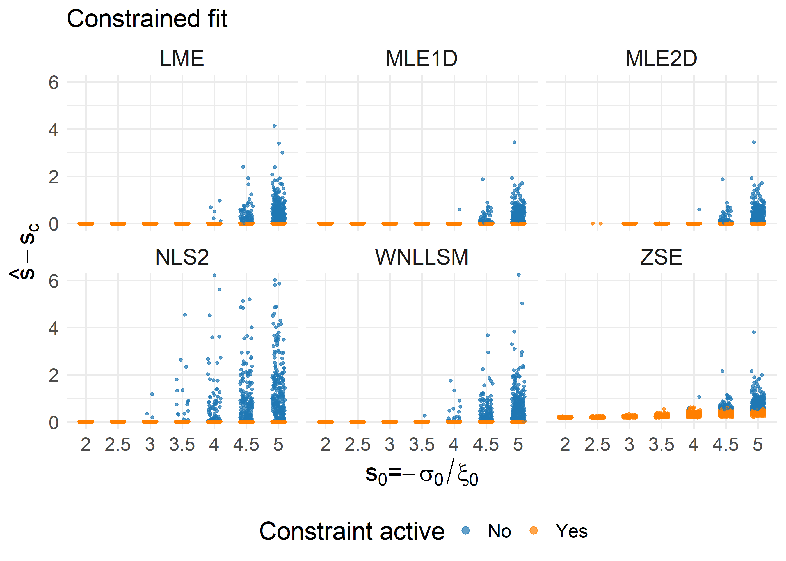<!-- -->

## Plots (constraint active)

Same plots as before, but only replicates with active constraint are
considered.

### Shape error

Difference between the estimated shape $\hat{\xi}$ and the true shape
used for data generation $\xi_0$.

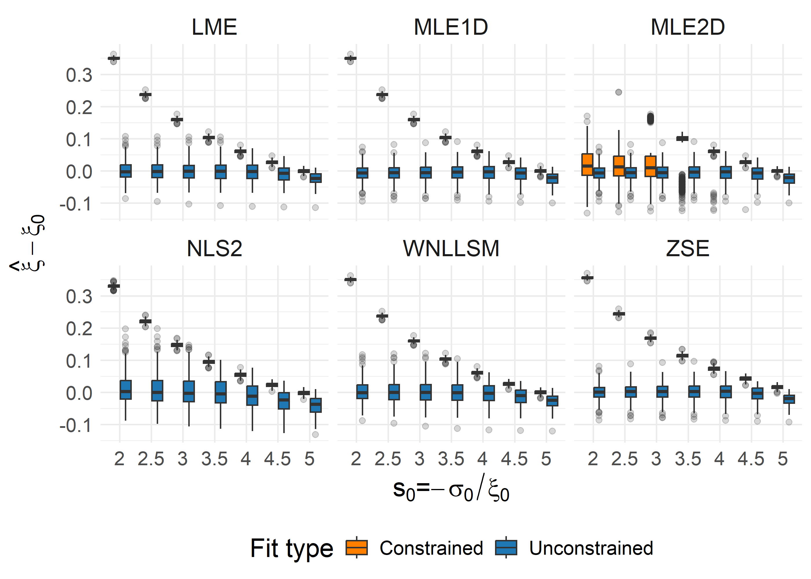<!-- -->

### Scale error

Difference between the estimated scale $\hat{\sigma}$ and the true scale
used for data generation $\sigma_0$.

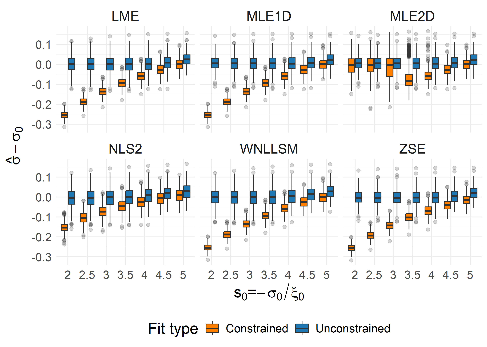<!-- -->

### Boundary error

Difference between the estimated boundary
$\frac{-\hat{\sigma}}{\hat{\xi}}$ and the boundary that results from the
true parameters used for data generation $\frac{-\sigma_0}{\xi_0}$.

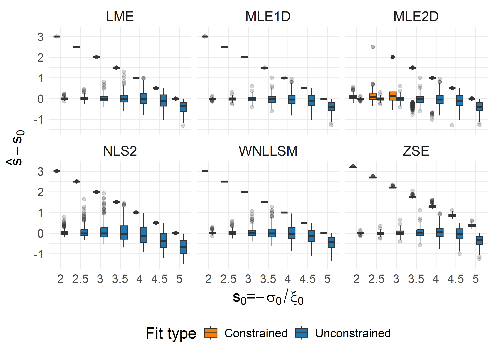<!-- -->

### Difference between boundary and constraint

Difference between the estimated boundary
$\frac{-\hat{\sigma}}{\hat{\xi}}$ and the constraint (here **5**).

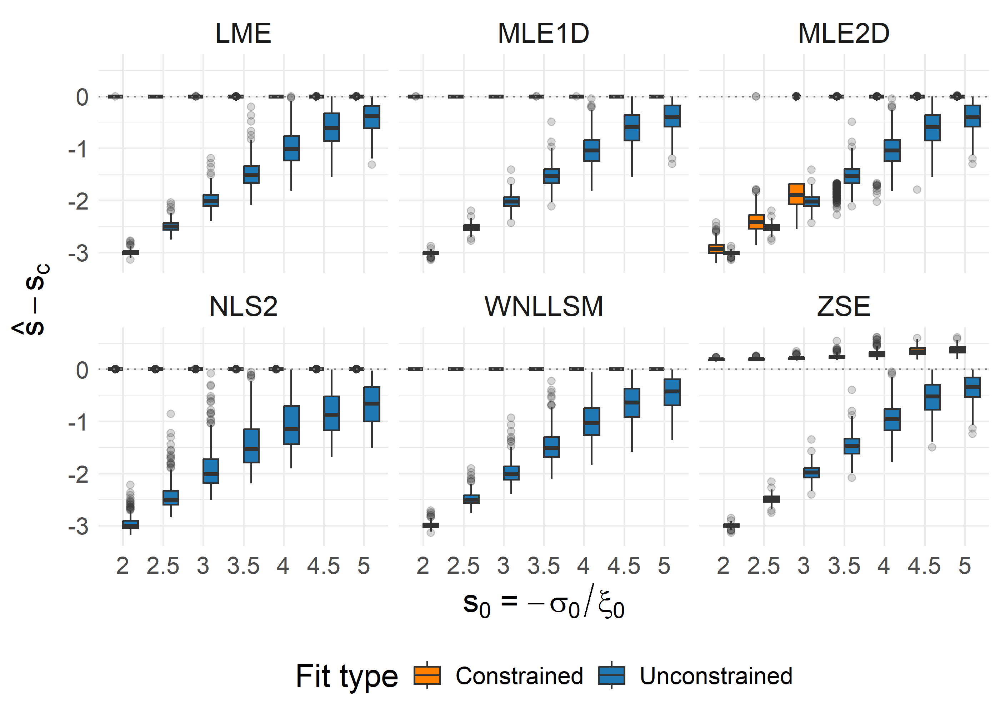<!-- -->

## Constraint validation

### Constraint satisfatcion rate

    ## Number of replicates where constraint is not satisfied:  1500

    ## # A tibble: 42 × 3
    ##    method data_bound valid_constr_rate
    ##    <chr>       <dbl>             <dbl>
    ##  1 LME           2                   1
    ##  2 LME           2.5                 1
    ##  3 LME           3                   1
    ##  4 LME           3.5                 1
    ##  5 LME           4                   1
    ##  6 LME           4.5                 1
    ##  7 LME           5                   1
    ##  8 MLE1D         2                   1
    ##  9 MLE1D         2.5                 1
    ## 10 MLE1D         3                   1
    ## # ℹ 32 more rows

## GPD density at constraint point

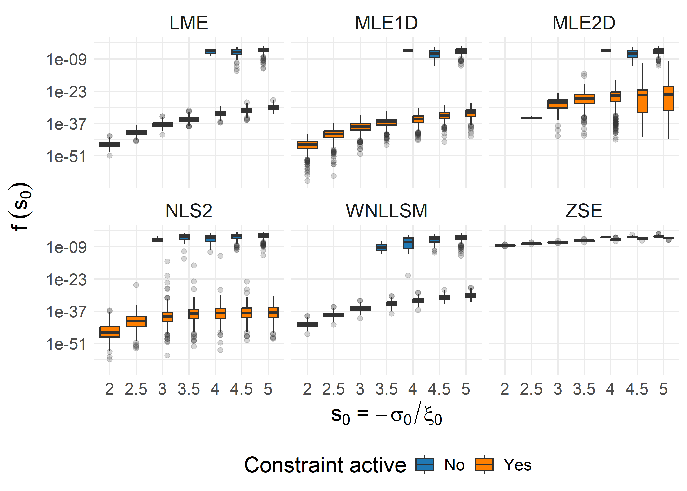<!-- -->

## Files written

These files have been written to the target directory,
`data/04_misspecification`:

    ## # A tibble: 72 × 4
    ##    path                               type         size modification_time  
    ##    <fs::path>                         <fct> <fs::bytes> <dttm>             
    ##  1 bound-2.5_n-1000_method-LME.RDS    file        28.1K 2025-11-05 10:12:42
    ##  2 bound-2.5_n-1000_method-MLE1D.RDS  file        30.2K 2025-11-05 10:13:23
    ##  3 bound-2.5_n-1000_method-MLE2D.RDS  file        27.5K 2025-11-05 10:14:15
    ##  4 bound-2.5_n-1000_method-MOM.RDS    file        16.6K 2025-11-05 10:31:18
    ##  5 bound-2.5_n-1000_method-NLS2.RDS   file        30.1K 2025-11-05 10:15:41
    ##  6 bound-2.5_n-1000_method-PWM.RDS    file        16.5K 2025-11-05 10:12:02
    ##  7 bound-2.5_n-1000_method-WNLLSM.RDS file          28K 2025-11-05 10:29:31
    ##  8 bound-2.5_n-1000_method-ZSE.RDS    file        31.1K 2025-11-05 10:30:04
    ##  9 bound-2_n-1000_method-LME.RDS      file        27.8K 2025-11-05 10:13:17
    ## 10 bound-2_n-1000_method-MLE1D.RDS    file        30.1K 2025-11-05 10:13:57
    ## # ℹ 62 more rows
