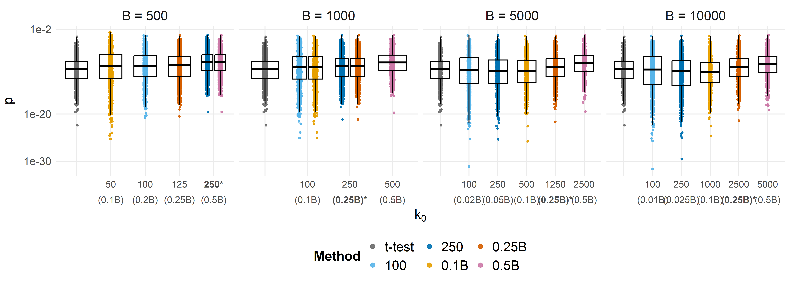
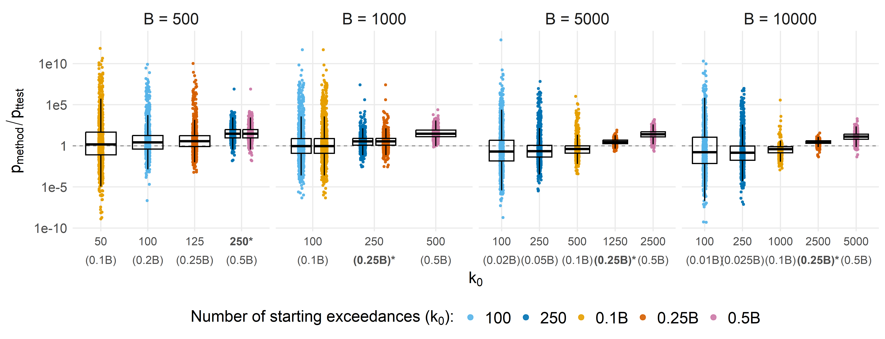
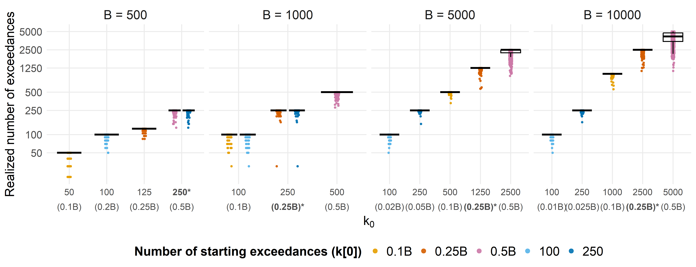

Assess the optimal number of starting exceedances
================
Compiled at 2026-03-22 15:37:17 UTC

``` r
here::i_am(paste0(params$name, ".Rmd"), uuid = "907ec83f-a14f-4333-abdd-a7b00d861428")
```

``` r
# create or *empty* the target directory, used to write this file's data: 
#projthis::proj_create_dir_target(params$name, clean = TRUE)

# function to get path to target directory: path_target("sample.csv")
path_target <- projthis::proj_path_target(params$name)

# function to get path to previous data: path_source("00-import", "sample.csv")
path_source <- projthis::proj_path_source(params$name)
```

## Load permApprox functions

## Method registry, file helpers, and per-method runner

### General method registry

### Engines

### Output path builders

## Compute p-values and save

## Collect & reshape

    ## 
    ##   0.1B  0.25B   0.5B    100    250 t-test 
    ##   4000   4000   4000   4000   4000   4000

## P-value plots

### Colors

### Plot function

### P-values

<!-- -->

### Ratios (approximated vs. t-test)

<!-- -->

## nExceed plots

<!-- -->

## Files written

These files have been written to the target directory,
`data/03_nexceed`:

    ## # A tibble: 1 × 4
    ##   path       type             size modification_time  
    ##   <fs::path> <fct>     <fs::bytes> <dttm>             
    ## 1 accuracy   directory           0 2026-03-17 13:46:31
