Accuracy study - Compare threshold methods
================
Compiled at 2026-06-10 11:00:17 UTC

``` r
here::i_am(paste0(params$name, ".Rmd"), uuid = "8c524a7c-7a6c-474e-8519-34397abf40d9")
```

``` r
# create or *empty* the target directory, used to write this file's data: 
#projthis::proj_create_dir_target(params$name, clean = TRUE)

# function to get path to target directory: path_target("sample.csv")
path_target <- projthis::proj_path_target(params$name)

# function to get path to previous data: path_source("00-import", "sample.csv")
path_source <- projthis::proj_path_source(params$name)
```

## Load permApprox functions

## Method registry, file helpers, and per-method runner

### General method registry

### Engines

### Output path builders

## ACCURACY

### Compute p-values and save

### Collect & reshape

### P-values by n (boxplots only)

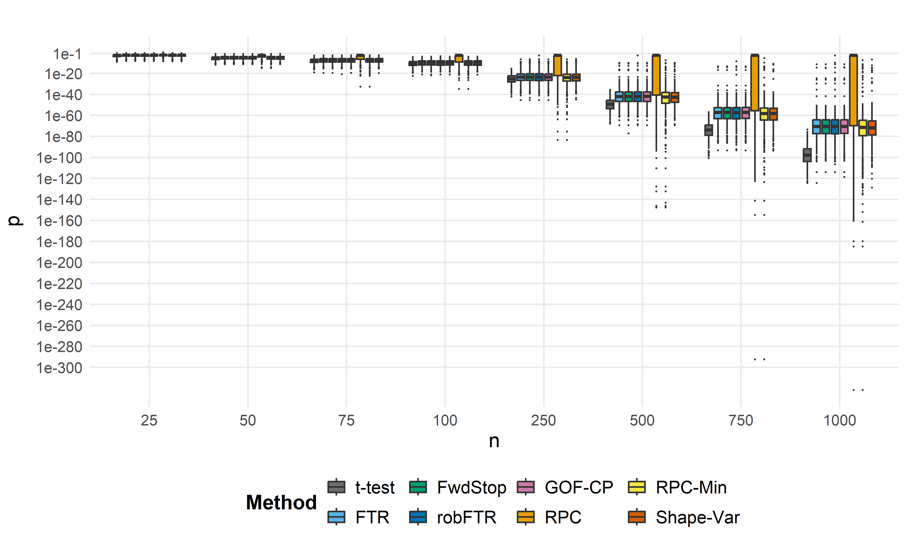<!-- -->

### Plot function (p-values / ratios)

### Plot function (exceedances)

### P-values by n

Approximated p-values with sample size on the x axis. The boxplots
represent non-zero p-values only.

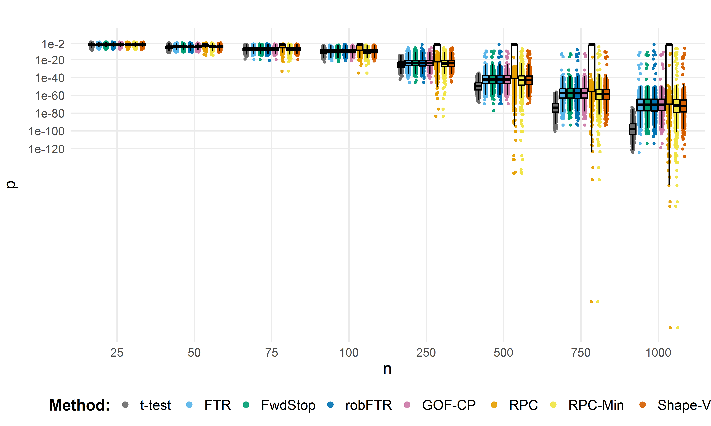<!-- -->

### nExceed by n

<!-- -->

### Filter out small p-values

To increase readability of the plots, we remove the two extremely small
p-value approximations for the RPC method.

### P-values by n

Since the RPC method performs so poorly, we will omit it in the
following.

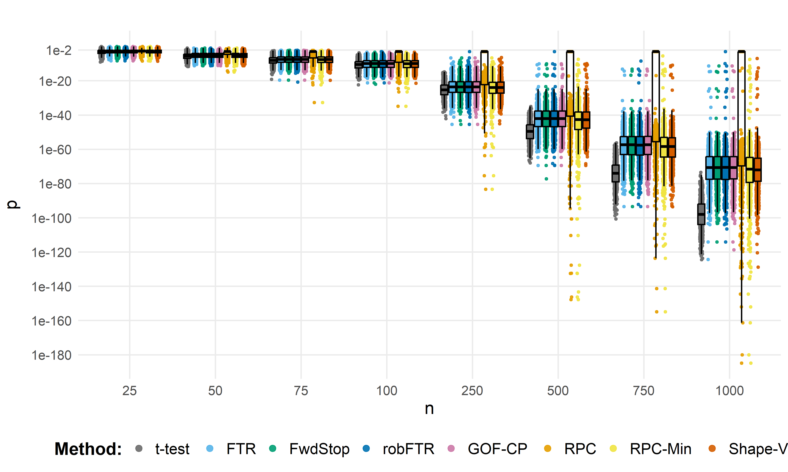<!-- -->

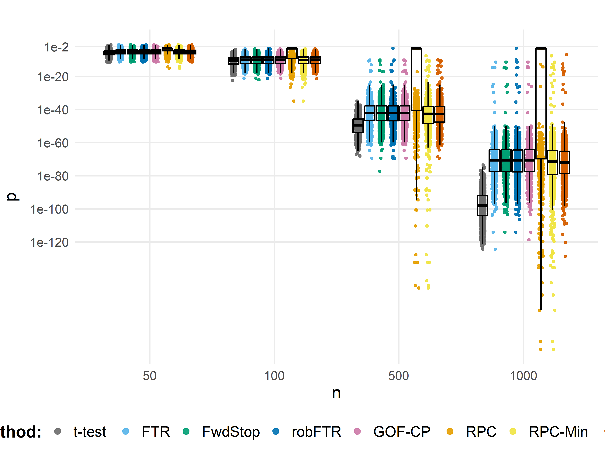<!-- -->

### Ratios by n

Ratios ($p_{method}$ / $p_{ttest}$) for non-zero p-values, with sample
size on the x axis.

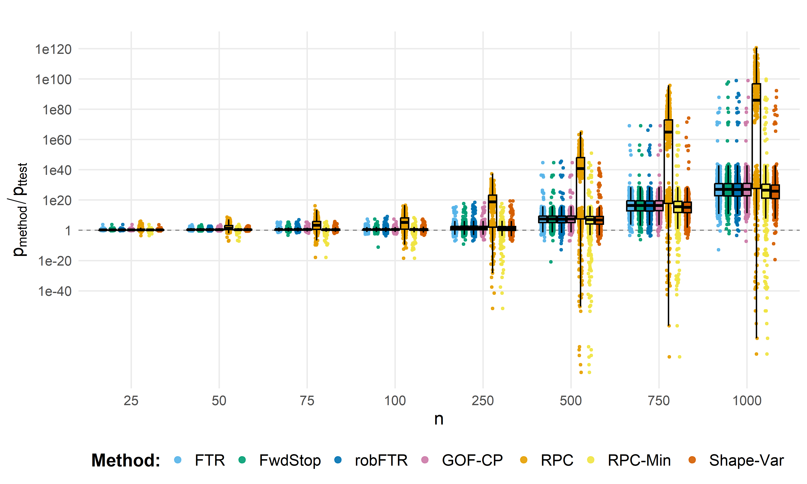<!-- -->

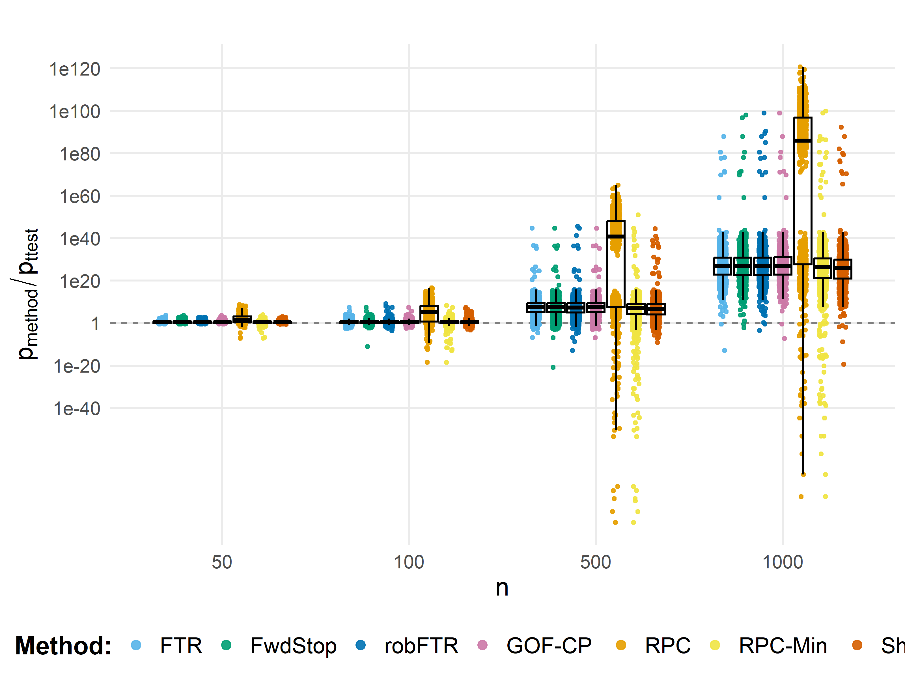<!-- -->

### nExceed by n

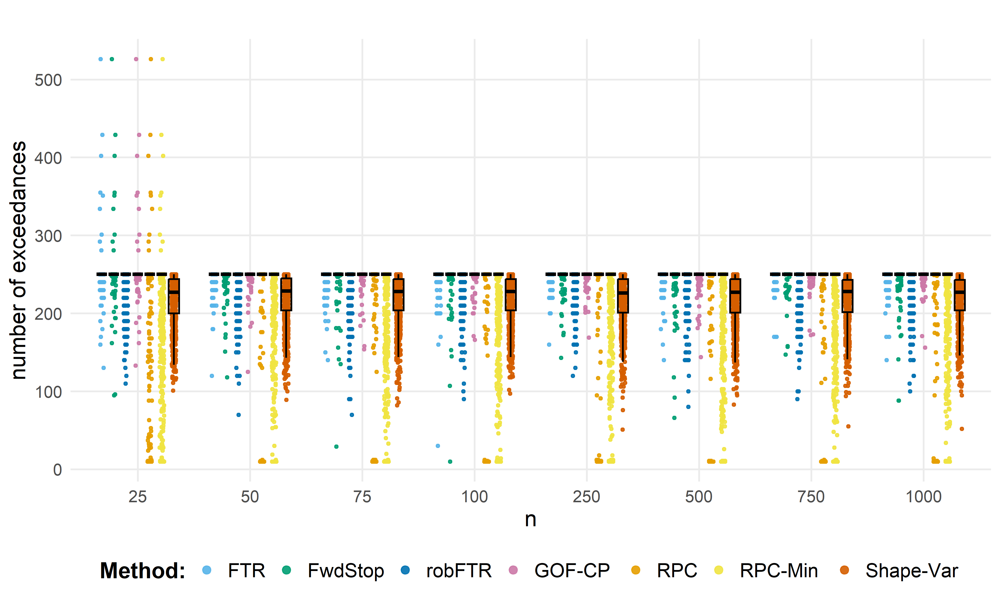<!-- -->

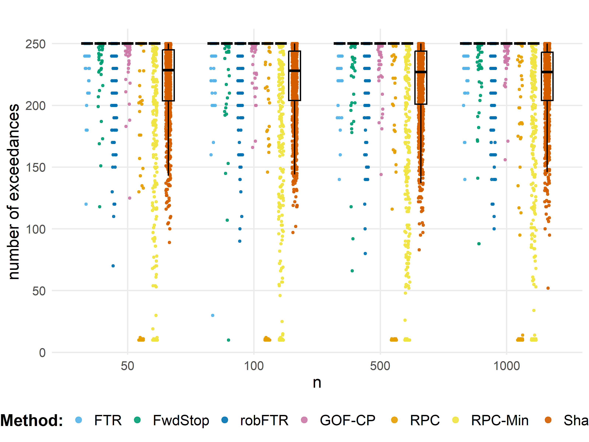<!-- -->

### Combined

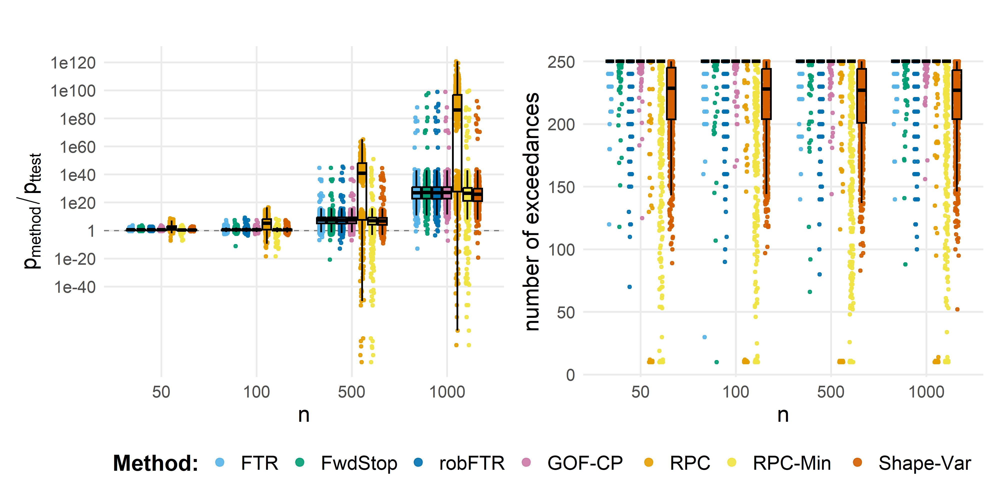<!-- -->

### P-values by d

Approximated p-values with effect size on the x axis. The boxplots
represent non-zero p-values only.

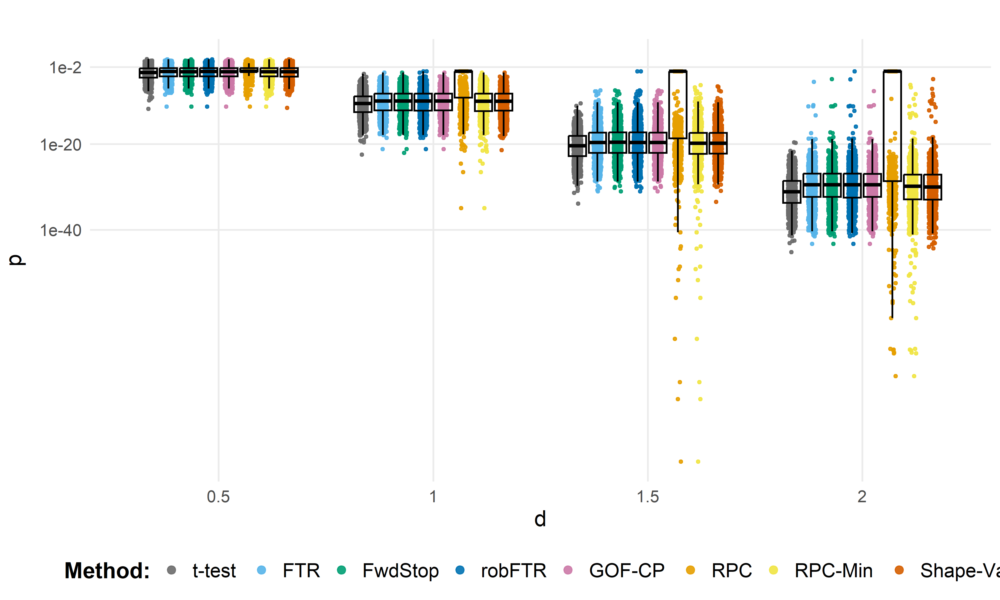<!-- -->

### Ratios by d

Ratios ($p_{method}$ / $p_{ttest}$) for non-zero p-values, with effect
size on the x axis.

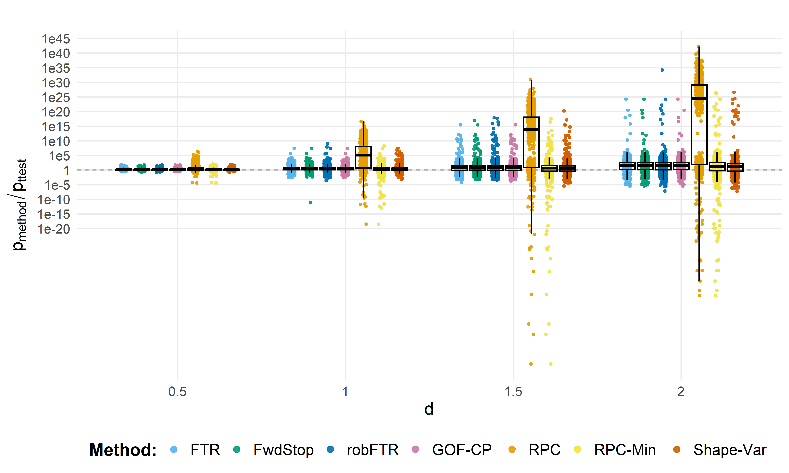<!-- -->

### P-values by B

Approximated p-values with number of permutations on the x axis. The
boxplots represent non-zero p-values only.

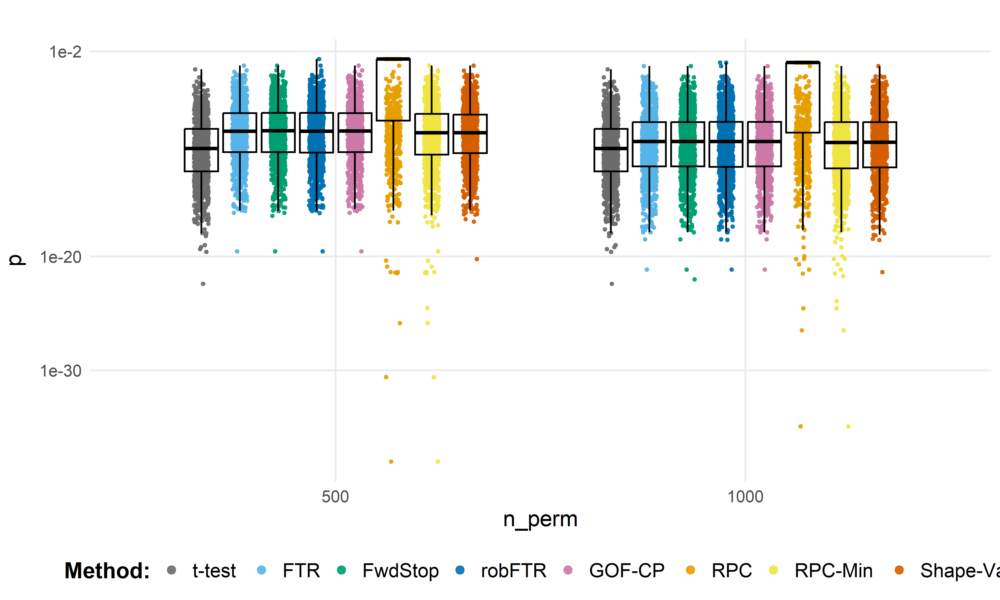<!-- -->

### Ratios by B

Ratios ($p_{method}$ / $p_{ttest}$) for non-zero p-values, with number
of permutations on the x axis.

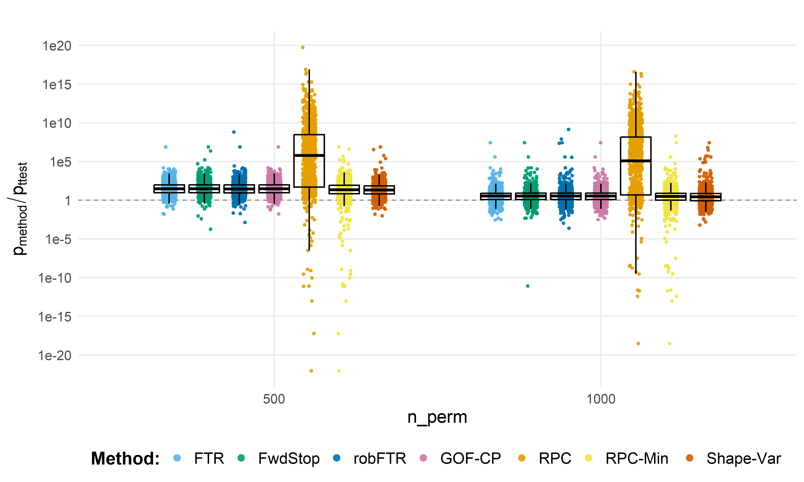<!-- -->

## Files written

These files have been written to the target directory,
`data/04_thresh_methods`:

    ## # A tibble: 2 × 4
    ##   path         type             size modification_time  
    ##   <fs::path>   <fct>     <fs::bytes> <dttm>             
    ## 1 accuracy     directory           0 2026-03-20 08:14:45
    ## 2 accuracy.zip file             887K 2026-03-20 08:12:35
