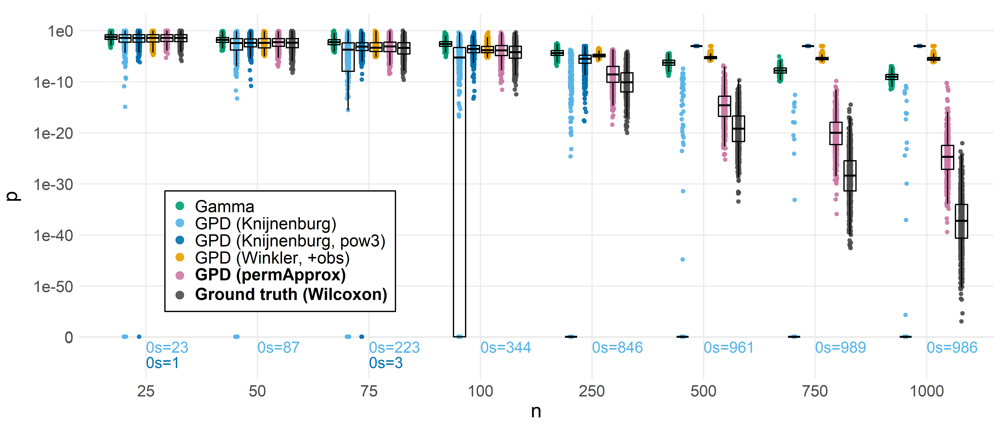
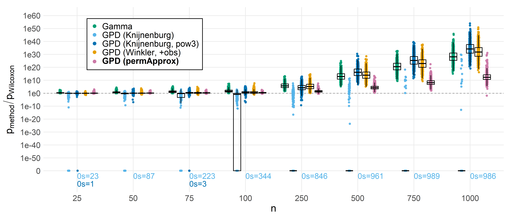
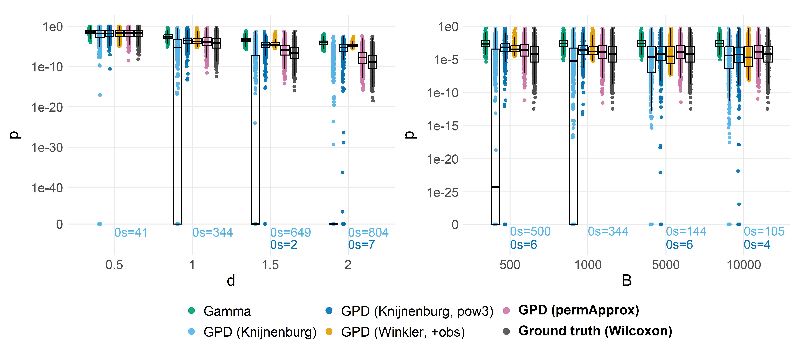
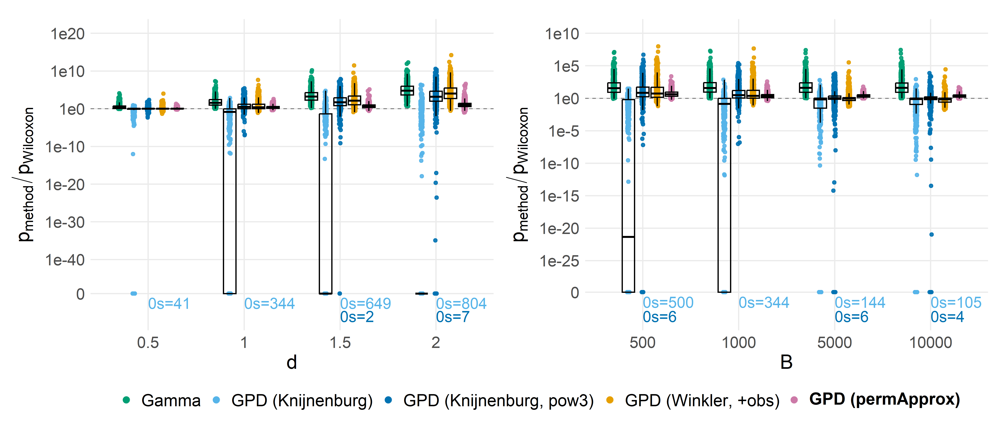

Accuracy study (Exponential data, Mann-Whitney U) - Compare p-value
approximation methods
================
Compiled at 2026-02-05 14:31:36 UTC

## Load permApprox functions

## Method registry, file helpers, and per-method runner

### Relabeling helper

### Method registry

Methods, we will consider in this study:

- **Wilcoxon**: Wilcoxon test (Mann-Whitney U statistic is used here)
  (considered as ground truth)
- **Empirical**: Empirical p-values.
- **Empirical (pow3)**: Empirical p-values where the test statistics are
  raised to the power 3 (just to double-check the implementation).
- **Gamma**: Gamma approximation of the complete permutation
  distribution, as suggested by *Winkler et al.* (2016).
- **GPD (Knijnen)**: GPD approximation as suggested by *Knijnenburg et
  al. (2009)*:
  - GPD parameter estimation with one-parameter maximum likelihood
    estimation.
  - Threshold: Failure to reject (FTR), starting with 250 exceedances.
- **GPD (Knijnen, pow3)**: Like GPD(KB), but all test statistics are
  raised to the power 3 before GPD approximation, as suggested by
  Knijnenburg et al. (2009).
- **GPD (Winkler, +obs)**: Like GPD(KB), but $t_{obs}$ is included in
  the permutation distribution, as suggested by *Winkler et al.* (2016).
- **GPD (pApprox, UC)**: GPD approximation with permApprox as follows:
  - GPD parameter estimation using Likelihood-Moment-Estimation (LME).
  - Unconstrained (UC) parameter estimation.
  - Threshold: Robust failure to reject (robFTR), starting with 25%
    exceedances.
- **GPD(pApprox, ξ≥0)**: GPD approximation with permApprox as follows:
  - GPD parameter estimation with one-parameter maximum likelihood
    estimation.
  - Constraint: The shape parameter $\xi$ must be non-negative.
  - Threshold: Robust failure to reject (robFTR), starting with 25%
    exceedances.
- **GPD (pApprox, s\>obs)**: Our proposed GPD approximation:
  - GPD parameter estimation using Likelihood-Moment-Estimation (LME).
  - Constraint: The support boundary $s$ must lie above the observed
    test statistic.
  - Threshold: Robust failure to reject (robFTR), starting with 25%
    exceedances.

For comparability, we use a **fitting threshold of 0.1** in all Gamma
and GPD approximation settings, which is two times the classical
$\alpha$ level of 0.05. That means, the fit is done if the empirical
p-value is smaller than 0.1.

``` r
# --- General method registry --------------------------------
# Edit here to add/remove methods or change labels/controls.
# Labels must match the plotting color names.
methods_registry <- list(
  wilcoxon = list(
    label  = "Wilcoxon",
    engine = "wilcoxon",
    params = list()
  ),
  
  empirical = list(
    label = "Empirical",
    engine = "empirical",
    params = list(
      power = 1
    )
  ),

  gamma = list(
    label  = "Gamma",
    engine = "gamma",
    params = list(
      gamma_ctrl = make_gamma_ctrl(
        include_obs   = FALSE,
        gof_test      = "none",
        gof_alpha     = 0.05
      )
    )
  ),

  gpd_knijnen = list(
    label  = "GPD (Knijnen)",
    engine = "gpd",
    params = list(
      power = 1,
      gpd_ctrl = make_gpd_ctrl(
        fit_method    = "MLE1D",
        tol           = 1e-10,
        include_obs   = FALSE,
        constraint    = "unconstrained",
        thresh_method = "ftr", # Failure to reject
        exceed0       = 250, # Start at 250 exceedances
        exceed0_min   = 0,
        exceed_min    = 10,
        thresh_step   = 10, # Increment by 10 if gof test fails
        gof_test      = "ad",
        gof_alpha     = 0.05,
        cores         = 1,
        verbose       = FALSE
      )
    )
  ),

  gpd_knijnen_pow3 = list(
    label  = "GPD (Knijnen, pow3)",
    engine = "gpd",
    params = list(
      power = 3,
      gpd_ctrl = make_gpd_ctrl(
        fit_method    = "MLE1D",
        tol           = 1e-10,
        include_obs   = FALSE,
        constraint    = "unconstrained",
        thresh_method = "ftr", # Failure to reject
        exceed0       = 250, # Start at 250 exceedances
        exceed0_min   = 0,
        exceed_min    = 10,
        thresh_step   = 10, # Increment by 10 if gof test fails
        gof_test      = "ad",
        gof_alpha     = 0.05,
        cores         = 1,
        verbose       = FALSE
      )
    )
  ),

  gpd_incl_obs = list(
    label  = "GPD (Winkler, +obs)",
    engine = "gpd",
    params = list(
      power = 1,
      gpd_ctrl = make_gpd_ctrl(
        fit_method    = "MLE1D",
        tol           = 1e-10,
        include_obs   = TRUE,
        constraint    = "unconstrained",
        thresh_method = "ftr", # Failure to reject
        exceed0       = 0.25, # Start at 0.25B exceedances
        exceed0_min   = 0,
        exceed_min    = 10,
        thresh_step   = 10, # Increment by 10 if gof test fails
        gof_test      = "ad",
        gof_alpha     = 0.05,
        cores         = 1,
        verbose       = FALSE
      )
    )
  ),
  
  gpd_papprox_uc = list(
    label  = "GPD (pApprox, UC)",
    engine = "gpd",
    params = list(
      power = 1,
      gpd_ctrl = make_gpd_ctrl(
        fit_method    = "LME",
        tol           = 1e-7,
        include_obs   = FALSE,
        constraint    = "unconstrained",
        thresh_method = "rob_ftr", # Failure to reject
        exceed0       = 0.25, # Start with 25% exceedances
        exceed0_min   = 250, # Use minimum 250 exceedances
        exceed_min    = 10,
        thresh_step   = 10, # Increment by 10 if gof test fails
        gof_test      = "ad",
        gof_alpha     = 0.05,
        cores         = 1,
        verbose       = FALSE
      )
    )
  ),

  gpd_papprox_xi_pos = list(
    label  = "GPD (pApprox, ξ≥0)",
    engine = "gpd",
    params = list(
      power = 1,
      gpd_ctrl = make_gpd_ctrl(
        fit_method    = "MLE1D",
        tol           = 1e-10,
        include_obs   = FALSE,
        constraint    = "shape_nonneg",
        thresh_method = "rob_ftr", # Failure to reject
        exceed0       = 0.25, # Start with 25% exceedances
        exceed0_min   = 250, # Use minimum 250 exceedances
        exceed_min    = 10,
        thresh_step   = 10, # Increment by 10 if gof test fails
        gof_test      = "ad",
        gof_alpha     = 0.05,
        cores         = 1,
        verbose       = FALSE
      )
    )
  ),

  gpd_papprox_supp_at_obs = list(
    label  = "GPD (pApprox, s>obs)",
    engine = "gpd",
    params = list(
      power = 1,
      gpd_ctrl = make_gpd_ctrl(
        fit_method    = "LME",
        tol           = 1e-7,
        include_obs   = FALSE,
        constraint    = "support_at_obs",
        thresh_method = "rob_ftr", # Failure to reject
        exceed0       = 0.25, # Start with 25% exceedances
        exceed0_min   = 250, # Use minimum 250 exceedances
        exceed_min    = 10,
        thresh_step   = 10, # Increment by 10 if gof test fails
        gof_test      = "ad",
        gof_alpha     = 0.05,
        cores         = 1,
        verbose       = FALSE
      )
    )
  )
)

# Labels (used later for factor order)
method_labels <- vapply(methods_registry, `[[`, "", "label")

# move "t-test" label to the end
i_wilcox <- which(method_labels == "Wilcoxon")
method_labels <- c(method_labels[-i_wilcox], method_labels[i_wilcox])

# Filter method(s)
# methods_registry_sub <- list(
#   gamma = methods_registry$gamma
# )
# methods_registry <- methods_registry_sub
```

### Engines

``` r
# Engine for the Wilcoxon / Mann-Whitney U test
.engine_wilcox <- function(lst_panels, n, d, n_perm, study_str, label, 
                           method_key, pi1 = NA_real_) {
  purrr::imap_dfr(lst_panels, function(panel, rep_id) {
    n_test <- nrow(panel)
    stopifnot(ncol(panel) == n_perm + 2)
    # U data: columns 1:n_perm, "uobs", "p_wilcox"
    colnames(panel) <- c(as.character(seq_len(n_perm)), "uobs", "p_wilcox")
    
    tibble(
      study    = gsub("^acc_", "", study_str),
      n, d, n_perm, pi1,
      rep      = rep_id,
      test_idx = seq_len(n_test),
      method   = label,
      pval     = as.numeric(panel[, "p_wilcox"]),  # asymptotic Wilcoxon p
      gpd_shape = NA_real_,
      gpd_scale = NA_real_,
      gpd_bound = NA_real_,
      meth_used = NA_character_,
      n_exceed  = NA_integer_
    )
  })
}


.engine_empirical <- function(lst_panels, n, d, n_perm, study_str, label, 
                              method_key, params, pi1 = NA_real_) {
  power <- params$power
  
  purrr::imap_dfr(lst_panels, function(panel, rep_id) {
    n_test <- nrow(panel)
    stopifnot(ncol(panel) == n_perm + 2)
    colnames(panel) <- c(as.character(seq_len(n_perm)), "uobs", "p_wilcox")
    
    perm_mat <- t(as.matrix(panel[, seq_len(n_perm), drop = FALSE]))  # (B x m)
    tobs_vec <- as.numeric(panel[, "uobs"])
    
    fit <- compute_p_values(
      obs_stats     = tobs_vec,
      perm_stats    = perm_mat,
      alternative   = "two_sided",
      null_center   = "mean",
      method        = "empirical",
      power         = power,
      adjust_method = "none"
    )
    
    tibble(
      study     = gsub("^acc_", "", study_str),
      n, d, n_perm, pi1,
      rep       = rep_id,
      test_idx  = seq_len(n_test),
      method    = label,
      pval      = fit$p_unadjusted,
      gpd_shape = NA_real_,
      gpd_scale = NA_real_,
      gpd_bound = NA_real_,
      meth_used = fit$method_used,
      n_exceed  = NA_integer_
    )
  })
}

.engine_gamma <- function(lst_panels, n, d, n_perm, study_str, label, 
                              method_key, params, pi1 = NA_real_) {
  gamma_ctrl <- params$gamma_ctrl
  purrr::imap_dfr(lst_panels, function(panel, rep_id) {
    n_test <- nrow(panel)
    stopifnot(ncol(panel) == n_perm + 2)
    colnames(panel) <- c(as.character(seq_len(n_perm)), "uobs", "p_wilcox")
    
    perm_mat <- t(as.matrix(panel[, seq_len(n_perm), drop = FALSE]))  # (B x m)
    tobs_vec <- as.numeric(panel[, "uobs"])
    
    fit <- compute_p_values(
      obs_stats     = (tobs_vec/100),
      perm_stats    = (perm_mat/100),# Gamma fit fails if test statistics are too large
      alternative   = "two_sided",
      null_center   = "mean", 
      method        = "gamma",
      fit_thresh    = 0.1, # Twice the standard alpha level
      gamma_ctrl    = gamma_ctrl, 
      adjust_method = "none"
    )
    
    tibble(
      study     = gsub("^acc_", "", study_str),
      n, d, n_perm, pi1,
      rep       = rep_id,
      test_idx  = seq_len(n_test),
      method    = label,
      pval      = fit$p_unadjusted,
      gpd_shape = NA_real_,
      gpd_scale = NA_real_,
      gpd_bound = NA_real_,
      meth_used = fit$method_used,
      n_exceed  = NA_integer_
    )
  })
}

.engine_gpd <- function(lst_panels, n, d, n_perm, study_str, label, 
                        method_key, params, pi1 = NA_real_) {
  gpd_ctrl <- params$gpd_ctrl
  power <- params$power
  
  purrr::imap_dfr(lst_panels, function(panel, rep_id) {
    n_test <- nrow(panel)
    stopifnot(ncol(panel) == n_perm + 2)
    colnames(panel) <- c(as.character(seq_len(n_perm)), "uobs", "p_wilcox")
    
    perm_mat <- t(as.matrix(panel[, seq_len(n_perm), drop = FALSE]))  # (B x m)
    tobs_vec <- as.numeric(panel[, "uobs"])

    fit <- compute_p_values(
      obs_stats     = tobs_vec,
      perm_stats    = perm_mat,
      eps_fct       = eps_slls_perm,
      sampsize      = n,
      alternative   = "two_sided",
      null_center   = "mean",
      method        = "gpd",
      fit_thresh    = 0.1, # Twice the alpha level
      power         = power,
      gpd_ctrl      = gpd_ctrl,
      adjust_method = "none"
    )
    
    if(!is.null(fit$gpd_fit)) {
      shape <- fit$gpd_fit$shape
      scale <- fit$gpd_fit$scale
      bound <- ifelse(shape < 0, -scale / shape, NA_real_)
    } else {
      shape <- scale <- bound <- NA_real_
    }
    
    tibble(
      study     = gsub("^acc_", "", study_str),
      n, d, n_perm, pi1,
      rep       = rep_id,
      test_idx  = seq_len(n_test),
      method    = label,
      pval      = fit$p_unadjusted,
      gpd_shape = shape,
      gpd_scale = scale,
      gpd_bound = bound,
      meth_used = fit$method_used,
      n_exceed  = fit$gpd_fit$n_exceed
    )
  })
}

# (Other engines like empirical/custom can be added here)

# --- Dispatcher ---------------------------------------------------------------
run_method_engine <- function(method_key, def, lst_panels, n, d, n_perm, 
                              study_str, pi1 = NA_real_) {
  engine <- def$engine
  label  <- def$label
  params <- def$params %||% list()
  
  switch(engine,
         wilcoxon  = .engine_wilcox(lst_panels, n, d, n_perm, study_str, 
                                   label, method_key, pi1),
         empirical = .engine_empirical(lst_panels, n, d, n_perm, study_str, 
                                       label, method_key, params, pi1),
         gamma     = .engine_gamma(lst_panels, n, d, n_perm, study_str, 
                                   label, method_key, params, pi1),
         gpd       = .engine_gpd(lst_panels, n, d, n_perm, study_str, 
                                 label, method_key, params, pi1),
         stop(sprintf("Unknown engine: %s", engine))
  )
}
```

### Output path builders

## ACCURACY

### Compute p-values and save

### Collect & reshape

### Plotting helper

### Filter, rename + colors

### By sample size (n)

#### P-values

<!-- -->

#### Ratios (method vs. Wilcoxon)

Ratios ($p_{method}$ / $p_{wilcox}$) for non-zero p-values, with sample
size on the x axis.

<!-- -->

### P-values by d and B

<!-- -->

### Ratios by d and B

<!-- -->

### Table: Accuracy metrics

<table class=" lightable-classic" style="color: black; font-family: &quot;Arial Narrow&quot;, &quot;Source Sans Pro&quot;, sans-serif; width: auto !important; margin-left: auto; margin-right: auto;">

<caption>

Accuracy vs. Wilcoxon by n (d=1, B=1000).
</caption>

<thead>

<tr>

<th style="text-align:right;">

n
</th>

<th style="text-align:left;">

method
</th>

<th style="text-align:right;">

N
</th>

<th style="text-align:left;">

bias
</th>

<th style="text-align:left;">

sd
</th>

<th style="text-align:left;">

rmse
</th>

<th style="text-align:left;">

cor_spear
</th>

<th style="text-align:right;">

N_pos
</th>

</tr>

</thead>

<tbody>

<tr>

<td style="text-align:right;">

25
</td>

<td style="text-align:left;">

Gamma
</td>

<td style="text-align:right;">

1000
</td>

<td style="text-align:left;">

9.91e-03
</td>

<td style="text-align:left;">

1.33e-02
</td>

<td style="text-align:left;">

1.66e-02
</td>

<td style="text-align:left;">

0.997
</td>

<td style="text-align:right;">

1000
</td>

</tr>

<tr>

<td style="text-align:right;">

25
</td>

<td style="text-align:left;">

GPD (Winkler, +obs)
</td>

<td style="text-align:right;">

1000
</td>

<td style="text-align:left;">

1.09e-03
</td>

<td style="text-align:left;">

1.22e-02
</td>

<td style="text-align:left;">

1.22e-02
</td>

<td style="text-align:left;">

0.995
</td>

<td style="text-align:right;">

1000
</td>

</tr>

<tr>

<td style="text-align:right;">

25
</td>

<td style="text-align:left;">

GPD (Knijnenburg)
</td>

<td style="text-align:right;">

1000
</td>

<td style="text-align:left;">

8.71e-04
</td>

<td style="text-align:left;">

1.22e-02
</td>

<td style="text-align:left;">

1.22e-02
</td>

<td style="text-align:left;">

0.995
</td>

<td style="text-align:right;">

977
</td>

</tr>

<tr>

<td style="text-align:right;">

25
</td>

<td style="text-align:left;">

GPD (Knijnenburg, pow3)
</td>

<td style="text-align:right;">

1000
</td>

<td style="text-align:left;">

3.84e-04
</td>

<td style="text-align:left;">

1.23e-02
</td>

<td style="text-align:left;">

1.23e-02
</td>

<td style="text-align:left;">

0.995
</td>

<td style="text-align:right;">

999
</td>

</tr>

<tr>

<td style="text-align:right;">

25
</td>

<td style="text-align:left;">

GPD (permApprox)
</td>

<td style="text-align:right;">

1000
</td>

<td style="text-align:left;">

9.92e-04
</td>

<td style="text-align:left;">

1.23e-02
</td>

<td style="text-align:left;">

1.23e-02
</td>

<td style="text-align:left;">

0.996
</td>

<td style="text-align:right;">

1000
</td>

</tr>

<tr>

<td style="text-align:right;">

50
</td>

<td style="text-align:left;">

Gamma
</td>

<td style="text-align:right;">

1000
</td>

<td style="text-align:left;">

9.10e-03
</td>

<td style="text-align:left;">

8.56e-03
</td>

<td style="text-align:left;">

1.25e-02
</td>

<td style="text-align:left;">

0.996
</td>

<td style="text-align:right;">

1000
</td>

</tr>

<tr>

<td style="text-align:right;">

50
</td>

<td style="text-align:left;">

GPD (Winkler, +obs)
</td>

<td style="text-align:right;">

1000
</td>

<td style="text-align:left;">

3.96e-04
</td>

<td style="text-align:left;">

6.42e-03
</td>

<td style="text-align:left;">

6.43e-03
</td>

<td style="text-align:left;">

0.982
</td>

<td style="text-align:right;">

1000
</td>

</tr>

<tr>

<td style="text-align:right;">

50
</td>

<td style="text-align:left;">

GPD (Knijnenburg)
</td>

<td style="text-align:right;">

1000
</td>

<td style="text-align:left;">

1.46e-04
</td>

<td style="text-align:left;">

6.42e-03
</td>

<td style="text-align:left;">

6.42e-03
</td>

<td style="text-align:left;">

0.978
</td>

<td style="text-align:right;">

913
</td>

</tr>

<tr>

<td style="text-align:right;">

50
</td>

<td style="text-align:left;">

GPD (Knijnenburg, pow3)
</td>

<td style="text-align:right;">

1000
</td>

<td style="text-align:left;">

-1.77e-04
</td>

<td style="text-align:left;">

6.47e-03
</td>

<td style="text-align:left;">

6.47e-03
</td>

<td style="text-align:left;">

0.981
</td>

<td style="text-align:right;">

1000
</td>

</tr>

<tr>

<td style="text-align:right;">

50
</td>

<td style="text-align:left;">

GPD (permApprox)
</td>

<td style="text-align:right;">

1000
</td>

<td style="text-align:left;">

6.49e-04
</td>

<td style="text-align:left;">

6.38e-03
</td>

<td style="text-align:left;">

6.41e-03
</td>

<td style="text-align:left;">

0.994
</td>

<td style="text-align:right;">

1000
</td>

</tr>

<tr>

<td style="text-align:right;">

75
</td>

<td style="text-align:left;">

Gamma
</td>

<td style="text-align:right;">

1000
</td>

<td style="text-align:left;">

6.26e-03
</td>

<td style="text-align:left;">

6.69e-03
</td>

<td style="text-align:left;">

9.16e-03
</td>

<td style="text-align:left;">

0.993
</td>

<td style="text-align:right;">

1000
</td>

</tr>

<tr>

<td style="text-align:right;">

75
</td>

<td style="text-align:left;">

GPD (Winkler, +obs)
</td>

<td style="text-align:right;">

1000
</td>

<td style="text-align:left;">

-5.09e-05
</td>

<td style="text-align:left;">

3.69e-03
</td>

<td style="text-align:left;">

3.69e-03
</td>

<td style="text-align:left;">

0.938
</td>

<td style="text-align:right;">

1000
</td>

</tr>

<tr>

<td style="text-align:right;">

75
</td>

<td style="text-align:left;">

GPD (Knijnenburg)
</td>

<td style="text-align:right;">

1000
</td>

<td style="text-align:left;">

-2.55e-04
</td>

<td style="text-align:left;">

3.68e-03
</td>

<td style="text-align:left;">

3.69e-03
</td>

<td style="text-align:left;">

0.908
</td>

<td style="text-align:right;">

777
</td>

</tr>

<tr>

<td style="text-align:right;">

75
</td>

<td style="text-align:left;">

GPD (Knijnenburg, pow3)
</td>

<td style="text-align:right;">

1000
</td>

<td style="text-align:left;">

-2.41e-04
</td>

<td style="text-align:left;">

3.73e-03
</td>

<td style="text-align:left;">

3.73e-03
</td>

<td style="text-align:left;">

0.930
</td>

<td style="text-align:right;">

997
</td>

</tr>

<tr>

<td style="text-align:right;">

75
</td>

<td style="text-align:left;">

GPD (permApprox)
</td>

<td style="text-align:right;">

1000
</td>

<td style="text-align:left;">

2.61e-04
</td>

<td style="text-align:left;">

3.69e-03
</td>

<td style="text-align:left;">

3.69e-03
</td>

<td style="text-align:left;">

0.989
</td>

<td style="text-align:right;">

1000
</td>

</tr>

<tr>

<td style="text-align:right;">

100
</td>

<td style="text-align:left;">

Gamma
</td>

<td style="text-align:right;">

1000
</td>

<td style="text-align:left;">

4.34e-03
</td>

<td style="text-align:left;">

5.03e-03
</td>

<td style="text-align:left;">

6.64e-03
</td>

<td style="text-align:left;">

0.990
</td>

<td style="text-align:right;">

1000
</td>

</tr>

<tr>

<td style="text-align:right;">

100
</td>

<td style="text-align:left;">

GPD (Winkler, +obs)
</td>

<td style="text-align:right;">

1000
</td>

<td style="text-align:left;">

6.31e-05
</td>

<td style="text-align:left;">

1.81e-03
</td>

<td style="text-align:left;">

1.81e-03
</td>

<td style="text-align:left;">

0.907
</td>

<td style="text-align:right;">

1000
</td>

</tr>

<tr>

<td style="text-align:right;">

100
</td>

<td style="text-align:left;">

GPD (Knijnenburg)
</td>

<td style="text-align:right;">

1000
</td>

<td style="text-align:left;">

-9.65e-05
</td>

<td style="text-align:left;">

1.80e-03
</td>

<td style="text-align:left;">

1.80e-03
</td>

<td style="text-align:left;">

0.836
</td>

<td style="text-align:right;">

656
</td>

</tr>

<tr>

<td style="text-align:right;">

100
</td>

<td style="text-align:left;">

GPD (Knijnenburg, pow3)
</td>

<td style="text-align:right;">

1000
</td>

<td style="text-align:left;">

9.26e-06
</td>

<td style="text-align:left;">

1.85e-03
</td>

<td style="text-align:left;">

1.85e-03
</td>

<td style="text-align:left;">

0.898
</td>

<td style="text-align:right;">

1000
</td>

</tr>

<tr>

<td style="text-align:right;">

100
</td>

<td style="text-align:left;">

GPD (permApprox)
</td>

<td style="text-align:right;">

1000
</td>

<td style="text-align:left;">

1.97e-04
</td>

<td style="text-align:left;">

1.79e-03
</td>

<td style="text-align:left;">

1.80e-03
</td>

<td style="text-align:left;">

0.986
</td>

<td style="text-align:right;">

1000
</td>

</tr>

<tr>

<td style="text-align:right;">

250
</td>

<td style="text-align:left;">

Gamma
</td>

<td style="text-align:right;">

1000
</td>

<td style="text-align:left;">

1.38e-04
</td>

<td style="text-align:left;">

2.92e-04
</td>

<td style="text-align:left;">

3.23e-04
</td>

<td style="text-align:left;">

0.967
</td>

<td style="text-align:right;">

1000
</td>

</tr>

<tr>

<td style="text-align:right;">

250
</td>

<td style="text-align:left;">

GPD (Winkler, +obs)
</td>

<td style="text-align:right;">

1000
</td>

<td style="text-align:left;">

2.16e-05
</td>

<td style="text-align:left;">

2.87e-05
</td>

<td style="text-align:left;">

3.59e-05
</td>

<td style="text-align:left;">

0.598
</td>

<td style="text-align:right;">

1000
</td>

</tr>

<tr>

<td style="text-align:right;">

250
</td>

<td style="text-align:left;">

GPD (Knijnenburg)
</td>

<td style="text-align:right;">

1000
</td>

<td style="text-align:left;">

1.67e-07
</td>

<td style="text-align:left;">

6.49e-06
</td>

<td style="text-align:left;">

6.48e-06
</td>

<td style="text-align:left;">

0.263
</td>

<td style="text-align:right;">

154
</td>

</tr>

<tr>

<td style="text-align:right;">

250
</td>

<td style="text-align:left;">

GPD (Knijnenburg, pow3)
</td>

<td style="text-align:right;">

1000
</td>

<td style="text-align:left;">

4.00e-05
</td>

<td style="text-align:left;">

1.54e-04
</td>

<td style="text-align:left;">

1.59e-04
</td>

<td style="text-align:left;">

0.527
</td>

<td style="text-align:right;">

1000
</td>

</tr>

<tr>

<td style="text-align:right;">

250
</td>

<td style="text-align:left;">

GPD (permApprox)
</td>

<td style="text-align:right;">

1000
</td>

<td style="text-align:left;">

1.53e-06
</td>

<td style="text-align:left;">

9.22e-06
</td>

<td style="text-align:left;">

9.35e-06
</td>

<td style="text-align:left;">

0.946
</td>

<td style="text-align:right;">

1000
</td>

</tr>

<tr>

<td style="text-align:right;">

500
</td>

<td style="text-align:left;">

Gamma
</td>

<td style="text-align:right;">

1000
</td>

<td style="text-align:left;">

1.68e-06
</td>

<td style="text-align:left;">

3.42e-06
</td>

<td style="text-align:left;">

3.81e-06
</td>

<td style="text-align:left;">

0.935
</td>

<td style="text-align:right;">

1000
</td>

</tr>

<tr>

<td style="text-align:right;">

500
</td>

<td style="text-align:left;">

GPD (Winkler, +obs)
</td>

<td style="text-align:right;">

1000
</td>

<td style="text-align:left;">

1.49e-05
</td>

<td style="text-align:left;">

8.34e-05
</td>

<td style="text-align:left;">

8.47e-05
</td>

<td style="text-align:left;">

0.349
</td>

<td style="text-align:right;">

1000
</td>

</tr>

<tr>

<td style="text-align:right;">

500
</td>

<td style="text-align:left;">

GPD (Knijnenburg)
</td>

<td style="text-align:right;">

1000
</td>

<td style="text-align:left;">

4.80e-11
</td>

<td style="text-align:left;">

1.15e-09
</td>

<td style="text-align:left;">

1.15e-09
</td>

<td style="text-align:left;">

0.094
</td>

<td style="text-align:right;">

39
</td>

</tr>

<tr>

<td style="text-align:right;">

500
</td>

<td style="text-align:left;">

GPD (Knijnenburg, pow3)
</td>

<td style="text-align:right;">

1000
</td>

<td style="text-align:left;">

9.99e-04
</td>

<td style="text-align:left;">

5.92e-12
</td>

<td style="text-align:left;">

9.99e-04
</td>

<td style="text-align:left;">

NA
</td>

<td style="text-align:right;">

1000
</td>

</tr>

<tr>

<td style="text-align:right;">

500
</td>

<td style="text-align:left;">

GPD (permApprox)
</td>

<td style="text-align:right;">

1000
</td>

<td style="text-align:left;">

3.50e-10
</td>

<td style="text-align:left;">

6.07e-09
</td>

<td style="text-align:left;">

6.07e-09
</td>

<td style="text-align:left;">

0.911
</td>

<td style="text-align:right;">

1000
</td>

</tr>

<tr>

<td style="text-align:right;">

750
</td>

<td style="text-align:left;">

Gamma
</td>

<td style="text-align:right;">

1000
</td>

<td style="text-align:left;">

6.75e-08
</td>

<td style="text-align:left;">

3.11e-07
</td>

<td style="text-align:left;">

3.18e-07
</td>

<td style="text-align:left;">

0.893
</td>

<td style="text-align:right;">

1000
</td>

</tr>

<tr>

<td style="text-align:right;">

750
</td>

<td style="text-align:left;">

GPD (Winkler, +obs)
</td>

<td style="text-align:right;">

1000
</td>

<td style="text-align:left;">

1.97e-05
</td>

<td style="text-align:left;">

1.17e-04
</td>

<td style="text-align:left;">

1.19e-04
</td>

<td style="text-align:left;">

0.164
</td>

<td style="text-align:right;">

1000
</td>

</tr>

<tr>

<td style="text-align:right;">

750
</td>

<td style="text-align:left;">

GPD (Knijnenburg)
</td>

<td style="text-align:right;">

1000
</td>

<td style="text-align:left;">

2.70e-16
</td>

<td style="text-align:left;">

8.18e-15
</td>

<td style="text-align:left;">

8.18e-15
</td>

<td style="text-align:left;">

0.018
</td>

<td style="text-align:right;">

11
</td>

</tr>

<tr>

<td style="text-align:right;">

750
</td>

<td style="text-align:left;">

GPD (Knijnenburg, pow3)
</td>

<td style="text-align:right;">

1000
</td>

<td style="text-align:left;">

9.99e-04
</td>

<td style="text-align:left;">

9.92e-17
</td>

<td style="text-align:left;">

9.99e-04
</td>

<td style="text-align:left;">

NA
</td>

<td style="text-align:right;">

1000
</td>

</tr>

<tr>

<td style="text-align:right;">

750
</td>

<td style="text-align:left;">

GPD (permApprox)
</td>

<td style="text-align:right;">

1000
</td>

<td style="text-align:left;">

1.67e-13
</td>

<td style="text-align:left;">

4.50e-12
</td>

<td style="text-align:left;">

4.51e-12
</td>

<td style="text-align:left;">

0.869
</td>

<td style="text-align:right;">

1000
</td>

</tr>

<tr>

<td style="text-align:right;">

1000
</td>

<td style="text-align:left;">

Gamma
</td>

<td style="text-align:right;">

1000
</td>

<td style="text-align:left;">

3.68e-09
</td>

<td style="text-align:left;">

9.42e-09
</td>

<td style="text-align:left;">

1.01e-08
</td>

<td style="text-align:left;">

0.865
</td>

<td style="text-align:right;">

1000
</td>

</tr>

<tr>

<td style="text-align:right;">

1000
</td>

<td style="text-align:left;">

GPD (Winkler, +obs)
</td>

<td style="text-align:right;">

1000
</td>

<td style="text-align:left;">

4.24e-05
</td>

<td style="text-align:left;">

1.88e-04
</td>

<td style="text-align:left;">

1.92e-04
</td>

<td style="text-align:left;">

0.106
</td>

<td style="text-align:right;">

1000
</td>

</tr>

<tr>

<td style="text-align:right;">

1000
</td>

<td style="text-align:left;">

GPD (Knijnenburg)
</td>

<td style="text-align:right;">

1000
</td>

<td style="text-align:left;">

2.24e-14
</td>

<td style="text-align:left;">

5.08e-13
</td>

<td style="text-align:left;">

5.09e-13
</td>

<td style="text-align:left;">

0.001
</td>

<td style="text-align:right;">

14
</td>

</tr>

<tr>

<td style="text-align:right;">

1000
</td>

<td style="text-align:left;">

GPD (Knijnenburg, pow3)
</td>

<td style="text-align:right;">

1000
</td>

<td style="text-align:left;">

9.99e-04
</td>

<td style="text-align:left;">

0.00e+00
</td>

<td style="text-align:left;">

9.99e-04
</td>

<td style="text-align:left;">

NA
</td>

<td style="text-align:right;">

1000
</td>

</tr>

<tr>

<td style="text-align:right;">

1000
</td>

<td style="text-align:left;">

GPD (permApprox)
</td>

<td style="text-align:right;">

1000
</td>

<td style="text-align:left;">

1.24e-13
</td>

<td style="text-align:left;">

2.47e-12
</td>

<td style="text-align:left;">

2.48e-12
</td>

<td style="text-align:left;">

0.825
</td>

<td style="text-align:right;">

1000
</td>

</tr>

</tbody>

</table>

<table class=" lightable-classic" style="color: black; font-family: &quot;Arial Narrow&quot;, &quot;Source Sans Pro&quot;, sans-serif; width: auto !important; margin-left: auto; margin-right: auto;">

<caption>

Accuracy vs. Wilcoxon across all settings.
</caption>

<thead>

<tr>

<th style="text-align:right;">

n
</th>

<th style="text-align:right;">

d
</th>

<th style="text-align:right;">

B
</th>

<th style="text-align:left;">

method
</th>

<th style="text-align:right;">

N
</th>

<th style="text-align:left;">

bias
</th>

<th style="text-align:left;">

sd
</th>

<th style="text-align:left;">

rmse
</th>

<th style="text-align:left;">

cor_spear
</th>

<th style="text-align:right;">

N_pos
</th>

</tr>

</thead>

<tbody>

<tr>

<td style="text-align:right;">

25
</td>

<td style="text-align:right;">

1.0
</td>

<td style="text-align:right;">

1000
</td>

<td style="text-align:left;">

Gamma
</td>

<td style="text-align:right;">

1000
</td>

<td style="text-align:left;">

9.91e-03
</td>

<td style="text-align:left;">

1.33e-02
</td>

<td style="text-align:left;">

1.66e-02
</td>

<td style="text-align:left;">

0.997
</td>

<td style="text-align:right;">

1000
</td>

</tr>

<tr>

<td style="text-align:right;">

25
</td>

<td style="text-align:right;">

1.0
</td>

<td style="text-align:right;">

1000
</td>

<td style="text-align:left;">

GPD (Winkler, +obs)
</td>

<td style="text-align:right;">

1000
</td>

<td style="text-align:left;">

1.09e-03
</td>

<td style="text-align:left;">

1.22e-02
</td>

<td style="text-align:left;">

1.22e-02
</td>

<td style="text-align:left;">

0.995
</td>

<td style="text-align:right;">

1000
</td>

</tr>

<tr>

<td style="text-align:right;">

25
</td>

<td style="text-align:right;">

1.0
</td>

<td style="text-align:right;">

1000
</td>

<td style="text-align:left;">

GPD (Knijnenburg)
</td>

<td style="text-align:right;">

1000
</td>

<td style="text-align:left;">

8.71e-04
</td>

<td style="text-align:left;">

1.22e-02
</td>

<td style="text-align:left;">

1.22e-02
</td>

<td style="text-align:left;">

0.995
</td>

<td style="text-align:right;">

977
</td>

</tr>

<tr>

<td style="text-align:right;">

25
</td>

<td style="text-align:right;">

1.0
</td>

<td style="text-align:right;">

1000
</td>

<td style="text-align:left;">

GPD (Knijnenburg, pow3)
</td>

<td style="text-align:right;">

1000
</td>

<td style="text-align:left;">

3.84e-04
</td>

<td style="text-align:left;">

1.23e-02
</td>

<td style="text-align:left;">

1.23e-02
</td>

<td style="text-align:left;">

0.995
</td>

<td style="text-align:right;">

999
</td>

</tr>

<tr>

<td style="text-align:right;">

25
</td>

<td style="text-align:right;">

1.0
</td>

<td style="text-align:right;">

1000
</td>

<td style="text-align:left;">

GPD (permApprox)
</td>

<td style="text-align:right;">

1000
</td>

<td style="text-align:left;">

9.92e-04
</td>

<td style="text-align:left;">

1.23e-02
</td>

<td style="text-align:left;">

1.23e-02
</td>

<td style="text-align:left;">

0.996
</td>

<td style="text-align:right;">

1000
</td>

</tr>

<tr>

<td style="text-align:right;">

50
</td>

<td style="text-align:right;">

1.0
</td>

<td style="text-align:right;">

1000
</td>

<td style="text-align:left;">

Gamma
</td>

<td style="text-align:right;">

1000
</td>

<td style="text-align:left;">

9.10e-03
</td>

<td style="text-align:left;">

8.56e-03
</td>

<td style="text-align:left;">

1.25e-02
</td>

<td style="text-align:left;">

0.996
</td>

<td style="text-align:right;">

1000
</td>

</tr>

<tr>

<td style="text-align:right;">

50
</td>

<td style="text-align:right;">

1.0
</td>

<td style="text-align:right;">

1000
</td>

<td style="text-align:left;">

GPD (Winkler, +obs)
</td>

<td style="text-align:right;">

1000
</td>

<td style="text-align:left;">

3.96e-04
</td>

<td style="text-align:left;">

6.42e-03
</td>

<td style="text-align:left;">

6.43e-03
</td>

<td style="text-align:left;">

0.982
</td>

<td style="text-align:right;">

1000
</td>

</tr>

<tr>

<td style="text-align:right;">

50
</td>

<td style="text-align:right;">

1.0
</td>

<td style="text-align:right;">

1000
</td>

<td style="text-align:left;">

GPD (Knijnenburg)
</td>

<td style="text-align:right;">

1000
</td>

<td style="text-align:left;">

1.46e-04
</td>

<td style="text-align:left;">

6.42e-03
</td>

<td style="text-align:left;">

6.42e-03
</td>

<td style="text-align:left;">

0.978
</td>

<td style="text-align:right;">

913
</td>

</tr>

<tr>

<td style="text-align:right;">

50
</td>

<td style="text-align:right;">

1.0
</td>

<td style="text-align:right;">

1000
</td>

<td style="text-align:left;">

GPD (Knijnenburg, pow3)
</td>

<td style="text-align:right;">

1000
</td>

<td style="text-align:left;">

-1.77e-04
</td>

<td style="text-align:left;">

6.47e-03
</td>

<td style="text-align:left;">

6.47e-03
</td>

<td style="text-align:left;">

0.981
</td>

<td style="text-align:right;">

1000
</td>

</tr>

<tr>

<td style="text-align:right;">

50
</td>

<td style="text-align:right;">

1.0
</td>

<td style="text-align:right;">

1000
</td>

<td style="text-align:left;">

GPD (permApprox)
</td>

<td style="text-align:right;">

1000
</td>

<td style="text-align:left;">

6.49e-04
</td>

<td style="text-align:left;">

6.38e-03
</td>

<td style="text-align:left;">

6.41e-03
</td>

<td style="text-align:left;">

0.994
</td>

<td style="text-align:right;">

1000
</td>

</tr>

<tr>

<td style="text-align:right;">

75
</td>

<td style="text-align:right;">

1.0
</td>

<td style="text-align:right;">

1000
</td>

<td style="text-align:left;">

Gamma
</td>

<td style="text-align:right;">

1000
</td>

<td style="text-align:left;">

6.26e-03
</td>

<td style="text-align:left;">

6.69e-03
</td>

<td style="text-align:left;">

9.16e-03
</td>

<td style="text-align:left;">

0.993
</td>

<td style="text-align:right;">

1000
</td>

</tr>

<tr>

<td style="text-align:right;">

75
</td>

<td style="text-align:right;">

1.0
</td>

<td style="text-align:right;">

1000
</td>

<td style="text-align:left;">

GPD (Winkler, +obs)
</td>

<td style="text-align:right;">

1000
</td>

<td style="text-align:left;">

-5.09e-05
</td>

<td style="text-align:left;">

3.69e-03
</td>

<td style="text-align:left;">

3.69e-03
</td>

<td style="text-align:left;">

0.938
</td>

<td style="text-align:right;">

1000
</td>

</tr>

<tr>

<td style="text-align:right;">

75
</td>

<td style="text-align:right;">

1.0
</td>

<td style="text-align:right;">

1000
</td>

<td style="text-align:left;">

GPD (Knijnenburg)
</td>

<td style="text-align:right;">

1000
</td>

<td style="text-align:left;">

-2.55e-04
</td>

<td style="text-align:left;">

3.68e-03
</td>

<td style="text-align:left;">

3.69e-03
</td>

<td style="text-align:left;">

0.908
</td>

<td style="text-align:right;">

777
</td>

</tr>

<tr>

<td style="text-align:right;">

75
</td>

<td style="text-align:right;">

1.0
</td>

<td style="text-align:right;">

1000
</td>

<td style="text-align:left;">

GPD (Knijnenburg, pow3)
</td>

<td style="text-align:right;">

1000
</td>

<td style="text-align:left;">

-2.41e-04
</td>

<td style="text-align:left;">

3.73e-03
</td>

<td style="text-align:left;">

3.73e-03
</td>

<td style="text-align:left;">

0.930
</td>

<td style="text-align:right;">

997
</td>

</tr>

<tr>

<td style="text-align:right;">

75
</td>

<td style="text-align:right;">

1.0
</td>

<td style="text-align:right;">

1000
</td>

<td style="text-align:left;">

GPD (permApprox)
</td>

<td style="text-align:right;">

1000
</td>

<td style="text-align:left;">

2.61e-04
</td>

<td style="text-align:left;">

3.69e-03
</td>

<td style="text-align:left;">

3.69e-03
</td>

<td style="text-align:left;">

0.989
</td>

<td style="text-align:right;">

1000
</td>

</tr>

<tr>

<td style="text-align:right;">

100
</td>

<td style="text-align:right;">

0.5
</td>

<td style="text-align:right;">

1000
</td>

<td style="text-align:left;">

Gamma
</td>

<td style="text-align:right;">

1000
</td>

<td style="text-align:left;">

9.37e-03
</td>

<td style="text-align:left;">

1.22e-02
</td>

<td style="text-align:left;">

1.53e-02
</td>

<td style="text-align:left;">

0.997
</td>

<td style="text-align:right;">

1000
</td>

</tr>

<tr>

<td style="text-align:right;">

100
</td>

<td style="text-align:right;">

0.5
</td>

<td style="text-align:right;">

1000
</td>

<td style="text-align:left;">

GPD (Winkler, +obs)
</td>

<td style="text-align:right;">

1000
</td>

<td style="text-align:left;">

7.30e-04
</td>

<td style="text-align:left;">

1.05e-02
</td>

<td style="text-align:left;">

1.06e-02
</td>

<td style="text-align:left;">

0.993
</td>

<td style="text-align:right;">

1000
</td>

</tr>

<tr>

<td style="text-align:right;">

100
</td>

<td style="text-align:right;">

0.5
</td>

<td style="text-align:right;">

1000
</td>

<td style="text-align:left;">

GPD (Knijnenburg)
</td>

<td style="text-align:right;">

1000
</td>

<td style="text-align:left;">

5.01e-04
</td>

<td style="text-align:left;">

1.06e-02
</td>

<td style="text-align:left;">

1.06e-02
</td>

<td style="text-align:left;">

0.992
</td>

<td style="text-align:right;">

959
</td>

</tr>

<tr>

<td style="text-align:right;">

100
</td>

<td style="text-align:right;">

0.5
</td>

<td style="text-align:right;">

1000
</td>

<td style="text-align:left;">

GPD (Knijnenburg, pow3)
</td>

<td style="text-align:right;">

1000
</td>

<td style="text-align:left;">

-3.50e-05
</td>

<td style="text-align:left;">

1.06e-02
</td>

<td style="text-align:left;">

1.06e-02
</td>

<td style="text-align:left;">

0.992
</td>

<td style="text-align:right;">

1000
</td>

</tr>

<tr>

<td style="text-align:right;">

100
</td>

<td style="text-align:right;">

0.5
</td>

<td style="text-align:right;">

1000
</td>

<td style="text-align:left;">

GPD (permApprox)
</td>

<td style="text-align:right;">

1000
</td>

<td style="text-align:left;">

8.49e-04
</td>

<td style="text-align:left;">

1.05e-02
</td>

<td style="text-align:left;">

1.06e-02
</td>

<td style="text-align:left;">

0.996
</td>

<td style="text-align:right;">

1000
</td>

</tr>

<tr>

<td style="text-align:right;">

100
</td>

<td style="text-align:right;">

1.0
</td>

<td style="text-align:right;">

500
</td>

<td style="text-align:left;">

Gamma
</td>

<td style="text-align:right;">

1000
</td>

<td style="text-align:left;">

4.23e-03
</td>

<td style="text-align:left;">

5.15e-03
</td>

<td style="text-align:left;">

6.66e-03
</td>

<td style="text-align:left;">

0.981
</td>

<td style="text-align:right;">

1000
</td>

</tr>

<tr>

<td style="text-align:right;">

100
</td>

<td style="text-align:right;">

1.0
</td>

<td style="text-align:right;">

500
</td>

<td style="text-align:left;">

GPD (Winkler, +obs)
</td>

<td style="text-align:right;">

1000
</td>

<td style="text-align:left;">

2.28e-04
</td>

<td style="text-align:left;">

2.64e-03
</td>

<td style="text-align:left;">

2.65e-03
</td>

<td style="text-align:left;">

0.866
</td>

<td style="text-align:right;">

1000
</td>

</tr>

<tr>

<td style="text-align:right;">

100
</td>

<td style="text-align:right;">

1.0
</td>

<td style="text-align:right;">

500
</td>

<td style="text-align:left;">

GPD (Knijnenburg)
</td>

<td style="text-align:right;">

1000
</td>

<td style="text-align:left;">

-8.67e-05
</td>

<td style="text-align:left;">

2.57e-03
</td>

<td style="text-align:left;">

2.57e-03
</td>

<td style="text-align:left;">

0.803
</td>

<td style="text-align:right;">

500
</td>

</tr>

<tr>

<td style="text-align:right;">

100
</td>

<td style="text-align:right;">

1.0
</td>

<td style="text-align:right;">

500
</td>

<td style="text-align:left;">

GPD (Knijnenburg, pow3)
</td>

<td style="text-align:right;">

1000
</td>

<td style="text-align:left;">

4.76e-04
</td>

<td style="text-align:left;">

2.92e-03
</td>

<td style="text-align:left;">

2.96e-03
</td>

<td style="text-align:left;">

0.843
</td>

<td style="text-align:right;">

994
</td>

</tr>

<tr>

<td style="text-align:right;">

100
</td>

<td style="text-align:right;">

1.0
</td>

<td style="text-align:right;">

500
</td>

<td style="text-align:left;">

GPD (permApprox)
</td>

<td style="text-align:right;">

1000
</td>

<td style="text-align:left;">

7.70e-04
</td>

<td style="text-align:left;">

2.75e-03
</td>

<td style="text-align:left;">

2.85e-03
</td>

<td style="text-align:left;">

0.982
</td>

<td style="text-align:right;">

1000
</td>

</tr>

<tr>

<td style="text-align:right;">

100
</td>

<td style="text-align:right;">

1.0
</td>

<td style="text-align:right;">

1000
</td>

<td style="text-align:left;">

Gamma
</td>

<td style="text-align:right;">

1000
</td>

<td style="text-align:left;">

4.34e-03
</td>

<td style="text-align:left;">

5.03e-03
</td>

<td style="text-align:left;">

6.64e-03
</td>

<td style="text-align:left;">

0.990
</td>

<td style="text-align:right;">

1000
</td>

</tr>

<tr>

<td style="text-align:right;">

100
</td>

<td style="text-align:right;">

1.0
</td>

<td style="text-align:right;">

1000
</td>

<td style="text-align:left;">

GPD (Winkler, +obs)
</td>

<td style="text-align:right;">

1000
</td>

<td style="text-align:left;">

6.31e-05
</td>

<td style="text-align:left;">

1.81e-03
</td>

<td style="text-align:left;">

1.81e-03
</td>

<td style="text-align:left;">

0.907
</td>

<td style="text-align:right;">

1000
</td>

</tr>

<tr>

<td style="text-align:right;">

100
</td>

<td style="text-align:right;">

1.0
</td>

<td style="text-align:right;">

1000
</td>

<td style="text-align:left;">

GPD (Knijnenburg)
</td>

<td style="text-align:right;">

1000
</td>

<td style="text-align:left;">

-9.65e-05
</td>

<td style="text-align:left;">

1.80e-03
</td>

<td style="text-align:left;">

1.80e-03
</td>

<td style="text-align:left;">

0.836
</td>

<td style="text-align:right;">

656
</td>

</tr>

<tr>

<td style="text-align:right;">

100
</td>

<td style="text-align:right;">

1.0
</td>

<td style="text-align:right;">

1000
</td>

<td style="text-align:left;">

GPD (Knijnenburg, pow3)
</td>

<td style="text-align:right;">

1000
</td>

<td style="text-align:left;">

9.26e-06
</td>

<td style="text-align:left;">

1.85e-03
</td>

<td style="text-align:left;">

1.85e-03
</td>

<td style="text-align:left;">

0.898
</td>

<td style="text-align:right;">

1000
</td>

</tr>

<tr>

<td style="text-align:right;">

100
</td>

<td style="text-align:right;">

1.0
</td>

<td style="text-align:right;">

1000
</td>

<td style="text-align:left;">

GPD (permApprox)
</td>

<td style="text-align:right;">

1000
</td>

<td style="text-align:left;">

1.97e-04
</td>

<td style="text-align:left;">

1.79e-03
</td>

<td style="text-align:left;">

1.80e-03
</td>

<td style="text-align:left;">

0.986
</td>

<td style="text-align:right;">

1000
</td>

</tr>

<tr>

<td style="text-align:right;">

100
</td>

<td style="text-align:right;">

1.0
</td>

<td style="text-align:right;">

5000
</td>

<td style="text-align:left;">

Gamma
</td>

<td style="text-align:right;">

1000
</td>

<td style="text-align:left;">

4.41e-03
</td>

<td style="text-align:left;">

4.89e-03
</td>

<td style="text-align:left;">

6.58e-03
</td>

<td style="text-align:left;">

0.998
</td>

<td style="text-align:right;">

1000
</td>

</tr>

<tr>

<td style="text-align:right;">

100
</td>

<td style="text-align:right;">

1.0
</td>

<td style="text-align:right;">

5000
</td>

<td style="text-align:left;">

GPD (Winkler, +obs)
</td>

<td style="text-align:right;">

1000
</td>

<td style="text-align:left;">

3.68e-05
</td>

<td style="text-align:left;">

9.76e-04
</td>

<td style="text-align:left;">

9.77e-04
</td>

<td style="text-align:left;">

0.973
</td>

<td style="text-align:right;">

1000
</td>

</tr>

<tr>

<td style="text-align:right;">

100
</td>

<td style="text-align:right;">

1.0
</td>

<td style="text-align:right;">

5000
</td>

<td style="text-align:left;">

GPD (Knijnenburg)
</td>

<td style="text-align:right;">

1000
</td>

<td style="text-align:left;">

-3.58e-05
</td>

<td style="text-align:left;">

9.57e-04
</td>

<td style="text-align:left;">

9.57e-04
</td>

<td style="text-align:left;">

0.926
</td>

<td style="text-align:right;">

856
</td>

</tr>

<tr>

<td style="text-align:right;">

100
</td>

<td style="text-align:right;">

1.0
</td>

<td style="text-align:right;">

5000
</td>

<td style="text-align:left;">

GPD (Knijnenburg, pow3)
</td>

<td style="text-align:right;">

1000
</td>

<td style="text-align:left;">

-3.60e-05
</td>

<td style="text-align:left;">

9.66e-04
</td>

<td style="text-align:left;">

9.67e-04
</td>

<td style="text-align:left;">

0.947
</td>

<td style="text-align:right;">

994
</td>

</tr>

<tr>

<td style="text-align:right;">

100
</td>

<td style="text-align:right;">

1.0
</td>

<td style="text-align:right;">

5000
</td>

<td style="text-align:left;">

GPD (permApprox)
</td>

<td style="text-align:right;">

1000
</td>

<td style="text-align:left;">

2.57e-04
</td>

<td style="text-align:left;">

9.80e-04
</td>

<td style="text-align:left;">

1.01e-03
</td>

<td style="text-align:left;">

0.997
</td>

<td style="text-align:right;">

1000
</td>

</tr>

<tr>

<td style="text-align:right;">

100
</td>

<td style="text-align:right;">

1.0
</td>

<td style="text-align:right;">

10000
</td>

<td style="text-align:left;">

Gamma
</td>

<td style="text-align:right;">

1000
</td>

<td style="text-align:left;">

4.43e-03
</td>

<td style="text-align:left;">

4.85e-03
</td>

<td style="text-align:left;">

6.57e-03
</td>

<td style="text-align:left;">

0.999
</td>

<td style="text-align:right;">

1000
</td>

</tr>

<tr>

<td style="text-align:right;">

100
</td>

<td style="text-align:right;">

1.0
</td>

<td style="text-align:right;">

10000
</td>

<td style="text-align:left;">

GPD (Winkler, +obs)
</td>

<td style="text-align:right;">

1000
</td>

<td style="text-align:left;">

4.18e-05
</td>

<td style="text-align:left;">

6.36e-04
</td>

<td style="text-align:left;">

6.37e-04
</td>

<td style="text-align:left;">

0.979
</td>

<td style="text-align:right;">

1000
</td>

</tr>

<tr>

<td style="text-align:right;">

100
</td>

<td style="text-align:right;">

1.0
</td>

<td style="text-align:right;">

10000
</td>

<td style="text-align:left;">

GPD (Knijnenburg)
</td>

<td style="text-align:right;">

1000
</td>

<td style="text-align:left;">

-2.36e-05
</td>

<td style="text-align:left;">

5.93e-04
</td>

<td style="text-align:left;">

5.93e-04
</td>

<td style="text-align:left;">

0.942
</td>

<td style="text-align:right;">

895
</td>

</tr>

<tr>

<td style="text-align:right;">

100
</td>

<td style="text-align:right;">

1.0
</td>

<td style="text-align:right;">

10000
</td>

<td style="text-align:left;">

GPD (Knijnenburg, pow3)
</td>

<td style="text-align:right;">

1000
</td>

<td style="text-align:left;">

-1.96e-05
</td>

<td style="text-align:left;">

5.88e-04
</td>

<td style="text-align:left;">

5.89e-04
</td>

<td style="text-align:left;">

0.958
</td>

<td style="text-align:right;">

996
</td>

</tr>

<tr>

<td style="text-align:right;">

100
</td>

<td style="text-align:right;">

1.0
</td>

<td style="text-align:right;">

10000
</td>

<td style="text-align:left;">

GPD (permApprox)
</td>

<td style="text-align:right;">

1000
</td>

<td style="text-align:left;">

2.61e-04
</td>

<td style="text-align:left;">

6.67e-04
</td>

<td style="text-align:left;">

7.16e-04
</td>

<td style="text-align:left;">

0.998
</td>

<td style="text-align:right;">

1000
</td>

</tr>

<tr>

<td style="text-align:right;">

100
</td>

<td style="text-align:right;">

1.5
</td>

<td style="text-align:right;">

1000
</td>

<td style="text-align:left;">

Gamma
</td>

<td style="text-align:right;">

1000
</td>

<td style="text-align:left;">

9.86e-04
</td>

<td style="text-align:left;">

1.80e-03
</td>

<td style="text-align:left;">

2.05e-03
</td>

<td style="text-align:left;">

0.980
</td>

<td style="text-align:right;">

1000
</td>

</tr>

<tr>

<td style="text-align:right;">

100
</td>

<td style="text-align:right;">

1.5
</td>

<td style="text-align:right;">

1000
</td>

<td style="text-align:left;">

GPD (Winkler, +obs)
</td>

<td style="text-align:right;">

1000
</td>

<td style="text-align:left;">

5.07e-05
</td>

<td style="text-align:left;">

2.15e-04
</td>

<td style="text-align:left;">

2.21e-04
</td>

<td style="text-align:left;">

0.760
</td>

<td style="text-align:right;">

1000
</td>

</tr>

<tr>

<td style="text-align:right;">

100
</td>

<td style="text-align:right;">

1.5
</td>

<td style="text-align:right;">

1000
</td>

<td style="text-align:left;">

GPD (Knijnenburg)
</td>

<td style="text-align:right;">

1000
</td>

<td style="text-align:left;">

-1.09e-05
</td>

<td style="text-align:left;">

2.04e-04
</td>

<td style="text-align:left;">

2.04e-04
</td>

<td style="text-align:left;">

0.546
</td>

<td style="text-align:right;">

351
</td>

</tr>

<tr>

<td style="text-align:right;">

100
</td>

<td style="text-align:right;">

1.5
</td>

<td style="text-align:right;">

1000
</td>

<td style="text-align:left;">

GPD (Knijnenburg, pow3)
</td>

<td style="text-align:right;">

1000
</td>

<td style="text-align:left;">

7.31e-05
</td>

<td style="text-align:left;">

2.89e-04
</td>

<td style="text-align:left;">

2.98e-04
</td>

<td style="text-align:left;">

0.710
</td>

<td style="text-align:right;">

998
</td>

</tr>

<tr>

<td style="text-align:right;">

100
</td>

<td style="text-align:right;">

1.5
</td>

<td style="text-align:right;">

1000
</td>

<td style="text-align:left;">

GPD (permApprox)
</td>

<td style="text-align:right;">

1000
</td>

<td style="text-align:left;">

3.93e-05
</td>

<td style="text-align:left;">

2.06e-04
</td>

<td style="text-align:left;">

2.09e-04
</td>

<td style="text-align:left;">

0.966
</td>

<td style="text-align:right;">

1000
</td>

</tr>

<tr>

<td style="text-align:right;">

100
</td>

<td style="text-align:right;">

2.0
</td>

<td style="text-align:right;">

1000
</td>

<td style="text-align:left;">

Gamma
</td>

<td style="text-align:right;">

1000
</td>

<td style="text-align:left;">

2.35e-04
</td>

<td style="text-align:left;">

5.32e-04
</td>

<td style="text-align:left;">

5.81e-04
</td>

<td style="text-align:left;">

0.972
</td>

<td style="text-align:right;">

1000
</td>

</tr>

<tr>

<td style="text-align:right;">

100
</td>

<td style="text-align:right;">

2.0
</td>

<td style="text-align:right;">

1000
</td>

<td style="text-align:left;">

GPD (Winkler, +obs)
</td>

<td style="text-align:right;">

1000
</td>

<td style="text-align:left;">

2.70e-05
</td>

<td style="text-align:left;">

4.16e-05
</td>

<td style="text-align:left;">

4.96e-05
</td>

<td style="text-align:left;">

0.618
</td>

<td style="text-align:right;">

1000
</td>

</tr>

<tr>

<td style="text-align:right;">

100
</td>

<td style="text-align:right;">

2.0
</td>

<td style="text-align:right;">

1000
</td>

<td style="text-align:left;">

GPD (Knijnenburg)
</td>

<td style="text-align:right;">

1000
</td>

<td style="text-align:left;">

-3.41e-07
</td>

<td style="text-align:left;">

2.14e-05
</td>

<td style="text-align:left;">

2.14e-05
</td>

<td style="text-align:left;">

0.336
</td>

<td style="text-align:right;">

196
</td>

</tr>

<tr>

<td style="text-align:right;">

100
</td>

<td style="text-align:right;">

2.0
</td>

<td style="text-align:right;">

1000
</td>

<td style="text-align:left;">

GPD (Knijnenburg, pow3)
</td>

<td style="text-align:right;">

1000
</td>

<td style="text-align:left;">

2.64e-05
</td>

<td style="text-align:left;">

6.86e-05
</td>

<td style="text-align:left;">

7.35e-05
</td>

<td style="text-align:left;">

0.564
</td>

<td style="text-align:right;">

993
</td>

</tr>

<tr>

<td style="text-align:right;">

100
</td>

<td style="text-align:right;">

2.0
</td>

<td style="text-align:right;">

1000
</td>

<td style="text-align:left;">

GPD (permApprox)
</td>

<td style="text-align:right;">

1000
</td>

<td style="text-align:left;">

4.73e-06
</td>

<td style="text-align:left;">

3.72e-05
</td>

<td style="text-align:left;">

3.75e-05
</td>

<td style="text-align:left;">

0.945
</td>

<td style="text-align:right;">

1000
</td>

</tr>

<tr>

<td style="text-align:right;">

250
</td>

<td style="text-align:right;">

1.0
</td>

<td style="text-align:right;">

1000
</td>

<td style="text-align:left;">

Gamma
</td>

<td style="text-align:right;">

1000
</td>

<td style="text-align:left;">

1.38e-04
</td>

<td style="text-align:left;">

2.92e-04
</td>

<td style="text-align:left;">

3.23e-04
</td>

<td style="text-align:left;">

0.967
</td>

<td style="text-align:right;">

1000
</td>

</tr>

<tr>

<td style="text-align:right;">

250
</td>

<td style="text-align:right;">

1.0
</td>

<td style="text-align:right;">

1000
</td>

<td style="text-align:left;">

GPD (Winkler, +obs)
</td>

<td style="text-align:right;">

1000
</td>

<td style="text-align:left;">

2.16e-05
</td>

<td style="text-align:left;">

2.87e-05
</td>

<td style="text-align:left;">

3.59e-05
</td>

<td style="text-align:left;">

0.598
</td>

<td style="text-align:right;">

1000
</td>

</tr>

<tr>

<td style="text-align:right;">

250
</td>

<td style="text-align:right;">

1.0
</td>

<td style="text-align:right;">

1000
</td>

<td style="text-align:left;">

GPD (Knijnenburg)
</td>

<td style="text-align:right;">

1000
</td>

<td style="text-align:left;">

1.67e-07
</td>

<td style="text-align:left;">

6.49e-06
</td>

<td style="text-align:left;">

6.48e-06
</td>

<td style="text-align:left;">

0.263
</td>

<td style="text-align:right;">

154
</td>

</tr>

<tr>

<td style="text-align:right;">

250
</td>

<td style="text-align:right;">

1.0
</td>

<td style="text-align:right;">

1000
</td>

<td style="text-align:left;">

GPD (Knijnenburg, pow3)
</td>

<td style="text-align:right;">

1000
</td>

<td style="text-align:left;">

4.00e-05
</td>

<td style="text-align:left;">

1.54e-04
</td>

<td style="text-align:left;">

1.59e-04
</td>

<td style="text-align:left;">

0.527
</td>

<td style="text-align:right;">

1000
</td>

</tr>

<tr>

<td style="text-align:right;">

250
</td>

<td style="text-align:right;">

1.0
</td>

<td style="text-align:right;">

1000
</td>

<td style="text-align:left;">

GPD (permApprox)
</td>

<td style="text-align:right;">

1000
</td>

<td style="text-align:left;">

1.53e-06
</td>

<td style="text-align:left;">

9.22e-06
</td>

<td style="text-align:left;">

9.35e-06
</td>

<td style="text-align:left;">

0.946
</td>

<td style="text-align:right;">

1000
</td>

</tr>

<tr>

<td style="text-align:right;">

500
</td>

<td style="text-align:right;">

1.0
</td>

<td style="text-align:right;">

1000
</td>

<td style="text-align:left;">

Gamma
</td>

<td style="text-align:right;">

1000
</td>

<td style="text-align:left;">

1.68e-06
</td>

<td style="text-align:left;">

3.42e-06
</td>

<td style="text-align:left;">

3.81e-06
</td>

<td style="text-align:left;">

0.935
</td>

<td style="text-align:right;">

1000
</td>

</tr>

<tr>

<td style="text-align:right;">

500
</td>

<td style="text-align:right;">

1.0
</td>

<td style="text-align:right;">

1000
</td>

<td style="text-align:left;">

GPD (Winkler, +obs)
</td>

<td style="text-align:right;">

1000
</td>

<td style="text-align:left;">

1.49e-05
</td>

<td style="text-align:left;">

8.34e-05
</td>

<td style="text-align:left;">

8.47e-05
</td>

<td style="text-align:left;">

0.349
</td>

<td style="text-align:right;">

1000
</td>

</tr>

<tr>

<td style="text-align:right;">

500
</td>

<td style="text-align:right;">

1.0
</td>

<td style="text-align:right;">

1000
</td>

<td style="text-align:left;">

GPD (Knijnenburg)
</td>

<td style="text-align:right;">

1000
</td>

<td style="text-align:left;">

4.80e-11
</td>

<td style="text-align:left;">

1.15e-09
</td>

<td style="text-align:left;">

1.15e-09
</td>

<td style="text-align:left;">

0.094
</td>

<td style="text-align:right;">

39
</td>

</tr>

<tr>

<td style="text-align:right;">

500
</td>

<td style="text-align:right;">

1.0
</td>

<td style="text-align:right;">

1000
</td>

<td style="text-align:left;">

GPD (Knijnenburg, pow3)
</td>

<td style="text-align:right;">

1000
</td>

<td style="text-align:left;">

9.99e-04
</td>

<td style="text-align:left;">

5.92e-12
</td>

<td style="text-align:left;">

9.99e-04
</td>

<td style="text-align:left;">

NA
</td>

<td style="text-align:right;">

1000
</td>

</tr>

<tr>

<td style="text-align:right;">

500
</td>

<td style="text-align:right;">

1.0
</td>

<td style="text-align:right;">

1000
</td>

<td style="text-align:left;">

GPD (permApprox)
</td>

<td style="text-align:right;">

1000
</td>

<td style="text-align:left;">

3.50e-10
</td>

<td style="text-align:left;">

6.07e-09
</td>

<td style="text-align:left;">

6.07e-09
</td>

<td style="text-align:left;">

0.911
</td>

<td style="text-align:right;">

1000
</td>

</tr>

<tr>

<td style="text-align:right;">

750
</td>

<td style="text-align:right;">

1.0
</td>

<td style="text-align:right;">

1000
</td>

<td style="text-align:left;">

Gamma
</td>

<td style="text-align:right;">

1000
</td>

<td style="text-align:left;">

6.75e-08
</td>

<td style="text-align:left;">

3.11e-07
</td>

<td style="text-align:left;">

3.18e-07
</td>

<td style="text-align:left;">

0.893
</td>

<td style="text-align:right;">

1000
</td>

</tr>

<tr>

<td style="text-align:right;">

750
</td>

<td style="text-align:right;">

1.0
</td>

<td style="text-align:right;">

1000
</td>

<td style="text-align:left;">

GPD (Winkler, +obs)
</td>

<td style="text-align:right;">

1000
</td>

<td style="text-align:left;">

1.97e-05
</td>

<td style="text-align:left;">

1.17e-04
</td>

<td style="text-align:left;">

1.19e-04
</td>

<td style="text-align:left;">

0.164
</td>

<td style="text-align:right;">

1000
</td>

</tr>

<tr>

<td style="text-align:right;">

750
</td>

<td style="text-align:right;">

1.0
</td>

<td style="text-align:right;">

1000
</td>

<td style="text-align:left;">

GPD (Knijnenburg)
</td>

<td style="text-align:right;">

1000
</td>

<td style="text-align:left;">

2.70e-16
</td>

<td style="text-align:left;">

8.18e-15
</td>

<td style="text-align:left;">

8.18e-15
</td>

<td style="text-align:left;">

0.018
</td>

<td style="text-align:right;">

11
</td>

</tr>

<tr>

<td style="text-align:right;">

750
</td>

<td style="text-align:right;">

1.0
</td>

<td style="text-align:right;">

1000
</td>

<td style="text-align:left;">

GPD (Knijnenburg, pow3)
</td>

<td style="text-align:right;">

1000
</td>

<td style="text-align:left;">

9.99e-04
</td>

<td style="text-align:left;">

9.92e-17
</td>

<td style="text-align:left;">

9.99e-04
</td>

<td style="text-align:left;">

NA
</td>

<td style="text-align:right;">

1000
</td>

</tr>

<tr>

<td style="text-align:right;">

750
</td>

<td style="text-align:right;">

1.0
</td>

<td style="text-align:right;">

1000
</td>

<td style="text-align:left;">

GPD (permApprox)
</td>

<td style="text-align:right;">

1000
</td>

<td style="text-align:left;">

1.67e-13
</td>

<td style="text-align:left;">

4.50e-12
</td>

<td style="text-align:left;">

4.51e-12
</td>

<td style="text-align:left;">

0.869
</td>

<td style="text-align:right;">

1000
</td>

</tr>

<tr>

<td style="text-align:right;">

1000
</td>

<td style="text-align:right;">

1.0
</td>

<td style="text-align:right;">

1000
</td>

<td style="text-align:left;">

Gamma
</td>

<td style="text-align:right;">

1000
</td>

<td style="text-align:left;">

3.68e-09
</td>

<td style="text-align:left;">

9.42e-09
</td>

<td style="text-align:left;">

1.01e-08
</td>

<td style="text-align:left;">

0.865
</td>

<td style="text-align:right;">

1000
</td>

</tr>

<tr>

<td style="text-align:right;">

1000
</td>

<td style="text-align:right;">

1.0
</td>

<td style="text-align:right;">

1000
</td>

<td style="text-align:left;">

GPD (Winkler, +obs)
</td>

<td style="text-align:right;">

1000
</td>

<td style="text-align:left;">

4.24e-05
</td>

<td style="text-align:left;">

1.88e-04
</td>

<td style="text-align:left;">

1.92e-04
</td>

<td style="text-align:left;">

0.106
</td>

<td style="text-align:right;">

1000
</td>

</tr>

<tr>

<td style="text-align:right;">

1000
</td>

<td style="text-align:right;">

1.0
</td>

<td style="text-align:right;">

1000
</td>

<td style="text-align:left;">

GPD (Knijnenburg)
</td>

<td style="text-align:right;">

1000
</td>

<td style="text-align:left;">

2.24e-14
</td>

<td style="text-align:left;">

5.08e-13
</td>

<td style="text-align:left;">

5.09e-13
</td>

<td style="text-align:left;">

0.001
</td>

<td style="text-align:right;">

14
</td>

</tr>

<tr>

<td style="text-align:right;">

1000
</td>

<td style="text-align:right;">

1.0
</td>

<td style="text-align:right;">

1000
</td>

<td style="text-align:left;">

GPD (Knijnenburg, pow3)
</td>

<td style="text-align:right;">

1000
</td>

<td style="text-align:left;">

9.99e-04
</td>

<td style="text-align:left;">

0.00e+00
</td>

<td style="text-align:left;">

9.99e-04
</td>

<td style="text-align:left;">

NA
</td>

<td style="text-align:right;">

1000
</td>

</tr>

<tr>

<td style="text-align:right;">

1000
</td>

<td style="text-align:right;">

1.0
</td>

<td style="text-align:right;">

1000
</td>

<td style="text-align:left;">

GPD (permApprox)
</td>

<td style="text-align:right;">

1000
</td>

<td style="text-align:left;">

1.24e-13
</td>

<td style="text-align:left;">

2.47e-12
</td>

<td style="text-align:left;">

2.48e-12
</td>

<td style="text-align:left;">

0.825
</td>

<td style="text-align:right;">

1000
</td>

</tr>

</tbody>

</table>

## Files written

These files have been written to the target directory,
`data/02_p_approx_methods`:

    ## # A tibble: 2 × 4
    ##   path       type             size modification_time  
    ##   <fs::path> <fct>     <fs::bytes> <dttm>             
    ## 1 accuracy   directory           0 2026-02-05 13:56:22
    ## 2 gamma_old  directory           0 2026-02-05 12:41:04
