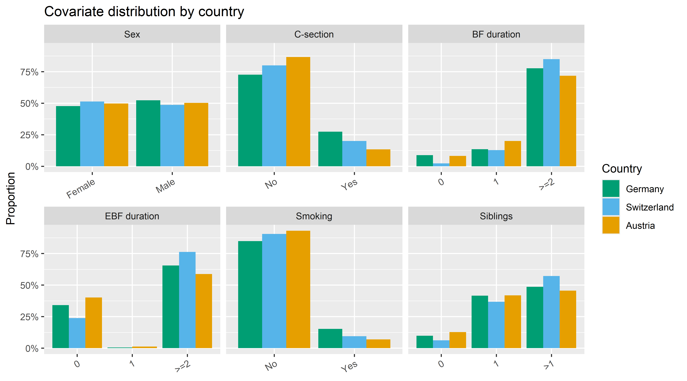
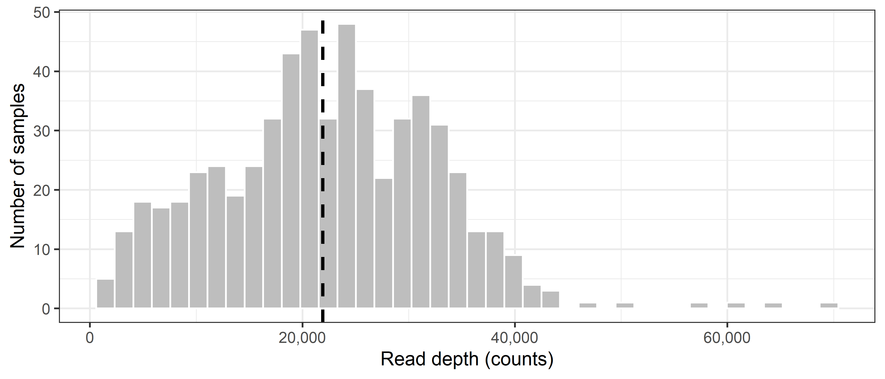

Data overview
================
Compiled at 2026-06-08 14:25:54 UTC

## Load data

### ASV level

    ## phyloseq-class experiment-level object
    ## otu_table()   OTU Table:         [ 2045 taxa and 592 samples ]
    ## sample_data() Sample Data:       [ 592 samples by 9 sample variables ]
    ## tax_table()   Taxonomy Table:    [ 2045 taxa by 7 taxonomic ranks ]

### Genus level

    ## phyloseq-class experiment-level object
    ## otu_table()   OTU Table:         [ 235 taxa and 592 samples ]
    ## sample_data() Sample Data:       [ 592 samples by 9 sample variables ]
    ## tax_table()   Taxonomy Table:    [ 235 taxa by 7 taxonomic ranks ]

## Sample characteristics

<table class="table table-striped table-condensed" style="color: black; width: auto !important; margin-left: auto; margin-right: auto;">

<caption>

Cohort characteristics (N = 592)
</caption>

<thead>

<tr>

<th style="text-align:left;">

Variable
</th>

<th style="text-align:left;">

Value
</th>

<th style="text-align:left;">

n (%)
</th>

</tr>

</thead>

<tbody>

<tr>

<td style="text-align:left;vertical-align: top !important;" rowspan="3">

Country
</td>

<td style="text-align:left;">

Germany
</td>

<td style="text-align:left;">

197 (33.3%)
</td>

</tr>

<tr>

<td style="text-align:left;">

Switzerland
</td>

<td style="text-align:left;">

222 (37.5%)
</td>

</tr>

<tr>

<td style="text-align:left;">

Austria
</td>

<td style="text-align:left;">

173 (29.2%)
</td>

</tr>

<tr>

<td style="text-align:left;vertical-align: top !important;" rowspan="2">

Sex
</td>

<td style="text-align:left;">

Female
</td>

<td style="text-align:left;">

294 (49.7%)
</td>

</tr>

<tr>

<td style="text-align:left;">

Male
</td>

<td style="text-align:left;">

298 (50.3%)
</td>

</tr>

<tr>

<td style="text-align:left;vertical-align: top !important;" rowspan="3">

C-section
</td>

<td style="text-align:left;">

No
</td>

<td style="text-align:left;">

468 (79.1%)
</td>

</tr>

<tr>

<td style="text-align:left;">

Yes
</td>

<td style="text-align:left;">

121 (20.4%)
</td>

</tr>

<tr>

<td style="text-align:left;">

NA
</td>

<td style="text-align:left;">

3 (0.5%)
</td>

</tr>

<tr>

<td style="text-align:left;vertical-align: top !important;" rowspan="4">

BF duration
</td>

<td style="text-align:left;">

0
</td>

<td style="text-align:left;">

36 (6.1%)
</td>

</tr>

<tr>

<td style="text-align:left;">

1
</td>

<td style="text-align:left;">

88 (14.9%)
</td>

</tr>

<tr>

<td style="text-align:left;">

\>=2
</td>

<td style="text-align:left;">

456 (77%)
</td>

</tr>

<tr>

<td style="text-align:left;">

NA
</td>

<td style="text-align:left;">

12 (2%)
</td>

</tr>

<tr>

<td style="text-align:left;vertical-align: top !important;" rowspan="4">

EBF duration
</td>

<td style="text-align:left;">

0
</td>

<td style="text-align:left;">

179 (30.2%)
</td>

</tr>

<tr>

<td style="text-align:left;">

1
</td>

<td style="text-align:left;">

3 (0.5%)
</td>

</tr>

<tr>

<td style="text-align:left;">

\>=2
</td>

<td style="text-align:left;">

375 (63.3%)
</td>

</tr>

<tr>

<td style="text-align:left;">

NA
</td>

<td style="text-align:left;">

35 (5.9%)
</td>

</tr>

<tr>

<td style="text-align:left;vertical-align: top !important;" rowspan="2">

Smoking
</td>

<td style="text-align:left;">

No
</td>

<td style="text-align:left;">

529 (89.4%)
</td>

</tr>

<tr>

<td style="text-align:left;">

Yes
</td>

<td style="text-align:left;">

63 (10.6%)
</td>

</tr>

<tr>

<td style="text-align:left;vertical-align: top !important;" rowspan="4">

Siblings
</td>

<td style="text-align:left;">

0
</td>

<td style="text-align:left;">

46 (7.8%)
</td>

</tr>

<tr>

<td style="text-align:left;">

1
</td>

<td style="text-align:left;">

200 (33.8%)
</td>

</tr>

<tr>

<td style="text-align:left;">

\>1
</td>

<td style="text-align:left;">

257 (43.4%)
</td>

</tr>

<tr>

<td style="text-align:left;">

NA
</td>

<td style="text-align:left;">

89 (15%)
</td>

</tr>

</tbody>

</table>

## Metadata balance across groups

<!-- -->

## Sequencing depth

<!-- -->

<!-- -->

## Files written

These files have been written to the target directory,
`data/01_overview`:

    ## # A tibble: 1 × 4
    ##   path                           type         size modification_time  
    ##   <fs::path>                     <fct> <fs::bytes> <dttm>             
    ## 1 tbl_sample_characteristics.tex file        1.26K 2026-06-08 14:25:56
