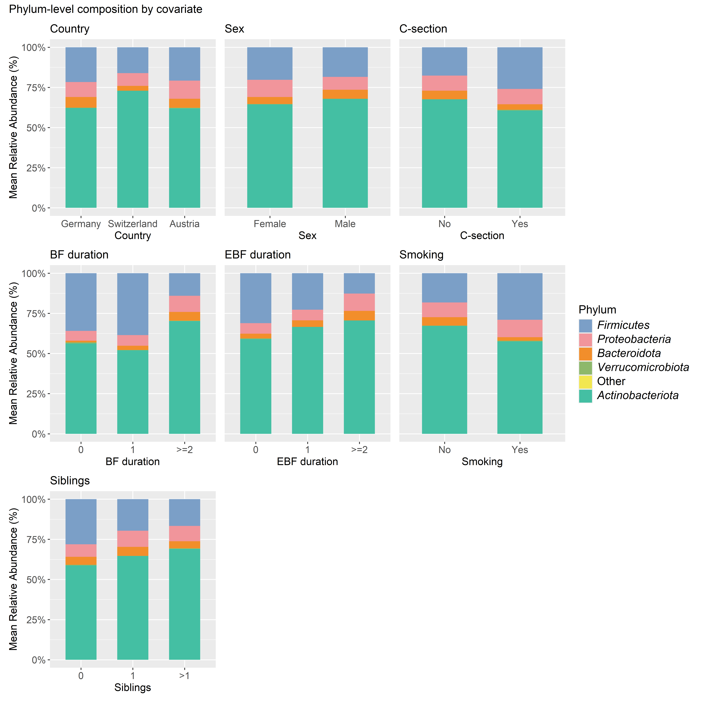
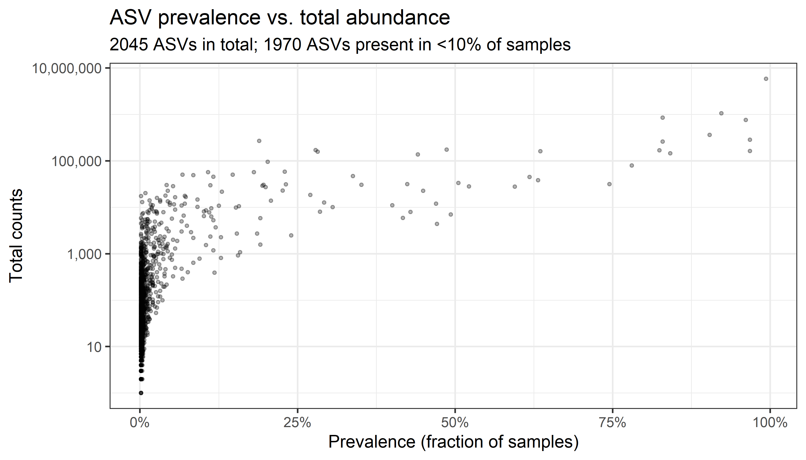
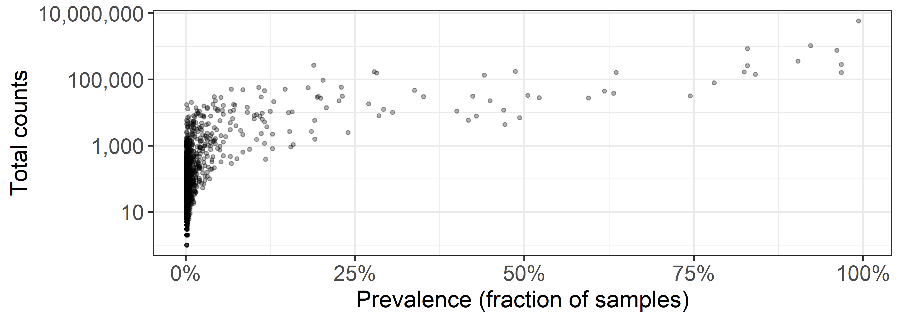
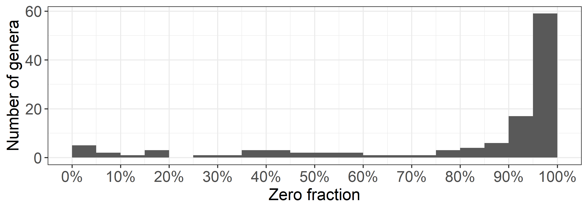

Taxonomic aggregation and filtering
================
Compiled at 2026-06-22 07:51:20 UTC

## Load packages

## Load data

**Summary of overall sample counts:**

    ##    Min. 1st Qu.  Median    Mean 3rd Qu.    Max. 
    ##    1456   15322   21914   22249   29545   69556

## Helper functions

## Number of taxa across taxonomic levels

    ## # A tibble: 6 × 3
    ##   taxonomic_level n_taxa zero_entries
    ##   <chr>            <int>        <dbl>
    ## 1 Phylum              10         54.9
    ## 2 Class               16         55.4
    ## 3 Order               52         73.8
    ## 4 Family              91         80.8
    ## 5 Genus              235         89.7
    ## 6 ASV               2045         98.2

| Taxonomic level | Number of taxa | Zero entries (%) |
|:----------------|---------------:|-----------------:|
| Phylum          |             10 |             54.9 |
| Class           |             16 |             55.4 |
| Order           |             52 |             73.8 |
| Family          |             91 |             80.8 |
| Genus           |            235 |             89.7 |
| ASV             |           2045 |             98.2 |

## Phylum-level relative abundance by covariate

<!-- -->

## ASV prevalence vs. total abundance

<!-- -->

<!-- -->

## Most abundant genera

    ## # A tibble: 10 × 3
    ##    genus                     mean_rel_abundance prevalence
    ##    <chr>                                  <dbl>      <dbl>
    ##  1 Bifidobacterium                         63.8      100  
    ##  2 Escherichia-Shigella                     5.9       97.3
    ##  3 Streptococcus                            4.9       99.3
    ##  4 Bacteroides                              4.6       90.5
    ##  5 24_Enterobacteriaceae(F)                 2.9       73.8
    ##  6 Enterococcus                             2.8       90.2
    ##  7 [Ruminococcus]_gnavugroup                2.3       97.6
    ##  8 Blautia                                  2         99.2
    ##  9 Collinsella                              1.3       85  
    ## 10 Lactobacillus                            1.3       54.2

| Genus                        | Mean rel. abundance (%) | Prevalence (%) |
|:-----------------------------|------------------------:|---------------:|
| Bifidobacterium              |                    63.8 |          100.0 |
| Escherichia-Shigella         |                     5.9 |           97.3 |
| Streptococcus                |                     4.9 |           99.3 |
| Bacteroides                  |                     4.6 |           90.5 |
| 24_Enterobacteriaceae(F)     |                     2.9 |           73.8 |
| Enterococcus                 |                     2.8 |           90.2 |
| \[Ruminococcus\]\_gnavugroup |                     2.3 |           97.6 |
| Blautia                      |                     2.0 |           99.2 |
| Collinsella                  |                     1.3 |           85.0 |
| Lactobacillus                |                     1.3 |           54.2 |

## Prevalence filtering at genus level

For all analyses except alpha diversity, genera observed in less than 1%
of samples are removed. The table below summarizes the effect of
different prevalence thresholds on the number of retained genera and the
proportion of zero entries.

    ## # A tibble: 5 × 4
    ##   prevalence_threshold prevalence_threshold_label n_genera zero_entries
    ##                  <dbl> <chr>                         <int>        <dbl>
    ## 1                 0    "No prevalence filtering"       235         89.7
    ## 2                 0.01 "$\\geq 1\\%$ of samples"       117         79.6
    ## 3                 0.05 "$\\geq 5\\%$ of samples"        58         61.3
    ## 4                 0.1  "$\\geq 10\\%$ of samples"       41         48.4
    ## 5                 0.2  "$\\geq 20\\%$ of samples"       31         36.4

| Prevalence threshold    | Number of genera | Zero entries (%) |
|:------------------------|-----------------:|-----------------:|
| No prevalence filtering |              235 |             89.7 |
| $\geq 1\%$ of samples   |              117 |             79.6 |
| $\geq 5\%$ of samples   |               58 |             61.3 |
| $\geq 10\%$ of samples  |               41 |             48.4 |
| $\geq 20\%$ of samples  |               31 |             36.4 |

<!-- -->

## Files written

These files have been written to the target directory,
`data/02_filtering`:

    ## # A tibble: 9 × 4
    ##   path                               type         size modification_time  
    ##   <fs::path>                         <fct> <fs::bytes> <dttm>             
    ## 1 bact_phylo_2m_genus_prev01.rds     file        56.5K 2026-06-22 07:51:57
    ## 2 bact_phylo_2m_genus_prev10.rds     file        56.5K 2026-06-09 10:59:27
    ## 3 bact_phylo_2m_genus_unfiltered.rds file        67.5K 2026-06-22 07:51:57
    ## 4 prevalence_filtering.csv           file          246 2026-06-22 07:51:57
    ## 5 prevalence_filtering.tex           file          663 2026-06-22 07:51:57
    ## 6 taxonomic_overview.csv             file          123 2026-06-22 07:51:47
    ## 7 taxonomic_overview.tex             file          556 2026-06-22 07:51:47
    ## 8 top_genera.csv                     file          283 2026-06-22 07:51:56
    ## 9 top_genera.tex                     file          808 2026-06-22 07:51:56
