Alpha diversity analysis
================
Compiled at 2026-06-08 15:26:57 UTC

## Load packages

## Load data

### ASV level

    ## phyloseq-class experiment-level object
    ## otu_table()   OTU Table:         [ 2045 taxa and 592 samples ]
    ## sample_data() Sample Data:       [ 592 samples by 9 sample variables ]
    ## tax_table()   Taxonomy Table:    [ 2045 taxa by 7 taxonomic ranks ]

### Genus level

    ## phyloseq-class experiment-level object
    ## otu_table()   OTU Table:         [ 235 taxa and 592 samples ]
    ## sample_data() Sample Data:       [ 592 samples by 9 sample variables ]
    ## tax_table()   Taxonomy Table:    [ 235 taxa by 7 taxonomic ranks ]

## Functions

### Function for significance plot

``` r
modify_div_plot <- function(strip_chart, xlab = "", breaks = NULL, labels = NULL,
                            binwidth = 0.5, dotsize = 1, ylim = c(0, 75),
                            ylab = "", ybreaks = NULL,
                            textsize = 18, title = "") {
  strip_chart <- strip_chart +
    stat_summary(fun.data = median_hilow, fun.args=0.50, show.legend=FALSE,
                 geom="crossbar", alpha=0.25, width=0.7) +
    geom_dotplot(binaxis = "y", binwidth = binwidth, 
                 stackdir = "center", width = 0.5, alpha = 0.7,
                 show.legend = FALSE, dotsize = dotsize) +
    labs(x=NULL,
         y=ylab) +
    scale_fill_manual(values = cols) +
    scale_x_discrete(name = xlab,
                     breaks = breaks, 
                     labels = labels) +
    theme_classic() +
    theme(axis.text.x = element_markdown(),
          axis.text.y = element_markdown(),
          legend.text = element_markdown(),
          text = element_text(size = textsize)) +
    ggtitle(title)
  
  if (!is.null(ybreaks)) {
    strip_chart <- strip_chart + 
      scale_y_continuous(breaks=ybreaks, limits = ylim)
  } else {
    strip_chart <- strip_chart + 
      scale_y_continuous(limits = ylim)
  }
  strip_chart
}
```

### Function for significance line

``` r
add_sig_line <- function(strip_chart, pval, diversity,
                         space_line = 0.05, space_lab = 0.05, nfeat = nfeat, 
                         linewidth = 0.8, size = 5) {
  
  if (nfeat == 2) {
    pmat_x <- c(1)
    pmat_y <- c(1)
    line_left <- c(1)
    line_right <- c(2)
    lab_x <- c(1.5)
  } else if (nfeat == 3) {
    pmat_x <- c(1, 2, 2)
    pmat_y <- c(1, 2, 1)
    line_left <- c(1, 2, 1)
    line_right <- c(2, 3, 3)
    lab_x <- c(1.5, 2.5, 2)
  } else {
    pmat_x <- c(1, 2, 3, 2, 3, 3)
    pmat_y <- c(1, 2, 3, 1, 2, 1)
    line_left <- c(1, 2, 3, 1, 2, 1)
    line_right <- c(2, 3, 4, 3, 4, 4)
    lab_x <- c(1.5, 2.5, 3.5, 2, 3, 2.5)
  }
  
  pos_line <- max(diversity) - space_line + 0.1 * space_line
  pos_lab <- pos_line + space_lab
  
  for (i in seq_along(pmat_x)) {
    if (is.null(dim(pval))) {
      label <- pval
    } else {
      label <- pval[pmat_x[i], pmat_y[i]]
    }
    
    if (label <= 0.05) {
      pos_line <- pos_line + space_line
      pos_lab <- pos_lab + space_line
      
      strip_chart <- strip_chart +
        geom_line(data = tibble(x = c(line_left[i], line_right[i]), 
                                y = c(pos_line, pos_line)), 
                  aes(x=x, y=y),
                  inherit.aes = FALSE, 
                  linewidth = linewidth) +
        #geom_text(x = lab_x[i], y = pos_lab, label = signif(label, digits = 3))
        annotate("text", lab_x[i], y = pos_lab, 
                 label = signif(label, digits = 3), size = size)
    } 
  }
  strip_chart
}
```

### Permutation test functions

``` r
make_perm_chunks <- function(n_perm, n_chunks = NULL) {
  if (is.null(n_chunks)) {
    n_chunks <- min(parallelly::availableCores(), n_perm)
  }
  split(seq_len(n_perm), cut(seq_len(n_perm), breaks = n_chunks, labels = FALSE))
}

perm_kruskal <- function(x, g, n_perm = 9999, seed = NULL,
                         n_chunks = NULL, progress = TRUE) {
  g    <- droplevels(as.factor(g))
  keep <- complete.cases(x, g)
  x    <- x[keep]
  g    <- droplevels(g[keep])

  # Asymptotic test called once (for p_asymp only)
  obs     <- kruskal.test(x ~ g)
  p_asymp <- obs$p.value

  # Pre-compute fixed quantities — ranks never change under permutation
  r    <- rank(x)
  n    <- length(x)
  gi   <- as.integer(g)            # integer group labels, faster than factor
  K    <- nlevels(g)
  nj   <- tabulate(gi, nbins = K)  # group sizes
  coef <- 12 / (n * (n + 1L))
  adj  <- 3 * (n + 1L)

  # Observed H with the same formula used in permutations (ensures fair comparison)
  Rj_obs <- c(rowsum(r, gi))
  obs_H  <- coef * sum(Rj_obs^2 / nj) - adj

  chunks <- make_perm_chunks(n_perm, n_chunks)

  if (progress) {
    prog <- progressr::progressor(steps = length(chunks))
  }

  perm_list <- future.apply::future_lapply(
    chunks,
    function(idx) {
      out <- numeric(length(idx))
      for (b in seq_along(idx)) {
        Rj     <- c(rowsum(r, sample(gi)))
        out[b] <- coef * sum(Rj^2 / nj) - adj
      }
      if (progress) prog()
      out
    },
    future.seed = if (is.null(seed)) TRUE else seed
  )
  
  perm_H <- unlist(perm_list, use.names = FALSE)
  p_perm <- (sum(perm_H >= obs_H) + 1) / (n_perm + 1)

  pa <- permApprox::perm_approx(
    obs_stats     = obs_H,
    perm_stats    = matrix(perm_H, ncol = 1),
    alternative   = "greater",
    adjust_method = "none",
    verbose       = FALSE,
    gpd_ctrl      = permApprox::make_gpd_ctrl(
      sample_size     = min(nj),
      # With large n_perm the discreteness screen incorrectly flags the KW H
      # distribution (tied ranks) and falls back to empirical; disable it.
      discrete_screen = FALSE,
      exceed0_min     = 250L,
      # For large permutation numbers, the number of starting exceedances is 
      # reduced below 25% to reduce runtime.
      exceed0         = min(0.25, (5000 / n_perm))
    )
  )

  list(
    H        = obs_H,
    H_perm   = perm_H,
    p_asymp  = p_asymp,
    p_perm   = p_perm,
    p_approx = pa$p_unadjusted[1]
  )
}

perm_pairwise <- function(x, g, n_perm = 9999, p_adjust = "BH",
                          seed = NULL, n_chunks = NULL, progress = TRUE) {
  g <- droplevels(as.factor(g))
  keep <- complete.cases(x, g)
  x <- x[keep]
  g <- droplevels(g[keep])
  
  lvls  <- levels(g)
  pairs <- combn(lvls, 2, simplify = FALSE)
  
  p_vals        <- numeric(length(pairs))
  p_vals_approx <- numeric(length(pairs))
  
  for (i in seq_along(pairs)) {
    pair <- pairs[[i]]
    idx  <- g %in% pair

    xi <- x[idx]
    gi <- droplevels(g[idx])

    n1 <- sum(gi == levels(gi)[1])
    n2 <- sum(gi == levels(gi)[2])
    EW <- n1 * n2 / 2

    # Pre-compute fixed quantities for fast W calculation
    ri     <- rank(xi)                  # ranks fixed across all permutations
    gi_int <- as.integer(gi)            # 1 = first level, 2 = second level
    # W = (sum of ranks in group 1) - n1*(n1+1)/2  [Mann-Whitney U convention]
    W_obs <- sum(ri[gi_int == 1L]) - n1 * (n1 + 1) / 2
    obs_T <- abs(W_obs - EW)

    chunks <- make_perm_chunks(n_perm, n_chunks)

    if (progress) {
      message("Running pairwise permutations for: ", pair[1], " vs ", pair[2])
      prog <- progressr::progressor(steps = length(chunks))
    }

    pair_seed <- if (is.null(seed)) TRUE else seed + i

    perm_list <- future.apply::future_lapply(
      chunks,
      function(idx_perm) {
        out      <- numeric(length(idx_perm))
        rank_adj <- n1 * (n1 + 1) / 2
        for (b in seq_along(idx_perm)) {
          gi_perm <- sample(gi_int)
          W_perm  <- sum(ri[gi_perm == 1L]) - rank_adj
          out[b]  <- abs(W_perm - EW)
        }
        if (progress) prog()
        out
      },
      future.seed = pair_seed
    )
    
    perm_T <- unlist(perm_list, use.names = FALSE)
    
    p_vals[i] <- (sum(perm_T >= obs_T) + 1) / (n_perm + 1)
    
    pa <- permApprox::perm_approx(
      obs_stats     = obs_T,
      perm_stats    = matrix(perm_T, ncol = 1),
      alternative   = "greater",
      adjust_method = "none",
      verbose       = FALSE,
      gpd_ctrl      = permApprox::make_gpd_ctrl(
        sample_size     = min(n1, n2),
        discrete_screen = FALSE,
        exceed0_min     = 250L,
        exceed0         = min(0.25, (5000 / n_perm))
      )
    )
    
    p_vals_approx[i] <- pa$p_unadjusted[1]
  }
  
  p_adj        <- p.adjust(p_vals, method = p_adjust)
  p_adj_approx <- p.adjust(p_vals_approx, method = p_adjust)
  
  make_mat <- function(vals) {
    mat <- matrix(
      NA_real_,
      nrow = length(lvls) - 1,
      ncol = length(lvls) - 1,
      dimnames = list(lvls[-1], lvls[-length(lvls)])
    )
    
    for (i in seq_along(pairs)) {
      r <- which(lvls == pairs[[i]][2]) - 1
      c <- which(lvls == pairs[[i]][1])
      if (r >= 1 && c <= ncol(mat)) mat[r, c] <- vals[i]
    }
    
    mat
  }
  
  list(
    p_matrix         = make_mat(p_adj),
    p_matrix_approx  = make_mat(p_adj_approx),
    p_raw            = p_vals,
    p_raw_approx     = p_vals_approx,
    pairs            = pairs
  )
}
```

### Plot functions

## Colors

## Compute richness (on ASV level)

### Common richness

Computing alpha diversity the common way (not model-based) using the
`estimate_richness` function from `phyloseq` package.

    ##         Observed Chao1 se.chao1 ACE   se.ACE   Shannon   Simpson InvSimpson   Fisher
    ## s025647       53    53        0  53 2.952453 2.1820592 0.8101643   5.267713 6.276531
    ## s023779       42    42        0  42 3.055050 1.2993728 0.5360094   2.155216 4.825036
    ## s026625       37    37        0  37 2.847474 1.0316700 0.4477473   1.810765 4.227388
    ## s022898       35    35        0  35 2.366432 0.9782728 0.4119364   1.700496 3.825460
    ## s022897       34    34        0  34 2.656845 1.1561633 0.5047898   2.019344 3.937578
    ## s028386       44    44        0  44 2.954196 1.6938618 0.7081637   3.426579 5.076860

### Breakaway richness

### Comparison: classical vs. breakaway

Observed (classical) richness simply counts the number of non-zero ASVs
in a sample, so it is directly inflated by sequencing depth. Breakaway
estimates the true number of taxa by modelling unobserved low-abundance
species, and should therefore be more robust to variation in library
size. Here we compare both metrics against library size (total reads per
sample) to assess how strongly each is confounded by sequencing depth.

    ##   SampleID library_size observed breakaway
    ## 1  s025647        29166       53  53.07729
    ## 2  s023779        29093       42  42.02288
    ## 3  s026625        26739       37  37.10025
    ## 4  s022898        35983       35  35.01528
    ## 5  s022897        22140       34  34.01016
    ## 6  s028386        29475       44  44.01542

**Spearman correlation between library size and each richness metric:**

    ## # A tibble: 2 × 3
    ##   Metric                 rho  p_value
    ##   <chr>                <dbl>    <dbl>
    ## 1 Observed richness    0.725 1.25e-97
    ## 2 Richness (breakaway) 0.723 6.89e-97

    ## `geom_smooth()` using formula = 'y ~ x'

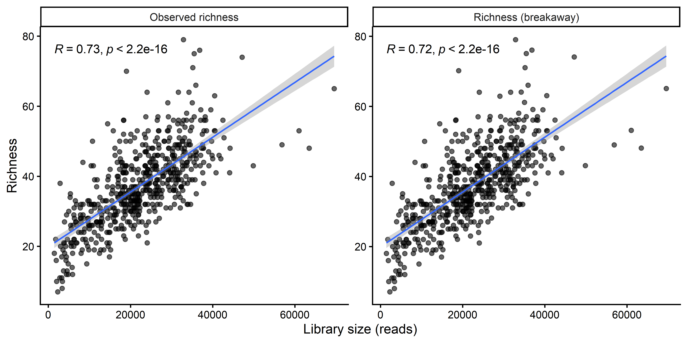<!-- -->

    ## `geom_smooth()` using formula = 'y ~ x'

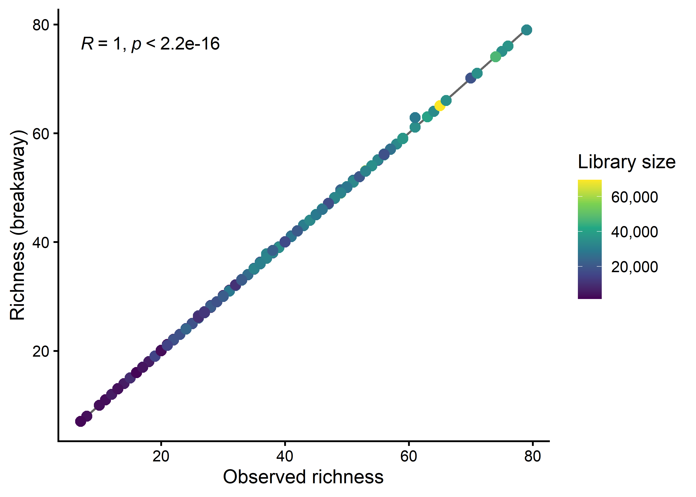<!-- -->

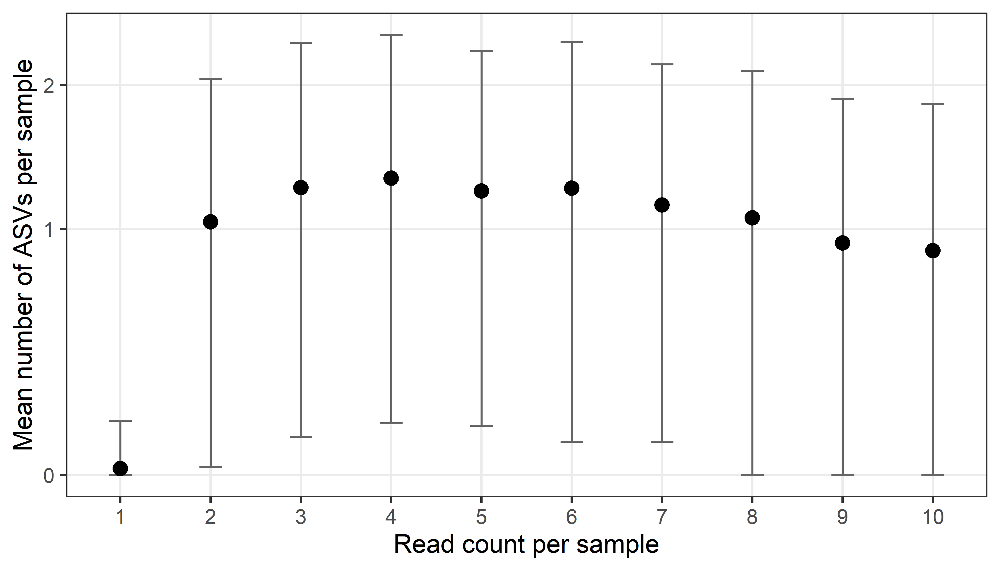<!-- -->

## Compute richness (on genus level)

### Common richness

Computing richness the common way (not model-based) using the
`estimate_richness` function from `phyloseq` package.

    ##         Observed Chao1 se.chao1 ACE   se.ACE   Shannon   Simpson InvSimpson   Fisher
    ## s025647       40    40        0  40 2.641023 1.8370941 0.7583242   4.137775 4.564899
    ## s023779       29    29        0  29 2.491364 0.6123431 0.2157674   1.275132 3.179224
    ## s026625       26    26        0  26 2.425823 0.3563376 0.1122662   1.126464 2.841656
    ## s022898       21    21        0  21 1.951800 0.5109628 0.2356186   1.308248 2.160364
    ## s022897       25    25        0  25 2.244994 0.4977167 0.1736147   1.210089 2.783480
    ## s028386       22    22        0  22 1.809068 1.2379658 0.6065971   2.541923 2.329049

### Breakaway richness

    ##         SampleID richness
    ## s025647  s025647 40.07097
    ## s023779  s023779 29.02846
    ## s026625  s026625 26.06324
    ## s022898  s022898 21.02326
    ## s022897  s022897 25.00990
    ## s028386  s028386 22.01301

### Comparison: classical vs. breakaway

    ##   SampleID library_size observed breakaway
    ## 1  s025647        29166       40  40.07097
    ## 2  s023779        29093       29  29.02846
    ## 3  s026625        26739       26  26.06324
    ## 4  s022898        35983       21  21.02326
    ## 5  s022897        22140       25  25.00990
    ## 6  s028386        29475       22  22.01301

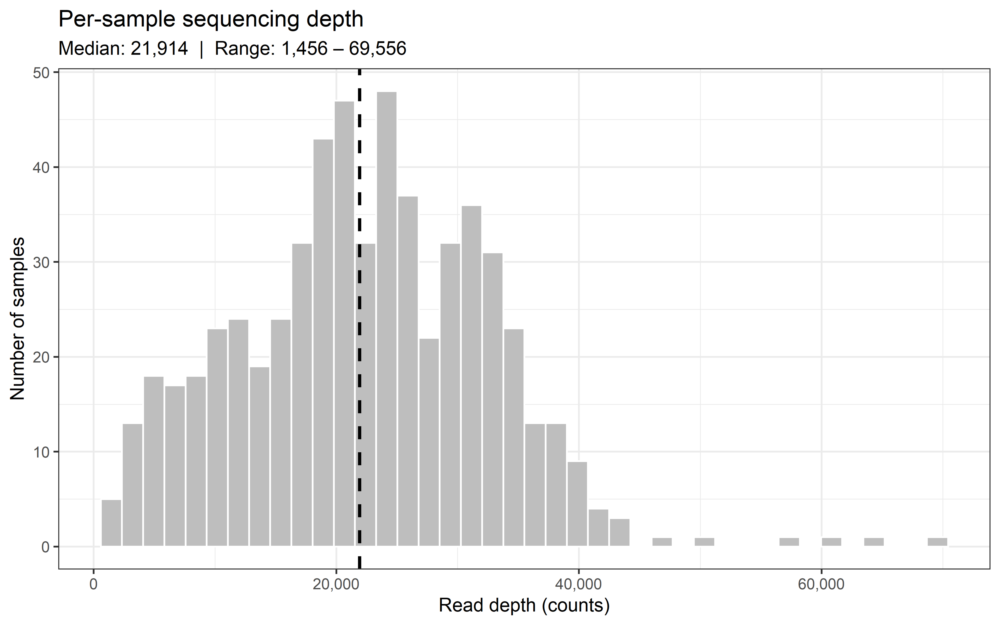<!-- -->

**Spearman correlation between library size and each richness metric:**

    ## # A tibble: 2 × 3
    ##   Metric                 rho  p_value
    ##   <chr>                <dbl>    <dbl>
    ## 1 Observed richness    0.7   1.99e-88
    ## 2 Richness (breakaway) 0.696 6.55e-87

    ## `geom_smooth()` using formula = 'y ~ x'

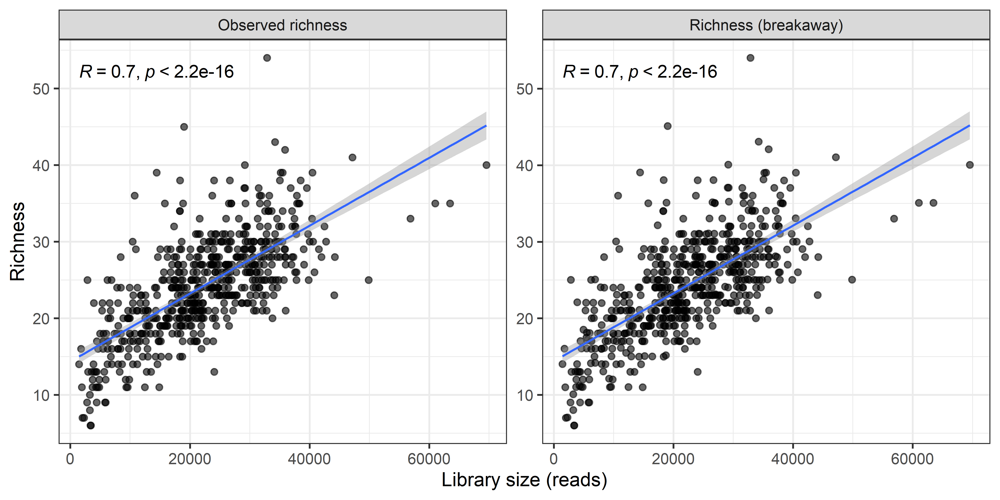<!-- -->

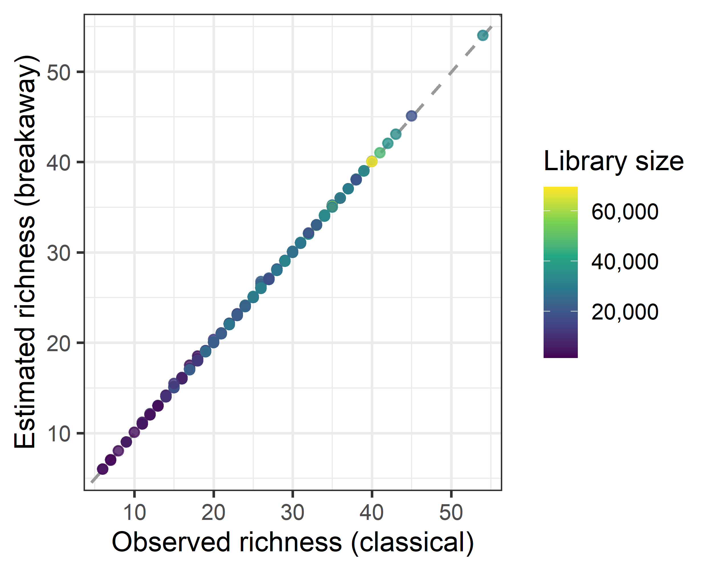<!-- -->

Breakaway estimates closely track observed richness. The frequency
spectrum below explains why: unseen-species estimators such as breakaway
extrapolate unobserved diversity from the ratio of rare taxa
(singletons, doubletons, …). At genus level, read counts are aggregated
across ASVs, so genera with very few reads are rare.

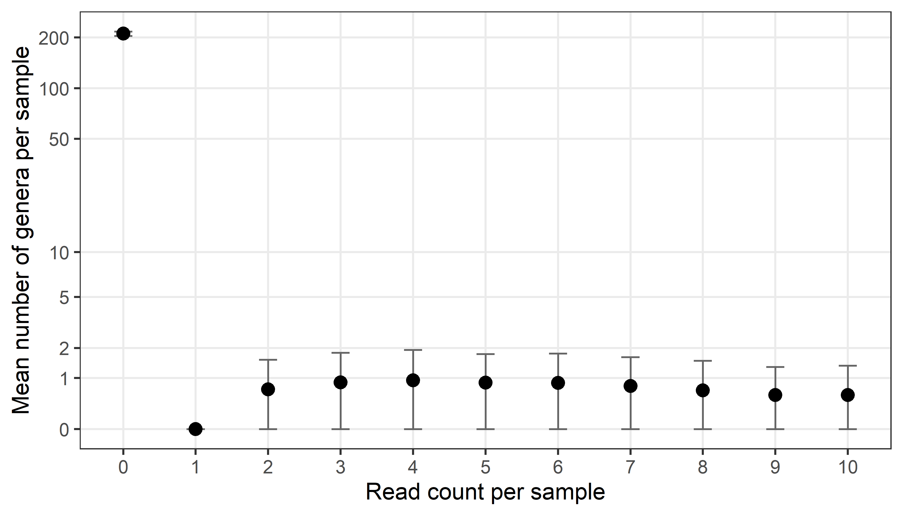<!-- -->

Legend: Dots = mean across 592 samples; bars = 0b11 SD.

~211 genera are absent in the average sample (count = 0, top-left
point). No sample contains any singleton genus (count = 1, pinned at
zero): ASV-level rareness disappears when reads are aggregated to genus.
The f<sub>2</sub>–f<sub>10</sub> band contains only ~0.6–0.9 genera on
average per sample — an extremely sparse frequency tail. Without
singleton signal, estimators that rely on f<sub>1</sub>/f<sub>2</sub>
(Chao1, breakaway) have no basis to project unseen genera, which is why
breakaway estimates closely track observed richness throughout this
analysis.

## DivNet diversity measures

Find base taxon (with minimum number of non-zero counts)

    ## Bifidobacterium 
    ##               0

    ## [1] "Runtime:"

    ##      user    system   elapsed 
    ## 23304.326 23626.235  2641.461

    ##   SampleID richness   shannon   simpson inv_simpson      gini
    ## 1  s025647 40.07097 1.8412512 0.2415143    4.140542 0.7584857
    ## 2  s023779 29.02846 0.6171782 0.7836776    1.276035 0.2163224
    ## 3  s026625 26.06324 0.3617418 0.8870403    1.127344 0.1129597
    ## 4  s022898 21.02326 0.5151174 0.7639270    1.309026 0.2360730
    ## 5  s022897 25.00990 0.5041177 0.8256020    1.211237 0.1743980
    ## 6  s028386 22.01301 1.2426791 0.3931188    2.543760 0.6068812

## Permutation tests

Results are cached separately per variable (one RDS file each). Delete a
variable’s file and rerun this chunk to recompute only that variable.
Each test uses $10^6$ permutations. Results are reused by the plotting
functions below and summarised in the comparison table.

### Comparison of asymptotic vs. permutation p-values

| Variable | Measure | H statistic | p (KW asymptotic) | p (permutation) | p (GPD-refined) |
|:---|:---|---:|---:|---:|---:|
| NA | NA | 31.57 | 1.40e-07 | 1.00e-06 | 1.99e-07 |
| Country | Shannon (DivNet) | 40.06 | 2.00e-09 | 1.00e-06 | 3.01e-09 |
| Country | Gini-Simpson (DivNet) | 39.88 | 2.19e-09 | 1.00e-06 | 4.89e-09 |
| NA | NA | 1.79 | 1.80e-01 | 1.80e-01 | 1.80e-01 |
| Sex | Shannon (DivNet) | 1.85 | 1.73e-01 | 1.74e-01 | 1.74e-01 |
| Sex | Gini-Simpson (DivNet) | 2.10 | 1.47e-01 | 1.47e-01 | 1.47e-01 |
| NA | NA | 0.33 | 5.64e-01 | 5.65e-01 | 5.65e-01 |
| C-section | Shannon (DivNet) | 4.86 | 2.74e-02 | 2.71e-02 | 2.71e-02 |
| C-section | Gini-Simpson (DivNet) | 5.73 | 1.67e-02 | 1.67e-02 | 1.67e-02 |
| NA | NA | 7.69 | 2.14e-02 | 2.12e-02 | 2.12e-02 |
| Breastfeeding duration | Shannon (DivNet) | 83.47 | 7.51e-19 | 1.00e-06 | 1.44e-17 |
| Breastfeeding duration | Gini-Simpson (DivNet) | 73.49 | 1.10e-16 | 1.00e-06 | 4.69e-15 |
| NA | NA | 2.73 | 9.84e-02 | 9.84e-02 | 9.84e-02 |
| Exclusive breastfeeding | Shannon (DivNet) | 65.13 | 7.02e-16 | 1.00e-06 | 5.18e-14 |
| Exclusive breastfeeding | Gini-Simpson (DivNet) | 56.47 | 5.71e-14 | 1.00e-06 | 5.04e-14 |
| NA | NA | 3.95 | 4.70e-02 | 4.69e-02 | 4.69e-02 |
| Prenatal smoking | Shannon (DivNet) | 18.81 | 1.45e-05 | 1.30e-05 | 1.01e-05 |
| Prenatal smoking | Gini-Simpson (DivNet) | 18.08 | 2.12e-05 | 1.60e-05 | 1.47e-05 |
| NA | NA | 1.41 | 4.94e-01 | 4.94e-01 | 4.94e-01 |
| Number of siblings | Shannon (DivNet) | 2.66 | 2.64e-01 | 2.65e-01 | 2.65e-01 |
| Number of siblings | Gini-Simpson (DivNet) | 3.04 | 2.18e-01 | 2.19e-01 | 2.19e-01 |

## Plots

### Study center

    ## 
    ##     Germany Switzerland     Austria 
    ##         197         222         173

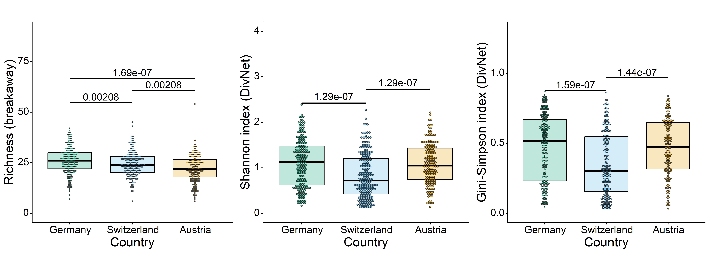<!-- -->

### Sex

    ## 
    ## Female   Male 
    ##    294    298

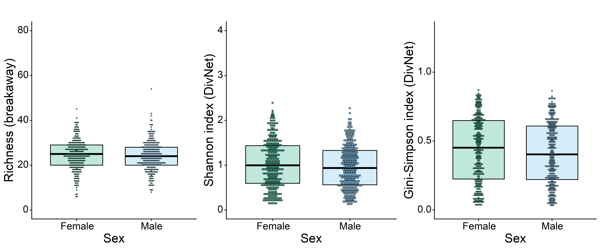<!-- -->

### C-section

    ## 
    ##  No Yes 
    ## 468 121

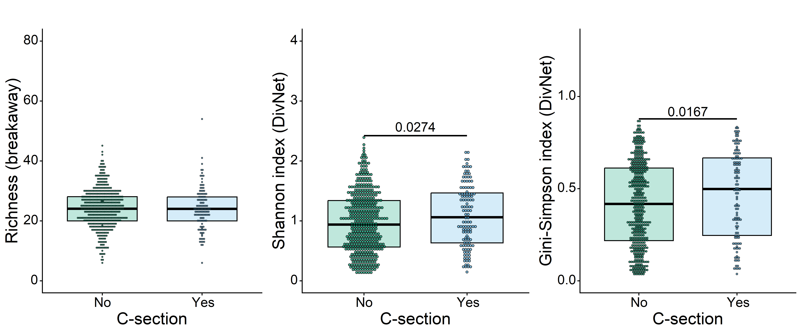<!-- -->

### Breast feeding

    ## 
    ##   0   1 >=2 
    ##  36  88 456

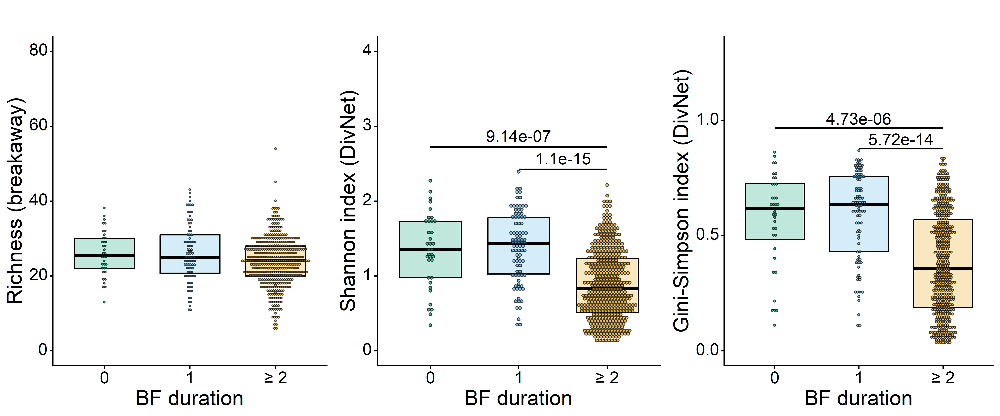<!-- -->

### Exclusive breast feeding duration

    ## 
    ##   0   1 >=2 
    ## 179   0 375

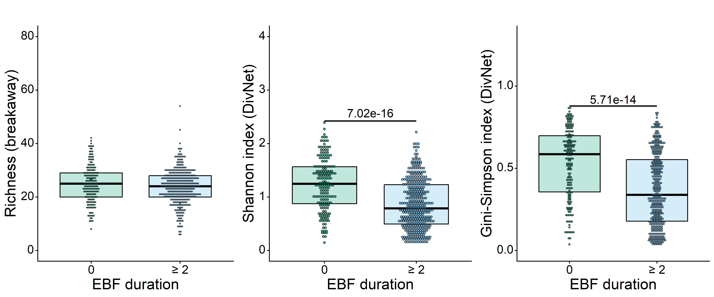<!-- -->

### Smoke during pregnancy

    ## 
    ##  No Yes 
    ## 529  63

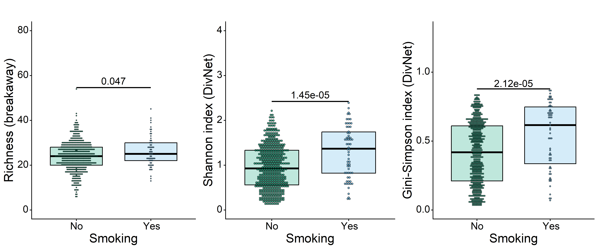<!-- -->

### Number of siblings

    ## 
    ##   0   1  >1 
    ##  46 200 257

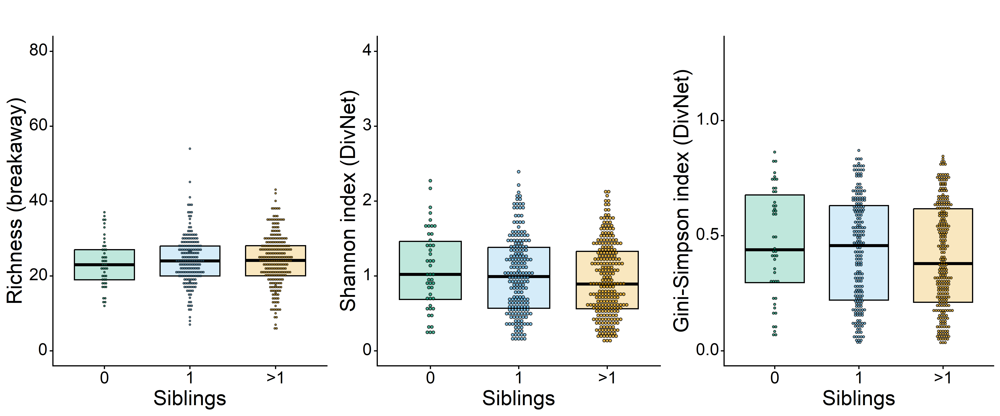<!-- -->

## Model-based analysis

The permutation tests above treat each sample’s diversity estimate as an
exact observation. A model-based alternative, introduced by Willis &
Martin (2020), uses `breakaway::betta()` — a mixed-effects regression
model that explicitly accounts for the per-sample estimation variance
($\delta_i^2$) from breakaway/DivNet while simultaneously estimating
residual biological heterogeneity ($\sigma^2$). We present two versions:

1.  **Intercept-only**: estimates the grand mean of each diversity
    metric with proper variance weighting, using the full sample set.
    This is the baseline approach from Willis & Martin (2020) and can
    serve as a foundation for permutation tests that respect estimation
    uncertainty.
2.  **With covariates**: adds cohort-level predictors to jointly
    estimate associations with diversity, restricted to samples with
    complete covariate data.

------------------------------------------------------------------------

### Intercept-only model

The intercept-only `betta` model fits

$$Y_i = \mu + \varepsilon_i + \delta_i,$$

where $Y_i$ is the diversity estimate for sample $i$, $\mu$ is the
global mean, $\varepsilon_i \sim \mathcal{N}(0,\,\sigma^2)$ captures
residual biological variation (estimated from the data), and $\delta_i$
is the estimation error with known variance supplied by
breakaway/DivNet.

The estimated $\sigma^2$ (labelled `global` in the betta output)
captures between-sample variation after accounting for estimation noise.
A large $\sigma^2$ relative to the typical $\delta_i^2$ means biological
heterogeneity dominates — which is a prerequisite for permutation tests
to have power beyond a naïve Kruskal–Wallis test on raw estimates. The
BLUP-like fitted values from this model could replace raw estimates in
permutation tests, downweighting samples with high estimation
uncertainty and providing a fairer test statistic when $\delta_i^2$
varies substantially across samples.

#### Richness

    ##      Estimates Standard Errors p-values
    ## [1,]  24.26414       0.2710555        0

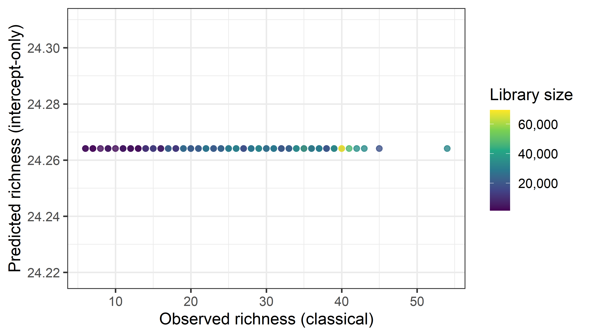<!-- -->

Since the intercept-only model has no covariates, all samples receive
the same predicted value (the grand mean), so the points form a
horizontal band. The vertical spread reflects true biological variation
plus estimation noise that the model cannot explain without predictors.

#### Shannon

    ##      Estimates Standard Errors p-values
    ## [1,] 0.9947692      0.02078224        0

#### Gini-Simpson

    ##      Estimates Standard Errors p-values
    ## [1,] 0.4262151     0.009476933        0

------------------------------------------------------------------------

### With covariates

The strip charts above show unadjusted, per-sample DivNet estimates.
Here we use the covariate model (`divnet_genus_cov`, family level)
together with `breakaway::betta` to jointly estimate associations
between all covariates and Shannon diversity, properly accounting for
the uncertainty in the DivNet estimates. Note that this model uses only
the 484 samples with complete covariate data.

    ## [1] "Runtime:"

    ##    user  system elapsed 
    ## 3509.83   59.17 3573.43

**Computed measures:**

    ##  [1] "shannon"              "simpson"              "bray-curtis"          "euclidean"            "shannon-variance"    
    ##  [6] "simpson-variance"     "bray-curtis-variance" "euclidean-variance"   "X"                    "fitted_z"

#### Richness

    ##                     Estimates Standard Errors     p-values
    ## (Intercept)        22.7682153       0.2920787 0.000000e+00
    ## CountryGermany      3.9133662       0.4913796 1.554312e-15
    ## CountrySwitzerland  2.4621555       0.4763204 2.352032e-07
    ## Sexm               -0.3737798       0.4147730 3.674994e-01
    ## C_section          -0.9596835       0.6331843 1.296087e-01
    ## BF_duration1       -0.1646573       0.7911903 8.351404e-01
    ## BF_duration>=2     -2.4319652       0.3266240 9.636736e-14
    ## EBF_duration>=2     0.1621795       0.3521153 6.450954e-01
    ## Smoking             1.4524867       0.9578035 1.293989e-01
    ## Siblings1           1.2658116       0.4613602 6.076003e-03
    ## Siblings>1          1.4983661       0.4096828 2.548050e-04

Extract predicted richness values (conditional on covariates):

    ##         SampleID richness_observed richness_predicted richness_se
    ## s026625  s026625          26.06324           29.09400         0.5
    ## s022898  s022898          21.02326           25.30383         0.5
    ## s022897  s022897          25.00990           24.34414         0.5
    ## s028386  s028386          22.01301           25.67761         0.5
    ## s023716  s023716          22.02520           25.14165         0.5
    ## s021517  s021517          34.05488           26.98887         0.5

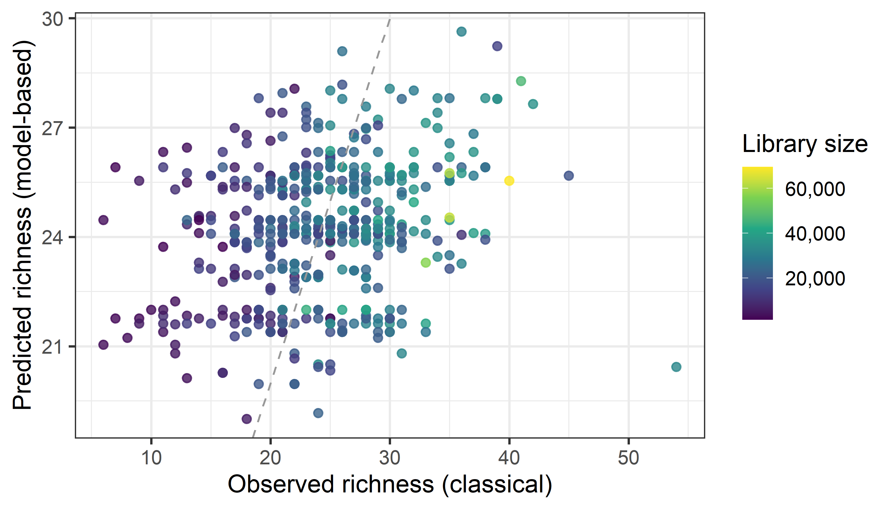<!-- -->

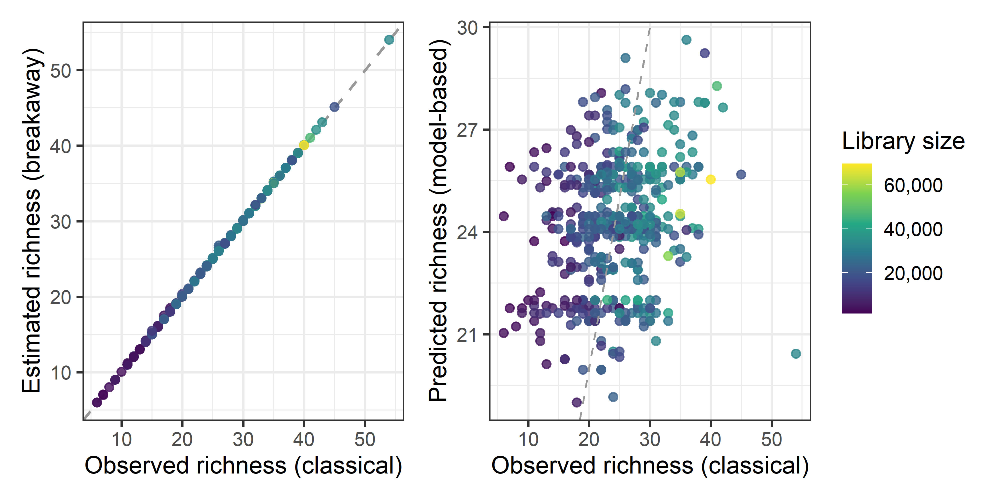<!-- -->

Observed vs. predicted richness (with covariates):

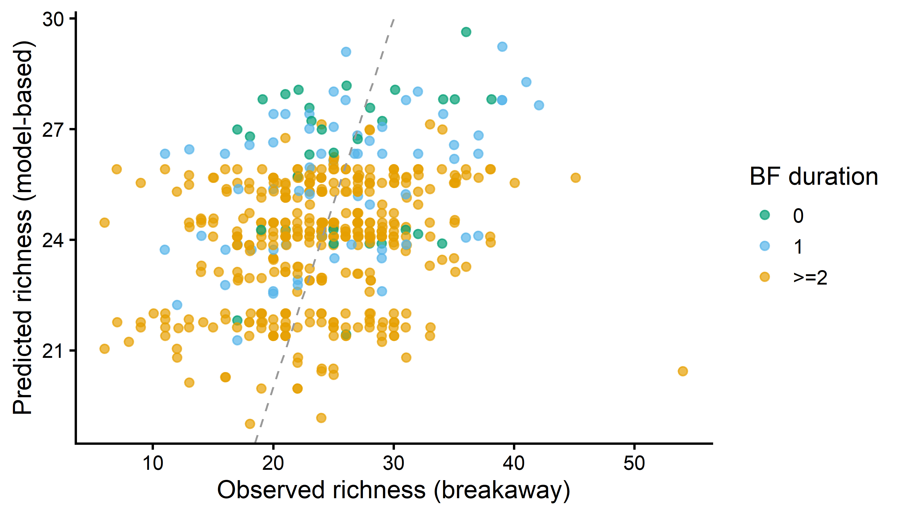<!-- -->

#### Shannon

    ##                       Estimates Standard Errors     p-values
    ## (Intercept)         0.910266581     0.002452681 0.000000e+00
    ## CountryGermany     -0.004070408     0.006192449 5.109765e-01
    ## CountrySwitzerland -0.115536260     0.003028519 0.000000e+00
    ## Sexm               -0.011791073     0.003791715 1.872811e-03
    ## C_section           0.019368660     0.011591259 9.472737e-02
    ## BF_duration1        0.080615782     0.019757016 4.496558e-05
    ## BF_duration>=2     -0.330692227     0.002485428 0.000000e+00
    ## EBF_duration>=2    -0.052212329     0.002543573 0.000000e+00
    ## Smoking             0.065837315     0.016234331 5.004055e-05
    ## Siblings1          -0.005874943     0.004493534 1.910696e-01
    ## Siblings>1         -0.017666091     0.002967873 2.641717e-09

Global test of whether any covariate is associated with Shannon
diversity:

    ## [1] 35030.74     0.00

`betta_shannon$global` is a likelihood ratio test of the null hypothesis
that all covariates jointly have no association with Shannon diversity
(i.e., all βs except the intercept equal zero). The two returned values
are the chi-squared test statistic and its p-value, respectively. A
significant result indicates that the model as a whole fits better than
an intercept-only model, meaning at least one covariate is meaningfully
associated with Shannon diversity. It does not identify which covariates
are responsible — that is addressed by the individual p-values in
`betta_shannon$table` above.

#### Gini-Simpson

    ##                       Estimates Standard Errors     p-values
    ## (Intercept)         0.369733044     0.001021245 0.000000e+00
    ## CountryGermany     -0.004580139     0.002658088 8.487128e-02
    ## CountrySwitzerland -0.051565629     0.001225341 0.000000e+00
    ## Sexm               -0.004524865     0.001587521 4.368194e-03
    ## C_section           0.009637125     0.005329765 7.057994e-02
    ## BF_duration1        0.032928307     0.010016714 1.011400e-03
    ## BF_duration>=2     -0.143699929     0.001031199 0.000000e+00
    ## EBF_duration>=2    -0.025806871     0.001051118 0.000000e+00
    ## Smoking             0.025561020     0.006807703 1.735353e-04
    ## Siblings1          -0.013690588     0.001887395 4.054534e-13
    ## Siblings>1         -0.015538696     0.001225015 0.000000e+00

#### Combined coefficient plot

    ## `height` was translated to `width`.

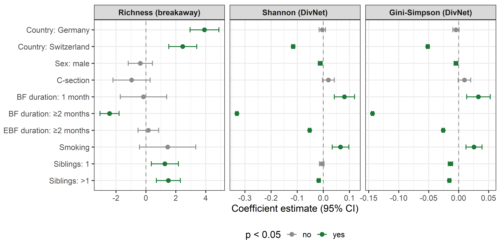<!-- -->

##### Investigating the C-section effect: confounding by breastfeeding duration

The positive association of caesarean delivery with Shannon diversity is
counterintuitive biologically. A likely explanation is confounding by
breastfeeding: C-section delivery is associated with shorter
breastfeeding duration, and shorter breastfeeding is associated with
higher Shannon diversity (the dominant effect in the model). The
following two plots investigate this.

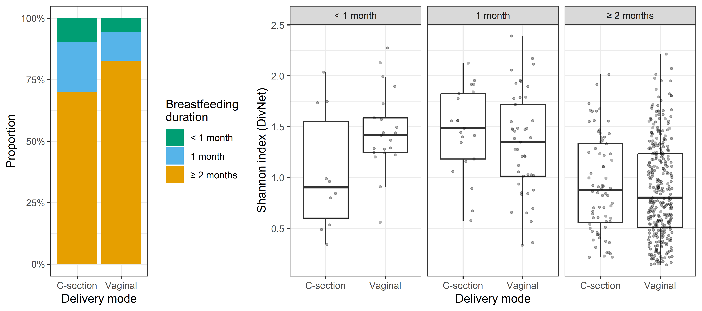<!-- -->

The left panel shows that C-section infants are less likely to be
breastfed for ≥ 2 months compared to vaginally born infants. Since
prolonged breastfeeding is the strongest single predictor of *lower*
Shannon diversity in this cohort, C-section infants appear more diverse
in the unadjusted comparison. The right panel confirms this: within each
breastfeeding duration stratum, the delivery mode difference is
substantially attenuated or absent.

## Files written

These files have been written to the target directory,
`data/03_alpha_diversity`:

    ## # A tibble: 14 × 4
    ##    path                            type         size modification_time  
    ##    <fs::path>                      <fct> <fs::bytes> <dttm>             
    ##  1 breakaway_rich_full.rds         file       30.51K 2026-05-05 19:59:06
    ##  2 divnet_family_cov.rds           file        1.83M 2026-04-30 18:00:56
    ##  3 divnet_genus.rds                file       10.63M 2026-04-30 15:40:51
    ##  4 divnet_genus_cov.rds            file        1.98M 2026-06-08 13:59:54
    ##  5 divnet_genus_cov_runtime.rds    file          167 2026-06-08 13:59:54
    ##  6 divnet_genus_runtime.rds        file          159 2026-05-03 08:28:03
    ##  7 perm_results_Breastfeeding.rds  file       19.81M 2026-05-06 13:47:43
    ##  8 perm_results_Cesarean.rds       file       10.47M 2026-05-06 13:43:38
    ##  9 perm_results_Country.rds        file       19.81M 2026-05-06 13:39:58
    ## 10 perm_results_Exclusive_BF.rds   file       11.39M 2026-05-06 13:49:33
    ## 11 perm_results_Prenatal_smoke.rds file       10.08M 2026-05-06 13:51:16
    ## 12 perm_results_Sex.rds            file       11.26M 2026-05-06 13:41:51
    ## 13 perm_results_Siblings.rds       file       19.81M 2026-05-06 13:53:12
    ## 14 perm_table.tex                  file         2.9K 2026-06-08 15:27:29
