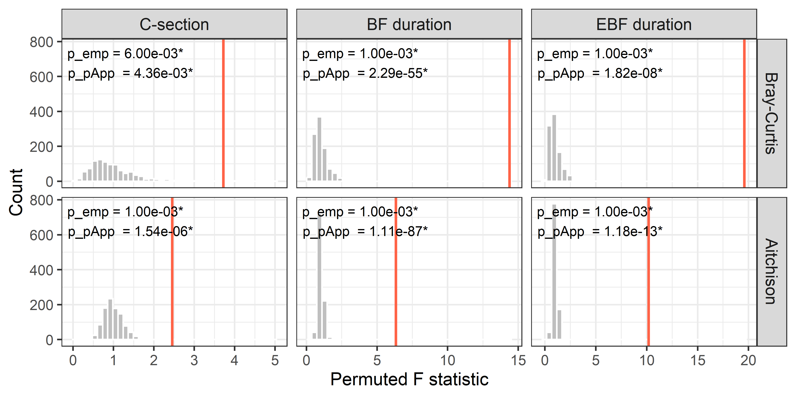
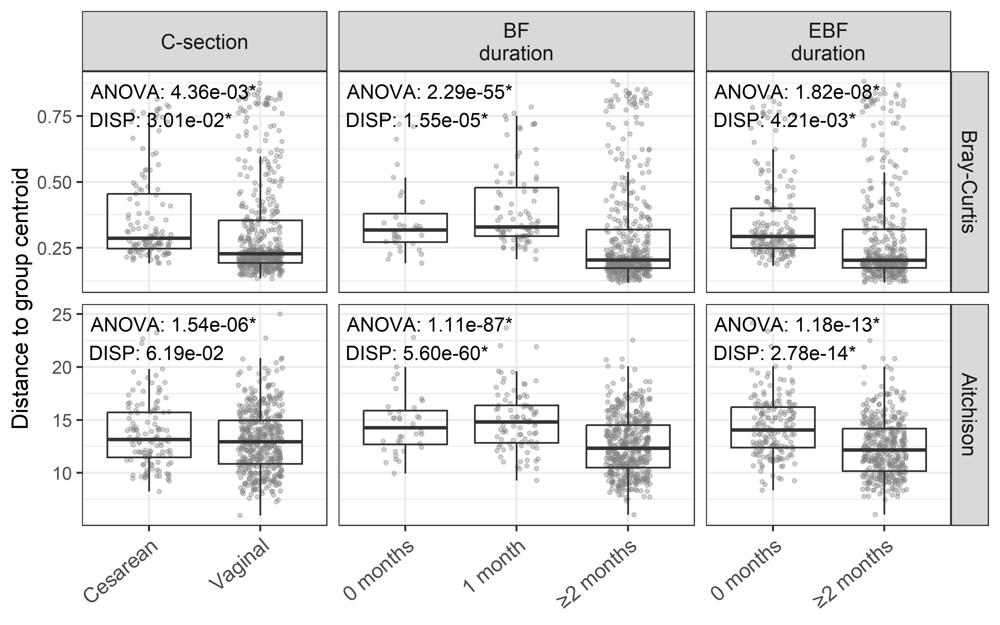

Beta diversity analysis
================
Compiled at 2026-06-11 07:24:38 UTC

## Load packages

## Set global parameters

``` r
zero_replacement_fraction <- 0.65
n_perm <- 999
permutation_seed <- 42
alpha_perm_approx <- 0.05

var_order_beta <- c("Country", "Sex", "C-section", "BF duration",
                    "EBF duration", "Smoking", "Siblings")
```

## Colors

## Load data

### Phyloseq object on genus level

    ## phyloseq-class experiment-level object
    ## otu_table()   OTU Table:         [ 117 taxa and 592 samples ]
    ## sample_data() Sample Data:       [ 592 samples by 9 sample variables ]
    ## tax_table()   Taxonomy Table:    [ 117 taxa by 7 taxonomic ranks ]

## Helper functions

**Note on the CLR transformation:**

Counts are first transformed to relative abundances. Zeros are then
replaced using multiplicative replacement from
`zCompositions::multRepl()`, with the global minimum non-zero relative
abundance used as the detection limit and `frac = 0.65`. The CLR
transformation is applied after replacement.

## Prepare genus-level data

For the PASTURE application, beta-diversity analyses are performed at
genus level. Taxa observed in less than 1% of samples were removed
before the beta-diversity matrices are computed. Bray-Curtis
dissimilarity is computed on relative abundance profiles, whereas
Euclidean distance is computed after multiplicative replacement and CLR
transformation.

    ## # A tibble: 1 × 6
    ##   n_samples n_taxa min_library_size median_library_size max_library_size zero_fraction
    ##       <int>  <int>            <dbl>               <dbl>            <dbl>         <dbl>
    ## 1       592    117             1456              21898.            69556         0.796

## Compute dissimilarity matrices

### Bray-Curtis dissimilarity

    ##     Min.  1st Qu.   Median     Mean  3rd Qu.     Max. 
    ## 0.005646 0.228688 0.421947 0.456196 0.662530 0.987332

### Euclidean distance after multiplicative replacement and CLR transformation

    ## # A tibble: 1 × 7
    ##   replacement_method      input_scale        detection_limit replacement_fraction replacement_value n_zeros_replaced zero_fraction
    ##   <chr>                   <chr>                        <dbl>                <dbl>             <dbl>            <int>         <dbl>
    ## 1 zCompositions::multRepl relative abundance       0.0000288                 0.65         0.0000187            55160         0.796

    ##  [1] 18.28522 21.24676 23.68095 20.53115 23.59390 22.62087 25.87166 23.59254 25.12752 23.75427

### Save distance objects

## Ordination

### Compute PCoA coordinates

### Uncolored PCoA plots

<!-- -->

The Bray-Curtis PCoA (PCo1: 29.5%, PCo2: 8.9%) displays the
characteristic arch shape common to PCoA on compositional count data,
where the cloud folds back on itself along PCo2. This is an ordination
artifact rather than a biological signal and reflects how Bray-Curtis
dissimilarity handles the full gradient of community turnover.

The CLR-based PCoA produces a more symmetric, roughly elliptical cloud
with variance spread more evenly across axes — a consequence of the
log-ratio transformation removing compositional constraints. Note that
the first two axes together may explain considerably less total
variation for CLR, which is expected given its more Euclidean structure.

### PCoA plots colored by selected variables

Set the variables to inspect here. Unknown or misspelled variables are
ignored.

    ##        Country            Sex      C-section    BF duration   EBF duration        Smoking       Siblings 
    ##      "Country"          "Sex"    "C-section"  "BF duration" "EBF duration"      "Smoking"     "Siblings"

<!-- --><!-- --><!-- --><!-- --><!-- --><!-- --><!-- -->

None of the variables examined produce visually discernible separation
in either ordination. Specifically:

- Country (Austria, Germany, Switzerland): The three groups are
  thoroughly intermixed along both axes in both ordinations. If
  country-level effects on microbiome composition exist, they do not
  dominate the major axes of variation captured here.
- Sex: No separation is visible. Male and female samples overlap
  completely.
- Delivery mode: Cesarean samples are scattered across the same space as
  vaginal births. The relatively small number of cesarean samples limits
  visual detection of any potential signal.
- BF duration / Exclusive BF: Both breastfeeding variables show the same
  mixed pattern. Samples from all duration categories are intermingled,
  with no gradient along PCo1 or PCo2. This does not rule out a
  breastfeeding effect, but suggests it is not among the dominant
  sources of between-sample variation.
- Prenatal smoking / No. of siblings: No visual structure.

### Distance matrix heatmaps

These heatmaps are mainly diagnostic. For several hundred samples, they
become visually dense, but they are useful for checking whether strong
blocks or outlying samples occur.

<!-- -->

The Bray-Curtis distance heatmap reveals a block of samples in the
upper-left cluster (after hierarchical reordering) that are
substantially more similar to each other than to the rest of the cohort
— visible as a lighter region against the predominantly dark-blue
background. This suggests some subgroup of samples shares a notably
similar community composition. The annotation bars do not immediately
reveal a single metadata variable that cleanly aligns with this block,
so the driver of this cluster is not apparent from the variables
available here.

<!-- -->

The CLR heatmap is considerably more homogeneous: distances are more
uniformly distributed with less pronounced block structure, which is
consistent with the more diffuse spread seen in its ordination.

## PERMANOVA and PERMDISP

The following analyses are performed for both beta-diversity
representations: Bray-Curtis dissimilarity on relative abundance
profiles and Euclidean distance after multiplicative replacement and CLR
transformation. PERMANOVA is used to test for differences in group
centroids, while PERMDISP assesses differences in within-group
dispersion.

We remove samples with EBF duration == “1 month” from all permutation
tests, as these three samples form a singleton-like group that can
distort results.

    ##        Country            Sex      C-section    BF duration   EBF duration        Smoking       Siblings 
    ##      "Country"          "Sex"    "C-section"  "BF duration" "EBF duration"      "Smoking"     "Siblings"

### Parallel backend and progress reporting

### Helper functions for permutation-based testing

### PERMANOVA

    ## # A tibble: 14 × 12
    ##    analysis  distance   variable n_samples n_groups statistic_obs p_empirical statistic_adonis2 r2_adonis2 p_adonis2 n_exceed n_perm
    ##    <chr>     <chr>      <fct>        <int>    <int>         <dbl>       <dbl>             <dbl>      <dbl>     <dbl>    <int>  <dbl>
    ##  1 PERMANOVA Bray-Curt… Country        589        3          4.52       0.001              4.52    0.0152      0.001        0    999
    ##  2 PERMANOVA Bray-Curt… Sex            589        2          1.38       0.213              1.38    0.00235     0.194      212    999
    ##  3 PERMANOVA Bray-Curt… C-secti…       586        2          3.72       0.006              3.72    0.00633     0.003        5    999
    ##  4 PERMANOVA Bray-Curt… BF dura…       577        3         14.4        0.001             14.4     0.0477      0.001        0    999
    ##  5 PERMANOVA Bray-Curt… EBF dur…       554        2         19.6        0.001             19.6     0.0343      0.001        0    999
    ##  6 PERMANOVA Bray-Curt… Smoking        589        2          5.72       0.001              5.72    0.00965     0.002        0    999
    ##  7 PERMANOVA Bray-Curt… Siblings       501        3          2.25       0.021              2.25    0.00894     0.02        20    999
    ##  8 PERMANOVA Aitchison  Country        589        3          2.58       0.001              2.58    0.00873     0.001        0    999
    ##  9 PERMANOVA Aitchison  Sex            589        2          1.41       0.065              1.41    0.00240     0.045       64    999
    ## 10 PERMANOVA Aitchison  C-secti…       586        2          2.45       0.001              2.45    0.00418     0.001        0    999
    ## 11 PERMANOVA Aitchison  BF dura…       577        3          6.34       0.001              6.34    0.0216      0.001        0    999
    ## 12 PERMANOVA Aitchison  EBF dur…       554        2         10.2        0.001             10.2     0.0181      0.001        0    999
    ## 13 PERMANOVA Aitchison  Smoking        589        2          3.08       0.001              3.08    0.00521     0.001        0    999
    ## 14 PERMANOVA Aitchison  Siblings       501        3          1.57       0.005              1.57    0.00625     0.004        4    999

<!-- -->

**Mean and median of permutation distributions**

    ## `summarise()` has regrouped the output.
    ## ℹ Summaries were computed grouped by distance and variable.
    ## ℹ Output is grouped by distance.
    ## ℹ Use `summarise(.groups = "drop_last")` to silence this message.
    ## ℹ Use `summarise(.by = c(distance, variable))` for per-operation grouping (`?dplyr::dplyr_by`) instead.

    ## # A tibble: 14 × 4
    ## # Groups:   distance [2]
    ##    distance    variable      mean median
    ##    <fct>       <fct>        <dbl>  <dbl>
    ##  1 Bray-Curtis Country      1.01   0.924
    ##  2 Bray-Curtis Sex          1.03   0.905
    ##  3 Bray-Curtis C-section    0.996  0.863
    ##  4 Bray-Curtis BF duration  1.03   0.937
    ##  5 Bray-Curtis EBF duration 1.02   0.886
    ##  6 Bray-Curtis Smoking      1.00   0.846
    ##  7 Bray-Curtis Siblings     1.00   0.927
    ##  8 Aitchison   Country      1.00   0.992
    ##  9 Aitchison   Sex          1.01   0.974
    ## 10 Aitchison   C-section    0.997  0.973
    ## 11 Aitchison   BF duration  0.997  0.980
    ## 12 Aitchison   EBF duration 0.994  0.966
    ## 13 Aitchison   Smoking      0.994  0.966
    ## 14 Aitchison   Siblings     1.00   0.988

### PERMANOVA p-value refinement with permApprox

    ## permApprox result
    ## -----------------
    ## Number of tests             : 14
    ## Approximation method        : GPD tail approximation
    ## Approximation threshold     : p-values < 0.1
    ## Multiple testing adjustment : none
    ## 
    ## Successful fits          : 13
    ## GOF rejections           : 0
    ## Fit failed               : 0
    ## No threshold found       : 0
    ## Discrete distributions   : 0
    ## Not selected for fitting : 1
    ## 
    ## Final p-values:
    ##   min = 1.107e-87, median = 3.209e-05, max = 2.130e-01
    ## 
    ## Use summary() for detailed fit diagnostics.

    ## Summary of permApprox result
    ## ----------------------------
    ## Number of tests             : 14
    ## Approximation method        : GPD tail approximation
    ## Approximation threshold     : p-values < 0.1
    ## Multiple testing adjustment : none
    ## 
    ## Fit status counts:
    ##   Successful fits          : 13
    ##   GOF rejections           : 0
    ##   Fit failed               : 0
    ##   No threshold found       : 0
    ##   Discrete distributions   : 0
    ##   Not selected for fitting : 1
    ## 
    ## GPD parameter summary (successful fits)
    ## --------------------------------------
    ##   shape:
    ##     min = -0.232, median = -0.0243, mean = -0.0313, max = 0.114
    ##   scale:
    ##     min = 0.128, median = 0.231, mean = 0.316, max = 0.558
    ##   n_exceed:
    ##     min =  220, median =  250, mean =  248, max =  250
    ## 
    ## P-value summary
    ## ---------------
    ## Empirical p-values:
    ##   empirical:
    ##     min = 1.000e-03, median = 1.000e-03, mean = 2.279e-02, max = 2.130e-01
    ## 
    ## Final p-values (unadjusted):
    ##   unadjusted:
    ##     min = 1.107e-87, median = 3.209e-05, mean = 2.184e-02, max = 2.130e-01

    ## # A tibble: 14 × 9
    ##    distance    variable     n_samples statistic_obs n_exceed n_perm p_empirical p_permapprox method_used
    ##    <fct>       <fct>            <int>         <dbl>    <int>  <dbl>       <dbl>        <dbl> <chr>      
    ##  1 Bray-Curtis Country            589          4.52        0    999       0.001     6.27e- 5 gpd        
    ##  2 Bray-Curtis Sex                589          1.38      212    999       0.213     2.13e- 1 empirical  
    ##  3 Bray-Curtis C-section          586          3.72        5    999       0.006     4.36e- 3 gpd        
    ##  4 Bray-Curtis BF duration        577         14.4         0    999       0.001     2.29e-55 gpd        
    ##  5 Bray-Curtis EBF duration       554         19.6         0    999       0.001     1.82e- 8 gpd        
    ##  6 Bray-Curtis Smoking            589          5.72        0    999       0.001     8.49e- 4 gpd        
    ##  7 Bray-Curtis Siblings           501          2.25       20    999       0.021     1.63e- 2 gpd        
    ##  8 Aitchison   Country            589          2.58        0    999       0.001     4.38e-12 gpd        
    ##  9 Aitchison   Sex                589          1.41       64    999       0.065     6.72e- 2 gpd        
    ## 10 Aitchison   C-section          586          2.45        0    999       0.001     1.54e- 6 gpd        
    ## 11 Aitchison   BF duration        577          6.34        0    999       0.001     1.11e-87 gpd        
    ## 12 Aitchison   EBF duration       554         10.2         0    999       0.001     1.18e-13 gpd        
    ## 13 Aitchison   Smoking            589          3.08        0    999       0.001     1.29e- 9 gpd        
    ## 14 Aitchison   Siblings           501          1.57        4    999       0.005     4.02e- 3 gpd

**Bray-Curtis sorted**

    ## # A tibble: 7 × 4
    ##   variable     statistic_obs p_empirical p_permapprox
    ##   <fct>                <dbl>       <dbl>        <dbl>
    ## 1 BF duration          14.4        0.001     2.29e-55
    ## 2 EBF duration         19.6        0.001     1.82e- 8
    ## 3 Country               4.52       0.001     6.27e- 5
    ## 4 Smoking               5.72       0.001     8.49e- 4
    ## 5 C-section             3.72       0.006     4.36e- 3
    ## 6 Siblings              2.25       0.021     1.63e- 2
    ## 7 Sex                   1.38       0.213     2.13e- 1

**Aitchison sorted**

    ## # A tibble: 7 × 4
    ##   variable     statistic_obs p_empirical p_permapprox
    ##   <fct>                <dbl>       <dbl>        <dbl>
    ## 1 BF duration           6.34       0.001     1.11e-87
    ## 2 EBF duration         10.2        0.001     1.18e-13
    ## 3 Country               2.58       0.001     4.38e-12
    ## 4 Smoking               3.08       0.001     1.29e- 9
    ## 5 C-section             2.45       0.001     1.54e- 6
    ## 6 Siblings              1.57       0.005     4.02e- 3
    ## 7 Sex                   1.41       0.065     6.72e- 2

<!-- -->

**Selected variables**

<!-- -->

### PERMDISP

    ## # A tibble: 14 × 11
    ##    analysis distance    variable     n_samples n_groups statistic_obs p_empirical statistic_betadisper p_betadisper n_exceed n_perm
    ##    <chr>    <chr>       <fct>            <int>    <int>         <dbl>       <dbl>                <dbl>        <dbl>    <int>  <dbl>
    ##  1 PERMDISP Bray-Curtis Country            589        3        10.6         0.003               10.6          0.001        2    999
    ##  2 PERMDISP Bray-Curtis Sex                589        2         2.79        0.216                2.79         0.095      215    999
    ##  3 PERMDISP Bray-Curtis C-section          586        2         8.78        0.032                8.78         0.001       31    999
    ##  4 PERMDISP Bray-Curtis BF duration        577        3        15.3         0.001               15.3          0.001        0    999
    ##  5 PERMDISP Bray-Curtis EBF duration       554        2        16.0         0.005               16.0          0.001        4    999
    ##  6 PERMDISP Bray-Curtis Smoking            589        2         6.68        0.036                6.68         0.013       35    999
    ##  7 PERMDISP Bray-Curtis Siblings           501        3         5.91        0.033                5.91         0.004       32    999
    ##  8 PERMDISP Aitchison   Country            589        3        13.1         0.001               13.1          0.001        0    999
    ##  9 PERMDISP Aitchison   Sex                589        2         0.609       0.43                 0.609        0.436      429    999
    ## 10 PERMDISP Aitchison   C-section          586        2         3.64        0.06                 3.64         0.056       59    999
    ## 11 PERMDISP Aitchison   BF duration        577        3        31.9         0.001               31.9          0.001        0    999
    ## 12 PERMDISP Aitchison   EBF duration       554        2        61.0         0.001               61.0          0.001        0    999
    ## 13 PERMDISP Aitchison   Smoking            589        2        15.8         0.001               15.8          0.001        0    999
    ## 14 PERMDISP Aitchison   Siblings           501        3         2.68        0.077                2.68         0.072       76    999

### PERMDISP p-value refinement with permApprox

    ## permApprox result
    ## -----------------
    ## Number of tests             : 14
    ## Approximation method        : GPD tail approximation
    ## Approximation threshold     : p-values < 0.1
    ## Multiple testing adjustment : none
    ## 
    ## Successful fits          : 12
    ## GOF rejections           : 0
    ## Fit failed               : 0
    ## No threshold found       : 0
    ## Discrete distributions   : 0
    ## Not selected for fitting : 2
    ## 
    ## Final p-values:
    ##   min = 5.599e-60, median = 1.713e-02, max = 4.300e-01
    ## 
    ## Use summary() for detailed fit diagnostics.

    ## # A tibble: 14 × 9
    ##    distance    variable     n_samples statistic_obs n_exceed n_perm p_empirical p_permapprox method_used
    ##    <chr>       <fct>            <int>         <dbl>    <int>  <dbl>       <dbl>        <dbl> <chr>      
    ##  1 Bray-Curtis Country            589        10.6          2    999       0.003     2.04e- 3 gpd        
    ##  2 Bray-Curtis Sex                589         2.79       215    999       0.216     2.16e- 1 empirical  
    ##  3 Bray-Curtis C-section          586         8.78        31    999       0.032     3.01e- 2 gpd        
    ##  4 Bray-Curtis BF duration        577        15.3          0    999       0.001     1.55e- 5 gpd        
    ##  5 Bray-Curtis EBF duration       554        16.0          4    999       0.005     4.21e- 3 gpd        
    ##  6 Bray-Curtis Smoking            589         6.68        35    999       0.036     4.20e- 2 gpd        
    ##  7 Bray-Curtis Siblings           501         5.91        32    999       0.033     3.76e- 2 gpd        
    ##  8 Aitchison   Country            589        13.1          0    999       0.001     2.10e- 6 gpd        
    ##  9 Aitchison   Sex                589         0.609      429    999       0.43      4.3 e- 1 empirical  
    ## 10 Aitchison   C-section          586         3.64        59    999       0.06      6.19e- 2 gpd        
    ## 11 Aitchison   BF duration        577        31.9          0    999       0.001     5.60e-60 gpd        
    ## 12 Aitchison   EBF duration       554        61.0          0    999       0.001     2.78e-14 gpd        
    ## 13 Aitchison   Smoking            589        15.8          0    999       0.001     1.12e- 4 gpd        
    ## 14 Aitchison   Siblings           501         2.68        76    999       0.077     8.12e- 2 gpd

<!-- -->

## Within-group dispersion

Each sample’s distance to its group centroid, as used by PERMDISP.
Unequal box heights across groups indicate heterogeneous dispersion
(PERMDISP signal). PERMANOVA tests whether the centroids themselves are
at different positions in composition space — a complementary question
that requires an ordination plot to visualise directly.

Panels are annotated with permApprox-refined p-values for PERMANOVA
(PERM) and PERMDISP (DISP).

<!-- -->

<!-- -->

## Files written

These files have been written to the target directory,
`data/04_beta_diversity`:

    ## # A tibble: 10 × 4
    ##    path                                          type         size modification_time  
    ##    <fs::path>                                    <fct> <fs::bytes> <dttm>             
    ##  1 beta_clr_summary.csv                          file          232 2026-06-11 07:24:45
    ##  2 beta_data_summary.csv                         file          131 2026-06-11 07:24:45
    ##  3 beta_diversity_objects.rds                    file        3.06M 2026-06-11 07:24:45
    ##  4 beta_pcoa_coordinates.csv                     file      137.82K 2026-06-11 07:24:47
    ##  5 permanova_permapprox_results_multrepl_clr.rds file       76.17K 2026-06-10 14:56:33
    ##  6 permanova_results_multrepl_clr.rds            file      103.85K 2026-06-10 14:52:51
    ##  7 permanova_table.tex                           file        2.14K 2026-06-11 07:25:40
    ##  8 permdisp_permapprox_results_multrepl_clr.rds  file       74.67K 2026-06-11 06:50:38
    ##  9 permdisp_results_multrepl_clr.rds             file       105.4K 2026-06-11 06:50:27
    ## 10 permdisp_table.tex                            file        2.17K 2026-06-11 07:25:45
