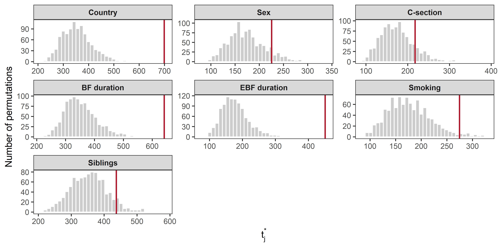

05_regression
================
Compiled at 2026-06-11 08:36:31 UTC

## Set global parameters

## Load data

### Phyloseq object on genus level

    ## phyloseq-class experiment-level object
    ## otu_table()   OTU Table:         [ 117 taxa and 592 samples ]
    ## sample_data() Sample Data:       [ 592 samples by 9 sample variables ]
    ## tax_table()   Taxonomy Table:    [ 117 taxa by 7 taxonomic ranks ]

## Helper functions

Counts are first transformed to relative abundances. Zeros are then
replaced with the multiplicative replacement implemented in
`zCompositions::multRepl()`, using the global minimum non-zero relative
abundance as detection limit and `frac = 0.65`. The CLR transformation
is applied after replacement.

## Prepare CLR response matrix

    ## # A tibble: 1 × 9
    ##   n_samples n_taxa min_library_size median_library_size max_library_size zero_fraction detection_limit replacement_value replacement_fraction
    ##       <int>  <int>            <dbl>               <dbl>            <dbl>         <dbl>           <dbl>             <dbl>                <dbl>
    ## 1       592    117             1456              21898.            69556         0.796       0.0000288         0.0000187                 0.65

## Regression analysis setup

Samples with `EBF duration == "1 month"` are removed before fitting the
regression models, because this sparse group contains only three samples
and may confound the regression-based global tests.

    ## # A tibble: 1 × 4
    ##   n_samples n_taxa excluded_ebf_one_month n_covariates
    ##       <int>  <int>                  <int>        <int>
    ## 1       484    117                      3            7

    ## # A tibble: 7 × 3
    ##   variable     n_levels levels                       
    ##   <chr>           <int> <chr>                        
    ## 1 Country             3 Germany; Switzerland; Austria
    ## 2 Sex                 2 Female; Male                 
    ## 3 C-section           2 No; Yes                      
    ## 4 BF duration         3 0 months; 1 month; ≥2 months 
    ## 5 EBF duration        2 0 months; ≥2 months          
    ## 6 Smoking             2 No; Yes                      
    ## 7 Siblings            3 0; 1; >1

## CLR-based multivariate regression

The fitted model uses the CLR-transformed microbial profile as
multivariate response and compares the full model with reduced models in
which one covariate is omitted. For each covariate, the test statistic
is the reduction in multivariate residual sum of squares.

    ## # A tibble: 10 × 6
    ##    coefficient             Phascolarctobacterium Veillonella Negativicoccus Dialister Megasphaera
    ##    <chr>                                   <dbl>       <dbl>          <dbl>     <dbl>       <dbl>
    ##  1 (Intercept)                           -1.02        3.38          -0.999    -0.646      -1.26  
    ##  2 CountrySwitzerland                     0.0716     -0.848         -0.0211    0.0674      0.0724
    ##  3 CountryAustria                         0.0267     -0.263          0.0987    0.0639      0.208 
    ##  4 SexMale                                0.0263     -0.408         -0.0830    0.0717      0.0800
    ##  5 `C-section`Yes                        -0.0648     -0.218         -0.0152   -0.121       0.0180
    ##  6 `BF duration`1 month                  -0.0424     -0.216          0.138     0.0352      0.171 
    ##  7 `BF duration`≥2 months                 0.283      -0.524          0.746     0.298       0.297 
    ##  8 `EBF duration`≥2 months               -0.131      -0.172         -0.371    -0.122      -0.0739
    ##  9 SmokingYes                            -0.172       0.0408         0.192     0.169      -0.122 
    ## 10 Siblings1                              0.0560     -0.699         -0.152    -0.108       0.200

## Permutation-based global covariate tests

    ## # A tibble: 7 × 7
    ##   variable     n_samples n_taxa statistic_obs p_empirical n_exceed n_perm
    ##   <fct>            <int>  <int>         <dbl>       <dbl>    <int>  <dbl>
    ## 1 Country            484    117          699.       0.001        0    999
    ## 2 Sex                484    117          226.       0.108      107    999
    ## 3 C-section          484    117          218.       0.148      147    999
    ## 4 BF duration        484    117          641.       0.001        0    999
    ## 5 EBF duration       484    117          451.       0.001        0    999
    ## 6 Smoking            484    117          275.       0.03        29    999
    ## 7 Siblings           484    117          437.       0.078       77    999

### Permutation distributions

The following plot shows a subset of the empirical null distributions
obtained from the permutation statistics. Six covariate-specific
distributions are shown to provide a compact visual check of the
permutation results.

<!-- -->

### p-value refinement with permApprox

    ## permApprox result
    ## -----------------
    ## Number of tests             : 7
    ## Approximation method        : GPD tail approximation
    ## Approximation threshold     : p-values < 0.1
    ## Multiple testing adjustment : none
    ## 
    ## Successful fits          : 5
    ## GOF rejections           : 0
    ## Fit failed               : 0
    ## No threshold found       : 0
    ## Discrete distributions   : 0
    ## Not selected for fitting : 2
    ## 
    ## Final p-values:
    ##   min = 8.776e-07, median = 2.407e-02, max = 1.480e-01
    ## 
    ## Use summary() for detailed fit diagnostics.

    ## # A tibble: 7 × 9
    ##   variable     n_samples n_taxa statistic_obs n_exceed n_perm p_empirical p_permapprox method_used
    ##   <fct>            <int>  <int>         <dbl>    <int>  <dbl>       <dbl>        <dbl> <chr>      
    ## 1 EBF duration       484    117          451.        0    999       0.001  0.000000878 gpd        
    ## 2 Country            484    117          699.        0    999       0.001  0.00000351  gpd        
    ## 3 BF duration        484    117          641.        0    999       0.001  0.0000414   gpd        
    ## 4 Smoking            484    117          275.       29    999       0.03   0.0241      gpd        
    ## 5 Siblings           484    117          437.       77    999       0.078  0.0722      gpd        
    ## 6 Sex                484    117          226.      107    999       0.108  0.108       empirical  
    ## 7 C-section          484    117          218.      147    999       0.148  0.148       empirical

## Files written

These files have been written to the target directory,
`data/05_regression`:

    ## # A tibble: 9 × 4
    ##   path                                           type         size modification_time  
    ##   <fs::path>                                     <fct> <fs::bytes> <dttm>             
    ## 1 regression_covariate_level_summary.csv         file          224 2026-06-11 08:36:34
    ## 2 regression_full_model_fit.rds                  file        1.79M 2026-06-11 08:36:34
    ## 3 regression_model_summary.csv                   file           65 2026-06-11 08:36:34
    ## 4 regression_multrepl_clr_object.rds             file      262.74K 2026-06-11 08:36:33
    ## 5 regression_permapprox_results_multrepl_clr.rds file       16.88K 2026-06-11 08:35:33
    ## 6 regression_preprocessing_summary.csv           file          233 2026-06-11 08:36:33
    ## 7 regression_results_multrepl_clr.csv            file          405 2026-06-11 08:36:37
    ## 8 regression_results_multrepl_clr.rds            file       46.84K 2026-06-11 08:15:52
    ## 9 regression_table.tex                           file        1.24K 2026-06-11 08:36:42
