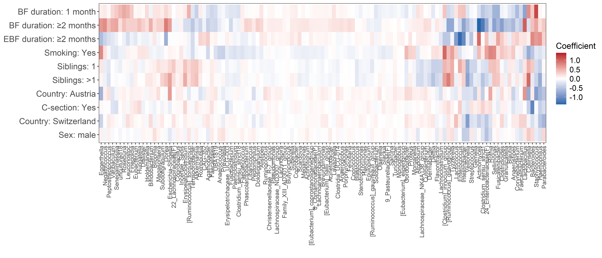
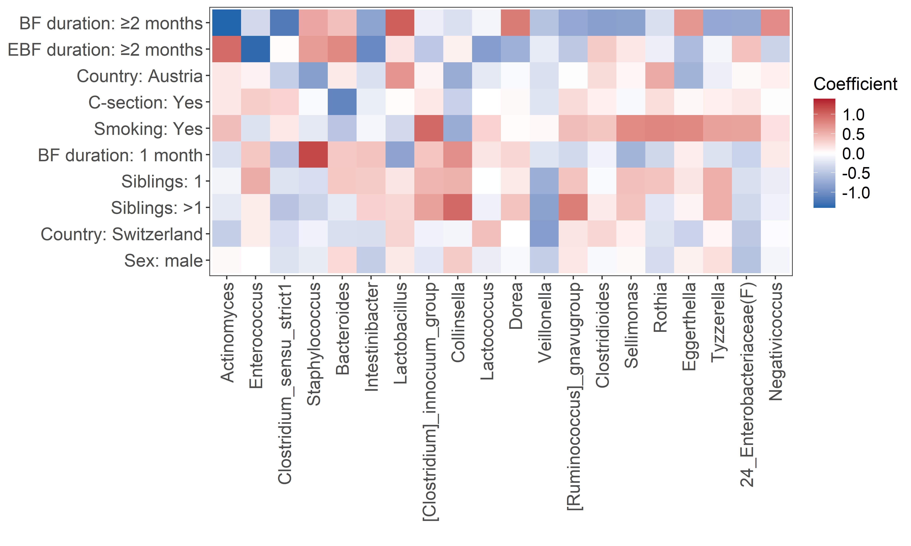

Regression models for compositional responses
================
Compiled at 2026-07-06 19:19:41 UTC

``` r
here::i_am(paste0(params$name, ".Rmd"), uuid = "9b9d6ec0-81d9-43a9-9e04-c99b38578ef2")
```

## Set global parameters

## Load data

### Phyloseq object on genus level

    ## phyloseq-class experiment-level object
    ## otu_table()   OTU Table:         [ 117 taxa and 592 samples ]
    ## sample_data() Sample Data:       [ 592 samples by 9 sample variables ]
    ## tax_table()   Taxonomy Table:    [ 117 taxa by 7 taxonomic ranks ]

## Helper functions

Counts are first transformed to relative abundances. Zeros are then
replaced with the multiplicative replacement implemented in
`zCompositions::multRepl()`, using the global minimum non-zero relative
abundance as detection limit and `frac = 0.65`. The CLR transformation
is applied after replacement. The shared preprocessing helpers are
defined in `functions.R`.

## Prepare CLR response matrix

    ## Warning in zCompositions::multRepl(rel_abund_mat, label = 0, dl = detection_limit_mat, : Column no. 1 containing >90% zeros/unobserved values found (see arguments z.warning and z.delete. Check out with zPatterns()).
    ## Column no. 3 containing >90% zeros/unobserved values found (see arguments z.warning and z.delete. Check out with zPatterns()).
    ## Column no. 5 containing >90% zeros/unobserved values found (see arguments z.warning and z.delete. Check out with zPatterns()).
    ## Column no. 6 containing >90% zeros/unobserved values found (see arguments z.warning and z.delete. Check out with zPatterns()).
    ## Column no. 7 containing >90% zeros/unobserved values found (see arguments z.warning and z.delete. Check out with zPatterns()).
    ## Column no. 12 containing >90% zeros/unobserved values found (see arguments z.warning and z.delete. Check out with zPatterns()).
    ## Column no. 13 containing >90% zeros/unobserved values found (see arguments z.warning and z.delete. Check out with zPatterns()).
    ## Column no. 15 containing >90% zeros/unobserved values found (see arguments z.warning and z.delete. Check out with zPatterns()).
    ## Column no. 17 containing >90% zeros/unobserved values found (see arguments z.warning and z.delete. Check out with zPatterns()).
    ## Column no. 18 containing >90% zeros/unobserved values found (see arguments z.warning and z.delete. Check out with zPatterns()).
    ## Column no. 19 containing >90% zeros/unobserved values found (see arguments z.warning and z.delete. Check out with zPatterns()).
    ## Column no. 20 containing >90% zeros/unobserved values found (see arguments z.warning and z.delete. Check out with zPatterns()).
    ## Column no. 22 containing >90% zeros/unobserved values found (see arguments z.warning and z.delete. Check out with zPatterns()).
    ## Column no. 23 containing >90% zeros/unobserved values found (see arguments z.warning and z.delete. Check out with zPatterns()).
    ## Column no. 25 containing >90% zeros/unobserved values found (see arguments z.warning and z.delete. Check out with zPatterns()).
    ## Column no. 26 containing >90% zeros/unobserved values found (see arguments z.warning and z.delete. Check out with zPatterns()).
    ## Column no. 27 containing >90% zeros/unobserved values found (see arguments z.warning and z.delete. Check out with zPatterns()).
    ## Column no. 28 containing >90% zeros/unobserved values found (see arguments z.warning and z.delete. Check out with zPatterns()).
    ## Column no. 30 containing >90% zeros/unobserved values found (see arguments z.warning and z.delete. Check out with zPatterns()).
    ## Column no. 33 containing >90% zeros/unobserved values found (see arguments z.warning and z.delete. Check out with zPatterns()).
    ## Column no. 34 containing >90% zeros/unobserved values found (see arguments z.warning and z.delete. Check out with zPatterns()).
    ## Column no. 35 containing >90% zeros/unobserved values found (see arguments z.warning and z.delete. Check out with zPatterns()).
    ## Column no. 36 containing >90% zeros/unobserved values found (see arguments z.warning and z.delete. Check out with zPatterns()).
    ## Column no. 37 containing >90% zeros/unobserved values found (see arguments z.warning and z.delete. Check out with zPatterns()).
    ## Column no. 38 containing >90% zeros/unobserved values found (see arguments z.warning and z.delete. Check out with zPatterns()).
    ## Column no. 39 containing >90% zeros/unobserved values found (see arguments z.warning and z.delete. Check out with zPatterns()).
    ## Column no. 40 containing >90% zeros/unobserved values found (see arguments z.warning and z.delete. Check out with zPatterns()).
    ## Column no. 42 containing >90% zeros/unobserved values found (see arguments z.warning and z.delete. Check out with zPatterns()).
    ## Column no. 43 containing >90% zeros/unobserved values found (see arguments z.warning and z.delete. Check out with zPatterns()).
    ## Column no. 44 containing >90% zeros/unobserved values found (see arguments z.warning and z.delete. Check out with zPatterns()).
    ## Column no. 45 containing >90% zeros/unobserved values found (see arguments z.warning and z.delete. Check out with zPatterns()).
    ## Column no. 46 containing >90% zeros/unobserved values found (see arguments z.warning and z.delete. Check out with zPatterns()).
    ## Column no. 48 containing >90% zeros/unobserved values found (see arguments z.warning and z.delete. Check out with zPatterns()).
    ## Column no. 50 containing >90% zeros/unobserved values found (see arguments z.warning and z.delete. Check out with zPatterns()).
    ## Column no. 51 containing >90% zeros/unobserved values found (see arguments z.warning and z.delete. Check out with zPatterns()).
    ## Column no. 54 containing >90% zeros/unobserved values found (see arguments z.warning and z.delete. Check out with zPatterns()).
    ## Column no. 55 containing >90% zeros/unobserved values found (see arguments z.warning and z.delete. Check out with zPatterns()).
    ## Column no. 58 containing >90% zeros/unobserved values found (see arguments z.warning and z.delete. Check out with zPatterns()).
    ## Column no. 59 containing >90% zeros/unobserved values found (see arguments z.warning and z.delete. Check out with zPatterns()).
    ## Column no. 60 containing >90% zeros/unobserved values found (see arguments z.warning and z.delete. Check out with zPatterns()).
    ## Column no. 61 containing >90% zeros/unobserved values found (see arguments z.warning and z.delete. Check out with zPatterns()).
    ## Column no. 64 containing >90% zeros/unobserved values found (see arguments z.warning and z.delete. Check out with zPatterns()).
    ## Column no. 66 containing >90% zeros/unobserved values found (see arguments z.warning and z.delete. Check out with zPatterns()).
    ## Column no. 67 containing >90% zeros/unobserved values found (see arguments z.warning and z.delete. Check out with zPatterns()).
    ## Column no. 69 containing >90% zeros/unobserved values found (see arguments z.warning and z.delete. Check out with zPatterns()).
    ## Column no. 70 containing >90% zeros/unobserved values found (see arguments z.warning and z.delete. Check out with zPatterns()).
    ## Column no. 71 containing >90% zeros/unobserved values found (see arguments z.warning and z.delete. Check out with zPatterns()).
    ## Column no. 72 containing >90% zeros/unobserved values found (see arguments z.warning and z.delete. Check out with zPatterns()).
    ## Column no. 73 containing >90% zeros/unobserved values found (see arguments z.warning and z.delete. Check out with zPatterns()).
    ## Column no. 74 containing >90% zeros/unobserved values found (see arguments z.warning and z.delete. Check out with zPatterns()).
    ## Column no. 76 containing >90% zeros/unobserved values found (see arguments z.warning and z.delete. Check out with zPatterns()).
    ## Column no. 77 containing >90% zeros/unobserved values found (see arguments z.warning and z.delete. Check out with zPatterns()).
    ## Column no. 78 containing >90% zeros/unobserved values found (see arguments z.warning and z.delete. Check out with zPatterns()).
    ## Column no. 81 containing >90% zeros/unobserved values found (see arguments z.warning and z.delete. Check out with zPatterns()).
    ## Column no. 84 containing >90% zeros/unobserved values found (see arguments z.warning and z.delete. Check out with zPatterns()).
    ## Column no. 85 containing >90% zeros/unobserved values found (see arguments z.warning and z.delete. Check out with zPatterns()).
    ## Column no. 86 containing >90% zeros/unobserved values found (see arguments z.warning and z.delete. Check out with zPatterns()).
    ## Column no. 87 containing >90% zeros/unobserved values found (see arguments z.warning and z.delete. Check out with zPatterns()).
    ## Column no. 88 containing >90% zeros/unobserved values found (see arguments z.warning and z.delete. Check out with zPatterns()).
    ## Column no. 90 containing >90% zeros/unobserved values found (see arguments z.warning and z.delete. Check out with zPatterns()).
    ## Column no. 91 containing >90% zeros/unobserved values found (see arguments z.warning and z.delete. Check out with zPatterns()).
    ## Column no. 92 containing >90% zeros/unobserved values found (see arguments z.warning and z.delete. Check out with zPatterns()).
    ## Column no. 93 containing >90% zeros/unobserved values found (see arguments z.warning and z.delete. Check out with zPatterns()).
    ## Column no. 94 containing >90% zeros/unobserved values found (see arguments z.warning and z.delete. Check out with zPatterns()).
    ## Col

    ## Warning in zCompositions::multRepl(rel_abund_mat, label = 0, dl = detection_limit_mat, : Row no. 80 containing >90% zeros/unobserved values found (see arguments z.warning and z.delete. Check out with zPatterns()).
    ## Row no. 102 containing >90% zeros/unobserved values found (see arguments z.warning and z.delete. Check out with zPatterns()).
    ## Row no. 112 containing >90% zeros/unobserved values found (see arguments z.warning and z.delete. Check out with zPatterns()).
    ## Row no. 145 containing >90% zeros/unobserved values found (see arguments z.warning and z.delete. Check out with zPatterns()).
    ## Row no. 147 containing >90% zeros/unobserved values found (see arguments z.warning and z.delete. Check out with zPatterns()).
    ## Row no. 157 containing >90% zeros/unobserved values found (see arguments z.warning and z.delete. Check out with zPatterns()).
    ## Row no. 164 containing >90% zeros/unobserved values found (see arguments z.warning and z.delete. Check out with zPatterns()).
    ## Row no. 265 containing >90% zeros/unobserved values found (see arguments z.warning and z.delete. Check out with zPatterns()).
    ## Row no. 366 containing >90% zeros/unobserved values found (see arguments z.warning and z.delete. Check out with zPatterns()).
    ## Row no. 368 containing >90% zeros/unobserved values found (see arguments z.warning and z.delete. Check out with zPatterns()).
    ## Row no. 397 containing >90% zeros/unobserved values found (see arguments z.warning and z.delete. Check out with zPatterns()).
    ## Row no. 399 containing >90% zeros/unobserved values found (see arguments z.warning and z.delete. Check out with zPatterns()).
    ## Row no. 403 containing >90% zeros/unobserved values found (see arguments z.warning and z.delete. Check out with zPatterns()).
    ## Row no. 410 containing >90% zeros/unobserved values found (see arguments z.warning and z.delete. Check out with zPatterns()).
    ## Row no. 416 containing >90% zeros/unobserved values found (see arguments z.warning and z.delete. Check out with zPatterns()).
    ## Row no. 436 containing >90% zeros/unobserved values found (see arguments z.warning and z.delete. Check out with zPatterns()).
    ## Row no. 471 containing >90% zeros/unobserved values found (see arguments z.warning and z.delete. Check out with zPatterns()).
    ## Row no. 480 containing >90% zeros/unobserved values found (see arguments z.warning and z.delete. Check out with zPatterns()).
    ## Row no. 533 containing >90% zeros/unobserved values found (see arguments z.warning and z.delete. Check out with zPatterns()).
    ## Row no. 551 containing >90% zeros/unobserved values found (see arguments z.warning and z.delete. Check out with zPatterns()).

    ## # A tibble: 1 × 9
    ##   n_samples n_taxa min_library_size median_library_size max_library_size zero_fraction detection_limit replacement_value replacement_fraction
    ##       <int>  <int>            <dbl>               <dbl>            <dbl>         <dbl>           <dbl>             <dbl>                <dbl>
    ## 1       592    117             1456              21898.            69556         0.796       0.0000288         0.0000187                 0.65

## Regression analysis setup

Samples with `EBF duration == "1 month"` are removed before fitting the
regression models, because this sparse group contains only three samples
and may confound the regression-based global tests.

All covariates are tested on the same complete-case analysis set. That
is, after removing the sparse EBF group, samples with missing values in
any of the model covariates are excluded once, and the resulting sample
set is used for all full-versus-reduced model comparisons. This ensures
that differences in the test statistics reflect the covariate being
omitted rather than changes in the sample composition. The number of
taxa is fixed by the filtered genus-level phyloseq object used to
construct the CLR response matrix.

Then, a linear regression model (`lm()`) is fitted to the data, using
the CLR transformed data as response.

    ## # A tibble: 1 × 4
    ##   n_samples n_taxa excluded_ebf_one_month n_covariates
    ##       <int>  <int>                  <int>        <int>
    ## 1       484    117                      3            7

    ## # A tibble: 7 × 3
    ##   variable     n_levels levels                       
    ##   <chr>           <int> <chr>                        
    ## 1 Country             3 Germany; Switzerland; Austria
    ## 2 Sex                 2 Female; Male                 
    ## 3 C-section           2 No; Yes                      
    ## 4 BF duration         3 0 months; 1 month; ≥2 months 
    ## 5 EBF duration        2 0 months; ≥2 months          
    ## 6 Smoking             2 No; Yes                      
    ## 7 Siblings            3 0; 1; >1

Thus, the multivariate regression model is fitted to 484 samples and 117
genus-level taxa for every covariate test.

## CLR-based multivariate regression

The fitted model uses the CLR-transformed microbial profile as
multivariate response and compares the full model with reduced models in
which one covariate is omitted. For each covariate, the test statistic
is the reduction in multivariate residual sum of squares.

    ## # A tibble: 10 × 6
    ##    coefficient             Phascolarctobacterium Veillonella Negativicoccus Dialister Megasphaera
    ##    <chr>                                   <dbl>       <dbl>          <dbl>     <dbl>       <dbl>
    ##  1 (Intercept)                           -1.02        3.38          -0.999    -0.646      -1.26  
    ##  2 CountrySwitzerland                     0.0716     -0.848         -0.0211    0.0674      0.0724
    ##  3 CountryAustria                         0.0267     -0.263          0.0987    0.0639      0.208 
    ##  4 SexMale                                0.0263     -0.408         -0.0830    0.0717      0.0800
    ##  5 `C-section`Yes                        -0.0648     -0.218         -0.0152   -0.121       0.0180
    ##  6 `BF duration`1 month                  -0.0424     -0.216          0.138     0.0352      0.171 
    ##  7 `BF duration`≥2 months                 0.283      -0.524          0.746     0.298       0.297 
    ##  8 `EBF duration`≥2 months               -0.131      -0.172         -0.371    -0.122      -0.0739
    ##  9 SmokingYes                            -0.172       0.0408         0.192     0.169      -0.122 
    ## 10 Siblings1                              0.0560     -0.699         -0.152    -0.108       0.200

### Coefficient heatmap

The full multivariate regression yields one coefficient for each model
term and CLR coordinate. The heatmap below visualizes these coefficients
as a compact overview of the fitted multivariate effect pattern. Rows
correspond to the model matrix terms; for categorical variables, these
are contrasts relative to the reference level. Columns correspond to
genus-level taxa. Red values indicate a positive coefficient on the CLR
scale, whereas blue values indicate a negative coefficient. The heatmap
is descriptive and is not used for taxon-level inference in this
community-level analysis.

<!-- -->

<!-- -->

## Permutation-based global covariate tests

    ## # A tibble: 7 × 7
    ##   variable     n_samples n_taxa statistic_obs p_empirical n_exceed n_perm
    ##   <fct>            <int>  <int>         <dbl> <chr>          <int>  <dbl>
    ## 1 Country            484    117          699. 1.00e-03           0    999
    ## 2 Sex                484    117          226. 1.08e-01         107    999
    ## 3 C-section          484    117          218. 1.48e-01         147    999
    ## 4 BF duration        484    117          641. 1.00e-03           0    999
    ## 5 EBF duration       484    117          451. 1.00e-03           0    999
    ## 6 Smoking            484    117          275. 3.00e-02          29    999
    ## 7 Siblings           484    117          437. 7.80e-02          77    999

### Permutation distributions

The following plot shows a subset of the empirical null distributions
obtained from the permutation statistics. Six covariate-specific
distributions are shown to provide a compact visual check of the
permutation results.

<!-- -->

### p-value refinement with permApprox

    ## permApprox result
    ## -----------------
    ## Number of tests             : 7
    ## Approximation method        : GPD tail approximation
    ## Approximation threshold     : p-values < 0.1
    ## Multiple testing adjustment : none
    ## 
    ## Successful fits          : 5
    ## GOF rejections           : 0
    ## Fit failed               : 0
    ## No threshold found       : 0
    ## Discrete distributions   : 0
    ## Not selected for fitting : 2
    ## 
    ## Final p-values:
    ##   min = 0.000000878, median = 0.0241, max = 0.148
    ## 
    ## Use summary() for detailed fit diagnostics.

    ## # A tibble: 7 × 9
    ##   variable     n_samples n_taxa statistic_obs n_exceed n_perm p_empirical p_permapprox method_used
    ##   <fct>            <int>  <int>         <dbl>    <int>  <dbl> <chr>       <chr>        <chr>      
    ## 1 EBF duration       484    117          451.        0    999 1.00e-03    8.78e-07     gpd        
    ## 2 Country            484    117          699.        0    999 1.00e-03    3.51e-06     gpd        
    ## 3 BF duration        484    117          641.        0    999 1.00e-03    4.14e-05     gpd        
    ## 4 Smoking            484    117          275.       29    999 3.00e-02    2.41e-02     gpd        
    ## 5 Siblings           484    117          437.       77    999 7.80e-02    7.22e-02     gpd        
    ## 6 Sex                484    117          226.      107    999 1.08e-01    1.08e-01     empirical  
    ## 7 C-section          484    117          218.      147    999 1.48e-01    1.48e-01     empirical

## Files written

These files have been written to the target directory,
`data/05_regression`:

    ## # A tibble: 11 × 4
    ##    path                                           type         size modification_time  
    ##    <fs::path>                                     <fct> <fs::bytes> <dttm>             
    ##  1 regression_coefficient_heatmap_data.csv        file        60.4K 2026-07-06 19:19:45
    ##  2 regression_coefficient_heatmap_top20_data.csv  file       10.25K 2026-07-06 19:19:47
    ##  3 regression_covariate_level_summary.csv         file          224 2026-07-06 19:19:44
    ##  4 regression_full_model_fit.rds                  file        1.79M 2026-07-06 19:19:44
    ##  5 regression_model_summary.csv                   file           65 2026-07-06 19:19:44
    ##  6 regression_multrepl_clr_object.rds             file      262.74K 2026-07-06 19:19:43
    ##  7 regression_permapprox_results_multrepl_clr.rds file       16.88K 2026-06-11 10:47:49
    ##  8 regression_preprocessing_summary.csv           file          233 2026-07-06 19:19:44
    ##  9 regression_results_multrepl_clr.csv            file          405 2026-07-06 19:19:47
    ## 10 regression_results_multrepl_clr.rds            file       46.84K 2026-06-11 10:47:49
    ## 11 regression_table.tex                           file        1.14K 2026-07-06 19:19:50
