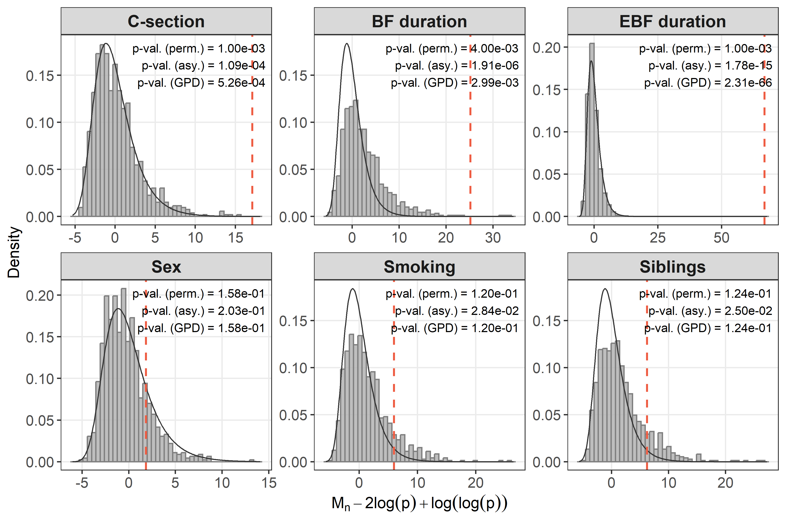
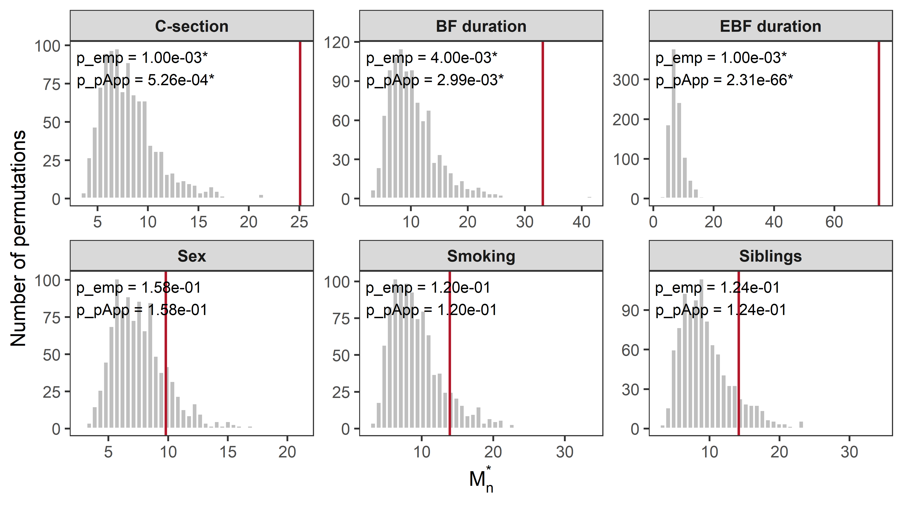
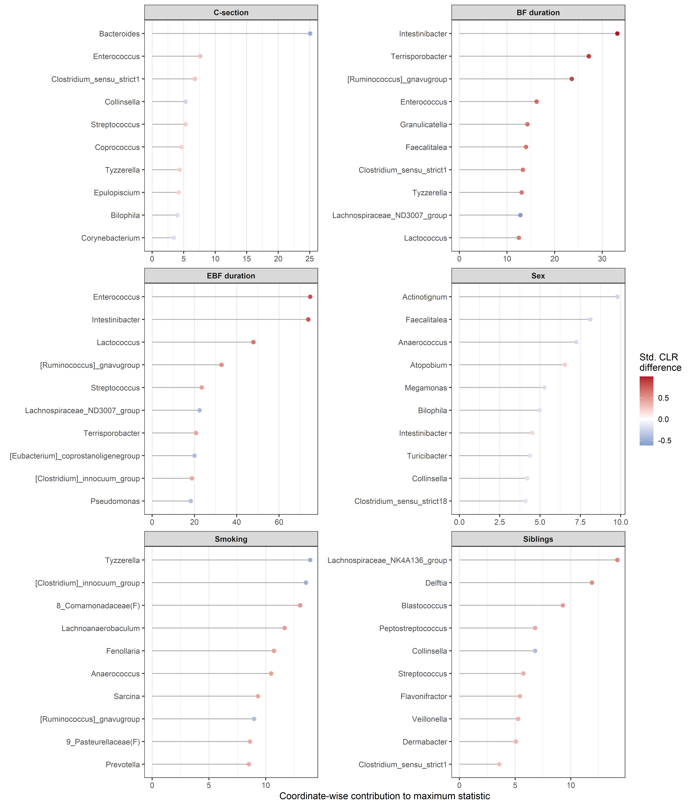
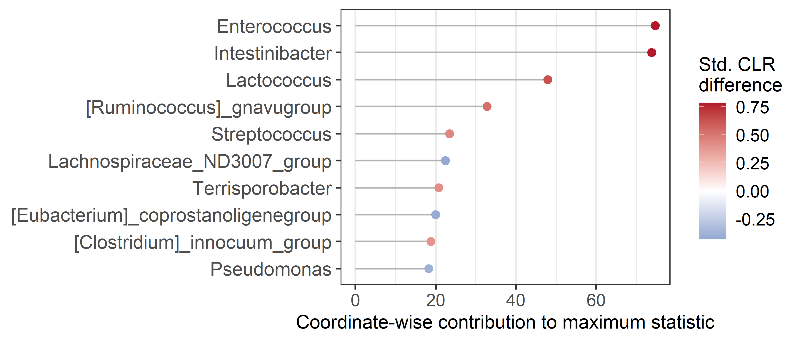

Compositional equivalence
================
Compiled at 2026-07-06 19:20:03 UTC

``` r
here::i_am(paste0(params$name, ".Rmd"), uuid = "312648b4-8c26-4e76-aff7-ab6062b7ba2e")
```

## Set global parameters

## Load data

### Phyloseq object on genus level

    ## phyloseq-class experiment-level object
    ## otu_table()   OTU Table:         [ 117 taxa and 592 samples ]
    ## sample_data() Sample Data:       [ 592 samples by 9 sample variables ]
    ## tax_table()   Taxonomy Table:    [ 117 taxa by 7 taxonomic ranks ]

## Helper functions

Counts are transformed to relative abundances, zeros are replaced by
multiplicative replacement, and the CLR transformation is applied after
replacement. This follows the same preprocessing strategy as the
beta-diversity and regression analyses. The shared preprocessing helpers
are defined in `functions.R`.

## Prepare CLR matrix

    ## Warning in zCompositions::multRepl(rel_abund_mat, label = 0, dl = detection_limit_mat, : Column no. 1 containing >90% zeros/unobserved values found (see arguments z.warning and z.delete. Check out with zPatterns()).
    ## Column no. 3 containing >90% zeros/unobserved values found (see arguments z.warning and z.delete. Check out with zPatterns()).
    ## Column no. 5 containing >90% zeros/unobserved values found (see arguments z.warning and z.delete. Check out with zPatterns()).
    ## Column no. 6 containing >90% zeros/unobserved values found (see arguments z.warning and z.delete. Check out with zPatterns()).
    ## Column no. 7 containing >90% zeros/unobserved values found (see arguments z.warning and z.delete. Check out with zPatterns()).
    ## Column no. 12 containing >90% zeros/unobserved values found (see arguments z.warning and z.delete. Check out with zPatterns()).
    ## Column no. 13 containing >90% zeros/unobserved values found (see arguments z.warning and z.delete. Check out with zPatterns()).
    ## Column no. 15 containing >90% zeros/unobserved values found (see arguments z.warning and z.delete. Check out with zPatterns()).
    ## Column no. 17 containing >90% zeros/unobserved values found (see arguments z.warning and z.delete. Check out with zPatterns()).
    ## Column no. 18 containing >90% zeros/unobserved values found (see arguments z.warning and z.delete. Check out with zPatterns()).
    ## Column no. 19 containing >90% zeros/unobserved values found (see arguments z.warning and z.delete. Check out with zPatterns()).
    ## Column no. 20 containing >90% zeros/unobserved values found (see arguments z.warning and z.delete. Check out with zPatterns()).
    ## Column no. 22 containing >90% zeros/unobserved values found (see arguments z.warning and z.delete. Check out with zPatterns()).
    ## Column no. 23 containing >90% zeros/unobserved values found (see arguments z.warning and z.delete. Check out with zPatterns()).
    ## Column no. 25 containing >90% zeros/unobserved values found (see arguments z.warning and z.delete. Check out with zPatterns()).
    ## Column no. 26 containing >90% zeros/unobserved values found (see arguments z.warning and z.delete. Check out with zPatterns()).
    ## Column no. 27 containing >90% zeros/unobserved values found (see arguments z.warning and z.delete. Check out with zPatterns()).
    ## Column no. 28 containing >90% zeros/unobserved values found (see arguments z.warning and z.delete. Check out with zPatterns()).
    ## Column no. 30 containing >90% zeros/unobserved values found (see arguments z.warning and z.delete. Check out with zPatterns()).
    ## Column no. 33 containing >90% zeros/unobserved values found (see arguments z.warning and z.delete. Check out with zPatterns()).
    ## Column no. 34 containing >90% zeros/unobserved values found (see arguments z.warning and z.delete. Check out with zPatterns()).
    ## Column no. 35 containing >90% zeros/unobserved values found (see arguments z.warning and z.delete. Check out with zPatterns()).
    ## Column no. 36 containing >90% zeros/unobserved values found (see arguments z.warning and z.delete. Check out with zPatterns()).
    ## Column no. 37 containing >90% zeros/unobserved values found (see arguments z.warning and z.delete. Check out with zPatterns()).
    ## Column no. 38 containing >90% zeros/unobserved values found (see arguments z.warning and z.delete. Check out with zPatterns()).
    ## Column no. 39 containing >90% zeros/unobserved values found (see arguments z.warning and z.delete. Check out with zPatterns()).
    ## Column no. 40 containing >90% zeros/unobserved values found (see arguments z.warning and z.delete. Check out with zPatterns()).
    ## Column no. 42 containing >90% zeros/unobserved values found (see arguments z.warning and z.delete. Check out with zPatterns()).
    ## Column no. 43 containing >90% zeros/unobserved values found (see arguments z.warning and z.delete. Check out with zPatterns()).
    ## Column no. 44 containing >90% zeros/unobserved values found (see arguments z.warning and z.delete. Check out with zPatterns()).
    ## Column no. 45 containing >90% zeros/unobserved values found (see arguments z.warning and z.delete. Check out with zPatterns()).
    ## Column no. 46 containing >90% zeros/unobserved values found (see arguments z.warning and z.delete. Check out with zPatterns()).
    ## Column no. 48 containing >90% zeros/unobserved values found (see arguments z.warning and z.delete. Check out with zPatterns()).
    ## Column no. 50 containing >90% zeros/unobserved values found (see arguments z.warning and z.delete. Check out with zPatterns()).
    ## Column no. 51 containing >90% zeros/unobserved values found (see arguments z.warning and z.delete. Check out with zPatterns()).
    ## Column no. 54 containing >90% zeros/unobserved values found (see arguments z.warning and z.delete. Check out with zPatterns()).
    ## Column no. 55 containing >90% zeros/unobserved values found (see arguments z.warning and z.delete. Check out with zPatterns()).
    ## Column no. 58 containing >90% zeros/unobserved values found (see arguments z.warning and z.delete. Check out with zPatterns()).
    ## Column no. 59 containing >90% zeros/unobserved values found (see arguments z.warning and z.delete. Check out with zPatterns()).
    ## Column no. 60 containing >90% zeros/unobserved values found (see arguments z.warning and z.delete. Check out with zPatterns()).
    ## Column no. 61 containing >90% zeros/unobserved values found (see arguments z.warning and z.delete. Check out with zPatterns()).
    ## Column no. 64 containing >90% zeros/unobserved values found (see arguments z.warning and z.delete. Check out with zPatterns()).
    ## Column no. 66 containing >90% zeros/unobserved values found (see arguments z.warning and z.delete. Check out with zPatterns()).
    ## Column no. 67 containing >90% zeros/unobserved values found (see arguments z.warning and z.delete. Check out with zPatterns()).
    ## Column no. 69 containing >90% zeros/unobserved values found (see arguments z.warning and z.delete. Check out with zPatterns()).
    ## Column no. 70 containing >90% zeros/unobserved values found (see arguments z.warning and z.delete. Check out with zPatterns()).
    ## Column no. 71 containing >90% zeros/unobserved values found (see arguments z.warning and z.delete. Check out with zPatterns()).
    ## Column no. 72 containing >90% zeros/unobserved values found (see arguments z.warning and z.delete. Check out with zPatterns()).
    ## Column no. 73 containing >90% zeros/unobserved values found (see arguments z.warning and z.delete. Check out with zPatterns()).
    ## Column no. 74 containing >90% zeros/unobserved values found (see arguments z.warning and z.delete. Check out with zPatterns()).
    ## Column no. 76 containing >90% zeros/unobserved values found (see arguments z.warning and z.delete. Check out with zPatterns()).
    ## Column no. 77 containing >90% zeros/unobserved values found (see arguments z.warning and z.delete. Check out with zPatterns()).
    ## Column no. 78 containing >90% zeros/unobserved values found (see arguments z.warning and z.delete. Check out with zPatterns()).
    ## Column no. 81 containing >90% zeros/unobserved values found (see arguments z.warning and z.delete. Check out with zPatterns()).
    ## Column no. 84 containing >90% zeros/unobserved values found (see arguments z.warning and z.delete. Check out with zPatterns()).
    ## Column no. 85 containing >90% zeros/unobserved values found (see arguments z.warning and z.delete. Check out with zPatterns()).
    ## Column no. 86 containing >90% zeros/unobserved values found (see arguments z.warning and z.delete. Check out with zPatterns()).
    ## Column no. 87 containing >90% zeros/unobserved values found (see arguments z.warning and z.delete. Check out with zPatterns()).
    ## Column no. 88 containing >90% zeros/unobserved values found (see arguments z.warning and z.delete. Check out with zPatterns()).
    ## Column no. 90 containing >90% zeros/unobserved values found (see arguments z.warning and z.delete. Check out with zPatterns()).
    ## Column no. 91 containing >90% zeros/unobserved values found (see arguments z.warning and z.delete. Check out with zPatterns()).
    ## Column no. 92 containing >90% zeros/unobserved values found (see arguments z.warning and z.delete. Check out with zPatterns()).
    ## Column no. 93 containing >90% zeros/unobserved values found (see arguments z.warning and z.delete. Check out with zPatterns()).
    ## Column no. 94 containing >90% zeros/unobserved values found (see arguments z.warning and z.delete. Check out with zPatterns()).
    ## Col

    ## Warning in zCompositions::multRepl(rel_abund_mat, label = 0, dl = detection_limit_mat, : Row no. 80 containing >90% zeros/unobserved values found (see arguments z.warning and z.delete. Check out with zPatterns()).
    ## Row no. 102 containing >90% zeros/unobserved values found (see arguments z.warning and z.delete. Check out with zPatterns()).
    ## Row no. 112 containing >90% zeros/unobserved values found (see arguments z.warning and z.delete. Check out with zPatterns()).
    ## Row no. 145 containing >90% zeros/unobserved values found (see arguments z.warning and z.delete. Check out with zPatterns()).
    ## Row no. 147 containing >90% zeros/unobserved values found (see arguments z.warning and z.delete. Check out with zPatterns()).
    ## Row no. 157 containing >90% zeros/unobserved values found (see arguments z.warning and z.delete. Check out with zPatterns()).
    ## Row no. 164 containing >90% zeros/unobserved values found (see arguments z.warning and z.delete. Check out with zPatterns()).
    ## Row no. 265 containing >90% zeros/unobserved values found (see arguments z.warning and z.delete. Check out with zPatterns()).
    ## Row no. 366 containing >90% zeros/unobserved values found (see arguments z.warning and z.delete. Check out with zPatterns()).
    ## Row no. 368 containing >90% zeros/unobserved values found (see arguments z.warning and z.delete. Check out with zPatterns()).
    ## Row no. 397 containing >90% zeros/unobserved values found (see arguments z.warning and z.delete. Check out with zPatterns()).
    ## Row no. 399 containing >90% zeros/unobserved values found (see arguments z.warning and z.delete. Check out with zPatterns()).
    ## Row no. 403 containing >90% zeros/unobserved values found (see arguments z.warning and z.delete. Check out with zPatterns()).
    ## Row no. 410 containing >90% zeros/unobserved values found (see arguments z.warning and z.delete. Check out with zPatterns()).
    ## Row no. 416 containing >90% zeros/unobserved values found (see arguments z.warning and z.delete. Check out with zPatterns()).
    ## Row no. 436 containing >90% zeros/unobserved values found (see arguments z.warning and z.delete. Check out with zPatterns()).
    ## Row no. 471 containing >90% zeros/unobserved values found (see arguments z.warning and z.delete. Check out with zPatterns()).
    ## Row no. 480 containing >90% zeros/unobserved values found (see arguments z.warning and z.delete. Check out with zPatterns()).
    ## Row no. 533 containing >90% zeros/unobserved values found (see arguments z.warning and z.delete. Check out with zPatterns()).
    ## Row no. 551 containing >90% zeros/unobserved values found (see arguments z.warning and z.delete. Check out with zPatterns()).

    ## # A tibble: 1 × 9
    ##   n_samples n_taxa min_library_size median_library_size max_library_size zero_fraction detection_limit replacement_value replacement_fraction
    ##       <int>  <int>            <dbl>               <dbl>            <dbl>         <dbl>           <dbl>             <dbl>                <dbl>
    ## 1       592    117             1456              21898.            69556         0.796       0.0000288         0.0000187                 0.65

## Contrast setup

Compositional equivalence is a two-group procedure. Country is omitted,
and the number of siblings is collapsed to a two-level variable
contrasting children without siblings against children with at least one
sibling. The sparse `EBF duration == "1 month"` category is set to
missing only for the EBF-specific contrast setup; those samples remain
in the CLR matrix and are available for all other contrasts.

    ## # A tibble: 6 × 6
    ##   variable     group1   group2     n_group1 n_group2 n_missing_or_other
    ##   <chr>        <chr>    <chr>         <int>    <int>              <int>
    ## 1 C-section    Cesarean Vaginal         121      468                  3
    ## 2 BF duration  0 months >=2 months       36      456                100
    ## 3 EBF duration 0 months >=2 months      179      375                 38
    ## 4 Sex          Female   Male            294      298                  0
    ## 5 Smoking      No       Yes             529       63                  0
    ## 6 Siblings     0        >=1              46      457                 89

## Compositional equivalence tests

For each contrast, the statistic is the largest standardized squared
difference between group CLR means. Group labels are permuted while the
CLR-transformed microbial profiles are kept fixed.

    ## # A tibble: 6 × 10
    ##   contrast     group1   group2        n1    n2 n_taxa_tested statistic_obs p_empirical n_exceed n_perm
    ##   <fct>        <chr>    <chr>      <int> <int>         <int>         <dbl> <chr>          <int>  <dbl>
    ## 1 C-section    Cesarean Vaginal      121   468           117         25.1  1.00e-03           0    999
    ## 2 BF duration  0 months >=2 months    36   456           117         33.2  4.00e-03           3    999
    ## 3 EBF duration 0 months >=2 months   179   375           117         74.7  1.00e-03           0    999
    ## 4 Sex          Female   Male         294   298           117          9.79 1.58e-01         157    999
    ## 5 Smoking      No       Yes          529    63           117         13.9  1.20e-01         119    999
    ## 6 Siblings     0        >=1           46   457           117         14.2  1.24e-01         123    999

## p-value refinement with permApprox

    ## permApprox result
    ## -----------------
    ## Number of tests             : 6
    ## Approximation method        : GPD tail approximation
    ## Approximation threshold     : p-values < 0.1
    ## Multiple testing adjustment : none
    ## 
    ## Successful fits          : 3
    ## GOF rejections           : 0
    ## Fit failed               : 0
    ## No threshold found       : 0
    ## Discrete distributions   : 0
    ## Not selected for fitting : 3
    ## 
    ## Final p-values:
    ##   min = 0.00000000000000000000000000000000000000000000000000000000000000000231, median = 0.0615, max = 0.158
    ## 
    ## Use summary() for detailed fit diagnostics.

    ## # A tibble: 6 × 17
    ##   contrast     group1   group2        n1    n2 n_samples n_taxa n_taxa_tested n_taxa_zero_variance statistic_obs n_exceed n_perm p_empirical
    ##   <fct>        <chr>    <chr>      <int> <int>     <int>  <int>         <int>                <int>         <dbl>    <int>  <dbl> <chr>      
    ## 1 C-section    Cesarean Vaginal      121   468       589    117           117                    0         25.1         0    999 1.00e-03   
    ## 2 BF duration  0 months >=2 months    36   456       492    117           117                    0         33.2         3    999 4.00e-03   
    ## 3 EBF duration 0 months >=2 months   179   375       554    117           117                    0         74.7         0    999 1.00e-03   
    ## 4 Sex          Female   Male         294   298       592    117           117                    0          9.79      157    999 1.58e-01   
    ## 5 Smoking      No       Yes          529    63       592    117           117                    0         13.9       119    999 1.20e-01   
    ## 6 Siblings     0        >=1           46   457       503    117           117                    0         14.2       123    999 1.24e-01   
    ## # ℹ 4 more variables: statistic_centered <dbl>, p_asymptotic_gumbel <chr>, p_permapprox <chr>, method_used <chr>

## Asymptotic Gumbel comparison

The maximum statistic can also be centered as
$M_n^c = M_n - 2\log(p) + \log\log(p)$ and compared with the limiting
Gumbel distribution used by Cao et al. The permutation statistics are
centered in the same way, using the number of CLR coordinates tested in
each contrast. This comparison is diagnostic: the permutation-based
p-values remain the primary inferential results in this analysis.

<!-- -->

## Permutation distributions

The following diagnostic plot shows selected empirical null
distributions. These plots are used as a visual check of the permutation
tail before relying on the GPD-based p-value refinement.

<!-- -->

## Taxon-wise CLR contrasts

The test is global and does not provide taxon-level inference. The
following plots are descriptive: they show the taxa with the largest
coordinate-wise contributions to the maximum statistic for each
contrast.

<!-- -->

As we will use `EBF duration` as grouping variable in later analyses, we
generate an isolated plot for this variable here, which will be shown in
the thesis chapter.

<!-- -->

## Files written

These files have been written to the target directory,
`data/06_comp_equivalence`:

    ## # A tibble: 10 × 4
    ##    path                                                 type         size modification_time  
    ##    <fs::path>                                           <fct> <fs::bytes> <dttm>             
    ##  1 comp_equivalence_contrast_level_summary.csv          file          259 2026-07-06 19:20:05
    ##  2 comp_equivalence_multrepl_clr_object.rds             file      262.74K 2026-07-06 19:20:05
    ##  3 comp_equivalence_permapprox_results_multrepl_clr.rds file       13.56K 2026-06-11 15:12:59
    ##  4 comp_equivalence_preprocessing_summary.csv           file          233 2026-07-06 19:20:05
    ##  5 comp_equivalence_results_multrepl_clr.csv            file         1007 2026-07-06 19:20:06
    ##  6 comp_equivalence_results_multrepl_clr.rds            file       68.42K 2026-06-11 15:12:58
    ##  7 comp_equivalence_table.tex                           file        1.35K 2026-07-06 19:20:06
    ##  8 comp_equivalence_taxon_contrasts.csv                 file       87.54K 2026-07-06 19:20:10
    ##  9 comp_equivalence_top10_taxon_contrasts.csv           file         7.6K 2026-07-06 19:20:11
    ## 10 comp_equivalence_top20_taxon_contrasts.csv           file          15K 2026-06-11 20:00:55
