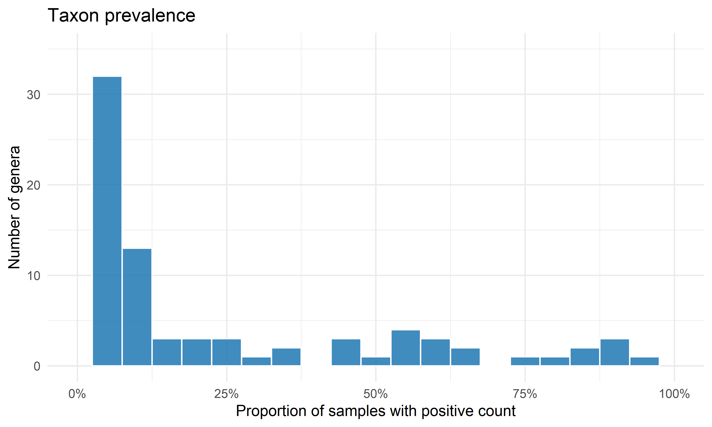
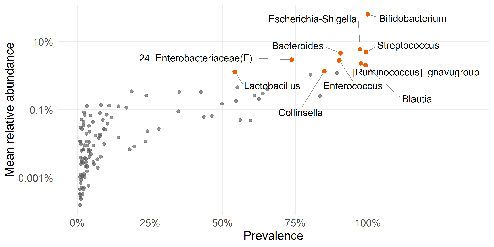
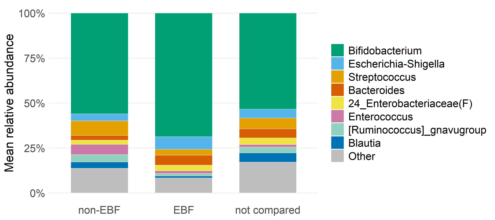
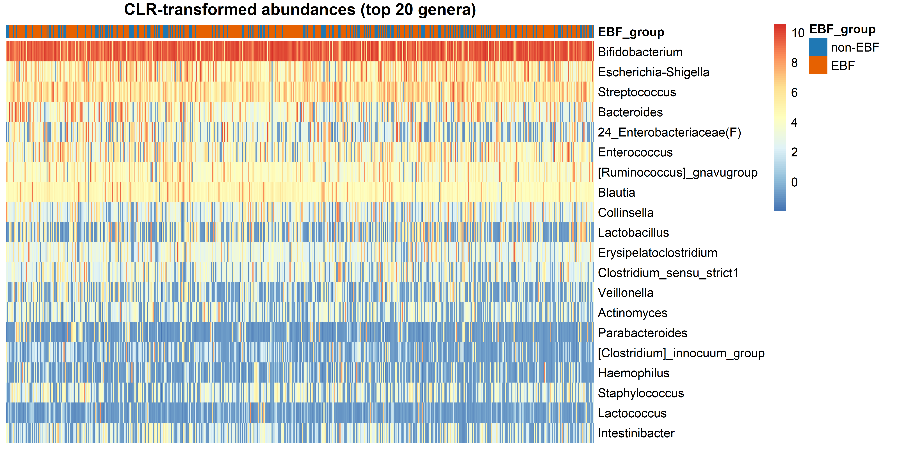
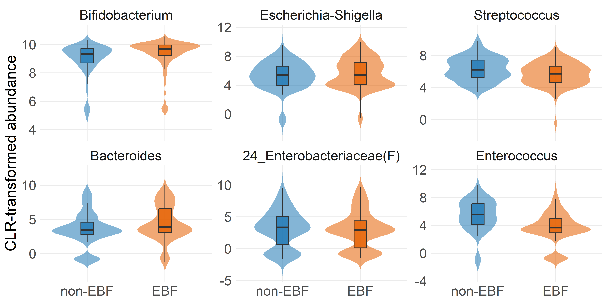
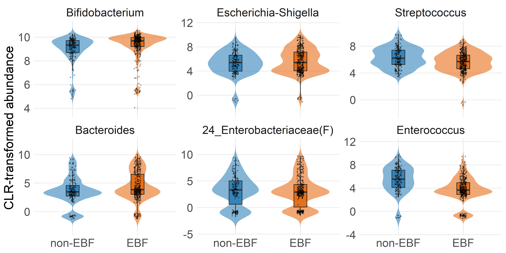
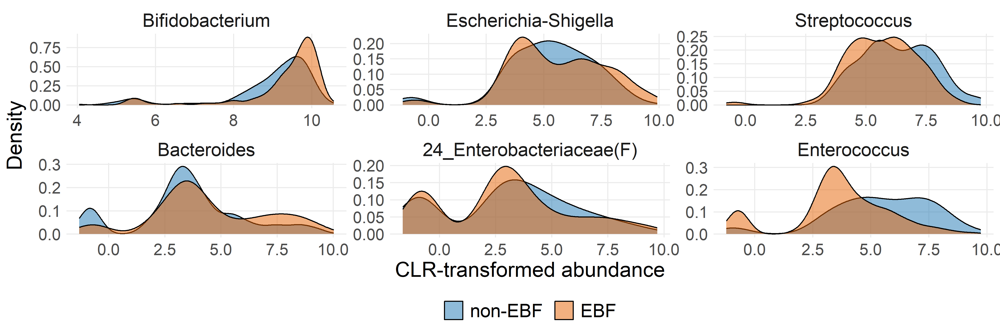
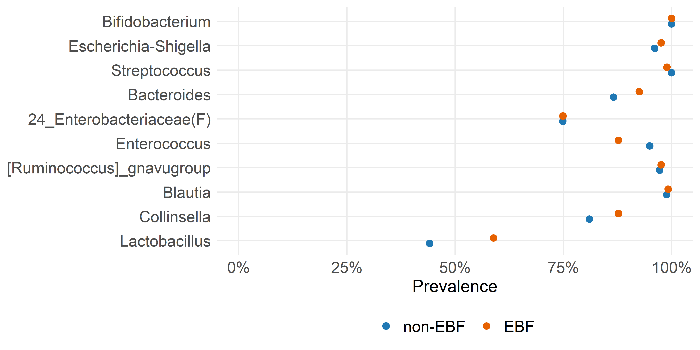

Exploratory taxon-level analysis
================
Compiled at 2026-06-12 21:42:15 UTC

## Set global parameters

## Load data

### Phyloseq object on genus level

    ## phyloseq-class experiment-level object
    ## otu_table()   OTU Table:         [ 117 taxa and 592 samples ]
    ## sample_data() Sample Data:       [ 592 samples by 9 sample variables ]
    ## tax_table()   Taxonomy Table:    [ 117 taxa by 7 taxonomic ranks ]

## Helper functions

The exploratory analyses use the filtered genus-level object that is
also used for differential abundance and differential distribution
analyses. Relative abundances are used for compositional summaries,
while multiplicative zero replacement followed by CLR transformation is
used for transformed-abundance visualizations.

## Prepare matrices

    ## # A tibble: 1 × 12
    ##   n_samples n_taxa min_library_size median_library_size max_library_size zero_fraction detection_limit replacement_value
    ##       <int>  <int>            <dbl>               <dbl>            <dbl>         <dbl>           <dbl>             <dbl>
    ## 1       592    117             1456              21898.            69556         0.796       0.0000288         0.0000187
    ## # ℹ 4 more variables: replacement_fraction <dbl>, n_non_ebf <int>, n_ebf <int>, n_excluded_from_ebf_comparison <int>

## Taxon summaries

    ## # A tibble: 117 × 16
    ##    taxon_id           taxon total_count prevalence mean_relative_abunda…¹ median_relative_abun…² max_relative_abundance mean_clr
    ##    <chr>              <chr>       <dbl>      <dbl>                  <dbl>                  <dbl>                  <dbl>    <dbl>
    ##  1 Bifidobacterium    Bifi…     8417119      1                     0.639                0.721                     0.988     9.18
    ##  2 Escherichia-Shige… Esch…      790539      0.973                 0.0594               0.0104                    0.844     5.52
    ##  3 Streptococcus      Stre…      597247      0.993                 0.0495               0.0175                    0.807     5.89
    ##  4 Bacteroides        Bact…      640951      0.905                 0.0456               0.00191                   0.868     4.15
    ##  5 24_Enterobacteria… 24_E…      395293      0.738                 0.0294               0.000954                  0.816     2.98
    ##  6 Enterococcus       Ente…      350643      0.902                 0.0280               0.00292                   0.697     4.25
    ##  7 [Ruminococcus]_gn… [Rum…      318542      0.976                 0.0231               0.00272                   0.691     4.47
    ##  8 Blautia            Blau…      250905      0.992                 0.0205               0.00476                   0.621     4.82
    ##  9 Collinsella        Coll…      178149      0.850                 0.0134               0.000750                  0.367     2.99
    ## 10 Lactobacillus      Lact…      167883      0.542                 0.0129               0.000266                  0.370     2.00
    ## # ℹ 107 more rows
    ## # ℹ abbreviated names: ¹​mean_relative_abundance, ²​median_relative_abundance
    ## # ℹ 8 more variables: median_clr <dbl>, Kingdom <chr>, Phylum <chr>, Class <chr>, Order <chr>, Family <chr>, Genus <chr>,
    ## #   Species <chr>

## Prevalence and abundance

<!-- -->

<!-- -->

<!-- -->

## Dominant taxonomic composition

    ## # A tibble: 27 × 3
    ##    EBF_group taxon                     mean_relative_abundance
    ##    <fct>     <fct>                                       <dbl>
    ##  1 non-EBF   Bifidobacterium                            0.560 
    ##  2 non-EBF   Escherichia-Shigella                       0.0392
    ##  3 non-EBF   Streptococcus                              0.0810
    ##  4 non-EBF   Bacteroides                                0.0260
    ##  5 non-EBF   24_Enterobacteriaceae(F)                   0.0236
    ##  6 non-EBF   Enterococcus                               0.0568
    ##  7 non-EBF   [Ruminococcus]_gnavugroup                  0.0411
    ##  8 non-EBF   Blautia                                    0.0347
    ##  9 non-EBF   Other                                      0.137 
    ## 10 EBF       Bifidobacterium                            0.687 
    ## # ℹ 17 more rows

<!-- -->

## CLR-transformed abundances

<!-- -->

<!-- -->

## Selected taxon distributions

    ## # A tibble: 3,324 × 5
    ##    SampleID EBF_group taxon_id                 clr_abundance taxon                   
    ##    <chr>    <fct>     <chr>                            <dbl> <fct>                   
    ##  1 s025647  non-EBF   Bifidobacterium                   8.10 Bifidobacterium         
    ##  2 s025647  non-EBF   Escherichia-Shigella              3.14 Escherichia-Shigella    
    ##  3 s025647  non-EBF   Streptococcus                     4.53 Streptococcus           
    ##  4 s025647  non-EBF   Bacteroides                       2.91 Bacteroides             
    ##  5 s025647  non-EBF   24_Enterobacteriaceae(F)         -1.54 24_Enterobacteriaceae(F)
    ##  6 s025647  non-EBF   Enterococcus                      5.38 Enterococcus            
    ##  7 s023779  non-EBF   Bifidobacterium                   9.74 Bifidobacterium         
    ##  8 s023779  non-EBF   Escherichia-Shigella              5.09 Escherichia-Shigella    
    ##  9 s023779  non-EBF   Streptococcus                     5.09 Streptococcus           
    ## 10 s023779  non-EBF   Bacteroides                       4.34 Bacteroides             
    ## # ℹ 3,314 more rows

<!-- -->

<!-- -->

<!-- -->

<!-- -->

## Files written

These files have been written to the target directory,
`data/07_exploration`:

    ## # A tibble: 5 × 4
    ##   path                                  type         size modification_time  
    ##   <fs::path>                            <fct> <fs::bytes> <dttm>             
    ## 1 exploration_preprocessed_objects.rds  file       557.8K 2026-06-12 21:42:17
    ## 2 exploration_summary.csv               file          291 2026-06-12 21:42:17
    ## 3 exploration_top_taxa_table.tex        file        1.54K 2026-06-12 21:42:17
    ## 4 selected_taxa_prevalence_by_group.csv file        1.06K 2026-06-12 21:42:46
    ## 5 taxon_level_summary.csv               file       26.46K 2026-06-12 21:42:17
