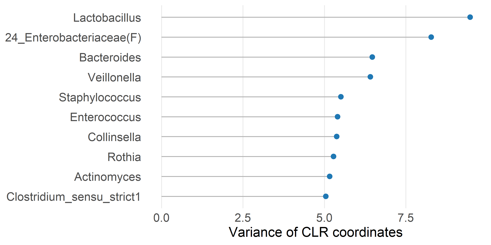
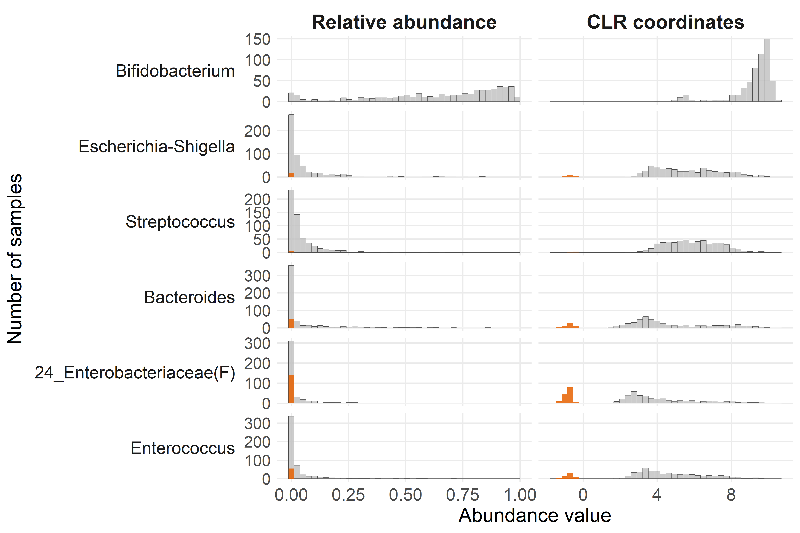
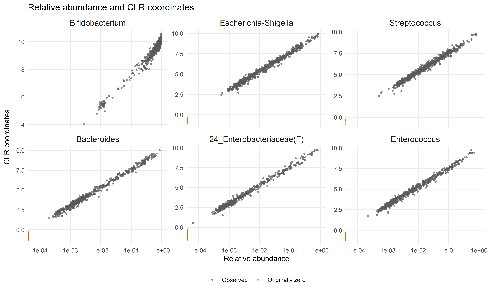

Exploratory taxon-level analysis
================
Compiled at 2026-06-15 13:00:33 UTC

## Set global parameters

## Load data

### Phyloseq object on genus level

    ## phyloseq-class experiment-level object
    ## otu_table()   OTU Table:         [ 117 taxa and 592 samples ]
    ## sample_data() Sample Data:       [ 592 samples by 9 sample variables ]
    ## tax_table()   Taxonomy Table:    [ 117 taxa by 7 taxonomic ranks ]

## Helper functions

The exploratory analyses use the filtered genus-level object that is
also used for differential abundance and differential distribution
analyses. Relative abundances are used for compositional summaries,
while multiplicative zero replacement followed by CLR transformation is
used for transformed-abundance visualizations.

## Prepare matrices

    ## # A tibble: 1 × 12
    ##   n_samples n_taxa min_library_size median_library_size max_library_size zero_fraction detection_limit
    ##       <int>  <int>            <dbl>               <dbl>            <dbl>         <dbl>           <dbl>
    ## 1       592    117             1456              21898.            69556         0.796       0.0000288
    ## # ℹ 5 more variables: replacement_value <dbl>, replacement_fraction <dbl>, n_non_ebf <int>, n_ebf <int>,
    ## #   n_excluded_from_ebf_comparison <int>

## Taxon summaries

    ## # A tibble: 117 × 17
    ##    taxon_id                  taxon      total_count prevalence mean_relative_abunda…¹ median_relative_abun…²
    ##    <chr>                     <chr>            <dbl>      <dbl>                  <dbl>                  <dbl>
    ##  1 Bifidobacterium           Bifidobac…     8417119      1                     0.639                0.721   
    ##  2 Escherichia-Shigella      Escherich…      790539      0.973                 0.0594               0.0104  
    ##  3 Streptococcus             Streptoco…      597247      0.993                 0.0495               0.0175  
    ##  4 Bacteroides               Bacteroid…      640951      0.905                 0.0456               0.00191 
    ##  5 24_Enterobacteriaceae(F)  24_Entero…      395293      0.738                 0.0294               0.000954
    ##  6 Enterococcus              Enterococ…      350643      0.902                 0.0280               0.00292 
    ##  7 [Ruminococcus]_gnavugroup [Ruminoco…      318542      0.976                 0.0231               0.00272 
    ##  8 Blautia                   Blautia         250905      0.992                 0.0205               0.00476 
    ##  9 Collinsella               Collinsel…      178149      0.850                 0.0134               0.000750
    ## 10 Lactobacillus             Lactobaci…      167883      0.542                 0.0129               0.000266
    ## # ℹ 107 more rows
    ## # ℹ abbreviated names: ¹​mean_relative_abundance, ²​median_relative_abundance
    ## # ℹ 11 more variables: max_relative_abundance <dbl>, mean_clr <dbl>, median_clr <dbl>, clr_variance <dbl>,
    ## #   Kingdom <chr>, Phylum <chr>, Class <chr>, Order <chr>, Family <chr>, Genus <chr>, Species <chr>

## Prevalence and abundance

<!-- -->

<!-- -->

<!-- -->

<!-- -->

**Most variable genera after CLR transformation**

<!-- -->

## Dominant taxonomic composition

    ## # A tibble: 27 × 3
    ##    EBF_group taxon                     mean_relative_abundance
    ##    <fct>     <fct>                                       <dbl>
    ##  1 non-EBF   Bifidobacterium                            0.560 
    ##  2 non-EBF   Escherichia-Shigella                       0.0392
    ##  3 non-EBF   Streptococcus                              0.0810
    ##  4 non-EBF   Bacteroides                                0.0260
    ##  5 non-EBF   24_Enterobacteriaceae(F)                   0.0236
    ##  6 non-EBF   Enterococcus                               0.0568
    ##  7 non-EBF   [Ruminococcus]_gnavugroup                  0.0411
    ##  8 non-EBF   Blautia                                    0.0347
    ##  9 non-EBF   Other                                      0.137 
    ## 10 EBF       Bifidobacterium                            0.687 
    ## # ℹ 17 more rows

<!-- -->

## CLR coordinatess

<!-- -->

<!-- -->

## Selected taxon distributions

    ## # A tibble: 3,324 × 5
    ##    SampleID EBF_group taxon_id                 clr_abundance taxon                   
    ##    <chr>    <fct>     <chr>                            <dbl> <fct>                   
    ##  1 s025647  non-EBF   Bifidobacterium                   8.10 Bifidobacterium         
    ##  2 s025647  non-EBF   Escherichia-Shigella              3.14 Escherichia-Shigella    
    ##  3 s025647  non-EBF   Streptococcus                     4.53 Streptococcus           
    ##  4 s025647  non-EBF   Bacteroides                       2.91 Bacteroides             
    ##  5 s025647  non-EBF   24_Enterobacteriaceae(F)         -1.54 24_Enterobacteriaceae(F)
    ##  6 s025647  non-EBF   Enterococcus                      5.38 Enterococcus            
    ##  7 s023779  non-EBF   Bifidobacterium                   9.74 Bifidobacterium         
    ##  8 s023779  non-EBF   Escherichia-Shigella              5.09 Escherichia-Shigella    
    ##  9 s023779  non-EBF   Streptococcus                     5.09 Streptococcus           
    ## 10 s023779  non-EBF   Bacteroides                       4.34 Bacteroides             
    ## # ℹ 3,314 more rows

**Distributional change from relative to CLR coordinates**

<!-- -->

    ## Scale for x is already present.
    ## Adding another scale for x, which will replace the existing scale.

<!-- -->

<!-- -->

<!-- -->

<!-- -->

<!-- -->

## Files written

These files have been written to the target directory,
`data/07_exploration`:

    ## # A tibble: 5 × 4
    ##   path                                  type         size modification_time  
    ##   <fs::path>                            <fct> <fs::bytes> <dttm>             
    ## 1 exploration_preprocessed_objects.rds  file       557.8K 2026-06-15 13:00:35
    ## 2 exploration_summary.csv               file          291 2026-06-15 13:00:35
    ## 3 exploration_top_taxa_table.tex        file        1.54K 2026-06-15 13:00:36
    ## 4 selected_taxa_prevalence_by_group.csv file        1.06K 2026-06-15 13:00:59
    ## 5 taxon_level_summary.csv               file       28.64K 2026-06-15 13:00:36
