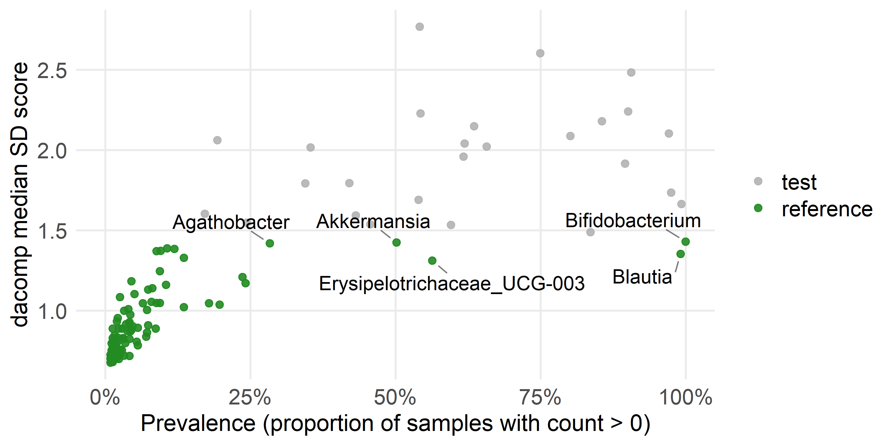
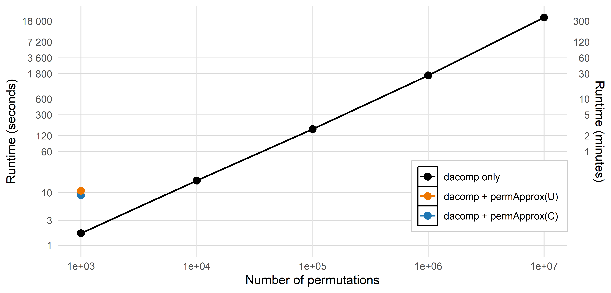
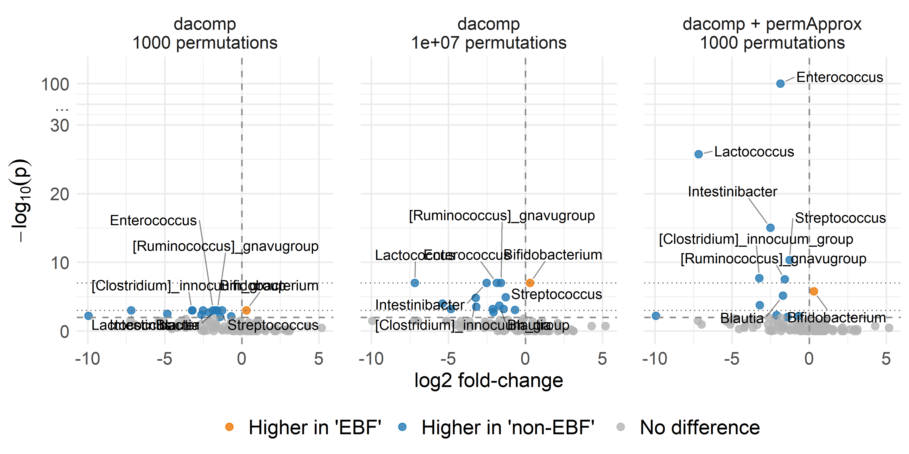
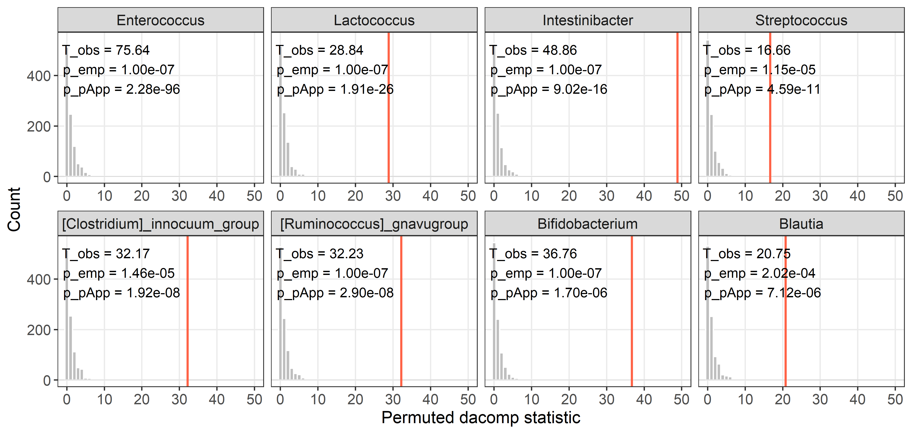
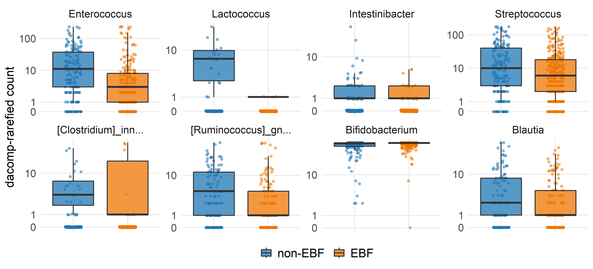
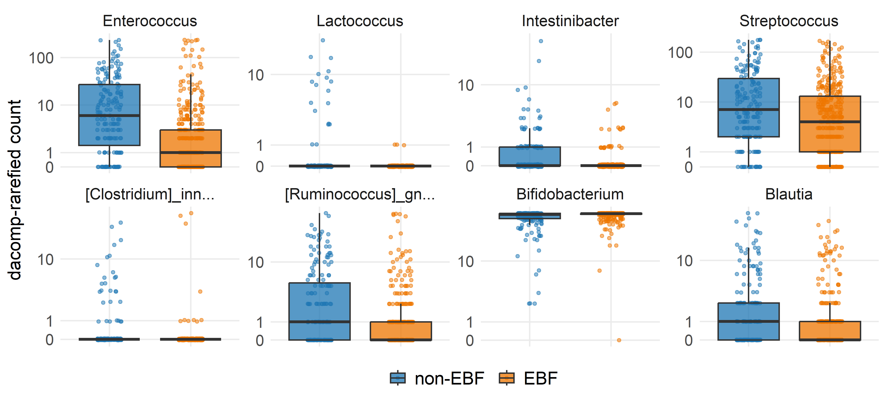

Differential abundance analysis
================
Compiled at 2026-07-06 19:29:09 UTC

``` r
here::i_am(paste0(params$name, ".Rmd"), uuid = "8400abc1-adab-467f-99ae-0f1d4d512bda")
```

## Set global parameters

## Load data

### Phyloseq object on genus level

    ## phyloseq-class experiment-level object
    ## otu_table()   OTU Table:         [ 117 taxa and 592 samples ]
    ## sample_data() Sample Data:       [ 592 samples by 9 sample variables ]
    ## tax_table()   Taxonomy Table:    [ 117 taxa by 7 taxonomic ranks ]

## Helper functions

Counts are transformed to relative abundances, zeros are replaced by
multiplicative replacement, and the CLR transformation is applied after
replacement. The dacomp test itself uses raw counts, as recommended by
dacomp, but the relative-abundance and CLR objects are stored to keep
the preprocessing consistent with the other analyses in this chapter.
The shared preprocessing helpers are defined in `functions.R`.

## Prepare relative abundance and CLR matrices

    ## Warning in zCompositions::multRepl(rel_abund_mat, label = 0, dl = detection_limit_mat, : Column no. 1 containing >90% zeros/unobserved values found (see arguments z.warning and z.delete. Check out with zPatterns()).
    ## Column no. 3 containing >90% zeros/unobserved values found (see arguments z.warning and z.delete. Check out with zPatterns()).
    ## Column no. 5 containing >90% zeros/unobserved values found (see arguments z.warning and z.delete. Check out with zPatterns()).
    ## Column no. 6 containing >90% zeros/unobserved values found (see arguments z.warning and z.delete. Check out with zPatterns()).
    ## Column no. 7 containing >90% zeros/unobserved values found (see arguments z.warning and z.delete. Check out with zPatterns()).
    ## Column no. 12 containing >90% zeros/unobserved values found (see arguments z.warning and z.delete. Check out with zPatterns()).
    ## Column no. 13 containing >90% zeros/unobserved values found (see arguments z.warning and z.delete. Check out with zPatterns()).
    ## Column no. 15 containing >90% zeros/unobserved values found (see arguments z.warning and z.delete. Check out with zPatterns()).
    ## Column no. 17 containing >90% zeros/unobserved values found (see arguments z.warning and z.delete. Check out with zPatterns()).
    ## Column no. 18 containing >90% zeros/unobserved values found (see arguments z.warning and z.delete. Check out with zPatterns()).
    ## Column no. 19 containing >90% zeros/unobserved values found (see arguments z.warning and z.delete. Check out with zPatterns()).
    ## Column no. 20 containing >90% zeros/unobserved values found (see arguments z.warning and z.delete. Check out with zPatterns()).
    ## Column no. 22 containing >90% zeros/unobserved values found (see arguments z.warning and z.delete. Check out with zPatterns()).
    ## Column no. 23 containing >90% zeros/unobserved values found (see arguments z.warning and z.delete. Check out with zPatterns()).
    ## Column no. 25 containing >90% zeros/unobserved values found (see arguments z.warning and z.delete. Check out with zPatterns()).
    ## Column no. 26 containing >90% zeros/unobserved values found (see arguments z.warning and z.delete. Check out with zPatterns()).
    ## Column no. 27 containing >90% zeros/unobserved values found (see arguments z.warning and z.delete. Check out with zPatterns()).
    ## Column no. 28 containing >90% zeros/unobserved values found (see arguments z.warning and z.delete. Check out with zPatterns()).
    ## Column no. 30 containing >90% zeros/unobserved values found (see arguments z.warning and z.delete. Check out with zPatterns()).
    ## Column no. 33 containing >90% zeros/unobserved values found (see arguments z.warning and z.delete. Check out with zPatterns()).
    ## Column no. 34 containing >90% zeros/unobserved values found (see arguments z.warning and z.delete. Check out with zPatterns()).
    ## Column no. 35 containing >90% zeros/unobserved values found (see arguments z.warning and z.delete. Check out with zPatterns()).
    ## Column no. 36 containing >90% zeros/unobserved values found (see arguments z.warning and z.delete. Check out with zPatterns()).
    ## Column no. 37 containing >90% zeros/unobserved values found (see arguments z.warning and z.delete. Check out with zPatterns()).
    ## Column no. 38 containing >90% zeros/unobserved values found (see arguments z.warning and z.delete. Check out with zPatterns()).
    ## Column no. 39 containing >90% zeros/unobserved values found (see arguments z.warning and z.delete. Check out with zPatterns()).
    ## Column no. 40 containing >90% zeros/unobserved values found (see arguments z.warning and z.delete. Check out with zPatterns()).
    ## Column no. 42 containing >90% zeros/unobserved values found (see arguments z.warning and z.delete. Check out with zPatterns()).
    ## Column no. 43 containing >90% zeros/unobserved values found (see arguments z.warning and z.delete. Check out with zPatterns()).
    ## Column no. 44 containing >90% zeros/unobserved values found (see arguments z.warning and z.delete. Check out with zPatterns()).
    ## Column no. 45 containing >90% zeros/unobserved values found (see arguments z.warning and z.delete. Check out with zPatterns()).
    ## Column no. 46 containing >90% zeros/unobserved values found (see arguments z.warning and z.delete. Check out with zPatterns()).
    ## Column no. 48 containing >90% zeros/unobserved values found (see arguments z.warning and z.delete. Check out with zPatterns()).
    ## Column no. 50 containing >90% zeros/unobserved values found (see arguments z.warning and z.delete. Check out with zPatterns()).
    ## Column no. 51 containing >90% zeros/unobserved values found (see arguments z.warning and z.delete. Check out with zPatterns()).
    ## Column no. 54 containing >90% zeros/unobserved values found (see arguments z.warning and z.delete. Check out with zPatterns()).
    ## Column no. 55 containing >90% zeros/unobserved values found (see arguments z.warning and z.delete. Check out with zPatterns()).
    ## Column no. 58 containing >90% zeros/unobserved values found (see arguments z.warning and z.delete. Check out with zPatterns()).
    ## Column no. 59 containing >90% zeros/unobserved values found (see arguments z.warning and z.delete. Check out with zPatterns()).
    ## Column no. 60 containing >90% zeros/unobserved values found (see arguments z.warning and z.delete. Check out with zPatterns()).
    ## Column no. 61 containing >90% zeros/unobserved values found (see arguments z.warning and z.delete. Check out with zPatterns()).
    ## Column no. 64 containing >90% zeros/unobserved values found (see arguments z.warning and z.delete. Check out with zPatterns()).
    ## Column no. 66 containing >90% zeros/unobserved values found (see arguments z.warning and z.delete. Check out with zPatterns()).
    ## Column no. 67 containing >90% zeros/unobserved values found (see arguments z.warning and z.delete. Check out with zPatterns()).
    ## Column no. 69 containing >90% zeros/unobserved values found (see arguments z.warning and z.delete. Check out with zPatterns()).
    ## Column no. 70 containing >90% zeros/unobserved values found (see arguments z.warning and z.delete. Check out with zPatterns()).
    ## Column no. 71 containing >90% zeros/unobserved values found (see arguments z.warning and z.delete. Check out with zPatterns()).
    ## Column no. 72 containing >90% zeros/unobserved values found (see arguments z.warning and z.delete. Check out with zPatterns()).
    ## Column no. 73 containing >90% zeros/unobserved values found (see arguments z.warning and z.delete. Check out with zPatterns()).
    ## Column no. 74 containing >90% zeros/unobserved values found (see arguments z.warning and z.delete. Check out with zPatterns()).
    ## Column no. 76 containing >90% zeros/unobserved values found (see arguments z.warning and z.delete. Check out with zPatterns()).
    ## Column no. 77 containing >90% zeros/unobserved values found (see arguments z.warning and z.delete. Check out with zPatterns()).
    ## Column no. 78 containing >90% zeros/unobserved values found (see arguments z.warning and z.delete. Check out with zPatterns()).
    ## Column no. 81 containing >90% zeros/unobserved values found (see arguments z.warning and z.delete. Check out with zPatterns()).
    ## Column no. 84 containing >90% zeros/unobserved values found (see arguments z.warning and z.delete. Check out with zPatterns()).
    ## Column no. 85 containing >90% zeros/unobserved values found (see arguments z.warning and z.delete. Check out with zPatterns()).
    ## Column no. 86 containing >90% zeros/unobserved values found (see arguments z.warning and z.delete. Check out with zPatterns()).
    ## Column no. 87 containing >90% zeros/unobserved values found (see arguments z.warning and z.delete. Check out with zPatterns()).
    ## Column no. 88 containing >90% zeros/unobserved values found (see arguments z.warning and z.delete. Check out with zPatterns()).
    ## Column no. 90 containing >90% zeros/unobserved values found (see arguments z.warning and z.delete. Check out with zPatterns()).
    ## Column no. 91 containing >90% zeros/unobserved values found (see arguments z.warning and z.delete. Check out with zPatterns()).
    ## Column no. 92 containing >90% zeros/unobserved values found (see arguments z.warning and z.delete. Check out with zPatterns()).
    ## Column no. 93 containing >90% zeros/unobserved values found (see arguments z.warning and z.delete. Check out with zPatterns()).
    ## Column no. 94 containing >90% zeros/unobserved values found (see arguments z.warning and z.delete. Check out with zPatterns()).
    ## Col

    ## Warning in zCompositions::multRepl(rel_abund_mat, label = 0, dl = detection_limit_mat, : Row no. 80 containing >90% zeros/unobserved values found (see arguments z.warning and z.delete. Check out with zPatterns()).
    ## Row no. 102 containing >90% zeros/unobserved values found (see arguments z.warning and z.delete. Check out with zPatterns()).
    ## Row no. 112 containing >90% zeros/unobserved values found (see arguments z.warning and z.delete. Check out with zPatterns()).
    ## Row no. 145 containing >90% zeros/unobserved values found (see arguments z.warning and z.delete. Check out with zPatterns()).
    ## Row no. 147 containing >90% zeros/unobserved values found (see arguments z.warning and z.delete. Check out with zPatterns()).
    ## Row no. 157 containing >90% zeros/unobserved values found (see arguments z.warning and z.delete. Check out with zPatterns()).
    ## Row no. 164 containing >90% zeros/unobserved values found (see arguments z.warning and z.delete. Check out with zPatterns()).
    ## Row no. 265 containing >90% zeros/unobserved values found (see arguments z.warning and z.delete. Check out with zPatterns()).
    ## Row no. 366 containing >90% zeros/unobserved values found (see arguments z.warning and z.delete. Check out with zPatterns()).
    ## Row no. 368 containing >90% zeros/unobserved values found (see arguments z.warning and z.delete. Check out with zPatterns()).
    ## Row no. 397 containing >90% zeros/unobserved values found (see arguments z.warning and z.delete. Check out with zPatterns()).
    ## Row no. 399 containing >90% zeros/unobserved values found (see arguments z.warning and z.delete. Check out with zPatterns()).
    ## Row no. 403 containing >90% zeros/unobserved values found (see arguments z.warning and z.delete. Check out with zPatterns()).
    ## Row no. 410 containing >90% zeros/unobserved values found (see arguments z.warning and z.delete. Check out with zPatterns()).
    ## Row no. 416 containing >90% zeros/unobserved values found (see arguments z.warning and z.delete. Check out with zPatterns()).
    ## Row no. 436 containing >90% zeros/unobserved values found (see arguments z.warning and z.delete. Check out with zPatterns()).
    ## Row no. 471 containing >90% zeros/unobserved values found (see arguments z.warning and z.delete. Check out with zPatterns()).
    ## Row no. 480 containing >90% zeros/unobserved values found (see arguments z.warning and z.delete. Check out with zPatterns()).
    ## Row no. 533 containing >90% zeros/unobserved values found (see arguments z.warning and z.delete. Check out with zPatterns()).
    ## Row no. 551 containing >90% zeros/unobserved values found (see arguments z.warning and z.delete. Check out with zPatterns()).

    ## # A tibble: 1 × 9
    ##   n_samples n_taxa min_library_size median_library_size max_library_size zero_fraction detection_limit replacement_value replacement_fraction
    ##       <int>  <int>            <dbl>               <dbl>            <dbl>         <dbl>           <dbl>             <dbl>                <dbl>
    ## 1       592    117             1456              21898.            69556         0.796       0.0000288         0.0000187                 0.65

## Differential abundance setup

The differential abundance analysis compares children with no exclusive
breastfeeding (`EBF duration == "0 months"`) to children exclusively
breastfed for at least two months (`EBF duration == ">=2 months"`).
Samples in the sparse `1 month` category and samples with missing EBF
duration are excluded from this two-group comparison.

    ##   EBF_group n_samples
    ## 1   non-EBF       179
    ## 2       EBF       375

    ## # A tibble: 1 × 6
    ##   n_samples n_taxa n_non_ebf n_ebf excluded_ebf_one_month excluded_missing_ebf
    ##       <int>  <int>     <int> <int>                  <int>                <int>
    ## 1       554    117       179   375                      3                   35

## dacomp reference selection

    ## # A tibble: 1 × 4
    ##   n_taxa n_reference_taxa n_test_taxa minimal_TA
    ##    <int>            <int>       <int>      <dbl>
    ## 1    117               91          26         50

### Reference score diagnostic

    ## # A tibble: 117 × 4
    ##    taxon                 prevalence score reference_status
    ##    <chr>                      <dbl> <dbl> <fct>           
    ##  1 Phascolarctobacterium    0.0217  0.807 reference       
    ##  2 Veillonella              0.543   2.23  test            
    ##  3 Negativicoccus           0.0469  0.903 reference       
    ##  4 Dialister                0.197   1.04  reference       
    ##  5 Megasphaera              0.0289  0.887 reference       
    ##  6 Anaeroglobus             0.0108  0.726 reference       
    ##  7 Megamonas                0.00903 0.699 reference       
    ##  8 Streptococcus            0.993   1.66  test            
    ##  9 Lactococcus              0.244   1.55  test            
    ## 10 Gemella                  0.431   1.59  test            
    ## # ℹ 107 more rows

<!-- -->

## dacomp permutation tests

The following chunk runs the long dacomp permutation analyses. Each
permutation count is cached in a separate result file and runtime file.
If the result file already exists, the corresponding run is skipped
unless `refit_dacomp` is set to `TRUE`.

    ## Skipping cached dacomp run: n_perm = 1e+03 | seed = 42 
    ## Skipping cached dacomp run: n_perm = 1e+04 | seed = 42 
    ## Skipping cached dacomp run: n_perm = 1e+05 | seed = 42 
    ## Skipping cached dacomp run: n_perm = 1e+06 | seed = 42 
    ## Skipping cached dacomp run: n_perm = 1e+07 | seed = 42

    ## # A tibble: 5 × 4
    ##     n_perm elapsed_sec  seed result_file                       
    ##      <dbl>       <dbl> <dbl> <chr>                             
    ## 1     1000        1.69    42 dacomp_res_nperm=1e+03_seed=42.rds
    ## 2    10000       16.9     42 dacomp_res_nperm=1e+04_seed=42.rds
    ## 3   100000      160.      42 dacomp_res_nperm=1e+05_seed=42.rds
    ## 4  1000000     1676.      42 dacomp_res_nperm=1e+06_seed=42.rds
    ## 5 10000000    20964.      42 dacomp_res_nperm=1e+07_seed=42.rds

## Runtime preparation

The dacomp runtime rows are initialized here from the cached dacomp
runs. The final runtime comparison table and figure are created after
the permApprox runtime has been added.

    ## # A tibble: 5 × 6
    ##     n_perm  seed result_file                        stats_file                           result_exists stats_exists
    ##      <dbl> <dbl> <chr>                              <chr>                                <lgl>         <lgl>       
    ## 1     1000    42 dacomp_res_nperm=1e+03_seed=42.rds dacomp_stats_nperm=1e+03_seed=42.rds TRUE          FALSE       
    ## 2    10000    42 dacomp_res_nperm=1e+04_seed=42.rds dacomp_stats_nperm=1e+04_seed=42.rds TRUE          FALSE       
    ## 3   100000    42 dacomp_res_nperm=1e+05_seed=42.rds dacomp_stats_nperm=1e+05_seed=42.rds TRUE          FALSE       
    ## 4  1000000    42 dacomp_res_nperm=1e+06_seed=42.rds dacomp_stats_nperm=1e+06_seed=42.rds TRUE          FALSE       
    ## 5 10000000    42 dacomp_res_nperm=1e+07_seed=42.rds dacomp_stats_nperm=1e+07_seed=42.rds TRUE          FALSE

## p-value refinement with permApprox

The dacomp result with 1000 permutations is used as the empirical
permutation sample for the GPD tail approximation. We fit both the
unconstrained `permApprox(U)` variant and the constrained
`permApprox(C)` variant. The main comparison and volcano plot use the
constrained variant. Since dacomp’s permutation statistics are
non-negative test statistics and large values are more extreme, the GPD
tail approximation is fitted to the right tail.

    ## Skipping cached permApprox fit: permapprox_nperm=1e+03_constraint=unconstrained_exceed0=250_alternative=greater_seed=42.rds

    ## Summary of permApprox result
    ## ----------------------------
    ## Number of tests             : 117
    ## Approximation method        : GPD tail approximation
    ## Approximation threshold     : p-values < 0.1
    ## Multiple testing adjustment : BH
    ## 
    ## Fit status counts:
    ##   Successful fits          : 25
    ##   GOF rejections           : 0
    ##   Fit failed               : 0
    ##   No threshold found       : 0
    ##   Discrete distributions   : 5
    ##   Not selected for fitting : 73
    ## 
    ## GPD parameter summary (successful fits)
    ## --------------------------------------
    ##   shape:
    ##     min = -0.249, median = 0.0659, mean = 0.17, max = 1.23
    ##   scale:
    ##     min = 0.271, median = 1.43, mean =  1.4, max = 2.77
    ##   n_exceed:
    ##     min =  230, median =  250, mean =  248, max =  250
    ## 
    ## P-value summary
    ## ---------------
    ## Empirical p-values:
    ##   empirical:
    ##     min = 0.000999, median = 0.318, mean = 0.41, max =    1
    ## 
    ## Final p-values (unadjusted):
    ##   unadjusted:
    ##     min = 0, median = 0.318, mean = 0.41, max =    1
    ## 
    ## Final p-values (adjusted, BH):
    ##   adjusted:
    ##     min = 0, median = 0.608, mean = 0.568, max =    1
    ##   Rejections at alpha = 0.05: 9

    ## Skipping cached constrained permApprox fit: permapprox_nperm=1e+03_constraint=support_at_obs_exceed0=250_alternative=greater_seed=42.rds

    ## Summary of permApprox result
    ## ----------------------------
    ## Number of tests             : 117
    ## Approximation method        : GPD tail approximation
    ## Approximation threshold     : p-values < 0.1
    ## Multiple testing adjustment : BH
    ## 
    ## Fit status counts:
    ##   Successful fits          : 25
    ##   GOF rejections           : 0
    ##   Fit failed               : 0
    ##   No threshold found       : 0
    ##   Discrete distributions   : 5
    ##   Not selected for fitting : 73
    ## 
    ## GPD parameter summary (successful fits)
    ## --------------------------------------
    ##   shape:
    ##     min = -0.249, median = 0.0659, mean = 0.172, max = 1.23
    ##   scale:
    ##     min = 0.271, median = 1.43, mean = 1.39, max = 2.77
    ##   n_exceed:
    ##     min =  230, median =  250, mean =  248, max =  250
    ## 
    ## P-value summary
    ## ---------------
    ## Empirical p-values:
    ##   empirical:
    ##     min = 0.000999, median = 0.318, mean = 0.41, max =    1
    ## 
    ## Final p-values (unadjusted):
    ##   unadjusted:
    ##     min = 0.00000000000000000000000000000000000000000000000000000000000000000000000000000000000000000000000228, median = 0.318, mean = 0.41, max =    1
    ## 
    ## Final p-values (adjusted, BH):
    ##   adjusted:
    ##     min = 0.000000000000000000000000000000000000000000000000000000000000000000000000000000000000000000000234, median = 0.608, mean = 0.568, max =    1
    ##   Rejections at alpha = 0.05: 9

    ## # A tibble: 7 × 10
    ##   line                   method                 setting                 n_perm elapsed_s_total  seed result_file elapsed_s elapsed_min elapsed_h
    ##   <chr>                  <chr>                  <chr>                    <dbl>           <dbl> <dbl> <chr>           <dbl>       <dbl>     <dbl>
    ## 1 dacomp only            dacomp                 dacomp                     1e3            1.69    42 dacomp_res…      1.69        0.03     0    
    ## 2 dacomp only            dacomp                 dacomp                     1e4           16.9     42 dacomp_res…     16.9         0.28     0.005
    ## 3 dacomp only            dacomp                 dacomp                     1e5          160.      42 dacomp_res…    160.          2.67     0.045
    ## 4 dacomp only            dacomp                 dacomp                     1e6         1676.      42 dacomp_res…   1676.         27.9      0.466
    ## 5 dacomp only            dacomp                 dacomp                     1e7        20964.      42 dacomp_res…  20964.        349.       5.82 
    ## 6 dacomp + permApprox(C) dacomp + permApprox(C) support_at_obs, exceed…    1e3            8.89    42 permapprox…      8.89        0.15     0.002
    ## 7 dacomp + permApprox(U) dacomp + permApprox(U) unconstrained, exceed0…    1e3           10.8     42 permapprox…     10.8         0.18     0.003

## Runtime comparison

The runtime comparison includes the empirical dacomp runs and the
combined runtimes for the 1000-permutation dacomp run plus the
unconstrained and constrained permApprox tail approximations.

| line                   | n_perm | elapsed_s | elapsed_min | elapsed_h |
|:-----------------------|-------:|----------:|------------:|----------:|
| dacomp only            |  1e+03 |      1.69 |        0.03 |     0.000 |
| dacomp only            |  1e+04 |     16.91 |        0.28 |     0.005 |
| dacomp only            |  1e+05 |    160.33 |        2.67 |     0.045 |
| dacomp only            |  1e+06 |   1675.86 |       27.93 |     0.466 |
| dacomp only            |  1e+07 |  20963.69 |      349.39 |     5.823 |
| dacomp + permApprox(C) |  1e+03 |      8.89 |        0.15 |     0.002 |
| dacomp + permApprox(U) |  1e+03 |     10.83 |        0.18 |     0.003 |

    ## # A tibble: 7 × 10
    ##   line                   method                 setting                 n_perm elapsed_s_total  seed result_file elapsed_s elapsed_min elapsed_h
    ##   <fct>                  <chr>                  <chr>                    <dbl>           <dbl> <dbl> <chr>           <dbl>       <dbl>     <dbl>
    ## 1 dacomp only            dacomp                 dacomp                     1e3            1.69    42 dacomp_res…      1.69        0.03     0    
    ## 2 dacomp only            dacomp                 dacomp                     1e4           16.9     42 dacomp_res…     16.9         0.28     0.005
    ## 3 dacomp only            dacomp                 dacomp                     1e5          160.      42 dacomp_res…    160.          2.67     0.045
    ## 4 dacomp only            dacomp                 dacomp                     1e6         1676.      42 dacomp_res…   1676.         27.9      0.466
    ## 5 dacomp only            dacomp                 dacomp                     1e7        20964.      42 dacomp_res…  20964.        349.       5.82 
    ## 6 dacomp + permApprox(C) dacomp + permApprox(C) support_at_obs, exceed…    1e3            8.89    42 permapprox…      8.89        0.15     0.002
    ## 7 dacomp + permApprox(U) dacomp + permApprox(U) unconstrained, exceed0…    1e3           10.8     42 permapprox…     10.8         0.18     0.003

    ## Warning: The `trans` argument of `sec_axis()` is deprecated as of ggplot2 3.5.0.
    ## ℹ Please use the `transform` argument instead.
    ## This warning is displayed once per session.
    ## Call `lifecycle::last_lifecycle_warnings()` to see where this warning was generated.

<!-- -->

## Differential abundance results

    ## # A tibble: 117 × 10
    ##    taxon_id           mean_rel_non_ebf mean_rel_ebf mean_clr_non_ebf mean_clr_ebf log2_fc clr_difference prevalence_non_ebf prevalence_ebf taxon
    ##    <chr>                         <dbl>        <dbl>            <dbl>        <dbl>   <dbl>          <dbl>              <dbl>          <dbl> <chr>
    ##  1 Phascolarctobacte…       0.000165    0.0000261             -0.904       -0.855  -2.61          0.0493             0.0223         0.0213 Phas…
    ##  2 Veillonella              0.00496     0.00423                1.85         1.31   -0.229        -0.541              0.620          0.507  Veil…
    ##  3 Negativicoccus           0.000115    0.0000477             -0.810       -0.780  -1.25          0.0309             0.0503         0.0453 Nega…
    ##  4 Dialister                0.0000800   0.0000530             -0.517       -0.446  -0.585         0.0714             0.190          0.2    Dial…
    ##  5 Megasphaera              0.0000359   0.000284              -0.869       -0.825   2.95          0.0441             0.0447         0.0213 Mega…
    ##  6 Anaeroglobus             0.0000223   0.00000560            -0.964       -0.894  -1.82          0.0698             0.0168         0.008  Anae…
    ##  7 Megamonas                0.00000938  0.000000895           -0.984       -0.906  -2.45          0.0780             0.0112         0.008  Mega…
    ##  8 Streptococcus            0.0810      0.0334                 6.31         5.67   -1.28         -0.640              1              0.989  Stre…
    ##  9 Lactococcus              0.00802     0.0000543              0.429       -0.529  -7.18         -0.957              0.374          0.181  Lact…
    ## 10 Gemella                  0.000881    0.000475               0.497        0.516  -0.892         0.0196             0.447          0.424  Geme…
    ## # ℹ 107 more rows

    ## # A tibble: 7 × 5
    ##   method       n_perm constraint     exceed0     n
    ##   <chr>         <dbl> <chr>            <dbl> <int>
    ## 1 dacomp         1000 <NA>                NA   117
    ## 2 dacomp        10000 <NA>                NA   117
    ## 3 dacomp       100000 <NA>                NA   117
    ## 4 dacomp      1000000 <NA>                NA   117
    ## 5 dacomp     10000000 <NA>                NA   117
    ## 6 permApprox     1000 support_at_obs     250   117
    ## 7 permApprox     1000 unconstrained      250   117

## P-value tables for significant taxa

The following tables collect the taxa that are significant in at least
one of the selected dacomp or constrained permApprox analyses. Both
unadjusted and adjusted p-values are shown because the volcano plot is
based on unadjusted p-values, while the adjusted p-values give the
multiple-testing corrected view of the same taxa.

### Unadjusted p-values

| taxon | statistic | dacomp (1e+03) | dacomp (1e+06) | dacomp (1e+07) | dacomp + permApprox(C) (1e+03) |
|:---|---:|:---|:---|:---|:---|
| Streptococcus | 16.66 | 9.99e-04\* | 5.00e-06\* | 1.15e-05\* | 4.59e-11\* |
| Lactococcus | 28.84 | 9.99e-04\* | 1.00e-06\* | 1.00e-07\* | 1.91e-26\* |
| Enterococcus | 75.64 | 9.99e-04\* | 1.00e-06\* | 1.00e-07\* | 2.28e-96\* |
| Terrisporobacter | 20.92 | 9.99e-04\* | 1.79e-02 | 2.94e-04\* | 1.71e-04\* |
| Intestinibacter | 48.86 | 9.99e-04\* | 1.00e-06\* | 1.00e-07\* | 9.02e-16\* |
| \[Clostridium\]\_innocuum_group | 32.17 | 9.99e-04\* | 5.00e-06\* | 1.46e-05\* | 1.92e-08\* |
| Bifidobacterium | 36.76 | 9.99e-04\* | 1.00e-06\* | 1.00e-07\* | 1.70e-06\* |
| \[Ruminococcus\]\_gnavugroup | 32.23 | 9.99e-04\* | 1.00e-06\* | 1.00e-07\* | 2.90e-08\* |
| Blautia | 20.75 | 9.99e-04\* | 8.20e-05\* | 2.02e-04\* | 7.12e-06\* |
| uncultured18 | 13.31 | 2.00e-03\* | 5.70e-04\* | 6.34e-04\* | 4.91e-03\* |
| \[Ruminococcus\]\_torquegroup | 8.52 | 3.00e-03\* | 5.70e-03\* | 6.20e-04\* | 1.50e-02 |
| Roseburia | 11.31 | 4.00e-03\* | 1.01e-01 | 3.97e-02 | 1.02e-02 |
| Coprobacillus | 8.43 | 5.99e-03\* | 3.32e-03\* | 3.34e-02 | 5.99e-03\* |
| Clostridium_sensu_strict1 | 8.04 | 6.99e-03\* | 9.98e-03\* | 8.31e-04\* | 6.39e-03\* |
| Collinsella | 6.42 | 8.99e-03\* | 2.26e-02 | 5.94e-04\* | 8.95e-03\* |
| Erysipelatoclostridium | 4.78 | 3.30e-02 | 7.84e-03\* | 1.55e-02 | 2.71e-02 |
| Tyzzerella | 4.47 | 3.30e-02 | 3.24e-04\* | 9.96e-05\* | 4.08e-02 |
| Sellimonas | 3.58 | 4.80e-02 | 3.93e-03\* | 1.78e-03\* | 3.63e-02 |
| Akkermansia | 3.44 | 5.59e-02 | 5.28e-03\* | 1.06e-01 | 5.93e-02 |

Unadjusted p-values for taxa significant in at least one selected
differential abundance analysis. Asterisks mark p \< 0.01.

### Adjusted p-values

| taxon | statistic | dacomp (1e+03) | dacomp (1e+06) | dacomp (1e+07) | dacomp + permApprox(C) (1e+03) |
|:---|---:|:---|:---|:---|:---|
| Streptococcus | 16.66 | 6.77e-03\* | 3.30e-05\* | 1.02e-04\* | 1.18e-09\* |
| Lactococcus | 28.84 | 6.77e-03\* | 8.80e-06\* | 9.80e-07\* | 9.85e-25\* |
| Enterococcus | 75.64 | 6.77e-03\* | 8.80e-06\* | 9.80e-07\* | 2.34e-94\* |
| Terrisporobacter | 20.92 | 6.77e-03\* | 6.32e-02 | 1.68e-03\* | 1.96e-03\* |
| Intestinibacter | 48.86 | 6.77e-03\* | 8.80e-06\* | 9.80e-07\* | 3.10e-14\* |
| \[Clostridium\]\_innocuum_group | 32.17 | 6.77e-03\* | 3.30e-05\* | 1.09e-04\* | 3.95e-07\* |
| Bifidobacterium | 36.76 | 6.77e-03\* | 8.80e-06\* | 9.80e-07\* | 2.50e-05\* |
| \[Ruminococcus\]\_gnavugroup | 32.23 | 6.77e-03\* | 8.80e-06\* | 9.80e-07\* | 4.97e-07\* |
| Blautia | 20.75 | 6.77e-03\* | 5.23e-04\* | 1.29e-03\* | 9.17e-05\* |
| uncultured18 | 13.31 | 1.28e-02 | 3.19e-03\* | 2.97e-03\* | 5.06e-02 |
| \[Ruminococcus\]\_torquegroup | 8.52 | 1.82e-02 | 2.72e-02 | 2.97e-03\* | 9.64e-02 |
| Clostridium_sensu_strict1 | 8.04 | 3.40e-02 | 3.83e-02 | 3.53e-03\* | 5.48e-02 |
| Collinsella | 6.42 | 4.14e-02 | 7.26e-02 | 2.97e-03\* | 7.09e-02 |
| Tyzzerella | 4.47 | 1.25e-01 | 1.88e-03\* | 6.80e-04\* | 1.75e-01 |
| Sellimonas | 3.58 | 1.53e-01 | 2.11e-02 | 7.76e-03\* | 1.62e-01 |

Adjusted p-values for taxa significant in at least one selected
differential abundance analysis. Asterisks mark adjusted p \< 0.01.

| method | taxon | log2_fc | mean_rel_non_ebf | mean_rel_ebf | p_raw | p_adj |
|:---|:---|---:|---:|---:|:---|:---|
| dacomp + permApprox(U) (1e+03) | Lactococcus | -7.18 | 0.008020 | 5.43e-05 | 0.00e+00 | 0.00e+00 |
| dacomp + permApprox(U) (1e+03) | Enterococcus | -1.86 | 0.056800 | 1.56e-02 | 0.00e+00 | 0.00e+00 |
| dacomp + permApprox(C) (1e+03) | Enterococcus | -1.86 | 0.056800 | 1.56e-02 | 2.28e-96 | 2.34e-94 |
| dacomp + permApprox(C) (1e+03) | Lactococcus | -7.18 | 0.008020 | 5.43e-05 | 1.91e-26 | 9.85e-25 |
| dacomp + permApprox(C) (1e+03) | Intestinibacter | -2.52 | 0.005930 | 1.03e-03 | 9.02e-16 | 3.10e-14 |
| dacomp + permApprox(U) (1e+03) | Intestinibacter | -2.52 | 0.005930 | 1.03e-03 | 9.02e-16 | 3.10e-14 |
| dacomp + permApprox(C) (1e+03) | Streptococcus | -1.28 | 0.081000 | 3.34e-02 | 4.59e-11 | 1.18e-09 |
| dacomp + permApprox(U) (1e+03) | Streptococcus | -1.28 | 0.081000 | 3.34e-02 | 4.59e-11 | 1.18e-09 |
| dacomp + permApprox(U) (1e+03) | \[Clostridium\]\_innocuum_group | -3.23 | 0.008190 | 8.71e-04 | 1.92e-08 | 3.95e-07 |
| dacomp + permApprox(C) (1e+03) | \[Clostridium\]\_innocuum_group | -3.23 | 0.008190 | 8.71e-04 | 1.92e-08 | 3.95e-07 |
| dacomp + permApprox(U) (1e+03) | \[Ruminococcus\]\_gnavugroup | -1.59 | 0.041100 | 1.36e-02 | 2.90e-08 | 4.97e-07 |
| dacomp + permApprox(C) (1e+03) | \[Ruminococcus\]\_gnavugroup | -1.59 | 0.041100 | 1.36e-02 | 2.90e-08 | 4.97e-07 |
| dacomp (1e+07) | Lactococcus | -7.18 | 0.008020 | 5.43e-05 | 1.00e-07 | 9.80e-07 |
| dacomp (1e+07) | Intestinibacter | -2.52 | 0.005930 | 1.03e-03 | 1.00e-07 | 9.80e-07 |
| dacomp (1e+07) | Enterococcus | -1.86 | 0.056800 | 1.56e-02 | 1.00e-07 | 9.80e-07 |
| dacomp (1e+07) | \[Ruminococcus\]\_gnavugroup | -1.59 | 0.041100 | 1.36e-02 | 1.00e-07 | 9.80e-07 |
| dacomp (1e+07) | Bifidobacterium | 0.29 | 0.560000 | 6.87e-01 | 1.00e-07 | 9.80e-07 |
| dacomp (1e+06) | Lactococcus | -7.18 | 0.008020 | 5.43e-05 | 1.00e-06 | 8.80e-06 |
| dacomp (1e+06) | Intestinibacter | -2.52 | 0.005930 | 1.03e-03 | 1.00e-06 | 8.80e-06 |
| dacomp (1e+06) | Enterococcus | -1.86 | 0.056800 | 1.56e-02 | 1.00e-06 | 8.80e-06 |
| dacomp (1e+06) | \[Ruminococcus\]\_gnavugroup | -1.59 | 0.041100 | 1.36e-02 | 1.00e-06 | 8.80e-06 |
| dacomp (1e+06) | Bifidobacterium | 0.29 | 0.560000 | 6.87e-01 | 1.00e-06 | 8.80e-06 |
| dacomp + permApprox(C) (1e+03) | Bifidobacterium | 0.29 | 0.560000 | 6.87e-01 | 1.70e-06 | 2.50e-05 |
| dacomp + permApprox(U) (1e+03) | Bifidobacterium | 0.29 | 0.560000 | 6.87e-01 | 1.70e-06 | 2.50e-05 |
| dacomp (1e+06) | \[Clostridium\]\_innocuum_group | -3.23 | 0.008190 | 8.71e-04 | 5.00e-06 | 3.30e-05 |
| dacomp (1e+06) | Streptococcus | -1.28 | 0.081000 | 3.34e-02 | 5.00e-06 | 3.30e-05 |
| dacomp + permApprox(U) (1e+03) | Blautia | -1.70 | 0.034700 | 1.07e-02 | 7.12e-06 | 9.17e-05 |
| dacomp + permApprox(C) (1e+03) | Blautia | -1.70 | 0.034700 | 1.07e-02 | 7.12e-06 | 9.17e-05 |
| dacomp (1e+05) | Lactococcus | -7.18 | 0.008020 | 5.43e-05 | 1.00e-05 | 7.00e-05 |
| dacomp (1e+05) | \[Clostridium\]\_innocuum_group | -3.23 | 0.008190 | 8.71e-04 | 1.00e-05 | 7.00e-05 |
| dacomp (1e+05) | Intestinibacter | -2.52 | 0.005930 | 1.03e-03 | 1.00e-05 | 7.00e-05 |
| dacomp (1e+05) | Enterococcus | -1.86 | 0.056800 | 1.56e-02 | 1.00e-05 | 7.00e-05 |
| dacomp (1e+05) | Blautia | -1.70 | 0.034700 | 1.07e-02 | 1.00e-05 | 7.00e-05 |
| dacomp (1e+05) | \[Ruminococcus\]\_gnavugroup | -1.59 | 0.041100 | 1.36e-02 | 1.00e-05 | 7.00e-05 |
| dacomp (1e+05) | Bifidobacterium | 0.29 | 0.560000 | 6.87e-01 | 1.00e-05 | 7.00e-05 |
| dacomp (1e+07) | Streptococcus | -1.28 | 0.081000 | 3.34e-02 | 1.15e-05 | 1.02e-04 |
| dacomp (1e+07) | \[Clostridium\]\_innocuum_group | -3.23 | 0.008190 | 8.71e-04 | 1.46e-05 | 1.09e-04 |
| dacomp (1e+05) | Terrisporobacter | -3.20 | 0.000732 | 7.86e-05 | 3.00e-05 | 2.00e-04 |
| dacomp (1e+06) | Blautia | -1.70 | 0.034700 | 1.07e-02 | 8.20e-05 | 5.23e-04 |
| dacomp (1e+05) | Streptococcus | -1.28 | 0.081000 | 3.34e-02 | 9.00e-05 | 5.32e-04 |
| dacomp (1e+07) | Tyzzerella | -5.38 | 0.003460 | 8.21e-05 | 9.96e-05 | 6.80e-04 |
| dacomp (1e+04) | Lactococcus | -7.18 | 0.008020 | 5.43e-05 | 1.00e-04 | 7.12e-04 |
| dacomp (1e+04) | \[Clostridium\]\_innocuum_group | -3.23 | 0.008190 | 8.71e-04 | 1.00e-04 | 7.12e-04 |
| dacomp (1e+04) | Intestinibacter | -2.52 | 0.005930 | 1.03e-03 | 1.00e-04 | 7.12e-04 |
| dacomp (1e+04) | Enterococcus | -1.86 | 0.056800 | 1.56e-02 | 1.00e-04 | 7.12e-04 |
| dacomp (1e+04) | Blautia | -1.70 | 0.034700 | 1.07e-02 | 1.00e-04 | 7.12e-04 |
| dacomp (1e+04) | \[Ruminococcus\]\_gnavugroup | -1.59 | 0.041100 | 1.36e-02 | 1.00e-04 | 7.12e-04 |
| dacomp (1e+04) | Streptococcus | -1.28 | 0.081000 | 3.34e-02 | 1.00e-04 | 7.12e-04 |
| dacomp (1e+04) | Bifidobacterium | 0.29 | 0.560000 | 6.87e-01 | 1.00e-04 | 7.12e-04 |
| dacomp (1e+05) | \[Ruminococcus\]\_torquegroup | -4.84 | 0.003970 | 1.38e-04 | 1.00e-04 | 5.38e-04 |
| dacomp + permApprox(U) (1e+03) | Terrisporobacter | -3.20 | 0.000732 | 7.86e-05 | 1.71e-04 | 1.96e-03 |
| dacomp + permApprox(C) (1e+03) | Terrisporobacter | -3.20 | 0.000732 | 7.86e-05 | 1.71e-04 | 1.96e-03 |
| dacomp (1e+04) | Tyzzerella | -5.38 | 0.003460 | 8.21e-05 | 2.00e-04 | 1.27e-03 |
| dacomp (1e+07) | Blautia | -1.70 | 0.034700 | 1.07e-02 | 2.02e-04 | 1.29e-03 |
| dacomp (1e+07) | Terrisporobacter | -3.20 | 0.000732 | 7.86e-05 | 2.94e-04 | 1.68e-03 |
| dacomp (1e+04) | Collinsella | -1.41 | 0.022400 | 8.43e-03 | 3.00e-04 | 1.65e-03 |
| dacomp (1e+06) | Tyzzerella | -5.38 | 0.003460 | 8.21e-05 | 3.24e-04 | 1.88e-03 |
| dacomp (1e+06) | uncultured18 | -2.12 | 0.001560 | 3.57e-04 | 5.70e-04 | 3.19e-03 |
| dacomp (1e+07) | Collinsella | -1.41 | 0.022400 | 8.43e-03 | 5.94e-04 | 2.97e-03 |
| dacomp (1e+07) | \[Ruminococcus\]\_torquegroup | -4.84 | 0.003970 | 1.38e-04 | 6.20e-04 | 2.97e-03 |
| dacomp (1e+07) | uncultured18 | -2.12 | 0.001560 | 3.57e-04 | 6.34e-04 | 2.97e-03 |
| dacomp (1e+05) | uncultured18 | -2.12 | 0.001560 | 3.57e-04 | 6.40e-04 | 3.32e-03 |
| dacomp (1e+04) | \[Ruminococcus\]\_torquegroup | -4.84 | 0.003970 | 1.38e-04 | 7.00e-04 | 3.76e-03 |
| dacomp (1e+05) | Tyzzerella | -5.38 | 0.003460 | 8.21e-05 | 7.20e-04 | 3.46e-03 |
| dacomp (1e+07) | Clostridium_sensu_strict1 | -0.68 | 0.013000 | 8.07e-03 | 8.31e-04 | 3.53e-03 |
| dacomp (1e+03) | Lactococcus | -7.18 | 0.008020 | 5.43e-05 | 9.99e-04 | 6.77e-03 |
| dacomp (1e+03) | \[Clostridium\]\_innocuum_group | -3.23 | 0.008190 | 8.71e-04 | 9.99e-04 | 6.77e-03 |
| dacomp (1e+03) | Terrisporobacter | -3.20 | 0.000732 | 7.86e-05 | 9.99e-04 | 6.77e-03 |
| dacomp (1e+03) | Intestinibacter | -2.52 | 0.005930 | 1.03e-03 | 9.99e-04 | 6.77e-03 |
| dacomp (1e+03) | Enterococcus | -1.86 | 0.056800 | 1.56e-02 | 9.99e-04 | 6.77e-03 |
| dacomp (1e+03) | Blautia | -1.70 | 0.034700 | 1.07e-02 | 9.99e-04 | 6.77e-03 |
| dacomp (1e+03) | \[Ruminococcus\]\_gnavugroup | -1.59 | 0.041100 | 1.36e-02 | 9.99e-04 | 6.77e-03 |
| dacomp (1e+03) | Streptococcus | -1.28 | 0.081000 | 3.34e-02 | 9.99e-04 | 6.77e-03 |
| dacomp (1e+03) | Bifidobacterium | 0.29 | 0.560000 | 6.87e-01 | 9.99e-04 | 6.77e-03 |
| dacomp (1e+04) | uncultured18 | -2.12 | 0.001560 | 3.57e-04 | 1.70e-03 | 8.82e-03 |
| dacomp (1e+07) | Sellimonas | -2.08 | 0.000936 | 2.20e-04 | 1.78e-03 | 7.76e-03 |
| dacomp (1e+03) | uncultured18 | -2.12 | 0.001560 | 3.57e-04 | 2.00e-03 | 1.28e-02 |
| dacomp (1e+03) | \[Ruminococcus\]\_torquegroup | -4.84 | 0.003970 | 1.38e-04 | 3.00e-03 | 1.82e-02 |
| dacomp (1e+04) | Coprobacillus | -9.94 | 0.000983 | 0.00e+00 | 3.00e-03 | 1.45e-02 |
| dacomp (1e+05) | Sellimonas | -2.08 | 0.000936 | 2.20e-04 | 3.23e-03 | 1.41e-02 |
| dacomp (1e+05) | Granulicatella | -3.64 | 0.000282 | 2.17e-05 | 3.28e-03 | 1.41e-02 |
| dacomp (1e+05) | Epulopiscium | -5.13 | 0.000274 | 6.90e-06 | 3.30e-03 | 1.41e-02 |
| dacomp (1e+06) | Coprobacillus | -9.94 | 0.000983 | 0.00e+00 | 3.32e-03 | 1.81e-02 |
| dacomp (1e+05) | Collinsella | -1.41 | 0.022400 | 8.43e-03 | 3.76e-03 | 1.59e-02 |
| dacomp (1e+06) | Sellimonas | -2.08 | 0.000936 | 2.20e-04 | 3.93e-03 | 2.11e-02 |
| dacomp (1e+03) | Roseburia | -2.62 | 0.000209 | 3.32e-05 | 4.00e-03 | 2.23e-02 |
| dacomp + permApprox(U) (1e+03) | uncultured18 | -2.12 | 0.001560 | 3.57e-04 | 4.91e-03 | 5.06e-02 |
| dacomp + permApprox(C) (1e+03) | uncultured18 | -2.12 | 0.001560 | 3.57e-04 | 4.91e-03 | 5.06e-02 |
| dacomp (1e+06) | Akkermansia | -4.08 | 0.004060 | 2.39e-04 | 5.28e-03 | 2.66e-02 |
| dacomp (1e+06) | \[Ruminococcus\]\_torquegroup | -4.84 | 0.003970 | 1.38e-04 | 5.70e-03 | 2.72e-02 |
| dacomp (1e+03) | Coprobacillus | -9.94 | 0.000983 | 0.00e+00 | 5.99e-03 | 3.14e-02 |
| dacomp + permApprox(U) (1e+03) | Coprobacillus | -9.94 | 0.000983 | 0.00e+00 | 5.99e-03 | 5.48e-02 |
| dacomp + permApprox(C) (1e+03) | Coprobacillus | -9.94 | 0.000983 | 0.00e+00 | 5.99e-03 | 5.48e-02 |
| dacomp (1e+04) | Terrisporobacter | -3.20 | 0.000732 | 7.86e-05 | 6.00e-03 | 2.87e-02 |
| dacomp + permApprox(U) (1e+03) | Clostridium_sensu_strict1 | -0.68 | 0.013000 | 8.07e-03 | 6.39e-03 | 5.48e-02 |
| dacomp + permApprox(C) (1e+03) | Clostridium_sensu_strict1 | -0.68 | 0.013000 | 8.07e-03 | 6.39e-03 | 5.48e-02 |
| dacomp (1e+03) | Clostridium_sensu_strict1 | -0.68 | 0.013000 | 8.07e-03 | 6.99e-03 | 3.40e-02 |
| dacomp (1e+05) | Haemophilus | 1.00 | 0.002040 | 4.09e-03 | 7.15e-03 | 2.76e-02 |
| dacomp (1e+06) | Erysipelatoclostridium | -0.10 | 0.011700 | 1.10e-02 | 7.84e-03 | 3.29e-02 |
| dacomp (1e+04) | Sellimonas | -2.08 | 0.000936 | 2.20e-04 | 8.00e-03 | 3.47e-02 |
| dacomp (1e+04) | Clostridium_sensu_strict1 | -0.68 | 0.013000 | 8.07e-03 | 8.40e-03 | 3.47e-02 |
| dacomp + permApprox(U) (1e+03) | Collinsella | -1.41 | 0.022400 | 8.43e-03 | 8.95e-03 | 7.09e-02 |
| dacomp + permApprox(C) (1e+03) | Collinsella | -1.41 | 0.022400 | 8.43e-03 | 8.95e-03 | 7.09e-02 |
| dacomp (1e+03) | Collinsella | -1.41 | 0.022400 | 8.43e-03 | 8.99e-03 | 4.14e-02 |
| dacomp (1e+06) | Clostridium_sensu_strict1 | -0.68 | 0.013000 | 8.07e-03 | 9.98e-03 | 3.83e-02 |

Taxa with raw p-values below 0.01 in at least one selected differential
abundance analysis.

## Volcano plot

The volcano plot compares the empirical dacomp p-values with 1000 and
`10^7` permutations to the constrained permApprox refinement based on
the 1000 permutation run. The left panel highlights the empirical
p-value bound for 1000 permutations, while the permApprox panel shows
how the GPD tail approximation can resolve smaller p-values from the
same empirical permutation sample.

    ## # A tibble: 351 × 26
    ##    taxon_id   statistic   p_raw   p_adj is_reference method n_perm constraint exceed0 method_used mean_rel_non_ebf mean_rel_ebf mean_clr_non_ebf
    ##    <chr>          <dbl>   <dbl>   <dbl> <lgl>        <chr>   <dbl> <chr>        <dbl> <chr>                  <dbl>        <dbl>            <dbl>
    ##  1 Phascolar…    0.290  7.84e-1 1       TRUE         dacomp   1000 <NA>            NA <NA>              0.000165    0.0000261             -0.904
    ##  2 Veillonel…    3.28   5.39e-2 0.158   FALSE        dacomp   1000 <NA>            NA <NA>              0.00496     0.00423                1.85 
    ##  3 Negativic…    0.141  7.65e-1 1       TRUE         dacomp   1000 <NA>            NA <NA>              0.000115    0.0000477             -0.810
    ##  4 Dialister     0.0972 1   e+0 1       TRUE         dacomp   1000 <NA>            NA <NA>              0.0000800   0.0000530             -0.517
    ##  5 Megasphae…    0.956  5.43e-1 1       TRUE         dacomp   1000 <NA>            NA <NA>              0.0000359   0.000284              -0.869
    ##  6 Anaeroglo…    0.477  1   e+0 1       TRUE         dacomp   1000 <NA>            NA <NA>              0.0000223   0.00000560            -0.964
    ##  7 Megamonas     0.477  1   e+0 1       TRUE         dacomp   1000 <NA>            NA <NA>              0.00000938  0.000000895           -0.984
    ##  8 Streptoco…   16.7    9.99e-4 0.00677 FALSE        dacomp   1000 <NA>            NA <NA>              0.0810      0.0334                 6.31 
    ##  9 Lactococc…   28.8    9.99e-4 0.00677 FALSE        dacomp   1000 <NA>            NA <NA>              0.00802     0.0000543              0.429
    ## 10 Gemella       0.632  4.61e-1 1       FALSE        dacomp   1000 <NA>            NA <NA>              0.000881    0.000475               0.497
    ## # ℹ 341 more rows
    ## # ℹ 13 more variables: mean_clr_ebf <dbl>, log2_fc <dbl>, clr_difference <dbl>, prevalence_non_ebf <dbl>, prevalence_ebf <dbl>, taxon <chr>,
    ## #   method_label <chr>, panel_label <fct>, p_plot_raw <dbl>, neglog10_p_raw <dbl>, significant <lgl>, direction <fct>, neglog10_p_display <dbl>

    ## Warning: Removed 42 rows containing missing values or values outside the scale range (`geom_point()`).

<!-- -->

## Permutation distributions

The volcano plot summarizes the p-values, but it is useful to inspect
the empirical permutation distributions behind the GPD approximation.
The following diagnostic plot shows all taxa labelled in the volcano
plot. The red vertical line marks the observed dacomp statistic used for
the right-tail GPD fit.

    ## # A tibble: 8 × 6
    ##   taxon_id                     taxon                        statistic_obs p_dacomp_1e7 p_permapprox_constrained label                           
    ##   <chr>                        <fct>                                <dbl>        <dbl>                    <dbl> <chr>                           
    ## 1 Streptococcus                Streptococcus                         16.7 0.0000115                    4.59e-11 "T_obs = 16.66\np_emp = 1.15e-0…
    ## 2 Lactococcus                  Lactococcus                           28.8 0.0000001000                 1.91e-26 "T_obs = 28.84\np_emp = 1.00e-0…
    ## 3 Enterococcus                 Enterococcus                          75.6 0.0000001000                 2.28e-96 "T_obs = 75.64\np_emp = 1.00e-0…
    ## 4 Intestinibacter              Intestinibacter                       48.9 0.0000001000                 9.02e-16 "T_obs = 48.86\np_emp = 1.00e-0…
    ## 5 [Clostridium]_innocuum_group [Clostridium]_innocuum_group          32.2 0.0000146                    1.92e- 8 "T_obs = 32.17\np_emp = 1.46e-0…
    ## 6 Bifidobacterium              Bifidobacterium                       36.8 0.0000001000                 1.70e- 6 "T_obs = 36.76\np_emp = 1.00e-0…
    ## 7 [Ruminococcus]_gnavugroup    [Ruminococcus]_gnavugroup             32.2 0.0000001000                 2.90e- 8 "T_obs = 32.23\np_emp = 1.00e-0…
    ## 8 Blautia                      Blautia                               20.8 0.000202                     7.12e- 6 "T_obs = 20.75\np_emp = 2.02e-0…

<!-- -->

## Rarefied count diagnostics

dacomp internally rarefies the count table before computing the
Wilcoxon-type statistics. The following boxplots show the corresponding
dacomp-rarefied counts directly for the same taxa labelled in the
volcano plot. Zeros are shown as individual points, while the boxplots
are computed from the non-zero counts only to make the positive count
distributions easier to compare.

    ## # A tibble: 4,432 × 6
    ##    SampleID group   taxon_id                     rarefied_count taxon                        taxon_plot          
    ##    <chr>    <fct>   <chr>                                 <int> <fct>                        <fct>               
    ##  1 s025647  non-EBF Bifidobacterium                          46 Bifidobacterium              Bifidobacterium     
    ##  2 s025647  non-EBF Blautia                                   2 Blautia                      Blautia             
    ##  3 s025647  non-EBF Enterococcus                             10 Enterococcus                 Enterococcus        
    ##  4 s025647  non-EBF Intestinibacter                           2 Intestinibacter              Intestinibacter     
    ##  5 s025647  non-EBF Lactococcus                               0 Lactococcus                  Lactococcus         
    ##  6 s025647  non-EBF Streptococcus                             4 Streptococcus                Streptococcus       
    ##  7 s025647  non-EBF [Clostridium]_innocuum_group              0 [Clostridium]_innocuum_group [Clostridium]_inn...
    ##  8 s025647  non-EBF [Ruminococcus]_gnavugroup                26 [Ruminococcus]_gnavugroup    [Ruminococcus]_gn...
    ##  9 s023779  non-EBF Bifidobacterium                          58 Bifidobacterium              Bifidobacterium     
    ## 10 s023779  non-EBF Blautia                                   0 Blautia                      Blautia             
    ## # ℹ 4,422 more rows

<!-- -->

The following version uses the same log-scale display, but includes zero
counts in the boxplot summaries. Zero counts are displayed at the small
plotting value labelled as 0 on the y-axis.

<!-- -->

## Files written

These files have been written to the target directory,
`data/08_diff_abundance`:

    ## # A tibble: 38 × 4
    ##    path                                   type         size modification_time  
    ##    <fs::path>                             <fct> <fs::bytes> <dttm>             
    ##  1 dacomp_reference_score_data.csv        file         7.2K 2026-07-06 19:29:12
    ##  2 dacomp_reference_selection.rds         file       87.06K 2026-06-12 18:51:01
    ##  3 dacomp_reference_summary.csv           file           60 2026-07-06 19:29:12
    ##  4 dacomp_res_nperm=1e+03_seed=42.rds     file      277.51K 2026-06-12 18:51:05
    ##  5 dacomp_res_nperm=1e+04_seed=42.rds     file        1.69M 2026-06-12 18:51:07
    ##  6 dacomp_res_nperm=1e+05_seed=42.rds     file       15.16M 2026-06-12 18:51:10
    ##  7 dacomp_res_nperm=1e+06_seed=42.rds     file      145.45M 2026-06-12 18:51:22
    ##  8 dacomp_res_nperm=1e+07_seed=42.rds     file        1.43G 2026-06-12 18:56:48
    ##  9 dacomp_runtime.csv                     file          345 2026-07-06 19:29:14
    ## 10 dacomp_runtime_nperm=1e+03_seed=42.rds file          224 2026-06-12 18:58:06
    ## # ℹ 28 more rows
