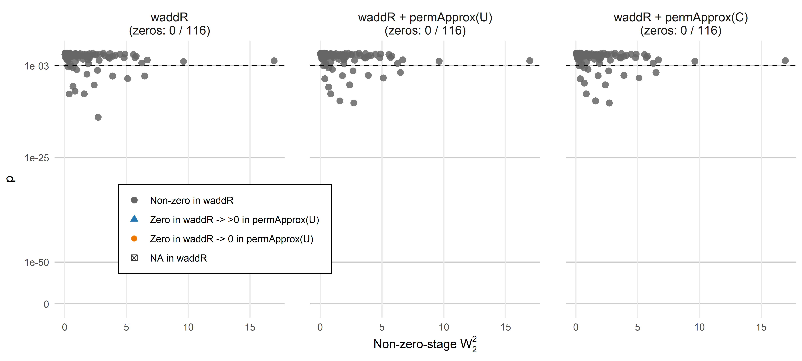
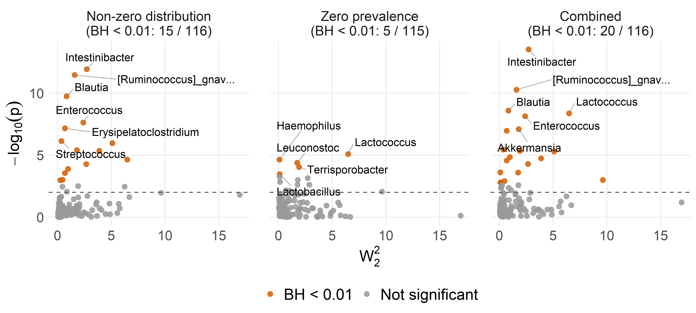
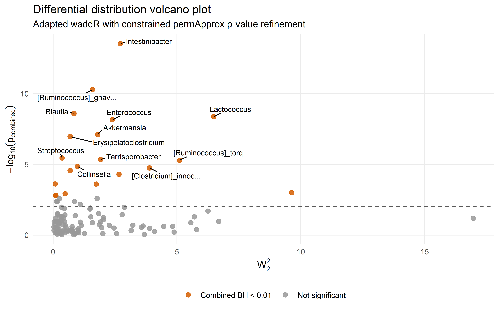
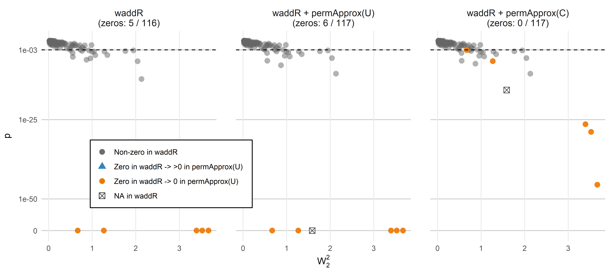
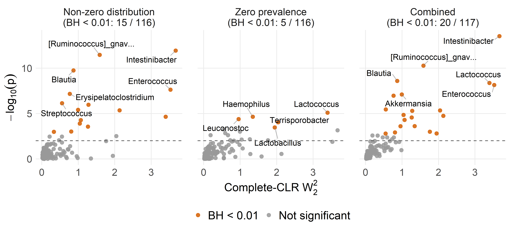
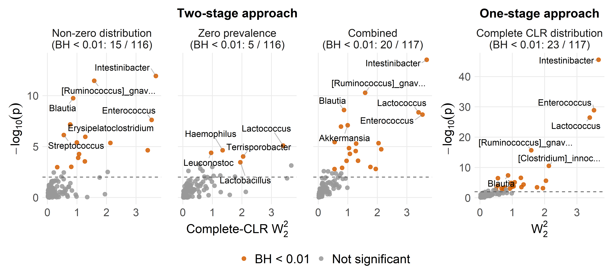
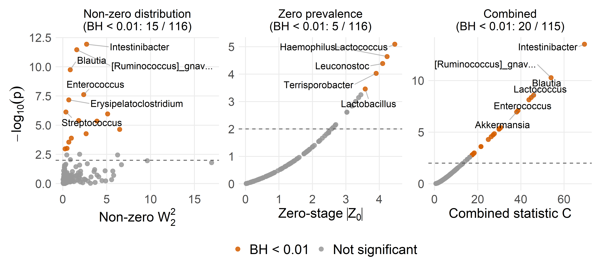
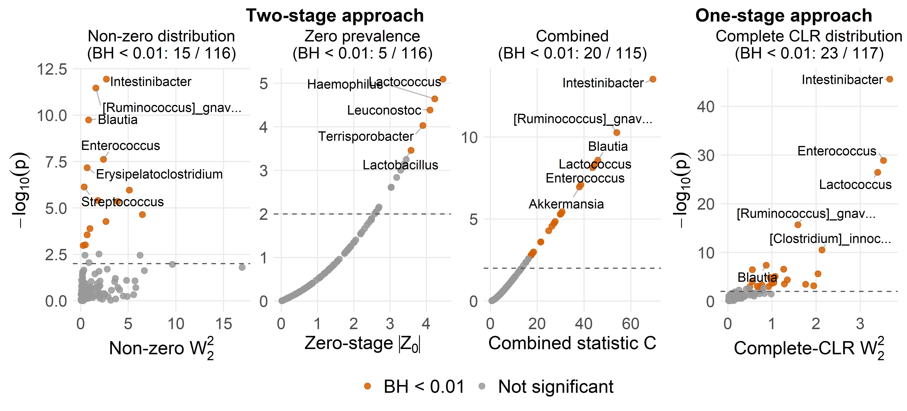
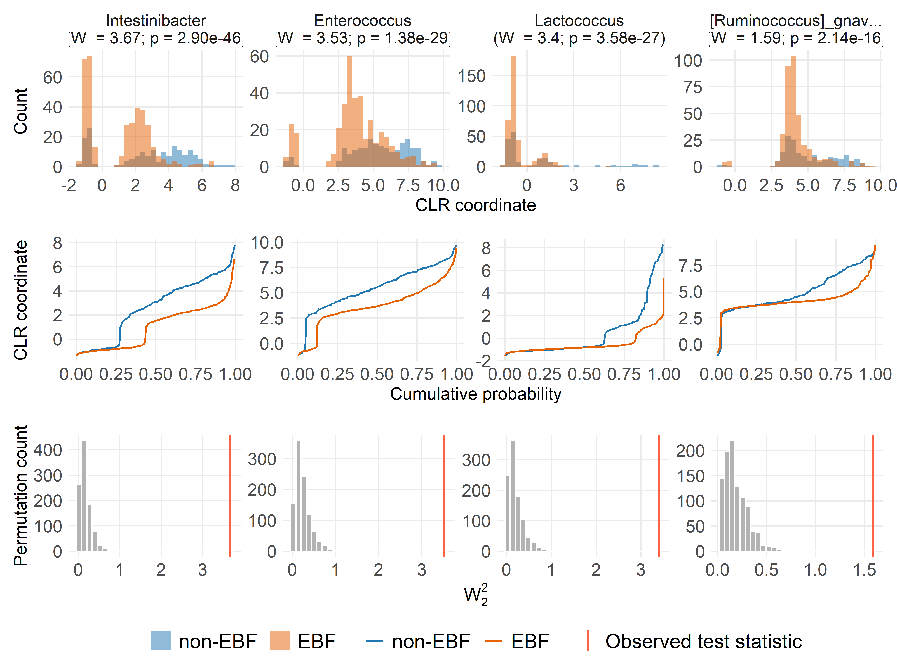

Differential distribution analysis
================
Compiled at 2026-07-06 19:32:41 UTC

``` r
here::i_am(paste0(params$name, ".Rmd"), uuid = "8ecbd0ba-b360-460e-aba4-302f35d02cda")
```

## Set global parameters

## Load data

## Helper functions

Counts are transformed to relative abundances, zeros are replaced by
multiplicative replacement, and the CLR transformation is applied after
replacement. For the adapted two-stage differential distribution
analysis, the original count matrix defines whether a taxon is zero in a
sample, while the non-zero Wasserstein tests are computed on the
corresponding CLR values.

## Load modified waddR implementation

The adapted analysis uses the low-level Wasserstein permutation test
from the modified local `waddR` implementation. This version exports the
permutation statistics required by `permApprox`.

## Prepare relative abundance and CLR matrices

    ## Warning in zCompositions::multRepl(rel_abund_mat, label = 0, dl = detection_limit_mat, : Column no. 1 containing >90% zeros/unobserved values found (see arguments z.warning and z.delete. Check out with zPatterns()).
    ## Column no. 3 containing >90% zeros/unobserved values found (see arguments z.warning and z.delete. Check out with zPatterns()).
    ## Column no. 5 containing >90% zeros/unobserved values found (see arguments z.warning and z.delete. Check out with zPatterns()).
    ## Column no. 6 containing >90% zeros/unobserved values found (see arguments z.warning and z.delete. Check out with zPatterns()).
    ## Column no. 7 containing >90% zeros/unobserved values found (see arguments z.warning and z.delete. Check out with zPatterns()).
    ## Column no. 12 containing >90% zeros/unobserved values found (see arguments z.warning and z.delete. Check out with zPatterns()).
    ## Column no. 13 containing >90% zeros/unobserved values found (see arguments z.warning and z.delete. Check out with zPatterns()).
    ## Column no. 15 containing >90% zeros/unobserved values found (see arguments z.warning and z.delete. Check out with zPatterns()).
    ## Column no. 17 containing >90% zeros/unobserved values found (see arguments z.warning and z.delete. Check out with zPatterns()).
    ## Column no. 18 containing >90% zeros/unobserved values found (see arguments z.warning and z.delete. Check out with zPatterns()).
    ## Column no. 19 containing >90% zeros/unobserved values found (see arguments z.warning and z.delete. Check out with zPatterns()).
    ## Column no. 20 containing >90% zeros/unobserved values found (see arguments z.warning and z.delete. Check out with zPatterns()).
    ## Column no. 22 containing >90% zeros/unobserved values found (see arguments z.warning and z.delete. Check out with zPatterns()).
    ## Column no. 23 containing >90% zeros/unobserved values found (see arguments z.warning and z.delete. Check out with zPatterns()).
    ## Column no. 25 containing >90% zeros/unobserved values found (see arguments z.warning and z.delete. Check out with zPatterns()).
    ## Column no. 26 containing >90% zeros/unobserved values found (see arguments z.warning and z.delete. Check out with zPatterns()).
    ## Column no. 27 containing >90% zeros/unobserved values found (see arguments z.warning and z.delete. Check out with zPatterns()).
    ## Column no. 28 containing >90% zeros/unobserved values found (see arguments z.warning and z.delete. Check out with zPatterns()).
    ## Column no. 30 containing >90% zeros/unobserved values found (see arguments z.warning and z.delete. Check out with zPatterns()).
    ## Column no. 33 containing >90% zeros/unobserved values found (see arguments z.warning and z.delete. Check out with zPatterns()).
    ## Column no. 34 containing >90% zeros/unobserved values found (see arguments z.warning and z.delete. Check out with zPatterns()).
    ## Column no. 35 containing >90% zeros/unobserved values found (see arguments z.warning and z.delete. Check out with zPatterns()).
    ## Column no. 36 containing >90% zeros/unobserved values found (see arguments z.warning and z.delete. Check out with zPatterns()).
    ## Column no. 37 containing >90% zeros/unobserved values found (see arguments z.warning and z.delete. Check out with zPatterns()).
    ## Column no. 38 containing >90% zeros/unobserved values found (see arguments z.warning and z.delete. Check out with zPatterns()).
    ## Column no. 39 containing >90% zeros/unobserved values found (see arguments z.warning and z.delete. Check out with zPatterns()).
    ## Column no. 40 containing >90% zeros/unobserved values found (see arguments z.warning and z.delete. Check out with zPatterns()).
    ## Column no. 42 containing >90% zeros/unobserved values found (see arguments z.warning and z.delete. Check out with zPatterns()).
    ## Column no. 43 containing >90% zeros/unobserved values found (see arguments z.warning and z.delete. Check out with zPatterns()).
    ## Column no. 44 containing >90% zeros/unobserved values found (see arguments z.warning and z.delete. Check out with zPatterns()).
    ## Column no. 45 containing >90% zeros/unobserved values found (see arguments z.warning and z.delete. Check out with zPatterns()).
    ## Column no. 46 containing >90% zeros/unobserved values found (see arguments z.warning and z.delete. Check out with zPatterns()).
    ## Column no. 48 containing >90% zeros/unobserved values found (see arguments z.warning and z.delete. Check out with zPatterns()).
    ## Column no. 50 containing >90% zeros/unobserved values found (see arguments z.warning and z.delete. Check out with zPatterns()).
    ## Column no. 51 containing >90% zeros/unobserved values found (see arguments z.warning and z.delete. Check out with zPatterns()).
    ## Column no. 54 containing >90% zeros/unobserved values found (see arguments z.warning and z.delete. Check out with zPatterns()).
    ## Column no. 55 containing >90% zeros/unobserved values found (see arguments z.warning and z.delete. Check out with zPatterns()).
    ## Column no. 58 containing >90% zeros/unobserved values found (see arguments z.warning and z.delete. Check out with zPatterns()).
    ## Column no. 59 containing >90% zeros/unobserved values found (see arguments z.warning and z.delete. Check out with zPatterns()).
    ## Column no. 60 containing >90% zeros/unobserved values found (see arguments z.warning and z.delete. Check out with zPatterns()).
    ## Column no. 61 containing >90% zeros/unobserved values found (see arguments z.warning and z.delete. Check out with zPatterns()).
    ## Column no. 64 containing >90% zeros/unobserved values found (see arguments z.warning and z.delete. Check out with zPatterns()).
    ## Column no. 66 containing >90% zeros/unobserved values found (see arguments z.warning and z.delete. Check out with zPatterns()).
    ## Column no. 67 containing >90% zeros/unobserved values found (see arguments z.warning and z.delete. Check out with zPatterns()).
    ## Column no. 69 containing >90% zeros/unobserved values found (see arguments z.warning and z.delete. Check out with zPatterns()).
    ## Column no. 70 containing >90% zeros/unobserved values found (see arguments z.warning and z.delete. Check out with zPatterns()).
    ## Column no. 71 containing >90% zeros/unobserved values found (see arguments z.warning and z.delete. Check out with zPatterns()).
    ## Column no. 72 containing >90% zeros/unobserved values found (see arguments z.warning and z.delete. Check out with zPatterns()).
    ## Column no. 73 containing >90% zeros/unobserved values found (see arguments z.warning and z.delete. Check out with zPatterns()).
    ## Column no. 74 containing >90% zeros/unobserved values found (see arguments z.warning and z.delete. Check out with zPatterns()).
    ## Column no. 76 containing >90% zeros/unobserved values found (see arguments z.warning and z.delete. Check out with zPatterns()).
    ## Column no. 77 containing >90% zeros/unobserved values found (see arguments z.warning and z.delete. Check out with zPatterns()).
    ## Column no. 78 containing >90% zeros/unobserved values found (see arguments z.warning and z.delete. Check out with zPatterns()).
    ## Column no. 81 containing >90% zeros/unobserved values found (see arguments z.warning and z.delete. Check out with zPatterns()).
    ## Column no. 84 containing >90% zeros/unobserved values found (see arguments z.warning and z.delete. Check out with zPatterns()).
    ## Column no. 85 containing >90% zeros/unobserved values found (see arguments z.warning and z.delete. Check out with zPatterns()).
    ## Column no. 86 containing >90% zeros/unobserved values found (see arguments z.warning and z.delete. Check out with zPatterns()).
    ## Column no. 87 containing >90% zeros/unobserved values found (see arguments z.warning and z.delete. Check out with zPatterns()).
    ## Column no. 88 containing >90% zeros/unobserved values found (see arguments z.warning and z.delete. Check out with zPatterns()).
    ## Column no. 90 containing >90% zeros/unobserved values found (see arguments z.warning and z.delete. Check out with zPatterns()).
    ## Column no. 91 containing >90% zeros/unobserved values found (see arguments z.warning and z.delete. Check out with zPatterns()).
    ## Column no. 92 containing >90% zeros/unobserved values found (see arguments z.warning and z.delete. Check out with zPatterns()).
    ## Column no. 93 containing >90% zeros/unobserved values found (see arguments z.warning and z.delete. Check out with zPatterns()).
    ## Column no. 94 containing >90% zeros/unobserved values found (see arguments z.warning and z.delete. Check out with zPatterns()).
    ## Col

    ## Warning in zCompositions::multRepl(rel_abund_mat, label = 0, dl = detection_limit_mat, : Row no. 80 containing >90% zeros/unobserved values found (see arguments z.warning and z.delete. Check out with zPatterns()).
    ## Row no. 102 containing >90% zeros/unobserved values found (see arguments z.warning and z.delete. Check out with zPatterns()).
    ## Row no. 112 containing >90% zeros/unobserved values found (see arguments z.warning and z.delete. Check out with zPatterns()).
    ## Row no. 145 containing >90% zeros/unobserved values found (see arguments z.warning and z.delete. Check out with zPatterns()).
    ## Row no. 147 containing >90% zeros/unobserved values found (see arguments z.warning and z.delete. Check out with zPatterns()).
    ## Row no. 157 containing >90% zeros/unobserved values found (see arguments z.warning and z.delete. Check out with zPatterns()).
    ## Row no. 164 containing >90% zeros/unobserved values found (see arguments z.warning and z.delete. Check out with zPatterns()).
    ## Row no. 265 containing >90% zeros/unobserved values found (see arguments z.warning and z.delete. Check out with zPatterns()).
    ## Row no. 366 containing >90% zeros/unobserved values found (see arguments z.warning and z.delete. Check out with zPatterns()).
    ## Row no. 368 containing >90% zeros/unobserved values found (see arguments z.warning and z.delete. Check out with zPatterns()).
    ## Row no. 397 containing >90% zeros/unobserved values found (see arguments z.warning and z.delete. Check out with zPatterns()).
    ## Row no. 399 containing >90% zeros/unobserved values found (see arguments z.warning and z.delete. Check out with zPatterns()).
    ## Row no. 403 containing >90% zeros/unobserved values found (see arguments z.warning and z.delete. Check out with zPatterns()).
    ## Row no. 410 containing >90% zeros/unobserved values found (see arguments z.warning and z.delete. Check out with zPatterns()).
    ## Row no. 416 containing >90% zeros/unobserved values found (see arguments z.warning and z.delete. Check out with zPatterns()).
    ## Row no. 436 containing >90% zeros/unobserved values found (see arguments z.warning and z.delete. Check out with zPatterns()).
    ## Row no. 471 containing >90% zeros/unobserved values found (see arguments z.warning and z.delete. Check out with zPatterns()).
    ## Row no. 480 containing >90% zeros/unobserved values found (see arguments z.warning and z.delete. Check out with zPatterns()).
    ## Row no. 533 containing >90% zeros/unobserved values found (see arguments z.warning and z.delete. Check out with zPatterns()).
    ## Row no. 551 containing >90% zeros/unobserved values found (see arguments z.warning and z.delete. Check out with zPatterns()).

    ## # A tibble: 1 × 9
    ##   n_samples n_taxa min_library_size median_library_size max_library_size zero_fraction detection_limit replacement_value replacement_fraction
    ##       <int>  <int>            <dbl>               <dbl>            <dbl>         <dbl>           <dbl>             <dbl>                <dbl>
    ## 1       592    117             1456              21898.            69556         0.796       0.0000288         0.0000187                 0.65

## Differential distribution setup

The differential distribution analysis compares children with no
exclusive breastfeeding (`EBF duration == "0 months"`) to children
exclusively breastfed for at least two months
(`EBF duration == ">=2 months"`). Samples in the sparse `1 month`
category and samples with missing EBF duration are excluded from this
two-group comparison.

    ##   EBF_group n_samples
    ## 1   non-EBF       179
    ## 2       EBF       375

    ## # A tibble: 1 × 8
    ##   n_samples n_taxa n_non_ebf n_ebf excluded_ebf_one_month excluded_missing_ebf n_perm  seed
    ##       <int>  <int>     <int> <int>                  <int>                <int>  <dbl> <dbl>
    ## 1       554    117       179   375                      3                   35    999    42

## Adapted two-stage approach

### waddR analysis

The zero stage is computed from the original counts. The non-zero
Wasserstein stage uses CLR values from samples where the original count
of the tested taxon is positive.

    ## # A tibble: 10 × 26
    ##    taxon_id     d.wass `d.wass^2` `d.comp^2` d.comp location   size  shape   rho     pval p.ad.gpd N.exc gpd.shape perc.loc perc.size perc.shape
    ##    <chr>         <dbl>      <dbl>      <dbl>  <dbl>    <dbl>  <dbl>  <dbl> <dbl>    <dbl>    <dbl> <dbl>     <dbl>    <dbl>     <dbl>      <dbl>
    ##  1 Intestiniba…  1.65       2.72       2.72   1.65     2.26  0.172  0.286  0.905 4.45e-16   0.296    250    0.0216     83.2      6.33      10.5 
    ##  2 Streptococc…  0.604      0.365      0.366  0.605    0.329 0.0245 0.0127 0.997 1.66e-10   0.0842   250   -0.101      89.9      6.68       3.46
    ##  3 [Ruminococc…  1.26       1.59       1.60   1.27     0.733 0.401  0.468  0.874 1.74e-10   0.841    250    0.0257     45.8     25.0       29.2 
    ##  4 Blautia       0.920      0.846      0.849  0.922    0.180 0.369  0.300  0.843 7.61e-10   0.0994   250   -0.0313     21.2     43.5       35.3 
    ##  5 Erysipelato…  0.828      0.686      0.690  0.831    0.217 0.0850 0.388  0.919 1.15e- 8   0.554    250   -0.129      31.4     12.3       56.2 
    ##  6 Enterococcus  1.55       2.39       2.39   1.55     2.09  0.0734 0.229  0.956 2.34e- 8   0.685    250    0.122      87.4      3.07       9.58
    ##  7 [Ruminococc…  2.26       5.11       5.18   2.28     3.66  1.18   0.333  0.913 7.83e- 7   0.610    250   -0.0627     70.7     22.9        6.43
    ##  8 [Clostridiu…  1.97       3.89       3.92   1.98     1.68  1.40   0.842  0.823 3.16e- 6   0.670    250    0.0712     42.8     35.7       21.5 
    ##  9 Lactococcus   2.55       6.49       6.55   2.56     2.69  3.13   0.729  0.788 3.32e- 6   0.125    250   -0.0247     41.1     47.8       11.1 
    ## 10 Akkermansia   1.34       1.81       1.83   1.35     0.303 1.22   0.301  0.879 9.46e- 6   0.131    240   -0.0900     16.6     67.0       16.5 
    ## # ℹ 10 more variables: decomp.error <dbl>, p.zero <dbl>, p.combined <dbl>, p.adj.nonzero <dbl>, p.adj.zero <dbl>, p.adj.combined <dbl>,
    ## #   n_nonzero_group1 <dbl>, n_nonzero_group2 <dbl>, n_group1 <int>, n_group2 <int>

    ## # A tibble: 1 × 9
    ##   n_taxa n_nonzero_testable n_zero_p_waddr n_zero_stage_testable n_zero_p_combined n_significant_nonzero_raw n_significant_nonzero_bh
    ##    <int>              <int>          <int>                 <int>             <int>                     <int>                    <int>
    ## 1    117                116              0                   116                 0                        19                       15
    ## # ℹ 2 more variables: n_significant_combined_raw <int>, n_significant_combined_bh <int>

### p-value refinement with permApprox

    ## Summary of permApprox result
    ## ----------------------------
    ## Number of tests             : 117
    ## Approximation method        : GPD tail approximation
    ## Approximation threshold     : p-values <0.01
    ## Multiple testing adjustment : none
    ## 
    ## Fit status counts:
    ##   Successful fits          : 19
    ##   GOF rejections           : 0
    ##   Fit failed               : 0
    ##   No threshold found       : 0
    ##   Discrete distributions   : 0
    ##   Not selected for fitting : 97
    ## 
    ## GPD parameter summary (successful fits)
    ## --------------------------------------
    ##   shape:
    ##     min = -0.2, median = -0.042, mean = -0.0305, max = 0.123
    ##   scale:
    ##     min = 0.0349, median = 0.108, mean = 0.236, max = 1.43
    ##   n_exceed:
    ##     min =  210, median =  250, mean =  246, max =  250
    ## 
    ## P-value summary
    ## ---------------
    ## Empirical p-values:
    ##   empirical:
    ##     min = 0.001, median = 0.267, mean = 0.338, max =    1
    ## 
    ## Final p-values (unadjusted):
    ##   unadjusted:
    ##     min = 0.00000000000117, median = 0.267, mean = 0.338, max =    1

    ## # A tibble: 1 × 13
    ##   n_taxa n_testable_waddr n_testable_permapprox_unconstrained n_testable_permapprox…¹ n_zero_waddr n_zero_permapprox_un…² n_zero_permapprox_co…³
    ##    <int>            <int>                               <int>                   <int>        <int>                  <int>                  <int>
    ## 1    117              116                                 116                     116            0                      0                      0
    ## # ℹ abbreviated names: ¹​n_testable_permapprox_constrained, ²​n_zero_permapprox_unconstrained, ³​n_zero_permapprox_constrained
    ## # ℹ 6 more variables: n_sig_waddr_bh <int>, n_sig_permapprox_unconstrained_bh <int>, n_sig_permapprox_constrained_bh <int>,
    ## #   n_sig_combined_waddr_bh <int>, n_sig_combined_permapprox_unconstrained_bh <int>, n_sig_combined_permapprox_constrained_bh <int>

### P-values from separated-zero waddR and permApprox

This diagnostic follows the zero-p-value plot used in the permApprox
single-cell application. It separates taxa with non-zero empirical waddR
p-values from taxa for which waddR returns zero, and then shows whether
unconstrained or constrained permApprox resolves those zeros.

    ## # A tibble: 351 × 10
    ##    taxon_id              taxon        method_key method_label d_wass2   pvalue  p_waddr p_permapprox_unconst…¹ p_permapprox_constra…² zero_class
    ##    <chr>                 <chr>        <fct>      <fct>          <dbl>    <dbl>    <dbl>                  <dbl>                  <dbl> <fct>     
    ##  1 Phascolarctobacterium Phascolarct… waddR      waddR         6.69   2.30e- 2 2.30e- 2            0.024                  0.024       nonzero_w…
    ##  2 Veillonella           Veillonella  waddR      waddR         0.0479 8.29e- 1 8.29e- 1            0.829                  0.829       nonzero_w…
    ##  3 Negativicoccus        Negativicoc… waddR      waddR         1.92   2.50e- 2 2.50e- 2            0.026                  0.026       nonzero_w…
    ##  4 Dialister             Dialister    waddR      waddR         0.101  1.64e- 1 1.64e- 1            0.165                  0.165       nonzero_w…
    ##  5 Megasphaera           Megasphaera  waddR      waddR         3.22   2.69e- 1 2.69e- 1            0.27                   0.27        nonzero_w…
    ##  6 Anaeroglobus          Anaeroglobus waddR      waddR         0.262  1   e+ 0 1   e+ 0            1                      1           nonzero_w…
    ##  7 Megamonas             Megamonas    waddR      waddR         3.57   9.31e- 2 9.31e- 2            0.094                  0.094       nonzero_w…
    ##  8 Streptococcus         Streptococc… waddR      waddR         0.365  1.66e-10 1.66e-10            0.000000748            0.000000748 nonzero_w…
    ##  9 Lactococcus           Lactococcus  waddR      waddR         6.49   3.32e- 6 3.32e- 6            0.0000231              0.0000231   nonzero_w…
    ## 10 Gemella               Gemella      waddR      waddR         0.0961 4.18e- 1 4.18e- 1            0.419                  0.419       nonzero_w…
    ## # ℹ 341 more rows
    ## # ℹ abbreviated names: ¹​p_permapprox_unconstrained, ²​p_permapprox_constrained

    ## Warning: Removed 3 rows containing missing values or values outside the scale range (`geom_point()`).

<!-- -->

### Two-stage p-value components

This panel plot separates the three p-values used in the adapted
two-stage analysis: the non-zero Wasserstein component, the zero
component, and the combined p-value. The x-axis is the observed squared
2-Wasserstein distance from the non-zero stage, so it is the direct
Wasserstein test statistic only in the non-zero panel. Colours indicate
BH significance within each component.

    ## # A tibble: 347 × 8
    ##    taxon_id              taxon                 component             d_wass2      pvalue    qvalue neglog10_p significance_class
    ##    <chr>                 <chr>                 <fct>                   <dbl>       <dbl>     <dbl>      <dbl> <fct>             
    ##  1 Phascolarctobacterium Phascolarctobacterium Non-zero distribution  6.69   0.024       0.116         1.62   Not significant   
    ##  2 Veillonella           Veillonella           Non-zero distribution  0.0479 0.829       0.891         0.0814 Not significant   
    ##  3 Negativicoccus        Negativicoccus        Non-zero distribution  1.92   0.026       0.120         1.59   Not significant   
    ##  4 Dialister             Dialister             Non-zero distribution  0.101  0.165       0.422         0.783  Not significant   
    ##  5 Megasphaera           Megasphaera           Non-zero distribution  3.22   0.27        0.531         0.569  Not significant   
    ##  6 Anaeroglobus          Anaeroglobus          Non-zero distribution  0.262  1           1             0      Not significant   
    ##  7 Megamonas             Megamonas             Non-zero distribution  3.57   0.094       0.280         1.03   Not significant   
    ##  8 Streptococcus         Streptococcus         Non-zero distribution  0.365  0.000000748 0.0000145     6.13   BH < 0.01         
    ##  9 Lactococcus           Lactococcus           Non-zero distribution  6.49   0.0000231   0.000268      4.64   BH < 0.01         
    ## 10 Gemella               Gemella               Non-zero distribution  0.0961 0.419       0.666         0.378  Not significant   
    ## # ℹ 337 more rows

<!-- -->

### Volcano plot

The differential distribution volcano plot shows the observed squared
2-Wasserstein distance from the non-zero stage on the x-axis and the
constrained permApprox combined p-value for the zero and non-zero stages
as the significance measure.

    ## # A tibble: 116 × 47
    ##    taxon_id    d.wass `d.wass^2` `d.comp^2` d.comp location    size  shape   rho     pval p.ad.gpd N.exc gpd.shape perc.loc perc.size perc.shape
    ##    <chr>        <dbl>      <dbl>      <dbl>  <dbl>    <dbl>   <dbl>  <dbl> <dbl>    <dbl>    <dbl> <dbl>     <dbl>    <dbl>     <dbl>      <dbl>
    ##  1 Phascolarc…  2.59      6.69       6.79    2.61    6.01   0.0389  0.740  0.804 2.30e- 2  NA         NA   NA          88.5      0.57      10.9 
    ##  2 Veillonella  0.219     0.0479     0.0477  0.218   0.0158 0.00315 0.0287 0.995 8.29e- 1  NA         NA   NA          33.1      6.62      60.3 
    ##  3 Negativico…  1.39      1.92       1.92    1.39    1.79   0.0564  0.0769 0.974 2.50e- 2  NA         NA   NA          93.0      2.94       4.01
    ##  4 Dialister    0.319     0.101      0.106   0.325   0.0431 0.0484  0.0140 0.989 1.64e- 1  NA         NA   NA          40.9     45.8       13.3 
    ##  5 Megasphaera  1.80      3.22       3.50    1.87    1.31   1.91    0.274  0.938 2.69e- 1  NA         NA   NA          37.4     54.8        7.84
    ##  6 Anaeroglob…  0.512     0.262      0.350   0.592   0.0871 0.117   0.146  0.977 1   e+ 0  NA         NA   NA          24.9     33.5       41.6 
    ##  7 Megamonas    1.89      3.57       3.60    1.90    3.50   0.0851  0.0170 0.742 9.31e- 2  NA         NA   NA          97.2      2.36       0.47
    ##  8 Streptococ…  0.604     0.365      0.366   0.605   0.329  0.0245  0.0127 0.997 1.66e-10   0.0842   250   -0.101      89.9      6.68       3.46
    ##  9 Lactococcus  2.55      6.49       6.55    2.56    2.69   3.13    0.729  0.788 3.32e- 6   0.125    250   -0.0247     41.1     47.8       11.1 
    ## 10 Gemella      0.310     0.0961     0.0960  0.310   0.0118 0.0124  0.0717 0.976 4.18e- 1  NA         NA   NA          12.3     12.9       74.8 
    ## # ℹ 106 more rows
    ## # ℹ 31 more variables: decomp.error <dbl>, p.zero <dbl>, p.combined <dbl>, p.adj.nonzero <dbl>, p.adj.zero <dbl>, p.adj.combined <dbl>,
    ## #   n_nonzero_group1 <dbl>, n_nonzero_group2 <dbl>, n_group1 <int>, n_group2 <int>, zero_prevalence_estimate <dbl>, zero_prevalence_z <dbl>,
    ## #   taxon <chr>, p_permapprox_unconstrained <dbl>, p_permapprox_constrained <dbl>, p_combined_permapprox_unconstrained <dbl>,
    ## #   p_combined_permapprox_constrained <dbl>, p_adj_permapprox_unconstrained <dbl>, p_adj_permapprox_constrained <dbl>,
    ## #   p_adj_combined_permapprox_unconstrained <dbl>, p_adj_combined_permapprox_constrained <dbl>, fisher_statistic_permapprox_constrained <dbl>,
    ## #   method_used_unconstrained <chr>, method_used_constrained <chr>, shape_permapprox_unconstrained <dbl>, shape_permapprox_constrained <dbl>, …

<!-- -->

### Distribution diagnostics for selected genera

These plots focus on the non-zero Wasserstein stage. CLR-transformed
abundances are shown only for samples where the tested genus had a
positive original count, matching the distributions used in the adapted
two-stage waddR test.

    ## # A tibble: 4 × 46
    ##   taxon_id       d.wass `d.wass^2` `d.comp^2` d.comp location   size shape   rho     pval p.ad.gpd N.exc gpd.shape perc.loc perc.size perc.shape
    ##   <chr>           <dbl>      <dbl>      <dbl>  <dbl>    <dbl>  <dbl> <dbl> <dbl>    <dbl>    <dbl> <dbl>     <dbl>    <dbl>     <dbl>      <dbl>
    ## 1 Intestinibact…  1.65       2.72       2.72   1.65     2.26  0.172  0.286 0.905 4.45e-16   0.296    250    0.0216     83.2      6.33      10.5 
    ## 2 [Ruminococcus…  1.26       1.59       1.60   1.27     0.733 0.401  0.468 0.874 1.74e-10   0.841    250    0.0257     45.8     25.0       29.2 
    ## 3 Blautia         0.920      0.846      0.849  0.922    0.180 0.369  0.300 0.843 7.61e-10   0.0994   250   -0.0313     21.2     43.5       35.3 
    ## 4 Enterococcus    1.55       2.39       2.39   1.55     2.09  0.0734 0.229 0.956 2.34e- 8   0.685    250    0.122      87.4      3.07       9.58
    ## # ℹ 30 more variables: decomp.error <dbl>, p.zero <dbl>, p.combined <dbl>, p.adj.nonzero <dbl>, p.adj.zero <dbl>, p.adj.combined <dbl>,
    ## #   n_nonzero_group1 <dbl>, n_nonzero_group2 <dbl>, n_group1 <int>, n_group2 <int>, zero_prevalence_estimate <dbl>, zero_prevalence_z <dbl>,
    ## #   taxon <chr>, p_permapprox_unconstrained <dbl>, p_permapprox_constrained <dbl>, p_combined_permapprox_unconstrained <dbl>,
    ## #   p_combined_permapprox_constrained <dbl>, p_adj_permapprox_unconstrained <dbl>, p_adj_permapprox_constrained <dbl>,
    ## #   p_adj_combined_permapprox_unconstrained <dbl>, p_adj_combined_permapprox_constrained <dbl>, fisher_statistic_permapprox_constrained <dbl>,
    ## #   method_used_unconstrained <chr>, method_used_constrained <chr>, shape_permapprox_unconstrained <dbl>, shape_permapprox_constrained <dbl>,
    ## #   scale_permapprox_unconstrained <dbl>, scale_permapprox_constrained <dbl>, taxon_label <chr>, panel_label <chr>

<!-- -->

### Top taxa

## One-stage complete CLR approach

### Complete CLR waddR analysis

As a contrast to the separated-zero approach, this analysis runs the
Wasserstein test on the complete CLR-transformed distributions. Samples
with an original zero count are therefore included through their
multiplicative replacement CLR value rather than being handled by a
separate zero stage.

    ## # A tibble: 10 × 20
    ##    taxon_id     d.wass `d.wass^2` `d.comp^2` d.comp location    size shape   rho     pval p.ad.gpd N.exc gpd.shape perc.loc perc.size perc.shape
    ##    <chr>         <dbl>      <dbl>      <dbl>  <dbl>    <dbl>   <dbl> <dbl> <dbl>    <dbl>    <dbl> <dbl>     <dbl>    <dbl>     <dbl>      <dbl>
    ##  1 Lactococcus   1.84       3.40       3.42   1.85   0.917   2.27e+0 0.230 0.944 0          0.615    250 -0.105       26.8      66.5        6.73
    ##  2 Enterococcus  1.88       3.53       3.53   1.88   2.99    8.32e-3 0.538 0.945 0          0.580    250 -0.141       84.5       0.24      15.2 
    ##  3 Intestiniba…  1.92       3.67       3.68   1.92   2.63    4.50e-1 0.597 0.935 0          0.141    250 -0.0856      71.6      12.2       16.2 
    ##  4 Epulopiscium  0.818      0.669      0.680  0.825  0.00976 4.47e-1 0.223 0.702 0          0.182    130 -0.431        1.44     65.8       32.8 
    ##  5 Bacteroides   1.13       1.27       1.27   1.13   0.762   1.30e-2 0.493 0.960 0          0.548    250 -0.163       60.1       1.03      38.9 
    ##  6 [Clostridiu…  1.46       2.13       2.15   1.47   0.592   1.12e+0 0.431 0.947 5.96e-13   0.100    250 -0.0497      27.6      52.3       20.1 
    ##  7 Terrisporob…  1.43       2.04       2.06   1.43   0.273   1.07e+0 0.710 0.771 2.41e- 7   0.122    250 -0.0157      13.3      52.2       34.5 
    ##  8 Blautia       0.933      0.871      0.874  0.935  0.158   3.76e-1 0.340 0.864 7.29e- 7   0.150    250 -0.0859      18.1      43.0       38.9 
    ##  9 Leuconostoc   0.979      0.959      0.966  0.983  0.0587  6.72e-1 0.235 0.708 2.00e- 6   0.339    250 -0.0191       6.07     69.6       24.3 
    ## 10 Streptococc…  0.746      0.556      0.560  0.748  0.409   2.17e-4 0.150 0.965 6.23e- 6   0.0578   150 -0.000769    73.1       0.04      26.8 
    ## # ℹ 4 more variables: decomp.error <dbl>, p.adj <dbl>, n_group1 <int>, n_group2 <int>

    ## # A tibble: 1 × 5
    ##   n_taxa n_testable n_zero_p_waddr n_significant_raw n_significant_bh
    ##    <int>      <int>          <int>             <int>            <int>
    ## 1    117        116              5                28               22

### p-value refinement with permApprox for complete CLR waddR

    ## Summary of permApprox result
    ## ----------------------------
    ## Number of tests             : 117
    ## Approximation method        : GPD tail approximation
    ## Approximation threshold     : p-values <0.01
    ## Multiple testing adjustment : none
    ## 
    ## Fit status counts:
    ##   Successful fits          : 28
    ##   GOF rejections           : 0
    ##   Fit failed               : 0
    ##   No threshold found       : 1
    ##   Discrete distributions   : 0
    ##   Not selected for fitting : 88
    ## 
    ## GPD parameter summary (successful fits)
    ## --------------------------------------
    ##   shape:
    ##     min = -0.187, median = -0.0481, mean = -0.0458, max = 0.134
    ##   scale:
    ##     min = 0.0413, median = 0.126, mean = 0.125, max = 0.342
    ##   n_exceed:
    ##     min =  130, median =  250, mean =  234, max =  250
    ## 
    ## P-value summary
    ## ---------------
    ## Empirical p-values:
    ##   empirical:
    ##     min = 0.001, median = 0.103, mean = 0.201, max = 0.807
    ## 
    ## Final p-values (unadjusted):
    ##   unadjusted:
    ##     min = 0.00000000000000000000000000000000000000000000029, median = 0.103, mean =  0.2, max = 0.807

    ## # A tibble: 1 × 10
    ##   n_taxa n_testable_waddr n_testable_permapprox_unconstrained n_testable_permapprox…¹ n_zero_waddr n_zero_permapprox_un…² n_zero_permapprox_co…³
    ##    <int>            <int>                               <int>                   <int>        <int>                  <int>                  <int>
    ## 1    117              116                                 117                     117            5                      6                      0
    ## # ℹ abbreviated names: ¹​n_testable_permapprox_constrained, ²​n_zero_permapprox_unconstrained, ³​n_zero_permapprox_constrained
    ## # ℹ 3 more variables: n_sig_waddr_bh <int>, n_sig_permapprox_unconstrained_bh <int>, n_sig_permapprox_constrained_bh <int>

### P-values from complete CLR waddR and permApprox

This is the same zero-p-value diagnostic, but for the complete CLR
approach where originally zero counts remain in the distributions after
multiplicative replacement and CLR transformation.

    ## # A tibble: 351 × 10
    ##    taxon_id              taxon          method_key method_label d_wass2  pvalue p_waddr p_permapprox_unconst…¹ p_permapprox_constra…² zero_class
    ##    <chr>                 <chr>          <fct>      <fct>          <dbl>   <dbl>   <dbl>                  <dbl>                  <dbl> <fct>     
    ##  1 Phascolarctobacterium Phascolarctob… waddR      waddR         0.174  1.83e-1 1.83e-1            0.184                     1.84e- 1 nonzero_w…
    ##  2 Veillonella           Veillonella    waddR      waddR         0.687  8.83e-3 8.83e-3            0.00919                   9.19e- 3 nonzero_w…
    ##  3 Negativicoccus        Negativicoccus waddR      waddR         0.146  1.72e-1 1.72e-1            0.173                     1.73e- 1 nonzero_w…
    ##  4 Dialister             Dialister      waddR      waddR         0.0359 5.54e-1 5.54e-1            0.554                     5.54e- 1 nonzero_w…
    ##  5 Megasphaera           Megasphaera    waddR      waddR         0.185  2.39e-1 2.39e-1            0.24                      2.4 e- 1 nonzero_w…
    ##  6 Anaeroglobus          Anaeroglobus   waddR      waddR         0.0680 3.48e-1 3.48e-1            0.349                     3.49e- 1 nonzero_w…
    ##  7 Megamonas             Megamonas      waddR      waddR         0.0647 6.41e-2 6.41e-2            0.065                     6.5 e- 2 nonzero_w…
    ##  8 Streptococcus         Streptococcus  waddR      waddR         0.556  6.23e-6 6.23e-6            0.000000357               3.57e- 7 nonzero_w…
    ##  9 Lactococcus           Lactococcus    waddR      waddR         3.40   0       0                  0                         3.58e-27 zero_both…
    ## 10 Gemella               Gemella        waddR      waddR         0.0550 7.11e-1 7.11e-1            0.711                     7.11e- 1 nonzero_w…
    ## # ℹ 341 more rows
    ## # ℹ abbreviated names: ¹​p_permapprox_unconstrained, ²​p_permapprox_constrained

    ## Warning: Removed 1 row containing missing values or values outside the scale range (`geom_point()`).

<!-- -->

### Constrained permApprox comparison for complete CLR waddR

This two-panel version is intended for the paper. It focuses on the
one-stage complete CLR analysis where waddR returns zero p-values and
compares those directly with the constrained permApprox refinement,
labelled simply as `permApprox`.

    ## # A tibble: 234 × 9
    ##    taxon_id              taxon                 method_key method_label d_wass2     pvalue    p_waddr p_permapprox zero_class     
    ##    <chr>                 <chr>                 <fct>      <fct>          <dbl>      <dbl>      <dbl>        <dbl> <fct>          
    ##  1 Phascolarctobacterium Phascolarctobacterium waddR      waddR         0.174  0.183      0.183          1.84e- 1 nonzero_waddR  
    ##  2 Veillonella           Veillonella           waddR      waddR         0.687  0.00883    0.00883        9.19e- 3 nonzero_waddR  
    ##  3 Negativicoccus        Negativicoccus        waddR      waddR         0.146  0.172      0.172          1.73e- 1 nonzero_waddR  
    ##  4 Dialister             Dialister             waddR      waddR         0.0359 0.554      0.554          5.54e- 1 nonzero_waddR  
    ##  5 Megasphaera           Megasphaera           waddR      waddR         0.185  0.239      0.239          2.4 e- 1 nonzero_waddR  
    ##  6 Anaeroglobus          Anaeroglobus          waddR      waddR         0.0680 0.348      0.348          3.49e- 1 nonzero_waddR  
    ##  7 Megamonas             Megamonas             waddR      waddR         0.0647 0.0641     0.0641         6.5 e- 2 nonzero_waddR  
    ##  8 Streptococcus         Streptococcus         waddR      waddR         0.556  0.00000623 0.00000623     3.57e- 7 nonzero_waddR  
    ##  9 Lactococcus           Lactococcus           waddR      waddR         3.40   0          0              3.58e-27 zero_waddR_only
    ## 10 Gemella               Gemella               waddR      waddR         0.0550 0.711      0.711          7.11e- 1 nonzero_waddR  
    ## # ℹ 224 more rows

    ## Warning: Removed 1 row containing missing values or values outside the scale range (`geom_point()`).

<!-- -->

### Volcano plot

The one-stage volcano plot uses the complete-CLR squared 2-Wasserstein
statistic and the constrained permApprox p-value refinement. Colours
indicate BH significance at the same alpha level used for the two-stage
component plots.

    ## # A tibble: 117 × 35
    ##    taxon_id     d.wass `d.wass^2` `d.comp^2` d.comp location    size  shape   rho    pval p.ad.gpd N.exc gpd.shape perc.loc perc.size perc.shape
    ##    <chr>         <dbl>      <dbl>      <dbl>  <dbl>    <dbl>   <dbl>  <dbl> <dbl>   <dbl>    <dbl> <dbl>     <dbl>    <dbl>     <dbl>      <dbl>
    ##  1 Phascolarct…  0.418     0.174      0.173   0.416 0.00243  1.19e-1 0.0524 0.941 1.83e-1  NA         NA NA            1.4      68.4       30.2 
    ##  2 Veillonella   0.829     0.687      0.689   0.830 0.293    4.79e-3 0.391  0.969 8.83e-3   0.0984   220  0.0580      42.5       0.7       56.8 
    ##  3 Negativicoc…  0.382     0.146      0.147   0.384 0.000953 9.65e-2 0.0498 0.964 1.72e-1  NA         NA NA            0.65     65.5       33.8 
    ##  4 Dialister     0.190     0.0359     0.0368  0.192 0.00510  1.63e-2 0.0154 0.993 5.54e-1  NA         NA NA           13.9      44.2       41.9 
    ##  5 Megasphaera   0.431     0.185      0.187   0.432 0.00195  2.25e-5 0.185  0.832 2.39e-1  NA         NA NA            1.04      0.01      99.0 
    ##  6 Anaeroglobus  0.261     0.0680     0.0727  0.270 0.00487  2.88e-2 0.0391 0.899 3.48e-1  NA         NA NA            6.69     39.6       53.7 
    ##  7 Megamonas     0.254     0.0647     0.0654  0.256 0.00608  3.10e-2 0.0283 0.872 6.41e-2  NA         NA NA            9.3      47.4       43.3 
    ##  8 Streptococc…  0.746     0.556      0.560   0.748 0.409    2.17e-4 0.150  0.965 6.23e-6   0.0578   150 -0.000769    73.1       0.04      26.8 
    ##  9 Lactococcus   1.84      3.40       3.42    1.85  0.917    2.27e+0 0.230  0.944 0         0.615    250 -0.105       26.8      66.5        6.73
    ## 10 Gemella       0.234     0.0550     0.0574  0.240 0.000383 1.68e-3 0.0553 0.992 7.11e-1  NA         NA NA            0.67      2.93      96.4 
    ## # ℹ 107 more rows
    ## # ℹ 19 more variables: decomp.error <dbl>, p.adj <dbl>, n_group1 <int>, n_group2 <int>, taxon <chr>, p_permapprox_unconstrained <dbl>,
    ## #   p_permapprox_constrained <dbl>, p_adj_permapprox_unconstrained <dbl>, p_adj_permapprox_constrained <dbl>, method_used_unconstrained <chr>,
    ## #   method_used_constrained <chr>, shape_permapprox_unconstrained <dbl>, shape_permapprox_constrained <dbl>,
    ## #   scale_permapprox_unconstrained <dbl>, scale_permapprox_constrained <dbl>, component <fct>, neglog10_p <dbl>, significance_class <fct>,
    ## #   label_taxon <chr>

### Two-stage volcano plot with complete-CLR Wasserstein statistic

This version keeps the three two-stage p-values but uses the
complete-CLR squared 2-Wasserstein statistic on the x-axis. This makes
the two-stage panels directly comparable with the one-stage complete-CLR
volcano plot, while avoiding the implication that the zero-prevalence
and combined p-values are based on the non-zero-stage statistic.

    ## # A tibble: 349 × 8
    ##    taxon_id              taxon                 component                  pvalue    qvalue complete_clr_d_wass2 neglog10_p significance_class
    ##    <chr>                 <chr>                 <fct>                       <dbl>     <dbl>                <dbl>      <dbl> <fct>             
    ##  1 Phascolarctobacterium Phascolarctobacterium Non-zero distribution 0.024       0.116                   0.174      1.62   Not significant   
    ##  2 Veillonella           Veillonella           Non-zero distribution 0.829       0.891                   0.687      0.0814 Not significant   
    ##  3 Negativicoccus        Negativicoccus        Non-zero distribution 0.026       0.120                   0.146      1.59   Not significant   
    ##  4 Dialister             Dialister             Non-zero distribution 0.165       0.422                   0.0359     0.783  Not significant   
    ##  5 Megasphaera           Megasphaera           Non-zero distribution 0.27        0.531                   0.185      0.569  Not significant   
    ##  6 Anaeroglobus          Anaeroglobus          Non-zero distribution 1           1                       0.0680     0      Not significant   
    ##  7 Megamonas             Megamonas             Non-zero distribution 0.094       0.280                   0.0647     1.03   Not significant   
    ##  8 Streptococcus         Streptococcus         Non-zero distribution 0.000000748 0.0000145               0.556      6.13   BH < 0.01         
    ##  9 Lactococcus           Lactococcus           Non-zero distribution 0.0000231   0.000268                3.40       4.64   BH < 0.01         
    ## 10 Gemella               Gemella               Non-zero distribution 0.419       0.666                   0.0550     0.378  Not significant   
    ## # ℹ 339 more rows

<!-- -->

<!-- -->

### Two-stage volcano plot with native component statistics

This diagnostic version uses the statistic native to each two-stage
component: the non-zero-stage squared 2-Wasserstein statistic $T_{i,+}$,
the absolute Wald statistic $|Z_{i,0}|$ from the zero-prevalence
logistic regression, and Fisher’s combined statistic $C_i$. The x-axis
therefore has component-specific units and is shown with free scales.

    ## # A tibble: 347 × 8
    ##    taxon_id              taxon                 component             native_statistic      pvalue    qvalue neglog10_p significance_class
    ##    <chr>                 <chr>                 <fct>                            <dbl>       <dbl>     <dbl>      <dbl> <fct>             
    ##  1 Phascolarctobacterium Phascolarctobacterium Non-zero distribution           6.69   0.024       0.116         1.62   Not significant   
    ##  2 Veillonella           Veillonella           Non-zero distribution           0.0479 0.829       0.891         0.0814 Not significant   
    ##  3 Negativicoccus        Negativicoccus        Non-zero distribution           1.92   0.026       0.120         1.59   Not significant   
    ##  4 Dialister             Dialister             Non-zero distribution           0.101  0.165       0.422         0.783  Not significant   
    ##  5 Megasphaera           Megasphaera           Non-zero distribution           3.22   0.27        0.531         0.569  Not significant   
    ##  6 Anaeroglobus          Anaeroglobus          Non-zero distribution           0.262  1           1             0      Not significant   
    ##  7 Megamonas             Megamonas             Non-zero distribution           3.57   0.094       0.280         1.03   Not significant   
    ##  8 Streptococcus         Streptococcus         Non-zero distribution           0.365  0.000000748 0.0000145     6.13   BH < 0.01         
    ##  9 Lactococcus           Lactococcus           Non-zero distribution           6.49   0.0000231   0.000268      4.64   BH < 0.01         
    ## 10 Gemella               Gemella               Non-zero distribution           0.0961 0.419       0.666         0.378  Not significant   
    ## # ℹ 337 more rows

<!-- -->

<!-- -->

### Distribution diagnostics for selected genera

These plots use the complete CLR-transformed distributions from the
one-stage analysis. Originally zero counts are included through their
multiplicative replacement CLR values, matching the data passed to the
one-stage Wasserstein test.

    ## # A tibble: 4 × 33
    ##   taxon_id         d.wass `d.wass^2` `d.comp^2` d.comp location    size shape   rho  pval p.ad.gpd N.exc gpd.shape perc.loc perc.size perc.shape
    ##   <chr>             <dbl>      <dbl>      <dbl>  <dbl>    <dbl>   <dbl> <dbl> <dbl> <dbl>    <dbl> <dbl>     <dbl>    <dbl>     <dbl>      <dbl>
    ## 1 Intestinibacter    1.92       3.67       3.68   1.92    2.63  0.450   0.597 0.935     0    0.141   250   -0.0856     71.6     12.2       16.2 
    ## 2 Enterococcus       1.88       3.53       3.53   1.88    2.99  0.00832 0.538 0.945     0    0.580   250   -0.141      84.5      0.24      15.2 
    ## 3 Lactococcus        1.84       3.40       3.42   1.85    0.917 2.27    0.230 0.944     0    0.615   250   -0.105      26.8     66.5        6.73
    ## 4 [Ruminococcus]_…   1.26       1.59       1.59   1.26    0.649 0.429   0.514 0.900   NaN    0.104   170   -0.202      40.8     27.0       32.3 
    ## # ℹ 17 more variables: decomp.error <dbl>, p.adj <dbl>, n_group1 <int>, n_group2 <int>, taxon <chr>, p_permapprox_unconstrained <dbl>,
    ## #   p_permapprox_constrained <dbl>, p_adj_permapprox_unconstrained <dbl>, p_adj_permapprox_constrained <dbl>, method_used_unconstrained <chr>,
    ## #   method_used_constrained <chr>, shape_permapprox_unconstrained <dbl>, shape_permapprox_constrained <dbl>,
    ## #   scale_permapprox_unconstrained <dbl>, scale_permapprox_constrained <dbl>, taxon_label <chr>, panel_label <chr>

<!-- -->

## Comparative p-value table

## Files written

These files have been written to the target directory,
`data/09_diff_distribution`:

    ## # A tibble: 23 × 4
    ##    path                                                  type         size modification_time  
    ##    <fs::path>                                            <fct> <fs::bytes> <dttm>             
    ##  1 diff_distribution_analysis_objects.rds                file      276.57K 2026-07-06 19:32:47
    ##  2 diff_distribution_analysis_summary.csv                file          117 2026-07-06 19:32:47
    ##  3 diff_distribution_complete_clr_permapprox_summary.csv file          281 2026-07-06 19:33:00
    ##  4 diff_distribution_complete_clr_results_all.csv        file       42.99K 2026-07-06 19:33:00
    ##  5 diff_distribution_complete_clr_results_all.rds        file       14.63K 2026-07-06 19:33:00
    ##  6 diff_distribution_group_summary.csv                   file           40 2026-07-06 19:32:47
    ##  7 diff_distribution_multrepl_clr_object.rds             file      262.74K 2026-07-06 19:32:46
    ##  8 diff_distribution_permapprox_summary.csv              file          398 2026-07-06 19:32:50
    ##  9 diff_distribution_preprocessing_summary.csv           file          233 2026-07-06 19:32:46
    ## 10 diff_distribution_pvalues_all_approaches_table.tex    file        2.33K 2026-07-06 19:33:19
    ## # ℹ 13 more rows
