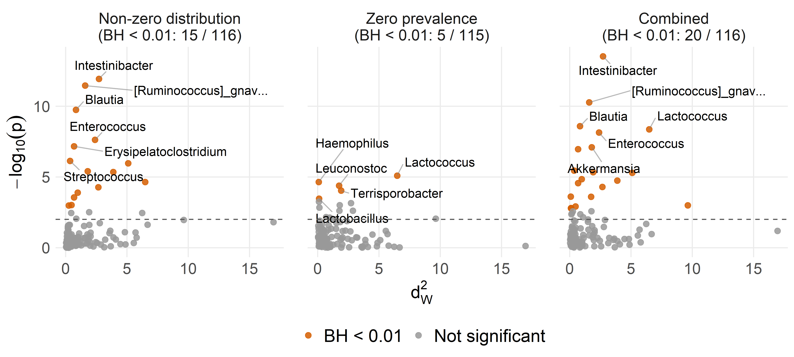
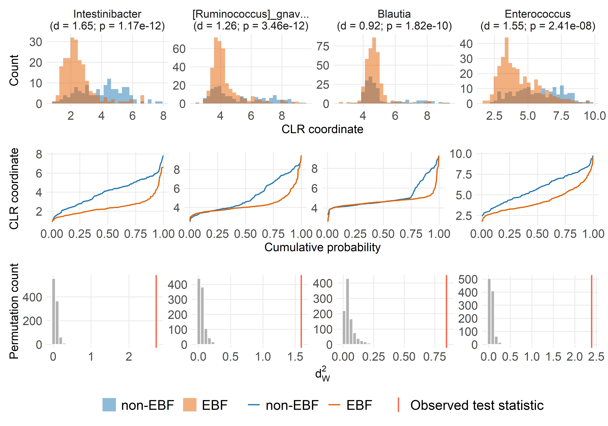
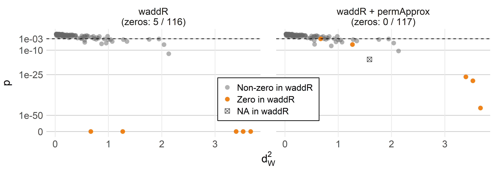
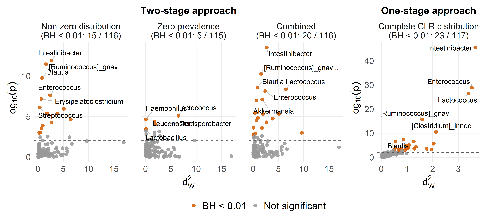

Differential distribution analysis
================
Compiled at 2026-06-16 21:09:03 UTC

## Set global parameters

## Load data

## Helper functions

Counts are transformed to relative abundances, zeros are replaced by
multiplicative replacement, and the CLR transformation is applied after
replacement. For the adapted two-stage differential distribution
analysis, the original count matrix defines whether a taxon is zero in a
sample, while the non-zero Wasserstein tests are computed on the
corresponding CLR values.

## Load modified waddR implementation

The adapted analysis uses the low-level Wasserstein permutation test
from the modified local `waddR` implementation. This version exports the
permutation statistics required by `permApprox`.

## Prepare relative abundance and CLR matrices

    ## # A tibble: 1 × 9
    ##   n_samples n_taxa min_library_size median_library_size max_library_size zero_fraction detection_limit replacement_value
    ##       <int>  <int>            <dbl>               <dbl>            <dbl>         <dbl>           <dbl>             <dbl>
    ## 1       592    117             1456              21898.            69556         0.796       0.0000288         0.0000187
    ## # ℹ 1 more variable: replacement_fraction <dbl>

## Differential distribution setup

The differential distribution analysis compares children with no
exclusive breastfeeding (`EBF duration == "0 months"`) to children
exclusively breastfed for at least two months
(`EBF duration == ">=2 months"`). Samples in the sparse `1 month`
category and samples with missing EBF duration are excluded from this
two-group comparison.

    ##   EBF_group n_samples
    ## 1   non-EBF       179
    ## 2       EBF       375

    ## # A tibble: 1 × 8
    ##   n_samples n_taxa n_non_ebf n_ebf excluded_ebf_one_month excluded_missing_ebf n_perm  seed
    ##       <int>  <int>     <int> <int>                  <int>                <int>  <dbl> <dbl>
    ## 1       554    117       179   375                      3                   35    999    42

## Adapted two-stage approach

### waddR analysis

The zero stage is computed from the original counts. The non-zero
Wasserstein stage uses CLR values from samples where the original count
of the tested taxon is positive.

    ## # A tibble: 10 × 26
    ##    taxon_id      d.wass `d.wass^2` `d.comp^2` d.comp location   size  shape   rho     pval p.ad.gpd N.exc gpd.shape perc.loc
    ##    <chr>          <dbl>      <dbl>      <dbl>  <dbl>    <dbl>  <dbl>  <dbl> <dbl>    <dbl>    <dbl> <dbl>     <dbl>    <dbl>
    ##  1 Intestinibac…  1.65       2.72       2.72   1.65     2.26  0.172  0.286  0.905 4.45e-16   0.296    250    0.0216     83.2
    ##  2 Streptococcus  0.604      0.365      0.366  0.605    0.329 0.0245 0.0127 0.997 1.66e-10   0.0842   250   -0.101      89.9
    ##  3 [Ruminococcu…  1.26       1.59       1.60   1.27     0.733 0.401  0.468  0.874 1.74e-10   0.841    250    0.0257     45.8
    ##  4 Blautia        0.920      0.846      0.849  0.922    0.180 0.369  0.300  0.843 7.61e-10   0.0994   250   -0.0313     21.2
    ##  5 Erysipelatoc…  0.828      0.686      0.690  0.831    0.217 0.0850 0.388  0.919 1.15e- 8   0.554    250   -0.129      31.4
    ##  6 Enterococcus   1.55       2.39       2.39   1.55     2.09  0.0734 0.229  0.956 2.34e- 8   0.685    250    0.122      87.4
    ##  7 [Ruminococcu…  2.26       5.11       5.18   2.28     3.66  1.18   0.333  0.913 7.83e- 7   0.610    250   -0.0627     70.7
    ##  8 [Clostridium…  1.97       3.89       3.92   1.98     1.68  1.40   0.842  0.823 3.16e- 6   0.670    250    0.0712     42.8
    ##  9 Lactococcus    2.55       6.49       6.55   2.56     2.69  3.13   0.729  0.788 3.32e- 6   0.125    250   -0.0247     41.1
    ## 10 Akkermansia    1.34       1.81       1.83   1.35     0.303 1.22   0.301  0.879 9.46e- 6   0.131    240   -0.0900     16.6
    ## # ℹ 12 more variables: perc.size <dbl>, perc.shape <dbl>, decomp.error <dbl>, p.zero <dbl>, p.combined <dbl>,
    ## #   p.adj.nonzero <dbl>, p.adj.zero <dbl>, p.adj.combined <dbl>, n_nonzero_group1 <dbl>, n_nonzero_group2 <dbl>,
    ## #   n_group1 <int>, n_group2 <int>

    ## # A tibble: 1 × 9
    ##   n_taxa n_nonzero_testable n_zero_p_waddr n_zero_stage_testable n_zero_p_combined n_significant_nonzero_raw
    ##    <int>              <int>          <int>                 <int>             <int>                     <int>
    ## 1    117                116              0                   116                 0                        19
    ## # ℹ 3 more variables: n_significant_nonzero_bh <int>, n_significant_combined_raw <int>, n_significant_combined_bh <int>

### p-value refinement with permApprox

    ## Summary of permApprox result
    ## ----------------------------
    ## Number of tests             : 117
    ## Approximation method        : GPD tail approximation
    ## Approximation threshold     : p-values <   1
    ## Multiple testing adjustment : none
    ## 
    ## Fit status counts:
    ##   Successful fits          : 44
    ##   GOF rejections           : 0
    ##   Fit failed               : 0
    ##   No threshold found       : 19
    ##   Discrete distributions   : 5
    ##   Not selected for fitting : 48
    ## 
    ## GPD parameter summary (successful fits)
    ## --------------------------------------
    ##   shape:
    ##     min = -0.2, median = -0.0151, mean = -0.00387, max = 0.201
    ##   scale:
    ##     min = 0.0272, median = 0.131, mean = 0.292, max = 2.12
    ##   n_exceed:
    ##     min =  170, median =  250, mean =  245, max =  250
    ## 
    ## P-value summary
    ## ---------------
    ## Empirical p-values:
    ##   empirical:
    ##     min = 1.000e-03, median = 2.665e-01, mean = 3.382e-01, max = 1.000e+00
    ## 
    ## Final p-values (unadjusted):
    ##   unadjusted:
    ##     min = 1.167e-12, median = 2.665e-01, mean = 3.381e-01, max = 1.000e+00

    ## # A tibble: 1 × 13
    ##   n_taxa n_testable_waddr n_testable_permapprox_unconstrained n_testable_permapprox_co…¹ n_zero_waddr n_zero_permapprox_un…²
    ##    <int>            <int>                               <int>                      <int>        <int>                  <int>
    ## 1    117              116                                 116                        116            0                      0
    ## # ℹ abbreviated names: ¹​n_testable_permapprox_constrained, ²​n_zero_permapprox_unconstrained
    ## # ℹ 7 more variables: n_zero_permapprox_constrained <int>, n_sig_waddr_bh <int>, n_sig_permapprox_unconstrained_bh <int>,
    ## #   n_sig_permapprox_constrained_bh <int>, n_sig_combined_waddr_bh <int>, n_sig_combined_permapprox_unconstrained_bh <int>,
    ## #   n_sig_combined_permapprox_constrained_bh <int>

### P-values from separated-zero waddR and permApprox

This diagnostic follows the zero-p-value plot used in the permApprox
single-cell application. It separates taxa with non-zero empirical waddR
p-values from taxa for which waddR returns zero, and then shows whether
unconstrained or constrained permApprox resolves those zeros.

    ## # A tibble: 351 × 10
    ##    taxon_id taxon method_key method_label d_wass2   pvalue  p_waddr p_permapprox_unconst…¹ p_permapprox_constra…² zero_class
    ##    <chr>    <chr> <fct>      <fct>          <dbl>    <dbl>    <dbl>                  <dbl>                  <dbl> <fct>     
    ##  1 Phascol… Phas… waddR      waddR         6.69   2.30e- 2 2.30e- 2            0.024                  0.024       nonzero_w…
    ##  2 Veillon… Veil… waddR      waddR         0.0479 8.29e- 1 8.29e- 1            0.829                  0.829       nonzero_w…
    ##  3 Negativ… Nega… waddR      waddR         1.92   2.50e- 2 2.50e- 2            0.0243                 0.0243      nonzero_w…
    ##  4 Dialist… Dial… waddR      waddR         0.101  1.64e- 1 1.64e- 1            0.164                  0.164       nonzero_w…
    ##  5 Megasph… Mega… waddR      waddR         3.22   2.69e- 1 2.69e- 1            0.27                   0.27        nonzero_w…
    ##  6 Anaerog… Anae… waddR      waddR         0.262  1   e+ 0 1   e+ 0            1                      1           nonzero_w…
    ##  7 Megamon… Mega… waddR      waddR         3.57   9.31e- 2 9.31e- 2            0.094                  0.094       nonzero_w…
    ##  8 Strepto… Stre… waddR      waddR         0.365  1.66e-10 1.66e-10            0.000000748            0.000000748 nonzero_w…
    ##  9 Lactoco… Lact… waddR      waddR         6.49   3.32e- 6 3.32e- 6            0.0000231              0.0000231   nonzero_w…
    ## 10 Gemella  Geme… waddR      waddR         0.0961 4.18e- 1 4.18e- 1            0.419                  0.419       nonzero_w…
    ## # ℹ 341 more rows
    ## # ℹ abbreviated names: ¹​p_permapprox_unconstrained, ²​p_permapprox_constrained

<!-- -->

### Two-stage p-value components

This panel plot separates the three p-values used in the adapted
two-stage analysis: the non-zero Wasserstein component, the zero
component, and the combined p-value. Colours indicate BH significance
within each component.

    ## # A tibble: 347 × 8
    ##    taxon_id              taxon                 component             d_wass2    pvalue  qvalue neglog10_p significance_class
    ##    <chr>                 <chr>                 <fct>                   <dbl>     <dbl>   <dbl>      <dbl> <fct>             
    ##  1 Phascolarctobacterium Phascolarctobacterium Non-zero distribution  6.69     2.4 e-2 1.10e-1     1.62   Not significant   
    ##  2 Veillonella           Veillonella           Non-zero distribution  0.0479   8.29e-1 8.91e-1     0.0814 Not significant   
    ##  3 Negativicoccus        Negativicoccus        Non-zero distribution  1.92     2.43e-2 1.10e-1     1.61   Not significant   
    ##  4 Dialister             Dialister             Non-zero distribution  0.101    1.64e-1 4.22e-1     0.786  Not significant   
    ##  5 Megasphaera           Megasphaera           Non-zero distribution  3.22     2.7 e-1 5.31e-1     0.569  Not significant   
    ##  6 Anaeroglobus          Anaeroglobus          Non-zero distribution  0.262    1   e+0 1   e+0     0      Not significant   
    ##  7 Megamonas             Megamonas             Non-zero distribution  3.57     9.4 e-2 2.87e-1     1.03   Not significant   
    ##  8 Streptococcus         Streptococcus         Non-zero distribution  0.365    7.48e-7 1.45e-5     6.13   BH < 0.01         
    ##  9 Lactococcus           Lactococcus           Non-zero distribution  6.49     2.31e-5 2.68e-4     4.64   BH < 0.01         
    ## 10 Gemella               Gemella               Non-zero distribution  0.0961   4.19e-1 6.66e-1     0.378  Not significant   
    ## # ℹ 337 more rows

<!-- -->

### Volcano plot

The differential distribution volcano plot uses the observed squared
Wasserstein distance as the effect statistic and the constrained
permApprox combined p-value for the zero and non-zero stages as the
significance measure.

    ## # A tibble: 116 × 44
    ##    taxon_id     d.wass `d.wass^2` `d.comp^2` d.comp location    size  shape   rho     pval p.ad.gpd N.exc gpd.shape perc.loc
    ##    <chr>         <dbl>      <dbl>      <dbl>  <dbl>    <dbl>   <dbl>  <dbl> <dbl>    <dbl>    <dbl> <dbl>     <dbl>    <dbl>
    ##  1 Phascolarct…  2.59      6.69       6.79    2.61    6.01   0.0389  0.740  0.804 2.30e- 2  NA         NA   NA          88.5
    ##  2 Veillonella   0.219     0.0479     0.0477  0.218   0.0158 0.00315 0.0287 0.995 8.29e- 1  NA         NA   NA          33.1
    ##  3 Negativicoc…  1.39      1.92       1.92    1.39    1.79   0.0564  0.0769 0.974 2.50e- 2  NA         NA   NA          93.0
    ##  4 Dialister     0.319     0.101      0.106   0.325   0.0431 0.0484  0.0140 0.989 1.64e- 1  NA         NA   NA          40.9
    ##  5 Megasphaera   1.80      3.22       3.50    1.87    1.31   1.91    0.274  0.938 2.69e- 1  NA         NA   NA          37.4
    ##  6 Anaeroglobus  0.512     0.262      0.350   0.592   0.0871 0.117   0.146  0.977 1   e+ 0  NA         NA   NA          24.9
    ##  7 Megamonas     1.89      3.57       3.60    1.90    3.50   0.0851  0.0170 0.742 9.31e- 2  NA         NA   NA          97.2
    ##  8 Streptococc…  0.604     0.365      0.366   0.605   0.329  0.0245  0.0127 0.997 1.66e-10   0.0842   250   -0.101      89.9
    ##  9 Lactococcus   2.55      6.49       6.55    2.56    2.69   3.13    0.729  0.788 3.32e- 6   0.125    250   -0.0247     41.1
    ## 10 Gemella       0.310     0.0961     0.0960  0.310   0.0118 0.0124  0.0717 0.976 4.18e- 1  NA         NA   NA          12.3
    ## # ℹ 106 more rows
    ## # ℹ 30 more variables: perc.size <dbl>, perc.shape <dbl>, decomp.error <dbl>, p.zero <dbl>, p.combined <dbl>,
    ## #   p.adj.nonzero <dbl>, p.adj.zero <dbl>, p.adj.combined <dbl>, n_nonzero_group1 <dbl>, n_nonzero_group2 <dbl>,
    ## #   n_group1 <int>, n_group2 <int>, taxon <chr>, p_permapprox_unconstrained <dbl>, p_permapprox_constrained <dbl>,
    ## #   p_combined_permapprox_unconstrained <dbl>, p_combined_permapprox_constrained <dbl>,
    ## #   p_adj_permapprox_unconstrained <dbl>, p_adj_permapprox_constrained <dbl>,
    ## #   p_adj_combined_permapprox_unconstrained <dbl>, p_adj_combined_permapprox_constrained <dbl>, …

<!-- -->

### Distribution diagnostics for selected genera

These plots focus on the non-zero Wasserstein stage. CLR-transformed
abundances are shown only for samples where the tested genus had a
positive original count, matching the distributions used in the adapted
two-stage waddR test.

    ## # A tibble: 4 × 43
    ##   taxon_id        d.wass `d.wass^2` `d.comp^2` d.comp location   size shape   rho     pval p.ad.gpd N.exc gpd.shape perc.loc
    ##   <chr>            <dbl>      <dbl>      <dbl>  <dbl>    <dbl>  <dbl> <dbl> <dbl>    <dbl>    <dbl> <dbl>     <dbl>    <dbl>
    ## 1 Intestinibacter  1.65       2.72       2.72   1.65     2.26  0.172  0.286 0.905 4.45e-16   0.296    250    0.0216     83.2
    ## 2 [Ruminococcus]…  1.26       1.59       1.60   1.27     0.733 0.401  0.468 0.874 1.74e-10   0.841    250    0.0257     45.8
    ## 3 Blautia          0.920      0.846      0.849  0.922    0.180 0.369  0.300 0.843 7.61e-10   0.0994   250   -0.0313     21.2
    ## 4 Enterococcus     1.55       2.39       2.39   1.55     2.09  0.0734 0.229 0.956 2.34e- 8   0.685    250    0.122      87.4
    ## # ℹ 29 more variables: perc.size <dbl>, perc.shape <dbl>, decomp.error <dbl>, p.zero <dbl>, p.combined <dbl>,
    ## #   p.adj.nonzero <dbl>, p.adj.zero <dbl>, p.adj.combined <dbl>, n_nonzero_group1 <dbl>, n_nonzero_group2 <dbl>,
    ## #   n_group1 <int>, n_group2 <int>, taxon <chr>, p_permapprox_unconstrained <dbl>, p_permapprox_constrained <dbl>,
    ## #   p_combined_permapprox_unconstrained <dbl>, p_combined_permapprox_constrained <dbl>,
    ## #   p_adj_permapprox_unconstrained <dbl>, p_adj_permapprox_constrained <dbl>,
    ## #   p_adj_combined_permapprox_unconstrained <dbl>, p_adj_combined_permapprox_constrained <dbl>,
    ## #   method_used_unconstrained <chr>, method_used_constrained <chr>, shape_permapprox_unconstrained <dbl>, …

<!-- -->

### Top taxa

## One-stage complete CLR approach

### Complete CLR waddR analysis

As a contrast to the separated-zero approach, this analysis runs the
Wasserstein test on the complete CLR-transformed distributions. Samples
with an original zero count are therefore included through their
multiplicative replacement CLR value rather than being handled by a
separate zero stage.

    ## # A tibble: 10 × 20
    ##    taxon_id      d.wass `d.wass^2` `d.comp^2` d.comp location    size shape   rho     pval p.ad.gpd N.exc gpd.shape perc.loc
    ##    <chr>          <dbl>      <dbl>      <dbl>  <dbl>    <dbl>   <dbl> <dbl> <dbl>    <dbl>    <dbl> <dbl>     <dbl>    <dbl>
    ##  1 Lactococcus    1.84       3.40       3.42   1.85   0.917   2.27e+0 0.230 0.944 0          0.615    250 -0.105       26.8 
    ##  2 Enterococcus   1.88       3.53       3.53   1.88   2.99    8.32e-3 0.538 0.945 0          0.580    250 -0.141       84.5 
    ##  3 Intestinibac…  1.92       3.67       3.68   1.92   2.63    4.50e-1 0.597 0.935 0          0.141    250 -0.0856      71.6 
    ##  4 Epulopiscium   0.818      0.669      0.680  0.825  0.00976 4.47e-1 0.223 0.702 0          0.182    130 -0.431        1.44
    ##  5 Bacteroides    1.13       1.27       1.27   1.13   0.762   1.30e-2 0.493 0.960 0          0.548    250 -0.163       60.1 
    ##  6 [Clostridium…  1.46       2.13       2.15   1.47   0.592   1.12e+0 0.431 0.947 5.96e-13   0.100    250 -0.0497      27.6 
    ##  7 Terrisporoba…  1.43       2.04       2.06   1.43   0.273   1.07e+0 0.710 0.771 2.41e- 7   0.122    250 -0.0157      13.3 
    ##  8 Blautia        0.933      0.871      0.874  0.935  0.158   3.76e-1 0.340 0.864 7.29e- 7   0.150    250 -0.0859      18.1 
    ##  9 Leuconostoc    0.979      0.959      0.966  0.983  0.0587  6.72e-1 0.235 0.708 2.00e- 6   0.339    250 -0.0191       6.07
    ## 10 Streptococcus  0.746      0.556      0.560  0.748  0.409   2.17e-4 0.150 0.965 6.23e- 6   0.0578   150 -0.000769    73.1 
    ## # ℹ 6 more variables: perc.size <dbl>, perc.shape <dbl>, decomp.error <dbl>, p.adj <dbl>, n_group1 <int>, n_group2 <int>

    ## # A tibble: 1 × 5
    ##   n_taxa n_testable n_zero_p_waddr n_significant_raw n_significant_bh
    ##    <int>      <int>          <int>             <int>            <int>
    ## 1    117        116              5                28               22

### p-value refinement with permApprox for complete CLR waddR

    ## Summary of permApprox result
    ## ----------------------------
    ## Number of tests             : 117
    ## Approximation method        : GPD tail approximation
    ## Approximation threshold     : p-values <   1
    ## Multiple testing adjustment : none
    ## 
    ## Fit status counts:
    ##   Successful fits          : 66
    ##   GOF rejections           : 0
    ##   Fit failed               : 0
    ##   No threshold found       : 25
    ##   Discrete distributions   : 0
    ##   Not selected for fitting : 26
    ## 
    ## GPD parameter summary (successful fits)
    ## --------------------------------------
    ##   shape:
    ##     min = -0.266, median = -0.0505, mean = -0.0627, max = 0.134
    ##   scale:
    ##     min = 0.0164, median = 0.117, mean = 0.118, max = 0.342
    ##   n_exceed:
    ##     min =  130, median =  250, mean =  242, max =  250
    ## 
    ## P-value summary
    ## ---------------
    ## Empirical p-values:
    ##   empirical:
    ##     min = 1.000e-03, median = 1.030e-01, mean = 2.006e-01, max = 8.070e-01
    ## 
    ## Final p-values (unadjusted):
    ##   unadjusted:
    ##     min = 2.900e-46, median = 1.060e-01, mean = 2.000e-01, max = 8.070e-01

    ## # A tibble: 1 × 10
    ##   n_taxa n_testable_waddr n_testable_permapprox_unconstrained n_testable_permapprox_co…¹ n_zero_waddr n_zero_permapprox_un…²
    ##    <int>            <int>                               <int>                      <int>        <int>                  <int>
    ## 1    117              116                                 117                        117            5                      6
    ## # ℹ abbreviated names: ¹​n_testable_permapprox_constrained, ²​n_zero_permapprox_unconstrained
    ## # ℹ 4 more variables: n_zero_permapprox_constrained <int>, n_sig_waddr_bh <int>, n_sig_permapprox_unconstrained_bh <int>,
    ## #   n_sig_permapprox_constrained_bh <int>

### P-values from complete CLR waddR and permApprox

This is the same zero-p-value diagnostic, but for the complete CLR
approach where originally zero counts remain in the distributions after
multiplicative replacement and CLR transformation.

    ## # A tibble: 351 × 10
    ##    taxon_id   taxon method_key method_label d_wass2  pvalue p_waddr p_permapprox_unconst…¹ p_permapprox_constra…² zero_class
    ##    <chr>      <chr> <fct>      <fct>          <dbl>   <dbl>   <dbl>                  <dbl>                  <dbl> <fct>     
    ##  1 Phascolar… Phas… waddR      waddR         0.174  1.83e-1 1.83e-1            0.189                     1.89e- 1 nonzero_w…
    ##  2 Veillonel… Veil… waddR      waddR         0.687  8.83e-3 8.83e-3            0.00919                   9.19e- 3 nonzero_w…
    ##  3 Negativic… Nega… waddR      waddR         0.146  1.72e-1 1.72e-1            0.175                     1.75e- 1 nonzero_w…
    ##  4 Dialister  Dial… waddR      waddR         0.0359 5.54e-1 5.54e-1            0.554                     5.54e- 1 nonzero_w…
    ##  5 Megasphae… Mega… waddR      waddR         0.185  2.39e-1 2.39e-1            0.24                      2.4 e- 1 nonzero_w…
    ##  6 Anaeroglo… Anae… waddR      waddR         0.0680 3.48e-1 3.48e-1            0.349                     3.49e- 1 nonzero_w…
    ##  7 Megamonas  Mega… waddR      waddR         0.0647 6.41e-2 6.41e-2            0.065                     6.5 e- 2 nonzero_w…
    ##  8 Streptoco… Stre… waddR      waddR         0.556  6.23e-6 6.23e-6            0.000000357               3.57e- 7 nonzero_w…
    ##  9 Lactococc… Lact… waddR      waddR         3.40   0       0                  0                         3.58e-27 zero_both…
    ## 10 Gemella    Geme… waddR      waddR         0.0550 7.11e-1 7.11e-1            0.711                     7.11e- 1 nonzero_w…
    ## # ℹ 341 more rows
    ## # ℹ abbreviated names: ¹​p_permapprox_unconstrained, ²​p_permapprox_constrained

<!-- -->

### Constrained permApprox comparison for complete CLR waddR

This two-panel version is intended for the paper. It focuses on the
one-stage complete CLR analysis where waddR returns zero p-values and
compares those directly with the constrained permApprox refinement,
labelled simply as `permApprox`.

    ## # A tibble: 234 × 9
    ##    taxon_id              taxon                 method_key method_label d_wass2     pvalue    p_waddr p_permapprox zero_class
    ##    <chr>                 <chr>                 <fct>      <fct>          <dbl>      <dbl>      <dbl>        <dbl> <fct>     
    ##  1 Phascolarctobacterium Phascolarctobacterium waddR      waddR         0.174  0.183      0.183          1.89e- 1 nonzero_w…
    ##  2 Veillonella           Veillonella           waddR      waddR         0.687  0.00883    0.00883        9.19e- 3 nonzero_w…
    ##  3 Negativicoccus        Negativicoccus        waddR      waddR         0.146  0.172      0.172          1.75e- 1 nonzero_w…
    ##  4 Dialister             Dialister             waddR      waddR         0.0359 0.554      0.554          5.54e- 1 nonzero_w…
    ##  5 Megasphaera           Megasphaera           waddR      waddR         0.185  0.239      0.239          2.4 e- 1 nonzero_w…
    ##  6 Anaeroglobus          Anaeroglobus          waddR      waddR         0.0680 0.348      0.348          3.49e- 1 nonzero_w…
    ##  7 Megamonas             Megamonas             waddR      waddR         0.0647 0.0641     0.0641         6.5 e- 2 nonzero_w…
    ##  8 Streptococcus         Streptococcus         waddR      waddR         0.556  0.00000623 0.00000623     3.57e- 7 nonzero_w…
    ##  9 Lactococcus           Lactococcus           waddR      waddR         3.40   0          0              3.58e-27 zero_wadd…
    ## 10 Gemella               Gemella               waddR      waddR         0.0550 0.711      0.711          7.11e- 1 nonzero_w…
    ## # ℹ 224 more rows

<!-- -->

### Volcano plot

The one-stage volcano plot uses the complete CLR Wasserstein statistic
and the constrained permApprox p-value refinement. Colours indicate BH
significance at the same alpha level used for the two-stage component
plots.

    ## # A tibble: 117 × 35
    ##    taxon_id      d.wass `d.wass^2` `d.comp^2` d.comp location    size  shape   rho    pval p.ad.gpd N.exc gpd.shape perc.loc
    ##    <chr>          <dbl>      <dbl>      <dbl>  <dbl>    <dbl>   <dbl>  <dbl> <dbl>   <dbl>    <dbl> <dbl>     <dbl>    <dbl>
    ##  1 Phascolarcto…  0.418     0.174      0.173   0.416 0.00243  1.19e-1 0.0524 0.941 1.83e-1  NA         NA NA            1.4 
    ##  2 Veillonella    0.829     0.687      0.689   0.830 0.293    4.79e-3 0.391  0.969 8.83e-3   0.0984   220  0.0580      42.5 
    ##  3 Negativicocc…  0.382     0.146      0.147   0.384 0.000953 9.65e-2 0.0498 0.964 1.72e-1  NA         NA NA            0.65
    ##  4 Dialister      0.190     0.0359     0.0368  0.192 0.00510  1.63e-2 0.0154 0.993 5.54e-1  NA         NA NA           13.9 
    ##  5 Megasphaera    0.431     0.185      0.187   0.432 0.00195  2.25e-5 0.185  0.832 2.39e-1  NA         NA NA            1.04
    ##  6 Anaeroglobus   0.261     0.0680     0.0727  0.270 0.00487  2.88e-2 0.0391 0.899 3.48e-1  NA         NA NA            6.69
    ##  7 Megamonas      0.254     0.0647     0.0654  0.256 0.00608  3.10e-2 0.0283 0.872 6.41e-2  NA         NA NA            9.3 
    ##  8 Streptococcus  0.746     0.556      0.560   0.748 0.409    2.17e-4 0.150  0.965 6.23e-6   0.0578   150 -0.000769    73.1 
    ##  9 Lactococcus    1.84      3.40       3.42    1.85  0.917    2.27e+0 0.230  0.944 0         0.615    250 -0.105       26.8 
    ## 10 Gemella        0.234     0.0550     0.0574  0.240 0.000383 1.68e-3 0.0553 0.992 7.11e-1  NA         NA NA            0.67
    ## # ℹ 107 more rows
    ## # ℹ 21 more variables: perc.size <dbl>, perc.shape <dbl>, decomp.error <dbl>, p.adj <dbl>, n_group1 <int>, n_group2 <int>,
    ## #   taxon <chr>, p_permapprox_unconstrained <dbl>, p_permapprox_constrained <dbl>, p_adj_permapprox_unconstrained <dbl>,
    ## #   p_adj_permapprox_constrained <dbl>, method_used_unconstrained <chr>, method_used_constrained <chr>,
    ## #   shape_permapprox_unconstrained <dbl>, shape_permapprox_constrained <dbl>, scale_permapprox_unconstrained <dbl>,
    ## #   scale_permapprox_constrained <dbl>, component <fct>, neglog10_p <dbl>, significance_class <fct>, label_taxon <chr>

<!-- -->

### Distribution diagnostics for selected genera

These plots use the complete CLR-transformed distributions from the
one-stage analysis. Originally zero counts are included through their
multiplicative replacement CLR values, matching the data passed to the
one-stage Wasserstein test.

    ## # A tibble: 4 × 33
    ##   taxon_id          d.wass `d.wass^2` `d.comp^2` d.comp location    size shape   rho  pval p.ad.gpd N.exc gpd.shape perc.loc
    ##   <chr>              <dbl>      <dbl>      <dbl>  <dbl>    <dbl>   <dbl> <dbl> <dbl> <dbl>    <dbl> <dbl>     <dbl>    <dbl>
    ## 1 Intestinibacter     1.92       3.67       3.68   1.92    2.63  0.450   0.597 0.935     0    0.141   250   -0.0856     71.6
    ## 2 Enterococcus        1.88       3.53       3.53   1.88    2.99  0.00832 0.538 0.945     0    0.580   250   -0.141      84.5
    ## 3 Lactococcus         1.84       3.40       3.42   1.85    0.917 2.27    0.230 0.944     0    0.615   250   -0.105      26.8
    ## 4 [Ruminococcus]_g…   1.26       1.59       1.59   1.26    0.649 0.429   0.514 0.900   NaN    0.104   170   -0.202      40.8
    ## # ℹ 19 more variables: perc.size <dbl>, perc.shape <dbl>, decomp.error <dbl>, p.adj <dbl>, n_group1 <int>, n_group2 <int>,
    ## #   taxon <chr>, p_permapprox_unconstrained <dbl>, p_permapprox_constrained <dbl>, p_adj_permapprox_unconstrained <dbl>,
    ## #   p_adj_permapprox_constrained <dbl>, method_used_unconstrained <chr>, method_used_constrained <chr>,
    ## #   shape_permapprox_unconstrained <dbl>, shape_permapprox_constrained <dbl>, scale_permapprox_unconstrained <dbl>,
    ## #   scale_permapprox_constrained <dbl>, taxon_label <chr>, panel_label <chr>

<!-- -->

## Comparative p-value table

## Files written

These files have been written to the target directory,
`data/09_diff_distribution`:

    ## # A tibble: 23 × 4
    ##    path                                                  type         size modification_time  
    ##    <fs::path>                                            <fct> <fs::bytes> <dttm>             
    ##  1 diff_distribution_analysis_objects.rds                file       276.6K 2026-06-16 21:09:08
    ##  2 diff_distribution_analysis_summary.csv                file          117 2026-06-16 21:09:08
    ##  3 diff_distribution_complete_clr_permapprox_summary.csv file          281 2026-06-16 21:09:29
    ##  4 diff_distribution_complete_clr_results_all.csv        file        43.9K 2026-06-16 21:09:29
    ##  5 diff_distribution_complete_clr_results_all.rds        file        14.9K 2026-06-16 21:09:29
    ##  6 diff_distribution_group_summary.csv                   file           40 2026-06-16 21:09:08
    ##  7 diff_distribution_multrepl_clr_object.rds             file       262.7K 2026-06-16 21:09:08
    ##  8 diff_distribution_permapprox_summary.csv              file          398 2026-06-16 21:09:09
    ##  9 diff_distribution_preprocessing_summary.csv           file          233 2026-06-16 21:09:08
    ## 10 diff_distribution_pvalues_all_approaches_table.tex    file          13K 2026-06-16 21:09:47
    ## # ℹ 13 more rows
