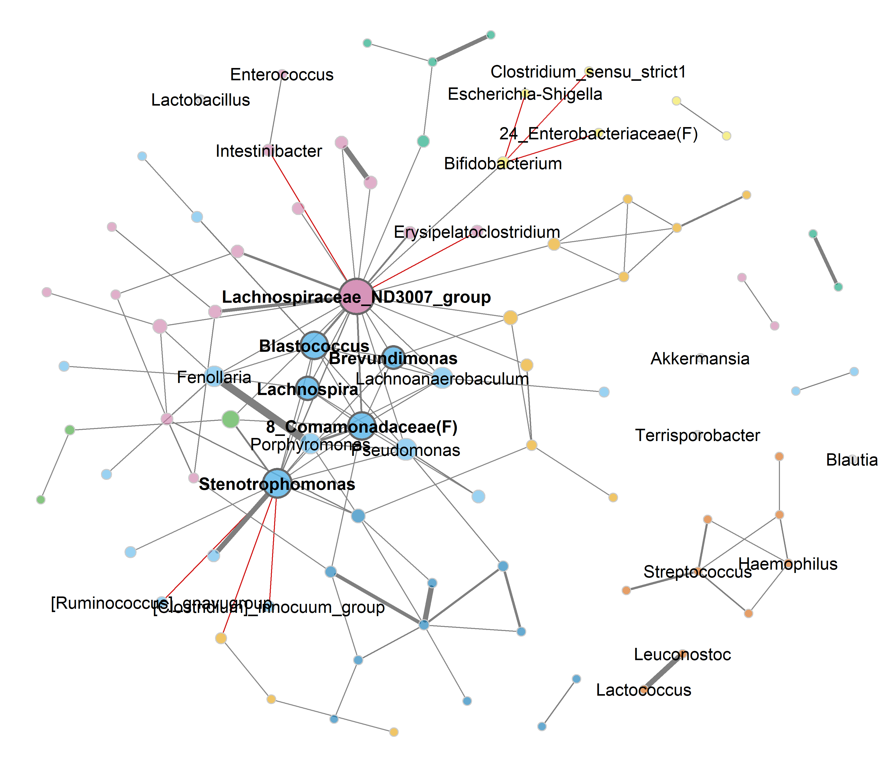
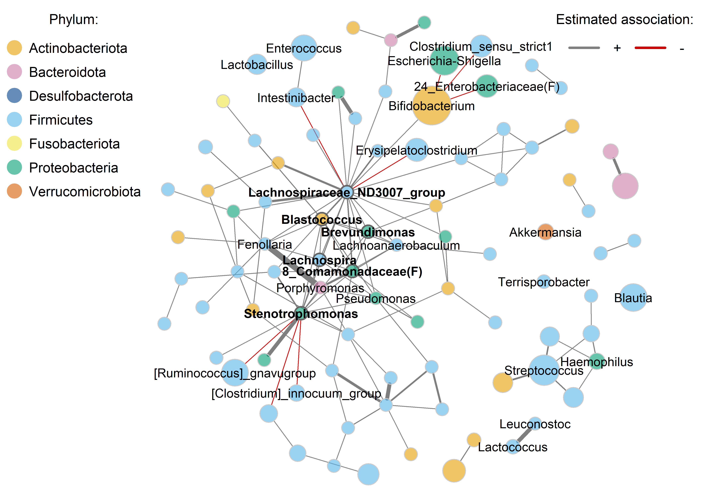
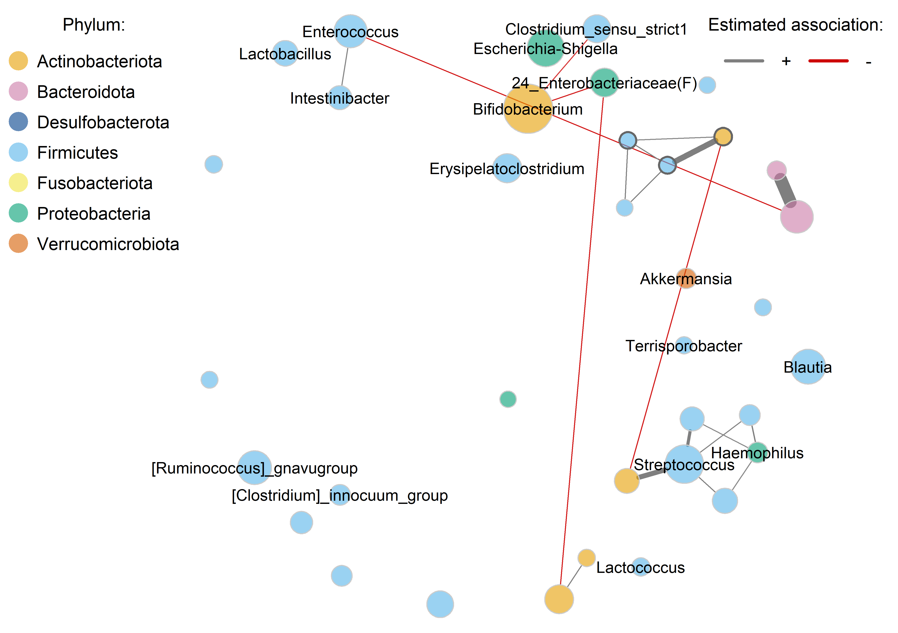
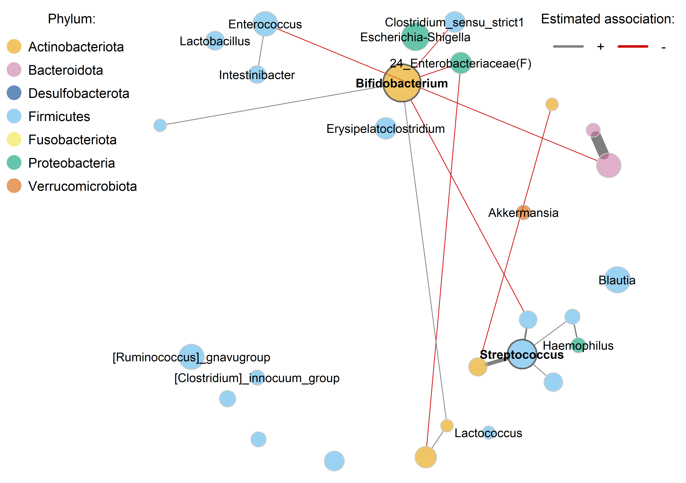
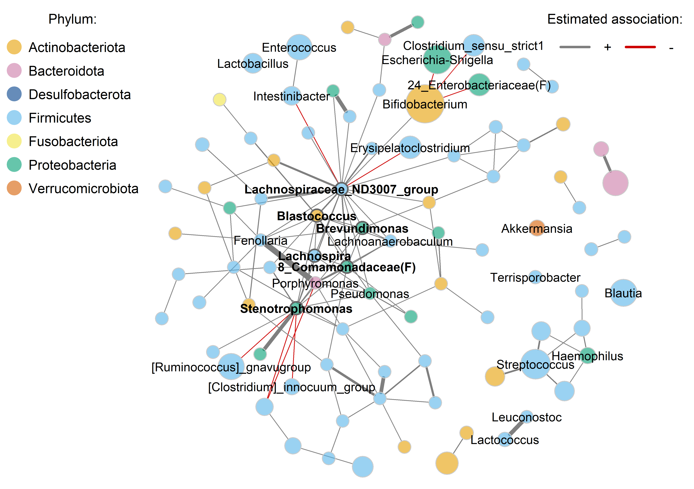
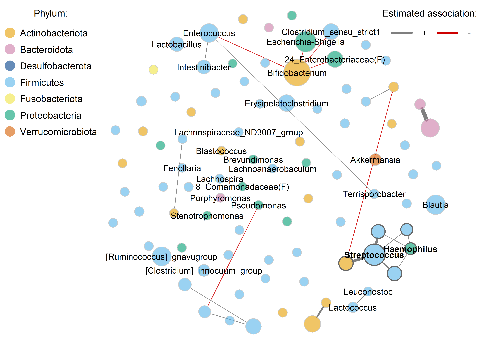
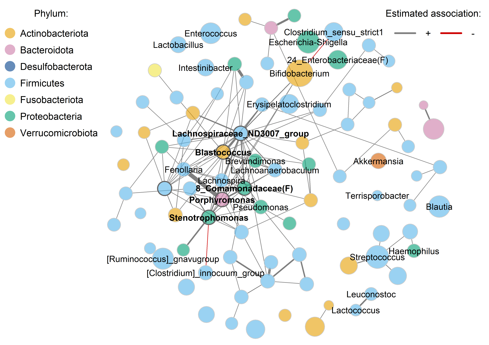
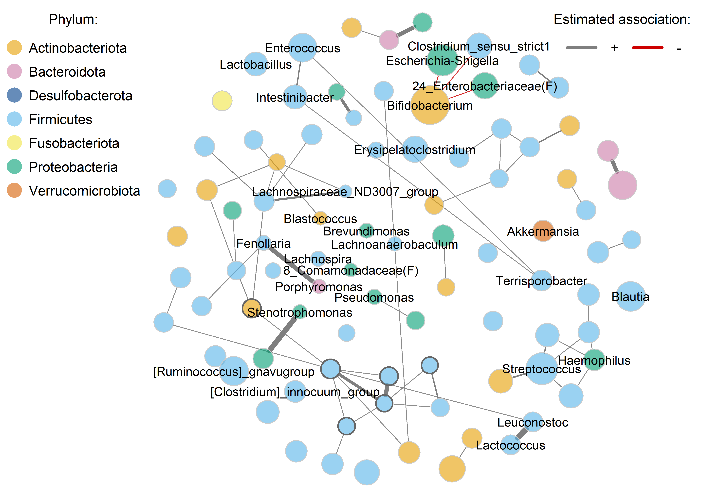
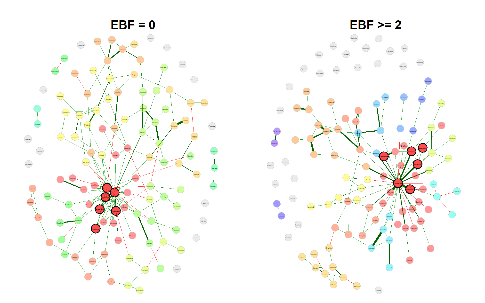

Network analysis
================
Compiled at 2026-06-25 21:00:52 UTC

## Aim

This script contains the network analyses for the application chapter.
The first part builds one complete network on the filtered genus-level
data and evaluates how sensitive the resulting network is to common
preprocessing and association choices. The complete-network analysis
will compare the standard preprocessing approach with the final method
used in this thesis, and then vary one component at a time: zero
replacement, normalization, and association measure.

The second part will compare networks between the two main exclusive
breastfeeding groups used throughout this chapter, `EBF duration = 0`
and `EBF duration >=2`. The network-comparison analysis will contrast
the classical empirical permutation results with `permApprox`-refined
p-values. For the `permApprox` analysis we will fit both the
unconstrained approximation and the proposed constrained version, so
that the unconstrained fit can be used to inspect how many zero-valued
permutation statistics would be expected without the constraint.

## Set global parameters

## Load data

### Phyloseq object on genus level

    ## phyloseq-class experiment-level object
    ## otu_table()   OTU Table:         [ 117 taxa and 592 samples ]
    ## sample_data() Sample Data:       [ 592 samples by 9 sample variables ]
    ## tax_table()   Taxonomy Table:    [ 117 taxa by 7 taxonomic ranks ]

## Helper functions

## Prepare data

The network analyses use the same filtered genus-level object as the
differential abundance and differential distribution analyses. Counts
are represented as a samples-by-taxa matrix. Relative abundances are
prepared here because several network workflows use them directly.

Since SpiecEasi does only provide pseudo count zero replacement, we need
to apply zero replacement with multRepl beforehand.

    ## # A tibble: 1 × 7
    ##   n_samples n_taxa min_library_size median_library_size max_library_size zero_fraction_orig zero_fraction_repl
    ##       <int>  <int>            <dbl>               <dbl>            <dbl>              <dbl>              <dbl>
    ## 1       592    117             1456              21898.            69556              0.796                  0

Value imputed by multiplicative replacement: 1.8689976^{-5}.

Rename taxonomic table and make rank Genus unique.

    ## Column 7 contains NAs only and is ignored.

## Complete network with standard preprocessing

This section will estimate the complete genus-level network using the
final preprocessing and association pipeline selected for the thesis.
The resulting object should be saved to the target directory and reused
by downstream summary tables and figures.

The preprocessing approach used throughout the thesis is:

1.  Transform counts to relative abundances
2.  Perform multiplicative zero replacement
3.  Perform CLR transformation

### Network construction

### Network analysis

#### Association heatmap

**For all taxa**

<!-- -->

**For non-singletons only**

<!-- -->

#### Association histogram

<!-- -->

    ## Entries in the lower triangle: 6786

    ## 
    ## Non-zero entries in the lower triangle: 124

#### Degree distribution

<!-- -->

#### Analysis with netAnalyze()

    ## 
    ## Component sizes
    ## ```````````````               
    ## size: 67 7 2  1
    ##    #:  1 1 6 31
    ## ______________________________
    ## Global network properties
    ## `````````````````````````
    ## Largest connected component (LCC):
    ##                                  
    ## Relative LCC size         0.57265
    ## Clustering coefficient    0.29647
    ## Modularity                0.52002
    ## Positive edge percentage 92.72727
    ## Edge density              0.04975
    ## Natural connectivity      0.01905
    ## Vertex connectivity       1.00000
    ## Edge connectivity         1.00000
    ## Average dissimilarity*    0.98455
    ## Average path length**     2.32219
    ## 
    ## Whole network:
    ##                                  
    ## Number of components     39.00000
    ## Clustering coefficient    0.26493
    ## Modularity                0.59308
    ## Positive edge percentage 93.54839
    ## Edge density              0.01827
    ## Natural connectivity      0.01006
    ## -----
    ## *: Dissimilarity = 1 - edge weight
    ## **: Path length = Units with average dissimilarity
    ## 
    ## ______________________________
    ## Clusters
    ## - In the whole network
    ## - Algorithm: cluster_fast_greedy
    ## ```````````````````````````````` 
    ##                                               
    ## name:  0 1  2 3  4 5 6 7 8 9 10 11 12 13 14 15
    ##    #: 31 9 16 4 19 9 4 7 3 3  2  2  2  2  2  2
    ## 
    ## ______________________________
    ## Hubs
    ## - In alphabetical/numerical order
    ## - Based on empirical quantiles of centralities
    ## ```````````````````````````````````````````````                             
    ##  8_Comamonadaceae(F)         
    ##  Blastococcus                
    ##  Brevundimonas               
    ##  Lachnospira                 
    ##  Lachnospiraceae_ND3007_group
    ##  Stenotrophomonas            
    ## 
    ## ______________________________
    ## Centrality measures
    ## - In decreasing order
    ## - Centrality of disconnected components is zero
    ## ````````````````````````````````````````````````
    ## Degree (unnormalized):
    ##                                 
    ## Lachnospiraceae_ND3007_group  23
    ## Stenotrophomonas              14
    ## 8_Comamonadaceae(F)           10
    ## Blastococcus                   9
    ## Fenollaria                     8
    ## Christensenellaceae_R-7_group  7
    ## Pseudomonas                    7
    ## Brevundimonas                  6
    ## Porphyromonas                  6
    ## Monoglobus                     6
    ## 
    ## Betweenness centrality (unnormalized):
    ##                                   
    ## Lachnospiraceae_ND3007_group  1384
    ## Stenotrophomonas               528
    ## 8_Comamonadaceae(F)            238
    ## Fenollaria                     194
    ## Bifidobacterium                192
    ## Phascolarctobacterium          189
    ## Monoglobus                     184
    ## Peptostreptococcus             175
    ## Lachnospiraceae_NK4A136_group  164
    ## Blastococcus                   137
    ## 
    ## Closeness centrality (unnormalized):
    ##                                      
    ## Lachnospiraceae_ND3007_group 59.96977
    ## Stenotrophomonas             50.60785
    ## 8_Comamonadaceae(F)          47.41856
    ## Blastococcus                 46.53516
    ## Fenollaria                   44.32539
    ## Pseudomonas                  43.96794
    ## Lachnospira                  43.32065
    ## Brevundimonas                43.08809
    ## Porphyromonas                41.66311
    ## Lachnoanaerobaculum          41.43020
    ## 
    ## Eigenvector centrality (unnormalized):
    ##                                     
    ## Lachnospiraceae_ND3007_group 0.46266
    ## Stenotrophomonas             0.34617
    ## Blastococcus                 0.32518
    ## 8_Comamonadaceae(F)          0.32387
    ## Lachnospira                  0.25236
    ## Brevundimonas                0.23924
    ## Pseudomonas                  0.23011
    ## Lachnoanaerobaculum          0.21844
    ## Porphyromonas                0.21102
    ## Fenollaria                   0.21002

### Graphlet correlation matrix

<!-- -->

### Network plot

In the network plot, the following taxa are labelled:

- Taxa that appeared in the differential association analysis as well as
  the differential distribution analysis.
- Most central taxa with respect to eigenvector centrality.
- The three taxa with a negative correlation to Bifidobacterium

#### Node colors: clusters; node size: eigenvector centrality

<!-- -->

#### Nodes colored by phyla

    ## phyla
    ##  Actinobacteriota      Bacteroidota  Desulfobacterota        Firmicutes    Fusobacteriota    Proteobacteria Verrucomicrobiota 
    ##                19                 6                 1                75                 1                14                 1

<!-- -->

## Alternative preprocessing steps

In this section we analyze, how the network changes when alternative
preprocessing steps like filtering or zero replacement, or a different
association measure is used.

### Stronger filtering

In the network above, a prevalence filter of 1% was used. We now
increase this to 5% and 10%. Everything else stays the same.

#### 5% prevalence filter

<!-- -->

#### 10% prevalence filter

<!-- -->

### Different zero replacement

In this section, we construct the network with the following zero
replacement methods:

- pseudo count added to all counts (as example for what is not
  recommended)
- random pseudo counts below the detection limit
- alrEM
- Bayesian-multiplicative replacement

For all four methods, zero replacement is applied externally via
`compute_zero_repl_clr()` before passing the result to `netConstruct()`
with `zeroMethod = "none"`. This ensures the stored `countMat1` in each
network object reflects the actual zero-treated data, so that CLR-based
node sizes are computed from the correct matrix (see analysis of node
size behaviour above).

**Minimum relative count and multRepl replacement value for reference**

    ## [1] 2.875381e-05

    ## [1] 1.868998e-05

We use 2e-5 as pseudo count to have a round number close to the multRepl
replacement value.

#### Prepare zero-replaced matrices

#### Additive pseudo count

<!-- -->

#### Random pseudo counts

<!-- -->

#### Modified EM ALR algorithm

<!-- -->

#### Bayesian-multiplicative replacement

<!-- -->

## Network comparison by EBF duration

### Analysis data set

The group comparison uses the two EBF groups that define the main
contrast in this chapter: no exclusive breastfeeding and exclusive
breastfeeding for at least two months. Samples with one month of
exclusive breastfeeding are excluded from this comparison.

### Network construction

### Network analysis

#### Association histogram

<!-- -->

#### Degree distribution

<!-- -->

#### Analysis with netAnalyze()

### Graphlet correlation matrix

<!-- -->

### Network plot

<!-- -->

### Generate permuted association matrices

The combined matrix has 117000 rows and 234 columns, which is plausible
because:

- n_rows = nPerm_all \* n_taxa = 1000 \* 117
- n_cols = n_groups \* n_taxa \* 2 \* 117

We performed 1000 permutations, but want only 999 to get a round minimum
possible p-value. We therefore reduce the matrix to 999 \* 117 = 116883
rows.

### Differential network analysis

We start by comparing local and global network characteristics between
the two groups. This is done with NetCoMi’ `netCompare()` function.

The statistical tests will be based on three different types of
p-values:

- Empirical p-values
- Empirical p-values with permApprox refinement (without support
  constraints)
- Empirical p-values with permApprox refinement (with support
  constraints)

#### Empirical p-values

    ## 
    ## Comparison of Network Properties
    ## ----------------------------------
    ## CALL: 
    ## netCompare(x = props_ebf_main, permTest = TRUE, verbose = TRUE, 
    ##     nPerm = 999, adjust = "none", cores = 10, seed = 42, fileLoadAssoPerm = path_target("assoPerm_ebf"))
    ## 
    ## ______________________________
    ## Global network properties
    ## `````````````````````````
    ## Largest connected component (LCC):
    ##                          EBF = 0   EBF >= 2    abs.diff.     p-value  
    ## Relative LCC size          0.821      0.752        0.068    0.919000  
    ## Clustering coefficient     0.228      0.307        0.078    0.451000  
    ## Modularity                 0.565      0.606        0.041    0.586000  
    ## Positive edge percentage  87.500     88.333        0.833    0.944000  
    ## Edge density               0.035      0.031        0.004    0.649000  
    ## Natural connectivity       0.013      0.014        0.001    0.925000  
    ## Vertex connectivity        1.000      1.000        0.000    1.000000  
    ## Edge connectivity          1.000      1.000        0.000    1.000000  
    ## Average dissimilarity*     0.989      0.990        0.001    0.638000  
    ## Average path length**      2.699      2.744        0.045    0.871000  
    ## 
    ## Whole network:
    ##                          EBF = 0   EBF >= 2    abs.diff.     p-value  
    ## Number of components      18.000     28.000       10.000    0.878000  
    ## Clustering coefficient     0.225      0.307        0.082    0.397000  
    ## Modularity                 0.580      0.616        0.036    0.684000  
    ## Positive edge percentage  87.195     88.525        1.329    0.914000  
    ## Edge density               0.024      0.018        0.006    0.734000  
    ## Natural connectivity       0.011      0.010        0.001    0.664000  
    ## -----
    ## p-values: one-tailed test with null hypothesis diff=0
    ##  *: Dissimilarity = 1 - edge weight
    ## **: Path length = Units with average dissimilarity
    ## 
    ## ______________________________
    ## Jaccard index (similarity betw. sets of most central nodes)
    ## ```````````````````````````````````````````````````````````
    ##                     Jacc   P(<=Jacc)     P(>=Jacc)   
    ## degree             0.162    0.016858 *    0.994229   
    ## betweenness centr. 0.233    0.105225      0.944948   
    ## closeness centr.   0.261    0.188847      0.886577   
    ## eigenvec. centr.   0.289    0.322858      0.783278   
    ## hub taxa           0.091    0.075147 .    0.988439   
    ## -----
    ## Jaccard index in [0,1] (1 indicates perfect agreement)
    ## 
    ## ______________________________
    ## Adjusted Rand index (similarity betw. clusterings)
    ## ``````````````````````````````````````````````````
    ##         wholeNet       LCC
    ## ARI        0.057     0.054
    ## p-value 0.001000  0.002000
    ## -----
    ## ARI in [-1,1] with ARI=1: perfect agreement betw. clusterings
    ##                    ARI=0: expected for two random clusterings
    ## p-value: permutation test (n=1000) with null hypothesis ARI=0
    ## 
    ## ______________________________
    ## Graphlet Correlation Distance
    ## `````````````````````````````
    ##         wholeNet         LCC    
    ## GCD        1.111       2.051    
    ## p-value 0.254000    0.069000 .  
    ## -----
    ## GCD >= 0 (GCD=0 indicates perfect agreement between GCMs)
    ## p-value: permutation test with null hypothesis GCD=0
    ## 
    ## ______________________________
    ## Centrality measures
    ## - In decreasing order
    ## - Centrality of disconnected components is zero
    ## ````````````````````````````````````````````````
    ## Degree (unnormalized):
    ##                                     EBF = 0 EBF >= 2 abs.diff. adj.p-value    
    ## Coprobacillus                             1       39        38    0.002000 ** 
    ## Lachnospiraceae_ND3007_group             26        1        25    0.231000    
    ## [Eubacterium]_coprostanoligenegroup      21        2        19    0.006000 ** 
    ## 9_Pasteurellaceae(F)                     16        2        14    0.181000    
    ## Pseudomonas                              10        4         6    0.072000 .  
    ## 
    ## Betweenness centrality (unnormalized):
    ##                              EBF = 0 EBF >= 2 abs.diff. adj.p-value    
    ## Coprobacillus                      0     3128      3128    0.017000 *  
    ## Lachnospiraceae_ND3007_group    2838        0      2838    0.125000    
    ## Peptostreptococcus                20      671       651    0.075000 .  
    ## Lachnoanaerobaculum              641        0       641    0.053000 .  
    ## Halomonas                        602        0       602    0.034000 *  
    ## 
    ## Closeness centrality (unnormalized):
    ##                              EBF = 0 EBF >= 2 abs.diff. adj.p-value    
    ## Scardovia                     51.834    0.000    51.834    0.086000 .  
    ## [Clostridium]_innocuum_group  51.430    0.000    51.430    0.287000    
    ## Coprobacillus                 33.408   84.108    50.700    0.056000 .  
    ## Libanicoccus                  50.015    0.000    50.015    0.127000    
    ## Collinsella                    0.000   48.181    48.181    0.361000    
    ## 
    ## _________________________________________________________
    ## Significance codes: ***: 0.001, **: 0.01, *: 0.05, .: 0.1

    ##    Min. 1st Qu.  Median    Mean 3rd Qu.    Max. 
    ##  0.0020  0.2490  0.5200  0.5389  0.8770  1.0000

    ## 
    ## Comparison of Network Properties
    ## ----------------------------------
    ## CALL: 
    ## netCompare(x = props_ebf_main, permTest = TRUE, verbose = TRUE, 
    ##     nPerm = 999, adjust = "BH", cores = 10, seed = 42, fileLoadAssoPerm = path_target("assoPerm_ebf"))
    ## 
    ## ______________________________
    ## Global network properties
    ## `````````````````````````
    ## Largest connected component (LCC):
    ##                          EBF = 0   EBF >= 2    abs.diff.     p-value  
    ## Relative LCC size          0.821      0.752        0.068    0.919000  
    ## Clustering coefficient     0.228      0.307        0.078    0.451000  
    ## Modularity                 0.565      0.606        0.041    0.586000  
    ## Positive edge percentage  87.500     88.333        0.833    0.944000  
    ## Edge density               0.035      0.031        0.004    0.649000  
    ## Natural connectivity       0.013      0.014        0.001    0.925000  
    ## Vertex connectivity        1.000      1.000        0.000    1.000000  
    ## Edge connectivity          1.000      1.000        0.000    1.000000  
    ## Average dissimilarity*     0.989      0.990        0.001    0.638000  
    ## Average path length**      2.699      2.744        0.045    0.871000  
    ## 
    ## Whole network:
    ##                          EBF = 0   EBF >= 2    abs.diff.     p-value  
    ## Number of components      18.000     28.000       10.000    0.878000  
    ## Clustering coefficient     0.225      0.307        0.082    0.397000  
    ## Modularity                 0.580      0.616        0.036    0.684000  
    ## Positive edge percentage  87.195     88.525        1.329    0.914000  
    ## Edge density               0.024      0.018        0.006    0.734000  
    ## Natural connectivity       0.011      0.010        0.001    0.664000  
    ## -----
    ## p-values: one-tailed test with null hypothesis diff=0
    ##  *: Dissimilarity = 1 - edge weight
    ## **: Path length = Units with average dissimilarity
    ## 
    ## ______________________________
    ## Jaccard index (similarity betw. sets of most central nodes)
    ## ```````````````````````````````````````````````````````````
    ##                     Jacc   P(<=Jacc)     P(>=Jacc)   
    ## degree             0.162    0.016858 *    0.994229   
    ## betweenness centr. 0.233    0.105225      0.944948   
    ## closeness centr.   0.261    0.188847      0.886577   
    ## eigenvec. centr.   0.289    0.322858      0.783278   
    ## hub taxa           0.091    0.075147 .    0.988439   
    ## -----
    ## Jaccard index in [0,1] (1 indicates perfect agreement)
    ## 
    ## ______________________________
    ## Adjusted Rand index (similarity betw. clusterings)
    ## ``````````````````````````````````````````````````
    ##         wholeNet       LCC
    ## ARI        0.057     0.054
    ## p-value 0.001000  0.002000
    ## -----
    ## ARI in [-1,1] with ARI=1: perfect agreement betw. clusterings
    ##                    ARI=0: expected for two random clusterings
    ## p-value: permutation test (n=1000) with null hypothesis ARI=0
    ## 
    ## ______________________________
    ## Graphlet Correlation Distance
    ## `````````````````````````````
    ##         wholeNet         LCC    
    ## GCD        1.111       2.051    
    ## p-value 0.254000    0.069000 .  
    ## -----
    ## GCD >= 0 (GCD=0 indicates perfect agreement between GCMs)
    ## p-value: permutation test with null hypothesis GCD=0
    ## 
    ## ______________________________
    ## Centrality measures
    ## - In decreasing order
    ## - Centrality of disconnected components is zero
    ## ````````````````````````````````````````````````
    ## Degree (unnormalized):
    ##                                     EBF = 0 EBF >= 2 abs.diff. adj.p-value  
    ## Coprobacillus                             1       39        38    0.234000  
    ## Lachnospiraceae_ND3007_group             26        1        25    1.000000  
    ## [Eubacterium]_coprostanoligenegroup      21        2        19    0.351000  
    ## 9_Pasteurellaceae(F)                     16        2        14    1.000000  
    ## Pseudomonas                              10        4         6    1.000000  
    ## 
    ## Betweenness centrality (unnormalized):
    ##                              EBF = 0 EBF >= 2 abs.diff. adj.p-value  
    ## Coprobacillus                      0     3128      3128    0.585000  
    ## Lachnospiraceae_ND3007_group    2838        0      2838    0.812500  
    ## Peptostreptococcus                20      671       651    0.585000  
    ## Lachnoanaerobaculum              641        0       641    0.585000  
    ## Halomonas                        602        0       602    0.585000  
    ## 
    ## Closeness centrality (unnormalized):
    ##                              EBF = 0 EBF >= 2 abs.diff. adj.p-value  
    ## Scardovia                     51.834    0.000    51.834    1.000000  
    ## [Clostridium]_innocuum_group  51.430    0.000    51.430    1.000000  
    ## Coprobacillus                 33.408   84.108    50.700    1.000000  
    ## Libanicoccus                  50.015    0.000    50.015    1.000000  
    ## Collinsella                    0.000   48.181    48.181    1.000000  
    ## 
    ## _________________________________________________________
    ## Significance codes: ***: 0.001, **: 0.01, *: 0.05, .: 0.1

#### permApprox refinement without constraint

    ## 
    ## Comparison of Network Properties
    ## ----------------------------------
    ## CALL: 
    ## netCompare(x = props_ebf_main, permTest = TRUE, verbose = TRUE, 
    ##     nPerm = 999, refinePermPvals = TRUE, permApproxParams = list(method = "gpd", 
    ##         gpd_ctrl = gpd_ctrl), adjust = "none", cores = 10, seed = 42, 
    ##     fileLoadAssoPerm = path_target("assoPerm_ebf"))
    ## 
    ## ______________________________
    ## Global network properties
    ## `````````````````````````
    ## Largest connected component (LCC):
    ##                          EBF = 0   EBF >= 2    abs.diff.     p-value  
    ## Relative LCC size          0.821      0.752        0.068    0.919000  
    ## Clustering coefficient     0.228      0.307        0.078    0.451000  
    ## Modularity                 0.565      0.606        0.041    0.586000  
    ## Positive edge percentage  87.500     88.333        0.833    0.944000  
    ## Edge density               0.035      0.031        0.004    0.649000  
    ## Natural connectivity       0.013      0.014        0.001    0.925000  
    ## Vertex connectivity        1.000      1.000        0.000    1.000000  
    ## Edge connectivity          1.000      1.000        0.000    1.000000  
    ## Average dissimilarity*     0.989      0.990        0.001    0.638000  
    ## Average path length**      2.699      2.744        0.045    0.871000  
    ## 
    ## Whole network:
    ##                          EBF = 0   EBF >= 2    abs.diff.     p-value  
    ## Number of components      18.000     28.000       10.000    0.878000  
    ## Clustering coefficient     0.225      0.307        0.082    0.397000  
    ## Modularity                 0.580      0.616        0.036    0.684000  
    ## Positive edge percentage  87.195     88.525        1.329    0.914000  
    ## Edge density               0.024      0.018        0.006    0.734000  
    ## Natural connectivity       0.011      0.010        0.001    0.664000  
    ## -----
    ## p-values: one-tailed test with null hypothesis diff=0
    ##  *: Dissimilarity = 1 - edge weight
    ## **: Path length = Units with average dissimilarity
    ## 
    ## ______________________________
    ## Jaccard index (similarity betw. sets of most central nodes)
    ## ```````````````````````````````````````````````````````````
    ##                     Jacc   P(<=Jacc)     P(>=Jacc)   
    ## degree             0.162    0.016858 *    0.994229   
    ## betweenness centr. 0.233    0.105225      0.944948   
    ## closeness centr.   0.261    0.188847      0.886577   
    ## eigenvec. centr.   0.289    0.322858      0.783278   
    ## hub taxa           0.091    0.075147 .    0.988439   
    ## -----
    ## Jaccard index in [0,1] (1 indicates perfect agreement)
    ## 
    ## ______________________________
    ## Adjusted Rand index (similarity betw. clusterings)
    ## ``````````````````````````````````````````````````
    ##         wholeNet       LCC
    ## ARI        0.057     0.054
    ## p-value 0.001998  0.002997
    ## -----
    ## ARI in [-1,1] with ARI=1: perfect agreement betw. clusterings
    ##                    ARI=0: expected for two random clusterings
    ## p-value: permutation test (n=1000) with null hypothesis ARI=0
    ## 
    ## ______________________________
    ## Graphlet Correlation Distance
    ## `````````````````````````````
    ##         wholeNet         LCC    
    ## GCD        1.111       2.051    
    ## p-value 0.254000    0.065926 .  
    ## -----
    ## GCD >= 0 (GCD=0 indicates perfect agreement between GCMs)
    ## p-value: permutation test with null hypothesis GCD=0
    ## 
    ## ______________________________
    ## Centrality measures
    ## - In decreasing order
    ## - Centrality of disconnected components is zero
    ## ````````````````````````````````````````````````
    ## Degree (unnormalized):
    ##                                     EBF = 0 EBF >= 2 abs.diff. adj.p-value    
    ## Coprobacillus                             1       39        38    0.002000 ** 
    ## Lachnospiraceae_ND3007_group             26        1        25    0.231000    
    ## [Eubacterium]_coprostanoligenegroup      21        2        19    0.006000 ** 
    ## 9_Pasteurellaceae(F)                     16        2        14    0.181000    
    ## Pseudomonas                              10        4         6    0.072000 .  
    ## 
    ## Betweenness centrality (unnormalized):
    ##                              EBF = 0 EBF >= 2 abs.diff. adj.p-value    
    ## Coprobacillus                      0     3128      3128    0.015482 *  
    ## Lachnospiraceae_ND3007_group    2838        0      2838    0.125000    
    ## Peptostreptococcus                20      671       651    0.075000 .  
    ## Lachnoanaerobaculum              641        0       641    0.061160 .  
    ## Halomonas                        602        0       602    0.033742 *  
    ## 
    ## Closeness centrality (unnormalized):
    ##                              EBF = 0 EBF >= 2 abs.diff. adj.p-value    
    ## Scardovia                     51.834    0.000    51.834    0.086810 .  
    ## [Clostridium]_innocuum_group  51.430    0.000    51.430    0.287000    
    ## Coprobacillus                 33.408   84.108    50.700    0.052141 .  
    ## Libanicoccus                  50.015    0.000    50.015    0.127000    
    ## Collinsella                    0.000   48.181    48.181    0.361000    
    ## 
    ## _________________________________________________________
    ## Significance codes: ***: 0.001, **: 0.01, *: 0.05, .: 0.1

    ## 
    ## Comparison of Network Properties
    ## ----------------------------------
    ## CALL: 
    ## netCompare(x = props_ebf_main, permTest = TRUE, verbose = TRUE, 
    ##     nPerm = 999, refinePermPvals = TRUE, permApproxParams = list(method = "gpd", 
    ##         gpd_ctrl = gpd_ctrl), adjust = "BH", cores = 10, seed = 42, 
    ##     fileLoadAssoPerm = path_target("assoPerm_ebf"))
    ## 
    ## ______________________________
    ## Global network properties
    ## `````````````````````````
    ## Largest connected component (LCC):
    ##                          EBF = 0   EBF >= 2    abs.diff.     p-value  
    ## Relative LCC size          0.821      0.752        0.068    0.919000  
    ## Clustering coefficient     0.228      0.307        0.078    0.451000  
    ## Modularity                 0.565      0.606        0.041    0.586000  
    ## Positive edge percentage  87.500     88.333        0.833    0.944000  
    ## Edge density               0.035      0.031        0.004    0.649000  
    ## Natural connectivity       0.013      0.014        0.001    0.925000  
    ## Vertex connectivity        1.000      1.000        0.000    1.000000  
    ## Edge connectivity          1.000      1.000        0.000    1.000000  
    ## Average dissimilarity*     0.989      0.990        0.001    0.638000  
    ## Average path length**      2.699      2.744        0.045    0.871000  
    ## 
    ## Whole network:
    ##                          EBF = 0   EBF >= 2    abs.diff.     p-value  
    ## Number of components      18.000     28.000       10.000    0.878000  
    ## Clustering coefficient     0.225      0.307        0.082    0.397000  
    ## Modularity                 0.580      0.616        0.036    0.684000  
    ## Positive edge percentage  87.195     88.525        1.329    0.914000  
    ## Edge density               0.024      0.018        0.006    0.734000  
    ## Natural connectivity       0.011      0.010        0.001    0.664000  
    ## -----
    ## p-values: one-tailed test with null hypothesis diff=0
    ##  *: Dissimilarity = 1 - edge weight
    ## **: Path length = Units with average dissimilarity
    ## 
    ## ______________________________
    ## Jaccard index (similarity betw. sets of most central nodes)
    ## ```````````````````````````````````````````````````````````
    ##                     Jacc   P(<=Jacc)     P(>=Jacc)   
    ## degree             0.162    0.016858 *    0.994229   
    ## betweenness centr. 0.233    0.105225      0.944948   
    ## closeness centr.   0.261    0.188847      0.886577   
    ## eigenvec. centr.   0.289    0.322858      0.783278   
    ## hub taxa           0.091    0.075147 .    0.988439   
    ## -----
    ## Jaccard index in [0,1] (1 indicates perfect agreement)
    ## 
    ## ______________________________
    ## Adjusted Rand index (similarity betw. clusterings)
    ## ``````````````````````````````````````````````````
    ##         wholeNet       LCC
    ## ARI        0.057     0.054
    ## p-value 0.001998  0.002997
    ## -----
    ## ARI in [-1,1] with ARI=1: perfect agreement betw. clusterings
    ##                    ARI=0: expected for two random clusterings
    ## p-value: permutation test (n=1000) with null hypothesis ARI=0
    ## 
    ## ______________________________
    ## Graphlet Correlation Distance
    ## `````````````````````````````
    ##         wholeNet         LCC    
    ## GCD        1.111       2.051    
    ## p-value 0.254000    0.065926 .  
    ## -----
    ## GCD >= 0 (GCD=0 indicates perfect agreement between GCMs)
    ## p-value: permutation test with null hypothesis GCD=0
    ## 
    ## ______________________________
    ## Centrality measures
    ## - In decreasing order
    ## - Centrality of disconnected components is zero
    ## ````````````````````````````````````````````````
    ## Degree (unnormalized):
    ##                                     EBF = 0 EBF >= 2 abs.diff. adj.p-value  
    ## Coprobacillus                             1       39        38    0.234000  
    ## Lachnospiraceae_ND3007_group             26        1        25    1.000000  
    ## [Eubacterium]_coprostanoligenegroup      21        2        19    0.351000  
    ## 9_Pasteurellaceae(F)                     16        2        14    1.000000  
    ## Pseudomonas                              10        4         6    1.000000  
    ## 
    ## Betweenness centrality (unnormalized):
    ##                              EBF = 0 EBF >= 2 abs.diff. adj.p-value  
    ## Coprobacillus                      0     3128      3128    0.585000  
    ## Lachnospiraceae_ND3007_group    2838        0      2838    0.812500  
    ## Peptostreptococcus                20      671       651    0.585000  
    ## Lachnoanaerobaculum              641        0       641    0.585000  
    ## Halomonas                        602        0       602    0.585000  
    ## 
    ## Closeness centrality (unnormalized):
    ##                              EBF = 0 EBF >= 2 abs.diff. adj.p-value  
    ## Scardovia                     51.834    0.000    51.834    1.000000  
    ## [Clostridium]_innocuum_group  51.430    0.000    51.430    1.000000  
    ## Coprobacillus                 33.408   84.108    50.700    1.000000  
    ## Libanicoccus                  50.015    0.000    50.015    1.000000  
    ## Collinsella                    0.000   48.181    48.181    1.000000  
    ## 
    ## _________________________________________________________
    ## Significance codes: ***: 0.001, **: 0.01, *: 0.05, .: 0.1

    ##    Min. 1st Qu.  Median    Mean 3rd Qu.    Max. 
    ##  0.0020  0.2490  0.5200  0.5389  0.8770  1.0000

#### permApprox refinement with constraint

    ## 
    ## Comparison of Network Properties
    ## ----------------------------------
    ## CALL: 
    ## netCompare(x = props_ebf_main, permTest = TRUE, verbose = TRUE, 
    ##     nPerm = 999, refinePermPvals = TRUE, permApproxParams = list(method = "gpd", 
    ##         gpd_ctrl = gpd_ctrl), adjust = "none", cores = 10, seed = 42, 
    ##     fileLoadAssoPerm = path_target("assoPerm_ebf"))
    ## 
    ## ______________________________
    ## Global network properties
    ## `````````````````````````
    ## Largest connected component (LCC):
    ##                          EBF = 0   EBF >= 2    abs.diff.     p-value  
    ## Relative LCC size          0.821      0.752        0.068    0.919000  
    ## Clustering coefficient     0.228      0.307        0.078    0.451000  
    ## Modularity                 0.565      0.606        0.041    0.586000  
    ## Positive edge percentage  87.500     88.333        0.833    0.944000  
    ## Edge density               0.035      0.031        0.004    0.649000  
    ## Natural connectivity       0.013      0.014        0.001    0.925000  
    ## Vertex connectivity        1.000      1.000        0.000    1.000000  
    ## Edge connectivity          1.000      1.000        0.000    1.000000  
    ## Average dissimilarity*     0.989      0.990        0.001    0.638000  
    ## Average path length**      2.699      2.744        0.045    0.871000  
    ## 
    ## Whole network:
    ##                          EBF = 0   EBF >= 2    abs.diff.     p-value  
    ## Number of components      18.000     28.000       10.000    0.878000  
    ## Clustering coefficient     0.225      0.307        0.082    0.397000  
    ## Modularity                 0.580      0.616        0.036    0.684000  
    ## Positive edge percentage  87.195     88.525        1.329    0.914000  
    ## Edge density               0.024      0.018        0.006    0.734000  
    ## Natural connectivity       0.011      0.010        0.001    0.664000  
    ## -----
    ## p-values: one-tailed test with null hypothesis diff=0
    ##  *: Dissimilarity = 1 - edge weight
    ## **: Path length = Units with average dissimilarity
    ## 
    ## ______________________________
    ## Jaccard index (similarity betw. sets of most central nodes)
    ## ```````````````````````````````````````````````````````````
    ##                     Jacc   P(<=Jacc)     P(>=Jacc)   
    ## degree             0.162    0.016858 *    0.994229   
    ## betweenness centr. 0.233    0.105225      0.944948   
    ## closeness centr.   0.261    0.188847      0.886577   
    ## eigenvec. centr.   0.289    0.322858      0.783278   
    ## hub taxa           0.091    0.075147 .    0.988439   
    ## -----
    ## Jaccard index in [0,1] (1 indicates perfect agreement)
    ## 
    ## ______________________________
    ## Adjusted Rand index (similarity betw. clusterings)
    ## ``````````````````````````````````````````````````
    ##         wholeNet       LCC
    ## ARI        0.057     0.054
    ## p-value 0.001998  0.002997
    ## -----
    ## ARI in [-1,1] with ARI=1: perfect agreement betw. clusterings
    ##                    ARI=0: expected for two random clusterings
    ## p-value: permutation test (n=1000) with null hypothesis ARI=0
    ## 
    ## ______________________________
    ## Graphlet Correlation Distance
    ## `````````````````````````````
    ##         wholeNet         LCC    
    ## GCD        1.111       2.051    
    ## p-value 0.254000    0.065926 .  
    ## -----
    ## GCD >= 0 (GCD=0 indicates perfect agreement between GCMs)
    ## p-value: permutation test with null hypothesis GCD=0
    ## 
    ## ______________________________
    ## Centrality measures
    ## - In decreasing order
    ## - Centrality of disconnected components is zero
    ## ````````````````````````````````````````````````
    ## Degree (unnormalized):
    ##                                     EBF = 0 EBF >= 2 abs.diff. adj.p-value    
    ## Coprobacillus                             1       39        38    0.002000 ** 
    ## Lachnospiraceae_ND3007_group             26        1        25    0.231000    
    ## [Eubacterium]_coprostanoligenegroup      21        2        19    0.006000 ** 
    ## 9_Pasteurellaceae(F)                     16        2        14    0.181000    
    ## Pseudomonas                              10        4         6    0.072000 .  
    ## 
    ## Betweenness centrality (unnormalized):
    ##                              EBF = 0 EBF >= 2 abs.diff. adj.p-value    
    ## Coprobacillus                      0     3128      3128    0.014259 *  
    ## Lachnospiraceae_ND3007_group    2838        0      2838    0.125000    
    ## Peptostreptococcus                20      671       651    0.075000 .  
    ## Lachnoanaerobaculum              641        0       641    0.061160 .  
    ## Halomonas                        602        0       602    0.033742 *  
    ## 
    ## Closeness centrality (unnormalized):
    ##                              EBF = 0 EBF >= 2 abs.diff. adj.p-value    
    ## Scardovia                     51.834    0.000    51.834    0.072206 .  
    ## [Clostridium]_innocuum_group  51.430    0.000    51.430    0.287000    
    ## Coprobacillus                 33.408   84.108    50.700    0.050893 .  
    ## Libanicoccus                  50.015    0.000    50.015    0.127000    
    ## Collinsella                    0.000   48.181    48.181    0.361000    
    ## 
    ## _________________________________________________________
    ## Significance codes: ***: 0.001, **: 0.01, *: 0.05, .: 0.1

    ## 
    ## Comparison of Network Properties
    ## ----------------------------------
    ## CALL: 
    ## netCompare(x = props_ebf_main, permTest = TRUE, verbose = TRUE, 
    ##     nPerm = 999, refinePermPvals = TRUE, permApproxParams = list(method = "gpd", 
    ##         gpd_ctrl = gpd_ctrl), adjust = "BH", cores = 10, seed = 42, 
    ##     fileLoadAssoPerm = path_target("assoPerm_ebf"))
    ## 
    ## ______________________________
    ## Global network properties
    ## `````````````````````````
    ## Largest connected component (LCC):
    ##                          EBF = 0   EBF >= 2    abs.diff.     p-value  
    ## Relative LCC size          0.821      0.752        0.068    0.919000  
    ## Clustering coefficient     0.228      0.307        0.078    0.451000  
    ## Modularity                 0.565      0.606        0.041    0.586000  
    ## Positive edge percentage  87.500     88.333        0.833    0.944000  
    ## Edge density               0.035      0.031        0.004    0.649000  
    ## Natural connectivity       0.013      0.014        0.001    0.925000  
    ## Vertex connectivity        1.000      1.000        0.000    1.000000  
    ## Edge connectivity          1.000      1.000        0.000    1.000000  
    ## Average dissimilarity*     0.989      0.990        0.001    0.638000  
    ## Average path length**      2.699      2.744        0.045    0.871000  
    ## 
    ## Whole network:
    ##                          EBF = 0   EBF >= 2    abs.diff.     p-value  
    ## Number of components      18.000     28.000       10.000    0.878000  
    ## Clustering coefficient     0.225      0.307        0.082    0.397000  
    ## Modularity                 0.580      0.616        0.036    0.684000  
    ## Positive edge percentage  87.195     88.525        1.329    0.914000  
    ## Edge density               0.024      0.018        0.006    0.734000  
    ## Natural connectivity       0.011      0.010        0.001    0.664000  
    ## -----
    ## p-values: one-tailed test with null hypothesis diff=0
    ##  *: Dissimilarity = 1 - edge weight
    ## **: Path length = Units with average dissimilarity
    ## 
    ## ______________________________
    ## Jaccard index (similarity betw. sets of most central nodes)
    ## ```````````````````````````````````````````````````````````
    ##                     Jacc   P(<=Jacc)     P(>=Jacc)   
    ## degree             0.162    0.016858 *    0.994229   
    ## betweenness centr. 0.233    0.105225      0.944948   
    ## closeness centr.   0.261    0.188847      0.886577   
    ## eigenvec. centr.   0.289    0.322858      0.783278   
    ## hub taxa           0.091    0.075147 .    0.988439   
    ## -----
    ## Jaccard index in [0,1] (1 indicates perfect agreement)
    ## 
    ## ______________________________
    ## Adjusted Rand index (similarity betw. clusterings)
    ## ``````````````````````````````````````````````````
    ##         wholeNet       LCC
    ## ARI        0.057     0.054
    ## p-value 0.001998  0.002997
    ## -----
    ## ARI in [-1,1] with ARI=1: perfect agreement betw. clusterings
    ##                    ARI=0: expected for two random clusterings
    ## p-value: permutation test (n=1000) with null hypothesis ARI=0
    ## 
    ## ______________________________
    ## Graphlet Correlation Distance
    ## `````````````````````````````
    ##         wholeNet         LCC    
    ## GCD        1.111       2.051    
    ## p-value 0.254000    0.065926 .  
    ## -----
    ## GCD >= 0 (GCD=0 indicates perfect agreement between GCMs)
    ## p-value: permutation test with null hypothesis GCD=0
    ## 
    ## ______________________________
    ## Centrality measures
    ## - In decreasing order
    ## - Centrality of disconnected components is zero
    ## ````````````````````````````````````````````````
    ## Degree (unnormalized):
    ##                                     EBF = 0 EBF >= 2 abs.diff. adj.p-value  
    ## Coprobacillus                             1       39        38    0.234000  
    ## Lachnospiraceae_ND3007_group             26        1        25    1.000000  
    ## [Eubacterium]_coprostanoligenegroup      21        2        19    0.351000  
    ## 9_Pasteurellaceae(F)                     16        2        14    1.000000  
    ## Pseudomonas                              10        4         6    1.000000  
    ## 
    ## Betweenness centrality (unnormalized):
    ##                              EBF = 0 EBF >= 2 abs.diff. adj.p-value  
    ## Coprobacillus                      0     3128      3128    0.556115  
    ## Lachnospiraceae_ND3007_group    2838        0      2838    0.812500  
    ## Peptostreptococcus                20      671       651    0.585000  
    ## Lachnoanaerobaculum              641        0       641    0.585000  
    ## Halomonas                        602        0       602    0.585000  
    ## 
    ## Closeness centrality (unnormalized):
    ##                              EBF = 0 EBF >= 2 abs.diff. adj.p-value  
    ## Scardovia                     51.834    0.000    51.834    1.000000  
    ## [Clostridium]_innocuum_group  51.430    0.000    51.430    1.000000  
    ## Coprobacillus                 33.408   84.108    50.700    1.000000  
    ## Libanicoccus                  50.015    0.000    50.015    1.000000  
    ## Collinsella                    0.000   48.181    48.181    1.000000  
    ## 
    ## _________________________________________________________
    ## Significance codes: ***: 0.001, **: 0.01, *: 0.05, .: 0.1

### Differential association analysis

In this step we compare the associations itself by generating and
plotting differential networks, which have an edge for differentially
associated genera only.

The networks will be based on three different types of p-values:

- Empirical p-values
- Empirical p-values with permApprox refinement (without support
  constraints)
- Empirical p-values with permApprox refinement (with support
  constraints)

#### Empirical p-values

    ##    Min. 1st Qu.  Median    Mean 3rd Qu.    Max. 
    ##  0.0010  1.0000  1.0000  0.9678  1.0000  1.0000

    ##    Min. 1st Qu.  Median    Mean 3rd Qu.    Max. 
    ##       1       1       1       1       1       1

#### permApprox refinement without constraint

    ##    Min. 1st Qu.  Median    Mean 3rd Qu.    Max. 
    ##  0.0010  1.0000  1.0000  0.9678  1.0000  1.0000

    ##    Min. 1st Qu.  Median    Mean 3rd Qu.    Max. 
    ##       1       1       1       1       1       1

#### permApprox refinement with constraint

    ##    Min. 1st Qu.  Median    Mean 3rd Qu.    Max. 
    ##  0.0010  1.0000  1.0000  0.9678  1.0000  1.0000

    ##    Min. 1st Qu.  Median    Mean 3rd Qu.    Max. 
    ##       1       1       1       1       1       1

## Files written

These files have been written to the target directory,
`data/10_networks`:

    ## # A tibble: 25 × 4
    ##    path                           type         size modification_time  
    ##    <fs::path>                     <fct> <fs::bytes> <dttm>             
    ##  1 assoPerm_ebf.bmat              file         209M 2026-06-24 16:30:32
    ##  2 assoPerm_ebf.desc.txt          file           90 2026-06-24 16:30:29
    ##  3 comp_ebf_GPD_constr_BH.rds     file         191K 2026-06-25 10:03:18
    ##  4 comp_ebf_GPD_constr_noBH.rds   file         190K 2026-06-25 10:03:18
    ##  5 comp_ebf_GPD_noConstr_BH.rds   file         182K 2026-06-25 10:03:18
    ##  6 comp_ebf_GPD_noConstr_noBH.rds file         182K 2026-06-25 14:48:08
    ##  7 comp_ebf_main.rds              file         181K 2026-06-25 10:03:18
    ##  8 comp_ebf_main_BH.rds           file         181K 2026-06-25 14:33:14
    ##  9 comp_ebf_main_noBH.rds         file         181K 2026-06-25 14:26:59
    ## 10 counts_rel_alrEM.rds           file         518K 2026-06-25 20:43:46
    ## # ℹ 15 more rows
