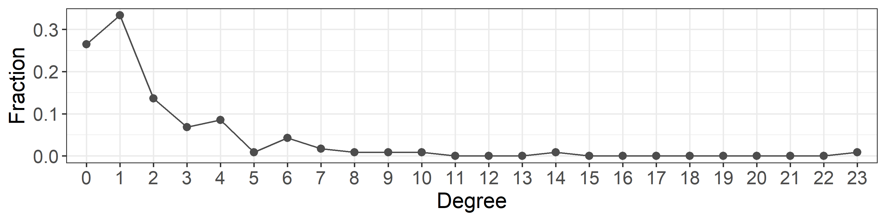
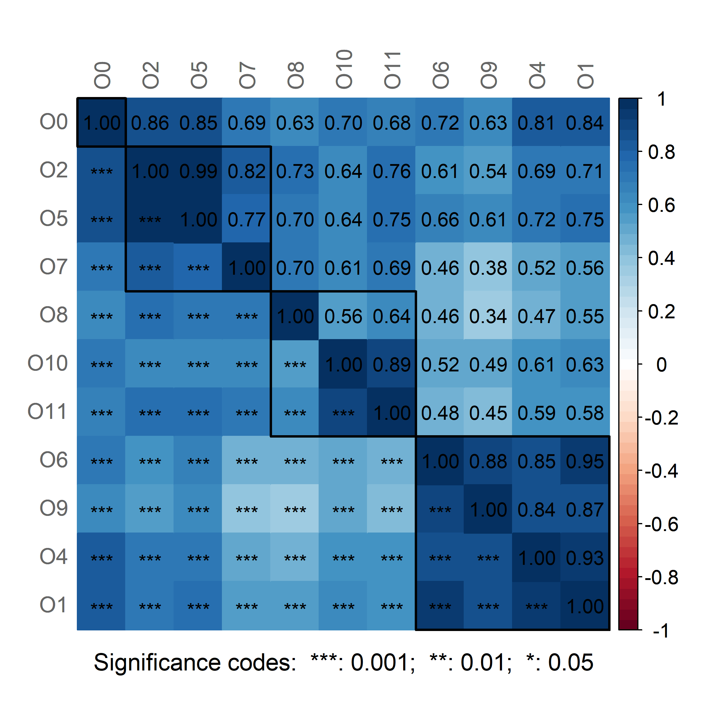
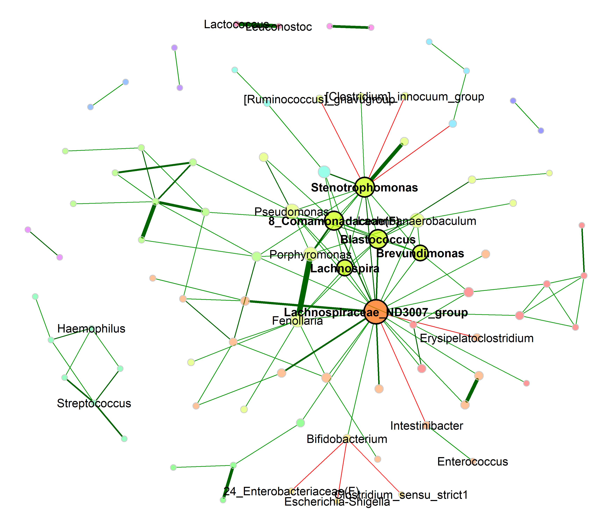
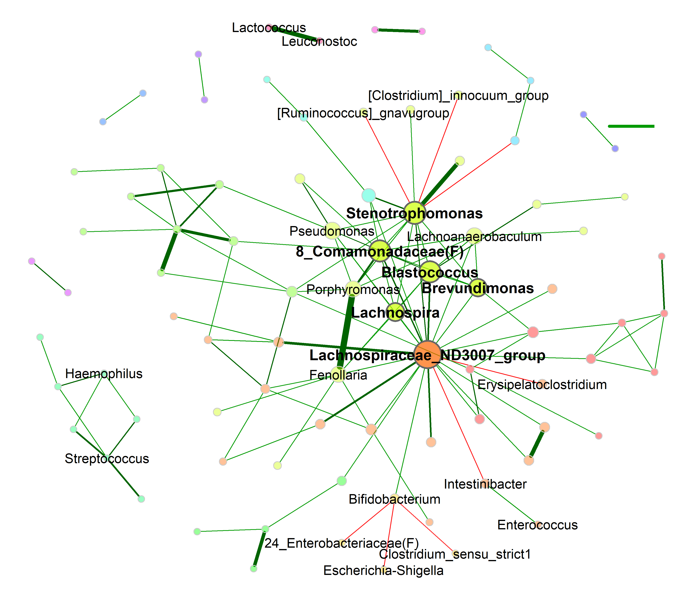
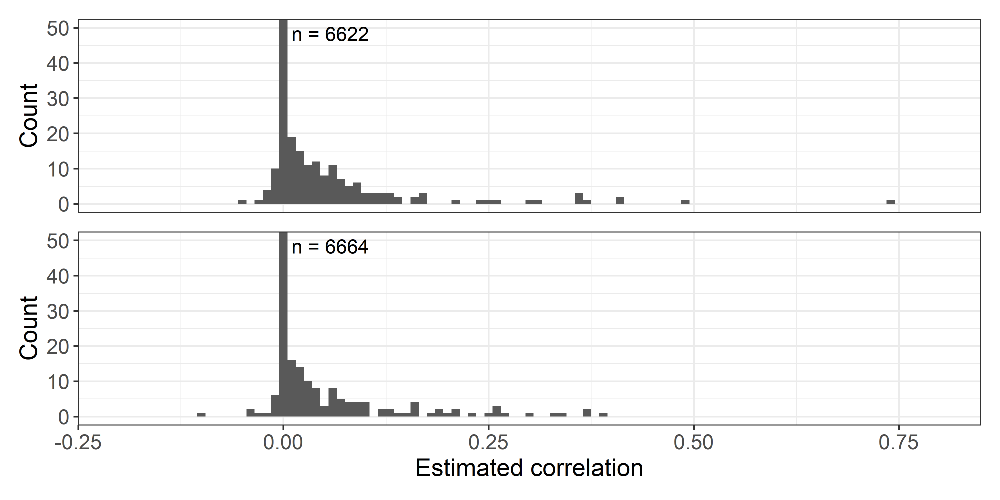
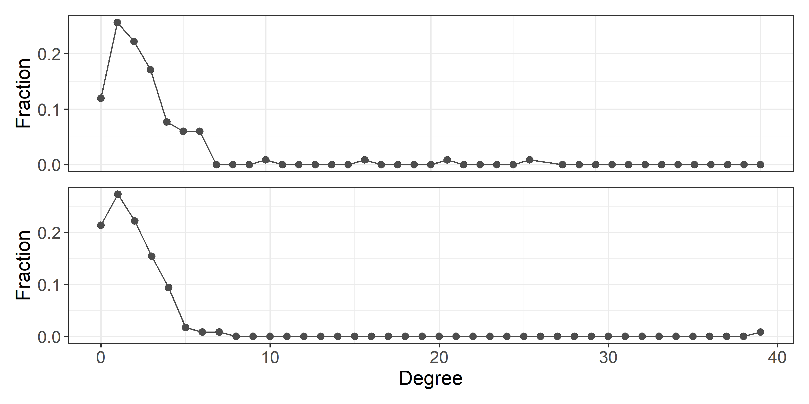
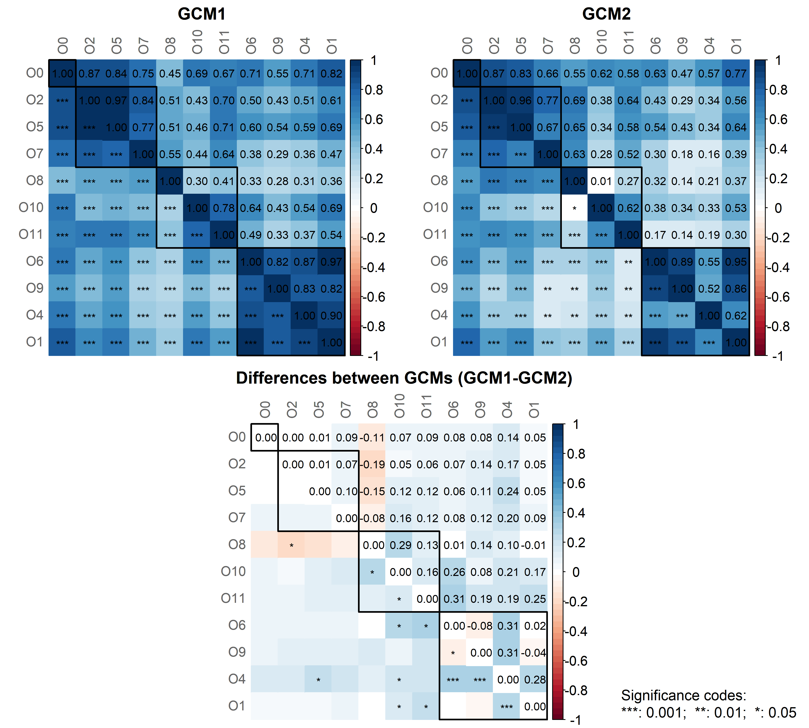
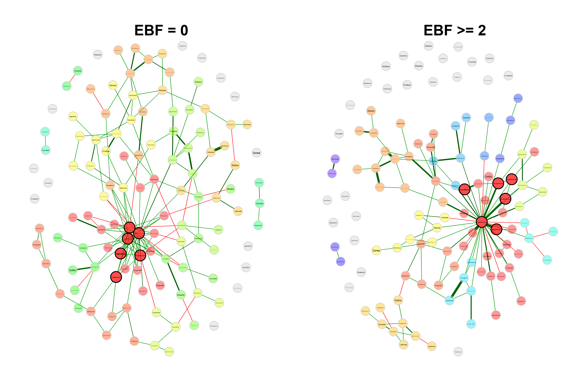

Network analysis
================
Compiled at 2026-06-23 13:59:18 UTC

## Aim

This script contains the network analyses for the application chapter.
The first part builds one complete network on the filtered genus-level
data and evaluates how sensitive the resulting network is to common
preprocessing and association choices. The complete-network analysis
will compare the standard preprocessing approach with the final method
used in this thesis, and then vary one component at a time: zero
replacement, normalization, and association measure.

The second part will compare networks between the two main exclusive
breastfeeding groups used throughout this chapter, `EBF duration = 0`
and `EBF duration >=2`. The network-comparison analysis will contrast
the classical empirical permutation results with `permApprox`-refined
p-values. For the `permApprox` analysis we will fit both the
unconstrained approximation and the proposed constrained version, so
that the unconstrained fit can be used to inspect how many zero-valued
permutation statistics would be expected without the constraint.

## Set global parameters

## Load data

### Phyloseq object on genus level

    ## phyloseq-class experiment-level object
    ## otu_table()   OTU Table:         [ 117 taxa and 592 samples ]
    ## sample_data() Sample Data:       [ 592 samples by 9 sample variables ]
    ## tax_table()   Taxonomy Table:    [ 117 taxa by 7 taxonomic ranks ]

## Helper functions

## Prepare data

The network analyses use the same filtered genus-level object as the
differential abundance and differential distribution analyses. Counts
are represented as a samples-by-taxa matrix. Relative abundances are
prepared here because several network workflows use them directly.

Since SpiecEasi does only provide pseudo count zero replacement, we need
to apply zero replacement with multRepl beforehand.

    ## # A tibble: 1 × 7
    ##   n_samples n_taxa min_library_size median_library_size max_library_size zero_fraction_orig
    ##       <int>  <int>            <dbl>               <dbl>            <dbl>              <dbl>
    ## 1       592    117             1456              21898.            69556              0.796
    ## # ℹ 1 more variable: zero_fraction_repl <dbl>

Rename taxonomic table and make rank Genus unique.

    ## Column 7 contains NAs only and is ignored.

## Complete network with standard preprocessing

This section will estimate the complete genus-level network using the
final preprocessing and association pipeline selected for the thesis.
The resulting object should be saved to the target directory and reused
by downstream summary tables and figures.

The preprocessing approach used throughout the thesis is:

1.  Transform counts to relative abundances
2.  Perform multiplicative zero replacement
3.  Perform CLR transformation

### Network construction

### Network analysis

#### Association heatmap

**For all taxa**

<!-- -->

**For non-singletons only**

<!-- -->

#### Association histogram

<!-- -->

    ## Entries in the lower triangle: 6786

    ## 
    ## Non-zero entries in the lower triangle: 124

#### Degree distribution

<!-- -->

#### Analysis with netAnalyze()

    ## 
    ## Component sizes
    ## ```````````````               
    ## size: 67 7 2  1
    ##    #:  1 1 6 31
    ## ______________________________
    ## Global network properties
    ## `````````````````````````
    ## Largest connected component (LCC):
    ##                                  
    ## Relative LCC size         0.57265
    ## Clustering coefficient    0.29647
    ## Modularity                0.52002
    ## Positive edge percentage 92.72727
    ## Edge density              0.04975
    ## Natural connectivity      0.01905
    ## Vertex connectivity       1.00000
    ## Edge connectivity         1.00000
    ## Average dissimilarity*    0.98455
    ## Average path length**     2.32219
    ## 
    ## Whole network:
    ##                                  
    ## Number of components     39.00000
    ## Clustering coefficient    0.26493
    ## Modularity                0.59308
    ## Positive edge percentage 93.54839
    ## Edge density              0.01827
    ## Natural connectivity      0.01006
    ## -----
    ## *: Dissimilarity = 1 - edge weight
    ## **: Path length = Units with average dissimilarity
    ## 
    ## ______________________________
    ## Clusters
    ## - In the whole network
    ## - Algorithm: cluster_fast_greedy
    ## ```````````````````````````````` 
    ##                                               
    ## name:  0 1  2 3  4 5 6 7 8 9 10 11 12 13 14 15
    ##    #: 31 9 16 4 19 9 4 7 3 3  2  2  2  2  2  2
    ## 
    ## ______________________________
    ## Hubs
    ## - In alphabetical/numerical order
    ## - Based on empirical quantiles of centralities
    ## ```````````````````````````````````````````````                             
    ##  8_Comamonadaceae(F)         
    ##  Blastococcus                
    ##  Brevundimonas               
    ##  Lachnospira                 
    ##  Lachnospiraceae_ND3007_group
    ##  Stenotrophomonas            
    ## 
    ## ______________________________
    ## Centrality measures
    ## - In decreasing order
    ## - Centrality of disconnected components is zero
    ## ````````````````````````````````````````````````
    ## Degree (unnormalized):
    ##                                 
    ## Lachnospiraceae_ND3007_group  23
    ## Stenotrophomonas              14
    ## 8_Comamonadaceae(F)           10
    ## Blastococcus                   9
    ## Fenollaria                     8
    ## Christensenellaceae_R-7_group  7
    ## Pseudomonas                    7
    ## Brevundimonas                  6
    ## Porphyromonas                  6
    ## Monoglobus                     6
    ## 
    ## Betweenness centrality (unnormalized):
    ##                                   
    ## Lachnospiraceae_ND3007_group  1384
    ## Stenotrophomonas               528
    ## 8_Comamonadaceae(F)            238
    ## Fenollaria                     194
    ## Bifidobacterium                192
    ## Phascolarctobacterium          189
    ## Monoglobus                     184
    ## Peptostreptococcus             175
    ## Lachnospiraceae_NK4A136_group  164
    ## Blastococcus                   137
    ## 
    ## Closeness centrality (unnormalized):
    ##                                      
    ## Lachnospiraceae_ND3007_group 59.96977
    ## Stenotrophomonas             50.60785
    ## 8_Comamonadaceae(F)          47.41856
    ## Blastococcus                 46.53516
    ## Fenollaria                   44.32539
    ## Pseudomonas                  43.96794
    ## Lachnospira                  43.32065
    ## Brevundimonas                43.08809
    ## Porphyromonas                41.66311
    ## Lachnoanaerobaculum          41.43020
    ## 
    ## Eigenvector centrality (unnormalized):
    ##                                     
    ## Lachnospiraceae_ND3007_group 1.00000
    ## Stenotrophomonas             0.74822
    ## Blastococcus                 0.70285
    ## 8_Comamonadaceae(F)          0.70002
    ## Lachnospira                  0.54547
    ## Brevundimonas                0.51709
    ## Pseudomonas                  0.49736
    ## Lachnoanaerobaculum          0.47214
    ## Porphyromonas                0.45611
    ## Fenollaria                   0.45395

### Graphlet correlation matrix

<!-- -->

### Network plot

In the network plot, the following taxa are labelled:

- Taxa that appeared in the differential association analysis as well as
  the differential distribution analysis.
- Most central taxa with respect to eigenvector centrality.
- The three taxa with a negative correlation to Bifidobacterium

<!-- -->

<!-- -->

## Trials from here on

### Network based on counts

### Standard preprocessing network

This section will build the corresponding complete network under the
standard preprocessing approach. It serves as the main reference point
for evaluating the effect of the final method.

### Compare complete-network methods

The method comparison will vary one analysis choice at a time while
holding the remaining components fixed. The planned comparison grid
separates zero replacement, normalization, and association measure so
that changes in network topology can be attributed to a specific step.

## Network comparison by EBF duration

### Analysis data set

The group comparison uses the two EBF groups that define the main
contrast in this chapter: no exclusive breastfeeding and exclusive
breastfeeding for at least two months. Samples with one month of
exclusive breastfeeding are excluded from this comparison.

### Network construction

### Network analysis

#### Association histogram

<!-- -->

#### Degree distribution

<!-- -->

#### Analysis with netAnalyze()

### Graphlet correlation matrix

<!-- -->

### Network plot

<!-- -->

### Compare networks with netCompare()

### Classical empirical network comparison

This section will run the standard permutation-based network comparison
and report empirical p-values for the global and local network
statistics.

### permApprox-refined network comparison

This section will refine the empirical network-comparison p-values with
`permApprox`. Both unconstrained and constrained refinements will be
stored. The unconstrained fit is included as a diagnostic for how many
zero-valued permutation statistics would be expected without imposing
the proposed constraint.

## Files written

These files have been written to the target directory,
`data/10_networks`:

    ## # A tibble: 4 × 4
    ##   path                  type         size modification_time  
    ##   <fs::path>            <fct> <fs::bytes> <dttm>             
    ## 1 assoPerm_ebf.bmat     file       427.8K 2026-06-23 13:54:42
    ## 2 assoPerm_ebf.desc.txt file           87 2026-06-23 13:53:09
    ## 3 net_ebf_main.rds      file        20.8M 2026-06-23 08:54:25
    ## 4 net_single_main.rds   file        11.2M 2026-06-22 19:48:43
