Network comparison between non-EBF and EBF groups
================
Compiled at 2026-07-07 17:44:35 UTC

This document compares genus-level microbial association networks
between infants without exclusive breastfeeding and infants with at
least two months of exclusive breastfeeding. The first part contrasts
several network construction approaches descriptively. The second part
conducts permutation-based network comparison for one selected
descriptive network.

## Parameters

## Load And Prepare Data

The comparison uses the non-EBF and EBF groups that define the main
contrast in this chapter: no exclusive breastfeeding and exclusive
breastfeeding for at least two months. Samples with one month of
exclusive breastfeeding are excluded.

    ## Column 7 contains NAs only and is ignored.

    ##   ebf_group n_samples
    ## 1   non-EBF       179
    ## 2       EBF       375

## Helper Functions

## Descriptive Network Comparisons

The following sections construct and describe non-EBF- and EBF-specific
networks without permutation testing.

### SPIEC-EASI MB with multRepl

#### netAnalyze summary

    ## 
    ## Component sizes
    ## ```````````````
    ## non-EBF:               
    ## size: 96 3 2  1
    ##    #:  1 1 2 14
    ## EBF:             
    ## size: 88 2  1
    ##    #:  1 2 25
    ## ______________________________
    ## Global network properties
    ## `````````````````````````
    ## Largest connected component (LCC):
    ##                           non-EBF      EBF
    ## Relative LCC size         0.82051  0.75214
    ## Clustering coefficient    0.22827  0.30668
    ## Modularity                0.56511  0.60596
    ## Positive edge percentage 87.50000 88.33333
    ## Edge density              0.03509  0.03135
    ## Natural connectivity      0.01337  0.01394
    ## Vertex connectivity       1.00000  1.00000
    ## Edge connectivity         1.00000  1.00000
    ## Average dissimilarity*    0.98881  0.98996
    ## Average path length**     2.69922  2.74449
    ## 
    ## Whole network:
    ##                           non-EBF      EBF
    ## Number of components     18.00000 28.00000
    ## Clustering coefficient    0.22514  0.30668
    ## Modularity                0.57961  0.61591
    ## Positive edge percentage 87.19512 88.52459
    ## Edge density              0.02417  0.01798
    ## Natural connectivity      0.01059  0.01005
    ## -----
    ## *: Dissimilarity = 1 - edge weight
    ## **: Path length = Units with average dissimilarity
    ## 
    ## ______________________________
    ## Clusters
    ## - In the whole network
    ## - Algorithm: cluster_fast_greedy
    ## ```````````````````````````````` 
    ## non-EBF:                                        
    ## name:  0  1  2  3 4  5 6 7  8 9 10 11 12
    ##    #: 14 10 11 11 9 21 7 8 13 6  2  3  2
    ## 
    ## EBF:                                         
    ## name:  0  1  2  3 4 5 6 7 8 9 10 11 12 13
    ##    #: 25 25 10 12 7 4 6 5 9 5  2  3  2  2
    ## 
    ## ______________________________
    ## Hubs
    ## - In alphabetical/numerical order
    ## - Based on empirical quantiles of centralities
    ## ```````````````````````````````````````````````
    ##                              non-EBF              EBF
    ##  [Eubacterium]_coprostanoligenegroup     Blastococcus
    ##                 9_Pasteurellaceae(F)    Coprobacillus
    ##                        Cutibacterium       Fenollaria
    ##         Lachnospiraceae_ND3007_group        Megamonas
    ##                          Pseudomonas      Pseudomonas
    ##                              Sarcina Stenotrophomonas
    ## 
    ## ______________________________
    ## Centrality measures
    ## - In decreasing order
    ## - Centrality of disconnected components is zero
    ## ````````````````````````````````````````````````
    ## Degree (unnormalized):
    ##                                      non-EBF    EBF
    ##         Lachnospiraceae_ND3007_group      26      1
    ##  [Eubacterium]_coprostanoligenegroup      21      2
    ##                 9_Pasteurellaceae(F)      16      2
    ##                          Pseudomonas      10      4
    ##                            Megamonas       6      2
    ##                                       ______ ______
    ##                        Coprobacillus       1     39
    ##             Family_XIII_AD3011_group       5      7
    ##        Christensenellaceae_R-7_group       4      6
    ##                     Paeniclostridium       1      5
    ##                     Stenotrophomonas       6      5
    ## 
    ## Betweenness centrality (unnormalized):
    ##                                      non-EBF    EBF
    ##         Lachnospiraceae_ND3007_group    2838      0
    ##                  Lachnoanaerobaculum     641      0
    ##                            Halomonas     602      0
    ##  [Eubacterium]_coprostanoligenegroup     556    110
    ##                        Cutibacterium     508     86
    ##                                       ______ ______
    ##                        Coprobacillus       0   3128
    ##             Family_XIII_AD3011_group     259    796
    ##                        Peptoniphilus     186    727
    ##                          Varibaculum     365    702
    ##                   Peptostreptococcus      20    671
    ## 
    ## Closeness centrality (unnormalized):
    ##                                       non-EBF      EBF
    ##         Lachnospiraceae_ND3007_group 78.28143 51.87743
    ##  [Eubacterium]_coprostanoligenegroup 70.77024 32.92954
    ##                 9_Pasteurellaceae(F)  65.4692 48.62153
    ##                          Pseudomonas 58.97882 50.19192
    ##                            Halomonas 56.82464 48.01957
    ##                                        ______   ______
    ##                        Coprobacillus 33.40827 84.10805
    ##             Family_XIII_AD3011_group 47.75812 57.26247
    ##                     Stenotrophomonas 53.71793 53.80347
    ##                         Blastococcus 50.56523 53.77455
    ##                            Megamonas 54.58441 52.76364
    ## 
    ## Eigenvector centrality (unnormalized):
    ##                                      non-EBF     EBF
    ##         Lachnospiraceae_ND3007_group 0.46897 0.13186
    ##  [Eubacterium]_coprostanoligenegroup 0.41983 0.00331
    ##                 9_Pasteurellaceae(F) 0.37163 0.11129
    ##                          Pseudomonas 0.26471 0.14383
    ##                              Sarcina 0.18268 0.11249
    ##                                       ______  ______
    ##                        Coprobacillus 0.00618 0.66845
    ##                     Stenotrophomonas 0.11228 0.17979
    ##                         Blastococcus 0.14468 0.17918
    ##                            Megamonas 0.14648 0.14803
    ##                           Fenollaria  0.0041  0.1443

#### Association Histogram

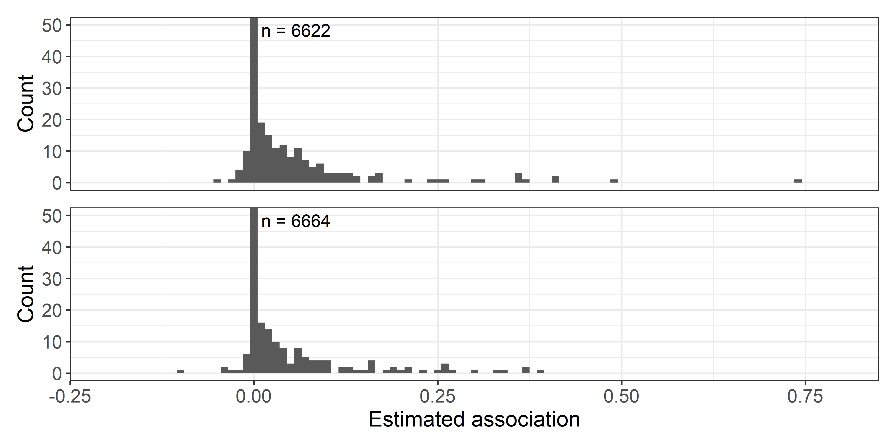<!-- -->

#### Degree Distribution

<!-- -->

#### Graphlet Correlation Matrix

<!-- -->

#### Network Plot

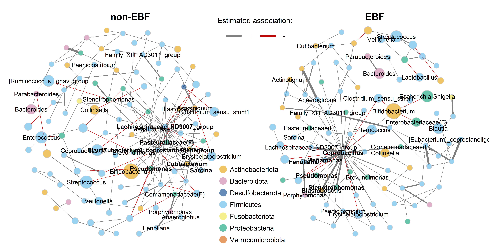<!-- -->

<!-- -->

### SPIEC-EASI MB with BayesMult replacement

#### netAnalyze summary

    ## 
    ## Component sizes
    ## ```````````````
    ## non-EBF:           
    ## size: 115 1
    ##    #:   1 2
    ## EBF:                 
    ## size: 60 7 3 2  1
    ##    #:  1 1 1 6 35
    ## ______________________________
    ## Global network properties
    ## `````````````````````````
    ## Largest connected component (LCC):
    ##                           non-EBF      EBF
    ## Relative LCC size         0.98291  0.51282
    ## Clustering coefficient    0.15315  0.28542
    ## Modularity                0.56411  0.60675
    ## Positive edge percentage 84.75336 93.42105
    ## Edge density              0.03402  0.04294
    ## Natural connectivity      0.01103  0.02042
    ## Vertex connectivity       1.00000  1.00000
    ## Edge connectivity         1.00000  1.00000
    ## Average dissimilarity*    0.98917  0.98625
    ## Average path length**     2.66122  2.27876
    ## 
    ## Whole network:
    ##                           non-EBF      EBF
    ## Number of components      3.00000 44.00000
    ## Clustering coefficient    0.15315  0.24974
    ## Modularity                0.56411  0.69130
    ## Positive edge percentage 84.75336 94.56522
    ## Edge density              0.03286  0.01356
    ## Natural connectivity      0.01081  0.00970
    ## -----
    ## *: Dissimilarity = 1 - edge weight
    ## **: Path length = Units with average dissimilarity
    ## 
    ## ______________________________
    ## Clusters
    ## - In the whole network
    ## - Algorithm: cluster_fast_greedy
    ## ```````````````````````````````` 
    ## non-EBF:                                
    ## name: 0  1  2  3  4 5  6 7  8  9
    ##    #: 2 16 10 19 17 6 18 6 13 10
    ## 
    ## EBF:                                                
    ## name:  0  1 2 3 4 5 6 7 8 9 10 11 12 13 14 15 16
    ##    #: 35 17 8 9 6 6 4 7 5 5  2  2  2  3  2  2  2
    ## 
    ## ______________________________
    ## Hubs
    ## - In alphabetical/numerical order
    ## - Based on empirical quantiles of centralities
    ## ```````````````````````````````````````````````
    ##                              non-EBF                      EBF
    ##  [Eubacterium]_coprostanoligenegroup            Coprobacillus
    ##                 9_Pasteurellaceae(F)             Epulopiscium
    ##                        Cutibacterium            Faecalicoccus
    ##                           Morganella             Faecalitalea
    ##                          Pseudomonas Family_XIII_AD3011_group
    ##                            Scardovia              Leuconostoc
    ## 
    ## ______________________________
    ## Centrality measures
    ## - In decreasing order
    ## - Centrality of disconnected components is zero
    ## ````````````````````````````````````````````````
    ## Degree (unnormalized):
    ##                                      non-EBF    EBF
    ##                            Scardovia      19      0
    ##                 9_Pasteurellaceae(F)      12      0
    ##  [Eubacterium]_coprostanoligenegroup      11      2
    ##             Family_XIII_AD3011_group       8      5
    ##        Lachnospiraceae_NK4A136_group       8      3
    ##                                       ______ ______
    ##                        Coprobacillus       6     26
    ##             Family_XIII_AD3011_group       8      5
    ##                     Paeniclostridium       2      4
    ##                        Faecalicoccus       3      4
    ##                         Faecalitalea       6      4
    ## 
    ## Betweenness centrality (unnormalized):
    ##                                      non-EBF    EBF
    ##                            Scardovia    1766      0
    ##             Family_XIII_AD3011_group     707    320
    ##                           Lawsonella     667      9
    ##         Lachnospiraceae_ND3007_group     635      0
    ##        Lachnospiraceae_NK4A136_group     590    270
    ##                                       ______ ______
    ##                        Coprobacillus     162   1556
    ##             Family_XIII_AD3011_group     707    320
    ##        Lachnospiraceae_NK4A136_group     590    270
    ##                              Slackia      74    266
    ##  [Eubacterium]_coprostanoligenegroup     222    220
    ## 
    ## Closeness centrality (unnormalized):
    ##                                       non-EBF      EBF
    ##                            Scardovia 76.93058        0
    ##                 9_Pasteurellaceae(F) 67.08607        0
    ##  [Eubacterium]_coprostanoligenegroup 66.65016 27.94728
    ##            [Eubacterium]_eligengroup 63.90732 18.49592
    ##                      Intestinibacter  62.2695        0
    ##                                        ______   ______
    ##                        Coprobacillus  56.7104 58.95365
    ##             Family_XIII_AD3011_group 62.12618 40.03517
    ##                        Faecalicoccus 45.92693  37.5117
    ##                     Paeniclostridium 43.08975  37.2448
    ##                          Leuconostoc 53.50696 37.04617
    ## 
    ## Eigenvector centrality (unnormalized):
    ##                                      non-EBF     EBF
    ##                            Scardovia 0.47905       0
    ##                 9_Pasteurellaceae(F) 0.37859       0
    ##  [Eubacterium]_coprostanoligenegroup 0.35895 0.02798
    ##                           Morganella 0.29759 0.12174
    ##                        Cutibacterium  0.2304  0.0251
    ##                                       ______  ______
    ##                        Coprobacillus 0.03519 0.66895
    ##                         Faecalitalea 0.03159 0.19703
    ##                        Faecalicoccus 0.00475 0.18968
    ##                         Epulopiscium  0.0105 0.17599
    ##             Family_XIII_AD3011_group 0.03188   0.172

    ## [1] 0.982906

    ## [1] 0.5128205

    ## [1] 0.01080703

    ## [1] 0.009699742

    ## [1] 0.03286177

    ## [1] 0.01355732

#### Association Histogram

<!-- -->

#### Degree Distribution

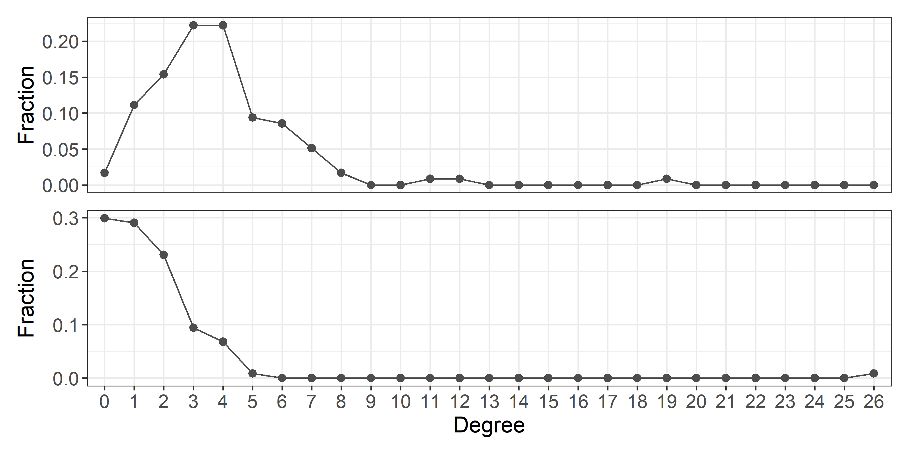<!-- -->

#### Graphlet Correlation Matrix

<!-- -->

#### Network Plot

<!-- -->

<!-- -->

### SPIEC-EASI SLR

#### netAnalyze summary

    ## 
    ## Component sizes
    ## ```````````````
    ## non-EBF:           
    ## size: 75  1
    ##    #:  1 42
    ## EBF:           
    ## size: 43  1
    ##    #:  1 74
    ## ______________________________
    ## Global network properties
    ## `````````````````````````
    ## Largest connected component (LCC):
    ##                           non-EBF      EBF
    ## Relative LCC size         0.64103  0.36752
    ## Clustering coefficient    0.32705  0.25031
    ## Modularity                0.24999  0.31571
    ## Positive edge percentage 43.54839 49.00000
    ## Edge density              0.11171  0.11074
    ## Natural connectivity      0.02249  0.03151
    ## Vertex connectivity       1.00000  1.00000
    ## Edge connectivity         1.00000  1.00000
    ## Average dissimilarity*    0.96721  0.96729
    ## Average path length**     1.65614  1.95873
    ## 
    ## Whole network:
    ##                           non-EBF      EBF
    ## Number of components     43.00000 75.00000
    ## Clustering coefficient    0.32705  0.25031
    ## Modularity                0.24999  0.31571
    ## Positive edge percentage 43.54839 49.00000
    ## Edge density              0.04568  0.01474
    ## Natural connectivity      0.01261  0.00974
    ## -----
    ## *: Dissimilarity = 1 - edge weight
    ## **: Path length = Units with average dissimilarity
    ## 
    ## ______________________________
    ## Clusters
    ## - In the whole network
    ## - Algorithm: cluster_fast_greedy
    ## ```````````````````````````````` 
    ## non-EBF:                         
    ## name:  0  1  2  3  4  5 6
    ##    #: 42 10 20 12 15 10 8
    ## 
    ## EBF:                      
    ## name:  0 1 2 3 4 5 6 7
    ##    #: 74 9 5 8 5 9 4 3
    ## 
    ## ______________________________
    ## Hubs
    ## - In alphabetical/numerical order
    ## - Based on empirical quantiles of centralities
    ## ```````````````````````````````````````````````
    ##                       non-EBF                      EBF
    ##  [Clostridium]_innocuum_group 24_Enterobacteriaceae(F)
    ##     Clostridium_sensu_strict1              Collinsella
    ##                   Collinsella             Enterococcus
    ##               Intestinibacter     Escherichia-Shigella
    ##                 Lactobacillus                   Rothia
    ##                   Veillonella           Staphylococcus
    ## 
    ## ______________________________
    ## Centrality measures
    ## - In decreasing order
    ## - Centrality of disconnected components is zero
    ## ````````````````````````````````````````````````
    ## Degree (unnormalized):
    ##                               non-EBF    EBF
    ##                 Lactobacillus      31      7
    ##  [Clostridium]_innocuum_group      24      2
    ##                   Collinsella      22     11
    ##                   Veillonella      21      9
    ##     Clostridium_sensu_strict1      21      4
    ##                                ______ ______
    ##                  Enterococcus      14     11
    ##                   Collinsella      22     11
    ##                Staphylococcus      19     10
    ##      24_Enterobacteriaceae(F)      14     10
    ##                   Veillonella      21      9
    ## 
    ## Betweenness centrality (unnormalized):
    ##                               non-EBF    EBF
    ##  [Clostridium]_innocuum_group     351     10
    ##                 Lactobacillus     287     74
    ##                   Veillonella     260     76
    ##     Clostridium_sensu_strict1     243      3
    ##               Intestinibacter     199     50
    ##                                ______ ______
    ##                   Haemophilus      61    191
    ##                   Collinsella     195    123
    ##               Corynebacterium       0    107
    ##                  Enterococcus      72     86
    ##                Staphylococcus     133     84
    ## 
    ## Closeness centrality (unnormalized):
    ##                                non-EBF      EBF
    ##                 Lactobacillus  71.6015 29.40797
    ##  [Clostridium]_innocuum_group 66.55582 22.21426
    ##                   Collinsella 64.73923 33.34388
    ##                   Veillonella 64.39971 32.13712
    ##     Clostridium_sensu_strict1 64.27635 26.07069
    ##                                 ______   ______
    ##                  Enterococcus 57.65808 33.87378
    ##                Staphylococcus  61.9653 33.39001
    ##                   Haemophilus 55.45173 33.35287
    ##                   Collinsella 64.73923 33.34388
    ##      24_Enterobacteriaceae(F) 57.62057 33.30351
    ## 
    ## Eigenvector centrality (unnormalized):
    ##                               non-EBF     EBF
    ##                 Lactobacillus 0.31908 0.14776
    ##     Clostridium_sensu_strict1 0.23195 0.12099
    ##  [Clostridium]_innocuum_group 0.22585 0.03845
    ##                   Collinsella 0.21798 0.29322
    ##               Intestinibacter 0.21439 0.08847
    ##                                ______  ______
    ##                  Enterococcus 0.14851 0.29987
    ##                   Collinsella 0.21798 0.29322
    ##      24_Enterobacteriaceae(F) 0.14412 0.28402
    ##          Escherichia-Shigella 0.15767 0.28265
    ##                        Rothia  0.1081 0.25476

#### Low-Rank Heatmaps

    ## # A tibble: 2 × 4
    ##   group   n_taxa n_common_taxa lambda
    ##   <chr>    <int>         <int>  <dbl>
    ## 1 non-EBF    117           117  0.323
    ## 2 EBF        117           117  0.253

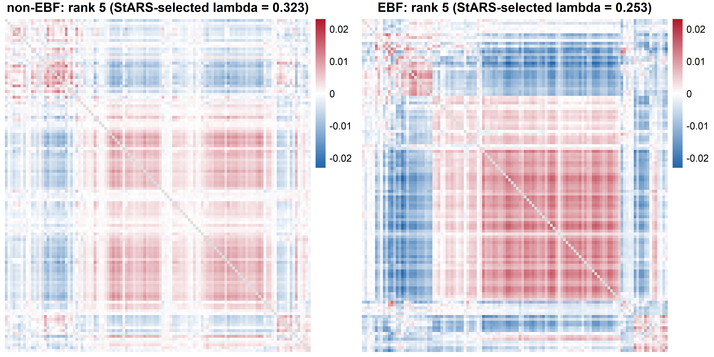<!-- -->

#### Association Histogram

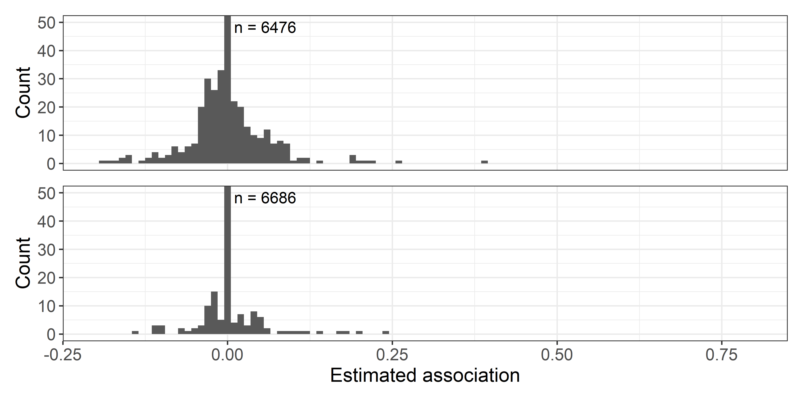<!-- -->

#### Degree Distribution

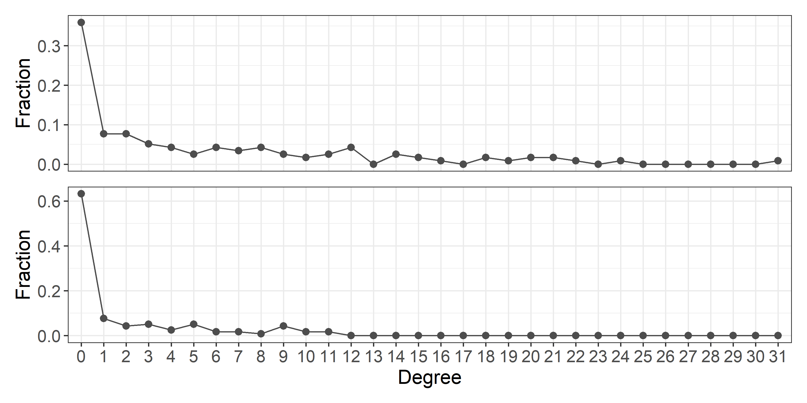<!-- -->

#### Graphlet Correlation Matrix

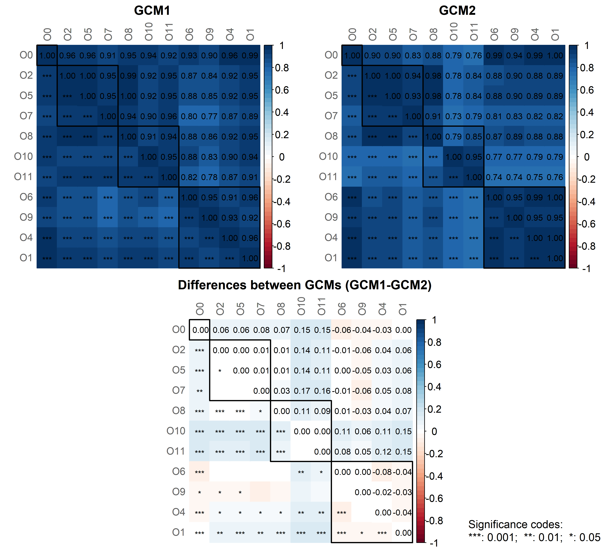<!-- -->

#### Network Plot

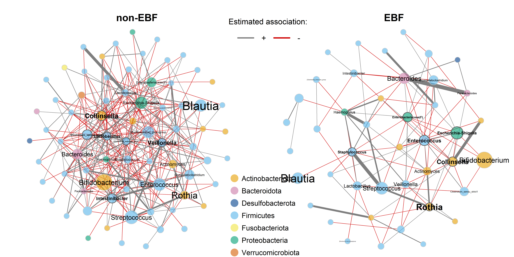<!-- -->

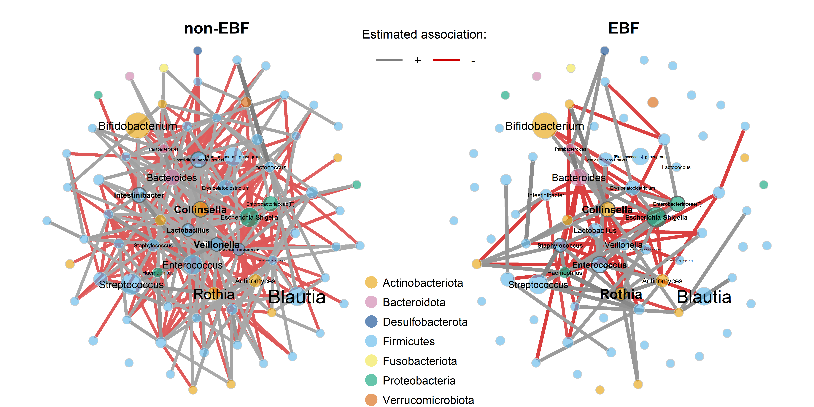<!-- -->

### SPRING

#### netAnalyze summary

    ## 
    ## Component sizes
    ## ```````````````
    ## non-EBF:          
    ## size: 61 1
    ##    #:  1 4
    ## EBF:            
    ## size: 58 2 1
    ##    #:  1 1 5
    ## ______________________________
    ## Global network properties
    ## `````````````````````````
    ## Largest connected component (LCC):
    ##                           non-EBF      EBF
    ## Relative LCC size         0.93846  0.89231
    ## Clustering coefficient    0.09623  0.16068
    ## Modularity                0.59900  0.56410
    ## Positive edge percentage 59.30233 61.70213
    ## Edge density              0.04699  0.05687
    ## Natural connectivity      0.01979  0.02138
    ## Vertex connectivity       1.00000  1.00000
    ## Edge connectivity         1.00000  1.00000
    ## Average dissimilarity*    0.98604  0.98292
    ## Average path length**     2.96739  2.58898
    ## 
    ## Whole network:
    ##                           non-EBF      EBF
    ## Number of components      5.00000  7.00000
    ## Clustering coefficient    0.09623  0.16068
    ## Modularity                0.59900  0.57206
    ## Positive edge percentage 59.30233 62.10526
    ## Edge density              0.04135  0.04567
    ## Natural connectivity      0.01839  0.01874
    ## -----
    ## *: Dissimilarity = 1 - edge weight
    ## **: Path length = Units with average dissimilarity
    ## 
    ## ______________________________
    ## Clusters
    ## - In the whole network
    ## - Algorithm: cluster_fast_greedy
    ## ```````````````````````````````` 
    ## non-EBF:                        
    ## name: 0  1  2 3 4 5 6  7
    ##    #: 4 12 11 6 6 6 7 13
    ## 
    ## EBF:                         
    ## name: 0 1 2 3  4  5 6 7 8
    ##    #: 5 8 5 5 10 13 9 8 2
    ## 
    ## ______________________________
    ## Hubs
    ## - In alphabetical/numerical order
    ## - Based on empirical quantiles of centralities
    ## ```````````````````````````````````````````````
    ##           non-EBF                    EBF
    ##      Anaerostipes           Anaerostipes
    ##   Bifidobacterium                Blautia
    ##           Blautia Erysipelatoclostridium
    ##  Fusicatenibacter       Faecalibacterium
    ## 
    ## ______________________________
    ## Centrality measures
    ## - In decreasing order
    ## - Centrality of disconnected components is zero
    ## ````````````````````````````````````````````````
    ## Degree (unnormalized):
    ##                             non-EBF    EBF
    ##                     Blautia       7     12
    ##              Negativicoccus       6      2
    ##                 Eubacterium       6      3
    ##              Granulicatella       5      5
    ##                     Delftia       5      6
    ##                              ______ ______
    ##                     Blautia       7     12
    ##                Anaerostipes       4      9
    ##                 Varibaculum       2      7
    ##  [Ruminococcus]_torquegroup       4      7
    ##                     Delftia       5      6
    ## 
    ## Betweenness centrality (unnormalized):
    ##                             non-EBF    EBF
    ##                 Eubacterium     457     63
    ##                   Atopobium     355     80
    ##                     Blautia     304    481
    ##  [Eubacterium]_hallii_group     299     73
    ##              Negativicoccus     267     19
    ##                              ______ ______
    ##                     Blautia     304    481
    ##                 Akkermansia      49    411
    ##  [Ruminococcus]_torquegroup     154    377
    ##                 Varibaculum      59    290
    ##                     UBA1819       0    260
    ## 
    ## Closeness centrality (unnormalized):
    ##                              non-EBF      EBF
    ##                     Blautia 33.71796 35.72039
    ##              Negativicoccus 33.55709 25.82435
    ##  [Eubacterium]_hallii_group  33.1843 30.77397
    ##            Fusicatenibacter 32.79534 24.51916
    ##                 Eubacterium 32.37472 25.94068
    ##                               ______   ______
    ##  [Ruminococcus]_torquegroup 27.78041 35.77884
    ##                     Blautia 33.71796 35.72039
    ##                 Varibaculum 21.35858 34.42615
    ##                     UBA1819 21.99691  34.0784
    ##                     Slackia 29.34333 33.52165
    ## 
    ## Eigenvector centrality (unnormalized):
    ##                         non-EBF     EBF
    ##                 Blautia 0.44669 0.55775
    ##         Bifidobacterium 0.35114 0.25044
    ##            Anaerostipes 0.31441 0.47169
    ##        Fusicatenibacter 0.30814 0.21679
    ##             Akkermansia 0.23368 0.14059
    ##                          ______  ______
    ##                 Blautia 0.44669 0.55775
    ##            Anaerostipes 0.31441 0.47169
    ##        Faecalibacterium 0.19542 0.27864
    ##  Erysipelatoclostridium 0.16085 0.26316
    ##         Bifidobacterium 0.35114 0.25044

    ## [1] 179  65

    ## [1] 375  65

The filtering reduced the data set to 65 taxa in each group.

#### Association Histogram

<!-- -->

#### Degree Distribution

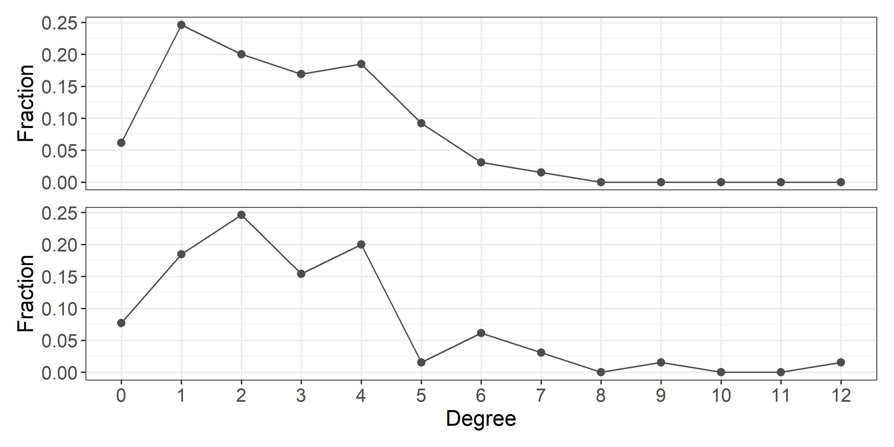<!-- -->

#### Graphlet Correlation Matrix

<!-- -->

#### Network Plot

<!-- -->

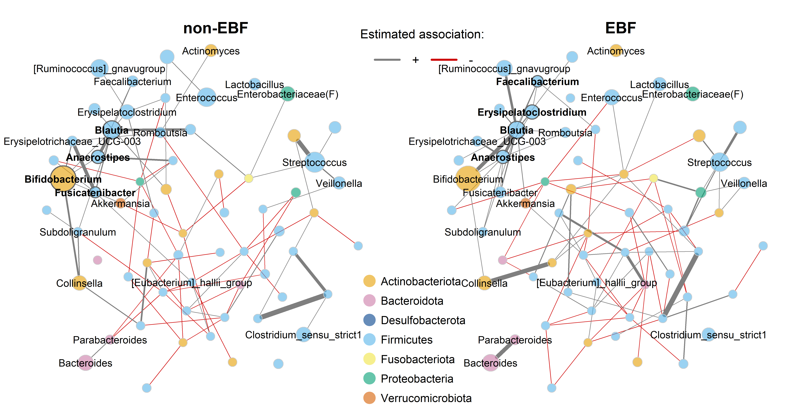<!-- -->

### rhoshrink with multRepl

#### netAnalyze summary

    ## 
    ## Component sizes
    ## ```````````````
    ## non-EBF:               
    ## size: 15 3 2  1
    ##    #:  1 2 2 92
    ## EBF:               
    ## size: 25 4 2  1
    ##    #:  1 1 2 84
    ## ______________________________
    ## Global network properties
    ## `````````````````````````
    ## Largest connected component (LCC):
    ##                            non-EBF       EBF
    ## Relative LCC size          0.12821   0.21368
    ## Clustering coefficient     0.72977   0.63368
    ## Modularity                 0.19156   0.19012
    ## Positive edge percentage 100.00000 100.00000
    ## Edge density               0.33333   0.20000
    ## Natural connectivity       0.13716   0.08818
    ## Vertex connectivity        1.00000   1.00000
    ## Edge connectivity          1.00000   1.00000
    ## Average dissimilarity*     0.85622   0.91227
    ## Average path length**      1.22062   1.41117
    ## 
    ## Whole network:
    ##                            non-EBF       EBF
    ## Number of components      97.00000  88.00000
    ## Clustering coefficient     0.82515   0.70346
    ## Modularity                 0.40015   0.33664
    ## Positive edge percentage 100.00000 100.00000
    ## Edge density               0.00634   0.01002
    ## Natural connectivity       0.01009   0.01154
    ## -----
    ## *: Dissimilarity = 1 - edge weight
    ## **: Path length = Units with average dissimilarity
    ## 
    ## ______________________________
    ## Clusters
    ## - In the whole network
    ## - Algorithm: cluster_fast_greedy
    ## ```````````````````````````````` 
    ## non-EBF:                      
    ## name:  0 1 2 3 4 5 6 7
    ##    #: 92 7 6 2 2 3 2 3
    ## 
    ## EBF:                         
    ## name:  0  1 2 3 4 5 6 7 8
    ##    #: 84 14 4 3 2 2 2 4 2
    ## 
    ## ______________________________
    ## Hubs
    ## - In alphabetical/numerical order
    ## - Based on empirical quantiles of centralities
    ## ```````````````````````````````````````````````
    ##                              non-EBF                          EBF
    ##  [Eubacterium]_coprostanoligenegroup                 Blastococcus
    ##                 9_Pasteurellaceae(F)                Coprobacillus
    ##                  Lachnoanaerobaculum                   Fenollaria
    ##         Lachnospiraceae_ND3007_group Lachnospiraceae_ND3007_group
    ##                        Porphyromonas                    Megamonas
    ##                          Pseudomonas             Stenotrophomonas
    ## 
    ## ______________________________
    ## Centrality measures
    ## - In decreasing order
    ## - Centrality of disconnected components is zero
    ## ````````````````````````````````````````````````
    ## Degree (unnormalized):
    ##                                      non-EBF    EBF
    ##         Lachnospiraceae_ND3007_group      12     14
    ##                 9_Pasteurellaceae(F)       9      0
    ##  [Eubacterium]_coprostanoligenegroup       9      0
    ##                          Pseudomonas       6      0
    ##                        Porphyromonas       6      4
    ##                                       ______ ______
    ##                        Coprobacillus       0     17
    ##         Lachnospiraceae_ND3007_group      12     14
    ##                            Megamonas       0     13
    ##                         Blastococcus       0      9
    ##                     Stenotrophomonas       0      8
    ## 
    ## Betweenness centrality (unnormalized):
    ##                               non-EBF    EBF
    ##  Lachnospiraceae_ND3007_group      60      0
    ##                 Porphyromonas      15      0
    ##                  Actinotignum      13      0
    ##         Phascolarctobacterium       0      0
    ##                   Veillonella       0      0
    ##                                ______ ______
    ##                 Coprobacillus       0    207
    ##      Family_XIII_AD3011_group       0     65
    ##                 Faecalicoccus       0     45
    ##                  Anaeroglobus       0     23
    ##              Paeniclostridium       0     23
    ## 
    ## Closeness centrality (unnormalized):
    ##                                       non-EBF      EBF
    ##         Lachnospiraceae_ND3007_group 19.69626  30.4886
    ##  [Eubacterium]_coprostanoligenegroup 17.41876        0
    ##                 9_Pasteurellaceae(F) 17.40585        0
    ##                        Porphyromonas 14.84993  20.8796
    ##                          Pseudomonas 14.62015        0
    ##                                        ______   ______
    ##                        Coprobacillus        0 34.34725
    ##         Lachnospiraceae_ND3007_group 19.69626  30.4886
    ##                            Megamonas        0 29.87012
    ##                         Blastococcus        0 25.92604
    ##                     Stenotrophomonas        0 24.65786
    ## 
    ## Eigenvector centrality (unnormalized):
    ##                                      non-EBF     EBF
    ##         Lachnospiraceae_ND3007_group  0.4481  0.3913
    ##  [Eubacterium]_coprostanoligenegroup 0.40554       0
    ##                 9_Pasteurellaceae(F) 0.40515       0
    ##                          Pseudomonas 0.30885       0
    ##                        Porphyromonas 0.25919 0.16365
    ##                                       ______  ______
    ##                        Coprobacillus       0 0.43575
    ##         Lachnospiraceae_ND3007_group  0.4481  0.3913
    ##                            Megamonas       0 0.37566
    ##                         Blastococcus       0 0.30444
    ##                     Stenotrophomonas       0 0.28985

#### Association Histogram

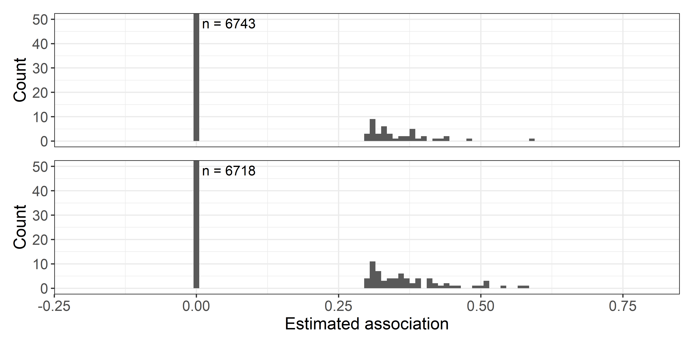<!-- -->

#### Degree Distribution

<!-- -->

#### Graphlet Correlation Matrix

<!-- -->

#### Network Plot

<!-- -->

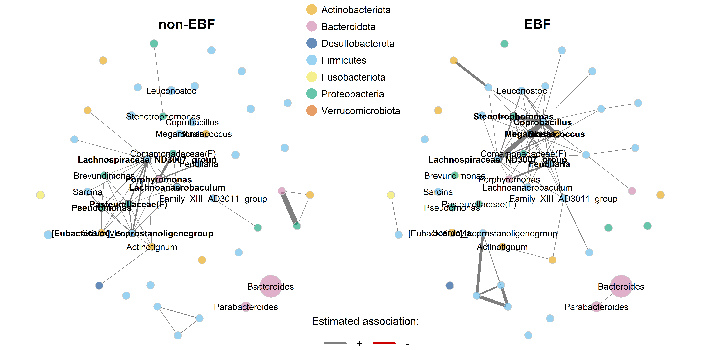<!-- -->

### rhoshrink with bayesMult replacement

#### netAnalyze summary

    ## 
    ## Component sizes
    ## ```````````````
    ## non-EBF:                  
    ## size: 8 6 5 3 2  1
    ##    #: 1 1 1 1 6 83
    ## EBF:                 
    ## size: 47 6 3 2  1
    ##    #:  1 1 2 8 42
    ## ______________________________
    ## Global network properties
    ## `````````````````````````
    ## Largest connected component (LCC):
    ##                            non-EBF       EBF
    ## Relative LCC size          0.06838   0.40171
    ## Clustering coefficient     0.33583   0.53252
    ## Modularity                 0.36892   0.52470
    ## Positive edge percentage 100.00000 100.00000
    ## Edge density               0.28571   0.08881
    ## Natural connectivity       0.19213   0.03188
    ## Vertex connectivity        1.00000   1.00000
    ## Edge connectivity          1.00000   1.00000
    ## Average dissimilarity*     0.89525   0.96719
    ## Average path length**      1.74627   2.02637
    ## 
    ## Whole network:
    ##                            non-EBF      EBF
    ## Number of components      93.00000 54.00000
    ## Clustering coefficient     0.45348  0.45321
    ## Modularity                 0.83177  0.62102
    ## Positive edge percentage 100.00000 98.26087
    ## Edge density               0.00398  0.01695
    ## Natural connectivity       0.00921  0.01057
    ## -----
    ## *: Dissimilarity = 1 - edge weight
    ## **: Path length = Units with average dissimilarity
    ## 
    ## ______________________________
    ## Clusters
    ## - In the whole network
    ## - Algorithm: cluster_fast_greedy
    ## ```````````````````````````````` 
    ## non-EBF:                                
    ## name:  0 1 2 3 4 5 6 7 8 9 10 11
    ##    #: 83 6 4 4 5 2 2 2 2 2  2  3
    ## 
    ## EBF:                                                   
    ## name:  0 1 2  3 4 5 6 7 8 9 10 11 12 13 14 15 16 17
    ##    #: 42 6 3 16 7 9 4 6 2 5  2  2  3  2  2  2  2  2
    ## 
    ## ______________________________
    ## Hubs
    ## - In alphabetical/numerical order
    ## - Based on empirical quantiles of centralities
    ## ```````````````````````````````````````````````
    ##                          non-EBF                      EBF
    ##  [Ruminococcus]_gauvreauii_group            Coprobacillus
    ##    Christensenellaceae_R-7_group             Epulopiscium
    ##         Family_XIII_AD3011_group            Faecalicoccus
    ##    Lachnospiraceae_NK4A136_group Family_XIII_AD3011_group
    ##                       Lawsonella            Gordonibacter
    ##                     Ruminococcus              Leuconostoc
    ## 
    ## ______________________________
    ## Centrality measures
    ## - In decreasing order
    ## - Centrality of disconnected components is zero
    ## ````````````````````````````````````````````````
    ## Degree (unnormalized):
    ##                                non-EBF    EBF
    ##       Family_XIII_AD3011_group       3      8
    ##  Christensenellaceae_R-7_group       3      6
    ##  Lachnospiraceae_NK4A136_group       3      6
    ##                     Lawsonella       2      4
    ##                   Ruminococcus       2      2
    ##                                 ______ ______
    ##                  Coprobacillus       0     17
    ##                    Leuconostoc       0     12
    ##       Family_XIII_AD3011_group       3      8
    ##                  Faecalicoccus       0      8
    ##                   Faecalitalea       0      8
    ## 
    ## Betweenness centrality (unnormalized):
    ##                                non-EBF    EBF
    ##                     Lawsonella      12      6
    ##  Lachnospiraceae_NK4A136_group      12     73
    ##       Family_XIII_AD3011_group      11    112
    ##  Christensenellaceae_R-7_group       6     19
    ##          Phascolarctobacterium       0      0
    ##                                 ______ ______
    ##                  Coprobacillus       0    694
    ##               Stenotrophomonas       0    156
    ##                        Slackia       0    139
    ##                   Faecalitalea       0    117
    ##             Peptostreptococcus       0    116
    ## 
    ## Closeness centrality (unnormalized):
    ##                                non-EBF      EBF
    ##  Lachnospiraceae_NK4A136_group 6.65156 32.91946
    ##       Family_XIII_AD3011_group 6.21435 36.04361
    ##  Christensenellaceae_R-7_group 6.13466 29.92306
    ##                     Lawsonella 6.08997  30.9332
    ##                   Ruminococcus 5.43254 18.93779
    ##                                 ______   ______
    ##                  Coprobacillus       0 46.85219
    ##                    Leuconostoc       0 40.11242
    ##                  Faecalicoccus       0  36.1021
    ##       Family_XIII_AD3011_group 6.21435 36.04361
    ##                   Faecalitalea       0 35.63749
    ## 
    ## Eigenvector centrality (unnormalized):
    ##                                  non-EBF     EBF
    ##    Lachnospiraceae_NK4A136_group 0.56258 0.11896
    ##    Christensenellaceae_R-7_group 0.52465 0.10619
    ##                     Ruminococcus 0.46171 0.00174
    ##                       Lawsonella 0.31114 0.11091
    ##  [Ruminococcus]_gauvreauii_group 0.21432 0.01046
    ##                                   ______  ______
    ##                    Coprobacillus       0 0.46749
    ##                      Leuconostoc       0 0.38131
    ##                     Epulopiscium       0  0.3029
    ##                    Faecalicoccus       0 0.29716
    ##         Family_XIII_AD3011_group 0.19676 0.27057

#### Association Histogram

<!-- -->

#### Degree Distribution

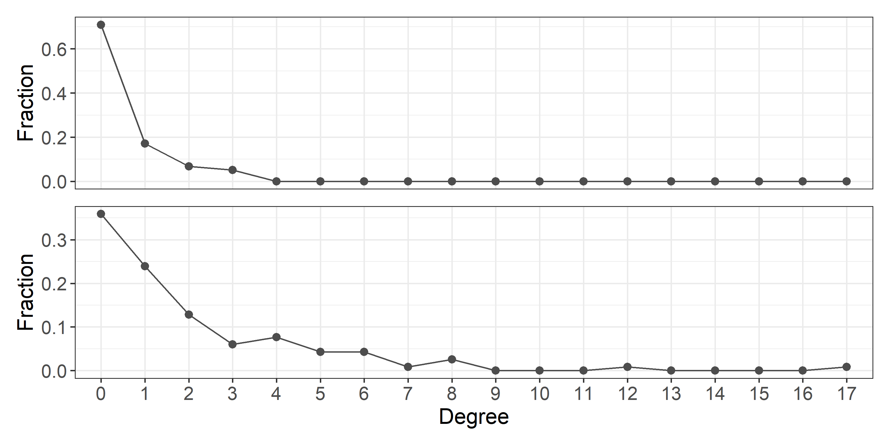<!-- -->

#### Graphlet Correlation Matrix

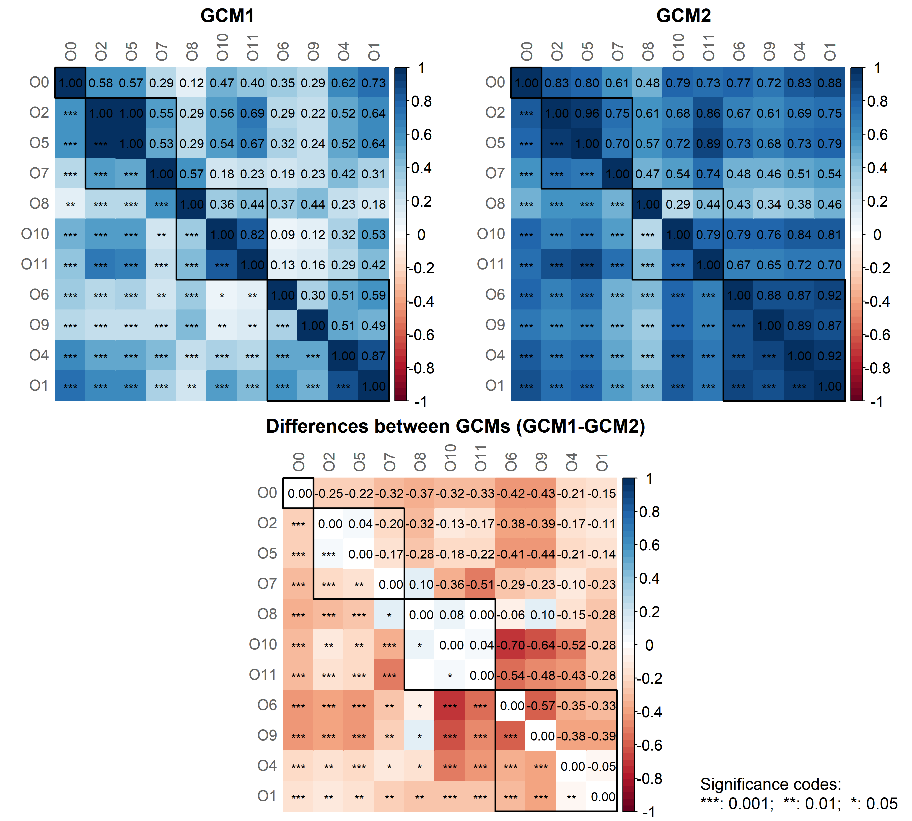<!-- -->

#### Network Plot

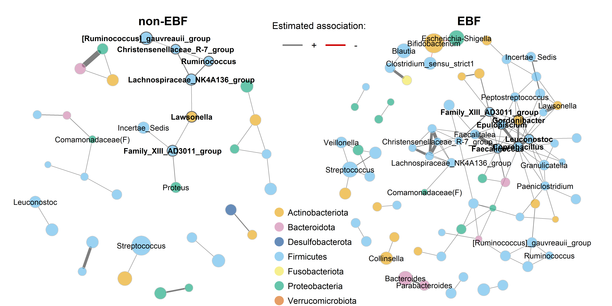<!-- -->

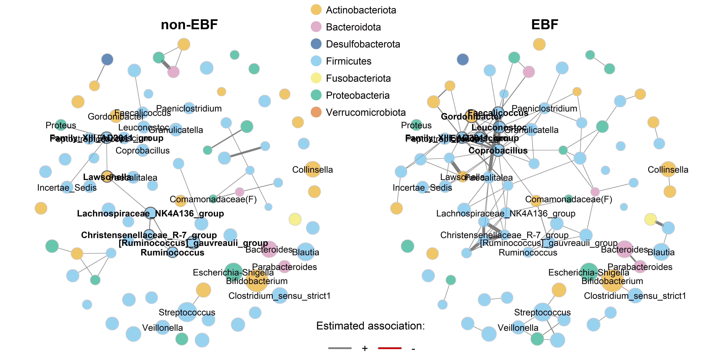<!-- -->

### corshrink with multiplicative replacement

#### netAnalyze summary

    ## 
    ## Component sizes
    ## ```````````````
    ## non-EBF:                 
    ## size: 17 4 3 2  1
    ##    #:  1 1 1 3 87
    ## EBF:               
    ## size: 31 4 2  1
    ##    #:  1 1 5 72
    ## ______________________________
    ## Global network properties
    ## `````````````````````````
    ## Largest connected component (LCC):
    ##                            non-EBF       EBF
    ## Relative LCC size          0.14530   0.26496
    ## Clustering coefficient     0.69954   0.64682
    ## Modularity                 0.19461   0.24247
    ## Positive edge percentage 100.00000 100.00000
    ## Edge density               0.30147   0.15054
    ## Natural connectivity       0.12217   0.07108
    ## Vertex connectivity        1.00000   1.00000
    ## Edge connectivity          1.00000   1.00000
    ## Average dissimilarity*     0.87002   0.93347
    ## Average path length**      1.31272   1.34071
    ## 
    ## Whole network:
    ##                            non-EBF       EBF
    ## Number of components      93.00000  79.00000
    ## Clustering coefficient     0.75976   0.71104
    ## Modularity                 0.40077   0.39060
    ## Positive edge percentage 100.00000 100.00000
    ## Edge density               0.00752   0.01194
    ## Natural connectivity       0.01035   0.01223
    ## -----
    ## *: Dissimilarity = 1 - edge weight
    ## **: Path length = Units with average dissimilarity
    ## 
    ## ______________________________
    ## Clusters
    ## - In the whole network
    ## - Algorithm: cluster_fast_greedy
    ## ```````````````````````````````` 
    ## non-EBF:                          
    ## name:  0 1 2 3 4 5 6 7 8 9
    ##    #: 87 6 7 4 2 2 2 2 2 3
    ## 
    ## EBF:                                  
    ## name:  0  1  2 3 4 5 6 7 8 9 10 11
    ##    #: 72 11 11 4 2 2 2 3 2 2  4  2
    ## 
    ## ______________________________
    ## Hubs
    ## - In alphabetical/numerical order
    ## - Based on empirical quantiles of centralities
    ## ```````````````````````````````````````````````
    ##                              non-EBF                          EBF
    ##  [Eubacterium]_coprostanoligenegroup                 Blastococcus
    ##                 9_Pasteurellaceae(F)                Coprobacillus
    ##                  Lachnoanaerobaculum                   Fenollaria
    ##         Lachnospiraceae_ND3007_group Lachnospiraceae_ND3007_group
    ##                        Porphyromonas                    Megamonas
    ##                          Pseudomonas             Stenotrophomonas
    ## 
    ## ______________________________
    ## Centrality measures
    ## - In decreasing order
    ## - Centrality of disconnected components is zero
    ## ````````````````````````````````````````````````
    ## Degree (unnormalized):
    ##                                      non-EBF    EBF
    ##         Lachnospiraceae_ND3007_group      12     15
    ##                 9_Pasteurellaceae(F)      11      1
    ##  [Eubacterium]_coprostanoligenegroup      11      0
    ##                          Pseudomonas       6      1
    ##                        Porphyromonas       6      5
    ##                                       ______ ______
    ##                        Coprobacillus       0     23
    ##         Lachnospiraceae_ND3007_group      12     15
    ##                            Megamonas       0     14
    ##                         Blastococcus       0     11
    ##                     Stenotrophomonas       0      8
    ## 
    ## Betweenness centrality (unnormalized):
    ##                               non-EBF    EBF
    ##  Lachnospiraceae_ND3007_group      76      0
    ##                 Porphyromonas      17      0
    ##                  Actinotignum      15      0
    ##                   Lachnospira      15      0
    ##           Lachnoanaerobaculum      15      0
    ##                                ______ ______
    ##                 Coprobacillus       0    368
    ##      Family_XIII_AD3011_group       0     83
    ##                 Faecalicoccus       0     57
    ##                  Anaeroglobus       0     29
    ##              Paeniclostridium       0     29
    ## 
    ## Closeness centrality (unnormalized):
    ##                                       non-EBF      EBF
    ##         Lachnospiraceae_ND3007_group 21.65652 37.53532
    ##  [Eubacterium]_coprostanoligenegroup 20.64312        0
    ##                 9_Pasteurellaceae(F) 20.62072 23.63944
    ##                        Porphyromonas 16.40684 27.47037
    ##                  Lachnoanaerobaculum  16.3201 26.73609
    ##                                        ______   ______
    ##                        Coprobacillus        0 45.76445
    ##         Lachnospiraceae_ND3007_group 21.65652 37.53532
    ##                            Megamonas        0 36.97873
    ##                         Blastococcus        0 33.49006
    ##                     Stenotrophomonas        0 30.80541
    ## 
    ## Eigenvector centrality (unnormalized):
    ##                                      non-EBF     EBF
    ##         Lachnospiraceae_ND3007_group 0.43813  0.3759
    ##  [Eubacterium]_coprostanoligenegroup 0.41425       0
    ##                 9_Pasteurellaceae(F) 0.41367 0.04725
    ##                          Pseudomonas 0.28511 0.04693
    ##                        Porphyromonas 0.23937 0.18979
    ##                                       ______  ______
    ##                        Coprobacillus       0 0.44745
    ##         Lachnospiraceae_ND3007_group 0.43813  0.3759
    ##                            Megamonas       0 0.36853
    ##                         Blastococcus       0 0.31116
    ##                     Stenotrophomonas       0 0.26993

#### Association Histogram

<!-- -->

#### Degree Distribution

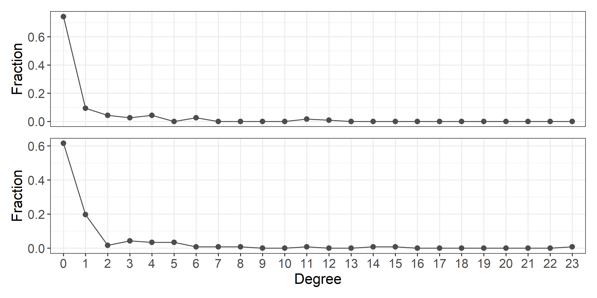<!-- -->

#### Graphlet Correlation Matrix

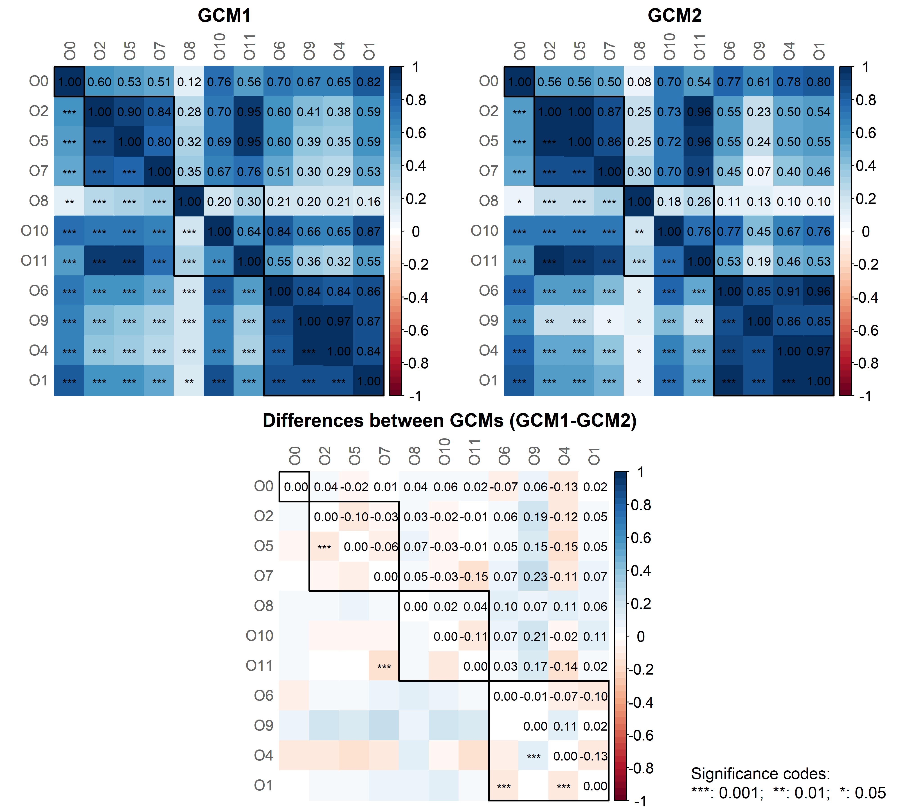<!-- -->

#### Network Plot

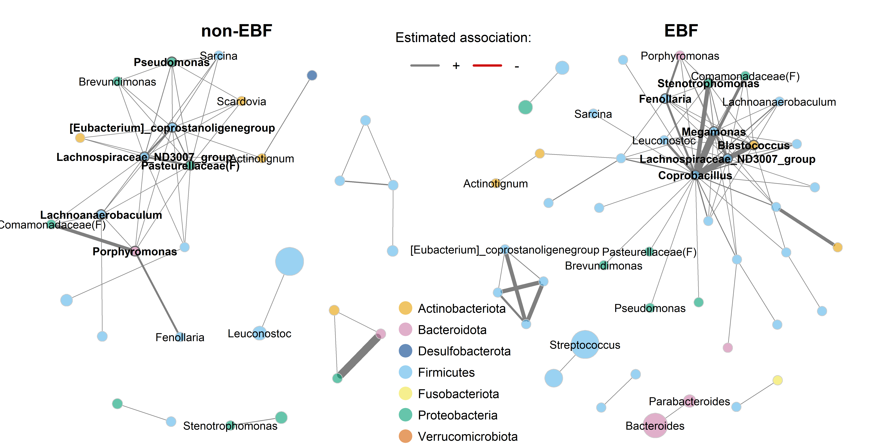<!-- -->

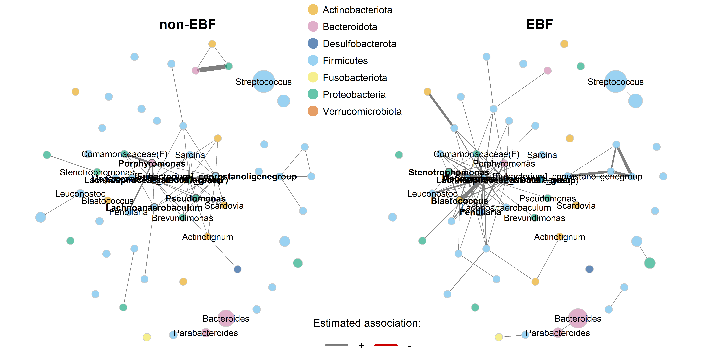<!-- -->

### corshrink with bayesMult replacement

#### netAnalyze summary

    ## 
    ## Component sizes
    ## ```````````````
    ## non-EBF:                  
    ## size: 8 7 5 3 2  1
    ##    #: 1 1 1 3 4 80
    ## EBF:               
    ## size: 76 3 2  1
    ##    #:  1 1 5 28
    ## ______________________________
    ## Global network properties
    ## `````````````````````````
    ## Largest connected component (LCC):
    ##                            non-EBF      EBF
    ## Relative LCC size          0.06838  0.64957
    ## Clustering coefficient     0.33552  0.44022
    ## Modularity                 0.36916  0.53490
    ## Positive edge percentage 100.00000 94.55782
    ## Edge density               0.28571  0.05158
    ## Natural connectivity       0.19229  0.01907
    ## Vertex connectivity        1.00000  1.00000
    ## Edge connectivity          1.00000  1.00000
    ## Average dissimilarity*     0.89488  0.98126
    ## Average path length**      1.74368  2.45831
    ## 
    ## Whole network:
    ##                            non-EBF      EBF
    ## Number of components      90.00000 35.00000
    ## Clustering coefficient     0.40821  0.43276
    ## Modularity                 0.84025  0.56493
    ## Positive edge percentage 100.00000 94.80519
    ## Edge density               0.00457  0.02269
    ## Natural connectivity       0.00925  0.01122
    ## -----
    ## *: Dissimilarity = 1 - edge weight
    ## **: Path length = Units with average dissimilarity
    ## 
    ## ______________________________
    ## Clusters
    ## - In the whole network
    ## - Algorithm: cluster_fast_greedy
    ## ```````````````````````````````` 
    ## non-EBF:                                
    ## name:  0 1 2 3 4 5 6 7 8 9 10 11
    ##    #: 80 7 4 4 5 3 3 2 2 2  3  2
    ## 
    ## EBF:                                      
    ## name:  0  1  2  3 4 5 6 7 8 9 10 11 12
    ##    #: 28 15 22 13 9 9 2 2 2 2  3  8  2
    ## 
    ## ______________________________
    ## Hubs
    ## - In alphabetical/numerical order
    ## - Based on empirical quantiles of centralities
    ## ```````````````````````````````````````````````
    ##                          non-EBF                      EBF
    ##  [Ruminococcus]_gauvreauii_group            Coprobacillus
    ##    Christensenellaceae_R-7_group             Epulopiscium
    ##         Family_XIII_AD3011_group            Faecalicoccus
    ##    Lachnospiraceae_NK4A136_group Family_XIII_AD3011_group
    ##                       Lawsonella            Gordonibacter
    ##                     Ruminococcus              Leuconostoc
    ## 
    ## ______________________________
    ## Centrality measures
    ## - In decreasing order
    ## - Centrality of disconnected components is zero
    ## ````````````````````````````````````````````````
    ## Degree (unnormalized):
    ##                                non-EBF    EBF
    ##       Family_XIII_AD3011_group       3     12
    ##  Christensenellaceae_R-7_group       3      7
    ##  Lachnospiraceae_NK4A136_group       3      6
    ##                     Lawsonella       2      4
    ##                   Ruminococcus       2      2
    ##                                 ______ ______
    ##                  Coprobacillus       0     32
    ##                    Leuconostoc       0     13
    ##       Family_XIII_AD3011_group       3     12
    ##                  Faecalicoccus       0      9
    ##                   Faecalitalea       0      8
    ## 
    ## Betweenness centrality (unnormalized):
    ##                                non-EBF    EBF
    ##                     Lawsonella      12     22
    ##  Lachnospiraceae_NK4A136_group      12     54
    ##       Family_XIII_AD3011_group      11    690
    ##  Christensenellaceae_R-7_group       6     82
    ##          Phascolarctobacterium       0      0
    ##                                 ______ ______
    ##                  Coprobacillus       0   1936
    ##       Family_XIII_AD3011_group      11    690
    ##                  Peptoniphilus       0    610
    ##                    Varibaculum       0    594
    ##                         Rothia       0    536
    ## 
    ## Closeness centrality (unnormalized):
    ##                                non-EBF      EBF
    ##  Lachnospiraceae_NK4A136_group 6.65591 50.66888
    ##       Family_XIII_AD3011_group 6.22361 58.43619
    ##  Christensenellaceae_R-7_group 6.14599 45.61735
    ##                     Lawsonella 6.09533 48.77778
    ##                   Ruminococcus 5.43561 29.35987
    ##                                 ______   ______
    ##                  Coprobacillus       0 76.86096
    ##                    Leuconostoc       0 59.06504
    ##       Family_XIII_AD3011_group 6.22361 58.43619
    ##                  Faecalicoccus       0  54.8917
    ##                   Faecalitalea       0 53.77757
    ## 
    ## Eigenvector centrality (unnormalized):
    ##                                  non-EBF     EBF
    ##    Lachnospiraceae_NK4A136_group 0.56154 0.12015
    ##    Christensenellaceae_R-7_group 0.52543 0.09407
    ##                     Ruminococcus 0.46083 0.00356
    ##                       Lawsonella 0.31071  0.1088
    ##  [Ruminococcus]_gauvreauii_group 0.21714 0.01236
    ##                                   ______  ______
    ##                    Coprobacillus       0 0.51705
    ##                      Leuconostoc       0 0.33051
    ##         Family_XIII_AD3011_group 0.19704 0.27677
    ##                     Epulopiscium       0 0.25112
    ##                    Faecalicoccus       0 0.24869

#### Association Histogram

<!-- -->

#### Degree Distribution

<!-- -->

#### Graphlet Correlation Matrix

<!-- -->

#### Network Plot

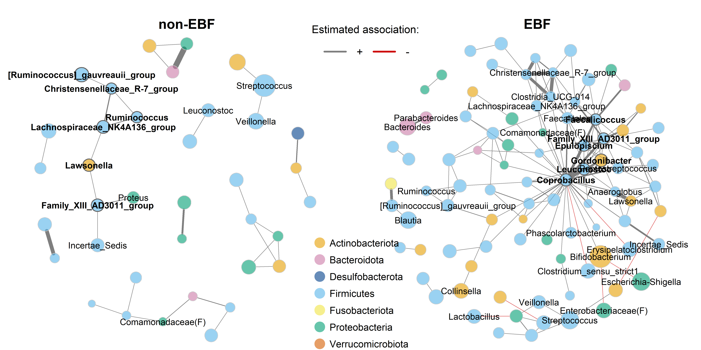<!-- -->

<!-- -->

## Comparison Of Global Network Properties

The following tables summarize three global network properties for the
construction methods shown in the thesis.

### Relative LCC Size

    ## # A tibble: 2 × 8
    ##   group   `SPIEC-EASI MB bayesMult` `SPIEC-EASI SLR` SPRING `corshrink multRepl` `corshrink bayesMult` `rhoshrink multRepl` `rhoshrink bayesMult`
    ##   <chr>                       <dbl>            <dbl>  <dbl>                <dbl>                 <dbl>                <dbl>                 <dbl>
    ## 1 non-EBF                     0.983            0.641  0.938                0.145                 0.068                0.128                 0.068
    ## 2 EBF                         0.513            0.368  0.892                0.265                 0.65                 0.214                 0.402

### Density

    ## # A tibble: 2 × 8
    ##   group   `SPIEC-EASI MB bayesMult` `SPIEC-EASI SLR` SPRING `corshrink multRepl` `corshrink bayesMult` `rhoshrink multRepl` `rhoshrink bayesMult`
    ##   <chr>                       <dbl>            <dbl>  <dbl>                <dbl>                 <dbl>                <dbl>                 <dbl>
    ## 1 non-EBF                     0.033            0.046  0.041                0.008                 0.005                0.006                 0.004
    ## 2 EBF                         0.014            0.015  0.046                0.012                 0.023                0.01                  0.017

### Natural Connectivity

    ## # A tibble: 2 × 8
    ##   group   `SPIEC-EASI MB bayesMult` `SPIEC-EASI SLR` SPRING `corshrink multRepl` `corshrink bayesMult` `rhoshrink multRepl` `rhoshrink bayesMult`
    ##   <chr>                       <dbl>            <dbl>  <dbl>                <dbl>                 <dbl>                <dbl>                 <dbl>
    ## 1 non-EBF                     0.011            0.013  0.018                0.01                  0.009                0.01                  0.009
    ## 2 EBF                         0.01             0.01   0.019                0.012                 0.011                0.012                 0.011

## Select Network For Permutation Testing

The permutation-testing part can be run for any network constructed in
the descriptive comparison above. Change `selected_permutation_method`
in the parameter chunk to switch the network and the folder used for all
permutation-related files.

    ## # A tibble: 1 × 5
    ##   selected_method     selected_label           n_taxa_group1 n_taxa_group2 output_dir                                                            
    ##   <chr>               <chr>                            <int>         <int> <chr>                                                                 
    ## 1 corshrink_bayesMult corshrink with bayesMult           117           117 G:/PhD/projects/phd_thesis/ch07_application/data/11_network_compariso…

## Generate Or Reuse Permuted Association Matrices

The following chunks are kept for reproducibility and are not evaluated
during normal rendering. The final filematrix at
`path_perm("assoPerm_ebf")` is used by both `netCompare()` and
`diffnet()`.

## Permutation-Based Differential Network Analysis

We compare local and global network characteristics with NetCoMi’s
`netCompare()` using empirical p-values, unconstrained `permApprox`
refinement, and constrained `permApprox` refinement.

### Empirical P-Values

#### Raw p-values

    ## 
    ## Comparison of Network Properties
    ## ----------------------------------
    ## CALL: 
    ## netCompare(x = props_ebf_perm, permTest = TRUE, verbose = TRUE, 
    ##     nPerm = n_perm_network_comparison, adjust = "none", cores = cores, 
    ##     seed = permutation_seed, fileLoadAssoPerm = path_perm("assoPerm_ebf"))
    ## 
    ## ______________________________
    ## Global network properties
    ## `````````````````````````
    ## Largest connected component (LCC):
    ##                          non-EBF    EBF    abs.diff.     p-value  
    ## Relative LCC size          0.068  0.650        0.581    0.347000  
    ## Clustering coefficient     0.336  0.440        0.105    0.623000  
    ## Modularity                 0.369  0.535        0.166    0.353000  
    ## Positive edge percentage 100.000 94.558        5.442    0.377000  
    ## Edge density               0.286  0.052        0.234    0.210000  
    ## Natural connectivity       0.192  0.019        0.173    0.133000  
    ## Vertex connectivity        1.000  1.000        0.000    1.000000  
    ## Edge connectivity          1.000  1.000        0.000    1.000000  
    ## Average dissimilarity*     0.895  0.981        0.086    0.207000  
    ## Average path length**      1.744  2.458        0.715    0.361000  
    ## 
    ## Whole network:
    ##                          non-EBF    EBF    abs.diff.     p-value  
    ## Number of components      90.000 35.000       55.000    0.262000  
    ## Clustering coefficient     0.408  0.433        0.025    0.908000  
    ## Modularity                 0.840  0.565        0.275    0.443000  
    ## Positive edge percentage 100.000 94.805        5.195    0.259000  
    ## Edge density               0.005  0.023        0.018    0.461000  
    ## Natural connectivity       0.009  0.011        0.002    0.543000  
    ## -----
    ## p-values: one-tailed test with null hypothesis diff=0
    ##  *: Dissimilarity = 1 - edge weight
    ## **: Path length = Units with average dissimilarity
    ## 
    ## ______________________________
    ## Jaccard index (similarity betw. sets of most central nodes)
    ## ```````````````````````````````````````````````````````````
    ##                     Jacc   P(<=Jacc)     P(>=Jacc)   
    ## degree             0.130    0.026475 *    0.993250   
    ## betweenness centr. 0.065    0.000462 ***  0.999943   
    ## closeness centr.   0.121    0.005237 **   0.998715   
    ## eigenvec. centr.   0.121    0.005237 **   0.998715   
    ## hub taxa           0.091    0.075147 .    0.988439   
    ## -----
    ## Jaccard index in [0,1] (1 indicates perfect agreement)
    ## 
    ## ______________________________
    ## Adjusted Rand index (similarity betw. clusterings)
    ## ``````````````````````````````````````````````````
    ##         wholeNet       LCC
    ## ARI        0.002     0.031
    ## p-value 0.913000  0.023000
    ## -----
    ## ARI in [-1,1] with ARI=1: perfect agreement betw. clusterings
    ##                    ARI=0: expected for two random clusterings
    ## p-value: permutation test (n=1000) with null hypothesis ARI=0
    ## 
    ## ______________________________
    ## Graphlet Correlation Distance
    ## `````````````````````````````
    ##         wholeNet         LCC  
    ## GCD        2.372       4.221  
    ## p-value 0.161000    0.300000  
    ## -----
    ## GCD >= 0 (GCD=0 indicates perfect agreement between GCMs)
    ## p-value: permutation test with null hypothesis GCD=0
    ## 
    ## ______________________________
    ## Centrality measures
    ## - In decreasing order of absolute differences
    ## - Centrality of disconnected components is zero
    ## ````````````````````````````````````````````````
    ## Degree (unnormalized):
    ##                          non-EBF EBF abs.diff.  p-value    
    ## Coprobacillus                  0  32        32 0.048000 *  
    ## Leuconostoc                    0  13        13 0.016000 *  
    ## Family_XIII_AD3011_group       3  12         9 0.521000    
    ## Faecalicoccus                  0   9         9 0.156000    
    ## Faecalitalea                   0   8         8 0.182000    
    ## 
    ## Betweenness centrality (unnormalized):
    ##                          non-EBF  EBF abs.diff.  p-value    
    ## Coprobacillus                  0 1936      1936 0.004000 ** 
    ## Family_XIII_AD3011_group      11  690       679 0.108000    
    ## Peptoniphilus                  0  610       610 0.007000 ** 
    ## Varibaculum                    0  594       594 0.003000 ** 
    ## Rothia                         0  536       536 0.002000 ** 
    ## 
    ## Closeness centrality (unnormalized):
    ##               non-EBF    EBF abs.diff.  p-value    
    ## Coprobacillus       0 76.861    76.861 0.095000 .  
    ## Leuconostoc         0 59.065    59.065 0.083000 .  
    ## Faecalicoccus       0 54.892    54.892 0.180000    
    ## Faecalitalea        0 53.778    53.778 0.206000    
    ## Epulopiscium        0 53.335    53.335 0.144000    
    ## 
    ## _________________________________________________________
    ## Significance codes: ***: 0.001, **: 0.01, *: 0.05, .: 0.1

#### BH adjusted p-values

    ## 
    ## Comparison of Network Properties
    ## ----------------------------------
    ## CALL: 
    ## netCompare(x = props_ebf_perm, permTest = TRUE, verbose = TRUE, 
    ##     nPerm = n_perm_network_comparison, adjust = "BH", cores = cores, 
    ##     seed = permutation_seed, fileLoadAssoPerm = path_perm("assoPerm_ebf"))
    ## 
    ## ______________________________
    ## Global network properties
    ## `````````````````````````
    ## Largest connected component (LCC):
    ##                          non-EBF    EBF    abs.diff.     p-value  
    ## Relative LCC size          0.068  0.650        0.581    0.347000  
    ## Clustering coefficient     0.336  0.440        0.105    0.623000  
    ## Modularity                 0.369  0.535        0.166    0.353000  
    ## Positive edge percentage 100.000 94.558        5.442    0.377000  
    ## Edge density               0.286  0.052        0.234    0.210000  
    ## Natural connectivity       0.192  0.019        0.173    0.133000  
    ## Vertex connectivity        1.000  1.000        0.000    1.000000  
    ## Edge connectivity          1.000  1.000        0.000    1.000000  
    ## Average dissimilarity*     0.895  0.981        0.086    0.207000  
    ## Average path length**      1.744  2.458        0.715    0.361000  
    ## 
    ## Whole network:
    ##                          non-EBF    EBF    abs.diff.     p-value  
    ## Number of components      90.000 35.000       55.000    0.262000  
    ## Clustering coefficient     0.408  0.433        0.025    0.908000  
    ## Modularity                 0.840  0.565        0.275    0.443000  
    ## Positive edge percentage 100.000 94.805        5.195    0.259000  
    ## Edge density               0.005  0.023        0.018    0.461000  
    ## Natural connectivity       0.009  0.011        0.002    0.543000  
    ## -----
    ## p-values: one-tailed test with null hypothesis diff=0
    ##  *: Dissimilarity = 1 - edge weight
    ## **: Path length = Units with average dissimilarity
    ## 
    ## ______________________________
    ## Jaccard index (similarity betw. sets of most central nodes)
    ## ```````````````````````````````````````````````````````````
    ##                     Jacc   P(<=Jacc)     P(>=Jacc)   
    ## degree             0.130    0.026475 *    0.993250   
    ## betweenness centr. 0.065    0.000462 ***  0.999943   
    ## closeness centr.   0.121    0.005237 **   0.998715   
    ## eigenvec. centr.   0.121    0.005237 **   0.998715   
    ## hub taxa           0.091    0.075147 .    0.988439   
    ## -----
    ## Jaccard index in [0,1] (1 indicates perfect agreement)
    ## 
    ## ______________________________
    ## Adjusted Rand index (similarity betw. clusterings)
    ## ``````````````````````````````````````````````````
    ##         wholeNet       LCC
    ## ARI        0.002     0.031
    ## p-value 0.913000  0.023000
    ## -----
    ## ARI in [-1,1] with ARI=1: perfect agreement betw. clusterings
    ##                    ARI=0: expected for two random clusterings
    ## p-value: permutation test (n=1000) with null hypothesis ARI=0
    ## 
    ## ______________________________
    ## Graphlet Correlation Distance
    ## `````````````````````````````
    ##         wholeNet         LCC  
    ## GCD        2.372       4.221  
    ## p-value 0.161000    0.300000  
    ## -----
    ## GCD >= 0 (GCD=0 indicates perfect agreement between GCMs)
    ## p-value: permutation test with null hypothesis GCD=0
    ## 
    ## ______________________________
    ## Centrality measures
    ## - In increasing order of unadjusted p-values
    ## - Centrality of disconnected components is zero
    ## ````````````````````````````````````````````````
    ## Degree (unnormalized):
    ##                non-EBF EBF abs.diff.  p-value     adj.p-value  
    ## Leuconostoc          0  13        13 0.016000 *      1.000000  
    ## Lactobacillus        0   1         1 0.042000 *      1.000000  
    ## Staphylococcus       0   4         4 0.043000 *      1.000000  
    ## Coprobacillus        0  32        32 0.048000 *      1.000000  
    ## Gemella              0   4         4 0.080000 .      1.000000  
    ## 
    ## Betweenness centrality (unnormalized):
    ##               non-EBF  EBF abs.diff.  p-value     adj.p-value  
    ## Rothia              0  536       536 0.002000 **     0.156000  
    ## Varibaculum         0  594       594 0.003000 **     0.156000  
    ## Coprobacillus       0 1936      1936 0.004000 **     0.156000  
    ## Peptoniphilus       0  610       610 0.007000 **     0.204750  
    ## Streptococcus       0  478       478 0.015000 *      0.351000  
    ## 
    ## Closeness centrality (unnormalized):
    ##               non-EBF    EBF abs.diff.  p-value     adj.p-value  
    ## Lactobacillus       0 16.938    16.938 0.042000 *      0.715565  
    ## Leuconostoc         0 59.065    59.065 0.083000 .      0.715565  
    ## Coprobacillus       0 76.861    76.861 0.095000 .      0.715565  
    ## Eggerthella         0 18.573    18.573 0.136000        0.715565  
    ## Epulopiscium        0 53.335    53.335 0.144000        0.715565  
    ## 
    ## Eigenvector centrality (unnormalized):
    ##                  non-EBF   EBF abs.diff.  p-value     adj.p-value  
    ## Ruminococcus       0.821 0.007     0.814 0.020000 *      0.959400  
    ## Leuconostoc        0.000 0.639     0.639 0.035000 *      0.959400  
    ## Terrisporobacter   0.000 0.033     0.033 0.037000 *      0.959400  
    ## Coprobacillus      0.000 1.000     1.000 0.037000 *      0.959400  
    ## Lactobacillus      0.000 0.000     0.000 0.041000 *      0.959400  
    ## 
    ## _________________________________________________________
    ## Significance codes: ***: 0.001, **: 0.01, *: 0.05, .: 0.1

### permApprox Refinement Without Constraint

#### Raw p-values

    ## 
    ## Comparison of Network Properties
    ## ----------------------------------
    ## CALL: 
    ## netCompare(x = props_ebf_perm, permTest = TRUE, verbose = TRUE, 
    ##     nPerm = n_perm_network_comparison, refinePermPvals = TRUE, 
    ##     permApproxParams = list(method = "gpd", gpd_ctrl = gpd_ctrl), 
    ##     adjust = "none", cores = cores, seed = permutation_seed, 
    ##     fileLoadAssoPerm = path_perm("assoPerm_ebf"))
    ## 
    ## ______________________________
    ## Global network properties
    ## `````````````````````````
    ## Largest connected component (LCC):
    ##                          non-EBF    EBF    abs.diff.     p-value  
    ## Relative LCC size          0.068  0.650        0.581    0.347000  
    ## Clustering coefficient     0.336  0.440        0.105    0.623000  
    ## Modularity                 0.369  0.535        0.166    0.353000  
    ## Positive edge percentage 100.000 94.558        5.442    0.377000  
    ## Edge density               0.286  0.052        0.234    0.210000  
    ## Natural connectivity       0.192  0.019        0.173    0.133000  
    ## Vertex connectivity        1.000  1.000        0.000    1.000000  
    ## Edge connectivity          1.000  1.000        0.000    1.000000  
    ## Average dissimilarity*     0.895  0.981        0.086    0.207000  
    ## Average path length**      1.744  2.458        0.715    0.361000  
    ## 
    ## Whole network:
    ##                          non-EBF    EBF    abs.diff.     p-value  
    ## Number of components      90.000 35.000       55.000    0.262000  
    ## Clustering coefficient     0.408  0.433        0.025    0.908000  
    ## Modularity                 0.840  0.565        0.275    0.443000  
    ## Positive edge percentage 100.000 94.805        5.195    0.259000  
    ## Edge density               0.005  0.023        0.018    0.461000  
    ## Natural connectivity       0.009  0.011        0.002    0.543000  
    ## -----
    ## p-values: one-tailed test with null hypothesis diff=0
    ##  *: Dissimilarity = 1 - edge weight
    ## **: Path length = Units with average dissimilarity
    ## 
    ## ______________________________
    ## Jaccard index (similarity betw. sets of most central nodes)
    ## ```````````````````````````````````````````````````````````
    ##                     Jacc   P(<=Jacc)     P(>=Jacc)   
    ## degree             0.130    0.026475 *    0.993250   
    ## betweenness centr. 0.065    0.000462 ***  0.999943   
    ## closeness centr.   0.121    0.005237 **   0.998715   
    ## eigenvec. centr.   0.121    0.005237 **   0.998715   
    ## hub taxa           0.091    0.075147 .    0.988439   
    ## -----
    ## Jaccard index in [0,1] (1 indicates perfect agreement)
    ## 
    ## ______________________________
    ## Adjusted Rand index (similarity betw. clusterings)
    ## ``````````````````````````````````````````````````
    ##         wholeNet       LCC
    ## ARI        0.002     0.031
    ## p-value 0.913087  0.023976
    ## -----
    ## ARI in [-1,1] with ARI=1: perfect agreement betw. clusterings
    ##                    ARI=0: expected for two random clusterings
    ## p-value: permutation test (n=1000) with null hypothesis ARI=0
    ## 
    ## ______________________________
    ## Graphlet Correlation Distance
    ## `````````````````````````````
    ##         wholeNet         LCC  
    ## GCD        2.372       4.221  
    ## p-value 0.161000    0.300000  
    ## -----
    ## GCD >= 0 (GCD=0 indicates perfect agreement between GCMs)
    ## p-value: permutation test with null hypothesis GCD=0
    ## 
    ## ______________________________
    ## Centrality measures
    ## - In decreasing order of absolute differences
    ## - Centrality of disconnected components is zero
    ## ````````````````````````````````````````````````
    ## Degree (unnormalized):
    ##                          non-EBF EBF abs.diff.  p-value    
    ## Coprobacillus                  0  32        32 0.048000 *  
    ## Leuconostoc                    0  13        13 0.016000 *  
    ## Family_XIII_AD3011_group       3  12         9 0.521000    
    ## Faecalicoccus                  0   9         9 0.156000    
    ## Faecalitalea                   0   8         8 0.182000    
    ## 
    ## Betweenness centrality (unnormalized):
    ##                          non-EBF  EBF abs.diff.  p-value    
    ## Coprobacillus                  0 1936      1936 0.003549 ** 
    ## Family_XIII_AD3011_group      11  690       679 0.108000    
    ## Peptoniphilus                  0  610       610 0.004121 ** 
    ## Varibaculum                    0  594       594 0.003000 ** 
    ## Rothia                         0  536       536 0.002000 ** 
    ## 
    ## Closeness centrality (unnormalized):
    ##               non-EBF    EBF abs.diff.  p-value    
    ## Coprobacillus       0 76.861    76.861 0.099038 .  
    ## Leuconostoc         0 59.065    59.065 0.077189 .  
    ## Faecalicoccus       0 54.892    54.892 0.180000    
    ## Faecalitalea        0 53.778    53.778 0.206000    
    ## Epulopiscium        0 53.335    53.335 0.144000    
    ## 
    ## _________________________________________________________
    ## Significance codes: ***: 0.001, **: 0.01, *: 0.05, .: 0.1

#### BH adjusted p-values

    ## 
    ## Comparison of Network Properties
    ## ----------------------------------
    ## CALL: 
    ## netCompare(x = props_ebf_perm, permTest = TRUE, verbose = TRUE, 
    ##     nPerm = n_perm_network_comparison, refinePermPvals = TRUE, 
    ##     permApproxParams = list(method = "gpd", gpd_ctrl = gpd_ctrl), 
    ##     adjust = "BH", cores = cores, seed = permutation_seed, fileLoadAssoPerm = path_perm("assoPerm_ebf"))
    ## 
    ## ______________________________
    ## Global network properties
    ## `````````````````````````
    ## Largest connected component (LCC):
    ##                          non-EBF    EBF    abs.diff.     p-value  
    ## Relative LCC size          0.068  0.650        0.581    0.347000  
    ## Clustering coefficient     0.336  0.440        0.105    0.623000  
    ## Modularity                 0.369  0.535        0.166    0.353000  
    ## Positive edge percentage 100.000 94.558        5.442    0.377000  
    ## Edge density               0.286  0.052        0.234    0.210000  
    ## Natural connectivity       0.192  0.019        0.173    0.133000  
    ## Vertex connectivity        1.000  1.000        0.000    1.000000  
    ## Edge connectivity          1.000  1.000        0.000    1.000000  
    ## Average dissimilarity*     0.895  0.981        0.086    0.207000  
    ## Average path length**      1.744  2.458        0.715    0.361000  
    ## 
    ## Whole network:
    ##                          non-EBF    EBF    abs.diff.     p-value  
    ## Number of components      90.000 35.000       55.000    0.262000  
    ## Clustering coefficient     0.408  0.433        0.025    0.908000  
    ## Modularity                 0.840  0.565        0.275    0.443000  
    ## Positive edge percentage 100.000 94.805        5.195    0.259000  
    ## Edge density               0.005  0.023        0.018    0.461000  
    ## Natural connectivity       0.009  0.011        0.002    0.543000  
    ## -----
    ## p-values: one-tailed test with null hypothesis diff=0
    ##  *: Dissimilarity = 1 - edge weight
    ## **: Path length = Units with average dissimilarity
    ## 
    ## ______________________________
    ## Jaccard index (similarity betw. sets of most central nodes)
    ## ```````````````````````````````````````````````````````````
    ##                     Jacc   P(<=Jacc)     P(>=Jacc)   
    ## degree             0.130    0.026475 *    0.993250   
    ## betweenness centr. 0.065    0.000462 ***  0.999943   
    ## closeness centr.   0.121    0.005237 **   0.998715   
    ## eigenvec. centr.   0.121    0.005237 **   0.998715   
    ## hub taxa           0.091    0.075147 .    0.988439   
    ## -----
    ## Jaccard index in [0,1] (1 indicates perfect agreement)
    ## 
    ## ______________________________
    ## Adjusted Rand index (similarity betw. clusterings)
    ## ``````````````````````````````````````````````````
    ##         wholeNet       LCC
    ## ARI        0.002     0.031
    ## p-value 0.913087  0.023976
    ## -----
    ## ARI in [-1,1] with ARI=1: perfect agreement betw. clusterings
    ##                    ARI=0: expected for two random clusterings
    ## p-value: permutation test (n=1000) with null hypothesis ARI=0
    ## 
    ## ______________________________
    ## Graphlet Correlation Distance
    ## `````````````````````````````
    ##         wholeNet         LCC  
    ## GCD        2.372       4.221  
    ## p-value 0.161000    0.300000  
    ## -----
    ## GCD >= 0 (GCD=0 indicates perfect agreement between GCMs)
    ## p-value: permutation test with null hypothesis GCD=0
    ## 
    ## ______________________________
    ## Centrality measures
    ## - In decreasing order of absolute differences
    ## - Centrality of disconnected components is zero
    ## ````````````````````````````````````````````````
    ## Degree (unnormalized):
    ##                          non-EBF EBF abs.diff.  p-value     adj.p-value  
    ## Coprobacillus                  0  32        32 0.048000 *      1.000000  
    ## Leuconostoc                    0  13        13 0.016000 *      1.000000  
    ## Family_XIII_AD3011_group       3  12         9 0.521000        1.000000  
    ## Faecalicoccus                  0   9         9 0.156000        1.000000  
    ## Faecalitalea                   0   8         8 0.182000        1.000000  
    ## 
    ## Betweenness centrality (unnormalized):
    ##                          non-EBF  EBF abs.diff.  p-value     adj.p-value  
    ## Coprobacillus                  0 1936      1936 0.003549 **     0.120527  
    ## Family_XIII_AD3011_group      11  690       679 0.108000        1.000000  
    ## Peptoniphilus                  0  610       610 0.004121 **     0.120527  
    ## Varibaculum                    0  594       594 0.003000 **     0.120527  
    ## Rothia                         0  536       536 0.002000 **     0.120527  
    ## 
    ## Closeness centrality (unnormalized):
    ##               non-EBF    EBF abs.diff.  p-value     adj.p-value  
    ## Coprobacillus       0 76.861    76.861 0.099038 .      0.715565  
    ## Leuconostoc         0 59.065    59.065 0.077189 .      0.715565  
    ## Faecalicoccus       0 54.892    54.892 0.180000        0.715565  
    ## Faecalitalea        0 53.778    53.778 0.206000        0.715565  
    ## Epulopiscium        0 53.335    53.335 0.144000        0.715565  
    ## 
    ## _________________________________________________________
    ## Significance codes: ***: 0.001, **: 0.01, *: 0.05, .: 0.1

### permApprox Refinement With Constraint

#### Raw p-values

    ## 
    ## Comparison of Network Properties
    ## ----------------------------------
    ## CALL: 
    ## netCompare(x = props_ebf_perm, permTest = TRUE, verbose = TRUE, 
    ##     nPerm = n_perm_network_comparison, refinePermPvals = TRUE, 
    ##     permApproxParams = list(method = "gpd", gpd_ctrl = gpd_ctrl), 
    ##     adjust = "none", cores = cores, seed = permutation_seed, 
    ##     fileLoadAssoPerm = path_perm("assoPerm_ebf"))
    ## 
    ## ______________________________
    ## Global network properties
    ## `````````````````````````
    ## Largest connected component (LCC):
    ##                          non-EBF    EBF    abs.diff.     p-value  
    ## Relative LCC size          0.068  0.650        0.581    0.347000  
    ## Clustering coefficient     0.336  0.440        0.105    0.623000  
    ## Modularity                 0.369  0.535        0.166    0.353000  
    ## Positive edge percentage 100.000 94.558        5.442    0.377000  
    ## Edge density               0.286  0.052        0.234    0.210000  
    ## Natural connectivity       0.192  0.019        0.173    0.133000  
    ## Vertex connectivity        1.000  1.000        0.000    1.000000  
    ## Edge connectivity          1.000  1.000        0.000    1.000000  
    ## Average dissimilarity*     0.895  0.981        0.086    0.207000  
    ## Average path length**      1.744  2.458        0.715    0.361000  
    ## 
    ## Whole network:
    ##                          non-EBF    EBF    abs.diff.     p-value  
    ## Number of components      90.000 35.000       55.000    0.262000  
    ## Clustering coefficient     0.408  0.433        0.025    0.908000  
    ## Modularity                 0.840  0.565        0.275    0.443000  
    ## Positive edge percentage 100.000 94.805        5.195    0.259000  
    ## Edge density               0.005  0.023        0.018    0.461000  
    ## Natural connectivity       0.009  0.011        0.002    0.543000  
    ## -----
    ## p-values: one-tailed test with null hypothesis diff=0
    ##  *: Dissimilarity = 1 - edge weight
    ## **: Path length = Units with average dissimilarity
    ## 
    ## ______________________________
    ## Jaccard index (similarity betw. sets of most central nodes)
    ## ```````````````````````````````````````````````````````````
    ##                     Jacc   P(<=Jacc)     P(>=Jacc)   
    ## degree             0.130    0.026475 *    0.993250   
    ## betweenness centr. 0.065    0.000462 ***  0.999943   
    ## closeness centr.   0.121    0.005237 **   0.998715   
    ## eigenvec. centr.   0.121    0.005237 **   0.998715   
    ## hub taxa           0.091    0.075147 .    0.988439   
    ## -----
    ## Jaccard index in [0,1] (1 indicates perfect agreement)
    ## 
    ## ______________________________
    ## Adjusted Rand index (similarity betw. clusterings)
    ## ``````````````````````````````````````````````````
    ##         wholeNet       LCC
    ## ARI        0.002     0.031
    ## p-value 0.913087  0.023976
    ## -----
    ## ARI in [-1,1] with ARI=1: perfect agreement betw. clusterings
    ##                    ARI=0: expected for two random clusterings
    ## p-value: permutation test (n=1000) with null hypothesis ARI=0
    ## 
    ## ______________________________
    ## Graphlet Correlation Distance
    ## `````````````````````````````
    ##         wholeNet         LCC  
    ## GCD        2.372       4.221  
    ## p-value 0.161000    0.300000  
    ## -----
    ## GCD >= 0 (GCD=0 indicates perfect agreement between GCMs)
    ## p-value: permutation test with null hypothesis GCD=0
    ## 
    ## ______________________________
    ## Centrality measures
    ## - In decreasing order of absolute differences
    ## - Centrality of disconnected components is zero
    ## ````````````````````````````````````````````````
    ## Degree (unnormalized):
    ##                          non-EBF EBF abs.diff.  p-value    
    ## Coprobacillus                  0  32        32 0.048000 *  
    ## Leuconostoc                    0  13        13 0.016000 *  
    ## Family_XIII_AD3011_group       3  12         9 0.521000    
    ## Faecalicoccus                  0   9         9 0.156000    
    ## Faecalitalea                   0   8         8 0.182000    
    ## 
    ## Betweenness centrality (unnormalized):
    ##                          non-EBF  EBF abs.diff.  p-value    
    ## Coprobacillus                  0 1936      1936 0.003549 ** 
    ## Family_XIII_AD3011_group      11  690       679 0.108000    
    ## Peptoniphilus                  0  610       610 0.004121 ** 
    ## Varibaculum                    0  594       594 0.003000 ** 
    ## Rothia                         0  536       536 0.002000 ** 
    ## 
    ## Closeness centrality (unnormalized):
    ##               non-EBF    EBF abs.diff.  p-value    
    ## Coprobacillus       0 76.861    76.861 0.096209 .  
    ## Leuconostoc         0 59.065    59.065 0.074274 .  
    ## Faecalicoccus       0 54.892    54.892 0.180000    
    ## Faecalitalea        0 53.778    53.778 0.206000    
    ## Epulopiscium        0 53.335    53.335 0.144000    
    ## 
    ## _________________________________________________________
    ## Significance codes: ***: 0.001, **: 0.01, *: 0.05, .: 0.1

#### BH adjusted p-values

    ## 
    ## Comparison of Network Properties
    ## ----------------------------------
    ## CALL: 
    ## netCompare(x = props_ebf_perm, permTest = TRUE, verbose = TRUE, 
    ##     nPerm = n_perm_network_comparison, refinePermPvals = TRUE, 
    ##     permApproxParams = list(method = "gpd", gpd_ctrl = gpd_ctrl), 
    ##     adjust = "BH", cores = cores, seed = permutation_seed, fileLoadAssoPerm = path_perm("assoPerm_ebf"))
    ## 
    ## ______________________________
    ## Global network properties
    ## `````````````````````````
    ## Largest connected component (LCC):
    ##                          non-EBF    EBF    abs.diff.     p-value  
    ## Relative LCC size          0.068  0.650        0.581    0.347000  
    ## Clustering coefficient     0.336  0.440        0.105    0.623000  
    ## Modularity                 0.369  0.535        0.166    0.353000  
    ## Positive edge percentage 100.000 94.558        5.442    0.377000  
    ## Edge density               0.286  0.052        0.234    0.210000  
    ## Natural connectivity       0.192  0.019        0.173    0.133000  
    ## Vertex connectivity        1.000  1.000        0.000    1.000000  
    ## Edge connectivity          1.000  1.000        0.000    1.000000  
    ## Average dissimilarity*     0.895  0.981        0.086    0.207000  
    ## Average path length**      1.744  2.458        0.715    0.361000  
    ## 
    ## Whole network:
    ##                          non-EBF    EBF    abs.diff.     p-value  
    ## Number of components      90.000 35.000       55.000    0.262000  
    ## Clustering coefficient     0.408  0.433        0.025    0.908000  
    ## Modularity                 0.840  0.565        0.275    0.443000  
    ## Positive edge percentage 100.000 94.805        5.195    0.259000  
    ## Edge density               0.005  0.023        0.018    0.461000  
    ## Natural connectivity       0.009  0.011        0.002    0.543000  
    ## -----
    ## p-values: one-tailed test with null hypothesis diff=0
    ##  *: Dissimilarity = 1 - edge weight
    ## **: Path length = Units with average dissimilarity
    ## 
    ## ______________________________
    ## Jaccard index (similarity betw. sets of most central nodes)
    ## ```````````````````````````````````````````````````````````
    ##                     Jacc   P(<=Jacc)     P(>=Jacc)   
    ## degree             0.130    0.026475 *    0.993250   
    ## betweenness centr. 0.065    0.000462 ***  0.999943   
    ## closeness centr.   0.121    0.005237 **   0.998715   
    ## eigenvec. centr.   0.121    0.005237 **   0.998715   
    ## hub taxa           0.091    0.075147 .    0.988439   
    ## -----
    ## Jaccard index in [0,1] (1 indicates perfect agreement)
    ## 
    ## ______________________________
    ## Adjusted Rand index (similarity betw. clusterings)
    ## ``````````````````````````````````````````````````
    ##         wholeNet       LCC
    ## ARI        0.002     0.031
    ## p-value 0.913087  0.023976
    ## -----
    ## ARI in [-1,1] with ARI=1: perfect agreement betw. clusterings
    ##                    ARI=0: expected for two random clusterings
    ## p-value: permutation test (n=1000) with null hypothesis ARI=0
    ## 
    ## ______________________________
    ## Graphlet Correlation Distance
    ## `````````````````````````````
    ##         wholeNet         LCC  
    ## GCD        2.372       4.221  
    ## p-value 0.161000    0.300000  
    ## -----
    ## GCD >= 0 (GCD=0 indicates perfect agreement between GCMs)
    ## p-value: permutation test with null hypothesis GCD=0
    ## 
    ## ______________________________
    ## Centrality measures
    ## - In decreasing order of absolute differences
    ## - Centrality of disconnected components is zero
    ## ````````````````````````````````````````````````
    ## Degree (unnormalized):
    ##                          non-EBF EBF abs.diff.  p-value     adj.p-value  
    ## Coprobacillus                  0  32        32 0.048000 *      1.000000  
    ## Leuconostoc                    0  13        13 0.016000 *      1.000000  
    ## Family_XIII_AD3011_group       3  12         9 0.521000        1.000000  
    ## Faecalicoccus                  0   9         9 0.156000        1.000000  
    ## Faecalitalea                   0   8         8 0.182000        1.000000  
    ## 
    ## Betweenness centrality (unnormalized):
    ##                          non-EBF  EBF abs.diff.  p-value     adj.p-value  
    ## Coprobacillus                  0 1936      1936 0.003549 **     0.120527  
    ## Family_XIII_AD3011_group      11  690       679 0.108000        1.000000  
    ## Peptoniphilus                  0  610       610 0.004121 **     0.120527  
    ## Varibaculum                    0  594       594 0.003000 **     0.120527  
    ## Rothia                         0  536       536 0.002000 **     0.120527  
    ## 
    ## Closeness centrality (unnormalized):
    ##               non-EBF    EBF abs.diff.  p-value     adj.p-value  
    ## Coprobacillus       0 76.861    76.861 0.096209 .      0.715565  
    ## Leuconostoc         0 59.065    59.065 0.074274 .      0.715565  
    ## Faecalicoccus       0 54.892    54.892 0.180000        0.715565  
    ## Faecalitalea        0 53.778    53.778 0.206000        0.715565  
    ## Epulopiscium        0 53.335    53.335 0.144000        0.715565  
    ## 
    ## _________________________________________________________
    ## Significance codes: ***: 0.001, **: 0.01, *: 0.05, .: 0.1

### p-value comparison

    ## # A tibble: 12 × 8
    ##    measure     method            n    min   q25 median   q75   max
    ##    <chr>       <chr>         <int>  <dbl> <dbl>  <dbl> <dbl> <dbl>
    ##  1 betweenness constrained     117 0.002  0.441  1         1     1
    ##  2 betweenness empirical       117 0.002  0.441  1         1     1
    ##  3 betweenness unconstrained   117 0.002  0.441  1         1     1
    ##  4 closeness   constrained     117 0.042  0.294  0.388     1     1
    ##  5 closeness   empirical       117 0.042  0.294  0.388     1     1
    ##  6 closeness   unconstrained   117 0.042  0.294  0.388     1     1
    ##  7 degree      constrained     117 0.016  0.345  0.66      1     1
    ##  8 degree      empirical       117 0.016  0.345  0.66      1     1
    ##  9 degree      unconstrained   117 0.016  0.345  0.66      1     1
    ## 10 eigenvector constrained     117 0.0226 0.293  0.531     1     1
    ## 11 eigenvector empirical       117 0.02   0.293  0.531     1     1
    ## 12 eigenvector unconstrained   117 0.0205 0.293  0.531     1     1

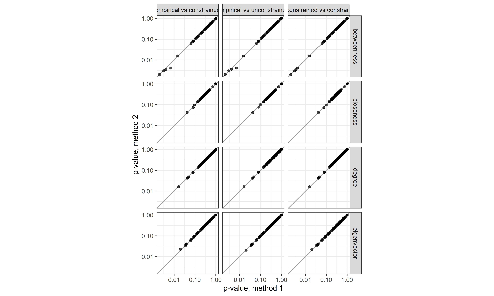<!-- -->

### Combined netCompare Summary

    ## Global network properties

    ## =========================

    ## Largest connected component (LCC): 
    ## ~~~~~~~~~~~~~~~~~~~~~~~~~~~~~~~~~~ 
    ## 
    ##                                   non-EBF        EBF  abs.diff.      p.emp   p.uncon.  p.constr.
    ## Relative LCC size                   0.068      0.650      0.581   0.350000   0.350000   0.350000
    ## Clustering coefficient              0.336      0.440      0.105   0.623000   0.623000   0.623000
    ## Modularity                          0.369      0.535      0.166   0.353000   0.353000   0.353000
    ## Positive edge percentage          100.000     94.558      5.442   0.377000   0.377000   0.377000
    ## Edge density                        0.286      0.052      0.234   0.210000   0.210000   0.210000
    ## Natural connectivity                0.192      0.019      0.173   0.133000   0.133000   0.133000
    ## Vertex connectivity                 1.000      1.000      0.000   1.000000   1.000000   1.000000
    ## Edge connectivity                   1.000      1.000      0.000   1.000000   1.000000   1.000000
    ## Average dissimilarity*              0.895      0.981      0.086   0.207000   0.207000   0.207000
    ## Average path length**               1.744      2.458      0.715   0.361000   0.361000   0.361000

    ## Whole network: 
    ## ~~~~~~~~~~~~~~ 
    ## 
    ##                                   non-EBF        EBF  abs.diff.      p.emp   p.uncon.  p.constr.
    ## Number of components               90.000     35.000     55.000   0.262000   0.262000   0.262000
    ## Clustering coefficient              0.408      0.433      0.025   0.908000   0.908000   0.908000
    ## Modularity                          0.840      0.565      0.275   0.443000   0.443000   0.443000
    ## Positive edge percentage          100.000     94.805      5.195   0.259000   0.259000   0.259000
    ## Edge density                        0.005      0.023      0.018   0.461000   0.461000   0.461000
    ## Natural connectivity                0.009      0.011      0.002   0.543000   0.543000   0.543000

    ## Centrality measures

    ## ===================

    ## Degree centrality 
    ## ~~~~~~~~~~~~~~~~~ 
    ## 
    ## Genus                             non-EBF        EBF  abs.diff.      p.emp   p.uncon.  p.constr.
    ## Leuconostoc                         0.000     13.000     13.000   0.016000   0.016000   0.016000
    ## Lactobacillus                       0.000      1.000      1.000   0.042000   0.042000   0.042000
    ## Staphylococcus                      0.000      4.000      4.000   0.043000   0.043000   0.043000
    ## Coprobacillus                       0.000     32.000     32.000   0.048000   0.048000   0.048000
    ## Gemella                             0.000      4.000      4.000   0.080000   0.080000   0.080000
    ## 
    ## Betweenness centrality 
    ## ~~~~~~~~~~~~~~~~~~~~~~ 
    ## 
    ## Genus                             non-EBF        EBF  abs.diff.      p.emp   p.uncon.  p.constr.
    ## Rothia                              0.000    536.000    536.000   0.002000   0.002000   0.002000
    ## Varibaculum                         0.000    594.000    594.000   0.003000   0.003000   0.003000
    ## Coprobacillus                       0.000   1936.000   1936.000   0.004000   0.003549   0.003549
    ## Peptoniphilus                       0.000    610.000    610.000   0.007000   0.004121   0.004121
    ## Streptococcus                       0.000    478.000    478.000   0.015000   0.015524   0.015524
    ## 
    ## Closeness centrality 
    ## ~~~~~~~~~~~~~~~~~~~~ 
    ## 
    ## Genus                             non-EBF        EBF  abs.diff.      p.emp   p.uncon.  p.constr.
    ## Lactobacillus                       0.000     16.938     16.938   0.042000   0.042000   0.042000
    ## Leuconostoc                         0.000     59.065     59.065   0.083000   0.077189   0.074274
    ## Coprobacillus                       0.000     76.861     76.861   0.095000   0.099038   0.096209
    ## Eggerthella                         0.000     18.573     18.573   0.136000   0.136000   0.136000
    ## Epulopiscium                        0.000     53.335     53.335   0.144000   0.144000   0.144000
    ## 
    ## Eigenvector centrality 
    ## ~~~~~~~~~~~~~~~~~~~~~~ 
    ## 
    ## Genus                             non-EBF        EBF  abs.diff.      p.emp   p.uncon.  p.constr.
    ## Ruminococcus                        0.461      0.004      0.457   0.020000   0.020468   0.022551
    ## Leuconostoc                         0.000      0.331      0.331   0.035000   0.034180   0.034180
    ## Terrisporobacter                    0.000      0.017      0.017   0.037000   0.038297   0.038297
    ## Coprobacillus                       0.000      0.517      0.517   0.037000   0.037000   0.037000
    ## Lactobacillus                       0.000      0.000      0.000   0.041000   0.041000   0.041000

    ## p-values: one-tailed test with null hypothesis diff=0

    ##   *: Dissimilarity = 1 - edge weight

    ##  **: Path length = Units with average dissimilarity

## Permutation-Based Differential Association Analysis

Differential association analysis is performed with `diffnet()` on the
selected network and the same stored permutation association matrices.

### Empirical P-Values

    ##    Min. 1st Qu.  Median    Mean 3rd Qu.    Max. 
    ##   0.001   0.199   0.467   0.477   0.753   1.000

    ##    Min. 1st Qu.  Median    Mean 3rd Qu.    Max. 
    ##  0.2828  0.7937  0.9337  0.8715  0.9981  1.0000

**Include only tests being non-zero in both groups**

    ##    Min. 1st Qu.  Median    Mean 3rd Qu.    Max.     NAs 
    ## 0.02212 0.10759 0.12927 0.22119 0.26483 0.97000    6609

    ## 
    ## Differential Network Summary
    ## ----------------------------
    ## CALL: 
    ## diffnet(x = net_ebf_perm, diffMethod = "permute", nPerm = n_perm_network_comparison, 
    ##     cores = cores, verbose = TRUE, seed = permutation_seed, adjust = "BH", 
    ##     adjustNonzeroOnly = TRUE, fileLoadAssoPerm = path_perm("assoPerm_ebf"))
    ## 
    ## ______________________________
    ## Method and tests
    ## ````````````````
    ## Method                  permute
    ## Adjustment                   BH
    ## Adjust non-zero only       TRUE
    ## Pairwise tests total       6786
    ## Pairwise tests adjusted     177
    ## Pairwise tests excluded    6609
    ## Alpha                      0.05
    ## lfdr threshold              0.2
    ## 
    ## 
    ## ______________________________
    ## Association summaries
    ## `````````````````````
    ##              min     q1 median  mean    q3   max
    ## Network 1 -0.125 -0.024 -0.003 0.002 0.022 0.371
    ## Network 2 -0.246 -0.033  0.000 0.007 0.039 0.379
    ## 
    ## ______________________________
    ## Network counts
    ## ``````````````
    ##                Network 1 Network 2
    ## Non-zero edges      6786      6786
    ## Singletons             0         0
    ## 
    ## ______________________________
    ## Differential associations
    ## ````````````````````````
    ##                                  count
    ## Non-zero association differences  6786
    ## Significant before adjustment      555
    ## Significant after adjustment        11
    ## 
    ## ______________________________
    ## P-value summaries
    ## `````````````````
    ##                      n      min       q1   median     mean       q3      max significant
    ## Raw p-values      6786 0.001000 0.199000 0.467000 0.477022 0.753000 1.000000         555
    ## Adjusted p-values  177 0.022125 0.107588 0.129270 0.221188 0.264835 0.970000          11

### permApprox Refinement Without Constraint

    ##    Min. 1st Qu.  Median    Mean 3rd Qu.    Max. 
    ##   0.000   0.199   0.467   0.477   0.753   1.000

    ##    Min. 1st Qu.  Median    Mean 3rd Qu.    Max. 
    ##  0.0000  0.7937  0.9337  0.8702  0.9981  1.0000

    ## 
    ## Differential Network Summary
    ## ----------------------------
    ## CALL: 
    ## diffnet(x = net_ebf_perm, diffMethod = "permute", nPerm = n_perm_network_comparison, 
    ##     refinePermPvals = TRUE, permApproxParams = list(method = "gpd", 
    ##         gpd_ctrl = gpd_ctrl), cores = cores, verbose = TRUE, 
    ##     seed = permutation_seed, adjust = "BH", adjustNonzeroOnly = TRUE, 
    ##     fileLoadAssoPerm = path_perm("assoPerm_ebf"))
    ## 
    ## ______________________________
    ## Method and tests
    ## ````````````````
    ## Method                  permute
    ## Adjustment                   BH
    ## Adjust non-zero only       TRUE
    ## Pairwise tests total       6786
    ## Pairwise tests adjusted    6786
    ## Pairwise tests excluded       0
    ## Alpha                      0.05
    ## lfdr threshold              0.2
    ## 
    ## 
    ## ______________________________
    ## Association summaries
    ## `````````````````````
    ##              min     q1 median  mean    q3   max
    ## Network 1 -0.125 -0.024 -0.003 0.002 0.022 0.371
    ## Network 2 -0.246 -0.033  0.000 0.007 0.039 0.379
    ## 
    ## ______________________________
    ## Network counts
    ## ``````````````
    ##                Network 1 Network 2
    ## Non-zero edges      6786      6786
    ## Singletons             0         0
    ## 
    ## ______________________________
    ## Differential associations
    ## ````````````````````````
    ##                                  count
    ## Non-zero association differences  6786
    ## Significant before adjustment      549
    ## Significant after adjustment         9
    ## 
    ## ______________________________
    ## P-value summaries
    ## `````````````````
    ##                      n      min       q1   median     mean       q3      max significant
    ## Raw p-values      6786 0.00e+00 0.199000 0.467000 0.477002 0.753000 1.000000         549
    ## Adjusted p-values 6786 0.00e+00 0.793684 0.933725 0.870240 0.998090 1.000000           9

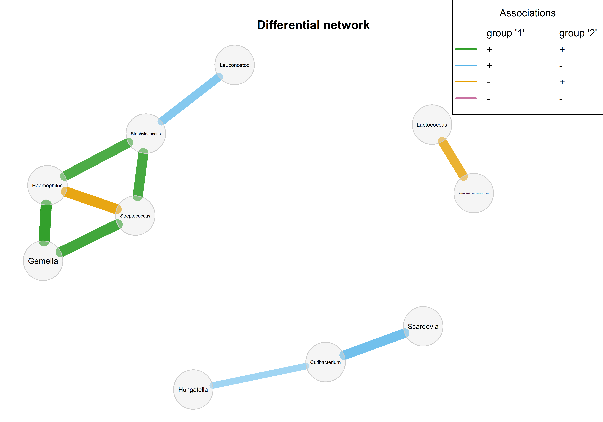<!-- -->

**Include only tests being non-zero in both groups**s

    ##    Min. 1st Qu.  Median    Mean 3rd Qu.    Max. 
    ##  0.0000  0.7937  0.9337  0.8702  0.9981  1.0000

    ## 
    ## Differential Network Summary
    ## ----------------------------
    ## CALL: 
    ## diffnet(x = net_ebf_perm, diffMethod = "permute", nPerm = n_perm_network_comparison, 
    ##     refinePermPvals = TRUE, permApproxParams = list(method = "gpd", 
    ##         gpd_ctrl = gpd_ctrl), cores = cores, verbose = TRUE, 
    ##     seed = permutation_seed, adjust = "BH", adjustNonzeroOnly = FALSE, 
    ##     fileLoadAssoPerm = path_perm("assoPerm_ebf"))
    ## 
    ## ______________________________
    ## Method and tests
    ## ````````````````
    ## Method                  permute
    ## Adjustment                   BH
    ## Adjust non-zero only      FALSE
    ## Pairwise tests total       6786
    ## Pairwise tests adjusted    6786
    ## Pairwise tests excluded       0
    ## Alpha                      0.05
    ## lfdr threshold              0.2
    ## 
    ## 
    ## ______________________________
    ## Association summaries
    ## `````````````````````
    ##              min     q1 median  mean    q3   max
    ## Network 1 -0.125 -0.024 -0.003 0.002 0.022 0.371
    ## Network 2 -0.246 -0.033  0.000 0.007 0.039 0.379
    ## 
    ## ______________________________
    ## Network counts
    ## ``````````````
    ##                Network 1 Network 2
    ## Non-zero edges      6786      6786
    ## Singletons             0         0
    ## 
    ## ______________________________
    ## Differential associations
    ## ````````````````````````
    ##                                  count
    ## Non-zero association differences  6786
    ## Significant before adjustment      549
    ## Significant after adjustment         9
    ## 
    ## ______________________________
    ## P-value summaries
    ## `````````````````
    ##                      n      min       q1   median     mean       q3      max significant
    ## Raw p-values      6786 0.00e+00 0.199000 0.467000 0.477002 0.753000 1.000000         549
    ## Adjusted p-values 6786 0.00e+00 0.793684 0.933725 0.870240 0.998090 1.000000           9

<!-- -->

### permApprox Refinement With Constraint

    ##     Min.  1st Qu.   Median     Mean  3rd Qu.     Max. 
    ## 2.69e-06 1.99e-01 4.67e-01 4.77e-01 7.53e-01 1.00e+00

    ##     Min.  1st Qu.   Median     Mean  3rd Qu.     Max. 
    ## 0.002206 0.793684 0.933725 0.870267 0.998090 1.000000

    ## 
    ## Differential Network Summary
    ## ----------------------------
    ## CALL: 
    ## diffnet(x = net_ebf_perm, diffMethod = "permute", nPerm = n_perm_network_comparison, 
    ##     refinePermPvals = TRUE, permApproxParams = list(method = "gpd", 
    ##         gpd_ctrl = gpd_ctrl), cores = cores, verbose = TRUE, 
    ##     seed = permutation_seed, adjust = "BH", fileLoadAssoPerm = path_perm("assoPerm_ebf"))
    ## 
    ## ______________________________
    ## Method and tests
    ## ````````````````
    ## Method                  permute
    ## Adjustment                   BH
    ## Adjust non-zero only      FALSE
    ## Pairwise tests total       6786
    ## Pairwise tests adjusted    6786
    ## Pairwise tests excluded       0
    ## Alpha                      0.05
    ## lfdr threshold              0.2
    ## 
    ## 
    ## ______________________________
    ## Association summaries
    ## `````````````````````
    ##              min     q1 median  mean    q3   max
    ## Network 1 -0.125 -0.024 -0.003 0.002 0.022 0.371
    ## Network 2 -0.246 -0.033  0.000 0.007 0.039 0.379
    ## 
    ## ______________________________
    ## Network counts
    ## ``````````````
    ##                Network 1 Network 2
    ## Non-zero edges      6786      6786
    ## Singletons             0         0
    ## 
    ## ______________________________
    ## Differential associations
    ## ````````````````````````
    ##                                  count
    ## Non-zero association differences  6786
    ## Significant before adjustment      549
    ## Significant after adjustment         9
    ## 
    ## ______________________________
    ## P-value summaries
    ## `````````````````
    ##                      n      min       q1   median     mean       q3      max significant
    ## Raw p-values      6786 5.12e-07 0.199000 0.467000 0.476998 0.753000 1.000000         549
    ## Adjusted p-values 6786 0.002206 0.793684 0.933725 0.870268 0.998090 1.000000           9

<!-- -->

**Include only tests being non-zero in both groups**

    ##     Min.  1st Qu.   Median     Mean  3rd Qu.     Max. 
    ## 0.002206 0.793684 0.933725 0.870267 0.998090 1.000000

    ## 
    ## Differential Network Summary
    ## ----------------------------
    ## CALL: 
    ## diffnet(x = net_ebf_perm, diffMethod = "permute", nPerm = n_perm_network_comparison, 
    ##     refinePermPvals = TRUE, permApproxParams = list(method = "gpd", 
    ##         gpd_ctrl = gpd_ctrl), cores = cores, verbose = TRUE, 
    ##     seed = permutation_seed, adjust = "BH", fileLoadAssoPerm = path_perm("assoPerm_ebf"))
    ## 
    ## ______________________________
    ## Method and tests
    ## ````````````````
    ## Method                  permute
    ## Adjustment                   BH
    ## Adjust non-zero only      FALSE
    ## Pairwise tests total       6786
    ## Pairwise tests adjusted    6786
    ## Pairwise tests excluded       0
    ## Alpha                      0.05
    ## lfdr threshold              0.2
    ## 
    ## 
    ## ______________________________
    ## Association summaries
    ## `````````````````````
    ##              min     q1 median  mean    q3   max
    ## Network 1 -0.125 -0.024 -0.003 0.002 0.022 0.371
    ## Network 2 -0.246 -0.033  0.000 0.007 0.039 0.379
    ## 
    ## ______________________________
    ## Network counts
    ## ``````````````
    ##                Network 1 Network 2
    ## Non-zero edges      6786      6786
    ## Singletons             0         0
    ## 
    ## ______________________________
    ## Differential associations
    ## ````````````````````````
    ##                                  count
    ## Non-zero association differences  6786
    ## Significant before adjustment      549
    ## Significant after adjustment         9
    ## 
    ## ______________________________
    ## P-value summaries
    ## `````````````````
    ##                      n      min       q1   median     mean       q3      max significant
    ## Raw p-values      6786 5.12e-07 0.199000 0.467000 0.476998 0.753000 1.000000         549
    ## Adjusted p-values 6786 0.002206 0.793684 0.933725 0.870268 0.998090 1.000000           9

<!-- -->

### Raw P-Value Comparison

We use a significance level of 5% here.

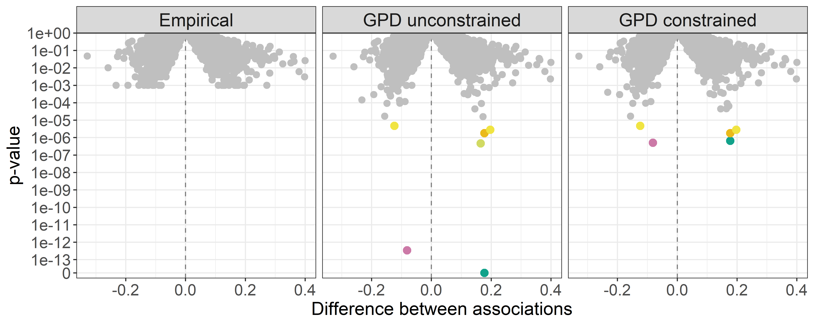<!-- -->

    ## # A tibble: 3 × 9
    ##   method            n n_zero         min min_positive   q25 median   q75   max
    ##   <chr>         <int>  <int>       <dbl>        <dbl> <dbl>  <dbl> <dbl> <dbl>
    ## 1 constrained    6786      0 0.000000512     5.12e- 7 0.199  0.467 0.753     1
    ## 2 empirical      6786      0 0.001           1   e- 3 0.199  0.467 0.753     1
    ## 3 unconstrained  6786      1 0               3.45e-13 0.199  0.467 0.753     1

    ## # A tibble: 1 × 4
    ##   n_colored_associations min_abs_difference max_abs_difference n_unique_colors
    ##                    <int>              <dbl>              <dbl>           <int>
    ## 1                      6             0.0816              0.197               5

    ## # A tibble: 6 × 6
    ##   taxon1      taxon2         association_difference p_empirical p_unconstrained p_constrained
    ##   <chr>       <chr>                           <dbl>       <dbl>           <dbl>         <dbl>
    ## 1 Gemella     Streptococcus                  0.177        0.001        0          0.000000650
    ## 2 Hungatella  Cutibacterium                 -0.0816       0.001        3.45e-13   0.000000512
    ## 3 Haemophilus Staphylococcus                 0.165        0.001        4.63e- 7   0.0000453  
    ## 4 Haemophilus Streptococcus                  0.177        0.001        1.80e- 6   0.00000180 
    ## 5 Haemophilus Gemella                        0.197        0.001        2.80e- 6   0.00000280 
    ## 6 Leuconostoc Staphylococcus                -0.124        0.001        4.73e- 6   0.00000473

## Network plots

Here we plot the networks for the comparison based on correlation
shrinkage with bayesian multiplicative replacement

### Association networks for corshrink with bayesMult

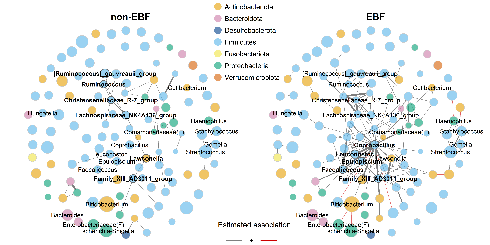<!-- -->

### Association networks for the other methods with same layout

#### SpiecEasi multRepl

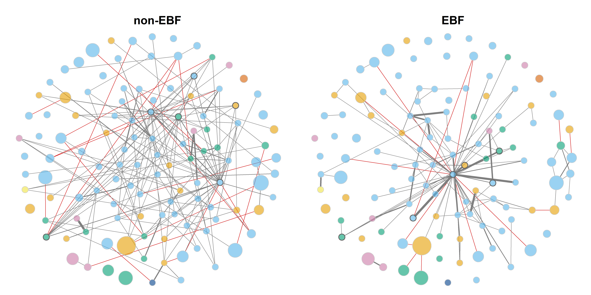<!-- -->

#### SpiecEasi bayesMult

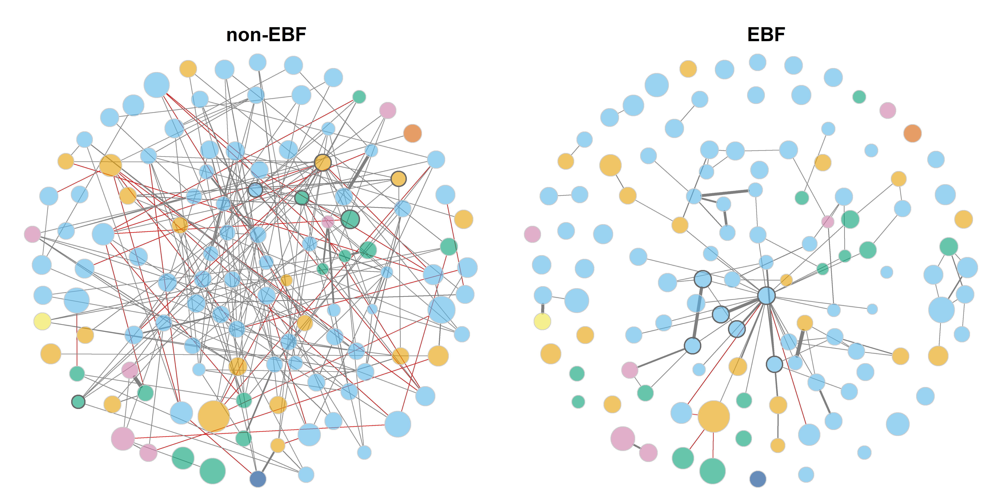<!-- -->

#### SpiecEasi SLR

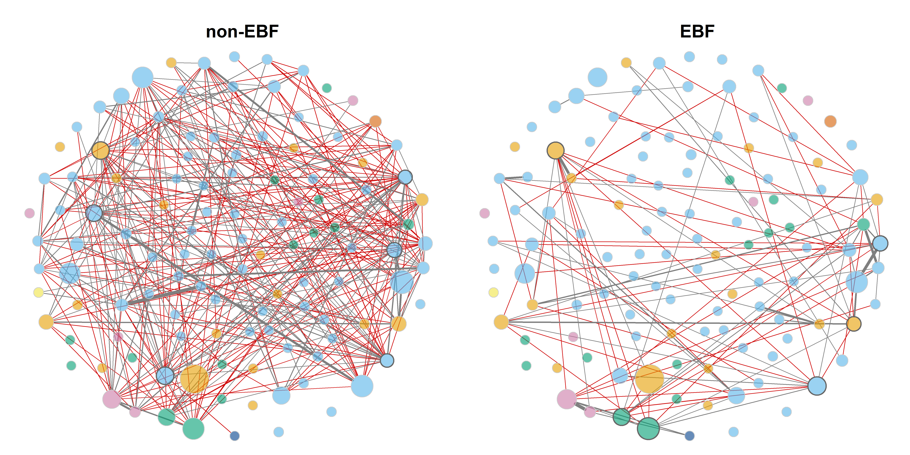<!-- -->

#### SPRING

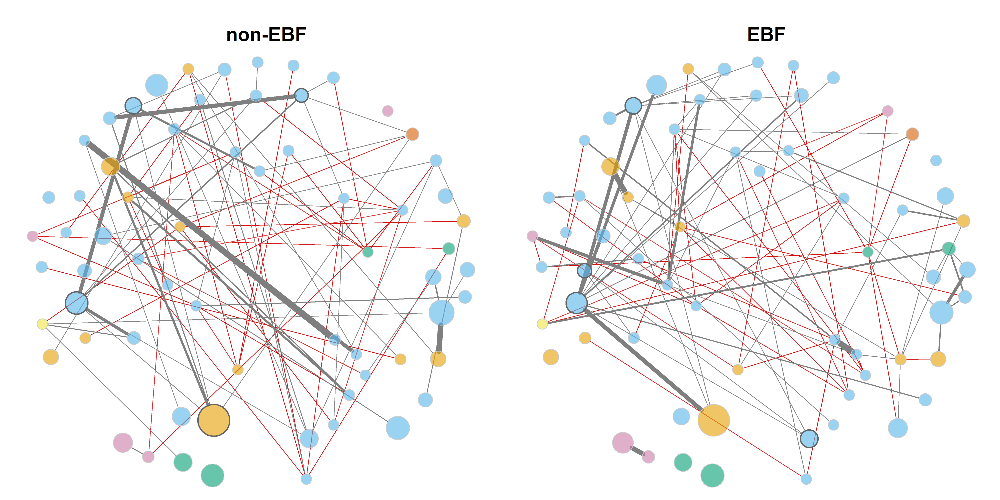<!-- -->

#### rhoShrink with multRepl

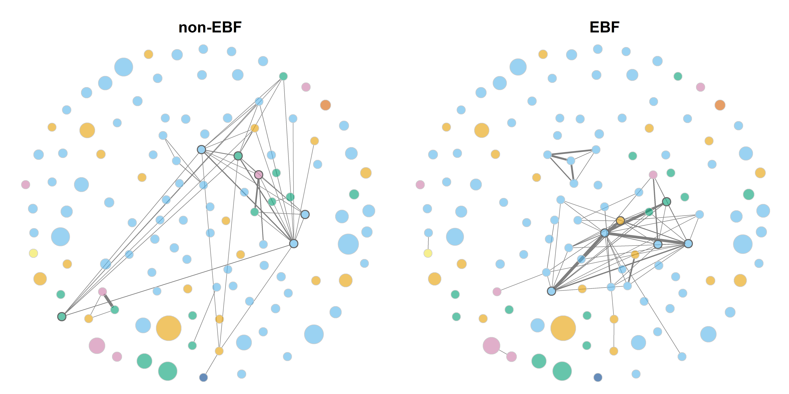<!-- -->

#### rhoShrink with bayesMult

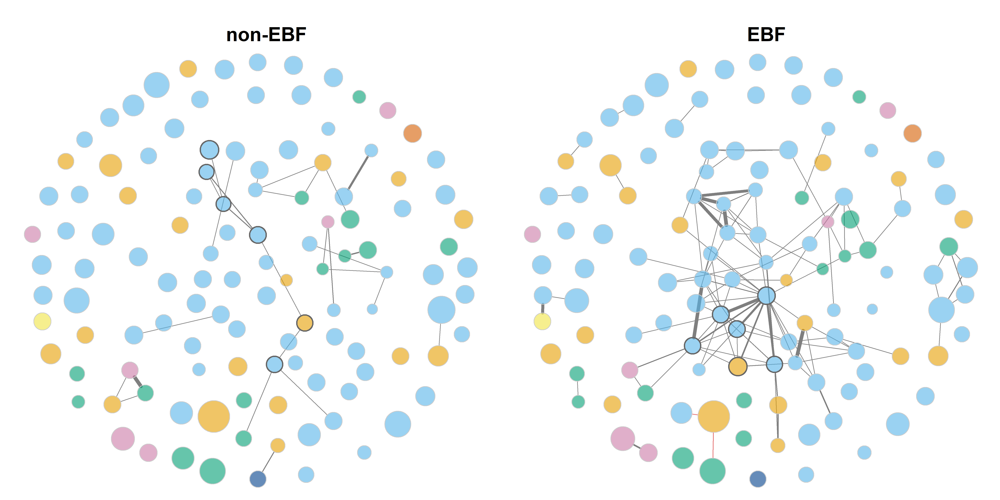<!-- -->

#### corShrink with multRepl

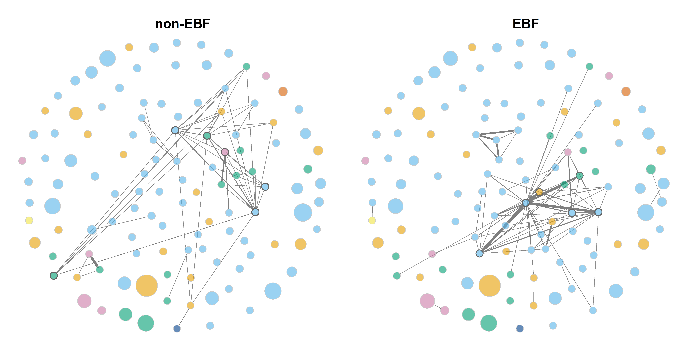<!-- -->

#### corShrink with bayesMult

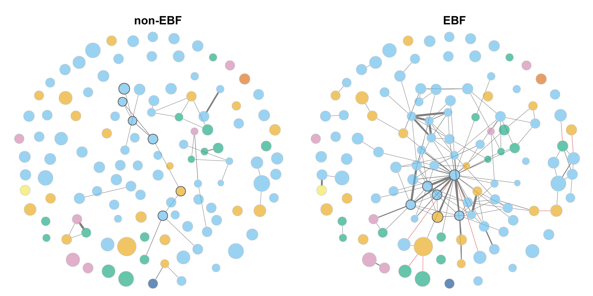<!-- -->

### Differential network for corshrink with bayesMult

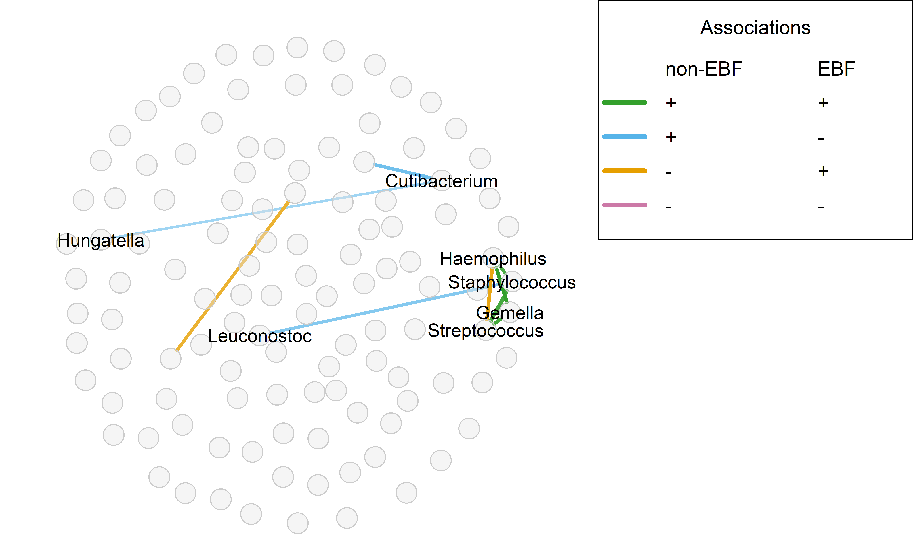<!-- -->

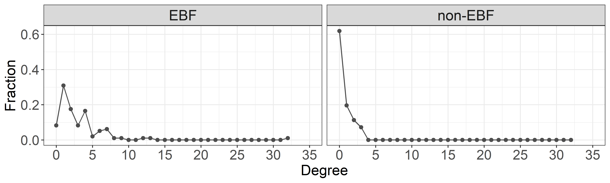<!-- -->

## Heatmaps for labelled taxa

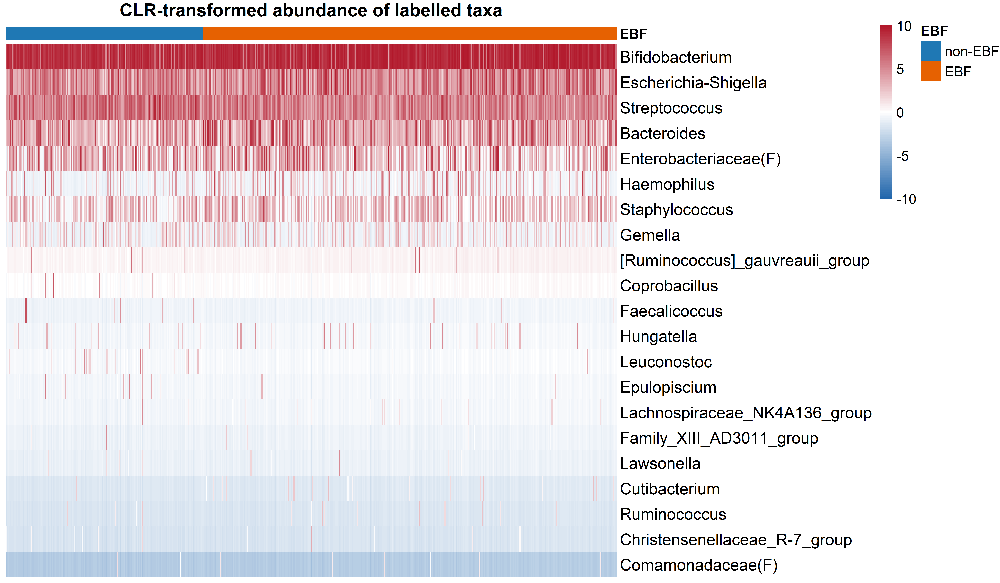<!-- -->

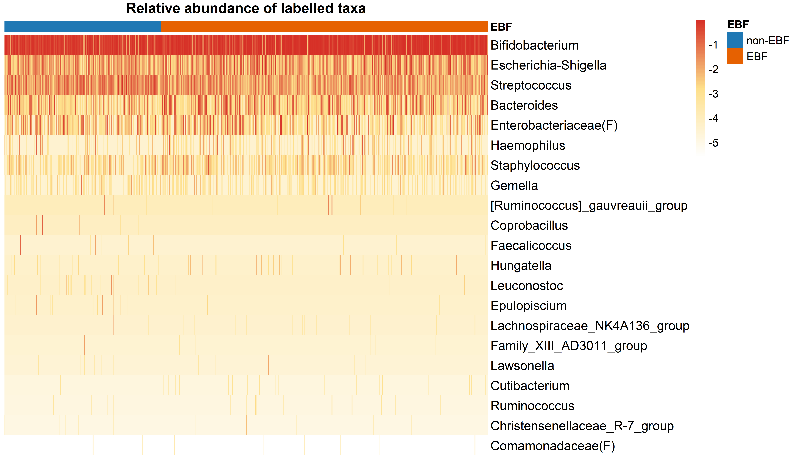<!-- -->

## Files Written

    ## # A tibble: 367 × 4
    ##    path                             type         size modification_time  
    ##    <fs::path>                       <fct> <fs::bytes> <dttm>             
    ##  1 comp_ebf_main.rds                file      180.95K 2026-06-25 10:03:18
    ##  2 counts_ebf_rel_bayesMult.rds     file      722.02K 2026-06-27 08:17:18
    ##  3 diffnet_significant_BH_table.tex file          791 2026-07-07 17:46:16
    ##  4 net_ebf_corshrink_bayesMult.rds  file        1.08M 2026-06-27 11:00:00
    ##  5 net_ebf_corshrink_multRepl.rds   file      620.74K 2026-06-27 13:50:38
    ##  6 net_ebf_main.rds                 file        20.8M 2026-06-27 11:05:31
    ##  7 net_ebf_rhoshrink_bayesMult.rds  file        1.49M 2026-06-27 10:43:59
    ##  8 net_ebf_rhoshrink_multRepl.rds   file      916.18K 2026-06-27 12:11:52
    ##  9 net_ebf_slr_r2.rds               file       75.55M 2026-06-27 08:36:00
    ## 10 net_ebf_slr_r5.rds               file        73.9M 2026-07-05 22:03:00
    ## # ℹ 357 more rows
