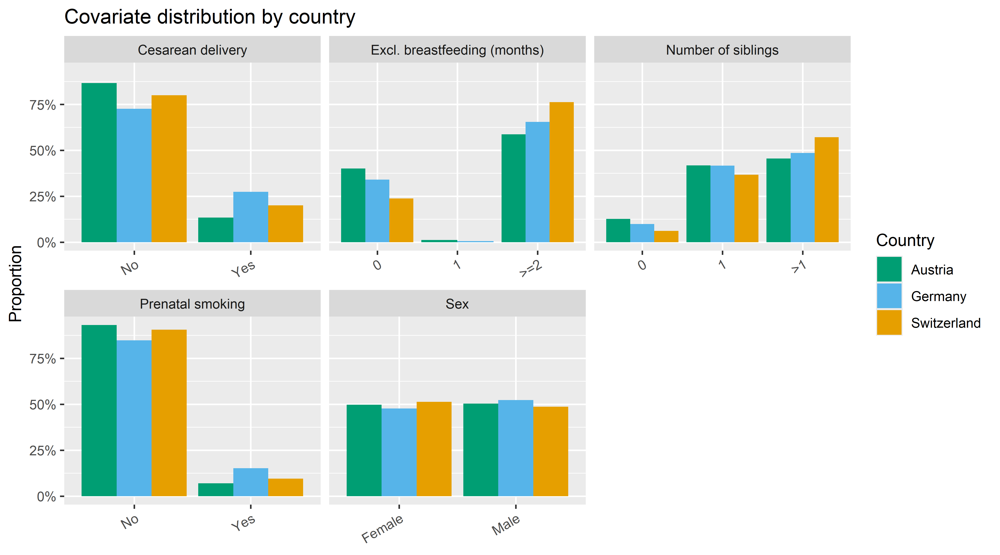
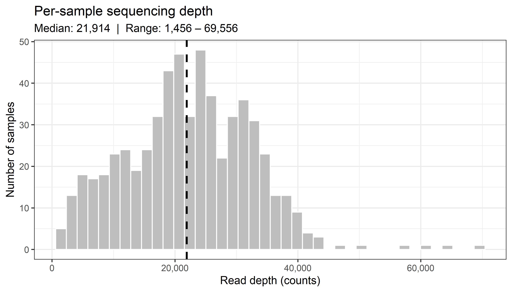
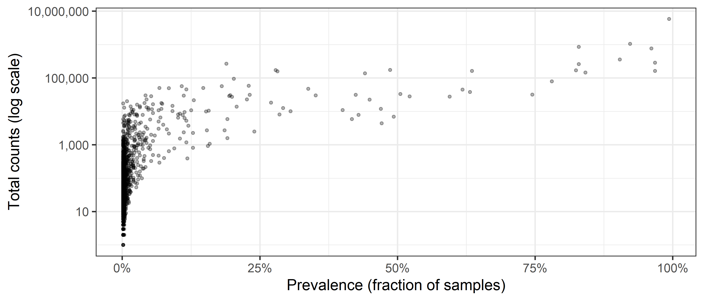
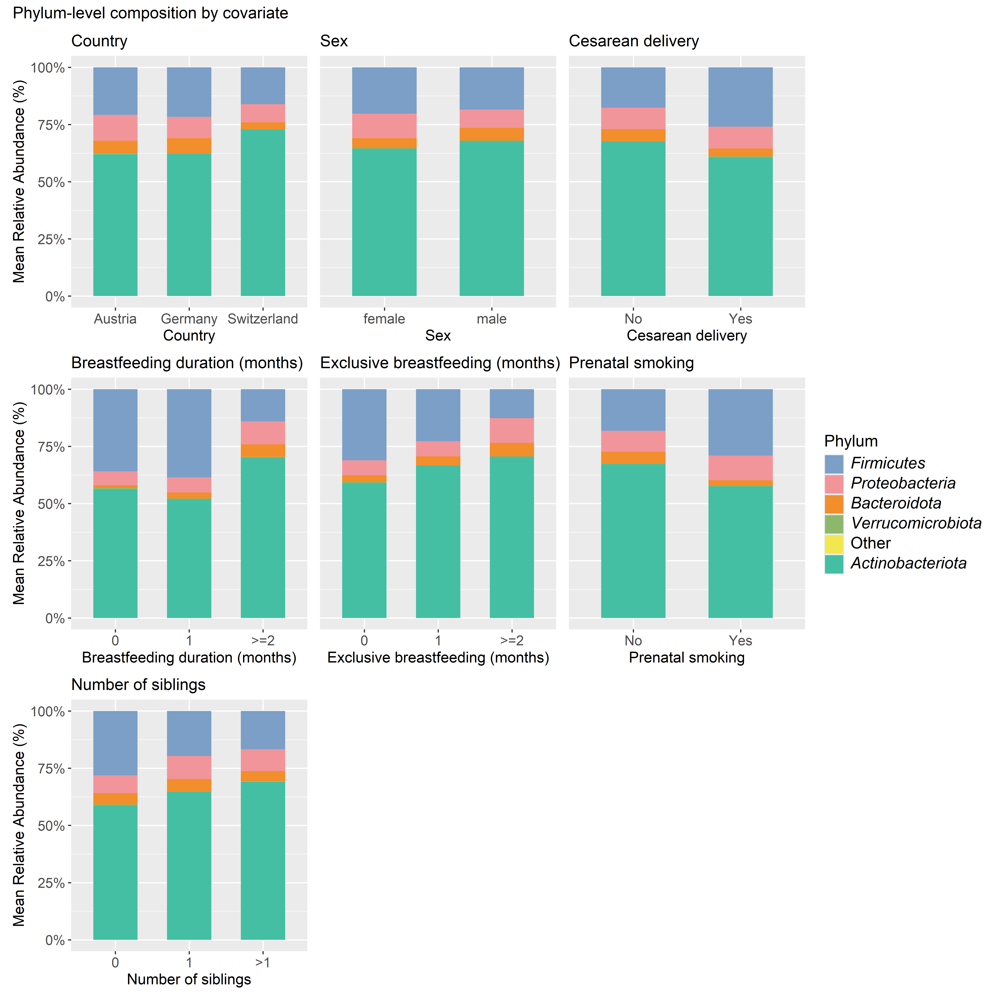

Data overview
================
Compiled at 2026-04-29 13:10:20 UTC

## Load data

### ASV level

    ## phyloseq-class experiment-level object
    ## otu_table()   OTU Table:         [ 2045 taxa and 592 samples ]
    ## sample_data() Sample Data:       [ 592 samples by 9 sample variables ]
    ## tax_table()   Taxonomy Table:    [ 2045 taxa by 7 taxonomic ranks ]

### Genus level

    ## phyloseq-class experiment-level object
    ## otu_table()   OTU Table:         [ 235 taxa and 592 samples ]
    ## sample_data() Sample Data:       [ 592 samples by 9 sample variables ]
    ## tax_table()   Taxonomy Table:    [ 235 taxa by 7 taxonomic ranks ]

## Sample characteristics

<table class="table table-striped table-condensed" style="color: black; width: auto !important; margin-left: auto; margin-right: auto;">

<caption>

Cohort characteristics (N = 592)
</caption>

<thead>

<tr>

<th style="text-align:left;">

Variable
</th>

<th style="text-align:left;">

Value
</th>

<th style="text-align:left;">

n (%)
</th>

</tr>

</thead>

<tbody>

<tr>

<td style="text-align:left;vertical-align: top !important;" rowspan="3">

Country
</td>

<td style="text-align:left;">

Austria
</td>

<td style="text-align:left;">

173 (29.2%)
</td>

</tr>

<tr>

<td style="text-align:left;">

Germany
</td>

<td style="text-align:left;">

197 (33.3%)
</td>

</tr>

<tr>

<td style="text-align:left;">

Switzerland
</td>

<td style="text-align:left;">

222 (37.5%)
</td>

</tr>

<tr>

<td style="text-align:left;vertical-align: top !important;" rowspan="2">

Sex
</td>

<td style="text-align:left;">

Female
</td>

<td style="text-align:left;">

294 (49.7%)
</td>

</tr>

<tr>

<td style="text-align:left;">

Male
</td>

<td style="text-align:left;">

298 (50.3%)
</td>

</tr>

<tr>

<td style="text-align:left;vertical-align: top !important;" rowspan="4">

Breastfeeding duration (months)
</td>

<td style="text-align:left;">

0
</td>

<td style="text-align:left;">

36 (6.1%)
</td>

</tr>

<tr>

<td style="text-align:left;">

1
</td>

<td style="text-align:left;">

88 (14.9%)
</td>

</tr>

<tr>

<td style="text-align:left;">

\>=2
</td>

<td style="text-align:left;">

456 (77%)
</td>

</tr>

<tr>

<td style="text-align:left;">

NA
</td>

<td style="text-align:left;">

12 (missing)
</td>

</tr>

<tr>

<td style="text-align:left;vertical-align: top !important;" rowspan="4">

Exclusive breastfeeding (months)
</td>

<td style="text-align:left;">

0
</td>

<td style="text-align:left;">

179 (30.2%)
</td>

</tr>

<tr>

<td style="text-align:left;">

1
</td>

<td style="text-align:left;">

3 (0.5%)
</td>

</tr>

<tr>

<td style="text-align:left;">

\>=2
</td>

<td style="text-align:left;">

375 (63.3%)
</td>

</tr>

<tr>

<td style="text-align:left;">

NA
</td>

<td style="text-align:left;">

35 (missing)
</td>

</tr>

<tr>

<td style="text-align:left;vertical-align: top !important;" rowspan="3">

Cesarean delivery
</td>

<td style="text-align:left;">

No
</td>

<td style="text-align:left;">

468 (79.1%)
</td>

</tr>

<tr>

<td style="text-align:left;">

Yes
</td>

<td style="text-align:left;">

121 (20.4%)
</td>

</tr>

<tr>

<td style="text-align:left;">

NA
</td>

<td style="text-align:left;">

3 (missing)
</td>

</tr>

<tr>

<td style="text-align:left;vertical-align: top !important;" rowspan="2">

Prenatal smoking
</td>

<td style="text-align:left;">

No
</td>

<td style="text-align:left;">

529 (89.4%)
</td>

</tr>

<tr>

<td style="text-align:left;">

Yes
</td>

<td style="text-align:left;">

63 (10.6%)
</td>

</tr>

<tr>

<td style="text-align:left;vertical-align: top !important;" rowspan="4">

Number of siblings
</td>

<td style="text-align:left;">

0
</td>

<td style="text-align:left;">

46 (7.8%)
</td>

</tr>

<tr>

<td style="text-align:left;">

1
</td>

<td style="text-align:left;">

200 (33.8%)
</td>

</tr>

<tr>

<td style="text-align:left;">

\>1
</td>

<td style="text-align:left;">

257 (43.4%)
</td>

</tr>

<tr>

<td style="text-align:left;">

NA
</td>

<td style="text-align:left;">

89 (missing)
</td>

</tr>

</tbody>

</table>

## Metadata balance across groups

<!-- -->

## Sequencing depth

<!-- -->

<!-- -->

## ASV prevalence and sparsity

<!-- -->

<!-- -->

## Taxonomic composition

### Phylum-level relative abundance by covariate

<!-- -->

### Top 15 genera

<table class="table table-striped table-condensed" style="color: black; width: auto !important; margin-left: auto; margin-right: auto;">

<caption>

Top 15 genera by mean relative abundance
</caption>

<thead>

<tr>

<th style="text-align:left;">

Genus
</th>

<th style="text-align:right;">

Mean rel. abundance (%)
</th>

<th style="text-align:right;">

Median rel. abundance (%)
</th>

<th style="text-align:right;">

Prevalence (%)
</th>

</tr>

</thead>

<tbody>

<tr>

<td style="text-align:left;">

Bifidobacterium
</td>

<td style="text-align:right;">

63.813
</td>

<td style="text-align:right;">

71.923
</td>

<td style="text-align:right;">

100.0
</td>

</tr>

<tr>

<td style="text-align:left;">

Escherichia-Shigella
</td>

<td style="text-align:right;">

5.941
</td>

<td style="text-align:right;">

1.039
</td>

<td style="text-align:right;">

97.3
</td>

</tr>

<tr>

<td style="text-align:left;">

Streptococcus
</td>

<td style="text-align:right;">

4.940
</td>

<td style="text-align:right;">

1.746
</td>

<td style="text-align:right;">

99.3
</td>

</tr>

<tr>

<td style="text-align:left;">

Bacteroides
</td>

<td style="text-align:right;">

4.551
</td>

<td style="text-align:right;">

0.190
</td>

<td style="text-align:right;">

90.5
</td>

</tr>

<tr>

<td style="text-align:left;">

24_Enterobacteriaceae(F)
</td>

<td style="text-align:right;">

2.942
</td>

<td style="text-align:right;">

0.095
</td>

<td style="text-align:right;">

73.8
</td>

</tr>

<tr>

<td style="text-align:left;">

Enterococcus
</td>

<td style="text-align:right;">

2.802
</td>

<td style="text-align:right;">

0.292
</td>

<td style="text-align:right;">

90.2
</td>

</tr>

<tr>

<td style="text-align:left;">

\[Ruminococcus\]\_gnavugroup
</td>

<td style="text-align:right;">

2.308
</td>

<td style="text-align:right;">

0.272
</td>

<td style="text-align:right;">

97.6
</td>

</tr>

<tr>

<td style="text-align:left;">

Blautia
</td>

<td style="text-align:right;">

2.044
</td>

<td style="text-align:right;">

0.476
</td>

<td style="text-align:right;">

99.2
</td>

</tr>

<tr>

<td style="text-align:left;">

Collinsella
</td>

<td style="text-align:right;">

1.334
</td>

<td style="text-align:right;">

0.074
</td>

<td style="text-align:right;">

85.0
</td>

</tr>

<tr>

<td style="text-align:left;">

Lactobacillus
</td>

<td style="text-align:right;">

1.284
</td>

<td style="text-align:right;">

0.027
</td>

<td style="text-align:right;">

54.2
</td>

</tr>

<tr>

<td style="text-align:left;">

Erysipelatoclostridium
</td>

<td style="text-align:right;">

1.191
</td>

<td style="text-align:right;">

0.088
</td>

<td style="text-align:right;">

89.4
</td>

</tr>

<tr>

<td style="text-align:left;">

Clostridium_sensu_strict1
</td>

<td style="text-align:right;">

1.052
</td>

<td style="text-align:right;">

0.076
</td>

<td style="text-align:right;">

80.2
</td>

</tr>

<tr>

<td style="text-align:left;">

Veillonella
</td>

<td style="text-align:right;">

0.456
</td>

<td style="text-align:right;">

0.023
</td>

<td style="text-align:right;">

55.1
</td>

</tr>

<tr>

<td style="text-align:left;">

Actinomyces
</td>

<td style="text-align:right;">

0.392
</td>

<td style="text-align:right;">

0.056
</td>

<td style="text-align:right;">

65.4
</td>

</tr>

<tr>

<td style="text-align:left;">

Parabacteroides
</td>

<td style="text-align:right;">

0.349
</td>

<td style="text-align:right;">

0.000
</td>

<td style="text-align:right;">

18.8
</td>

</tr>

</tbody>

</table>

## Files written

These files have been written to the target directory,
`data/01_overview`:

    ## # A tibble: 1 × 4
    ##   path                           type         size modification_time  
    ##   <fs::path>                     <fct> <fs::bytes> <dttm>             
    ## 1 tbl_sample_characteristics.tex file        1.34K 2026-04-29 13:10:21
