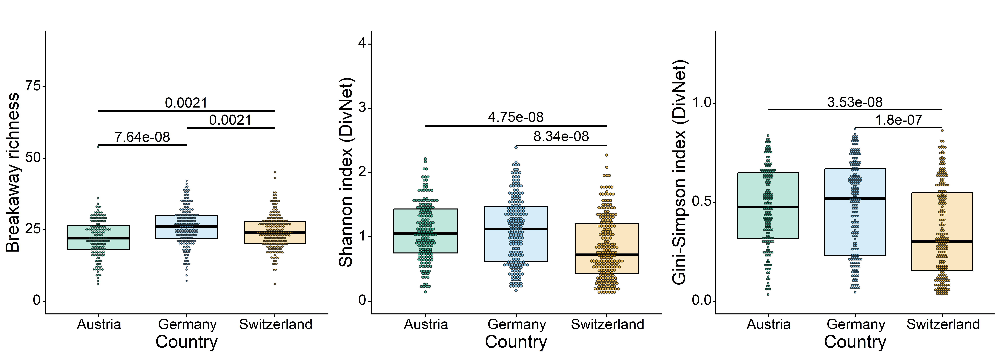
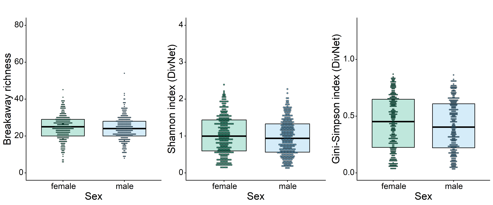
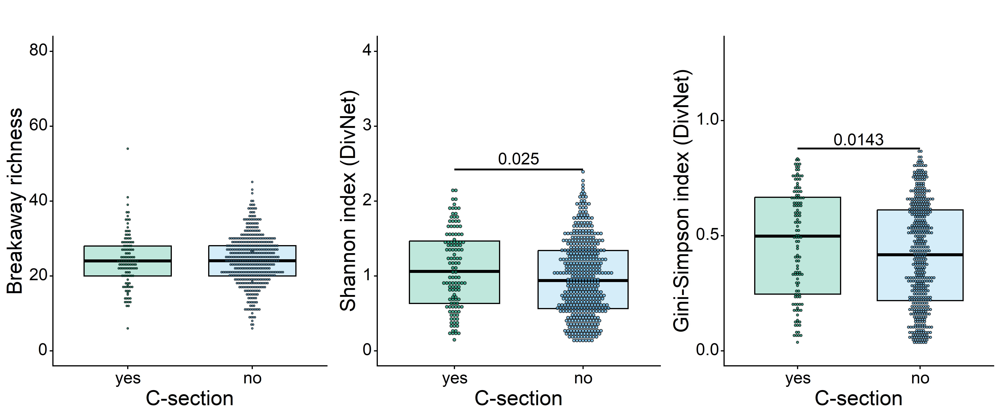
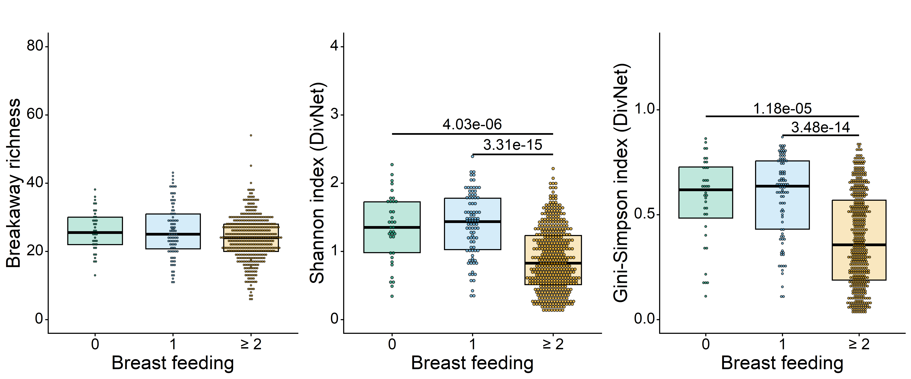
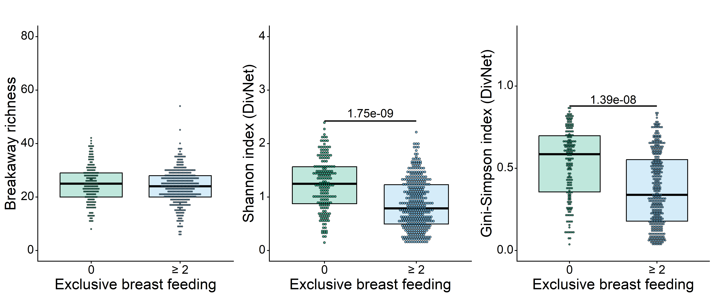
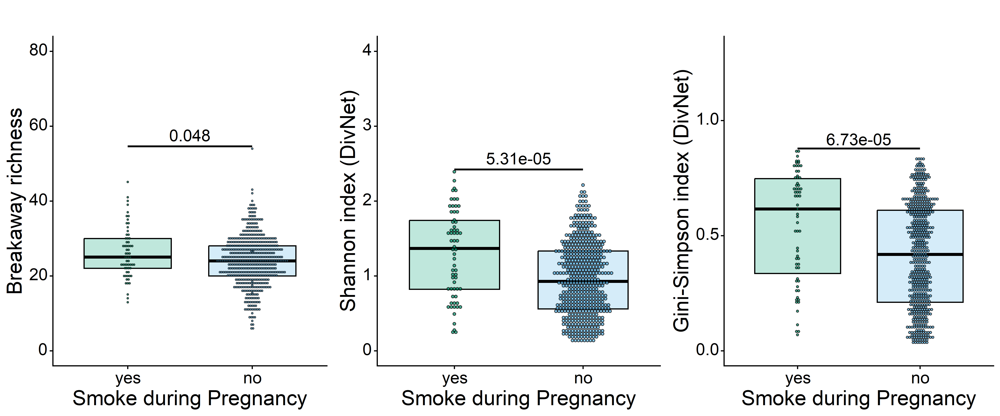
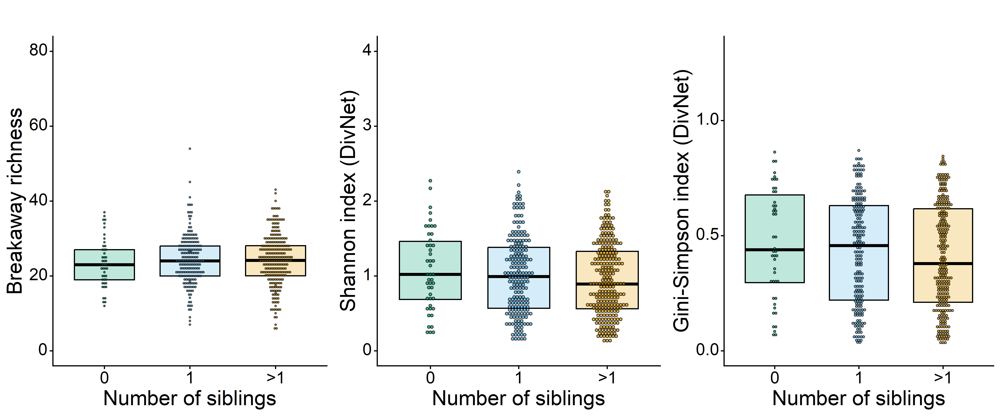
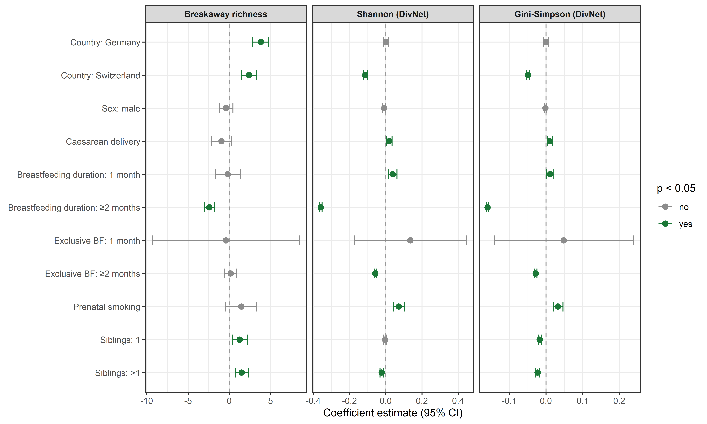
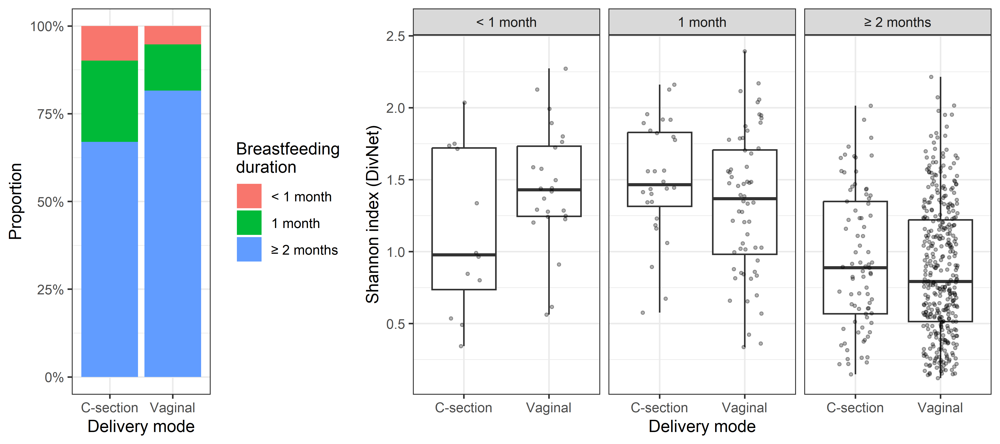

Alpha diversity analysis
================
Compiled at 2026-05-04 08:16:23 UTC

## Load packages

## Load data

### ASV level

    ## phyloseq-class experiment-level object
    ## otu_table()   OTU Table:         [ 2045 taxa and 592 samples ]
    ## sample_data() Sample Data:       [ 592 samples by 9 sample variables ]
    ## tax_table()   Taxonomy Table:    [ 2045 taxa by 7 taxonomic ranks ]

### Genus level

    ## phyloseq-class experiment-level object
    ## otu_table()   OTU Table:         [ 235 taxa and 592 samples ]
    ## sample_data() Sample Data:       [ 592 samples by 9 sample variables ]
    ## tax_table()   Taxonomy Table:    [ 235 taxa by 7 taxonomic ranks ]

## Colors

## Functions

### Function for significance plot

### Function for significance line

### Permutation test functions

### Plot function for richness

### Plot function for Shannon

### Plot function for Gini-Simpson

## Compute alpha diversity

### Alpha diversity on ASV level

Computing alpha diversity the common way

    ##         Observed Chao1 se.chao1 ACE   se.ACE   Shannon   Simpson InvSimpson   Fisher
    ## s025647       53    53        0  53 2.952453 2.1820592 0.8101643   5.267713 6.276531
    ## s023779       42    42        0  42 3.055050 1.2993728 0.5360094   2.155216 4.825036
    ## s026625       37    37        0  37 2.847474 1.0316700 0.4477473   1.810765 4.227388
    ## s022898       35    35        0  35 2.366432 0.9782728 0.4119364   1.700496 3.825460
    ## s022897       34    34        0  34 2.656845 1.1561633 0.5047898   2.019344 3.937578
    ## s028386       44    44        0  44 2.954196 1.6938618 0.7081637   3.426579 5.076860

### Breakaway richness on ASV level

    ##         SampleID      age richness_otu
    ## s025647  s025647 2 months     53.07729
    ## s023779  s023779 2 months     42.02288
    ## s026625  s026625 2 months     37.10025
    ## s022898  s022898 2 months     35.01528
    ## s022897  s022897 2 months     34.01016
    ## s028386  s028386 2 months     44.01542

### Alpha diversity on genus level

Computing alpha diversity the common way

    ##         Observed Chao1 se.chao1 ACE   se.ACE   Shannon   Simpson InvSimpson   Fisher
    ## s025647       40    40        0  40 2.641023 1.8370941 0.7583242   4.137775 4.564899
    ## s023779       29    29        0  29 2.491364 0.6123431 0.2157674   1.275132 3.179224
    ## s026625       26    26        0  26 2.425823 0.3563376 0.1122662   1.126464 2.841656
    ## s022898       21    21        0  21 1.951800 0.5109628 0.2356186   1.308248 2.160364
    ## s022897       25    25        0  25 2.244994 0.4977167 0.1736147   1.210089 2.783480
    ## s028386       22    22        0  22 1.809068 1.2379658 0.6065971   2.541923 2.329049

### Breakaway richness on genus level

    ##   SampleID      age richness_otu richness_genus
    ## 1  s025647 2 months     53.07729       40.07097
    ## 2  s023779 2 months     42.02288       29.02846
    ## 3  s026625 2 months     37.10025       26.06324
    ## 4  s022898 2 months     35.01528       21.02326
    ## 5  s022897 2 months     34.01016       25.00990
    ## 6  s028386 2 months     44.01542       22.01301

## DivNet diversity measures

Due to the long runtime only on genus level

Find base taxon (with minimum number of non-zero counts)

    ## Bifidobacterium 
    ##               0

    ##   SampleID      age richness_otu richness_genus   shannon   simpson inv_simpson      gini
    ## 1  s025647 2 months     53.07729       40.07097 1.8412512 0.2415143    4.140542 0.7584857
    ## 2  s023779 2 months     42.02288       29.02846 0.6171782 0.7836776    1.276035 0.2163224
    ## 3  s026625 2 months     37.10025       26.06324 0.3617418 0.8870403    1.127344 0.1129597
    ## 4  s022898 2 months     35.01528       21.02326 0.5151174 0.7639270    1.309026 0.2360730
    ## 5  s022897 2 months     34.01016       25.00990 0.5041177 0.8256020    1.211237 0.1743980
    ## 6  s028386 2 months     44.01542       22.01301 1.2426791 0.3931188    2.543760 0.6068812

## Permutation tests

Results are cached separately per variable (one RDS file each). Delete a
variable’s file and rerun this chunk to recompute only that variable.
Each test uses 9 999 permutations. Results are reused by the plotting
functions below and summarised in the comparison table.

### Comparison of asymptotic vs. permutation p-values

| Variable | Measure | H statistic | p (KW asymptotic) | p (permutation) | p (GPD-refined) |
|:---|:---|---:|---:|---:|---:|
| Country | Breakaway richness | 31.57 | 1.40e-07 | 1.00e-04 | 2.01e-07 |
| Country | Shannon (DivNet) | 40.06 | 2.00e-09 | 1.00e-04 | 6.56e-12 |
| Country | Gini-Simpson (DivNet) | 39.88 | 2.19e-09 | 1.00e-04 | 4.46e-16 |
| Sex | Breakaway richness | 1.79 | 1.80e-01 | 1.77e-01 | 1.77e-01 |
| Sex | Shannon (DivNet) | 1.85 | 1.73e-01 | 1.72e-01 | 1.72e-01 |
| Sex | Gini-Simpson (DivNet) | 2.10 | 1.47e-01 | 1.49e-01 | 1.49e-01 |
| C-section | Breakaway richness | 0.33 | 5.64e-01 | 5.64e-01 | 5.64e-01 |
| C-section | Shannon (DivNet) | 4.86 | 2.74e-02 | 2.54e-02 | 2.50e-02 |
| C-section | Gini-Simpson (DivNet) | 5.73 | 1.67e-02 | 1.35e-02 | 1.43e-02 |
| Breastfeeding duration | Breakaway richness | 7.69 | 2.14e-02 | 2.26e-02 | 2.26e-02 |
| Breastfeeding duration | Shannon (DivNet) | 83.47 | 7.51e-19 | 1.00e-04 | 6.26e-15 |
| Breastfeeding duration | Gini-Simpson (DivNet) | 73.49 | 1.10e-16 | 1.00e-04 | 2.09e-43 |
| Exclusive breastfeeding | Breakaway richness | 2.73 | 9.84e-02 | 9.70e-02 | 9.77e-02 |
| Exclusive breastfeeding | Shannon (DivNet) | 65.13 | 7.02e-16 | 1.00e-04 | 1.75e-09 |
| Exclusive breastfeeding | Gini-Simpson (DivNet) | 56.47 | 5.71e-14 | 1.00e-04 | 1.39e-08 |
| Prenatal smoking | Breakaway richness | 3.95 | 4.70e-02 | 4.82e-02 | 4.80e-02 |
| Prenatal smoking | Shannon (DivNet) | 18.81 | 1.45e-05 | 1.00e-04 | 5.31e-05 |
| Prenatal smoking | Gini-Simpson (DivNet) | 18.08 | 2.12e-05 | 1.00e-04 | 6.73e-05 |
| Number of siblings | Breakaway richness | 1.41 | 4.94e-01 | 4.97e-01 | 4.97e-01 |
| Number of siblings | Shannon (DivNet) | 2.66 | 2.64e-01 | 2.61e-01 | 2.61e-01 |
| Number of siblings | Gini-Simpson (DivNet) | 3.04 | 2.18e-01 | 2.20e-01 | 2.20e-01 |

## Study center

### 2 months

    ## 
    ##     Austria     Germany Switzerland 
    ##         173         197         222

#### Richness

#### Shannon

#### Gini-Simpson index

#### Plot all

<!-- -->

## Sex

### 2 months

    ## 
    ## female   male 
    ##    294    298

#### Richness

#### Shannon

#### Gini-Simpson index

#### Plot all

<!-- -->

## C-section

### 2 months

    ## 
    ## yes  no 
    ## 121 468

#### Richness

#### Shannon

#### Gini-Simpson index

#### Plot all

<!-- -->

## Breast feeding

### 2 months

    ## 
    ##   0   1 >=2 
    ##  36  88 456

#### Richness

#### Shannon

#### Gini-Simpson index

#### Plot all

<!-- -->

## Exclusive breast feeding

### 2 months

    ## 
    ##   0   1 >=2 
    ## 179   0 375

#### Richness

#### Shannon

#### Gini-Simpson index

#### Plot all

<!-- -->

## Smoke during pregnancy

### 2 months

    ## 
    ## yes  no 
    ##  63 529

#### Richness

#### Shannon

#### Gini-Simpson index

#### Plot all

<!-- -->

## Number of siblings

### 2 months

    ## 
    ##   0   1  >1 
    ##  46 200 257

#### Richness

#### Shannon

#### Gini-Simpson index

#### Plot all

<!-- -->

## Model-based analysis: regression on Shannon diversity (betta)

The strip charts above show unadjusted, per-sample DivNet estimates.
Here we use the covariate model (`divnet_genus_cov`, family level)
together with `breakaway::betta` to jointly estimate associations
between all covariates and Shannon diversity, properly accounting for
the uncertainty in the DivNet estimates. Note that this model uses only
the 484 samples with complete covariate data.

    ##  [1] "shannon"              "simpson"              "bray-curtis"          "euclidean"            "shannon-variance"    
    ##  [6] "simpson-variance"     "bray-curtis-variance" "euclidean-variance"   "X"                    "fitted_z"

    ##                        Estimates Standard Errors p-values
    ## (Intercept)          0.937270236     0.003302320    0.000
    ## CountryGermany       0.001748333     0.006893341    0.800
    ## CountrySwitzerland  -0.112929589     0.005020190    0.000
    ## Sexm                -0.008351977     0.004425848    0.059
    ## cesarean             0.018960484     0.007861547    0.016
    ## breast_dur_cat11     0.039074997     0.011826726    0.001
    ## breast_dur_cat1>=2  -0.359173116     0.003501390    0.000
    ## breast_excl_cat11    0.136467765     0.157816400    0.387
    ## breast_excl_cat1>=2 -0.057652189     0.003591629    0.000
    ## pregsmoke            0.073130796     0.016022738    0.000
    ## sibs_numb_cat1      -0.003785637     0.004414114    0.391
    ## sibs_numb_cat>1     -0.021901564     0.005180094    0.000

    ##                         Estimates Standard Errors p-values
    ## (Intercept)          3.868113e-01     0.001441961    0.000
    ## CountryGermany       8.360082e-05     0.003208027    0.979
    ## CountrySwitzerland  -4.881721e-02     0.002089876    0.000
    ## Sexm                -1.563767e-03     0.001915400    0.414
    ## cesarean             1.006912e-02     0.003531353    0.004
    ## breast_dur_cat11     1.087737e-02     0.005375048    0.043
    ## breast_dur_cat1>=2  -1.594698e-01     0.001520450    0.000
    ## breast_excl_cat11    4.847457e-02     0.096765334    0.616
    ## breast_excl_cat1>=2 -2.796495e-02     0.001558865    0.000
    ## pregsmoke            3.277648e-02     0.006816235    0.000
    ## sibs_numb_cat1      -1.700727e-02     0.001844207    0.000
    ## sibs_numb_cat>1     -2.304203e-02     0.002422649    0.000

    ##                      Estimates Standard Errors p-values
    ## (Intercept)         22.7998745       0.2916931    0.000
    ## CountryGermany       3.8298925       0.4903121    0.000
    ## CountrySwitzerland   2.4139332       0.4766735    0.000
    ## Sexm                -0.3744760       0.4133614    0.365
    ## cesarean            -0.9487008       0.6336536    0.134
    ## breast_dur_cat11    -0.1677061       0.7917765    0.832
    ## breast_dur_cat1>=2  -2.4262305       0.3260247    0.000
    ## breast_excl_cat11   -0.4009713       4.5466298    0.930
    ## breast_excl_cat1>=2  0.1631741       0.3523763    0.643
    ## pregsmoke            1.4687249       0.9585137    0.125
    ## sibs_numb_cat1       1.2727747       0.4617022    0.006
    ## sibs_numb_cat>1      1.5078245       0.4083297    0.000

**Interpretation** (reference group: Austria, female, vaginal birth,
breastfeeding duration \< 1 month, not exclusively breastfed, no
prenatal smoking, no siblings):

- **Country:** Swiss infants show lower genus-level Shannon diversity
  than Austrian infants (β = −0.113, p \< 0.001); German infants do not
  differ significantly (β = +0.002, p = 0.800).
- **Sex:** Male infants show marginally lower Shannon diversity than
  females (β = −0.008, p = 0.059), a difference that does not reach
  conventional significance at the genus level.
- **Caesarean delivery:** Associated with slightly higher Shannon
  diversity (β = +0.019, p = 0.016). This is somewhat counterintuitive —
  caesarean birth typically disrupts vertical transmission of
  vaginal/gut microbiota — and may reflect confounding with feeding mode
  or other factors.
- **Breastfeeding duration:** The dominant effect in the model. Compared
  to very short/no breastfeeding (\< 1 month), one month of
  breastfeeding is associated with modestly higher diversity (β =
  +0.039, p = 0.001), while ≥ 2 months is associated with substantially
  lower diversity (β = −0.359, p \< 0.001). This non-monotone pattern
  likely reflects the well-documented HMO-driven enrichment of
  *Bifidobacterium* in longer-breastfed infants, which reduces overall
  evenness (Shannon diversity) at the genus level.
- **Exclusive breastfeeding:** Duration ≥ 2 months is associated with
  slightly lower diversity (β = −0.058, p \< 0.001), consistent with the
  breastfeeding duration effect above.
- **Prenatal smoking:** Associated with higher infant Shannon diversity
  (β = +0.073, p \< 0.001). The direction is unexpected and warrants
  cautious interpretation; residual confounding cannot be excluded.
- **Number of siblings:** Having more than one sibling is associated
  with slightly lower Shannon diversity (\> 1 sibling: β = −0.022, p \<
  0.001); having exactly one sibling shows no significant effect (β =
  −0.004, p = 0.391). The negative direction is counterintuitive given
  the expected increase in microbial exposure from older siblings, and
  may interact with breastfeeding or other covariates.

Global test of whether any covariate is associated with Shannon
diversity:

    ## [1] 26468.85     0.00

`betta_shannon$global` is a likelihood ratio test of the null hypothesis
that all covariates jointly have no association with Shannon diversity
(i.e., all βs except the intercept equal zero). The two returned values
are the chi-squared test statistic and its p-value, respectively. A
significant result indicates that the model as a whole fits better than
an intercept-only model, meaning at least one covariate is meaningfully
associated with Shannon diversity. It does not identify which covariates
are responsible — that is addressed by the individual p-values in
`betta_shannon$table` above.

### Combined coefficient plot

    ## `height` was translated to `width`.

<!-- -->

#### Investigating the C-section effect: confounding by breastfeeding duration

The positive association of caesarean delivery with Shannon diversity is
counterintuitive biologically. A likely explanation is confounding by
breastfeeding: C-section delivery is associated with shorter
breastfeeding duration, and shorter breastfeeding is associated with
higher Shannon diversity (the dominant effect in the model). The
following two plots investigate this.

<!-- -->

The left panel shows that C-section infants are less likely to be
breastfed for ≥ 2 months compared to vaginally born infants. Since
prolonged breastfeeding is the strongest single predictor of *lower*
Shannon diversity in this cohort, C-section infants appear more diverse
in the unadjusted comparison. The right panel confirms this: within each
breastfeeding duration stratum, the delivery mode difference is
substantially attenuated or absent.

## Files written

These files have been written to the target directory,
`data/02_alpha_diversity`:

    ## # A tibble: 12 × 4
    ##    path                            type         size modification_time  
    ##    <fs::path>                      <fct> <fs::bytes> <dttm>             
    ##  1 divnet_family_cov.rds           file        1.83M 2026-04-30 18:00:56
    ##  2 divnet_genus.rds                file       10.63M 2026-04-30 15:40:51
    ##  3 divnet_genus_cov.rds            file        2.02M 2026-05-02 15:33:18
    ##  4 divnet_genus_cov_runtime.rds    file          163 2026-05-02 15:33:18
    ##  5 divnet_genus_runtime.rds        file          159 2026-05-03 08:28:03
    ##  6 perm_results_Breastfeeding.rds  file          622 2026-05-04 08:08:33
    ##  7 perm_results_Cesarean.rds       file          270 2026-05-04 07:56:27
    ##  8 perm_results_Country.rds        file          631 2026-05-04 07:55:27
    ##  9 perm_results_Exclusive_BF.rds   file          279 2026-05-04 07:58:28
    ## 10 perm_results_Prenatal_smoke.rds file          277 2026-05-04 07:58:58
    ## 11 perm_results_Sex.rds            file          250 2026-05-04 07:55:57
    ## 12 perm_results_Siblings.rds       file          255 2026-05-04 07:59:29
