Beta diversity analysis
================
Compiled at 2026-05-20 14:03:54 UTC

## Load packages

## Set global parameters

``` r
emclr_epsilon <- 1e-4
n_perm <- 999
permutation_seed <- 42
alpha_perm_approx <- 0.05

var_order_beta <- c("Country", "Sex", "Delivery mode", "BF duration",
                    "Exclusive BF", "Prenatal smoking", "No. of siblings")
```

## Load data

### Phyloseq object on genus level

    ## phyloseq-class experiment-level object
    ## otu_table()   OTU Table:         [ 235 taxa and 592 samples ]
    ## sample_data() Sample Data:       [ 592 samples by 9 sample variables ]
    ## tax_table()   Taxonomy Table:    [ 235 taxa by 7 taxonomic ranks ]

## Helper functions

**Note on the emCLR transformation:**

We use the **emCLR** version from Chapter 2, where sample-specific
offsets are first computed from the tolerance criterion and then the
global offset is chosen as the minimum of these offsets. That keeps all
samples on the same transformed scale for distances.

## Prepare genus-level data

For the PASTURE application, beta-diversity analyses are performed at
genus level. Bray-Curtis dissimilarity is computed on relative abundance
profiles, whereas Euclidean distance is computed after common-offset
emCLR transformation.

    ## # A tibble: 1 × 6
    ##   n_samples n_taxa min_library_size median_library_size max_library_size zero_fraction
    ##       <int>  <int>            <dbl>               <dbl>            <dbl>         <dbl>
    ## 1       592    235             1456              21914.            69556         0.897

## Compute dissimilarity matrices

### Bray-Curtis dissimilarity

    ##     Min.  1st Qu.   Median     Mean  3rd Qu.     Max. 
    ## 0.005646 0.231099 0.422604 0.457091 0.664417 0.987332

### Euclidean distance after emCLR transformation

    ## # A tibble: 1 × 7
    ##   epsilon delta_global n_finite_delta_k n_infinite_delta_k min_delta_k median_delta_k max_finite_delta_k
    ##     <dbl>        <dbl>            <int>              <int>       <dbl>          <dbl>              <dbl>
    ## 1  0.0001     0.000610              592                  0    0.000610        0.00176            0.00635

    ##  [1] 50.24805 53.89612 55.09472 49.75292 53.90464 54.52180 57.65013 60.23613 55.08222 57.56344

### Save distance objects

## Ordination

### Compute PCoA coordinates

### Uncolored PCoA plots

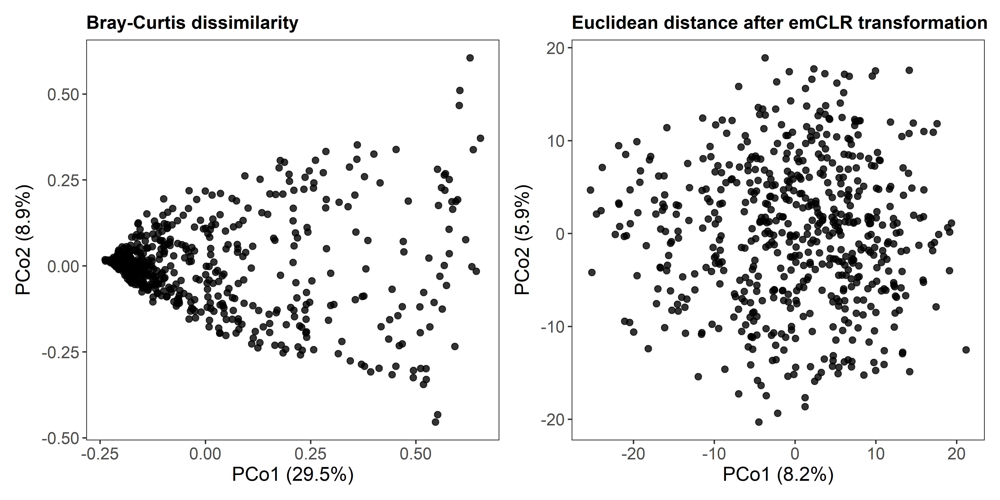<!-- -->

The Bray-Curtis PCoA (PCo1: 29.5%, PCo2: 8.9%) displays the
characteristic arch shape common to PCoA on compositional count data,
where the cloud folds back on itself along PCo2. This is an ordination
artifact rather than a biological signal and reflects how Bray-Curtis
dissimilarity handles the full gradient of community turnover.

The emCLR-based PCoA (PCo1: 8.2%, PCo2: 5.9%) produces a more symmetric,
roughly elliptical cloud with variance spread more evenly across axes —
a consequence of the log-ratio transformation removing compositional
constraints. Note that the first two axes together explain considerably
less total variation for emCLR, which is expected given its more
Euclidean structure.

### PCoA plots colored by selected variables

Set the variables to inspect here. Unknown or misspelled variables are
ignored.

    ##            Country                Sex           cesarean    breast_dur_cat1   breast_excl_cat1          pregsmoke      sibs_numb_cat 
    ##          "Country"              "Sex"    "Delivery mode"      "BF duration"     "Exclusive BF" "Prenatal smoking"  "No. of siblings"

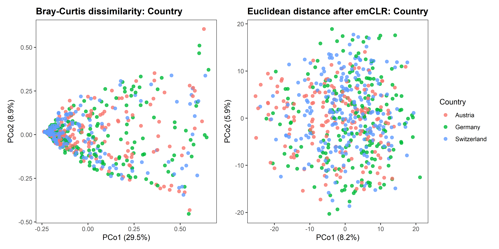<!-- -->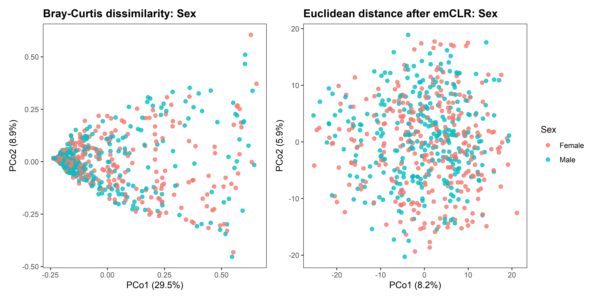<!-- -->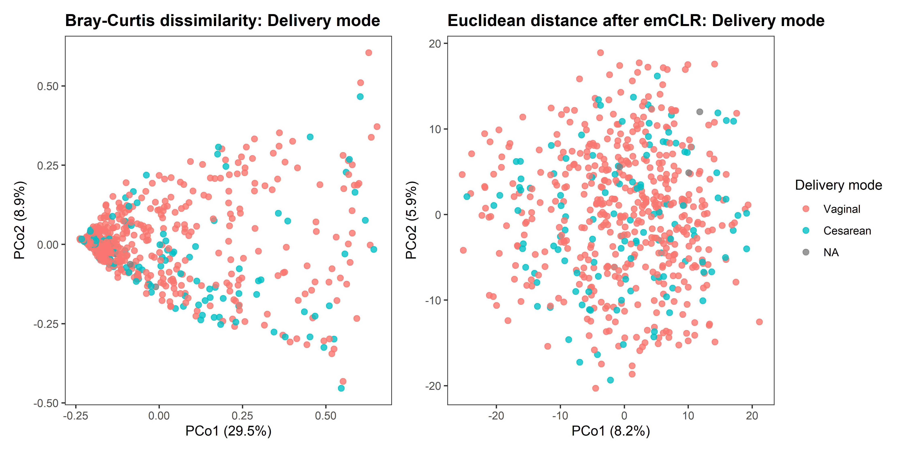<!-- -->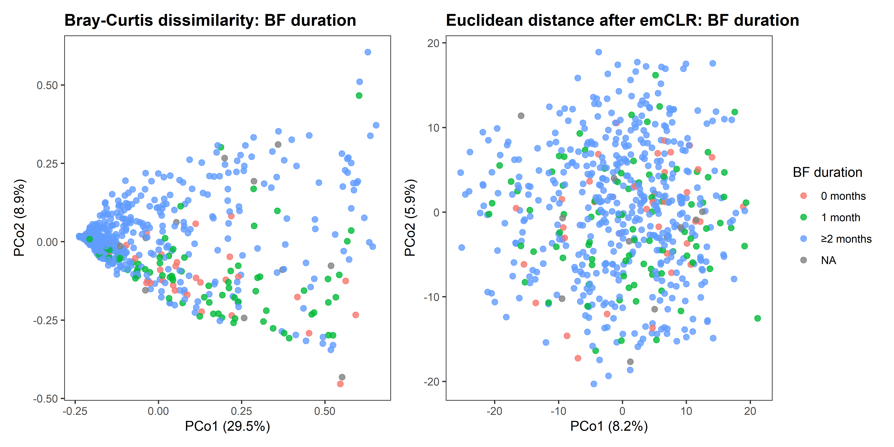<!-- -->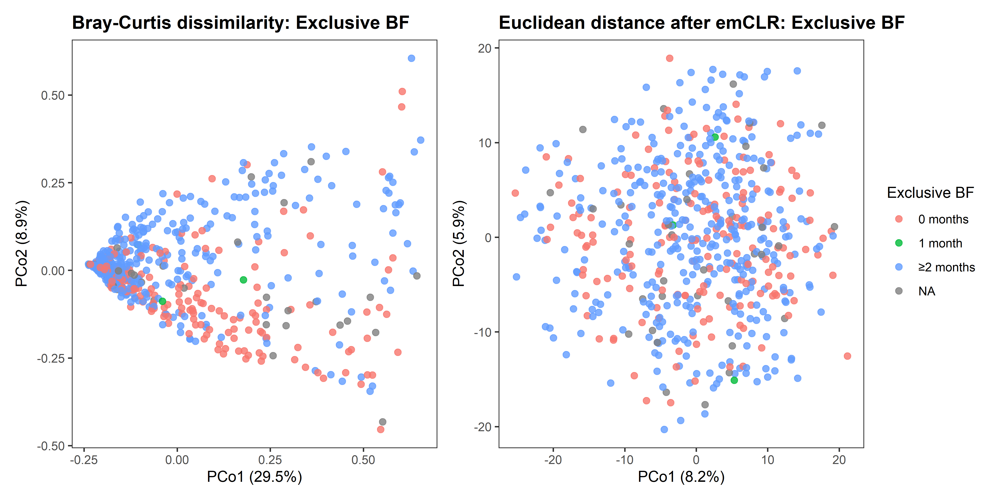<!-- -->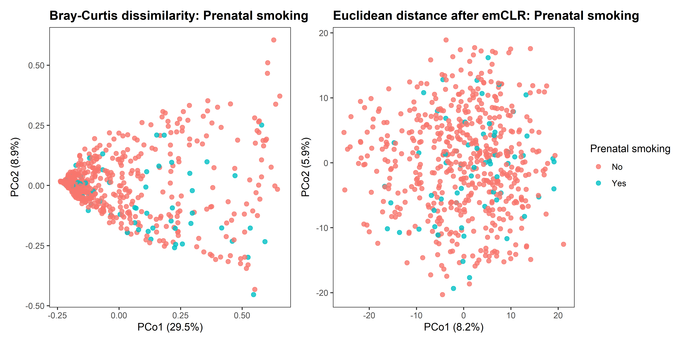<!-- -->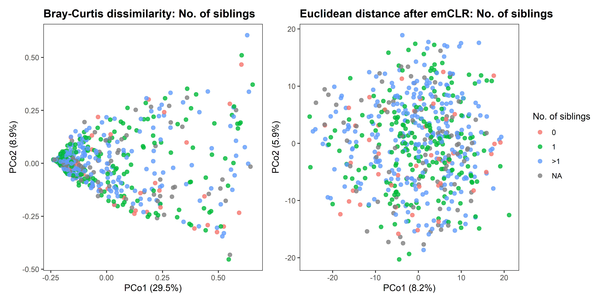<!-- -->

None of the variables examined produce visually discernible separation
in either ordination. Specifically:

- Country (Austria, Germany, Switzerland): The three groups are
  thoroughly intermixed along both axes in both ordinations. If
  country-level effects on microbiome composition exist, they do not
  dominate the major axes of variation captured here.
- Sex: No separation is visible. Male and female samples overlap
  completely.
- Delivery mode: Cesarean samples are scattered across the same space as
  vaginal births. The relatively small number of cesarean samples limits
  visual detection of any potential signal.
- BF duration / Exclusive BF: Both breastfeeding variables show the same
  mixed pattern. Samples from all duration categories are intermingled,
  with no gradient along PCo1 or PCo2. This does not rule out a
  breastfeeding effect, but suggests it is not among the dominant
  sources of between-sample variation.
- Prenatal smoking / No. of siblings: No visual structure.

### Distance matrix heatmaps

These heatmaps are mainly diagnostic. For several hundred samples, they
become visually dense, but they are useful for checking whether strong
blocks or outlying samples occur.

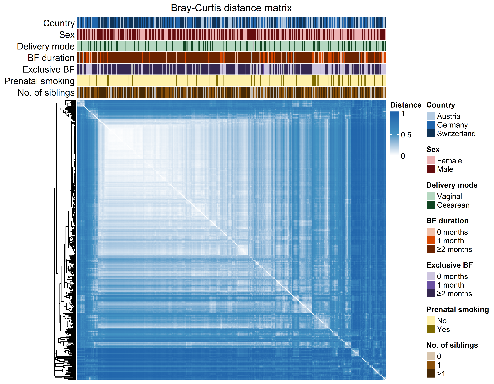<!-- -->

The Bray-Curtis distance heatmap reveals a block of samples in the
upper-left cluster (after hierarchical reordering) that are
substantially more similar to each other than to the rest of the cohort
— visible as a lighter region against the predominantly dark-blue
background. This suggests some subgroup of samples shares a notably
similar community composition. The annotation bars do not immediately
reveal a single metadata variable that cleanly aligns with this block,
so the driver of this cluster is not apparent from the variables
available here.

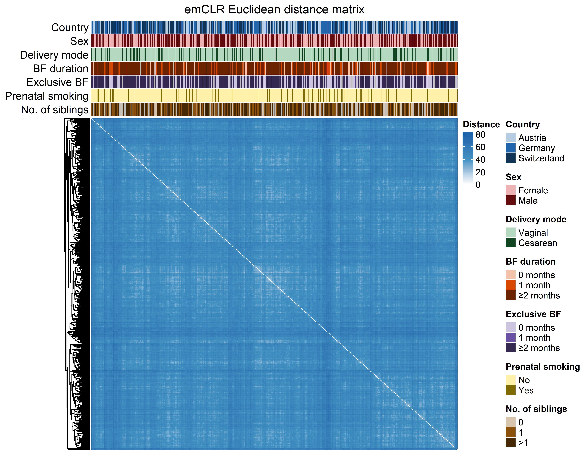<!-- -->

The emCLR heatmap is considerably more homogeneous: distances are more
uniformly distributed with less pronounced block structure, which is
consistent with the more diffuse spread seen in its ordination.

## PERMANOVA and PERMDISP

The following analyses are performed for both beta-diversity
representations: Bray-Curtis dissimilarity on relative abundance
profiles and Euclidean distance after emCLR transformation. PERMANOVA is
used to test for differences in group centroids, while PERMDISP assesses
differences in within-group dispersion.

    ##            Country                Sex           cesarean    breast_dur_cat1   breast_excl_cat1          pregsmoke      sibs_numb_cat 
    ##          "Country"              "Sex"    "Delivery mode"      "BF duration"     "Exclusive BF" "Prenatal smoking"  "No. of siblings"

### Parallel backend and progress reporting

### Helper functions for permutation-based testing

### PERMANOVA

    ## # A tibble: 14 × 12
    ##    analysis  distance        variable        n_samples n_groups statistic_obs p_empirical statistic_adonis2 r2_adonis2 p_adonis2 n_exceed n_perm
    ##    <chr>     <chr>           <fct>               <int>    <int>         <dbl>       <dbl>             <dbl>      <dbl>     <dbl>    <int>  <dbl>
    ##  1 PERMANOVA Bray-Curtis     Country               592        3          4.56       0.001              4.56    0.0152      0.001        0    999
    ##  2 PERMANOVA Bray-Curtis     Sex                   592        2          1.36       0.188              1.36    0.00229     0.163      187    999
    ##  3 PERMANOVA Bray-Curtis     Delivery mode         589        2          3.67       0.011              3.67    0.00621     0.005       10    999
    ##  4 PERMANOVA Bray-Curtis     BF duration           580        3         14.4        0.001             14.4     0.0474      0.001        0    999
    ##  5 PERMANOVA Bray-Curtis     Exclusive BF          557        3         10.2        0.001             10.2     0.0355      0.001        0    999
    ##  6 PERMANOVA Bray-Curtis     Prenatal smoki…       592        2          5.66       0.002              5.66    0.00950     0.001        1    999
    ##  7 PERMANOVA Bray-Curtis     No. of siblings       503        3          2.22       0.021              2.22    0.00879     0.021       20    999
    ##  8 PERMANOVA emCLR Euclidean Country               592        3          2.76       0.001              2.76    0.00930     0.001        0    999
    ##  9 PERMANOVA emCLR Euclidean Sex                   592        2          1.27       0.09               1.27    0.00214     0.098       89    999
    ## 10 PERMANOVA emCLR Euclidean Delivery mode         589        2          1.53       0.013              1.53    0.00261     0.018       12    999
    ## 11 PERMANOVA emCLR Euclidean BF duration           580        3          3.70       0.001              3.70    0.0127      0.001        0    999
    ## 12 PERMANOVA emCLR Euclidean Exclusive BF          557        3          3.45       0.001              3.45    0.0123      0.001        0    999
    ## 13 PERMANOVA emCLR Euclidean Prenatal smoki…       592        2          2.15       0.001              2.15    0.00364     0.001        0    999
    ## 14 PERMANOVA emCLR Euclidean No. of siblings       503        3          1.19       0.119              1.19    0.00472     0.109      118    999

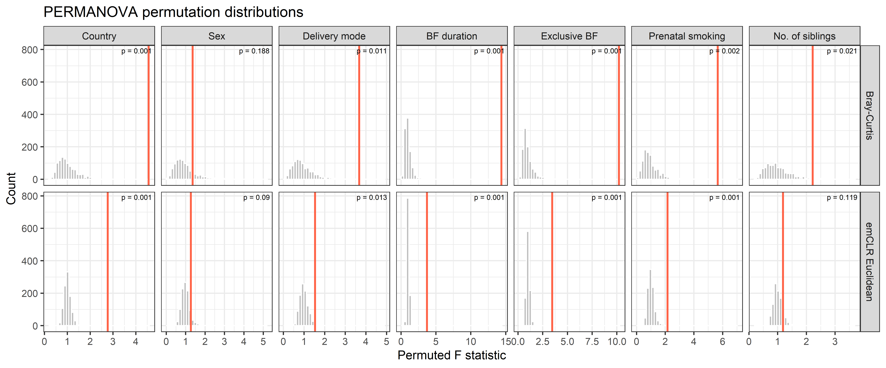<!-- -->

**Mean and median of permutation distributions**

    ## `summarise()` has regrouped the output.
    ## ℹ Summaries were computed grouped by distance and variable.
    ## ℹ Output is grouped by distance.
    ## ℹ Use `summarise(.groups = "drop_last")` to silence this message.
    ## ℹ Use `summarise(.by = c(distance, variable))` for per-operation grouping (`?dplyr::dplyr_by`) instead.

    ## # A tibble: 14 × 4
    ## # Groups:   distance [2]
    ##    distance        variable          mean median
    ##    <chr>           <fct>            <dbl>  <dbl>
    ##  1 Bray-Curtis     Country          1.02   0.911
    ##  2 Bray-Curtis     Sex              0.974  0.850
    ##  3 Bray-Curtis     Delivery mode    1.00   0.848
    ##  4 Bray-Curtis     BF duration      0.984  0.887
    ##  5 Bray-Curtis     Exclusive BF     0.994  0.840
    ##  6 Bray-Curtis     Prenatal smoking 0.993  0.854
    ##  7 Bray-Curtis     No. of siblings  1.00   0.926
    ##  8 emCLR Euclidean Country          1.00   0.995
    ##  9 emCLR Euclidean Sex              0.992  0.980
    ## 10 emCLR Euclidean Delivery mode    0.995  0.974
    ## 11 emCLR Euclidean BF duration      0.999  0.989
    ## 12 emCLR Euclidean Exclusive BF     1.01   0.990
    ## 13 emCLR Euclidean Prenatal smoking 1.01   0.986
    ## 14 emCLR Euclidean No. of siblings  1.00   0.986

### PERMANOVA p-value refinement with permApprox

    ## permApprox result
    ## -----------------
    ## Number of tests             : 14
    ## Approximation method        : GPD tail approximation
    ## Approximation threshold     : p-values <0.05
    ## Multiple testing adjustment : none
    ## 
    ## Successful fits          : 11
    ## GOF rejections           : 0
    ## Fit failed               : 0
    ## No threshold found       : 0
    ## Discrete distributions   : 0
    ## Not selected for fitting : 3
    ## 
    ## Final p-values:
    ##   min = 2.233e-42, median = 4.334e-04, max = 1.880e-01
    ## 
    ## Use summary() for detailed fit diagnostics.

    ## Summary of permApprox result
    ## ----------------------------
    ## Number of tests             : 14
    ## Approximation method        : GPD tail approximation
    ## Approximation threshold     : p-values <0.05
    ## Multiple testing adjustment : none
    ## 
    ## Fit status counts:
    ##   Successful fits          : 11
    ##   GOF rejections           : 0
    ##   Fit failed               : 0
    ##   No threshold found       : 0
    ##   Discrete distributions   : 0
    ##   Not selected for fitting : 3
    ## 
    ## GPD parameter summary (successful fits)
    ## --------------------------------------
    ##   shape:
    ##     min = -0.0841, median = -0.0121, mean = 0.00458, max = 0.155
    ##   scale:
    ##     min = 0.108, median = 0.375, mean = 0.321, max = 0.556
    ##   n_exceed:
    ##     min =  220, median =  250, mean =  246, max =  250
    ## 
    ## P-value summary
    ## ---------------
    ## Empirical p-values:
    ##   empirical:
    ##     min = 1.000e-03, median = 1.500e-03, mean = 3.221e-02, max = 1.880e-01
    ## 
    ## Final p-values (unadjusted):
    ##   unadjusted:
    ##     min = 2.233e-42, median = 4.334e-04, mean = 3.150e-02, max = 1.880e-01

    ## # A tibble: 14 × 9
    ##    distance        variable         n_samples statistic_obs n_exceed n_perm p_empirical p_permapprox method_used
    ##    <chr>           <fct>                <int>         <dbl>    <int>  <dbl>       <dbl>        <dbl> <chr>      
    ##  1 Bray-Curtis     Country                592          4.56        0    999       0.001     1.30e- 4 gpd        
    ##  2 Bray-Curtis     Sex                    592          1.36      187    999       0.188     1.88e- 1 empirical  
    ##  3 Bray-Curtis     Delivery mode          589          3.67       10    999       0.011     7.73e- 3 gpd        
    ##  4 Bray-Curtis     BF duration            580         14.4         0    999       0.001     1.87e-12 gpd        
    ##  5 Bray-Curtis     Exclusive BF           557         10.2         0    999       0.001     1.59e- 6 gpd        
    ##  6 Bray-Curtis     Prenatal smoking       592          5.66        1    999       0.002     6.59e- 4 gpd        
    ##  7 Bray-Curtis     No. of siblings        503          2.22       20    999       0.021     2.04e- 2 gpd        
    ##  8 emCLR Euclidean Country                592          2.76        0    999       0.001     1.36e-19 gpd        
    ##  9 emCLR Euclidean Sex                    592          1.27       89    999       0.09      9   e- 2 empirical  
    ## 10 emCLR Euclidean Delivery mode          589          1.53       12    999       0.013     1.48e- 2 gpd        
    ## 11 emCLR Euclidean BF duration            580          3.70        0    999       0.001     2.23e-42 gpd        
    ## 12 emCLR Euclidean Exclusive BF           557          3.45        0    999       0.001     3.65e-22 gpd        
    ## 13 emCLR Euclidean Prenatal smoking       592          2.15        0    999       0.001     2.08e- 4 gpd        
    ## 14 emCLR Euclidean No. of siblings        503          1.19      118    999       0.119     1.19e- 1 empirical

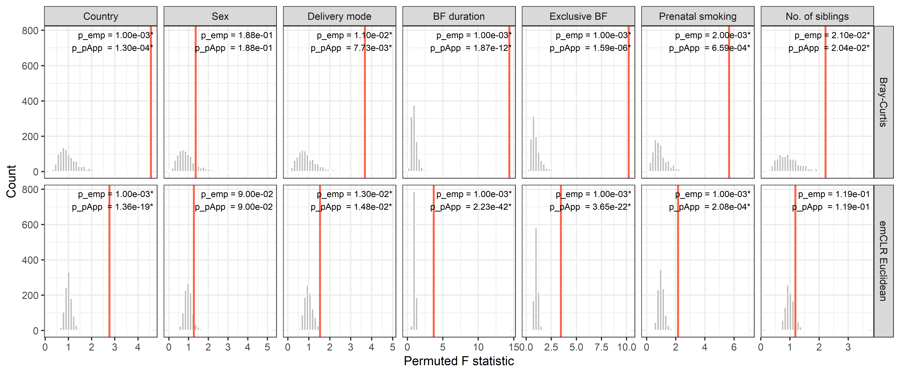<!-- -->

### PERMDISP

    ## # A tibble: 14 × 11
    ##    analysis distance        variable         n_samples n_groups statistic_obs p_empirical statistic_betadisper p_betadisper n_exceed n_perm
    ##    <chr>    <chr>           <fct>                <int>    <int>         <dbl>       <dbl>                <dbl>        <dbl>    <int>  <dbl>
    ##  1 PERMDISP Bray-Curtis     Country                592        3        10.7         0.005               10.7          0.001        4    999
    ##  2 PERMDISP Bray-Curtis     Sex                    592        2         2.66        0.221                2.66         0.111      220    999
    ##  3 PERMDISP Bray-Curtis     Delivery mode          589        2         8.72        0.035                8.72         0.003       34    999
    ##  4 PERMDISP Bray-Curtis     BF duration            580        3        15.2         0.002               15.2          0.001        1    999
    ##  5 PERMDISP Bray-Curtis     Exclusive BF           557        3         8.60        0.005                8.60         0.001        4    999
    ##  6 PERMDISP Bray-Curtis     Prenatal smoking       592        2         6.67        0.048                6.67         0.011       47    999
    ##  7 PERMDISP Bray-Curtis     No. of siblings        503        3         5.79        0.043                5.79         0.006       42    999
    ##  8 PERMDISP emCLR Euclidean Country                592        3        10.7         0.001               10.7          0.001        0    999
    ##  9 PERMDISP emCLR Euclidean Sex                    592        2         0.618       0.445                0.618        0.431      444    999
    ## 10 PERMDISP emCLR Euclidean Delivery mode          589        2         0.967       0.335                0.967        0.313      334    999
    ## 11 PERMDISP emCLR Euclidean BF duration            580        3        19.7         0.001               19.7          0.001        0    999
    ## 12 PERMDISP emCLR Euclidean Exclusive BF           557        3        16.4         0.001               16.4          0.001        0    999
    ## 13 PERMDISP emCLR Euclidean Prenatal smoking       592        2         8.05        0.004                8.05         0.007        3    999
    ## 14 PERMDISP emCLR Euclidean No. of siblings        503        3         0.343       0.725                0.343        0.732      724    999

### PERMDISP p-value refinement with permApprox

    ## permApprox result
    ## -----------------
    ## Number of tests             : 14
    ## Approximation method        : GPD tail approximation
    ## Approximation threshold     : p-values <0.05
    ## Multiple testing adjustment : none
    ## 
    ## Successful fits          : 10
    ## GOF rejections           : 0
    ## Fit failed               : 0
    ## No threshold found       : 0
    ## Discrete distributions   : 0
    ## Not selected for fitting : 4
    ## 
    ## Final p-values:
    ##   min = 7.769e-08, median = 1.685e-02, max = 7.250e-01
    ## 
    ## Use summary() for detailed fit diagnostics.

    ## # A tibble: 14 × 9
    ##    distance        variable         n_samples statistic_obs n_exceed n_perm p_empirical p_permapprox method_used
    ##    <chr>           <fct>                <int>         <dbl>    <int>  <dbl>       <dbl>        <dbl> <chr>      
    ##  1 Bray-Curtis     Country                592        10.7          4    999       0.005 0.00265      gpd        
    ##  2 Bray-Curtis     Sex                    592         2.66       220    999       0.221 0.221        empirical  
    ##  3 Bray-Curtis     Delivery mode          589         8.72        34    999       0.035 0.0292       gpd        
    ##  4 Bray-Curtis     BF duration            580        15.2          1    999       0.002 0.000528     gpd        
    ##  5 Bray-Curtis     Exclusive BF           557         8.60         4    999       0.005 0.00378      gpd        
    ##  6 Bray-Curtis     Prenatal smoking       592         6.67        47    999       0.048 0.0464       gpd        
    ##  7 Bray-Curtis     No. of siblings        503         5.79        42    999       0.043 0.0487       gpd        
    ##  8 emCLR Euclidean Country                592        10.7          0    999       0.001 0.000000297  gpd        
    ##  9 emCLR Euclidean Sex                    592         0.618      444    999       0.445 0.445        empirical  
    ## 10 emCLR Euclidean Delivery mode          589         0.967      334    999       0.335 0.335        empirical  
    ## 11 emCLR Euclidean BF duration            580        19.7          0    999       0.001 0.00000343   gpd        
    ## 12 emCLR Euclidean Exclusive BF           557        16.4          0    999       0.001 0.0000000777 gpd        
    ## 13 emCLR Euclidean Prenatal smoking       592         8.05         3    999       0.004 0.00449      gpd        
    ## 14 emCLR Euclidean No. of siblings        503         0.343      724    999       0.725 0.725        empirical

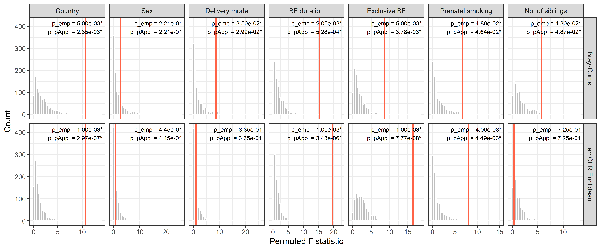<!-- -->

## Within-group dispersion

Each sample’s distance to its group centroid, as used by PERMDISP.
Unequal box heights across groups indicate heterogeneous dispersion
(PERMDISP signal). PERMANOVA tests whether the centroids themselves are
at different positions in composition space — a complementary question
that requires an ordination plot to visualise directly.

Panels are annotated with permApprox-refined p-values for PERMANOVA
(PERM) and PERMDISP (DISP).

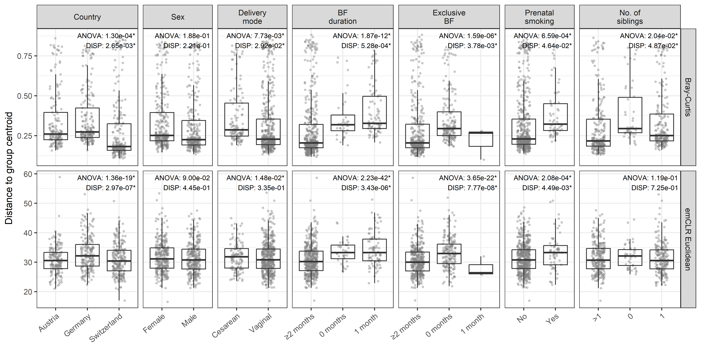<!-- -->

## Files written

These files have been written to the target directory,
`data/03_beta_diversity`:

    ## # A tibble: 11 × 4
    ##    path                             type         size modification_time  
    ##    <fs::path>                       <fct> <fs::bytes> <dttm>             
    ##  1 beta_data_summary.csv            file          131 2026-05-20 14:03:58
    ##  2 beta_diversity_objects.rds       file        2.95M 2026-05-20 14:03:58
    ##  3 beta_emclr_sample_offsets.csv    file       17.16K 2026-05-20 14:03:58
    ##  4 beta_emclr_summary.csv           file          199 2026-05-20 14:03:58
    ##  5 beta_pcoa_coordinates.csv        file      140.73K 2026-05-20 14:03:59
    ##  6 permanova_permapprox_results.rds file       72.59K 2026-05-20 06:36:20
    ##  7 permanova_results.rds            file      103.81K 2026-05-19 14:29:56
    ##  8 permanova_table.tex              file        2.18K 2026-05-20 14:04:53
    ##  9 permdisp_permapprox_results.rds  file       71.08K 2026-05-20 09:24:56
    ## 10 permdisp_results.rds             file      105.52K 2026-05-20 09:20:41
    ## 11 permdisp_table.tex               file        2.21K 2026-05-20 14:04:58
