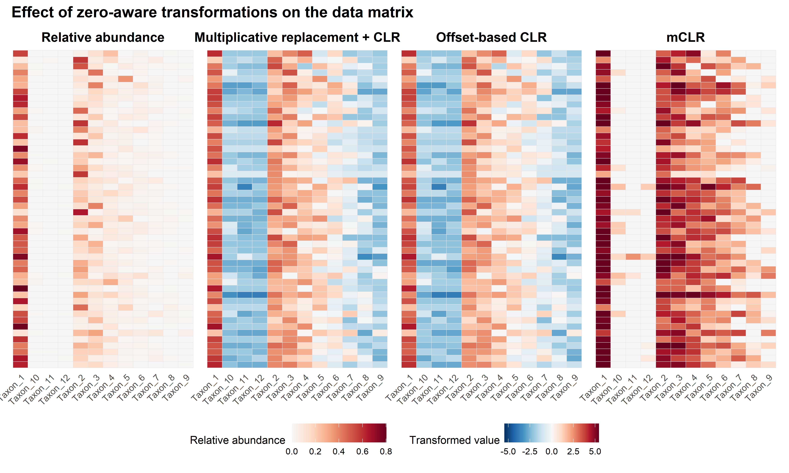
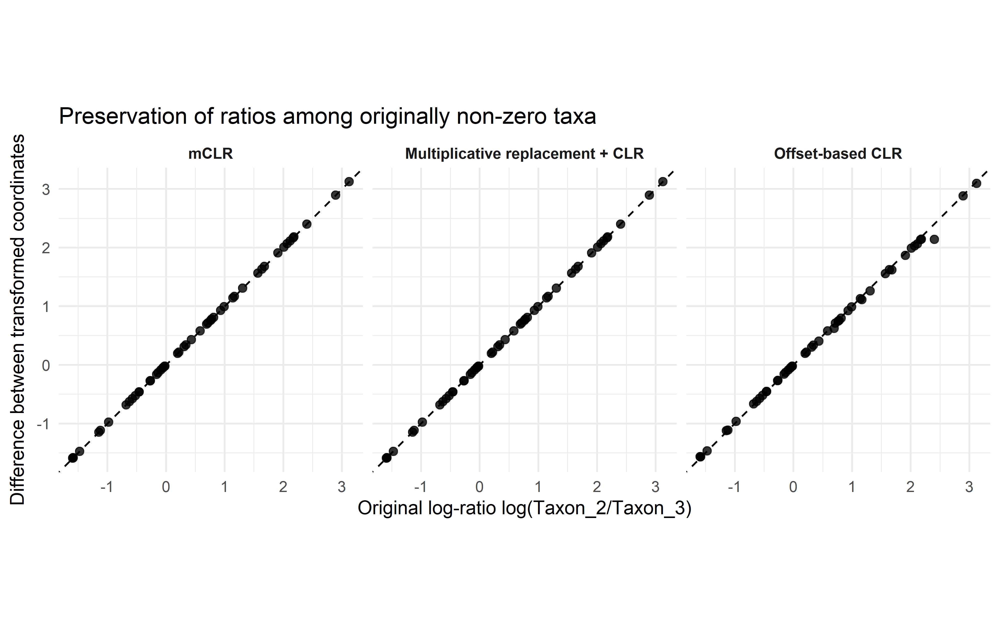
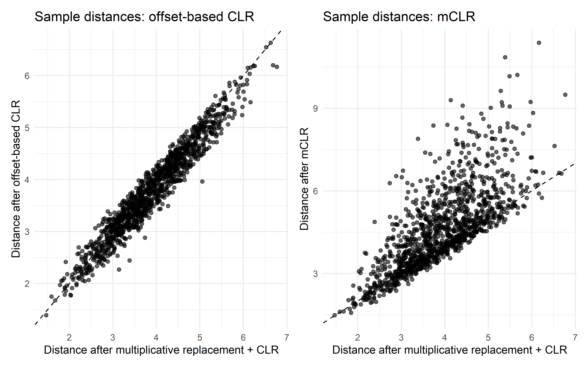
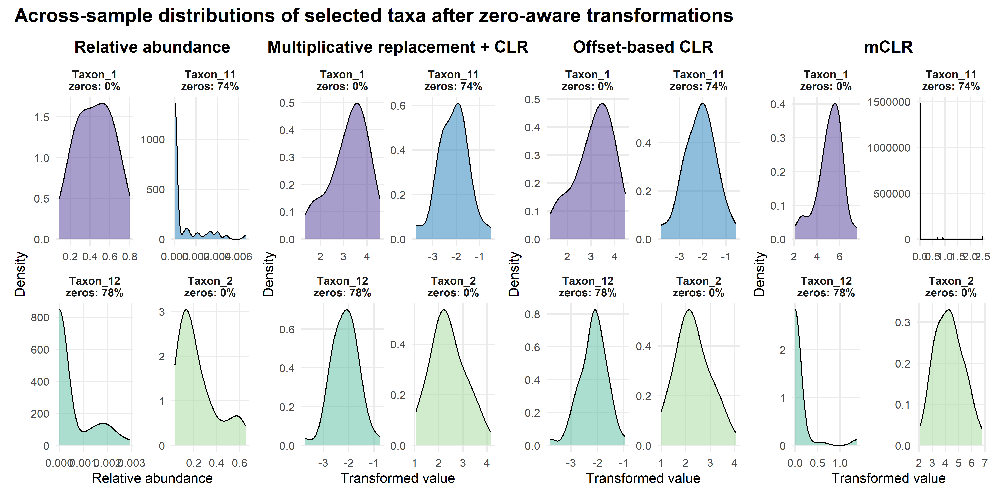
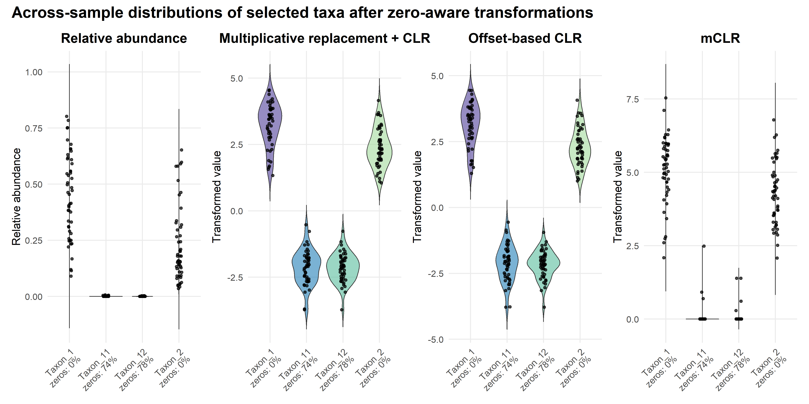
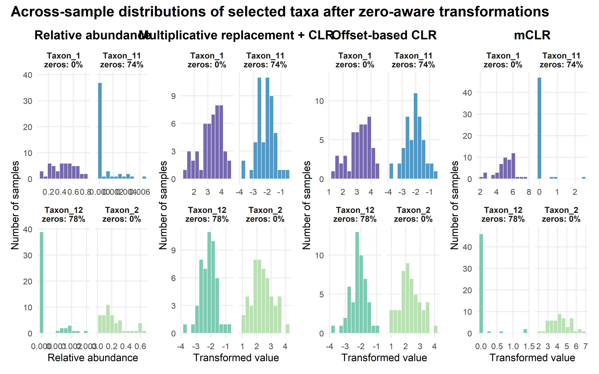
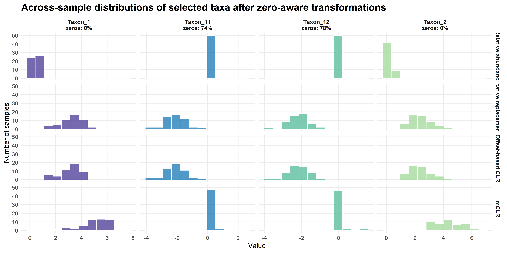
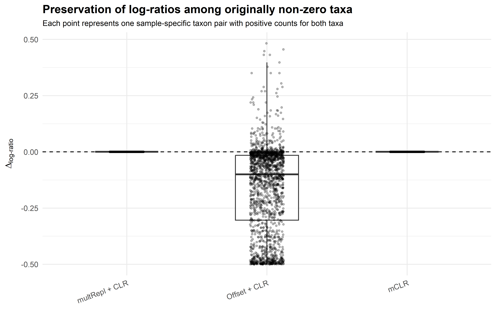
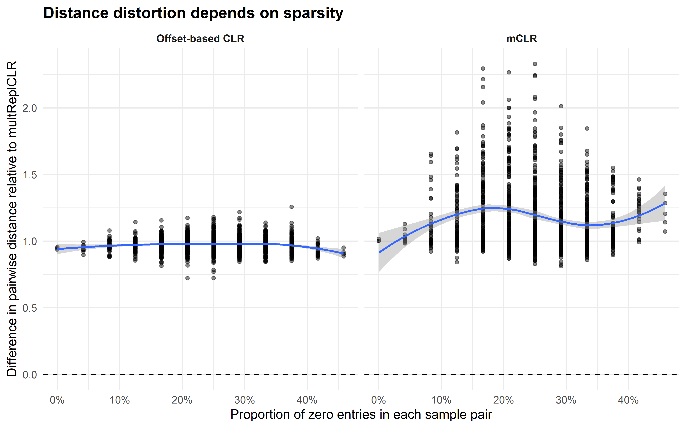
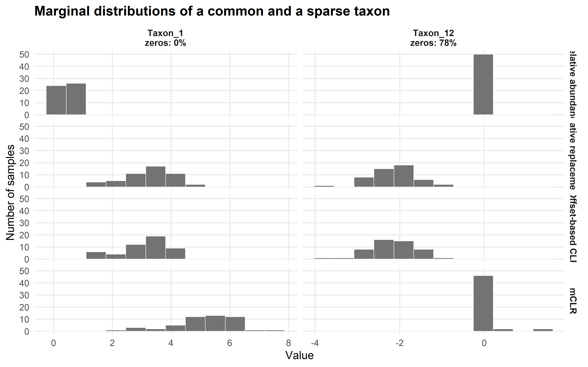

CLR example
================
Compiled at 2026-06-02 09:43:52 UTC

## Zero-aware CLR example for thesis chapter 2

<!-- -->

<!-- -->

<!-- -->

    ## # A tibble: 12 × 3
    ##    taxon    zero_prop mean_rel_abundance
    ##    <chr>        <dbl>              <dbl>
    ##  1 Taxon_12      0.78           0.000407
    ##  2 Taxon_11      0.74           0.000756
    ##  3 Taxon_10      0.5            0.00254 
    ##  4 Taxon_9       0.48           0.00385 
    ##  5 Taxon_8       0.34           0.00571 
    ##  6 Taxon_7       0.16           0.0173  
    ##  7 Taxon_1       0              0.449   
    ##  8 Taxon_2       0              0.227   
    ##  9 Taxon_3       0              0.142   
    ## 10 Taxon_4       0              0.0691  
    ## 11 Taxon_5       0              0.0517  
    ## 12 Taxon_6       0              0.0309

    ## [1] "Taxon_1"  "Taxon_11" "Taxon_12" "Taxon_2"

<!-- -->

<!-- -->

<!-- -->

<!-- --> \##
Diagnostic 1: Log-ratio preservation

Here, we plot on they axis for each pair of non-zero counts:

$$\Delta_{\text{log-ratio}}
=
\underbrace{
\left(T_i(x_k)-T_j(x_k)\right)
}_{\text{log-ratio after transformation}}
-
\underbrace{
\log\left(\frac{x_{ki}}{x_{kj}}\right)
}_{\text{original log-ratio}}.$$

<!-- -->

This diagnostic is particularly relevant for association and
proportionality analyses, where pairwise log-ratio information and its
variation across samples are central to the inferential target. For
CLR-based association measures and proportionality analyses,
multiplicative replacement followed by CLR is therefore used as the
primary strategy in this thesis. The mCLR transformation also preserves
positive-positive log-ratios, but it retains zeros as exact zeros and
induces a different sample geometry; it is therefore used only when it
is part of a method-specific model or transformation.

## Diagnostic 2: Distance distortion and zero burden

<!-- -->

For offset-based CLR, the distance differences are small and mostly
slightly negative. This means that offset-based CLR gives a sample
geometry that is broadly similar to multiplicative replacement + CLR,
but tends to compress distances a little. The effect becomes somewhat
stronger for highly sparse sample pairs. That makes sense because adding
a positive offset to all components reduces the extremeness of zeros,
but also changes the ratios among originally non-zero taxa.

For mCLR, the distance differences are much larger and mostly positive.
This means that mCLR often makes sample pairs substantially farther
apart than multiplicative replacement + CLR. The effect is clearly
stronger when sample pairs contain more zeros. This is also expected:
mCLR leaves zeros at exactly zero and transforms only the positive
components relative to their positive-part geometric mean, so it induces
a different geometry from standard CLR-based Aitchison geometry.

This plot supports the argument that zero handling is not neutral for
distance-based analyses. If the downstream method uses Euclidean
distances between transformed compositions, as in Aitchison distance,
ordination, PERMANOVA, or CLR-based multivariate regression, then the
zero-aware transformation directly changes the geometry on which the
analysis is based.

## Diagnostic 3: Marginal distributions of one common and one sparse taxon

<!-- -->

## Files written

These files have been written to the target directory,
`data/CLR_example`:

    ## # A tibble: 0 × 4
    ## # ℹ 4 variables: path <fs::path>, type <fct>, size <fs::bytes>, modification_time <dttm>
